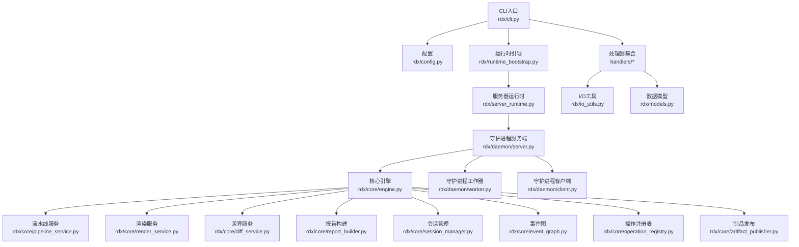
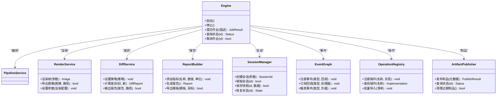
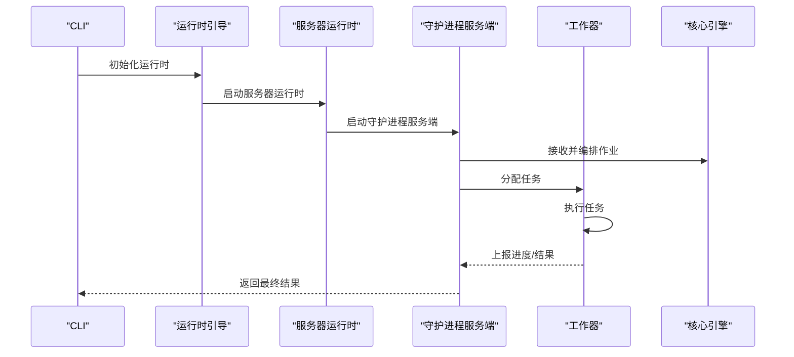
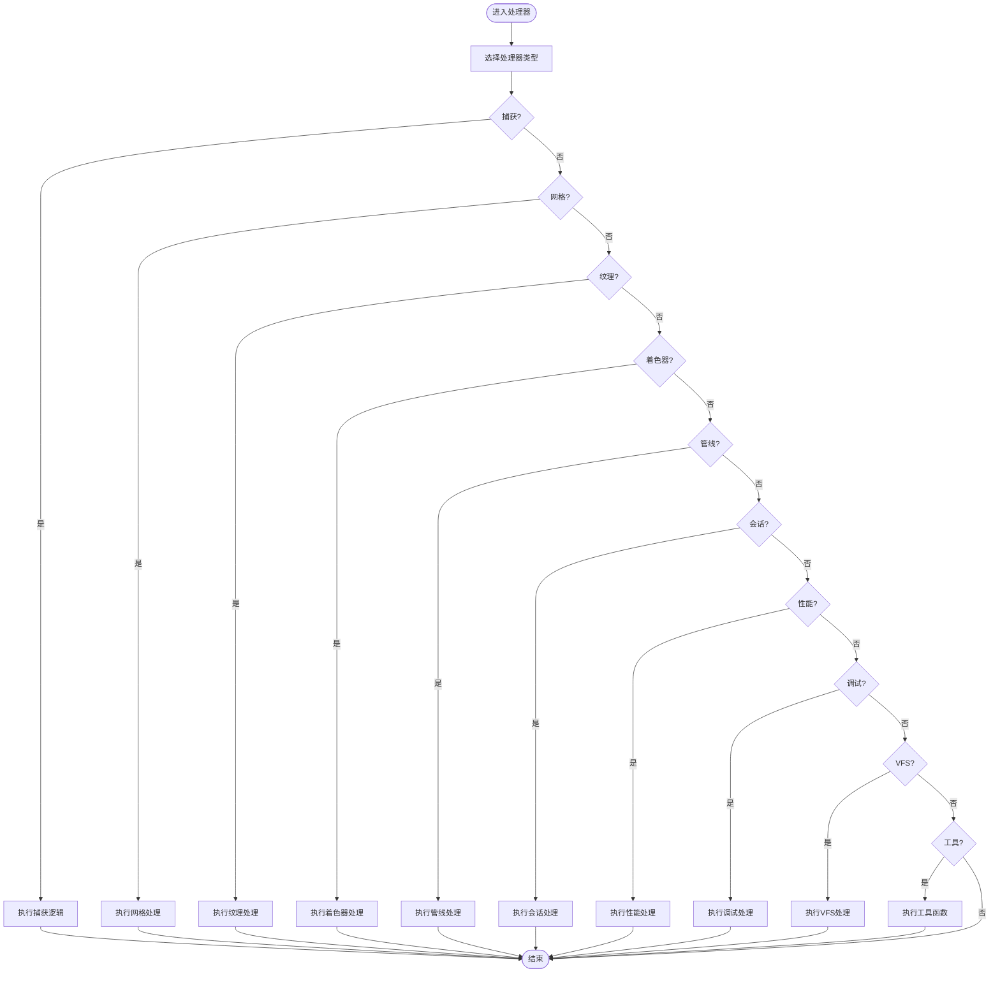
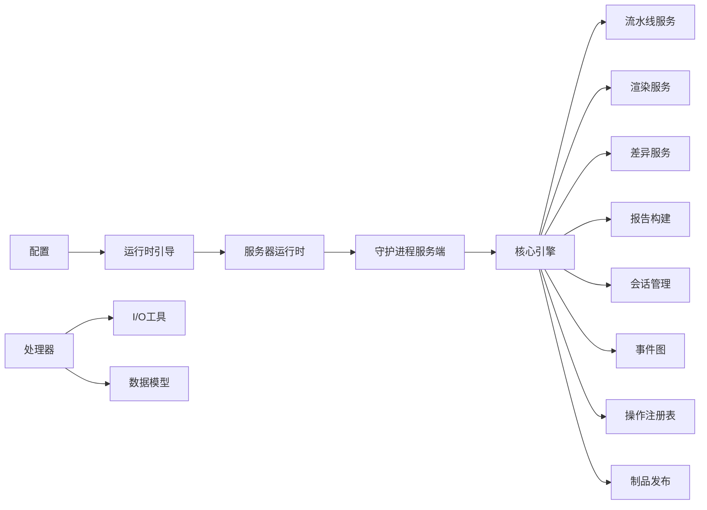

# API参考

<cite>
**本文引用的文件**
- [__init__.py](file://rdx/__init__.py)
- [cli.py](file://rdx/cli.py)
- [config.py](file://rdx/config.py)
- [models.py](file://rdx/models.py)
- [io_utils.py](file://rdx/io_utils.py)
- [python_runtime.py](file://rdx/python_runtime.py)
- [runtime_bootstrap.py](file://rdx/runtime_bootstrap.py)
- [runtime_worker.py](file://rdx/runtime_worker.py)
- [runtime_worker_state.py](file://rdx/runtime_worker_state.py)
- [runtime_state.py](file://rdx/runtime_state.py)
- [runtime_paths.py](file://rdx/runtime_paths.py)
- [runtime_requirements.py](file://rdx/runtime_requirements.py)
- [runtime_catalog.py](file://rdx/runtime_catalog.py)
- [server.py](file://rdx/server.py)
- [server_runtime.py](file://rdx/server_runtime.py)
- [timeout_policy.py](file://rdx/timeout_policy.py)
- [tool_router.py](file://rdx/tool_router.py)
- [daemon/client.py](file://rdx/daemon/client.py)
- [daemon/server.py](file://rdx/daemon/server.py)
- [daemon/worker.py](file://rdx/daemon/worker.py)
- [handlers/capture.py](file://rdx/handlers/capture.py)
- [handlers/mesh.py](file://rdx/handlers/mesh.py)
- [handlers/texture.py](file://rdx/handlers/texture.py)
- [handlers/shader.py](file://rdx/handlers/shader.py)
- [handlers/pipeline.py](file://rdx/handlers/pipeline.py)
- [handlers/session.py](file://rdx/handlers/session.py)
- [handlers/perf.py](file://rdx/handlers/perf.py)
- [handlers/debug.py](file://rdx/handlers/debug.py)
- [handlers/vfs.py](file://rdx/handlers/vfs.py)
- [handlers/util.py](file://rdx/handlers/util.py)
- [core/engine.py](file://rdx/core/engine.py)
- [core/pipeline_service.py](file://rdx/core/pipeline_service.py)
- [core/render_service.py](file://rdx/core/render_service.py)
- [core/diff_service.py](file://rdx/core/diff_service.py)
- [core/report_builder.py](file://rdx/core/report_builder.py)
- [core/session_manager.py](file://rdx/core/session_manager.py)
- [core/event_graph.py](file://rdx/core/event_graph.py)
- [core/operation_registry.py](file://rdx/core/operation_registry.py)
- [core/artifact_publisher.py](file://rdx/core/artifact_publisher.py)
- [core/contracts.py](file://rdx/core/contracts.py)
- [core/errors.py](file://rdx/core/errors.py)
- [utils/artifact_store.py](file://rdx/utils/artifact_store.py)
- [utils/image_utils.py](file://rdx/utils/image_utils.py)
- [utils/scheduler.py](file://rdx/utils/scheduler.py)
- [preview_window.py](file://rdx/preview_window.py)
- [progress.py](file://rdx/progress.py)
- [context_snapshot.py](file://rdx/context_snapshot.py)
- [remote_bootstrap.py](file://rdx/remote_bootstrap.py)
- [timeout_policy.py](file://rdx/timeout_policy.py)
</cite>

## 目录
1. [简介](#简介)
2. [项目结构](#项目结构)
3. [核心组件](#核心组件)
4. [架构总览](#架构总览)
5. [详细组件分析](#详细组件分析)
6. [依赖关系分析](#依赖关系分析)
7. [性能考量](#性能考量)
8. [故障排查指南](#故障排查指南)
9. [结论](#结论)
10. [附录](#附录)

## 简介
本API参考面向RDC-Agent-Tools的Python接口，系统性梳理公共API（类、方法、函数、属性）的定义与用法，覆盖配置、I/O工具、数据模型、核心服务与运行时等模块。文档同时提供参数说明、返回值类型、异常处理策略、使用示例与最佳实践，并对版本兼容性、弃用策略与迁移建议进行说明，帮助开发者高效、安全地集成与扩展。

## 项目结构
项目采用分层与功能域结合的组织方式：
- rdx：核心包，包含入口、CLI、配置、模型、I/O工具、运行时、服务器、守护进程、处理器与工具集
- rdx/core：核心引擎与服务（流水线、渲染、差异、报告、会话、事件图、操作注册表、制品发布）
- rdx/daemon：守护进程客户端、服务端与工作器
- rdx/handlers：资源与流程处理（捕获、网格、纹理、着色器、管线、会话、性能、调试、VFS等）
- rdx/utils：通用工具（制品存储、图像处理、调度）

```mermaid
graph TB
subgraph "核心包(rdx)"
RDX["rdx 包<br/>入口/CLI/配置/模型/I-O/运行时/服务器/守护进程/处理器/工具"]
end
subgraph "核心服务(core)"
CORE_ENGINE["engine.py"]
PIPELINE["pipeline_service.py"]
RENDER["render_service.py"]
DIFF["diff_service.py"]
REPORT["report_builder.py"]
SESSION["session_manager.py"]
EVENT["event_graph.py"]
OPREG["operation_registry.py"]
ART["artifact_publisher.py"]
end
subgraph "守护进程(daemon)"
D_CLIENT["client.py"]
D_SERVER["server.py"]
D_WORKER["worker.py"]
end
subgraph "处理器(handlers)"
CAP["capture.py"]
MESH["mesh.py"]
TEX["texture.py"]
SHD["shader.py"]
PIPEH["pipeline.py"]
SESS["session.py"]
PERF["perf.py"]
DBG["debug.py"]
VFS["vfs.py"]
UTIL["util.py"]
end
subgraph "工具(utils)"
ARTSTORE["artifact_store.py"]
IMGUTIL["image_utils.py"]
SCHED["scheduler.py"]
end
RDX --> CORE_ENGINE
RDX --> PIPELINE
RDX --> RENDER
RDX --> DIFF
RDX --> REPORT
RDX --> SESSION
RDX --> EVENT
RDX --> OPREG
RDX --> ART
RDX --> D_CLIENT
RDX --> D_SERVER
RDX --> D_WORKER
RDX --> CAP
RDX --> MESH
RDX --> TEX
RDX --> SHD
RDX --> PIPEH
RDX --> SESS
RDX --> PERF
RDX --> DBG
RDX --> VFS
RDX --> UTIL
RDX --> ARTSTORE
RDX --> IMGUTIL
RDX --> SCHED
```

图表来源
- [__init__.py](file://rdx/__init__.py)
- [core/engine.py](file://rdx/core/engine.py)
- [core/pipeline_service.py](file://rdx/core/pipeline_service.py)
- [core/render_service.py](file://rdx/core/render_service.py)
- [daemon/client.py](file://rdx/daemon/client.py)
- [handlers/capture.py](file://rdx/handlers/capture.py)
- [utils/artifact_store.py](file://rdx/utils/artifact_store.py)

章节来源
- [__init__.py](file://rdx/__init__.py)
- [cli.py](file://rdx/cli.py)
- [config.py](file://rdx/config.py)
- [models.py](file://rdx/models.py)
- [io_utils.py](file://rdx/io_utils.py)

## 核心组件
本节概述公共API的总体构成与职责边界，便于快速定位目标接口。

- 配置API
  - 提供运行时配置加载、校验与合并能力，支持默认值与环境变量注入
  - 关键对象：配置类、配置项枚举、配置验证器
  - 典型用途：初始化运行时、设置超时策略、控制日志级别

- I/O工具
  - 文件系统抽象、二进制读写、流式处理、压缩与解压
  - 关键对象：I/O上下文、文件句柄包装、缓冲区管理
  - 典型用途：资源导出、中间产物读写、批处理

- 数据模型
  - 定义实验、会话、资源、事件、制品等核心实体的数据结构与序列化
  - 关键对象：模型类、字段约束、转换器
  - 典型用途：跨模块数据交换、持久化与传输

- 核心服务
  - 引擎：执行流水线、编排任务
  - 渲染服务：生成预览与结果
  - 差异服务：对比前后状态
  - 报告构建：汇总结果与指标
  - 会话管理：生命周期与状态
  - 事件图：事件驱动的编排
  - 操作注册表：动态扩展能力
  - 制品发布：输出物归档与分发

- 运行时与守护进程
  - 运行时引导：环境准备、依赖解析、启动脚手架
  - 守护进程：客户端、服务端、工作器，负责远程执行与状态同步

- 处理器
  - 资源处理器：捕获、网格、纹理、着色器、管线、会话、性能、调试、VFS等
  - 工具：通用辅助函数与工具类

章节来源
- [config.py](file://rdx/config.py)
- [io_utils.py](file://rdx/io_utils.py)
- [models.py](file://rdx/models.py)
- [core/engine.py](file://rdx/core/engine.py)
- [core/render_service.py](file://rdx/core/render_service.py)
- [core/diff_service.py](file://rdx/core/diff_service.py)
- [core/report_builder.py](file://rdx/core/report_builder.py)
- [core/session_manager.py](file://rdx/core/session_manager.py)
- [core/event_graph.py](file://rdx/core/event_graph.py)
- [core/operation_registry.py](file://rdx/core/operation_registry.py)
- [core/artifact_publisher.py](file://rdx/core/artifact_publisher.py)
- [daemon/client.py](file://rdx/daemon/client.py)
- [daemon/server.py](file://rdx/daemon/server.py)
- [daemon/worker.py](file://rdx/daemon/worker.py)
- [handlers/capture.py](file://rdx/handlers/capture.py)
- [handlers/mesh.py](file://rdx/handlers/mesh.py)
- [handlers/texture.py](file://rdx/handlers/texture.py)
- [handlers/shader.py](file://rdx/handlers/shader.py)
- [handlers/pipeline.py](file://rdx/handlers/pipeline.py)
- [handlers/session.py](file://rdx/handlers/session.py)
- [handlers/perf.py](file://rdx/handlers/perf.py)
- [handlers/debug.py](file://rdx/handlers/debug.py)
- [handlers/vfs.py](file://rdx/handlers/vfs.py)
- [handlers/util.py](file://rdx/handlers/util.py)

## 架构总览
下图展示从CLI到核心服务与守护进程的整体调用链路，以及关键组件间的依赖关系。

图表来源
- [cli.py](file://rdx/cli.py)
- [config.py](file://rdx/config.py)
- [runtime_bootstrap.py](file://rdx/runtime_bootstrap.py)
- [server_runtime.py](file://rdx/server_runtime.py)
- [daemon/server.py](file://rdx/daemon/server.py)
- [core/engine.py](file://rdx/core/engine.py)
- [core/pipeline_service.py](file://rdx/core/pipeline_service.py)
- [core/render_service.py](file://rdx/core/render_service.py)
- [core/diff_service.py](file://rdx/core/diff_service.py)
- [core/report_builder.py](file://rdx/core/report_builder.py)
- [core/session_manager.py](file://rdx/core/session_manager.py)
- [core/event_graph.py](file://rdx/core/event_graph.py)
- [core/operation_registry.py](file://rdx/core/operation_registry.py)
- [core/artifact_publisher.py](file://rdx/core/artifact_publisher.py)
- [io_utils.py](file://rdx/io_utils.py)
- [models.py](file://rdx/models.py)
- [daemon/worker.py](file://rdx/daemon/worker.py)
- [daemon/client.py](file://rdx/daemon/client.py)

## 详细组件分析

### 配置API
- 目标：提供统一的配置加载、校验与合并机制
- 关键接口
  - 加载配置：从文件/环境变量/默认值组合加载
  - 校验配置：字段类型、范围、依赖关系检查
  - 合并配置：多源配置的优先级与合并策略
  - 获取值：类型安全的键访问与默认值
- 参数与返回
  - 输入：配置文件路径、环境变量前缀、默认配置字典
  - 输出：配置对象（可序列化），包含所有已解析字段
- 异常
  - 配置文件格式错误、字段缺失或类型不匹配时抛出异常
- 使用示例
  - 初始化运行时：在引导阶段加载并校验配置
  - 动态更新：在运行中根据环境变量热更新部分配置
- 最佳实践
  - 将敏感配置置于环境变量，避免硬编码
  - 对必填字段提供明确默认值，减少运行时错误
  - 分层配置：基础配置、环境配置、用户覆盖逐层合并

章节来源
- [config.py](file://rdx/config.py)

### I/O工具
- 目标：提供稳定、高效的文件与流处理能力
- 关键接口
  - 读写文件：二进制/文本读取、写入与追加
  - 流式处理：大文件分块读取、进度回调
  - 压缩/解压：支持常见算法与格式
  - 缓冲与上下文：自动资源释放与异常安全
- 参数与返回
  - 输入：路径、模式、缓冲大小、压缩参数
  - 输出：文件句柄、字节/字符串、进度对象
- 异常
  - 权限不足、路径不存在、磁盘空间不足、格式不支持
- 使用示例
  - 导出网格/纹理：将内存数据写入目标格式文件
  - 批量处理：读取目录中的多个资源并按需转换
- 最佳实践
  - 使用上下文管理器确保资源释放
  - 对大文件采用流式处理，避免内存峰值
  - 明确编码与换行符，保证跨平台一致性

章节来源
- [io_utils.py](file://rdx/io_utils.py)

### 数据模型
- 目标：定义跨模块共享的数据结构与序列化协议
- 关键接口
  - 实体类：实验、会话、资源、事件、制品等
  - 序列化：JSON/YAML/自定义二进制格式
  - 转换器：类型转换、校验与规范化
- 参数与返回
  - 输入：原始数据、序列化格式、转换规则
  - 输出：模型实例、序列化字节/字符串
- 异常
  - 字段缺失、类型不匹配、校验失败
- 使用示例
  - 事件传递：将内部状态封装为事件模型并广播
  - 结果持久化：将计算结果序列化后保存
- 最佳实践
  - 明确字段语义与约束，保持向后兼容
  - 为易变字段提供版本号或元数据
  - 对敏感字段进行脱敏处理

章节来源
- [models.py](file://rdx/models.py)

### 核心引擎与服务
- 引擎（core/engine.py）
  - 职责：编排流水线、调度任务、协调各服务
  - 关键接口：启动/停止、提交作业、查询状态、取消作业
  - 参数与返回：作业描述、状态码、结果对象
  - 异常：作业无效、资源不足、执行失败
- 渲染服务（core/render_service.py）
  - 职责：生成预览图与最终渲染结果
  - 关键接口：渲染帧、导出图像、设置渲染参数
  - 参数与返回：视口尺寸、采样参数、图像缓冲
  - 异常：显存不足、驱动不支持、格式不支持
- 差异服务（core/diff_service.py）
  - 职责：比较两份数据的差异并生成报告
  - 关键接口：设置比较策略、执行差异计算、输出报告
  - 参数与返回：阈值、忽略区域、差异矩阵
  - 异常：内存不足、算法不收敛
- 报告构建（core/report_builder.py）
  - 职责：聚合指标、生成可视化与统计摘要
  - 关键接口：添加指标、生成报告、导出模板
  - 参数与返回：指标名称、数值、单位、时间戳
  - 异常：模板缺失、导出失败
- 会话管理（core/session_manager.py）
  - 职责：维护会话生命周期、状态快照与恢复
  - 关键接口：创建/销毁会话、保存快照、恢复状态
  - 参数与返回：会话ID、快照数据、恢复结果
  - 异常：并发冲突、快照损坏
- 事件图（core/event_graph.py）
  - 职责：基于事件驱动的任务编排
  - 关键接口：注册事件、订阅回调、触发事件
  - 参数与返回：事件类型、负载、回调函数
  - 异常：循环依赖、回调异常
- 操作注册表（core/operation_registry.py）
  - 职责：动态注册与发现操作实现
  - 关键接口：注册操作、查找操作、批量导入
  - 参数与返回：操作名、实现类、元信息
  - 异常：重复注册、未找到实现
- 制品发布（core/artifact_publisher.py）
  - 职责：收集与发布制品，支持多存储后端
  - 关键接口：发布制品、查询状态、清理过期制品
  - 参数与返回：制品元数据、存储地址、访问令牌
  - 异常：网络错误、权限不足、存储不可达

图表来源
- [core/engine.py](file://rdx/core/engine.py)
- [core/pipeline_service.py](file://rdx/core/pipeline_service.py)
- [core/render_service.py](file://rdx/core/render_service.py)
- [core/diff_service.py](file://rdx/core/diff_service.py)
- [core/report_builder.py](file://rdx/core/report_builder.py)
- [core/session_manager.py](file://rdx/core/session_manager.py)
- [core/event_graph.py](file://rdx/core/event_graph.py)
- [core/operation_registry.py](file://rdx/core/operation_registry.py)
- [core/artifact_publisher.py](file://rdx/core/artifact_publisher.py)

章节来源
- [core/engine.py](file://rdx/core/engine.py)
- [core/render_service.py](file://rdx/core/render_service.py)
- [core/diff_service.py](file://rdx/core/diff_service.py)
- [core/report_builder.py](file://rdx/core/report_builder.py)
- [core/session_manager.py](file://rdx/core/session_manager.py)
- [core/event_graph.py](file://rdx/core/event_graph.py)
- [core/operation_registry.py](file://rdx/core/operation_registry.py)
- [core/artifact_publisher.py](file://rdx/core/artifact_publisher.py)

### 运行时与守护进程
- 运行时引导（runtime_bootstrap.py）
  - 职责：准备运行环境、解析依赖、启动脚手架
  - 关键接口：初始化、安装钩子、清理
- 服务器运行时（server_runtime.py）
  - 职责：承载守护进程服务端与核心服务
  - 关键接口：启动/停止、健康检查、状态上报
- 守护进程
  - 客户端（daemon/client.py）：向服务端提交任务、查询状态、接收结果
  - 服务端（daemon/server.py）：接收请求、调度工作器、管理队列
  - 工作器（daemon/worker.py）：执行具体任务、上报进度与结果
- 超时策略（timeout_policy.py）
  - 职责：统一超时控制与重试策略
  - 关键接口：设置超时、重试次数、退避策略

图表来源
- [runtime_bootstrap.py](file://rdx/runtime_bootstrap.py)
- [server_runtime.py](file://rdx/server_runtime.py)
- [daemon/server.py](file://rdx/daemon/server.py)
- [daemon/worker.py](file://rdx/daemon/worker.py)
- [core/engine.py](file://rdx/core/engine.py)

章节来源
- [runtime_bootstrap.py](file://rdx/runtime_bootstrap.py)
- [server_runtime.py](file://rdx/server_runtime.py)
- [daemon/client.py](file://rdx/daemon/client.py)
- [daemon/server.py](file://rdx/daemon/server.py)
- [daemon/worker.py](file://rdx/daemon/worker.py)
- [timeout_policy.py](file://rdx/timeout_policy.py)

### 处理器API
- 捕获（handlers/capture.py）
  - 职责：捕获资源状态、生成快照
  - 关键接口：捕获帧、导出快照、设置参数
- 网格（handlers/mesh.py）
  - 职责：网格数据读取、转换与导出
  - 关键接口：加载网格、提取属性、写入文件
- 纹理（handlers/texture.py）
  - 职责：纹理读取、格式转换、压缩
  - 关键接口：加载纹理、调整尺寸、导出图像
- 着色器（handlers/shader.py）
  - 职责：着色器资源处理与替换
  - 关键接口：替换片段/顶点着色器、应用宏
- 管线（handlers/pipeline.py）
  - 职责：管线状态与命令序列处理
  - 关键接口：解析命令、执行管线、回放
- 会话（handlers/session.py）
  - 职责：会话事件与状态处理
  - 关键接口：开始/结束会话、记录事件、查询状态
- 性能（handlers/perf.py）
  - 职责：性能指标采集与分析
  - 关键接口：采集GPU/CPU指标、生成报告
- 调试（handlers/debug.py）
  - 职责：调试信息输出与诊断
  - 关键接口：打印状态、导出诊断日志
- VFS（handlers/vfs.py）
  - 职责：虚拟文件系统映射与访问
  - 关键接口：挂载/卸载、读写文件、遍历目录
- 工具（handlers/util.py）
  - 职责：通用工具函数与辅助类
  - 关键接口：路径处理、类型转换、格式化

图表来源
- [handlers/capture.py](file://rdx/handlers/capture.py)
- [handlers/mesh.py](file://rdx/handlers/mesh.py)
- [handlers/texture.py](file://rdx/handlers/texture.py)
- [handlers/shader.py](file://rdx/handlers/shader.py)
- [handlers/pipeline.py](file://rdx/handlers/pipeline.py)
- [handlers/session.py](file://rdx/handlers/session.py)
- [handlers/perf.py](file://rdx/handlers/perf.py)
- [handlers/debug.py](file://rdx/handlers/debug.py)
- [handlers/vfs.py](file://rdx/handlers/vfs.py)
- [handlers/util.py](file://rdx/handlers/util.py)

章节来源
- [handlers/capture.py](file://rdx/handlers/capture.py)
- [handlers/mesh.py](file://rdx/handlers/mesh.py)
- [handlers/texture.py](file://rdx/handlers/texture.py)
- [handlers/shader.py](file://rdx/handlers/shader.py)
- [handlers/pipeline.py](file://rdx/handlers/pipeline.py)
- [handlers/session.py](file://rdx/handlers/session.py)
- [handlers/perf.py](file://rdx/handlers/perf.py)
- [handlers/debug.py](file://rdx/handlers/debug.py)
- [handlers/vfs.py](file://rdx/handlers/vfs.py)
- [handlers/util.py](file://rdx/handlers/util.py)

### 工具API
- 制品存储（utils/artifact_store.py）
  - 职责：制品的本地/远程存储与检索
  - 关键接口：上传、下载、列出、删除
- 图像工具（utils/image_utils.py）
  - 职责：图像格式转换、像素操作、元数据读取
  - 关键接口：读取/写入图像、调整色彩、裁剪/缩放
- 调度（utils/scheduler.py）
  - 职责：任务调度与并发控制
  - 关键接口：提交任务、设置优先级、查询队列状态

章节来源
- [utils/artifact_store.py](file://rdx/utils/artifact_store.py)
- [utils/image_utils.py](file://rdx/utils/image_utils.py)
- [utils/scheduler.py](file://rdx/utils/scheduler.py)

### 辅助组件
- 预览窗口（preview_window.py）
  - 职责：显示预览图像或渲染结果
  - 关键接口：设置图像、刷新显示、关闭窗口
- 进度（progress.py）
  - 职责：进度条与状态提示
  - 关键接口：开始/更新/完成、设置标签
- 上下文快照（context_snapshot.py）
  - 职责：捕获当前上下文状态用于调试与回溯
  - 关键接口：创建快照、比较差异、导出报告
- 远程引导（remote_bootstrap.py）
  - 职责：远程环境初始化与连接建立
  - 关键接口：建立连接、发送指令、接收响应

章节来源
- [preview_window.py](file://rdx/preview_window.py)
- [progress.py](file://rdx/progress.py)
- [context_snapshot.py](file://rdx/context_snapshot.py)
- [remote_bootstrap.py](file://rdx/remote_bootstrap.py)

## 依赖关系分析
- 组件内聚与耦合
  - 核心服务高度内聚，通过清晰的接口与事件图解耦
  - 处理器专注于单一资源类型，复用I/O与模型层
  - 守护进程与核心引擎通过消息与状态机解耦
- 外部依赖
  - Python标准库与第三方库（如图像、压缩、序列化）
  - 平台相关依赖（Windows/Linux/macOS）
- 循环依赖
  - 通过事件图与注册表避免直接循环引用
- 接口契约
  - 统一的异常类型与错误码，便于上层统一处理

图表来源
- [config.py](file://rdx/config.py)
- [runtime_bootstrap.py](file://rdx/runtime_bootstrap.py)
- [server_runtime.py](file://rdx/server_runtime.py)
- [daemon/server.py](file://rdx/daemon/server.py)
- [core/engine.py](file://rdx/core/engine.py)
- [core/pipeline_service.py](file://rdx/core/pipeline_service.py)
- [core/render_service.py](file://rdx/core/render_service.py)
- [core/diff_service.py](file://rdx/core/diff_service.py)
- [core/report_builder.py](file://rdx/core/report_builder.py)
- [core/session_manager.py](file://rdx/core/session_manager.py)
- [core/event_graph.py](file://rdx/core/event_graph.py)
- [core/operation_registry.py](file://rdx/core/operation_registry.py)
- [core/artifact_publisher.py](file://rdx/core/artifact_publisher.py)
- [io_utils.py](file://rdx/io_utils.py)
- [models.py](file://rdx/models.py)

章节来源
- [config.py](file://rdx/config.py)
- [runtime_bootstrap.py](file://rdx/runtime_bootstrap.py)
- [server_runtime.py](file://rdx/server_runtime.py)
- [daemon/server.py](file://rdx/daemon/server.py)
- [core/engine.py](file://rdx/core/engine.py)
- [core/pipeline_service.py](file://rdx/core/pipeline_service.py)
- [core/render_service.py](file://rdx/core/render_service.py)
- [core/diff_service.py](file://rdx/core/diff_service.py)
- [core/report_builder.py](file://rdx/core/report_builder.py)
- [core/session_manager.py](file://rdx/core/session_manager.py)
- [core/event_graph.py](file://rdx/core/event_graph.py)
- [core/operation_registry.py](file://rdx/core/operation_registry.py)
- [core/artifact_publisher.py](file://rdx/core/artifact_publisher.py)
- [io_utils.py](file://rdx/io_utils.py)
- [models.py](file://rdx/models.py)

## 性能考量
- I/O优化
  - 大文件采用流式读写与分块处理，降低内存占用
  - 批量写入时启用缓冲与异步写入
- 计算优化
  - 渲染与差异计算使用GPU加速与缓存策略
  - 合理设置阈值与采样率以平衡精度与速度
- 并发与调度
  - 使用调度器合理分配任务优先级与资源
  - 控制并发度避免系统过载
- 存储与网络
  - 制品存储采用分片与压缩，减少带宽与存储成本
  - 超时与重试策略避免长时间阻塞

## 故障排查指南
- 常见异常与处理
  - 配置错误：检查字段类型与范围，使用默认值兜底
  - I/O失败：确认权限、路径与磁盘空间，启用重试
  - 渲染失败：检查显存与驱动版本，调整渲染参数
  - 差异计算失败：增大容差或排除噪声区域
  - 会话冲突：避免并发修改同一会话，使用锁或队列
- 日志与诊断
  - 开启详细日志，定位异常发生位置
  - 使用上下文快照与调试处理器输出中间状态
- 重试与降级
  - 对网络与存储错误实施指数退避重试
  - 在资源不足时降级质量或延迟处理

章节来源
- [core/errors.py](file://rdx/core/errors.py)
- [timeout_policy.py](file://rdx/timeout_policy.py)
- [progress.py](file://rdx/progress.py)

## 结论
本API参考系统性梳理了RDC-Agent-Tools的Python公共接口，覆盖配置、I/O工具、数据模型、核心服务与运行时/守护进程等关键领域。通过清晰的接口定义、参数与返回说明、异常处理策略与最佳实践，开发者可以高效集成与扩展系统。建议在生产环境中遵循版本兼容性与弃用策略，配合超时与重试机制提升稳定性。

## 附录
- 版本兼容性
  - 主版本变更可能引入破坏性改动；次版本新增非破坏性功能；修订版本修复缺陷
  - 建议固定次要版本范围，关注发布说明
- 弃用策略
  - 弃用周期：提前一个主版本标记弃用，提供替代方案
  - 迁移指南：提供自动化脚本与逐步迁移步骤
- 迁移示例
  - 配置键重命名：提供映射表与自动转换
  - API签名变更：提供兼容包装器与迁移脚本
- 使用模式
  - 组合模式：将多个处理器串联形成复杂工作流
  - 观察者模式：通过事件图监听关键状态变化
  - 工厂模式：通过操作注册表动态创建处理器实例