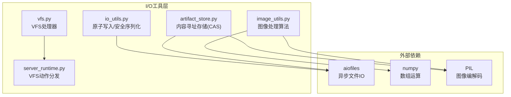
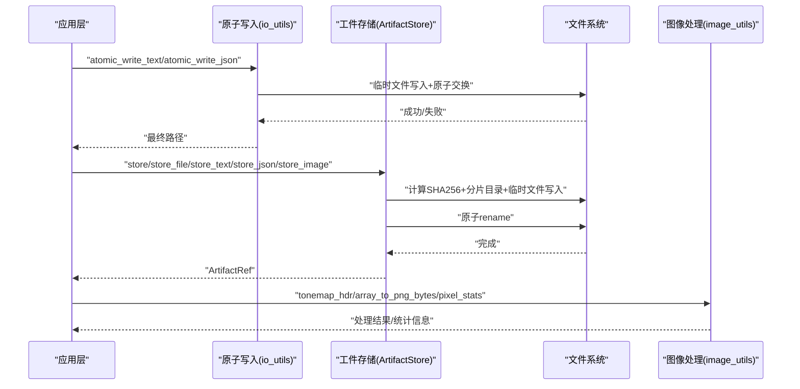
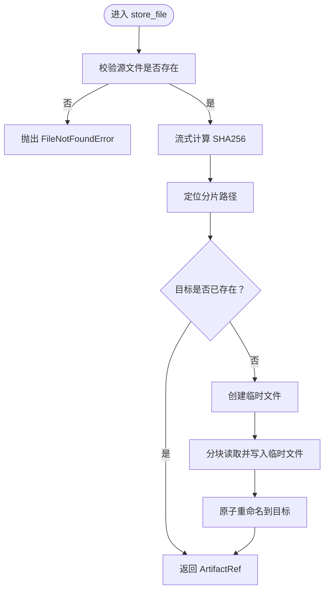
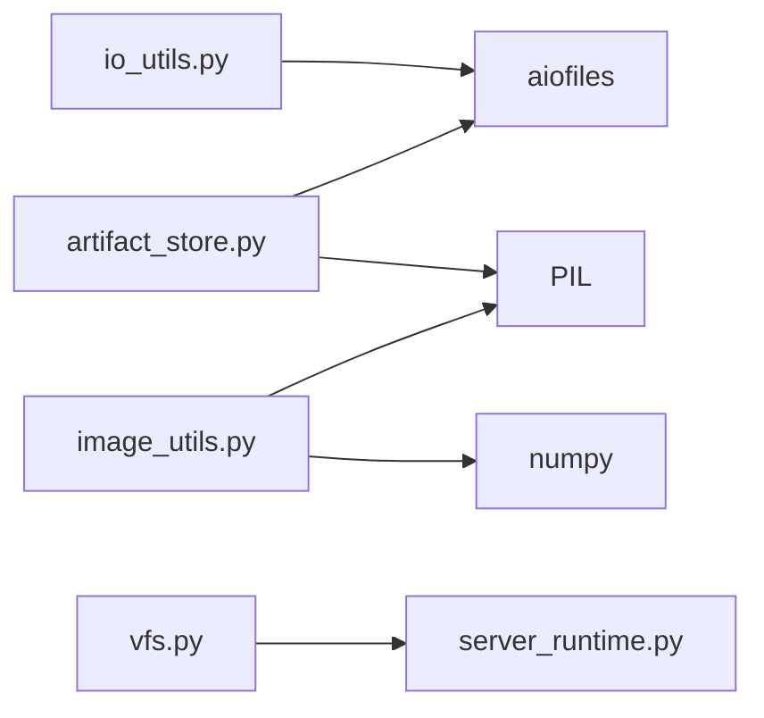

# I/O工具API

<cite>
**本文档引用的文件**
- [io_utils.py](file://rdx/io_utils.py)
- [artifact_store.py](file://rdx/utils/artifact_store.py)
- [image_utils.py](file://rdx/utils/image_utils.py)
- [vfs.py](file://rdx/handlers/vfs.py)
- [server_runtime.py](file://rdx/server_runtime.py)
- [test_io_utils.py](file://tests/test_io_utils.py)
</cite>

## 目录
1. [简介](#简介)
2. [项目结构](#项目结构)
3. [核心组件](#核心组件)
4. [架构总览](#架构总览)
5. [详细组件分析](#详细组件分析)
6. [依赖关系分析](#依赖关系分析)
7. [性能考量](#性能考量)
8. [故障排查指南](#故障排查指南)
9. [结论](#结论)
10. [附录](#附录)

## 简介
本文件系统性梳理了仓库中的I/O工具API，覆盖以下能力域：
- 文件读写与原子更新：提供安全的文本、JSON、JSONL追加写入，以及跨平台原子交换策略
- 目录与VFS操作：虚拟文件系统（VFS）的目录列举、解析与树形展示
- 图像处理：HDR/LDR图像可视化、NaN/Inf检测、图像差分热力图、像素统计与PNG编解码
- 工件存储（Artifact Store）：内容寻址存储（CAS），支持多格式工件（文本、JSON、图像等）的去重存储与检索

文档面向不同技术背景读者，既提供高层概览，也给出代码级的调用流程、参数约束、异常处理与最佳实践。

## 项目结构
围绕I/O工具的核心模块分布如下：
- rdx/io_utils.py：原子写入、安全JSON序列化、流式写入与清理
- rdx/utils/artifact_store.py：内容寻址工件存储（CAS）、文件/图像/文本/JSON存储、检索与清理
- rdx/utils/image_utils.py：图像处理算法（HDR色调映射、差分热力图、NaN/Inf掩码、像素统计）
- rdx/handlers/vfs.py：VFS请求入口处理器
- rdx/server_runtime.py：VFS动作分发与节点解析
- tests/test_io_utils.py：I/O工具测试用例

图表来源
- [io_utils.py:1-161](file://rdx/io_utils.py#L1-L161)
- [artifact_store.py:1-440](file://rdx/utils/artifact_store.py#L1-L440)
- [image_utils.py:1-478](file://rdx/utils/image_utils.py#L1-L478)
- [vfs.py:1-10](file://rdx/handlers/vfs.py#L1-L10)
- [server_runtime.py:12276-12338](file://rdx/server_runtime.py#L12276-L12338)

章节来源
- [io_utils.py:1-161](file://rdx/io_utils.py#L1-L161)
- [artifact_store.py:1-440](file://rdx/utils/artifact_store.py#L1-L440)
- [image_utils.py:1-478](file://rdx/utils/image_utils.py#L1-L478)
- [vfs.py:1-10](file://rdx/handlers/vfs.py#L1-L10)
- [server_runtime.py:12276-12338](file://rdx/server_runtime.py#L12276-L12338)

## 核心组件
本节概述三大核心API域及其职责边界：
- 原子写入与安全序列化：保障并发安全与编码一致性，避免部分写入与损坏
- 内容寻址工件存储：以SHA256为key的去重存储，支持文本、JSON、图像等多格式
- 图像处理与可视化：针对GPU调试场景的图像分析与可视化工具集

章节来源
- [io_utils.py:117-161](file://rdx/io_utils.py#L117-L161)
- [artifact_store.py:99-232](file://rdx/utils/artifact_store.py#L99-L232)
- [image_utils.py:80-220](file://rdx/utils/image_utils.py#L80-L220)

## 架构总览
I/O工具的调用链路通常如下：
- 应用层调用原子写入或工件存储API
- 工件存储内部进行SHA256计算、分片落盘与原子重命名
- 图像处理模块对数组/图像进行变换与统计
- VFS层负责目录解析与树形展示，供上层工具查询

图表来源
- [io_utils.py:117-161](file://rdx/io_utils.py#L117-L161)
- [artifact_store.py:99-232](file://rdx/utils/artifact_store.py#L99-L232)
- [image_utils.py:434-478](file://rdx/utils/image_utils.py#L434-L478)

## 详细组件分析

### 原子写入与安全序列化（io_utils）
- 功能要点
  - 文本/JSON安全写入：自动处理编码问题，保证输出可读性
  - 原子交换：通过临时文件+重命名实现跨平台原子替换
  - JSON安全序列化：递归清洗不可序列化对象，确保UTF-8兼容
  - JSONL追加：在现有内容末尾追加新行，避免覆盖
  - 清理工具：安全删除临时/备份路径，降低残留风险

- 关键API与行为
  - atomic_write_text(path, text, encoding="utf-8", newline=None)
    - 参数：目标路径、文本内容、编码、行结束符
    - 返回：最终路径
    - 异常：底层写入失败时抛出，临时文件自动清理
    - 行为：创建临时文件，写入后执行原子交换，失败则清理临时文件
  - atomic_write_json(path, payload, indent=2, sort_keys=False)
    - 参数：目标路径、JSON负载
    - 返回：最终路径
    - 行为：先安全序列化为字符串，再走原子写入
  - atomic_append_jsonl(path, entry)
    - 参数：目标路径、单条JSONL条目
    - 返回：最终路径
    - 行为：读取现有内容，拼接新条目，走原子写入
  - atomic_swap_path(temp_path, final_path, retries=5, retry_delay_s=0.05)
    - 参数：临时路径、最终路径、重试次数、重试间隔
    - 行为：目录/文件原子替换，失败时回滚并抛出AtomicWriteError
  - safe_json_text(payload, indent=None, sort_keys=False)
    - 行为：递归清洗不可序列化对象，确保ASCII/Unicode兼容
  - safe_stream_write(text, stream)
    - 行为：遇到编码错误时回退策略，保证写入不中断

- 使用示例（路径参考）
  - [原子文本写入示例:117-136](file://rdx/io_utils.py#L117-L136)
  - [原子JSON写入示例:138-146](file://rdx/io_utils.py#L138-L146)
  - [JSONL追加示例:149-161](file://rdx/io_utils.py#L149-L161)

- 异常处理
  - AtomicWriteError：原子交换失败时携带原因与重试信息
  - UnicodeEncodeError：流式写入时自动回退到可显示字符

- 性能与并发
  - 通过临时文件+原子重命名避免并发写入冲突
  - JSON序列化前预处理，减少后续I/O开销

章节来源
- [io_utils.py:13-161](file://rdx/io_utils.py#L13-L161)

### 内容寻址工件存储（ArtifactStore）
- 功能要点
  - CAS存储：以SHA256为key，相同内容仅存储一次
  - 分片目录：两级分片布局，兼顾可扩展性与目录深度控制
  - 多格式支持：原始字节、文件、文本、JSON、图像
  - 异步IO：基于aiofiles的异步读写与重命名
  - 清理策略：按时间或总量清理历史工件

- 关键API与行为
  - store(data: bytes, mime: str="application/octet-stream", suffix: str="", meta: Optional[Dict]=None) -> ArtifactRef
    - 参数：原始字节、MIME类型、文件后缀、元数据
    - 返回：包含URI、SHA256、大小、MIME、元数据的引用
    - 行为：计算SHA256，分片落盘，临时文件+原子重命名
  - store_file(path: Path, mime: str="application/octet-stream", suffix: str="", meta: Optional[Dict]=None) -> ArtifactRef
    - 参数：源文件路径
    - 返回：ArtifactRef
    - 行为：流式计算SHA256，分块拷贝，原子重命名
  - store_json(data: Dict, name: str="", session_id: Optional[str]=None, meta: Optional[Dict]=None) -> ArtifactRef
    - 行为：JSON序列化后走store
  - store_text(text: str, name: str="", session_id: Optional[str]=None, mime: str="text/plain", suffix: str=".txt", meta: Optional[Dict]=None) -> ArtifactRef
    - 行为：编码后走store
  - store_image(image: Any, name: str="", session_id: Optional[str]=None, fmt: str="PNG", meta: Optional[Dict]=None) -> ArtifactRef
    - 参数：PIL Image、NumPy数组或bytes
    - 行为：PIL编码为PNG/JPEG/EXR，自动推断后缀与MIME
  - retrieve(sha256: str) -> bytes
    - 返回：原始字节
    - 异常：未找到时抛出FileNotFoundError
  - list_artifacts(prefix: str="") -> List[Dict]
    - 返回：工件清单（路径、相对路径、大小、时间戳）
  - cleanup_artifacts(older_than_ms: Optional[int]=None, prefix: str="", max_total_bytes: Optional[int]=None) -> Dict
    - 返回：删除列表与释放字节数

- 流程图（store_file）

图表来源
- [artifact_store.py:160-232](file://rdx/utils/artifact_store.py#L160-L232)

- 使用示例（路径参考）
  - [存储文本/JSON/图像示例:255-313](file://rdx/utils/artifact_store.py#L255-L313)
  - [存储文件示例:160-232](file://rdx/utils/artifact_store.py#L160-L232)
  - [检索与清理示例:386-440](file://rdx/utils/artifact_store.py#L386-L440)

- 异常处理
  - FileNotFoundError：源文件不存在或检索不到对应SHA256
  - BaseException：写入期间任何异常都会清理临时文件并重新抛出

- 性能与并发
  - 分块读写（64KiB）避免大文件一次性占用内存
  - 异步IO与原子重命名确保并发安全

章节来源
- [artifact_store.py:99-440](file://rdx/utils/artifact_store.py#L99-L440)

### 图像处理与可视化（image_utils）
- 功能要点
  - HDR色调映射：Reinhard色调映射，支持曝光调节
  - NaN/Inf检测：生成彩色掩码并统计坏像素密度与包围盒
  - 图像差分：逐像素L2距离热力图，支持阈值与统计
  - 像素统计：逐通道最小/最大/均值/标准差，支持区域裁剪
  - PNG编解码：数组与PNG字节互转，支持单/三/四通道

- 关键API与行为
  - tonemap_hdr(pixels: np.ndarray, exposure: float=1.0) -> np.ndarray
    - 输入：float32 HDR数组
    - 输出：uint8 LDR数组
  - compute_naninf_mask(pixels: np.ndarray) -> Tuple[np.ndarray, Dict]
    - 输出：RGBA掩码与统计字典（含NaN/Inf计数、密度、包围盒）
  - compute_diff_map(img_a: np.ndarray, img_b: np.ndarray, threshold: float=0.01) -> Tuple[np.ndarray, Dict]
    - 输出：RGB热力图与统计字典（含均值/最大差异、像素计数与比率、包围盒）
  - pixel_stats(pixels: np.ndarray, region: Optional[Dict]=None) -> Dict
    - 输出：逐通道统计与NaN/Inf标记
  - array_to_png_bytes(arr: np.ndarray) -> bytes
    - 支持uint8/float32，自动处理NaN/Inf与单通道
  - png_bytes_to_array(data: bytes) -> np.ndarray
    - 解码为uint8数组，统一为3维（单通道补第三维）

- 使用示例（路径参考）
  - [HDR色调映射示例:434-478](file://rdx/utils/image_utils.py#L434-L478)
  - [NaN/Inf检测示例:80-135](file://rdx/utils/image_utils.py#L80-L135)
  - [差分热力图示例:143-220](file://rdx/utils/image_utils.py#L143-L220)
  - [像素统计示例:311-367](file://rdx/utils/image_utils.py#L311-L367)
  - [PNG编解码示例:375-426](file://rdx/utils/image_utils.py#L375-L426)

- 异常处理
  - compute_diff_map：当空间尺寸不一致时抛出ValueError
  - tonemap_hdr：非浮点输入直接返回原数组

- 性能与并发
  - NumPy向量化运算，避免Python循环
  - 浮点数组在必要时进行裁剪与归一化，减少溢出与精度损失

章节来源
- [image_utils.py:80-478](file://rdx/utils/image_utils.py#L80-L478)

### VFS目录操作（vfs与server_runtime）
- 功能要点
  - ls/cat/resolve/tree：目录列举、内容查看、路径解析、树形展示
  - 投影：支持表格投影（TSV）与节点增强
  - 会话绑定：路径规范化与会话ID注入

- 关键API与行为
  - vfs.handle(action: str, args: Dict, env: Dict)
    - 将请求转发至server_runtime._dispatch_vfs
  - server_runtime._dispatch_vfs(action: str, args: Dict) -> str
    - 支持动作：ls、cat、resolve、tree
    - 投影限制：除ls外不支持投影
    - 返回：标准化响应（包含path、node、entries或tree）

- 使用示例（路径参考）
  - [VFS处理器入口:8-10](file://rdx/handlers/vfs.py#L8-L10)
  - [VFS动作分发:12302-12338](file://rdx/server_runtime.py#L12302-L12338)

- 异常处理
  - 不支持的动作：返回错误响应，包含支持的动作列表

- 性能与并发
  - 异步解析与树构建，深度受限避免过度展开

章节来源
- [vfs.py:8-10](file://rdx/handlers/vfs.py#L8-L10)
- [server_runtime.py:12302-12338](file://rdx/server_runtime.py#L12302-L12338)

## 依赖关系分析
- 模块耦合
  - io_utils与artifact_store：前者提供原子写入基础能力，后者复用其安全写入思想（临时文件+原子重命名）
  - image_utils与artifact_store：二者均可产出图像类工件（PNG/JPEG/EXR），可配合ArtifactStore统一管理
  - vfs与server_runtime：前者作为入口，后者实现具体逻辑，解耦清晰

- 外部依赖
  - aiofiles：异步文件IO与异步重命名
  - numpy：图像数组运算
  - PIL：图像编解码与保存
  - pathlib/os/shutil：路径与文件系统操作

图表来源
- [io_utils.py:1-161](file://rdx/io_utils.py#L1-L161)
- [artifact_store.py:1-440](file://rdx/utils/artifact_store.py#L1-L440)
- [image_utils.py:1-478](file://rdx/utils/image_utils.py#L1-L478)
- [vfs.py:1-10](file://rdx/handlers/vfs.py#L1-L10)
- [server_runtime.py:12276-12338](file://rdx/server_runtime.py#L12276-L12338)

## 性能考量
- 分块I/O：工件存储采用64KiB分块读写，平衡内存占用与吞吐
- 原子写入：通过临时文件+重命名避免部分写入，减少锁竞争
- 内容去重：CAS避免重复存储，显著节省空间与IO
- 异步IO：aiofiles提升并发场景下的吞吐
- NumPy向量化：图像处理避免Python循环，提高计算效率
- 最佳实践
  - 大文件优先使用store_file而非store，利用流式哈希与分块拷贝
  - JSON序列化前尽量保证数据可序列化，减少运行时清洗成本
  - 图像处理建议先做NaN/Inf清洗与裁剪，再进行色调映射
  - VFS树构建设置合理深度，避免深层递归导致的性能问题

## 故障排查指南
- 原子写入失败
  - 现象：AtomicWriteError，携带temp_path/final_path/reason
  - 排查：确认磁盘权限、目标路径父目录存在性、磁盘空间
  - 处置：重试或检查备份.bak文件是否残留
  - 参考：[atomic_swap_path:67-115](file://rdx/io_utils.py#L67-L115)
- 工件存储找不到
  - 现象：FileNotFoundError（retrieve）
  - 排查：确认SHA256正确性、分片路径是否存在
  - 处置：重新store或检查ArtifactRef元数据
  - 参考：[retrieve:386-409](file://rdx/utils/artifact_store.py#L386-L409)
- 图像差分尺寸不匹配
  - 现象：ValueError（compute_diff_map）
  - 排查：确认两张图像空间维度一致
  - 处置：先做resize或裁剪
  - 参考：[compute_diff_map:143-183](file://rdx/utils/image_utils.py#L143-L183)
- VFS动作不受支持
  - 现象：错误响应，包含支持的动作列表
  - 排查：确认action是否为ls/cat/resolve/tree之一
  - 处置：按支持列表调整请求
  - 参考：[_dispatch_vfs:12302-12338](file://rdx/server_runtime.py#L12302-L12338)

章节来源
- [io_utils.py:13-17](file://rdx/io_utils.py#L13-L17)
- [artifact_store.py:386-409](file://rdx/utils/artifact_store.py#L386-L409)
- [image_utils.py:170-183](file://rdx/utils/image_utils.py#L170-L183)
- [server_runtime.py:12302-12338](file://rdx/server_runtime.py#L12302-L12338)

## 结论
本I/O工具API体系以“安全、高效、可扩展”为核心设计原则：
- 原子写入保障并发安全与数据完整性
- CAS工件存储提供内容去重与统一管理
- 图像处理工具满足GPU调试与可视化需求
- VFS目录操作支撑上层工具的浏览与查询

建议在生产环境中结合测试用例与日志监控，持续验证各API在高并发与大数据量场景下的稳定性与性能表现。

## 附录
- 测试参考
  - [I/O工具测试用例](file://tests/test_io_utils.py)
- 相关实现参考
  - [VFS处理器:8-10](file://rdx/handlers/vfs.py#L8-L10)
  - [VFS动作分发:12302-12338](file://rdx/server_runtime.py#L12302-L12338)