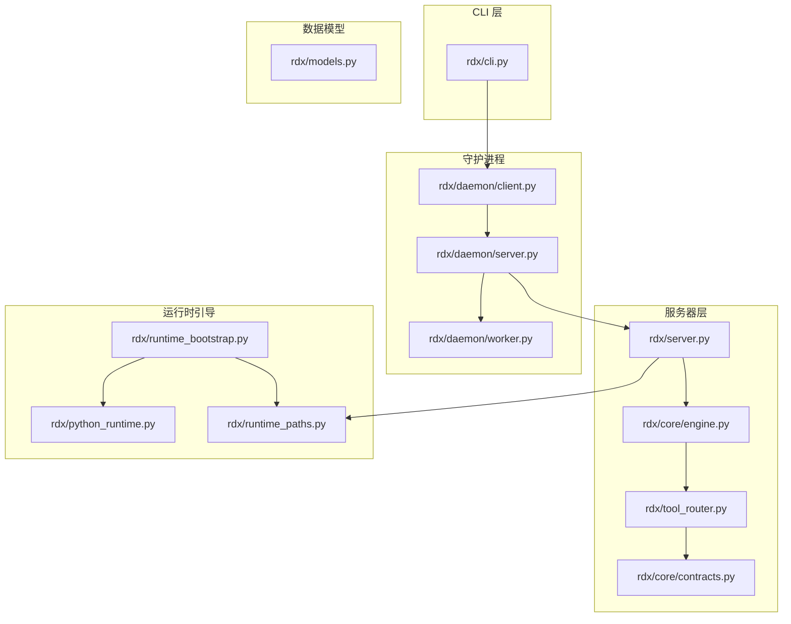
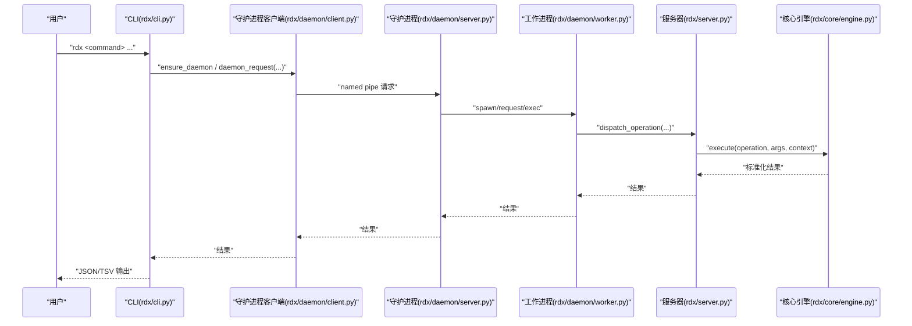
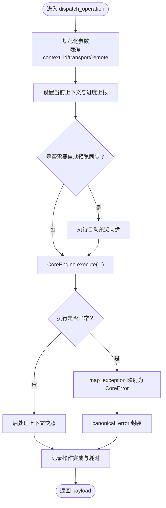
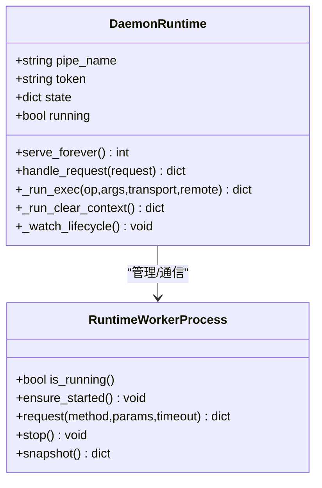
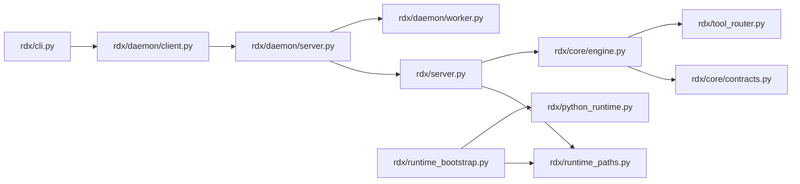

# Python API

<cite>
**本文引用的文件**
- [rdx/__init__.py](file://rdx/__init__.py)
- [rdx/cli.py](file://rdx/cli.py)
- [rdx/server.py](file://rdx/server.py)
- [rdx/python_runtime.py](file://rdx/python_runtime.py)
- [rdx/runtime_worker.py](file://rdx/runtime_worker.py)
- [rdx/runtime_bootstrap.py](file://rdx/runtime_bootstrap.py)
- [rdx/daemon/client.py](file://rdx/daemon/client.py)
- [rdx/daemon/server.py](file://rdx/daemon/server.py)
- [rdx/daemon/worker.py](file://rdx/daemon/worker.py)
- [rdx/models.py](file://rdx/models.py)
- [rdx/core/engine.py](file://rdx/core/engine.py)
- [rdx/tool_router.py](file://rdx/tool_router.py)
- [rdx/core/contracts.py](file://rdx/core/contracts.py)
- [rdx/io_utils.py](file://rdx/io_utils.py)
- [rdx/runtime_paths.py](file://rdx/runtime_paths.py)
</cite>

## 目录
1. [简介](#简介)
2. [项目结构](#项目结构)
3. [核心组件](#核心组件)
4. [架构总览](#架构总览)
5. [详细组件分析](#详细组件分析)
6. [依赖分析](#依赖分析)
7. [性能考虑](#性能考虑)
8. [故障排查指南](#故障排查指南)
9. [结论](#结论)
10. [附录](#附录)

## 简介
本文件为 RDX Python API 的系统化技术文档，覆盖 CLI 接口、服务器接口、运行时引导接口与工作进程接口的完整规范。内容包括：
- 公共类、方法与函数的参数类型、返回值、异常处理与使用示例
- 初始化流程、配置项与错误处理机制
- 最佳实践与性能优化建议
- 代码级架构图与数据流图，帮助读者快速理解各模块职责与交互方式

## 项目结构
RDX 将功能按“运行时内核”“守护进程”“CLI 前端”“工具路由与处理器”等层次组织，核心入口与对外 API 主要集中在以下模块：
- CLI 层：rdx/cli.py 提供命令行适配与结果渲染
- 服务器层：rdx/server.py 暴露统一调度接口与核心引擎访问
- 守护进程：rdx/daemon/server.py、rdx/daemon/client.py、rdx/daemon/worker.py 实现命名管道通信、上下文管理与工作进程生命周期
- 运行时引导：rdx/runtime_bootstrap.py、rdx/python_runtime.py、rdx/runtime_paths.py 提供路径解析、Python 运行时布局校验与环境准备
- 执行内核：rdx/core/engine.py、rdx/tool_router.py、rdx/core/contracts.py 统一执行、契约与产物发布
- 数据模型：rdx/models.py 定义核心领域对象与枚举

图表来源
- [rdx/cli.py](file://rdx/cli.py)
- [rdx/server.py](file://rdx/server.py)
- [rdx/core/engine.py](file://rdx/core/engine.py)
- [rdx/tool_router.py](file://rdx/tool_router.py)
- [rdx/core/contracts.py](file://rdx/core/contracts.py)
- [rdx/daemon/server.py](file://rdx/daemon/server.py)
- [rdx/daemon/client.py](file://rdx/daemon/client.py)
- [rdx/daemon/worker.py](file://rdx/daemon/worker.py)
- [rdx/runtime_bootstrap.py](file://rdx/runtime_bootstrap.py)
- [rdx/python_runtime.py](file://rdx/python_runtime.py)
- [rdx/runtime_paths.py](file://rdx/runtime_paths.py)
- [rdx/models.py](file://rdx/models.py)

章节来源
- [rdx/__init__.py](file://rdx/__init__.py)
- [rdx/cli.py](file://rdx/cli.py)
- [rdx/server.py](file://rdx/server.py)
- [rdx/core/engine.py](file://rdx/core/engine.py)
- [rdx/tool_router.py](file://rdx/tool_router.py)
- [rdx/core/contracts.py](file://rdx/core/contracts.py)
- [rdx/daemon/server.py](file://rdx/daemon/server.py)
- [rdx/daemon/client.py](file://rdx/daemon/client.py)
- [rdx/daemon/worker.py](file://rdx/daemon/worker.py)
- [rdx/runtime_bootstrap.py](file://rdx/runtime_bootstrap.py)
- [rdx/python_runtime.py](file://rdx/python_runtime.py)
- [rdx/runtime_paths.py](file://rdx/runtime_paths.py)
- [rdx/models.py](file://rdx/models.py)

## 核心组件
本节概述对外公开的 API 与职责边界，并给出调用要点。

- CLI 接口
  - 功能：命令行入口，解析参数，调用守护进程，渲染结果（JSON/TSV）
  - 关键函数：版本查询、医生检查、工具列表/搜索、上下文管理、捕获打开、VFS、差异与断言、完成脚本生成等
  - 返回：统一“成功/失败”封装，支持 TSV 投影渲染
  - 异常：参数解析错误、守护进程超时、工具参数不合法等

- 服务器接口
  - 功能：统一执行入口，负责上下文切换、进度上报、预览同步、错误映射与结果封装
  - 关键函数：dispatch_operation、get_core_engine、runtime_startup、runtime_shutdown
  - 返回：标准化响应体（包含 schema_version、tool_version、result_kind、ok、data、artifacts、error、meta、projections）

- 守护进程接口
  - 功能：命名管道监听、客户端接入/心跳/离线清理、工作进程生命周期管理、状态持久化
  - 关键类：DaemonRuntime、RuntimeWorkerProcess
  - 关键方法：serve_forever、handle_request、request、ensure_started、stop

- 运行时引导接口
  - 功能：解析运行时目录、注入 PATH 与 DLL 目录、加载 renderdoc.pyd、校验 Python 布局
  - 关键函数：bootstrap_renderdoc_runtime、resolve_bundled_python_layout、validate_bundled_python_layout
  - 关键数据结构：BundledPythonLayout、RuntimeBootstrapResult

- 工作进程接口
  - 功能：标准输入输出协议、请求序列化、超时控制、退出与重启
  - 关键方法：request、ensure_started、stop、snapshot

- 执行内核与契约
  - 功能：操作注册表、异步执行、输出规范化、制品发布、错误映射
  - 关键类：CoreEngine、ExecutionContext；关键函数：canonical_success、canonical_error、collect_artifact_candidates

- 数据模型
  - 功能：定义领域对象（会话、捕获、事件树、异常、补丁、实验、报告等）与枚举（后端类型、图形 API、着色器阶段、验证器类型等）

章节来源
- [rdx/cli.py](file://rdx/cli.py)
- [rdx/server.py](file://rdx/server.py)
- [rdx/daemon/server.py](file://rdx/daemon/server.py)
- [rdx/daemon/client.py](file://rdx/daemon/client.py)
- [rdx/daemon/worker.py](file://rdx/daemon/worker.py)
- [rdx/runtime_bootstrap.py](file://rdx/runtime_bootstrap.py)
- [rdx/python_runtime.py](file://rdx/python_runtime.py)
- [rdx/core/engine.py](file://rdx/core/engine.py)
- [rdx/tool_router.py](file://rdx/tool_router.py)
- [rdx/core/contracts.py](file://rdx/core/contracts.py)
- [rdx/models.py](file://rdx/models.py)

## 架构总览
下图展示从 CLI 到守护进程、再到工作进程与核心引擎的端到端调用链路，以及错误处理与结果封装的统一契约。

图表来源
- [rdx/cli.py](file://rdx/cli.py)
- [rdx/daemon/client.py](file://rdx/daemon/client.py)
- [rdx/daemon/server.py](file://rdx/daemon/server.py)
- [rdx/daemon/worker.py](file://rdx/daemon/worker.py)
- [rdx/server.py](file://rdx/server.py)
- [rdx/core/engine.py](file://rdx/core/engine.py)

## 详细组件分析

### CLI 接口（rdx/cli.py）
- 公共函数与用途
  - 版本与医生：_version_payload、_cmd_version、_cmd_doctor
  - 补全脚本：_completion_script、_completion_words
  - 工具目录：_cmd_tools_list、_cmd_tools_search
  - 上下文：_cmd_context_status、_cmd_context_update、_cmd_context_list
  - 捕获与会话：_cmd_capture_open、_default_session_id、_session_required_error_payload
  - 结果渲染：_render_result、_render_tabular、_tabular_projection_error_payload
  - 参数解析：_load_call_args、_parse_json_object、_recover_args_json_from_command_line
  - 守护进程交互：_daemon_exec、_daemon_status_payload、_ensure_daemon_state
- 参数与返回
  - 大多数命令返回整型退出码（EXIT_OK/EXIT_RUNTIME_ERR），并通过标准输出打印 JSON 或 TSV
  - _render_result 支持根据输出格式选择 JSON 或 TSV 渲染
- 异常处理
  - 参数冲突或无效 JSON：抛出 ValueError
  - 守护进程未就绪或超时：抛出 RuntimeError 或 DaemonRequestTimeout
  - TSV 投影缺失：返回标准化错误载荷并提示回退到 JSON
- 使用示例（路径引用）
  - [版本查询](file://rdx/cli.py)
  - [医生检查](file://rdx/cli.py)
  - [工具列表/搜索](file://rdx/cli.py)
  - [上下文管理](file://rdx/cli.py)
  - [捕获打开与会话 ID 解析](file://rdx/cli.py)

章节来源
- [rdx/cli.py](file://rdx/cli.py)

### 服务器接口（rdx/server.py）
- 公共函数与用途
  - get_core_engine：获取单例 CoreEngine
  - runtime_startup/runtime_shutdown：启动/关闭运行时
  - dispatch_operation：统一调度入口，设置上下文、进度上报、预览同步、异常映射与结果封装
- 参数与返回
  - dispatch_operation 接受 operation、args、transport、remote、context_id、progress_sink
  - 返回标准化 payload（ok、data、error、meta、projections）
- 错误处理
  - 内部异常通过 map_exception 映射为 CoreError，再由 canonical_error 统一封装
- 性能与行为
  - 自动预览同步策略：对部分操作跳过自动同步以减少开销
  - 记录操作开始/结束与耗时，便于诊断

图表来源
- [rdx/server.py](file://rdx/server.py)
- [rdx/core/engine.py](file://rdx/core/engine.py)
- [rdx/core/contracts.py](file://rdx/core/contracts.py)

章节来源
- [rdx/server.py](file://rdx/server.py)
- [rdx/core/engine.py](file://rdx/core/engine.py)
- [rdx/core/contracts.py](file://rdx/core/contracts.py)

### 守护进程接口（rdx/daemon/server.py、client.py、worker.py）
- DaemonRuntime（守护进程）
  - 职责：命名管道监听、认证、状态持久化、客户端接入/心跳/离线清理、工作进程管理、请求分发
  - 方法：serve_forever、handle_request、_run_exec、_run_clear_context、_watch_lifecycle
- RuntimeWorkerProcess（工作进程）
  - 职责：子进程生命周期、标准 IO 协议、请求队列、超时控制、状态快照
  - 方法：ensure_started、request、stop、snapshot
- 客户端工具（rdx/daemon/client.py）
  - 职责：守护进程发现/启动、状态读写、请求发送、超时与清理
  - 方法：ensure_daemon、daemon_request、attach_client、heartbeat_client、detach_client、clear_context

图表来源
- [rdx/daemon/server.py](file://rdx/daemon/server.py)
- [rdx/daemon/worker.py](file://rdx/daemon/worker.py)

章节来源
- [rdx/daemon/server.py](file://rdx/daemon/server.py)
- [rdx/daemon/client.py](file://rdx/daemon/client.py)
- [rdx/daemon/worker.py](file://rdx/daemon/worker.py)

### 运行时引导接口（rdx/runtime_bootstrap.py、python_runtime.py、runtime_paths.py）
- bootstrap_renderdoc_runtime
  - 功能：解析运行时目录、注入 PATH 与 DLL 目录、加载 renderdoc.pyd、可选探测导入
  - 返回：RuntimeBootstrapResult（含 sys.path 变更、PATH 变更、DLL 目录注册、导入结果与错误）
- resolve_bundled_python_layout / validate_bundled_python_layout
  - 功能：解析与校验打包 Python 布局，确保关键文件/目录存在
  - 返回：(校验通过, 失败列表, 详情字典)
- runtime_paths
  - 功能：工具根目录、二进制目录、Python 目录、中间产物目录、日志目录等路径解析与创建

章节来源
- [rdx/runtime_bootstrap.py](file://rdx/runtime_bootstrap.py)
- [rdx/python_runtime.py](file://rdx/python_runtime.py)
- [rdx/runtime_paths.py](file://rdx/runtime_paths.py)

### 执行内核与契约（rdx/core/engine.py、tool_router.py、core/contracts.py）
- CoreEngine.execute
  - 功能：解析操作、异步调用处理器、规范化输出、制品发布、错误映射
  - 返回：标准化 payload（包含 schema_version、tool_version、result_kind、ok、data、artifacts、error、meta、projections）
- tool_router.build_operation_registry
  - 功能：基于工具目录构建操作注册表，强制前置条件（如 capture_file_id、session_id、remote_id、active_event_id、capability.remote）
- contracts
  - 功能：统一成功/失败响应、制品引用生成、投影字段规范化、环境布尔读取

章节来源
- [rdx/core/engine.py](file://rdx/core/engine.py)
- [rdx/tool_router.py](file://rdx/tool_router.py)
- [rdx/core/contracts.py](file://rdx/core/contracts.py)

### 数据模型（rdx/models.py）
- 枚举：BackendType、GraphicsAPI、ShaderStage、BugType、VerifierType、PatchType、ExperimentStatus、VerdictResult、BisectStrategy
- 响应封装：ToolResponse、ErrorDetail、ArtifactRef
- 领域对象：SessionInfo、CaptureInfo、EventNode、AnomalyInfo、Hypothesis、PipelineSnapshot、ShaderExportBundle、DebugStep、PixelDebugResult、PatchSpec/PatchResult、ExperimentDef/Evidence/Result、BisectResult、CounterSample/Summary/PerfResult、ReportBundle、PassFingerprint/ShaderFingerprint/FingerprintRecord、RegressionEntry、TaskInput/TaskState

章节来源
- [rdx/models.py](file://rdx/models.py)

### 工作进程接口（rdx/runtime_worker.py）
- 功能：作为守护进程的工作进程，通过标准输入输出与守护进程通信，执行服务器调度的操作
- 关键点：启动时发送 ready，接收 exec/clear_context/status/shutdown 请求，超时与 EOF 处理

章节来源
- [rdx/runtime_worker.py](file://rdx/runtime_worker.py)

## 依赖分析
- 模块耦合
  - CLI 依赖守护进程客户端与运行时路径工具
  - 守护进程依赖工作进程与运行时状态持久化
  - 服务器层依赖核心引擎与工具路由
  - 核心引擎依赖操作注册表与契约封装
- 外部依赖
  - Windows 命名管道（multiprocessing.connection）
  - Python 标准库（json、os、sys、time、argparse、subprocess、threading、queue）
  - 第三方：pydantic（数据模型）、renderdoc.pyd（运行时）

图表来源
- [rdx/cli.py](file://rdx/cli.py)
- [rdx/daemon/client.py](file://rdx/daemon/client.py)
- [rdx/daemon/server.py](file://rdx/daemon/server.py)
- [rdx/daemon/worker.py](file://rdx/daemon/worker.py)
- [rdx/server.py](file://rdx/server.py)
- [rdx/core/engine.py](file://rdx/core/engine.py)
- [rdx/tool_router.py](file://rdx/tool_router.py)
- [rdx/core/contracts.py](file://rdx/core/contracts.py)
- [rdx/runtime_bootstrap.py](file://rdx/runtime_bootstrap.py)
- [rdx/python_runtime.py](file://rdx/python_runtime.py)
- [rdx/runtime_paths.py](file://rdx/runtime_paths.py)

章节来源
- [rdx/cli.py](file://rdx/cli.py)
- [rdx/daemon/client.py](file://rdx/daemon/client.py)
- [rdx/daemon/server.py](file://rdx/daemon/server.py)
- [rdx/daemon/worker.py](file://rdx/daemon/worker.py)
- [rdx/server.py](file://rdx/server.py)
- [rdx/core/engine.py](file://rdx/core/engine.py)
- [rdx/tool_router.py](file://rdx/tool_router.py)
- [rdx/core/contracts.py](file://rdx/core/contracts.py)
- [rdx/runtime_bootstrap.py](file://rdx/runtime_bootstrap.py)
- [rdx/python_runtime.py](file://rdx/python_runtime.py)
- [rdx/runtime_paths.py](file://rdx/runtime_paths.py)

## 性能考虑
- 预览同步策略
  - 对部分操作（如预览自同步操作集）避免重复自动同步，降低通信与渲染开销
- 超时与重试
  - 守护进程与工作进程均设置合理超时，必要时进行重试与降级
- 日志与追踪
  - 通过 meta 字段记录 trace_id、transport、duration_ms，便于端到端性能分析
- 资源释放
  - 子进程退出与句柄关闭在 finally 中保证，避免资源泄漏

## 故障排查指南
- CLI 常见问题
  - 参数冲突或 JSON 无效：检查 --args-json 与 --args-file 的互斥性与 JSON 合法性
  - 守护进程未启动：使用 doctor 检查环境、Python 布局、RenderDoc 组件与工具目录
  - TSV 投影缺失：遵循提示改用 JSON 或确认工具支持投影
- 守护进程与工作进程
  - 命名管道连接失败：确认 token 与 pipe_name 正确；查看状态文件与清理僵尸进程
  - 工作进程未 ready：检查启动日志与环境变量（RDX_*），确认 renderdoc.pyd 可加载
- 运行时引导
  - Python 布局校验失败：检查 manifest 与关键文件是否存在；确保路径未逃逸 binaries_root
- 契约与输出
  - 输出非 JSON 字符串：核心引擎会尝试解析；若失败需修正工具输出格式

章节来源
- [rdx/cli.py](file://rdx/cli.py)
- [rdx/daemon/client.py](file://rdx/daemon/client.py)
- [rdx/daemon/server.py](file://rdx/daemon/server.py)
- [rdx/daemon/worker.py](file://rdx/daemon/worker.py)
- [rdx/python_runtime.py](file://rdx/python_runtime.py)
- [rdx/core/engine.py](file://rdx/core/engine.py)
- [rdx/core/contracts.py](file://rdx/core/contracts.py)

## 结论
RDX 的 Python API 通过清晰的分层设计实现了 CLI、守护进程、工作进程与核心引擎之间的解耦协作。统一的契约与错误映射保障了跨组件的一致性输出；运行时引导与路径工具确保了跨平台部署的稳定性。建议在生产环境中结合 doctor 检查与日志追踪，配合预览同步策略与超时配置，获得最佳性能与可靠性。

## 附录
- 初始化流程（简化）
  1) CLI 解析参数并确保守护进程
  2) 守护进程启动工作进程并保持 ready
  3) CLI 发送 exec 请求至守护进程
  4) 守护进程转发至工作进程
  5) 工作进程调用服务器调度
  6) 服务器执行核心引擎，规范化输出并返回
- 配置项与环境变量
  - RDX_TOOLS_ROOT：工具根目录（优先于脚本根目录）
  - RDX_RUNTIME_DLL_DIR、RDX_RENDERDOC_PATH：运行时二进制与 Python 模块目录
  - RDX_CONTEXT_ID：工作进程上下文标识
  - RDX_WORKER_SOURCE_MANIFEST：源清单路径
- 最佳实践
  - 使用 doctor 在每次 CI/本地初始化后检查环境
  - 对长耗时操作启用 JSON 输出并记录 meta.duration_ms
  - 对需要表格展示的场景显式传入投影参数或回退到 JSON
  - 在 Windows 上通过 bootstrap_renderdoc_runtime 注入 PATH 与 DLL 目录