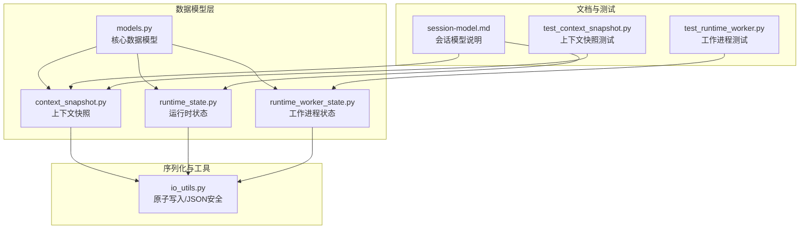
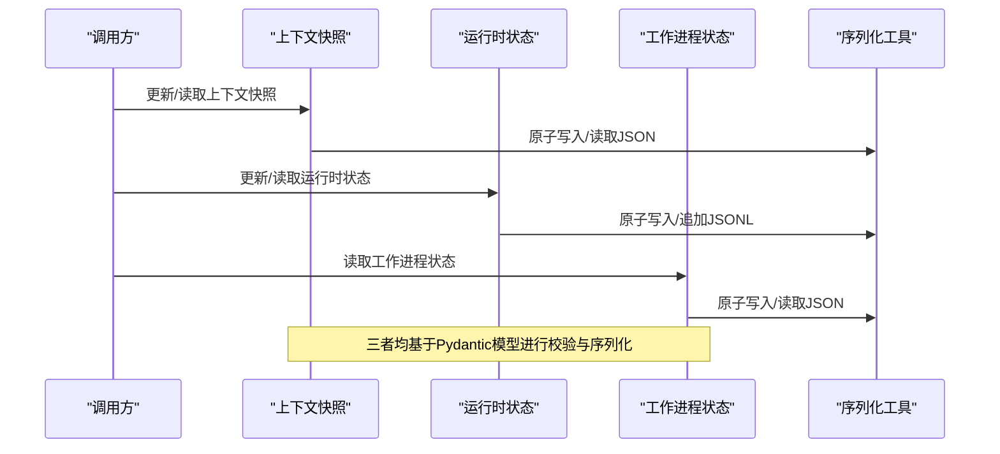
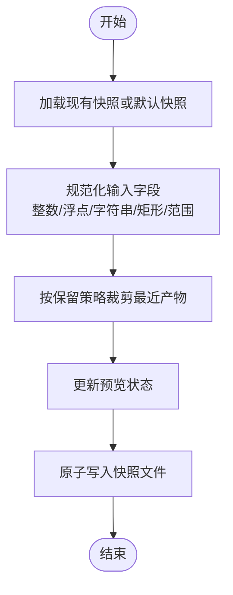
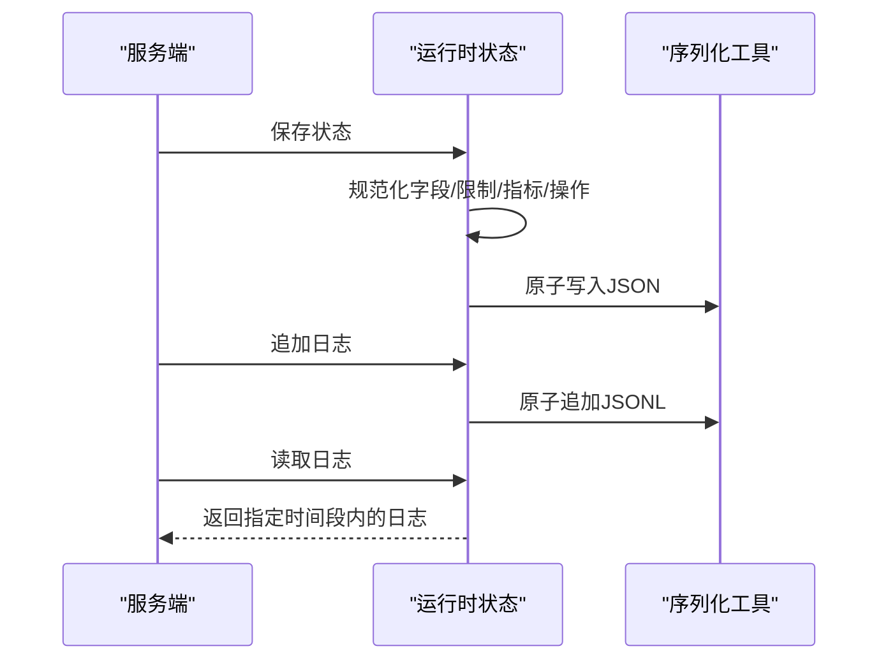
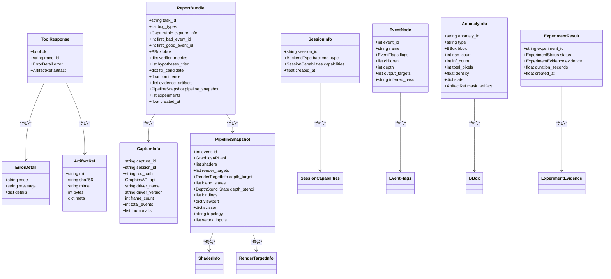
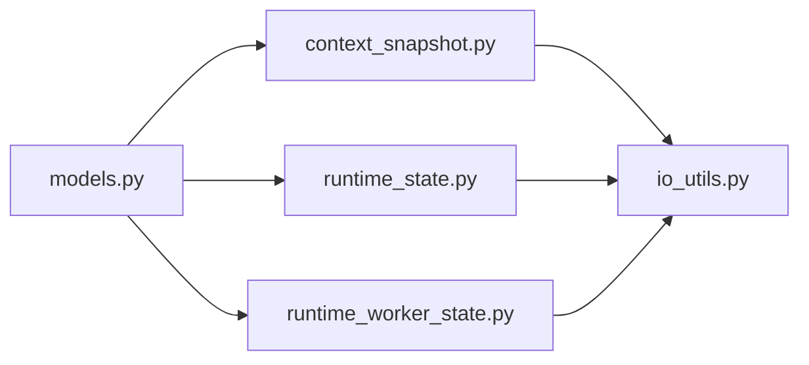

# 数据模型API

<cite>
**本文引用的文件**
- [models.py](file://rdx/models.py)
- [context_snapshot.py](file://rdx/context_snapshot.py)
- [runtime_state.py](file://rdx/runtime_state.py)
- [runtime_worker_state.py](file://rdx/runtime_worker_state.py)
- [io_utils.py](file://rdx/io_utils.py)
- [session-model.md](file://docs/session-model.md)
- [test_context_snapshot.py](file://tests/test_context_snapshot.py)
- [test_runtime_worker.py](file://tests/test_runtime_worker.py)
</cite>

## 目录
1. [简介](#简介)
2. [项目结构](#项目结构)
3. [核心组件](#核心组件)
4. [架构总览](#架构总览)
5. [详细组件分析](#详细组件分析)
6. [依赖分析](#依赖分析)
7. [性能考虑](#性能考虑)
8. [故障排查指南](#故障排查指南)
9. [结论](#结论)
10. [附录](#附录)

## 简介
本文件系统性梳理 RDX Agent Tools 中的数据模型API，覆盖以下方面：
- 所有数据模型类的接口规范：上下文快照、运行时状态、工作进程状态等
- 字段定义、类型约束、验证规则与序列化方法
- 模型实例化、数据转换与状态管理的API使用示例
- 模型之间的关系、继承结构与扩展机制
- 版本兼容性与迁移策略

## 项目结构
数据模型相关代码主要分布在以下模块：
- 核心数据模型：集中于 [models.py](file://rdx/models.py)，采用 Pydantic v2 定义结构化类型
- 上下文快照：用于CLI运行时的上下文持久化与读写，位于 [context_snapshot.py](file://rdx/context_snapshot.py)
- 运行时状态：用于守护进程后端的上下文状态与日志，位于 [runtime_state.py](file://rdx/runtime_state.py)
- 工作进程状态：用于守护进程拥有的RenderDoc工作进程状态，位于 [runtime_worker_state.py](file://rdx/runtime_worker_state.py)
- 序列化工具：原子写入与JSON安全处理，位于 [io_utils.py](file://rdx/io_utils.py)
- 文档与测试：会话模型文档与行为测试分别在 [session-model.md](file://docs/session-model.md) 与 [test_context_snapshot.py](file://tests/test_context_snapshot.py)、[test_runtime_worker.py](file://tests/test_runtime_worker.py)

图表来源
- [models.py:1-558](file://rdx/models.py#L1-L558)
- [context_snapshot.py:1-541](file://rdx/context_snapshot.py#L1-L541)
- [runtime_state.py:1-500](file://rdx/runtime_state.py#L1-L500)
- [runtime_worker_state.py:1-56](file://rdx/runtime_worker_state.py#L1-L56)
- [io_utils.py:1-161](file://rdx/io_utils.py#L1-L161)
- [session-model.md:1-12](file://docs/session-model.md#L1-L12)
- [test_context_snapshot.py:1-110](file://tests/test_context_snapshot.py#L1-L110)
- [test_runtime_worker.py:1-89](file://tests/test_runtime_worker.py#L1-L89)

章节来源
- [models.py:1-558](file://rdx/models.py#L1-L558)
- [context_snapshot.py:1-541](file://rdx/context_snapshot.py#L1-L541)
- [runtime_state.py:1-500](file://rdx/runtime_state.py#L1-L500)
- [runtime_worker_state.py:1-56](file://rdx/runtime_worker_state.py#L1-L56)
- [io_utils.py:1-161](file://rdx/io_utils.py#L1-L161)
- [session-model.md:1-12](file://docs/session-model.md#L1-L12)
- [test_context_snapshot.py:1-110](file://tests/test_context_snapshot.py#L1-L110)
- [test_runtime_worker.py:1-89](file://tests/test_runtime_worker.py#L1-L89)

## 核心组件
本节概述数据模型API的核心组成与职责边界。

- 枚举与基础类型
  - 后端类型、图形API、着色器阶段、缺陷类型、验证器类型、补丁类型、实验状态、判定结果、二分策略等枚举，统一了跨模块的语义标识。
  - 基础类型如时间戳、唯一ID生成器，确保全局唯一性与可追踪性。

- 通用响应封装
  - 统一的响应载体，包含成功标志、追踪ID、错误详情与产物引用，便于上层调用方进行一致化的错误处理与结果提取。

- 会话与捕获
  - 会话能力与信息、捕获元数据，支撑后续事件树、管线快照与调试轨迹的构建。

- 事件树与异常
  - 事件节点与标志位、异常信息与掩码产物，为问题定位与可视化提供结构化数据。

- 管线与着色器
  - 着色器信息、资源绑定、混合/深度模板状态、渲染目标、管线快照与导出包，构成图形管线的快照与导出结构。

- 补丁与实验
  - 补丁操作与规格、补丁结果；实验配置、证据与结果，支撑自动化修复与验证流程。

- 性能计数器与报告
  - 计数器样本与摘要、性能结果；报告包整合任务、假设、实验与证据，形成闭环分析。

- 知识库与回归
  - 通道与着色器指纹、指纹记录与回归条目，支持历史经验沉淀与回归检测。

- 任务与状态
  - 任务输入与状态，聚合异常、假设、实验、二分结果、管线快照与报告，作为顶层任务生命周期的载体。

章节来源
- [models.py:28-92](file://rdx/models.py#L28-L92)
- [models.py:103-122](file://rdx/models.py#L103-L122)
- [models.py:128-141](file://rdx/models.py#L128-L141)
- [models.py:147-157](file://rdx/models.py#L147-L157)
- [models.py:163-181](file://rdx/models.py#L163-L181)
- [models.py:194-204](file://rdx/models.py#L194-L204)
- [models.py:224-291](file://rdx/models.py#L224-L291)
- [models.py:316-360](file://rdx/models.py#L316-L360)
- [models.py:370-397](file://rdx/models.py#L370-L397)
- [models.py:403-431](file://rdx/models.py#L403-L431)
- [models.py:437-457](file://rdx/models.py#L437-L457)
- [models.py:463-478](file://rdx/models.py#L463-L478)
- [models.py:484-526](file://rdx/models.py#L484-L526)
- [models.py:532-558](file://rdx/models.py#L532-L558)

## 架构总览
数据模型API围绕“结构化类型 + 原子序列化 + 上下文/状态持久化”展开，形成如下交互链路：

图表来源
- [context_snapshot.py:447-475](file://rdx/context_snapshot.py#L447-L475)
- [runtime_state.py:388-416](file://rdx/runtime_state.py#L388-L416)
- [runtime_worker_state.py:35-48](file://rdx/runtime_worker_state.py#L35-L48)
- [io_utils.py:138-161](file://rdx/io_utils.py#L138-L161)

## 详细组件分析

### 上下文快照（Context Snapshot）
- 职责
  - 提供CLI运行时的上下文级快照，包含用户关注点（像素、资源、着色器）、预览状态、最近产物列表等
  - 支持多上下文隔离、锁文件并发保护、保留策略裁剪

- 关键字段与约束
  - 上下文标识、后端类型、运行时/远程/焦点/备注/最近产物/预览状态/更新时间
  - 预览显示状态包含输出槽位、纹理ID/格式、帧缓冲尺寸、视口/裁剪矩形、窗口尺寸、适配模式与屏幕截图比例
  - 最近产物按路径去重，按类型计数限制与总量上限裁剪

- 序列化与校验
  - 默认值生成、字段归一化（整数/浮点/字符串）、矩形/范围参数严格校验
  - 保存前统一规范化并原子写入；加载失败回退到默认快照

- 使用示例（API调用）
  - 更新上下文键值（仅允许用户域键）：通过服务端操作更新上下文快照
  - 获取上下文：返回当前快照，含会话定位器（.rdc、会话ID、帧索引、活动事件ID）
  - 合并最近产物：将工具产生的产物合并进最近产物列表，自动去重与裁剪

图表来源
- [context_snapshot.py:367-444](file://rdx/context_snapshot.py#L367-L444)
- [context_snapshot.py:463-475](file://rdx/context_snapshot.py#L463-L475)

章节来源
- [context_snapshot.py:18-36](file://rdx/context_snapshot.py#L18-L36)
- [context_snapshot.py:83-127](file://rdx/context_snapshot.py#L83-L127)
- [context_snapshot.py:130-171](file://rdx/context_snapshot.py#L130-L171)
- [context_snapshot.py:196-211](file://rdx/context_snapshot.py#L196-L211)
- [context_snapshot.py:242-279](file://rdx/context_snapshot.py#L242-L279)
- [context_snapshot.py:367-444](file://rdx/context_snapshot.py#L367-L444)
- [context_snapshot.py:447-475](file://rdx/context_snapshot.py#L447-L475)
- [test_context_snapshot.py:12-37](file://tests/test_context_snapshot.py#L12-L37)

### 运行时状态（Runtime State）
- 职责
  - 持久化守护进程后端的上下文状态，包含当前捕获/会话、捕获记录、会话记录、恢复状态、预览状态、指标与近期操作
  - 提供日志追加与查询能力

- 关键字段与约束
  - 结构版本、上下文ID、当前捕获/会话、后端类型、捕获字典、会话字典、恢复状态、预览状态、限制、指标、近期操作、时间戳
  - 会话记录包含远程元数据、恢复状态、着色器替换等
  - 近期操作按trace_id去重并按更新时间倒序裁剪

- 序列化与校验
  - 默认限制合并、字段归一化、JSON安全序列化、原子写入
  - 日志以JSONL追加，支持按时间戳过滤与行数限制读取

- 使用示例（API调用）
  - 加载/保存上下文状态：对payload进行规范化后写入
  - 列举上下文ID：扫描状态文件并解析上下文ID
  - 追加运行时日志：将操作条目追加至JSONL日志

图表来源
- [runtime_state.py:293-385](file://rdx/runtime_state.py#L293-L385)
- [runtime_state.py:404-416](file://rdx/runtime_state.py#L404-L416)
- [runtime_state.py:448-472](file://rdx/runtime_state.py#L448-L472)
- [io_utils.py:138-161](file://rdx/io_utils.py#L138-L161)

章节来源
- [runtime_state.py:92-149](file://rdx/runtime_state.py#L92-L149)
- [runtime_state.py:152-252](file://rdx/runtime_state.py#L152-L252)
- [runtime_state.py:293-385](file://rdx/runtime_state.py#L293-L385)
- [runtime_state.py:404-416](file://rdx/runtime_state.py#L404-L416)
- [runtime_state.py:448-472](file://rdx/runtime_state.py#L448-L472)

### 工作进程状态（Worker State）
- 职责
  - 持久化守护进程拥有的RenderDoc工作进程状态，支持按上下文隔离与清理

- 关键字段与约束
  - 任意键值对，按需读写；不存在时返回空字典

- 使用示例（API调用）
  - 读取/保存/清理：对给定上下文加载/保存/删除工作进程状态文件

章节来源
- [runtime_worker_state.py:19-56](file://rdx/runtime_worker_state.py#L19-L56)

### 核心数据模型（Models）
- 职责
  - 定义图形分析、异常定位、实验验证、性能计数器、报告与知识库等领域的结构化数据类型
  - 通过Pydantic v2实现强类型约束与序列化

- 关键模型族
  - 通用响应：响应体、错误详情、产物引用
  - 会话与捕获：会话能力、会话信息、捕获信息
  - 事件树与异常：事件标志、事件节点、异常信息
  - 管线与着色器：着色器信息、资源绑定、混合/深度模板状态、渲染目标、管线快照、着色器导出包
  - 补丁与实验：补丁操作/规格/结果、实验配置/证据/结果、二分结果
  - 性能计数器与报告：计数器样本/摘要/结果、报告包
  - 知识库与回归：通道指纹、着色器指纹、指纹记录、回归条目
  - 任务与状态：任务输入/状态

- 类关系图（部分）

图表来源
- [models.py:103-122](file://rdx/models.py#L103-L122)
- [models.py:128-141](file://rdx/models.py#L128-L141)
- [models.py:147-157](file://rdx/models.py#L147-L157)
- [models.py:163-181](file://rdx/models.py#L163-L181)
- [models.py:194-204](file://rdx/models.py#L194-L204)
- [models.py:266-279](file://rdx/models.py#L266-L279)
- [models.py:391-397](file://rdx/models.py#L391-L397)
- [models.py:463-478](file://rdx/models.py#L463-L478)

章节来源
- [models.py:103-122](file://rdx/models.py#L103-L122)
- [models.py:128-141](file://rdx/models.py#L128-L141)
- [models.py:147-157](file://rdx/models.py#L147-L157)
- [models.py:163-181](file://rdx/models.py#L163-L181)
- [models.py:194-204](file://rdx/models.py#L194-L204)
- [models.py:266-279](file://rdx/models.py#L266-L279)
- [models.py:391-397](file://rdx/models.py#L391-L397)
- [models.py:463-478](file://rdx/models.py#L463-L478)

### 序列化与原子写入（io_utils）
- 职责
  - 提供JSON安全序列化、文本原子写入、JSONL追加与原子交换路径等工具
  - 在写入过程中避免部分写入与竞态条件

- 关键能力
  - 安全JSON文本生成（UTF-8编码、键排序、默认字符串化）
  - 原子写入与备份回滚（临时文件+交换+备份）
  - JSONL追加（保证每行独立JSON对象）

章节来源
- [io_utils.py:19-42](file://rdx/io_utils.py#L19-L42)
- [io_utils.py:67-115](file://rdx/io_utils.py#L67-L115)
- [io_utils.py:138-161](file://rdx/io_utils.py#L138-L161)

## 依赖分析
- 模块内聚与耦合
  - models.py 作为纯数据模型层，不直接依赖其他模块，保持高内聚低耦合
  - 上下文快照、运行时状态、工作进程状态均依赖 io_utils 进行原子写入与JSON安全处理
  - 运行时状态依赖上下文快照的预览状态默认值与上下文ID归一化

- 外部依赖
  - Pydantic v2：模型定义与验证
  - 标准库：time、json、pathlib、threading、msvcrt（Windows锁文件）

图表来源
- [models.py:1-14](file://rdx/models.py#L1-L14)
- [context_snapshot.py:15-16](file://rdx/context_snapshot.py#L15-L16)
- [runtime_state.py:14-16](file://rdx/runtime_state.py#L14-L16)
- [runtime_worker_state.py:9-11](file://rdx/runtime_worker_state.py#L9-L11)
- [io_utils.py:1-11](file://rdx/io_utils.py#L1-L11)

章节来源
- [models.py:1-14](file://rdx/models.py#L1-L14)
- [context_snapshot.py:15-16](file://rdx/context_snapshot.py#L15-L16)
- [runtime_state.py:14-16](file://rdx/runtime_state.py#L14-L16)
- [runtime_worker_state.py:9-11](file://rdx/runtime_worker_state.py#L9-L11)
- [io_utils.py:1-11](file://rdx/io_utils.py#L1-L11)

## 性能考虑
- 写入性能
  - 原子写入与临时文件交换减少磁盘争用与部分写入风险
  - JSONL追加避免大文件重写，适合持续日志场景

- 内存占用
  - 最近产物与近期操作按保留策略裁剪，控制内存与存储增长
  - 计数器摘要与样本结构化存储，避免冗余拷贝

- 并发安全
  - Windows锁文件配合互斥锁，保障同一上下文的并发一致性

## 故障排查指南
- 快照/状态读取失败
  - 现象：加载失败返回默认值
  - 排查：检查文件权限、磁盘空间、JSON格式合法性
  - 参考：上下文快照与运行时状态的加载函数

- 键值更新被拒绝
  - 现象：更新运行时专属键值被拒绝
  - 排查：确认只更新用户域键（如notes、focus_*），避免修改runtime-owned键
  - 参考：上下文快照更新逻辑

- 预览状态异常
  - 现象：预览显示不正确或尺寸异常
  - 排查：检查矩形/范围参数归一化逻辑，确认输入格式与数值范围
  - 参考：预览状态与显示状态归一化函数

- 工作进程状态为空
  - 现象：读取工作进程状态为空字典
  - 排查：确认状态文件是否存在，环境变量与路径是否正确
  - 参考：工作进程状态读取逻辑

章节来源
- [context_snapshot.py:447-460](file://rdx/context_snapshot.py#L447-L460)
- [runtime_state.py:388-401](file://rdx/runtime_state.py#L388-L401)
- [context_snapshot.py:486-508](file://rdx/context_snapshot.py#L486-L508)
- [runtime_worker_state.py:35-43](file://rdx/runtime_worker_state.py#L35-L43)

## 结论
数据模型API通过强类型结构、严格的字段归一化与原子序列化，为图形分析与调试工具提供了稳定可靠的数据契约。上下文快照、运行时状态与工作进程状态分别覆盖CLI交互、守护进程后端与工作进程生命周期，三者协同实现从用户操作到持久化状态的完整闭环。建议在扩展新模型时遵循现有命名、枚举与序列化约定，确保向后兼容与可维护性。

## 附录

### API使用示例（基于测试与文档）
- 上下文快照
  - 更新焦点像素并获取上下文：参考 [test_context_snapshot.py:12-28](file://tests/test_context_snapshot.py#L12-L28)
  - 合并最近产物并验证来源工具：参考 [test_context_snapshot.py:39-59](file://tests/test_context_snapshot.py#L39-L59)
  - 使用上下文ID执行操作并验证结果：参考 [test_context_snapshot.py:83-110](file://tests/test_context_snapshot.py#L83-L110)

- 运行时状态
  - 追加运行时日志并读取：参考 [runtime_state.py:448-472](file://rdx/runtime_state.py#L448-L472)

- 工作进程状态
  - 读取/保存/清理工作进程状态：参考 [runtime_worker_state.py:35-56](file://rdx/runtime_worker_state.py#L35-L56)

- 会话模型说明
  - 上下文状态、会话定位器与预览状态：参考 [session-model.md:1-12](file://docs/session-model.md#L1-L12)

章节来源
- [test_context_snapshot.py:12-110](file://tests/test_context_snapshot.py#L12-L110)
- [runtime_state.py:448-472](file://rdx/runtime_state.py#L448-L472)
- [runtime_worker_state.py:35-56](file://rdx/runtime_worker_state.py#L35-L56)
- [session-model.md:1-12](file://docs/session-model.md#L1-L12)