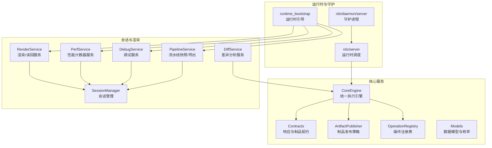
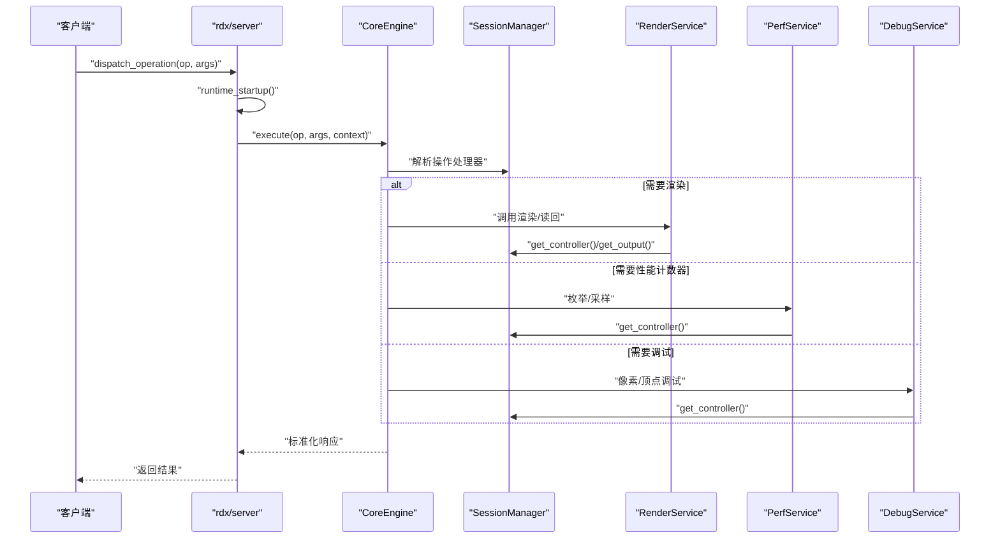
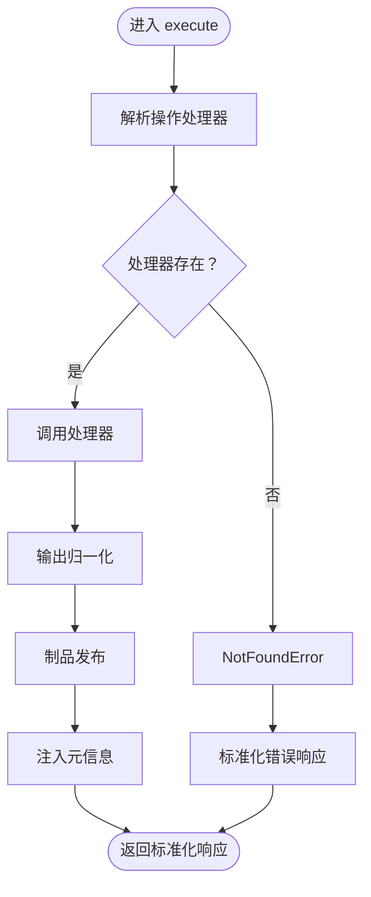
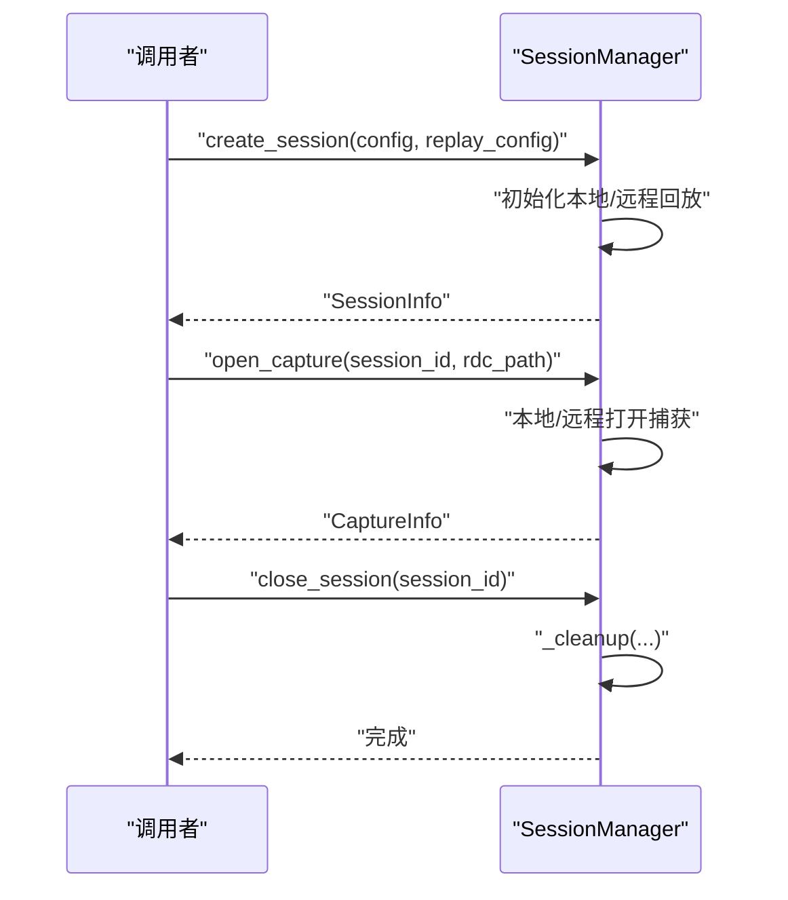
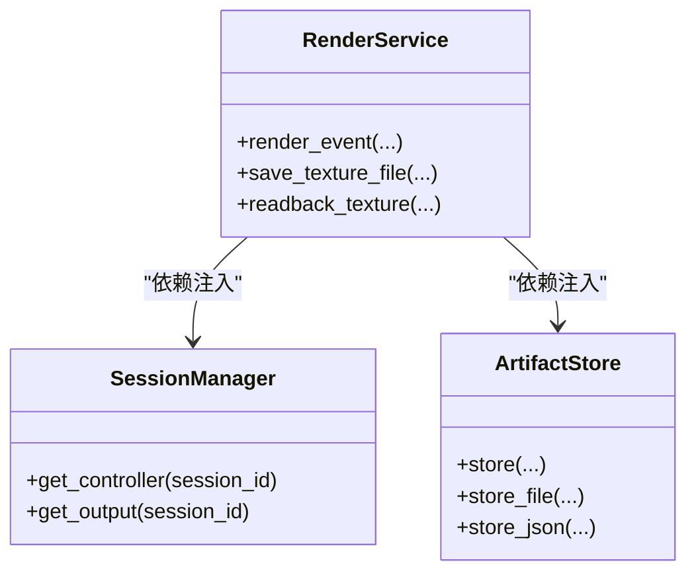
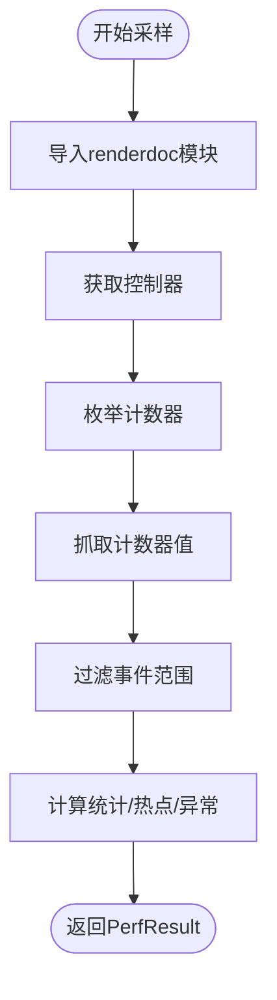
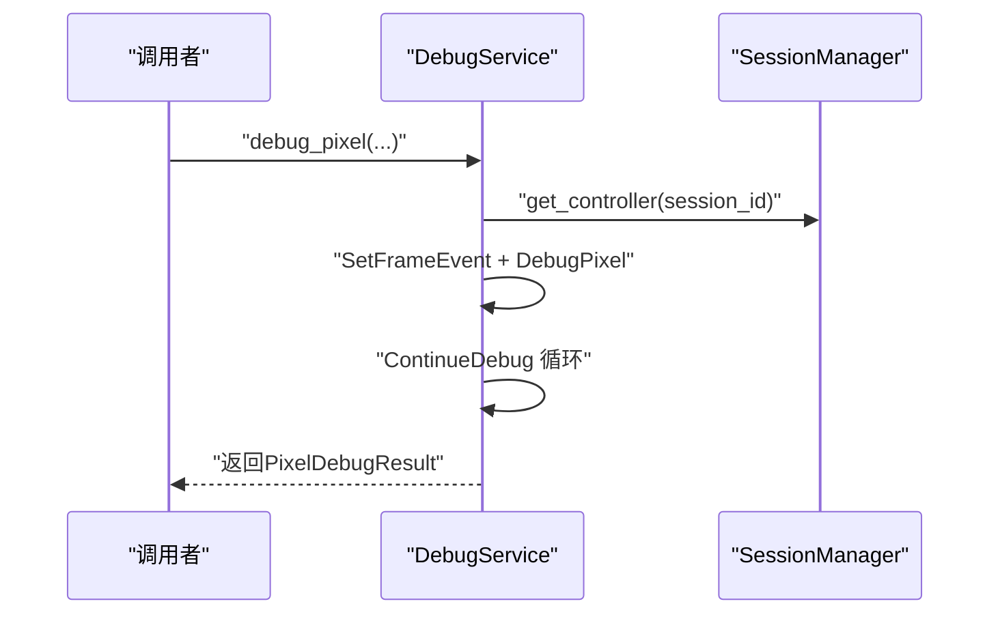
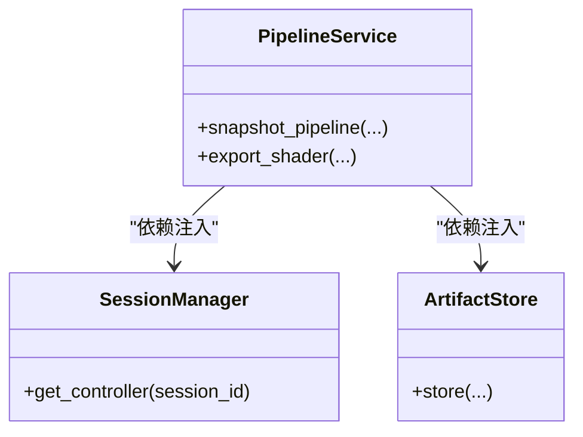
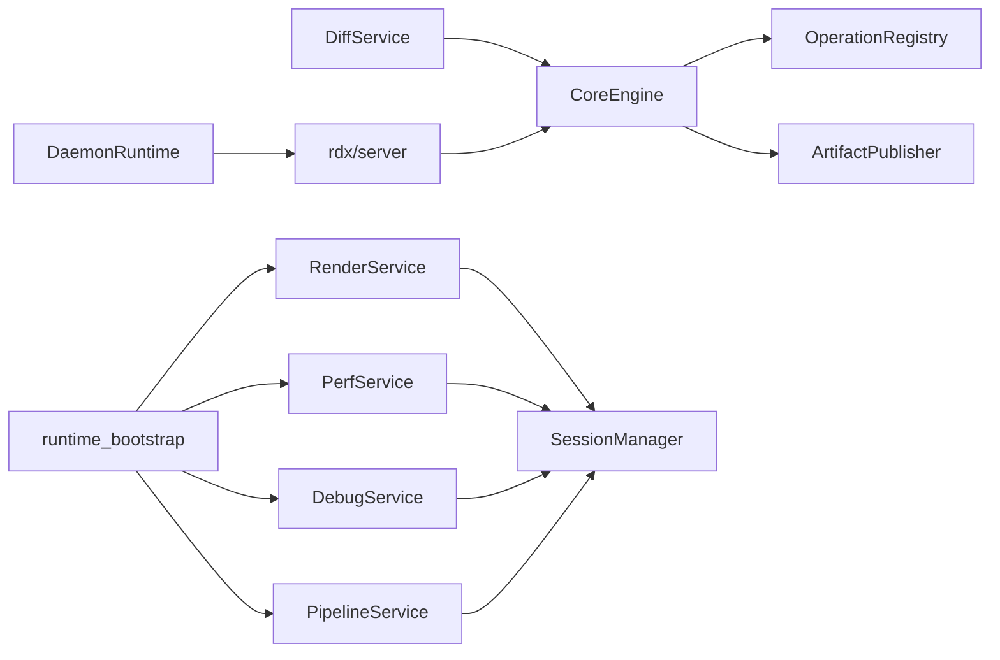

# 核心服务API

<cite>
**本文档引用的文件**
- [engine.py](file://rdx/core/engine.py)
- [session_manager.py](file://rdx/core/session_manager.py)
- [render_service.py](file://rdx/core/render_service.py)
- [diff_service.py](file://rdx/core/diff_service.py)
- [contracts.py](file://rdx/core/contracts.py)
- [artifact_publisher.py](file://rdx/core/artifact_publisher.py)
- [perf_service.py](file://rdx/core/perf_service.py)
- [debug_service.py](file://rdx/core/debug_service.py)
- [models.py](file://rdx/models.py)
- [server.py](file://rdx/server.py)
- [runtime_bootstrap.py](file://rdx/runtime_bootstrap.py)
- [operation_registry.py](file://rdx/core/operation_registry.py)
- [pipeline_service.py](file://rdx/core/pipeline_service.py)
- [experiment_runner.py](file://rdx/core/experiment_runner.py)
- [daemon/server.py](file://rdx/daemon/server.py)
</cite>

## 目录
1. [简介](#简介)
2. [项目结构](#项目结构)
3. [核心组件](#核心组件)
4. [架构总览](#架构总览)
5. [详细组件分析](#详细组件分析)
6. [依赖分析](#依赖分析)
7. [性能考虑](#性能考虑)
8. [故障排查指南](#故障排查指南)
9. [结论](#结论)
10. [附录](#附录)

## 简介
本文件面向RDX工具链的核心服务API，系统化梳理引擎、会话管理、渲染服务、差异分析、性能计数器、调试服务、流水线快照与实验编排等模块的接口规范与使用方法。内容覆盖服务初始化、配置、启动与停止流程，服务间通信、事件处理与状态同步的API使用范式，以及生命周期管理、错误处理与性能监控接口，并提供服务扩展、插件机制与自定义服务开发的实践指导。

## 项目结构
核心服务主要位于rdx/core目录下，配合rdx/models提供统一的数据契约与枚举，rdx/server与rdx/daemon/server提供运行时调度与守护进程交互入口，rdx/runtime_bootstrap提供RenderDoc运行时引导能力。

**图表来源**
- [engine.py:30-204](file://rdx/core/engine.py#L30-L204)
- [session_manager.py:147-547](file://rdx/core/session_manager.py#L147-L547)
- [render_service.py:345-800](file://rdx/core/render_service.py#L345-L800)
- [perf_service.py:168-575](file://rdx/core/perf_service.py#L168-L575)
- [debug_service.py:43-614](file://rdx/core/debug_service.py#L43-L614)
- [pipeline_service.py:629-945](file://rdx/core/pipeline_service.py#L629-L945)
- [diff_service.py:11-52](file://rdx/core/diff_service.py#L11-L52)
- [contracts.py:98-165](file://rdx/core/contracts.py#L98-L165)
- [artifact_publisher.py:15-124](file://rdx/core/artifact_publisher.py#L15-L124)
- [server.py:36-144](file://rdx/server.py#L36-L144)
- [daemon/server.py:101-200](file://rdx/daemon/server.py#L101-L200)
- [runtime_bootstrap.py:105-131](file://rdx/runtime_bootstrap.py#L105-L131)

**章节来源**
- [engine.py:1-204](file://rdx/core/engine.py#L1-L204)
- [session_manager.py:1-547](file://rdx/core/session_manager.py#L1-L547)
- [render_service.py:1-800](file://rdx/core/render_service.py#L1-L800)
- [perf_service.py:1-575](file://rdx/core/perf_service.py#L1-L575)
- [debug_service.py:1-614](file://rdx/core/debug_service.py#L1-L614)
- [pipeline_service.py:1-945](file://rdx/core/pipeline_service.py#L1-L945)
- [diff_service.py:1-52](file://rdx/core/diff_service.py#L1-L52)
- [contracts.py:1-248](file://rdx/core/contracts.py#L1-L248)
- [artifact_publisher.py:1-124](file://rdx/core/artifact_publisher.py#L1-L124)
- [models.py:1-200](file://rdx/models.py#L1-L200)
- [server.py:1-148](file://rdx/server.py#L1-L148)
- [daemon/server.py:1-200](file://rdx/daemon/server.py#L1-L200)
- [runtime_bootstrap.py:1-131](file://rdx/runtime_bootstrap.py#L1-L131)

## 核心组件
- 统一执行引擎 CoreEngine：负责操作分发、上下文注入、输出归一化与错误映射，提供稳定的异步执行接口。
- 会话管理 SessionManager：提供本地/远程RenderDoc回放会话的创建、打开捕获、控制器与输出句柄获取、清理与生命周期管理。
- 渲染服务 RenderService：封装RenderDoc纹理显示、读回与像素检查，支持多格式编码与制品存储。
- 性能计数器服务 PerfService：枚举/描述/抓取GPU性能计数器，计算统计与异常事件，检测热点。
- 调试服务 DebugService：提供像素/顶点着色器调试，逐步执行与trace持久化。
- 流水线服务 PipelineService：快照管线状态、导出反射与着色器资源。
- 差异分析服务 DiffService：基于引擎操作的事件/图像差异分析。
- 数据契约与制品发布：Contracts定义统一响应结构，ArtifactPublisher负责本地/远程制品发布策略。
- 运行时调度与守护：rdx/server提供运行时启动/关闭与操作分发，daemon/server提供守护进程监听与工作进程管理。
- 运行时引导：runtime_bootstrap负责设置环境变量与动态库路径，确保RenderDoc Python模块可用。

**章节来源**
- [engine.py:30-204](file://rdx/core/engine.py#L30-L204)
- [session_manager.py:147-547](file://rdx/core/session_manager.py#L147-L547)
- [render_service.py:345-800](file://rdx/core/render_service.py#L345-L800)
- [perf_service.py:168-575](file://rdx/core/perf_service.py#L168-L575)
- [debug_service.py:43-614](file://rdx/core/debug_service.py#L43-L614)
- [pipeline_service.py:629-945](file://rdx/core/pipeline_service.py#L629-L945)
- [diff_service.py:11-52](file://rdx/core/diff_service.py#L11-L52)
- [contracts.py:98-165](file://rdx/core/contracts.py#L98-L165)
- [artifact_publisher.py:15-124](file://rdx/core/artifact_publisher.py#L15-L124)
- [server.py:36-144](file://rdx/server.py#L36-L144)
- [daemon/server.py:101-200](file://rdx/daemon/server.py#L101-L200)
- [runtime_bootstrap.py:105-131](file://rdx/runtime_bootstrap.py#L105-L131)

## 架构总览
核心服务通过CoreEngine统一调度，SessionManager提供RenderDoc回放上下文，各功能服务以松耦合依赖注入的方式协作，运行时通过rdx/server进行启动/关闭与操作分发，守护进程通过Windows命名管道提供后台服务。

**图表来源**
- [server.py:60-144](file://rdx/server.py#L60-L144)
- [engine.py:40-76](file://rdx/core/engine.py#L40-L76)
- [render_service.py:356-521](file://rdx/core/render_service.py#L356-L521)
- [perf_service.py:191-265](file://rdx/core/perf_service.py#L191-L265)
- [debug_service.py:54-268](file://rdx/core/debug_service.py#L54-L268)

**章节来源**
- [server.py:36-144](file://rdx/server.py#L36-L144)
- [engine.py:30-204](file://rdx/core/engine.py#L30-L204)

## 详细组件分析

### 统一执行引擎 CoreEngine
- 职责：接收操作名称与参数，解析处理器，执行并归一化输出，注入trace_id、transport、耗时等元信息，统一错误映射。
- 关键接口：
  - execute(operation, args=None, context=None) -> Dict[str, Any]
  - 内部归一化逻辑：支持字符串、字典、标准响应结构，自动收集制品候选并发布。
- 上下文：ExecutionContext包含trace_id、transport、remote标记、元数据与进度上报器。
- 错误处理：捕获异常并映射为标准错误响应，保留原始细节与分类。

**图表来源**
- [engine.py:40-204](file://rdx/core/engine.py#L40-L204)
- [contracts.py:98-165](file://rdx/core/contracts.py#L98-L165)
- [artifact_publisher.py:60-118](file://rdx/core/artifact_publisher.py#L60-L118)

**章节来源**
- [engine.py:30-204](file://rdx/core/engine.py#L30-L204)
- [contracts.py:98-165](file://rdx/core/contracts.py#L98-L165)
- [artifact_publisher.py:15-124](file://rdx/core/artifact_publisher.py#L15-L124)

### 会话管理 SessionManager
- 单例模式：全局唯一实例，避免重复初始化。
- 生命周期：
  - create_session(backend_config, replay_config, preferred_session_id=None) -> SessionInfo
  - open_capture(session_id, rdc_path) -> CaptureInfo
  - close_session(session_id) -> None
  - get_session(session_id) -> SessionInfo
  - list_sessions() -> List[SessionInfo]
- 控制器与输出：get_controller(session_id)、get_output(session_id)、get_state(session_id)
- 本地/远程回放：
  - 本地：初始化Replay子系统，打开捕获文件并创建headless输出。
  - 远程：建立远程服务器连接，复制捕获至远端，打开远端捕获并创建headless输出。
- 清理：_cleanup在会话结束时释放输出、控制器、捕获文件与远程连接，必要时关闭本地Replay子系统。

**图表来源**
- [session_manager.py:174-258](file://rdx/core/session_manager.py#L174-L258)
- [session_manager.py:300-371](file://rdx/core/session_manager.py#L300-L371)
- [session_manager.py:372-442](file://rdx/core/session_manager.py#L372-L442)
- [session_manager.py:495-547](file://rdx/core/session_manager.py#L495-L547)

**章节来源**
- [session_manager.py:147-547](file://rdx/core/session_manager.py#L147-L547)
- [models.py:128-157](file://rdx/models.py#L128-L157)

### 渲染服务 RenderService
- 依赖注入：SessionManager、ArtifactStore协议，保证无状态与可测试性。
- 主要能力：
  - render_event(session_id, event_id, source_config, view_config, output_format) -> (ArtifactRef, Dict)
  - save_texture_file(session_id, event_id, texture_id, output_format, output_path=None, subresource=None) -> (ArtifactRef, Dict, Optional[str])
  - readback_texture(session_id, event_id, texture_id, subresource=None, region=None) -> (ArtifactRef, Dict)
- 关键实现要点：
  - 使用asyncio.to_thread将阻塞的RenderDoc调用移至线程池。
  - 视图配置支持缩放、通道、叠加、HDR、翻转与raw输出。
  - 图像编码支持PNG/JPG/EXR/HDR等，缺失依赖时自动降级。
  - 读回支持uint8/float32等布局推断与裁剪区域。

**图表来源**
- [render_service.py:345-800](file://rdx/core/render_service.py#L345-L800)

**章节来源**
- [render_service.py:345-800](file://rdx/core/render_service.py#L345-L800)

### 性能计数器服务 PerfService
- 能力：
  - enumerate_counters(session_id, session_manager) -> List[Dict]
  - sample_counters(session_id, event_range, counter_ids, session_manager) -> PerfResult
  - detect_hotspots(session_id, session_manager, top_k=10) -> List[Dict]
- 实现要点：
  - 延迟导入RenderDoc模块，不可用时返回空结果。
  - 通过_offload在线程池执行同步调用，避免阻塞事件循环。
  - 计算每计数器的min/max/mean/p95与热点事件，检测异常事件（z-score > 3）。

**图表来源**
- [perf_service.py:168-575](file://rdx/core/perf_service.py#L168-L575)

**章节来源**
- [perf_service.py:168-575](file://rdx/core/perf_service.py#L168-L575)

### 调试服务 DebugService
- 能力：
  - debug_pixel(session_id, event_id, x, y, sample=0, mode="run_to_naninf", max_steps=20_000) -> PixelDebugResult
  - debug_vertex(session_id, event_id, vertex_id, instance_id, max_steps=20_000) -> Dict
- 实现要点：
  - 支持D3D11/D3D12/Vulkan的shader调试，基于API能力检测。
  - 逐步执行并提取寄存器变量，支持JSON序列化与制品持久化。
  - 严格释放trace资源，避免驱动资源泄漏。

**图表来源**
- [debug_service.py:54-268](file://rdx/core/debug_service.py#L54-L268)

**章节来源**
- [debug_service.py:43-614](file://rdx/core/debug_service.py#L43-L614)

### 流水线服务 PipelineService
- 能力：
  - snapshot_pipeline(session_id, event_id, session_manager) -> PipelineSnapshot
  - export_shader(session_id, event_id, stage, session_manager, artifact_store) -> ShaderExportBundle
- 实现要点：
  - 从控制器获取管线状态与API属性，映射到统一模型。
  - 提取混合状态、深度模板、渲染目标、绑定资源、视口/裁剪、拓扑等。
  - 导出着色器反射信息与反汇编制品。

**图表来源**
- [pipeline_service.py:629-945](file://rdx/core/pipeline_service.py#L629-L945)

**章节来源**
- [pipeline_service.py:629-945](file://rdx/core/pipeline_service.py#L629-L945)

### 差异分析服务 DiffService
- 能力：
  - diff_pipeline(engine, session_id, event_a, event_b, context=None) -> Dict
  - diff_image(engine, image_a_path, image_b_path, output_path=None, context=None) -> Dict
- 实现要点：
  - 基于CoreEngine执行统一操作，屏蔽底层差异算法细节。

**章节来源**
- [diff_service.py:11-52](file://rdx/core/diff_service.py#L11-L52)

### 数据契约与制品发布
- 响应契约：canonical_success/canonical_error统一响应结构，包含schema/tool版本、result_kind、ok/data/error/artifacts/meta/projections。
- 制品发布：ArtifactPublisher根据环境变量决定本地/远程发布策略，支持S3上传与预签名URL生成。

**章节来源**
- [contracts.py:98-165](file://rdx/core/contracts.py#L98-L165)
- [artifact_publisher.py:15-124](file://rdx/core/artifact_publisher.py#L15-L124)

### 运行时调度与守护进程
- rdx/server：
  - runtime_startup/runtime_shutdown：运行时启动/关闭。
  - dispatch_operation：统一操作分发，注入ExecutionContext与进度上报器，记录操作开始/结束。
- rdx/daemon/server：
  - DaemonRuntime：守护进程运行时，维护状态、客户端心跳、租期与空闲超时，管理工作进程。

**章节来源**
- [server.py:52-144](file://rdx/server.py#L52-L144)
- [daemon/server.py:101-200](file://rdx/daemon/server.py#L101-L200)

### 运行时引导 runtime_bootstrap
- 功能：设置RDX_RUNTIME_DLL_DIR与RDX_RENDERDOC_PATH，将pymodules目录插入sys.path，添加PATH，注册DLL目录，探测renderdoc导入。
- 适用场景：独立运行时或CLI启动前准备RenderDoc Python模块可用。

**章节来源**
- [runtime_bootstrap.py:105-131](file://rdx/runtime_bootstrap.py#L105-L131)

## 依赖分析
- 组件耦合：
  - CoreEngine依赖OperationRegistry与ArtifactPublisher，通过上下文与标准化响应解耦具体操作。
  - 各功能服务通过SessionManager与ArtifactStore协议依赖注入，降低紧耦合。
  - 运行时通过rdx/server桥接CoreEngine与守护进程。
- 外部依赖：
  - RenderDoc Python模块（延迟导入），缺失时服务降级或报错。
  - numpy、PIL、imageio（图像编码与EXR/HDR支持）。
  - boto3（远程制品上传）。

**图表来源**
- [engine.py:30-204](file://rdx/core/engine.py#L30-L204)
- [operation_registry.py:18-45](file://rdx/core/operation_registry.py#L18-L45)
- [artifact_publisher.py:15-124](file://rdx/core/artifact_publisher.py#L15-L124)
- [render_service.py:345-800](file://rdx/core/render_service.py#L345-L800)
- [perf_service.py:168-575](file://rdx/core/perf_service.py#L168-L575)
- [debug_service.py:43-614](file://rdx/core/debug_service.py#L43-L614)
- [pipeline_service.py:629-945](file://rdx/core/pipeline_service.py#L629-L945)
- [diff_service.py:11-52](file://rdx/core/diff_service.py#L11-L52)
- [server.py:36-144](file://rdx/server.py#L36-L144)
- [daemon/server.py:101-200](file://rdx/daemon/server.py#L101-L200)
- [runtime_bootstrap.py:105-131](file://rdx/runtime_bootstrap.py#L105-L131)

**章节来源**
- [engine.py:30-204](file://rdx/core/engine.py#L30-L204)
- [operation_registry.py:18-45](file://rdx/core/operation_registry.py#L18-L45)
- [artifact_publisher.py:15-124](file://rdx/core/artifact_publisher.py#L15-L124)
- [render_service.py:345-800](file://rdx/core/render_service.py#L345-L800)
- [perf_service.py:168-575](file://rdx/core/perf_service.py#L168-L575)
- [debug_service.py:43-614](file://rdx/core/debug_service.py#L43-L614)
- [pipeline_service.py:629-945](file://rdx/core/pipeline_service.py#L629-L945)
- [diff_service.py:11-52](file://rdx/core/diff_service.py#L11-L52)
- [server.py:36-144](file://rdx/server.py#L36-L144)
- [daemon/server.py:101-200](file://rdx/daemon/server.py#L101-L200)
- [runtime_bootstrap.py:105-131](file://rdx/runtime_bootstrap.py#L105-L131)

## 性能考虑
- 线程池隔离：RenderDoc阻塞调用通过asyncio.to_thread/offload移交至线程池，避免事件循环阻塞。
- 延迟导入：RenderDoc模块延迟导入，减少非必要依赖加载开销。
- 制品发布策略：根据大小阈值与远程模式选择本地或S3上传，平衡I/O与网络成本。
- 统一响应与元信息：trace_id、transport、duration_ms便于端到端性能追踪与聚合分析。

[本节为通用指导，无需特定文件引用]

## 故障排查指南
- 渲染服务导入失败：
  - 现象：ImportError提示renderdoc模块不可用。
  - 处理：使用runtime_bootstrap准备运行时，确保RDX_RENDERDOC_PATH与RDX_RUNTIME_DLL_DIR正确。
- 会话管理错误：
  - 现象：SessionError包含code/message/details。
  - 处理：检查RenderDoc状态、远程端点可达性、捕获文件有效性与权限。
- 性能计数器不可用：
  - 现象：返回空列表或警告。
  - 处理：确认RenderDoc模块可用、GPU驱动支持相应计数器。
- 调试服务不支持：
  - 现象：API/driver不支持shader debugging。
  - 处理：切换到受支持的API（D3D11/D3D12/Vulkan）。
- 制品发布失败：
  - 现象：S3上传失败或阈值不足。
  - 处理：检查AWS凭据、桶权限与网络连通性。

**章节来源**
- [runtime_bootstrap.py:93-103](file://rdx/runtime_bootstrap.py#L93-L103)
- [session_manager.py:91-116](file://rdx/core/session_manager.py#L91-L116)
- [perf_service.py:50-58](file://rdx/core/perf_service.py#L50-L58)
- [debug_service.py:573-595](file://rdx/core/debug_service.py#L573-L595)
- [artifact_publisher.py:35-59](file://rdx/core/artifact_publisher.py#L35-L59)

## 结论
本文档系统化梳理了RDX核心服务API，明确了引擎、会话管理、渲染、性能、调试、流水线与差异分析等模块的职责与接口规范，提供了生命周期管理、错误处理与性能监控的实践建议，并给出了服务扩展与运行时引导的最佳实践。通过依赖注入与延迟导入等设计，核心服务具备良好的可测试性与可维护性，适合在CLI与守护进程环境中稳定运行。

[本节为总结性内容，无需特定文件引用]

## 附录

### 服务初始化与配置清单
- 初始化步骤：
  - 准备运行时：runtime_bootstrap() 设置环境变量与路径。
  - 构建CoreEngine：build_operation_registry() 注册操作，传入OperationRegistry与ArtifactPublisher。
  - 运行时启动：rdx/server.runtime_startup()。
- 关键配置：
  - RDX_RENDERDOC_PATH：RenderDoc Python模块路径。
  - RDX_RUNTIME_DLL_DIR：RenderDoc共享库目录。
  - RDX_ARTIFACT_MODE：制品发布模式（local/remote）。
  - RDX_REMOTE_ARTIFACT_MIN_BYTES：远程发布的最小字节数阈值。
  - RDX_S3_*：S3上传所需端点、桶、区域、密钥与预签名有效期。

**章节来源**
- [runtime_bootstrap.py:105-131](file://rdx/runtime_bootstrap.py#L105-L131)
- [server.py:52-58](file://rdx/server.py#L52-L58)
- [artifact_publisher.py:16-25](file://rdx/core/artifact_publisher.py#L16-L25)

### 服务间通信与事件处理
- 通信模式：CoreEngine统一调度，SessionManager提供回放上下文，各服务通过协议依赖注入。
- 事件处理：会话事件导航（SetFrameEvent）、渲染输出显示（Display/ReadbackOutputTexture）、性能计数器采样（FetchCounters）、调试trace迭代（ContinueDebug）。
- 状态同步：rdx/server在操作前后记录上下文快照与进度，守护进程维护客户端心跳与租期。

**章节来源**
- [render_service.py:420-477](file://rdx/core/render_service.py#L420-L477)
- [perf_service.py:355-361](file://rdx/core/perf_service.py#L355-L361)
- [debug_service.py:149-191](file://rdx/core/debug_service.py#L149-L191)
- [server.py:107-130](file://rdx/server.py#L107-L130)
- [daemon/server.py:169-178](file://rdx/daemon/server.py#L169-L178)

### 生命周期管理与停止流程
- 启动：runtime_startup() 初始化运行时，守护进程启动工作进程。
- 运行：dispatch_operation() 分发操作，CoreEngine执行并归一化响应。
- 停止：runtime_shutdown() 清理资源；SessionManager在close_session()中执行清理；守护进程根据租期与心跳维持状态。

**章节来源**
- [server.py:52-58](file://rdx/server.py#L52-L58)
- [session_manager.py:252-258](file://rdx/core/session_manager.py#L252-L258)
- [daemon/server.py:101-200](file://rdx/daemon/server.py#L101-L200)

### 错误处理与标准化响应
- 标准化：canonical_success/canonical_error统一响应结构，包含schema/tool版本、result_kind、ok/data/error/artifacts/meta/projections。
- 错误映射：map_exception将异常映射为CoreError，保留code/category/message/details。
- 会话错误：SessionError携带ErrorDetail，便于前端展示与诊断。

**章节来源**
- [contracts.py:98-165](file://rdx/core/contracts.py#L98-L165)
- [engine.py:62-76](file://rdx/core/engine.py#L62-L76)
- [session_manager.py:141-145](file://rdx/core/session_manager.py#L141-L145)

### 性能监控接口
- Trace与元信息：trace_id、transport、duration_ms，便于端到端追踪。
- 进度上报：ProgressReporter与ProgressSink结合，记录操作开始/结束与上下文快照。
- 性能计数器：PerfService提供枚举、采样、热点检测与异常事件识别。

**章节来源**
- [engine.py:56-61](file://rdx/core/engine.py#L56-L61)
- [server.py:77-86](file://rdx/server.py#L77-L86)
- [perf_service.py:191-265](file://rdx/core/perf_service.py#L191-L265)

### 服务扩展与插件机制
- 操作注册：OperationRegistry.register/register_many/set_default，统一由CoreEngine解析与执行。
- 依赖注入：服务通过协议（SessionManager、ArtifactStore）解耦，便于替换实现与测试。
- 自定义服务：遵循协议接口，接入OperationRegistry即可被CoreEngine调度。

**章节来源**
- [operation_registry.py:18-45](file://rdx/core/operation_registry.py#L18-L45)
- [render_service.py:64-91](file://rdx/core/render_service.py#L64-L91)
- [pipeline_service.py:53-80](file://rdx/core/pipeline_service.py#L53-L80)

### 自定义服务开发指导
- 设计原则：无状态、异步、协议依赖注入、延迟导入外部模块。
- 开发步骤：
  - 定义协议与最小接口。
  - 实现服务方法，使用to_thread/offload隔离阻塞调用。
  - 注册到OperationRegistry，编写测试用例与错误分支处理。
  - 通过CoreEngine.execute统一调度，确保标准化响应与制品发布。

**章节来源**
- [render_service.py:345-521](file://rdx/core/render_service.py#L345-L521)
- [perf_service.py:168-265](file://rdx/core/perf_service.py#L168-L265)
- [debug_service.py:43-268](file://rdx/core/debug_service.py#L43-L268)
- [pipeline_service.py:629-945](file://rdx/core/pipeline_service.py#L629-L945)
- [operation_registry.py:18-45](file://rdx/core/operation_registry.py#L18-L45)