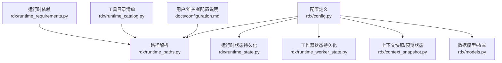
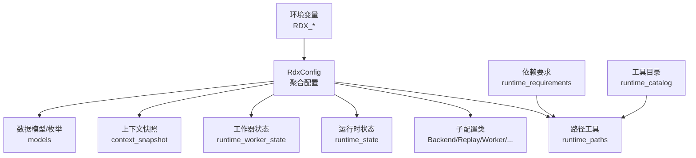
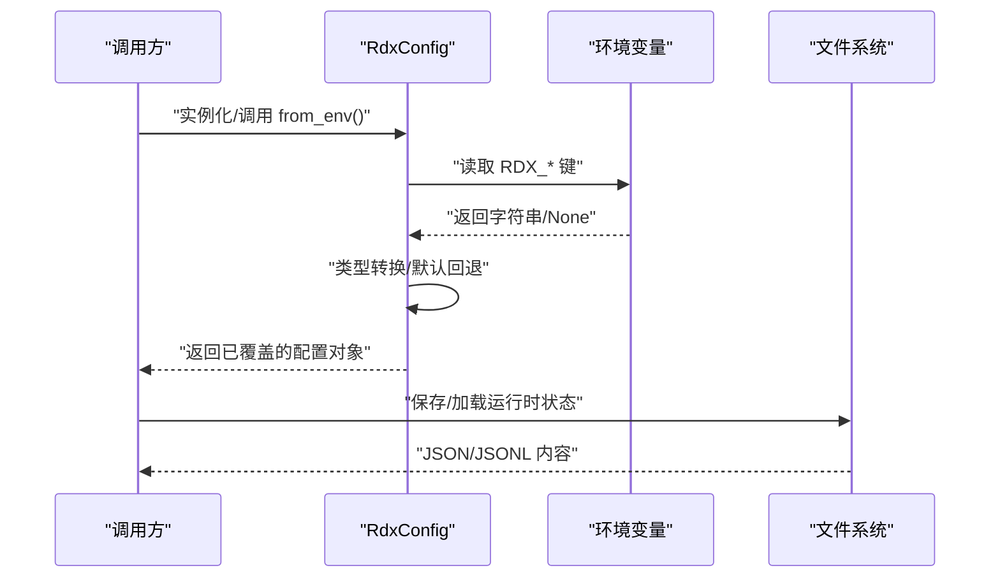
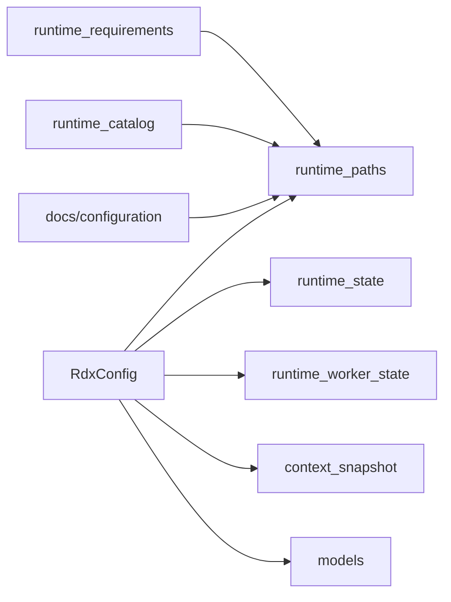
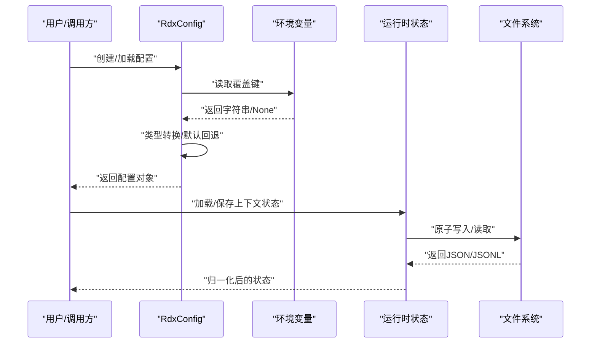

# 配置API

<cite>
**本文引用的文件**
- [rdx/config.py](file://rdx/config.py)
- [rdx/runtime_paths.py](file://rdx/runtime_paths.py)
- [rdx/models.py](file://rdx/models.py)
- [rdx/runtime_state.py](file://rdx/runtime_state.py)
- [rdx/runtime_worker_state.py](file://rdx/runtime_worker_state.py)
- [docs/configuration.md](file://docs/configuration.md)
- [rdx/context_snapshot.py](file://rdx/context_snapshot.py)
- [rdx/runtime_requirements.py](file://rdx/runtime_requirements.py)
- [rdx/runtime_catalog.py](file://rdx/runtime_catalog.py)
</cite>

## 目录
1. [简介](#简介)
2. [项目结构](#项目结构)
3. [核心组件](#核心组件)
4. [架构总览](#架构总览)
5. [详细组件分析](#详细组件分析)
6. [依赖分析](#依赖分析)
7. [性能考虑](#性能考虑)
8. [故障排查指南](#故障排查指南)
9. [结论](#结论)
10. [附录](#附录)

## 简介
本文件系统性梳理 RDX 工具链中的“配置API”，覆盖以下方面：
- 运行时配置：集中于 RdxConfig 及其子配置类，定义渲染后端、回放行为、工作线程、工件存储、数据库、二分定位、补丁、报告、置信度权重、快照保留、运行时限制、自适应二分等。
- 路径配置：通过 runtime_paths 提供工具根目录、中间产物目录、日志、工件、运行时状态等路径解析与校验。
- 需求配置：runtime_requirements 定义运行时必需依赖及打包排除规则；runtime_catalog 提供工具目录清单读取与校验。
- 环境变量支持：RdxConfig.from_env 支持从环境变量覆盖上述配置项。
- 加载/保存/验证：结合 runtime_state、runtime_worker_state、context_snapshot 等模块实现持久化与归一化。
- 继承与覆盖：默认值优先，环境变量覆盖，运行时状态合并与归一化。

## 项目结构
与配置API直接相关的代码主要分布在以下模块：
- 配置定义与环境变量覆盖：rdx/config.py
- 路径解析与运行时目录确保：rdx/runtime_paths.py
- 运行时状态持久化与归一化：rdx/runtime_state.py、rdx/runtime_worker_state.py、rdx/context_snapshot.py
- 数据模型与枚举（用于配置项的语义约束）：rdx/models.py
- 运行时依赖与打包策略：rdx/runtime_requirements.py
- 工具目录清单：rdx/runtime_catalog.py
- 用户与维护者配置说明：docs/configuration.md

**图表来源**
- [rdx/config.py:118-185](file://rdx/config.py#L118-L185)
- [rdx/runtime_paths.py:14-121](file://rdx/runtime_paths.py#L14-L121)
- [rdx/runtime_state.py:388-416](file://rdx/runtime_state.py#L388-L416)
- [rdx/runtime_worker_state.py:35-48](file://rdx/runtime_worker_state.py#L35-L48)
- [rdx/context_snapshot.py:130-171](file://rdx/context_snapshot.py#L130-L171)
- [rdx/models.py:28-97](file://rdx/models.py#L28-L97)
- [rdx/runtime_requirements.py:7-73](file://rdx/runtime_requirements.py#L7-L73)
- [rdx/runtime_catalog.py:12-28](file://rdx/runtime_catalog.py#L12-L28)
- [docs/configuration.md:1-18](file://docs/configuration.md#L1-L18)

**章节来源**
- [rdx/config.py:118-185](file://rdx/config.py#L118-L185)
- [rdx/runtime_paths.py:14-121](file://rdx/runtime_paths.py#L14-L121)
- [docs/configuration.md:1-18](file://docs/configuration.md#L1-L18)

## 核心组件
- RdxConfig：顶层配置聚合，包含 BackendConfig、ReplayConfig、WorkerConfig、ArtifactConfig、DatabaseConfig、BisectConfig、PatchConfig、ReportConfig、ConfidenceWeightsConfig、SnapshotRetentionConfig、RuntimeLimitsConfig、AdaptiveBisectConfig 等子配置，并提供 from_env 从环境变量加载。
- 各子配置类：分别描述后端、回放、工作器、工件、数据库、二分、补丁、报告、置信度权重、快照保留、运行时限制、自适应二分等。
- 路径工具：tools_root、runtime_root、artifacts_dir、logs_dir、ensure_runtime_dirs 等，统一管理运行时目录与默认路径。
- 运行时状态：上下文状态、工作器状态、日志的加载/保存/清理，以及预览显示状态归一化。
- 数据模型与枚举：BackendType、GraphicsAPI、ShaderStage、BugType、VerifierType、PatchType、ExperimentStatus、VerdictResult、BisectStrategy 等，为配置项提供语义约束。
- 依赖与目录清单：runtime_requirements 提供依赖检查与打包过滤；runtime_catalog 提供工具目录清单读取与校验。

**章节来源**
- [rdx/config.py:15-185](file://rdx/config.py#L15-L185)
- [rdx/runtime_paths.py:14-121](file://rdx/runtime_paths.py#L14-L121)
- [rdx/runtime_state.py:388-416](file://rdx/runtime_state.py#L388-L416)
- [rdx/runtime_worker_state.py:35-48](file://rdx/runtime_worker_state.py#L35-L48)
- [rdx/context_snapshot.py:130-171](file://rdx/context_snapshot.py#L130-L171)
- [rdx/models.py:28-97](file://rdx/models.py#L28-L97)
- [rdx/runtime_requirements.py:7-73](file://rdx/runtime_requirements.py#L7-L73)
- [rdx/runtime_catalog.py:12-28](file://rdx/runtime_catalog.py#L12-L28)

## 架构总览
下图展示配置API在系统中的角色与交互：

**图表来源**
- [rdx/config.py:135-185](file://rdx/config.py#L135-L185)
- [rdx/runtime_paths.py:14-121](file://rdx/runtime_paths.py#L14-L121)
- [rdx/runtime_state.py:388-416](file://rdx/runtime_state.py#L388-L416)
- [rdx/runtime_worker_state.py:35-48](file://rdx/runtime_worker_state.py#L35-L48)
- [rdx/context_snapshot.py:130-171](file://rdx/context_snapshot.py#L130-L171)
- [rdx/models.py:28-97](file://rdx/models.py#L28-L97)
- [rdx/runtime_requirements.py:7-73](file://rdx/runtime_requirements.py#L7-L73)
- [rdx/runtime_catalog.py:12-28](file://rdx/runtime_catalog.py#L12-L28)

## 详细组件分析

### RdxConfig 与子配置类
- RdxConfig 聚合了所有配置子类，并提供 from_env 从环境变量覆盖配置项。
- 子配置类涵盖：
  - BackendConfig：后端类型、GPU厂商、GPU索引、远程主机/端口/协议/认证方式与值。
  - ReplayConfig：无头模式、优化等级、默认输出分辨率、纹理回读上限、回放超时。
  - WorkerConfig：每GPU最大工作器数、最大远程控制器数、任务队列大小、工作器超时。
  - ArtifactConfig：工件存储路径、最大存储容量、哈希算法、是否压缩。
  - DatabaseConfig：元数据与指纹数据库路径。
  - BisectConfig：二分策略、最大迭代次数、置信度阈值、边界早停、置信度配置文件。
  - PatchConfig：最大补丁操作数、崩溃自动回滚、保留原始着色器、SPIRV-Tools/DXC 路径。
  - ReportConfig：报告输出目录、HTML/Markdown/JSON生成、内嵌缩略图、最大内嵌宽度。
  - ConfidenceWeightsConfig：置信度权重（锐度、一致性、范围因子）。
  - SnapshotRetentionConfig：快照总数与按类型限制。
  - RuntimeLimitsConfig：上下文/会话/捕获文件/大小/回放内存估计与倍率、最近操作数。
  - AdaptiveBisectConfig：自适应二分模式与历史记录路径。
  - 其它字段：renderdoc_module_path（可选）、log_level（字符串）。

- 环境变量覆盖键（节选）：
  - RDX_RENDERDOC_PATH、RDX_ARTIFACT_STORE、RDX_DATA_DIR、RDX_REPORT_DIR、RDX_LOG_LEVEL、RDX_GPU_VENDOR、RDX_SPIRV_TOOLS_PATH、RDX_HEADLESS、RDX_BISECT_CONFIDENCE_*、RDX_BISECT_PROFILE、RDX_BISECT_ADAPTIVE_MODE、RDX_BISECT_HISTORY_STORE、RDX_CONTEXT_ARTIFACT_*、RDX_MAX_*（上下文、会话、捕获文件、捕获大小、回放内存、倍率、最近操作数）。

- 默认值与类型：
  - 多数字段在 dataclass 中声明默认值或工厂函数，如 Path 默认来自 runtime_paths 工具函数。
  - 环境变量覆盖时进行类型转换（整型、浮点、布尔），失败则回退到默认值。

- 使用场景：
  - 渲染后端选择（本地/远程）、GPU厂商筛选、远程调试与认证。
  - 回放性能与资源控制（分辨率、纹理回读上限、超时）。
  - 并发与队列（工作器数、队列大小、超时）。
  - 工件与报告（存储位置、压缩、报告格式、缩略图）。
  - 二分与自适应二分（策略、迭代、置信度权重与配置文件）。
  - 运行时限制（上下文/会话/捕获/内存/倍率/最近操作）。

**章节来源**
- [rdx/config.py:15-185](file://rdx/config.py#L15-L185)

### 路径配置与运行时目录
- tools_root：优先使用环境变量 RDX_TOOLS_ROOT，否则回退到脚本包根目录；冲突时仅警告一次并以环境变量为准。
- runtime_root、artifacts_dir、logs_dir、cli_runtime_dir、worker_state_dir、intermediate_root、pytest_dir 等提供统一路径。
- ensure_runtime_dirs：确保运行时所需目录存在。

- 用途：
  - 作为默认数据库、工件、日志、运行时状态等路径的基础。
  - 在用户未安装Python或打包发布时，通过 RDX_TOOLS_ROOT 控制工具根目录。

**章节来源**
- [rdx/runtime_paths.py:14-121](file://rdx/runtime_paths.py#L14-L121)
- [docs/configuration.md:7-13](file://docs/configuration.md#L7-L13)

### 运行时状态与持久化
- 上下文状态：
  - default_context_state：生成默认上下文状态字典，包含 schema 版本、当前捕获/会话、后端、恢复信息、预览状态、限制、指标、时间戳等。
  - normalize_context_state：将外部输入与默认值合并，执行字段归一化（类型转换、截断、安全化）。
  - load/save/clear/list：提供原子写入、锁定访问、清理与列表枚举。
- 日志：
  - append_runtime_log、read_runtime_logs：JSONL 追加与读取，支持时间过滤与行数限制。
- 工作器状态：
  - load/save/clear：工作器状态 JSON 原子写入与清理。
- 预览状态：
  - default_preview_state/normalize_preview_state：预览视图模式、绑定会话/捕获/事件、后端、错误信息、显示参数（窗口/视口/裁剪/区域标记/适配模式/屏幕截图比例）等。

- 关键流程（加载/保存）：

**图表来源**
- [rdx/config.py:135-185](file://rdx/config.py#L135-L185)
- [rdx/runtime_state.py:388-416](file://rdx/runtime_state.py#L388-L416)
- [rdx/runtime_worker_state.py:35-48](file://rdx/runtime_worker_state.py#L35-L48)

**章节来源**
- [rdx/runtime_state.py:92-149](file://rdx/runtime_state.py#L92-L149)
- [rdx/runtime_state.py:293-385](file://rdx/runtime_state.py#L293-L385)
- [rdx/runtime_state.py:388-416](file://rdx/runtime_state.py#L388-L416)
- [rdx/runtime_worker_state.py:35-48](file://rdx/runtime_worker_state.py#L35-L48)
- [rdx/context_snapshot.py:130-171](file://rdx/context_snapshot.py#L130-L171)

### 数据模型与枚举（配置语义）
- 枚举类型：
  - BackendType、GraphicsAPI、ShaderStage、BugType、VerifierType、PatchType、ExperimentStatus、VerdictResult、BisectStrategy。
- 作用：
  - 为配置项提供合法取值范围与语义约束，避免非法状态进入运行时。

**章节来源**
- [rdx/models.py:28-97](file://rdx/models.py#L28-L97)

### 运行时依赖与打包策略
- 必需依赖：pydantic、numpy、Pillow、jinja2、aiofiles。
- 打包排除：针对测试、虚拟环境、构建工具等前缀进行排除，确保运行时精简。

**章节来源**
- [rdx/runtime_requirements.py:7-73](file://rdx/runtime_requirements.py#L7-L73)

### 工具目录清单
- 读取工具目录清单 JSON，校验工具数量、名称唯一性、前缀合法性。

**章节来源**
- [rdx/runtime_catalog.py:12-28](file://rdx/runtime_catalog.py#L12-L28)

## 依赖分析
- 配置层依赖路径工具以确定默认路径；运行时状态模块依赖路径工具与原子IO工具进行持久化。
- 数据模型为配置项提供语义约束；依赖与目录清单为运行时打包与发现提供依据。
- 文档模块提供用户/维护者配置说明，指导环境变量与根目录设置。

**图表来源**
- [rdx/config.py:118-185](file://rdx/config.py#L118-L185)
- [rdx/runtime_paths.py:14-121](file://rdx/runtime_paths.py#L14-L121)
- [rdx/runtime_state.py:388-416](file://rdx/runtime_state.py#L388-L416)
- [rdx/runtime_worker_state.py:35-48](file://rdx/runtime_worker_state.py#L35-L48)
- [rdx/context_snapshot.py:130-171](file://rdx/context_snapshot.py#L130-L171)
- [rdx/models.py:28-97](file://rdx/models.py#L28-L97)
- [rdx/runtime_requirements.py:7-73](file://rdx/runtime_requirements.py#L7-L73)
- [rdx/runtime_catalog.py:12-28](file://rdx/runtime_catalog.py#L12-L28)
- [docs/configuration.md:1-18](file://docs/configuration.md#L1-L18)

**章节来源**
- [rdx/config.py:118-185](file://rdx/config.py#L118-L185)
- [rdx/runtime_paths.py:14-121](file://rdx/runtime_paths.py#L14-L121)
- [rdx/runtime_state.py:388-416](file://rdx/runtime_state.py#L388-L416)
- [rdx/runtime_worker_state.py:35-48](file://rdx/runtime_worker_state.py#L35-L48)
- [rdx/context_snapshot.py:130-171](file://rdx/context_snapshot.py#L130-L171)
- [rdx/models.py:28-97](file://rdx/models.py#L28-L97)
- [rdx/runtime_requirements.py:7-73](file://rdx/runtime_requirements.py#L7-L73)
- [rdx/runtime_catalog.py:12-28](file://rdx/runtime_catalog.py#L12-L28)
- [docs/configuration.md:1-18](file://docs/configuration.md#L1-L18)

## 性能考虑
- 回放超时与纹理回读上限：防止长时间回放与大体积纹理读回导致内存压力。
- 运行时限制：通过 max_* 与倍率控制上下文/会话/捕获规模与回放内存占用。
- 队列与并发：task_queue_size 与 max_workers_per_gpu 影响吞吐与资源竞争。
- 报告与工件：压缩与内嵌缩略图影响I/O与存储开销。
- 状态持久化：原子写入与锁定机制保证并发安全，但频繁写入可能带来I/O压力。

[本节为通用建议，不直接分析具体文件]

## 故障排查指南
- 环境变量未生效：
  - 确认键名拼写正确且值可被转换（整型/浮点/布尔）。
  - 检查 RDX_TOOLS_ROOT 是否与脚本根目录冲突（仅警告一次）。
- 路径不存在或权限不足：
  - 使用 ensure_runtime_dirs 确保目录存在；检查写权限。
- 运行时状态损坏：
  - 使用 clear_* 方法清理状态文件后重试；必要时检查日志文件。
- 依赖缺失：
  - 使用 missing_dependencies 检查缺失的运行时依赖。
- 工具目录清单异常：
  - 校验工具数量与名称唯一性、前缀合法性。

**章节来源**
- [rdx/config.py:135-185](file://rdx/config.py#L135-L185)
- [rdx/runtime_paths.py:14-121](file://rdx/runtime_paths.py#L14-L121)
- [rdx/runtime_state.py:419-424](file://rdx/runtime_state.py#L419-L424)
- [rdx/runtime_worker_state.py:51-55](file://rdx/runtime_worker_state.py#L51-L55)
- [rdx/runtime_requirements.py:52-57](file://rdx/runtime_requirements.py#L52-L57)
- [rdx/runtime_catalog.py:16-28](file://rdx/runtime_catalog.py#L16-L28)
- [docs/configuration.md:7-13](file://docs/configuration.md#L7-L13)

## 结论
配置API通过 RdxConfig 聚合各类配置，并以环境变量提供灵活覆盖；配合路径工具与运行时状态持久化，形成从“默认值—环境变量—运行时状态”的多层配置体系。数据模型与枚举为配置项提供语义约束，依赖与目录清单保障运行时可用性。建议在生产环境中明确设置 RDX_TOOLS_ROOT 与必要的 RDX_* 环境变量，并结合运行时限制与回放参数控制资源占用。

[本节为总结，不直接分析具体文件]

## 附录

### 接口规范与字段说明（摘要）
- RdxConfig
  - 字段：backend、replay、worker、artifact、database、bisect、patch、report、confidence_weights、snapshot_retention、runtime_limits、adaptive_bisect、renderdoc_module_path、log_level
  - 方法：from_env
- BackendConfig
  - 字段：type、gpu_vendor、gpu_index、remote_host、remote_port、remote_protocol、remote_auth_mode、remote_auth_value
- ReplayConfig
  - 字段：headless、optimisation_level、default_output_width、default_output_height、max_texture_readback_bytes、replay_timeout_seconds
- WorkerConfig
  - 字段：max_workers_per_gpu、max_remote_controllers、task_queue_size、worker_timeout_seconds
- ArtifactConfig
  - 字段：store_path、max_store_size_gb、hash_algorithm、compress_artifacts
- DatabaseConfig
  - 字段：path、fingerprint_path
- BisectConfig
  - 字段：default_strategy、max_iterations、default_confidence_threshold、early_stop_on_clear_boundary、confidence_profile
- PatchConfig
  - 字段：max_patch_ops、auto_revert_on_crash、preserve_original_shaders、spirv_tools_path、dxc_path
- ReportConfig
  - 字段：output_path、generate_html、generate_markdown、generate_json、embed_thumbnails、max_embedded_image_width
- ConfidenceWeightsConfig
  - 字段：sharpness、consistency、range_factor
- SnapshotRetentionConfig
  - 字段：total_limit、per_type_limit
- RuntimeLimitsConfig
  - 字段：max_contexts、max_sessions_per_context、max_capture_files、max_capture_size_bytes、max_estimated_replay_memory_bytes、replay_memory_multiplier、max_recent_operations
- AdaptiveBisectConfig
  - 字段：mode、history_store_path

**章节来源**
- [rdx/config.py:15-131](file://rdx/config.py#L15-L131)

### 环境变量覆盖映射（摘要）
- RDX_RENDERDOC_PATH → renderdoc_module_path
- RDX_ARTIFACT_STORE → artifact.store_path
- RDX_DATA_DIR → database.path/fingerprint_path（拼接）
- RDX_REPORT_DIR → report.output_path
- RDX_LOG_LEVEL → log_level
- RDX_GPU_VENDOR → backend.gpu_vendor
- RDX_SPIRV_TOOLS_PATH → patch.spirv_tools_path
- RDX_HEADLESS → replay.headless（1/true/yes 视为真）
- RDX_BISECT_CONFIDENCE_* → confidence_weights.*（sharpness/consistency/range_factor）
- RDX_BISECT_PROFILE → bisect.confidence_profile
- RDX_BISECT_ADAPTIVE_MODE → adaptive_bisect.mode
- RDX_BISECT_HISTORY_STORE → adaptive_bisect.history_store_path
- RDX_CONTEXT_ARTIFACT_TOTAL_LIMIT → snapshot_retention.total_limit
- RDX_CONTEXT_ARTIFACT_PER_TYPE_LIMIT → snapshot_retention.per_type_limit
- RDX_MAX_CONTEXTS、RDX_MAX_SESSIONS_PER_CONTEXT、RDX_MAX_CAPTURE_FILES、RDX_MAX_CAPTURE_SIZE_BYTES、RDX_MAX_ESTIMATED_REPLAY_MEMORY_BYTES、RDX_REPLAY_MEMORY_MULTIPLIER、RDX_MAX_RECENT_OPERATIONS → runtime_limits.*

**章节来源**
- [rdx/config.py:135-185](file://rdx/config.py#L135-L185)

### 加载/保存/验证流程（序列图）

**图表来源**
- [rdx/config.py:135-185](file://rdx/config.py#L135-L185)
- [rdx/runtime_state.py:388-416](file://rdx/runtime_state.py#L388-L416)