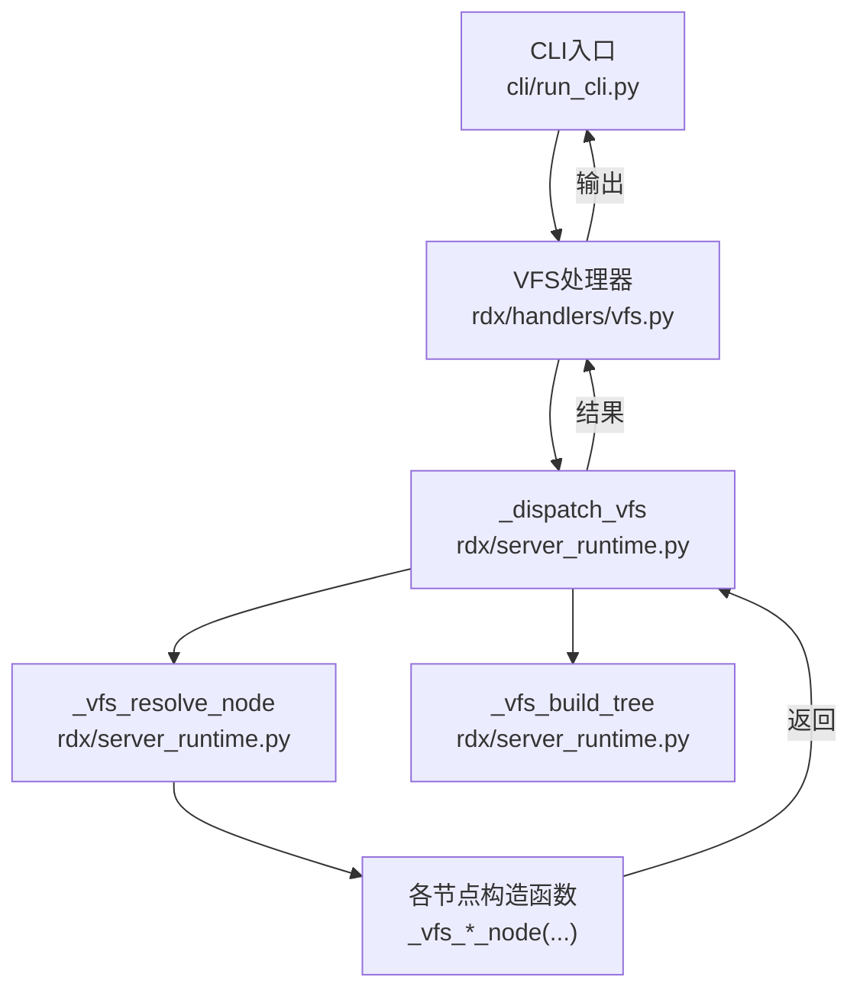
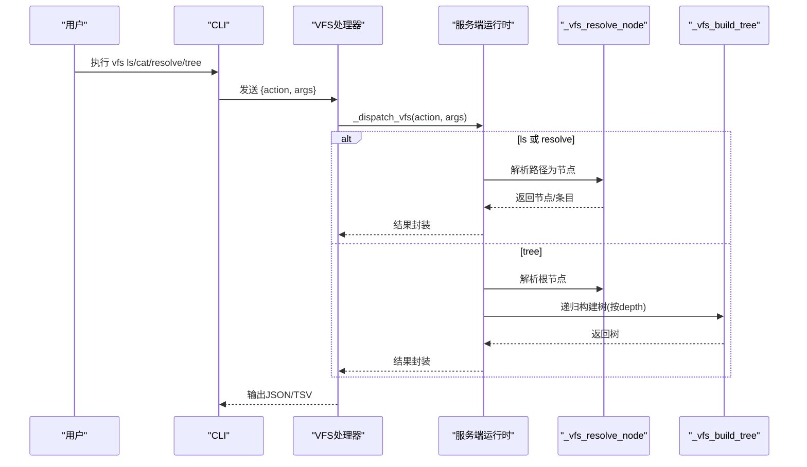
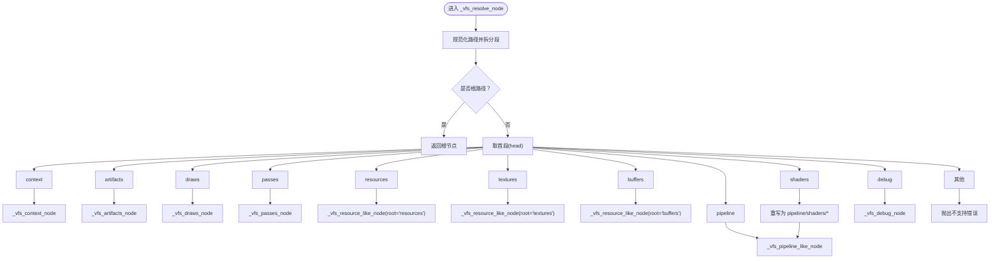
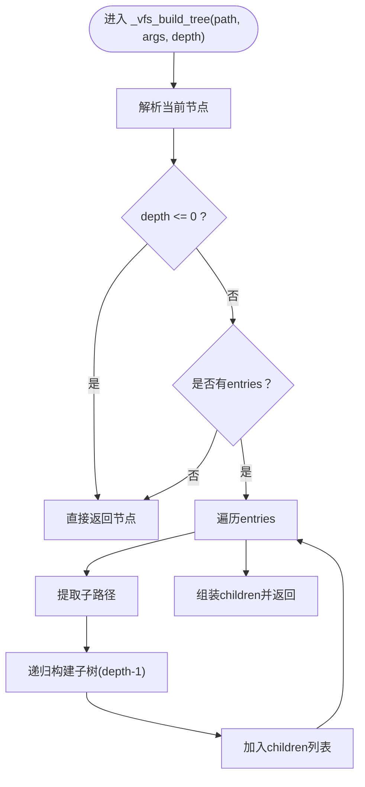
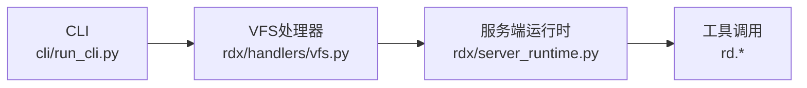

# VFS命令

<cite>
**本文引用的文件**
- [rdx\handlers\vfs.py](file://rdx/handlers/vfs.py)
- [rdx\server_runtime.py](file://rdx/server_runtime.py)
- [tests\test_cli_vfs.py](file://tests/test_cli_vfs.py)
- [tests\test_vfs.py](file://tests/test_vfs.py)
- [cli\run_cli.py](file://cli/run_cli.py)
</cite>

## 目录
1. [简介](#简介)
2. [项目结构](#项目结构)
3. [核心组件](#核心组件)
4. [架构总览](#架构总览)
5. [详细组件分析](#详细组件分析)
6. [依赖分析](#依赖分析)
7. [性能考量](#性能考量)
8. [故障排查指南](#故障排查指南)
9. [结论](#结论)
10. [附录](#附录)

## 简介
本文件面向使用 RDX Agent Tools 的开发者与工具使用者，系统化阐述 VFS（虚拟文件系统）命令族：vfs ls、vfs cat、vfs tree、vfs resolve 的设计与用法。内容覆盖：
- 虚拟文件系统的概念、结构与访问机制
- 文件浏览、内容查看与路径解析的使用方法
- VFS 与底层渲染会话/资源的关系及权限控制要点
- 导航最佳实践、性能优化建议
- 复杂文件结构的浏览技巧与搜索方法

## 项目结构
VFS 命令由 CLI 入口调用，经由处理器转发到服务端运行时，再根据路径解析为具体节点并返回树形或条目数据。

图表来源
- [rdx/handlers/vfs.py:8-10](file://rdx/handlers/vfs.py#L8-L10)
- [rdx/server_runtime.py:12302-12338](file://rdx/server_runtime.py#L12302-L12338)
- [rdx/server_runtime.py:12253-12282](file://rdx/server_runtime.py#L12253-L12282)
- [rdx/server_runtime.py:12284-12299](file://rdx/server_runtime.py#L12284-L12299)

章节来源
- [rdx/handlers/vfs.py:1-10](file://rdx/handlers/vfs.py#L1-L10)
- [rdx/server_runtime.py:12253-12338](file://rdx/server_runtime.py#L12253-L12338)

## 核心组件
- VFS 处理器：接收动作与参数，委托给服务端运行时执行。
- 服务端运行时：
  - 动作分发器：根据 action 分派到 ls/cat/resolve/tree。
  - 路径解析器：将输入路径规范化并拆分为段，按根节点分支处理。
  - 树构建器：递归展开指定深度的子节点，形成带 children 的树结构。
- 节点工厂：为不同根路径（如 context/artifacts/draws/passes/resources/textures/buffers/pipeline/shaders/debug）生成节点描述与条目列表。
- 投影支持：ls 支持表投影（tabular），用于 TSV 渲染与列选择。

章节来源
- [rdx/handlers/vfs.py:8-10](file://rdx/handlers/vfs.py#L8-L10)
- [rdx/server_runtime.py:12302-12338](file://rdx/server_runtime.py#L12302-L12338)
- [rdx/server_runtime.py:12253-12282](file://rdx/server_runtime.py#L12253-L12282)
- [rdx/server_runtime.py:12284-12299](file://rdx/server_runtime.py#L12284-L12299)

## 架构总览
VFS 命令的请求-响应流程如下：

图表来源
- [rdx/handlers/vfs.py:8-10](file://rdx/handlers/vfs.py#L8-L10)
- [rdx/server_runtime.py:12302-12338](file://rdx/server_runtime.py#L12302-L12338)
- [rdx/server_runtime.py:12253-12282](file://rdx/server_runtime.py#L12253-L12282)
- [rdx/server_runtime.py:12284-12299](file://rdx/server_runtime.py#L12284-L12299)

## 详细组件分析

### VFS 命令族与行为
- vfs ls
  - 功能：列出指定路径下的条目；支持投影（tabular）以生成 TSV 文本。
  - 关键点：仅 ls 支持投影；其他动作不支持。
- vfs cat
  - 功能：解析并返回目标节点（通常包含 data 或 entries）。
- vfs resolve
  - 功能：解析路径为节点，不展开子项。
- vfs tree
  - 功能：从根节点开始，按指定深度递归构建树结构，包含 children 字段。

章节来源
- [rdx/server_runtime.py:12302-12338](file://rdx/server_runtime.py#L12302-L12338)

### 路径解析与节点类型
VFS 将路径按“根域”进行分支解析，常见根域包括：
- context：上下文相关资源
- artifacts：产物集合
- draws：绘制事件
- passes：渲染阶段
- resources/textures/buffers：资源类节点
- pipeline/shaders：管线与着色器相关
- debug：调试相关

解析器会根据路径首段选择对应节点构造函数，部分节点需要有效的会话 ID（requires_session）。

图表来源
- [rdx/server_runtime.py:12253-12282](file://rdx/server_runtime.py#L12253-L12282)

章节来源
- [rdx/server_runtime.py:12253-12282](file://rdx/server_runtime.py#L12253-L12282)

### 树构建算法
tree 操作通过递归构建子树，深度由参数 depth 控制。当 depth 为 0 时只返回当前节点；否则对每个条目递归构建子树并挂载到 children。

图表来源
- [rdx/server_runtime.py:12284-12299](file://rdx/server_runtime.py#L12284-L12299)

章节来源
- [rdx/server_runtime.py:12284-12299](file://rdx/server_runtime.py#L12284-L12299)

### 投影与 TSV 渲染
- ls 支持投影（tabular），可选择是否包含 TSV 文本。
- 测试中验证了投影参数传递与 TSV 文本生成。

章节来源
- [rdx/server_runtime.py:12302-12338](file://rdx/server_runtime.py#L12302-L12338)
- [tests/test_cli_vfs.py:266-290](file://tests/test_cli_vfs.py#L266-L290)

### 权限与会话控制
- 部分节点要求有效的会话 ID（requires_session=true），例如纹理/缓冲区数据读取、管线状态查询等。
- 解析器在涉及这些节点时会校验并注入 session_id 参数。

章节来源
- [rdx/server_runtime.py:12163-12168](file://rdx/server_runtime.py#L12163-L12168)
- [rdx/server_runtime.py:12274-12278](file://rdx/server_runtime.py#L12274-L12278)

## 依赖分析
- 处理器依赖服务端运行时的分发与解析能力。
- 服务端运行时内部依赖会话与工具调用（如 rd.pipeline.get_state、rd.texture.get_data、rd.buffer.get_data）以填充节点数据。
- CLI 通过统一的执行器与投影机制对接 VFS。

图表来源
- [rdx/handlers/vfs.py:8-10](file://rdx/handlers/vfs.py#L8-L10)
- [rdx/server_runtime.py:12302-12338](file://rdx/server_runtime.py#L12302-L12338)

章节来源
- [rdx/handlers/vfs.py:8-10](file://rdx/handlers/vfs.py#L8-L10)
- [rdx/server_runtime.py:12302-12338](file://rdx/server_runtime.py#L12302-L12338)

## 性能考量
- 合理设置 tree 的 depth：深度越大，请求体量与序列化开销越高。
- 优先使用 resolve 与 ls 获取概览，再针对目标路径使用 tree 或 cat。
- 对于大目录，尽量避免一次性拉取所有子项，分层展开。
- 使用投影（ls）可减少冗余字段传输，提升终端渲染效率。

## 故障排查指南
- 不支持的动作：确保 action 为 ls/cat/resolve/tree 之一。
- 不支持的投影：除 ls 外的动作不应传入 projection 参数。
- 路径不支持：确认路径首段属于已支持的根域。
- 会话缺失：若节点标记 requires_session，请提供有效 session_id。
- CLI 行为验证：可通过测试用例观察投影参数与 TSV 文本的传递行为。

章节来源
- [rdx/server_runtime.py:12302-12338](file://rdx/server_runtime.py#L12302-L12338)
- [tests/test_cli_vfs.py:266-290](file://tests/test_cli_vfs.py#L266-L290)

## 结论
VFS 命令以统一的路径模型抽象渲染管线与资源，通过解析器将路径映射到具体节点，结合树构建与投影能力，满足从概览到细节的多层级浏览需求。配合会话控制与工具调用，既保证安全性也兼顾可观测性。建议在复杂场景下采用分层展开与投影渲染策略，以获得更佳的交互与性能体验。

## 附录

### VFS 命令速查
- vfs ls
  - 用途：列出条目；支持投影（tabular）生成 TSV。
  - 关键参数：path、projection（仅 ls 支持）。
- vfs cat
  - 用途：查看节点内容（可能包含 data 或 entries）。
  - 关键参数：path。
- vfs resolve
  - 用途：解析路径为节点（不展开子项）。
  - 关键参数：path。
- vfs tree
  - 用途：按 depth 展开树结构。
  - 关键参数：path、depth。

章节来源
- [rdx/server_runtime.py:12302-12338](file://rdx/server_runtime.py#L12302-L12338)

### 最佳实践
- 先 resolve/ls 再 tree：先了解结构，再按需展开。
- 控制 depth：避免一次性拉取过多子节点。
- 使用投影：在 CLI 中启用投影以获得紧凑的文本视图。
- 定位问题：遇到 requires_session 的节点，确认会话上下文正确。

### 复杂结构浏览技巧
- 从根域入手：先定位 context/artifacts/draws/passes 等根域，再逐步深入。
- 利用投影：ls 的投影可快速筛选列，便于在终端中定位目标。
- 组合使用：resolve 获取节点元信息，tree 观察层次，cat 查看具体内容。