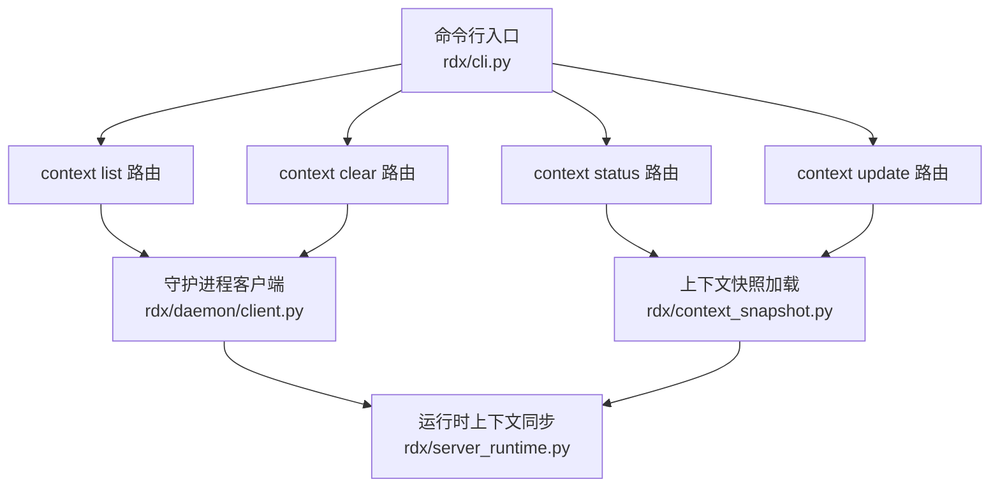
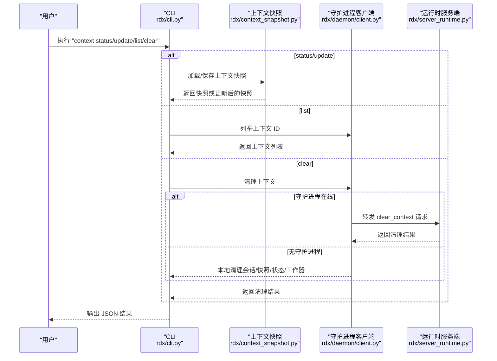
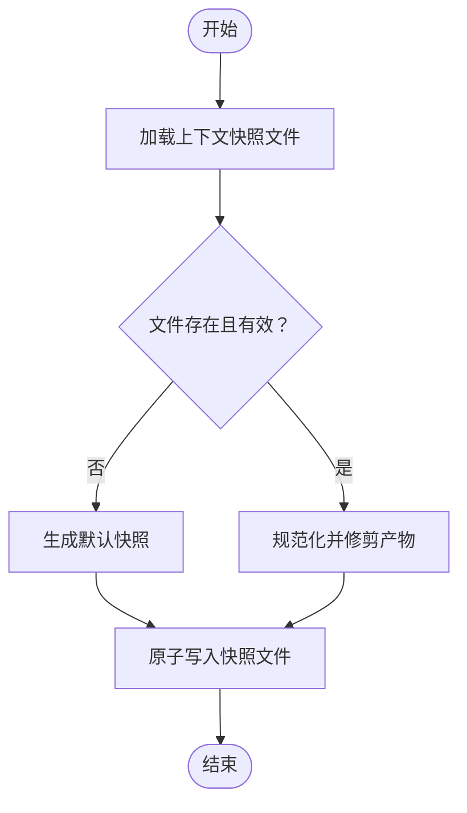
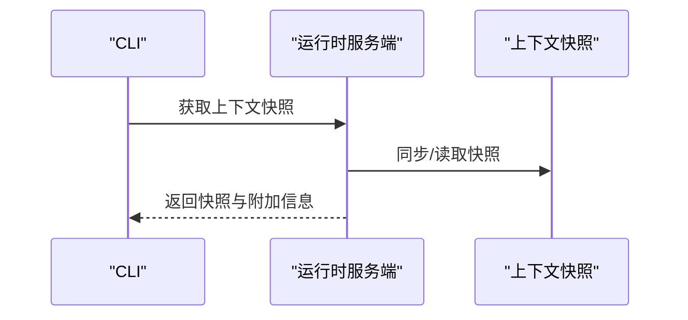
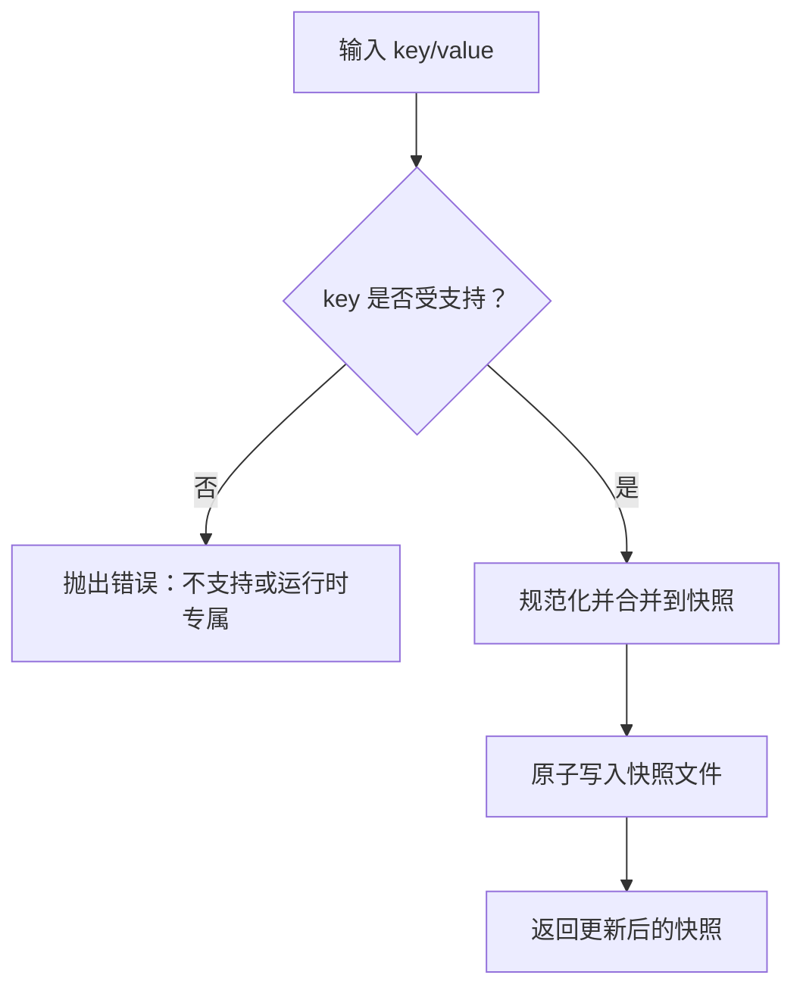
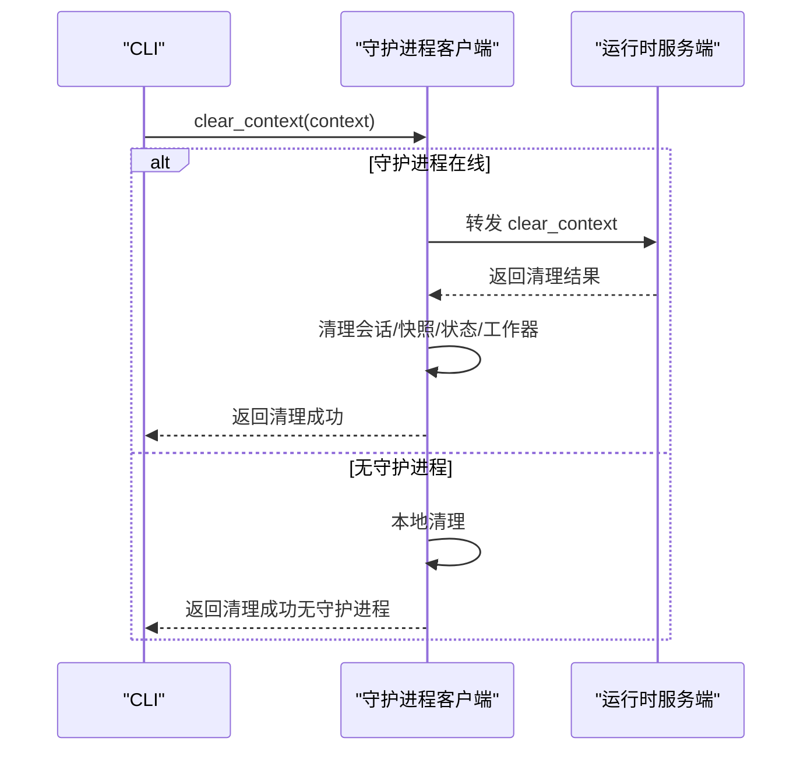
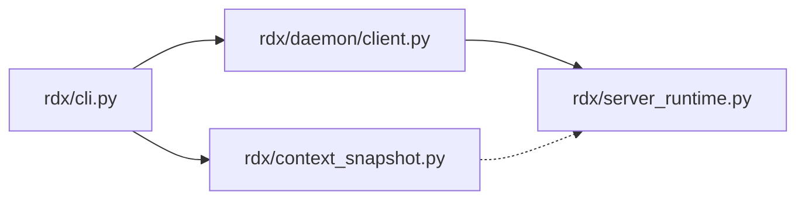

# 上下文命令

<cite>
**本文引用的文件**
- [rdx/context_snapshot.py](file://rdx/context_snapshot.py)
- [rdx/cli.py](file://rdx/cli.py)
- [rdx/daemon/client.py](file://rdx/daemon/client.py)
- [rdx/server_runtime.py](file://rdx/server_runtime.py)
- [tests/test_context_snapshot.py](file://tests/test_context_snapshot.py)
- [tests/test_cli_vfs.py](file://tests/test_cli_vfs.py)
- [scripts/preview_geometry_smoke.py](file://scripts/preview_geometry_smoke.py)
- [scripts/rdx_bat_launcher.ps1](file://scripts/rdx_bat_launcher.ps1)
</cite>

## 目录
1. [简介](#简介)
2. [项目结构](#项目结构)
3. [核心组件](#核心组件)
4. [架构总览](#架构总览)
5. [详细组件分析](#详细组件分析)
6. [依赖关系分析](#依赖关系分析)
7. [性能考量](#性能考量)
8. [故障排查指南](#故障排查指南)
9. [结论](#结论)
10. [附录](#附录)

## 简介
本文件系统性阐述“上下文命令”的设计与实现，覆盖以下子命令及其管理机制：
- context status：查看当前运行时上下文快照（含会话定位器、会话列表、回收策略、限制、最近操作、预览状态等）
- context update：更新用户可编辑的上下文字段（如 notes、focus_pixel、focus_resource_id、focus_shader_id）
- context list：列出已知的守护进程上下文标识
- context clear：清理指定上下文的状态与资源（若守护进程在线则转发到守护进程处理；否则本地清理）

同时，文档解释上下文的概念、作用与持久化/恢复机制，说明上下文 ID 的设置与切换方法，并给出多上下文环境的最佳实践与注意事项。

## 项目结构
围绕上下文命令的关键模块与文件如下：
- 命令入口与路由：rdx/cli.py
- 守护进程客户端：rdx/daemon/client.py
- 上下文快照与持久化：rdx/context_snapshot.py
- 运行时上下文状态同步：rdx/server_runtime.py
- 测试用例与脚本示例：tests/test_context_snapshot.py、tests/test_cli_vfs.py、scripts/preview_geometry_smoke.py、scripts/rdx_bat_launcher.ps1

图表来源
- [rdx/cli.py:1219-1418](file://rdx/cli.py#L1219-L1418)
- [rdx/context_snapshot.py:447-484](file://rdx/context_snapshot.py#L447-L484)
- [rdx/daemon/client.py:774-833](file://rdx/daemon/client.py#L774-L833)
- [rdx/server_runtime.py:6618-6678](file://rdx/server_runtime.py#L6618-L6678)

章节来源
- [rdx/cli.py:1219-1418](file://rdx/cli.py#L1219-L1418)

## 核心组件
- 上下文快照（Context Snapshot）：描述当前上下文的运行时状态、远程连接信息、焦点信息、备注、最近产物、预览状态等，并支持原子写入与并发锁保护。
- 守护进程客户端：负责与守护进程通信，执行上下文清理、状态查询、会话状态管理等。
- 运行时上下文同步：在服务端维护每个上下文的状态字典，并与快照保持一致，支持创建、清理、更新上下文。
- CLI 子命令：为用户暴露 status/update/list/clear 四个子命令，统一通过 --daemon-context 指定上下文 ID。

章节来源
- [rdx/context_snapshot.py:18-541](file://rdx/context_snapshot.py#L18-L541)
- [rdx/daemon/client.py:774-833](file://rdx/daemon/client.py#L774-L833)
- [rdx/server_runtime.py:6618-6678](file://rdx/server_runtime.py#L6618-L6678)
- [rdx/cli.py:1219-1418](file://rdx/cli.py#L1219-L1418)

## 架构总览
上下文命令的调用链路与数据流如下：

图表来源
- [rdx/cli.py:1369-1397](file://rdx/cli.py#L1369-L1397)
- [rdx/context_snapshot.py:447-484](file://rdx/context_snapshot.py#L447-L484)
- [rdx/daemon/client.py:774-833](file://rdx/daemon/client.py#L774-L833)
- [rdx/server_runtime.py:6658-6678](file://rdx/server_runtime.py#L6658-L6678)

## 详细组件分析

### 上下文概念与作用
- 上下文是独立的运行时状态容器，包含当前会话、捕获文件、活动事件、后端类型、远程连接参数、焦点信息、备注、最近产物、预览状态等。
- 用户可通过上下文命令对上下文进行状态查看、字段更新、上下文切换与清理。
- 上下文 ID 支持默认值“default”，也允许自定义 ID（仅保留字母数字及“-”“_”“.”字符）。

章节来源
- [rdx/context_snapshot.py:184-194](file://rdx/context_snapshot.py#L184-L194)
- [rdx/context_snapshot.py:242-279](file://rdx/context_snapshot.py#L242-L279)

### 上下文状态持久化与恢复
- 快照持久化：使用原子写入函数将规范化后的上下文快照写入对应文件，避免竞态与损坏。
- 并发控制：按上下文 ID 维护互斥锁，确保同一上下文的读写串行化。
- 恢复机制：启动时加载快照文件，若不存在或解析失败则回退到默认快照。

图表来源
- [rdx/context_snapshot.py:447-475](file://rdx/context_snapshot.py#L447-L475)

章节来源
- [rdx/context_snapshot.py:447-484](file://rdx/context_snapshot.py#L447-L484)

### 上下文 ID 的设置与切换
- 设置方式：通过 CLI 的 --daemon-context 参数指定目标上下文 ID；若未提供则默认为“default”。
- 切换方法：每次执行命令时传入不同的上下文 ID 即可切换；测试中也演示了显式传入 context_id 的场景。

章节来源
- [rdx/cli.py:1305-1307](file://rdx/cli.py#L1305-L1307)
- [tests/test_cli_vfs.py:154-180](file://tests/test_cli_vfs.py#L154-L180)
- [tests/test_context_snapshot.py:83-109](file://tests/test_context_snapshot.py#L83-L109)

### context status：查看上下文快照
- 功能：打印当前上下文的快照，包含会话定位器、当前会话 ID、会话列表、回收策略、限制、最近操作、远程能力矩阵、远程上下文本地性与复用策略等。
- 数据来源：从运行时状态与守护进程状态中聚合生成。

图表来源
- [rdx/server_runtime.py:6596-6616](file://rdx/server_runtime.py#L6596-L6616)

章节来源
- [rdx/cli.py:1369-1371](file://rdx/cli.py#L1369-L1371)
- [rdx/server_runtime.py:6596-6616](file://rdx/server_runtime.py#L6596-L6616)

### context update：更新上下文字段
- 可更新字段：notes、focus_pixel、focus_resource_id、focus_shader_id。
- 不可更新字段：runtime_owned_keys 中的键（例如 session_id 等），尝试更新会报错。
- 更新流程：先校验键是否受支持，再规范化并合并到快照，最后原子写回。

图表来源
- [rdx/context_snapshot.py:486-508](file://rdx/context_snapshot.py#L486-L508)

章节来源
- [rdx/cli.py:1223-1226](file://rdx/cli.py#L1223-L1226)
- [rdx/context_snapshot.py:18-35](file://rdx/context_snapshot.py#L18-L35)
- [rdx/context_snapshot.py:486-508](file://rdx/context_snapshot.py#L486-L508)
- [tests/test_context_snapshot.py:12-36](file://tests/test_context_snapshot.py#L12-L36)

### context list：列出上下文
- 功能：列出所有已知的守护进程上下文 ID。
- 实现：通过守护进程客户端列举上下文 ID。

章节来源
- [rdx/cli.py:1227-1228](file://rdx/cli.py#L1227-L1228)
- [rdx/daemon/client.py:774-833](file://rdx/daemon/client.py#L774-L833)

### context clear：清理上下文
- 行为：
  - 若守护进程在线：向守护进程发送 clear_context 请求，成功后清理会话、快照、状态与工作器，并返回更新后的状态。
  - 若守护进程离线：本地清理会话、快照、状态与工作器，返回提示“无活跃守护进程但已清理”。
- 注意：清理前会尝试刷新状态，若仍失败则回退到本地清理。

图表来源
- [rdx/daemon/client.py:774-808](file://rdx/daemon/client.py#L774-L808)
- [rdx/server_runtime.py:6658-6669](file://rdx/server_runtime.py#L6658-L6669)

章节来源
- [rdx/cli.py:1229-1230](file://rdx/cli.py#L1229-L1230)
- [rdx/cli.py:1376-1397](file://rdx/cli.py#L1376-L1397)
- [rdx/daemon/client.py:774-808](file://rdx/daemon/client.py#L774-L808)
- [tests/test_daemon_client.py:83-92](file://tests/test_daemon_client.py#L83-L92)

## 依赖关系分析
- CLI 依赖上下文快照模块进行读写，依赖守护进程客户端进行远程交互。
- 守护进程客户端依赖运行时上下文状态与快照路径，以及守护进程 RPC 接口。
- 运行时服务端维护上下文状态字典，并与快照保持同步。

图表来源
- [rdx/cli.py:1219-1418](file://rdx/cli.py#L1219-L1418)
- [rdx/context_snapshot.py:447-484](file://rdx/context_snapshot.py#L447-L484)
- [rdx/daemon/client.py:774-833](file://rdx/daemon/client.py#L774-L833)
- [rdx/server_runtime.py:6618-6678](file://rdx/server_runtime.py#L6618-L6678)

章节来源
- [rdx/cli.py:1219-1418](file://rdx/cli.py#L1219-L1418)
- [rdx/context_snapshot.py:447-484](file://rdx/context_snapshot.py#L447-L484)
- [rdx/daemon/client.py:774-833](file://rdx/daemon/client.py#L774-L833)
- [rdx/server_runtime.py:6618-6678](file://rdx/server_runtime.py#L6618-L6678)

## 性能考量
- 并发安全：按上下文 ID 维护互斥锁，避免多线程/多进程同时写入导致竞争。
- 原子写入：使用原子写入函数，减少部分写入风险。
- 快照修剪：对最近产物按类型与总数进行修剪，控制存储占用。
- I/O 频率：建议批量更新后再写入，避免频繁 I/O。

章节来源
- [rdx/context_snapshot.py:335-364](file://rdx/context_snapshot.py#L335-L364)
- [rdx/context_snapshot.py:463-475](file://rdx/context_snapshot.py#L463-L475)
- [rdx/context_snapshot.py:174-181](file://rdx/context_snapshot.py#L174-L181)

## 故障排查指南
- “上下文键不受支持或为运行时专属”：尝试更新 runtime_owned_keys 中的键会失败，请改用合法的用户可更新字段。
- “无活跃守护进程但已清理”：当守护进程未运行时，clear 会本地清理上下文相关文件。
- “清理失败但仍刷新了状态”：客户端会在异常时尝试刷新守护进程状态，若仍失败则回退到本地清理。
- “上下文 ID 不生效”：确认命令行是否正确传入 --daemon-context；测试用例展示了显式传参的方式。

章节来源
- [rdx/context_snapshot.py:493-496](file://rdx/context_snapshot.py#L493-L496)
- [rdx/daemon/client.py:785-796](file://rdx/daemon/client.py#L785-L796)
- [tests/test_context_snapshot.py:29-33](file://tests/test_context_snapshot.py#L29-L33)
- [tests/test_cli_vfs.py:154-180](file://tests/test_cli_vfs.py#L154-L180)

## 结论
上下文命令提供了对运行时上下文的完整生命周期管理：查看、更新、列举与清理。通过上下文快照与守护进程客户端的协作，实现了跨进程、跨会话的状态共享与持久化。遵循本文的最佳实践与排障建议，可在多上下文环境中稳定地使用这些命令。

## 附录

### 多上下文环境最佳实践
- 使用明确的上下文 ID 区分不同任务或环境，避免默认“default”造成混淆。
- 在自动化脚本中显式传入 --daemon-context，确保命令作用于预期上下文。
- 对上下文进行定期清理，防止残留状态影响后续操作。
- 使用 context list 查看可用上下文，结合 context status 检查状态一致性。

章节来源
- [scripts/rdx_bat_launcher.ps1:343-398](file://scripts/rdx_bat_launcher.ps1#L343-L398)
- [tests/test_cli_vfs.py:154-180](file://tests/test_cli_vfs.py#L154-L180)
- [tests/test_context_snapshot.py:83-109](file://tests/test_context_snapshot.py#L83-L109)