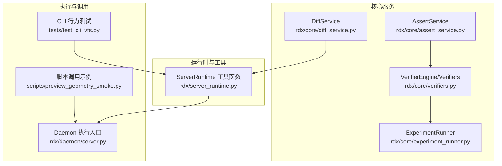
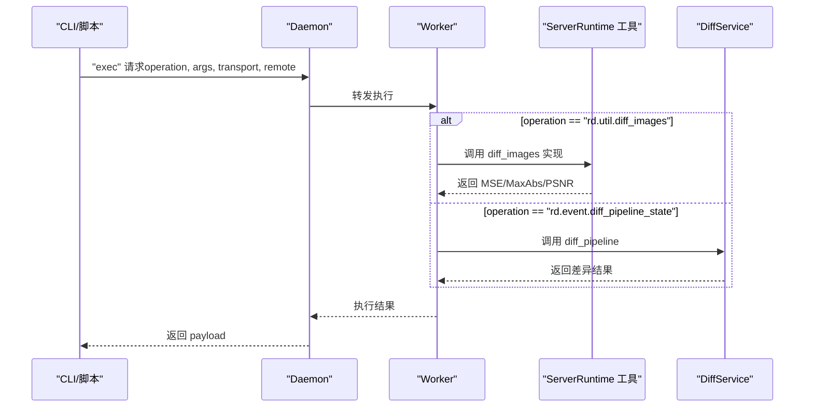
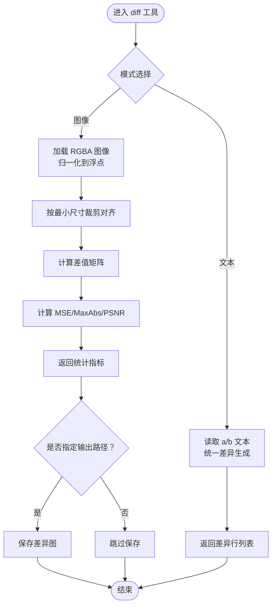
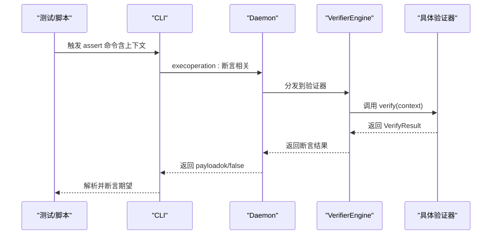
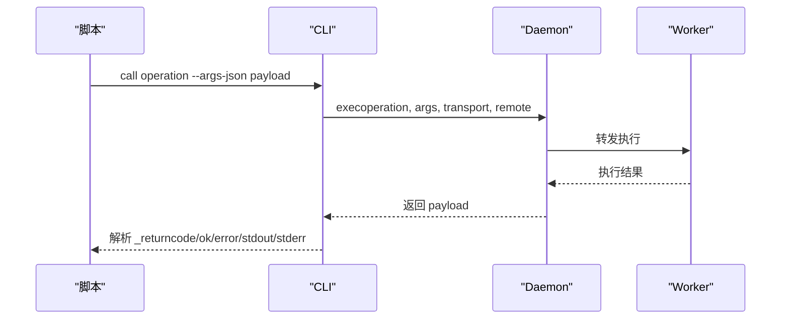
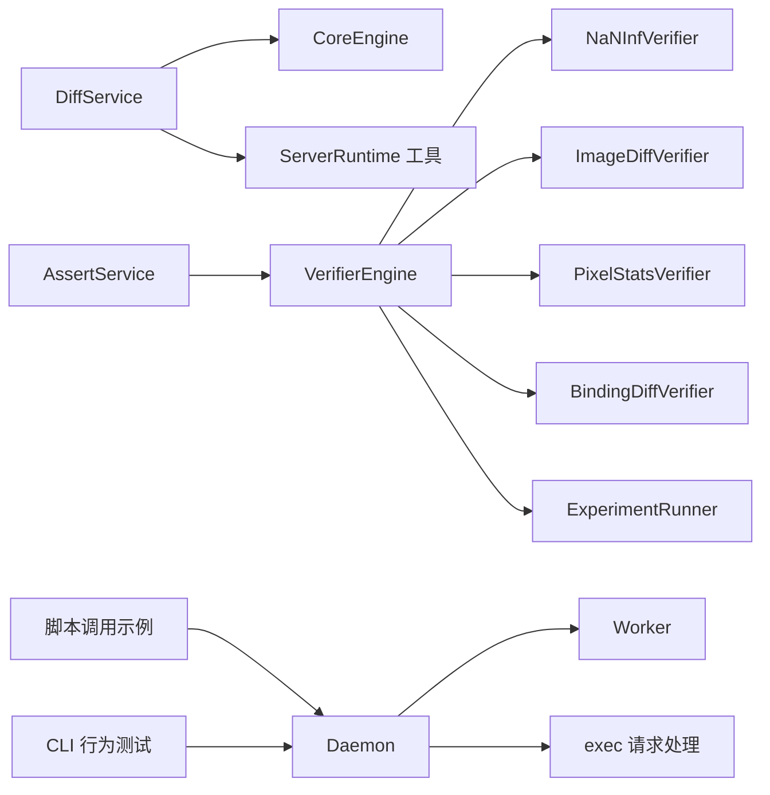

# 专用命令

<cite>
**本文引用的文件**
- [rdx/core/diff_service.py](file://rdx/core/diff_service.py)
- [rdx/server_runtime.py](file://rdx/server_runtime.py)
- [rdx/core/assert_service.py](file://rdx/core/assert_service.py)
- [rdx/core/verifiers.py](file://rdx/core/verifiers.py)
- [rdx/core/experiment_runner.py](file://rdx/core/experiment_runner.py)
- [rdx/daemon/server.py](file://rdx/daemon/server.py)
- [scripts/preview_geometry_smoke.py](file://scripts/preview_geometry_smoke.py)
- [tests/test_cli_vfs.py](file://tests/test_cli_vfs.py)
</cite>

## 目录
1. [简介](#简介)
2. [项目结构](#项目结构)
3. [核心组件](#核心组件)
4. [架构总览](#架构总览)
5. [详细组件分析](#详细组件分析)
6. [依赖关系分析](#依赖关系分析)
7. [性能考量](#性能考量)
8. [故障排查指南](#故障排查指南)
9. [结论](#结论)
10. [附录](#附录)

## 简介
本文件聚焦于工具链中的三类“专用命令”：diff、assert、call。它们分别承担文本/图像差异分析、断言验证与错误检测、以及通用操作调用与参数传递。文档将系统阐述其工作原理、数据流、控制流程、错误处理与性能特征，并给出实际应用场景、使用技巧与高级配置。

## 项目结构
围绕专用命令的相关模块主要分布在以下位置：
- 差异分析与图像比对：核心服务层在 rdx/core/diff_service.py，运行时工具函数在 rdx/server_runtime.py。
- 断言与验证：断言服务在 rdx/core/assert_service.py，验证器引擎与内置验证器在 rdx/core/verifiers.py，实验运行与二分定位在 rdx/core/experiment_runner.py。
- 通用调用：CLI 调用示例在 scripts/preview_geometry_smoke.py，Daemon 层执行入口在 rdx/daemon/server.py。
- CLI 行为与契约测试：tests/test_cli_vfs.py 中包含 assert 命令的 CLI 行为断言。

图表来源
- [rdx/core/diff_service.py:1-51](file://rdx/core/diff_service.py#L1-L51)
- [rdx/server_runtime.py:11683-11738](file://rdx/server_runtime.py#L11683-L11738)
- [rdx/core/verifiers.py:764-851](file://rdx/core/verifiers.py#L764-L851)
- [rdx/core/experiment_runner.py:332-732](file://rdx/core/experiment_runner.py#L332-L732)
- [rdx/daemon/server.py:427-602](file://rdx/daemon/server.py#L427-L602)
- [scripts/preview_geometry_smoke.py:79-90](file://scripts/preview_geometry_smoke.py#L79-L90)
- [tests/test_cli_vfs.py:355-371](file://tests/test_cli_vfs.py#L355-L371)

章节来源
- [rdx/core/diff_service.py:1-51](file://rdx/core/diff_service.py#L1-L51)
- [rdx/server_runtime.py:11683-11738](file://rdx/server_runtime.py#L11683-L11738)
- [rdx/core/verifiers.py:764-851](file://rdx/core/verifiers.py#L764-L851)
- [rdx/core/experiment_runner.py:332-732](file://rdx/core/experiment_runner.py#L332-L732)
- [rdx/daemon/server.py:427-602](file://rdx/daemon/server.py#L427-L602)
- [scripts/preview_geometry_smoke.py:79-90](file://scripts/preview_geometry_smoke.py#L79-L90)
- [tests/test_cli_vfs.py:355-371](file://tests/test_cli_vfs.py#L355-L371)

## 核心组件
- DiffService：封装统一差异与图像差异的高层调用，面向会话与事件 ID 的状态差异，或面向图像路径的像素级差异。
- ServerRuntime 工具函数：提供文本统一差异与图像差异的底层实现，包括 numpy/PIL 依赖检查、裁剪对齐、MSE/PSNR 计算。
- VerifierEngine 与内置验证器：提供多种验证器（NaN/Inf、图像差异、像素统计、绑定差异），支持注册与调度。
- ExperimentRunner：基于验证器结果进行二分搜索与 ddmin 边界强化，输出判定结论。
- Daemon 执行入口：接收 exec 请求，转发到工作进程并记录元信息。
- 脚本调用示例：演示如何通过 CLI 发起 call 操作并解析返回。
- CLI 行为测试：覆盖 assert 命令在无会话上下文下的错误行为。

章节来源
- [rdx/core/diff_service.py:11-51](file://rdx/core/diff_service.py#L11-L51)
- [rdx/server_runtime.py:11701-11738](file://rdx/server_runtime.py#L11701-L11738)
- [rdx/core/verifiers.py:764-851](file://rdx/core/verifiers.py#L764-L851)
- [rdx/core/experiment_runner.py:332-732](file://rdx/core/experiment_runner.py#L332-L732)
- [rdx/daemon/server.py:579-602](file://rdx/daemon/server.py#L579-L602)
- [scripts/preview_geometry_smoke.py:79-90](file://scripts/preview_geometry_smoke.py#L79-L90)
- [tests/test_cli_vfs.py:355-371](file://tests/test_cli_vfs.py#L355-L371)

## 架构总览
专用命令在系统中的交互路径如下：
- 文本/图像差异：DiffService 或 ServerRuntime 工具函数负责生成差异报告或统计指标。
- 断言验证：AssertService 驱动 VerifierEngine，后者按名称调度具体验证器，结合 ExperimentRunner 进行二分/边界强化决策。
- 通用调用：CLI 通过 call 操作向 Daemon 提交任务，Daemon 将请求转发至工作进程执行。

图表来源
- [rdx/daemon/server.py:579-602](file://rdx/daemon/server.py#L579-L602)
- [rdx/server_runtime.py:11720-11738](file://rdx/server_runtime.py#L11720-L11738)
- [rdx/core/diff_service.py:21-29](file://rdx/core/diff_service.py#L21-L29)

## 详细组件分析

### diff 命令：差异分析与图像比较
diff 命令提供两类能力：
- 文本差异：基于统一差异格式输出差异行序列，支持上下文行数配置。
- 图像差异：计算像素级差异，输出均方误差（MSE）、最大绝对差（MaxAbs）与峰值信噪比（PSNR），可选输出差异图。

图表来源
- [rdx/server_runtime.py:11701-11738](file://rdx/server_runtime.py#L11701-L11738)

实现要点与复杂度
- 文本差异：时间复杂度近似 O(n+m)，空间取决于差异行数量；上下文行数影响输出规模。
- 图像差异：N×M 像素矩阵运算，时间复杂度 O(NM)，内存占用约 4×2×(N×M) 字节（双精度浮点）；裁剪对齐避免形状不一致导致的异常。

错误处理
- 缺少必需参数或路径不存在时返回错误。
- 图像依赖缺失（numpy/PIL）时返回依赖错误提示。

使用技巧
- 文本差异：合理设置上下文行数，便于审阅变更范围。
- 图像差异：优先使用相同分辨率输入；如需可视化差异图，建议提供输出路径以便后续分析。

章节来源
- [rdx/server_runtime.py:11701-11738](file://rdx/server_runtime.py#L11701-L11738)
- [rdx/core/diff_service.py:31-51](file://rdx/core/diff_service.py#L31-L51)

### assert 命令：断言验证与错误检测
assert 命令用于在给定上下文中执行断言，通常与验证器配合使用，以判断某事件或会话状态是否满足预期。在无有效会话上下文时，assert 命令会返回特定错误码与详情。

图表来源
- [rdx/core/verifiers.py:764-851](file://rdx/core/verifiers.py#L764-L851)
- [rdx/daemon/server.py:579-602](file://rdx/daemon/server.py#L579-L602)

实现要点
- 验证器注册与调度：内置验证器包括 NaN/Inf、图像差异、像素统计、绑定差异。
- 结果判定：根据 before/after 指标与阈值策略决定通过/失败/改进/拒绝等结论。
- 错误处理：捕获验证器内部异常并返回带注释的结果。

错误检测与 CLI 行为
- 在缺少会话上下文时，assert 命令返回“会话必需”的错误码与上下文标识，便于定位问题。

章节来源
- [rdx/core/verifiers.py:764-851](file://rdx/core/verifiers.py#L764-L851)
- [tests/test_cli_vfs.py:355-371](file://tests/test_cli_vfs.py#L355-L371)

### call 命令：通用操作调用与参数传递
call 命令用于向系统提交任意操作（operation），并以 JSON 形式传递参数。脚本示例展示了如何构造参数并解析返回结果，包括错误码与标准输出/错误输出的提取。

图表来源
- [scripts/preview_geometry_smoke.py:79-90](file://scripts/preview_geometry_smoke.py#L79-L90)
- [rdx/daemon/server.py:579-602](file://rdx/daemon/server.py#L579-L602)

参数传递方法
- 使用 --args-json 传入参数字典，确保编码安全。
- 通过 _returncode 判断 CLI 是否成功，结合 ok 字段与 error 结构体进行细粒度诊断。

章节来源
- [scripts/preview_geometry_smoke.py:79-90](file://scripts/preview_geometry_smoke.py#L79-L90)
- [rdx/daemon/server.py:579-602](file://rdx/daemon/server.py#L579-L602)

## 依赖关系分析
- DiffService 依赖 CoreEngine 与服务器运行时工具函数，用于事件状态差异与图像差异。
- VerifierEngine 依赖各内置验证器，验证器在 ExperimentRunner 中被调度以进行二分搜索与边界强化。
- Daemon 执行入口统一处理 exec 请求，作为 call 与 diff/assert 等命令的后端执行通道。
- 脚本示例与 CLI 测试共同验证 call/ assert 的行为与错误处理。

图表来源
- [rdx/core/diff_service.py:21-29](file://rdx/core/diff_service.py#L21-L29)
- [rdx/server_runtime.py:11720-11738](file://rdx/server_runtime.py#L11720-L11738)
- [rdx/core/verifiers.py:764-851](file://rdx/core/verifiers.py#L764-L851)
- [rdx/core/experiment_runner.py:332-732](file://rdx/core/experiment_runner.py#L332-L732)
- [rdx/daemon/server.py:579-602](file://rdx/daemon/server.py#L579-L602)
- [scripts/preview_geometry_smoke.py:79-90](file://scripts/preview_geometry_smoke.py#L79-L90)
- [tests/test_cli_vfs.py:355-371](file://tests/test_cli_vfs.py#L355-L371)

章节来源
- [rdx/core/diff_service.py:11-51](file://rdx/core/diff_service.py#L11-L51)
- [rdx/core/verifiers.py:764-851](file://rdx/core/verifiers.py#L764-L851)
- [rdx/core/experiment_runner.py:332-732](file://rdx/core/experiment_runner.py#L332-L732)
- [rdx/daemon/server.py:427-602](file://rdx/daemon/server.py#L427-L602)
- [scripts/preview_geometry_smoke.py:79-90](file://scripts/preview_geometry_smoke.py#L79-L90)
- [tests/test_cli_vfs.py:355-371](file://tests/test_cli_vfs.py#L355-L371)

## 性能考量
- 文本差异：统一差异算法的时间复杂度与差异规模线性相关，上下文行数越大，输出越多，I/O 成本越高。
- 图像差异：像素级矩阵运算的复杂度与像素总数成正比；内存占用较高，建议控制输入尺寸或分块处理。
- 验证器调度：验证器内部可能包含耗时计算（如图像 PSNR），应结合超时策略与缓存机制优化。
- Daemon 执行：exec 请求的转发与持久化状态更新存在锁竞争风险，建议在高并发场景下评估队列与批处理策略。

## 故障排查指南
- 文本/图像差异依赖缺失：当缺少 numpy 或 PIL 时，会返回依赖缺失的错误提示。请安装相应依赖后再试。
- 参数缺失或路径无效：diff_text/diff_images 会在缺少必要参数或路径不存在时返回错误。请核对参数键名与路径。
- CLI 返回非零退出码：call 命令在 _returncode 非零或 ok=false 时抛出异常，需检查 stdout/stderr 与 error.code。
- assert 命令无会话上下文：assert 命令在缺少会话上下文时返回“会话必需”的错误码与上下文标识，需先建立有效上下文。

章节来源
- [rdx/server_runtime.py:11720-11726](file://rdx/server_runtime.py#L11720-L11726)
- [tests/test_cli_vfs.py:355-371](file://tests/test_cli_vfs.py#L355-L371)
- [scripts/preview_geometry_smoke.py:79-90](file://scripts/preview_geometry_smoke.py#L79-L90)

## 结论
diff、assert、call 三类专用命令分别覆盖了差异分析、断言验证与通用调用三大核心场景。通过 DiffService 与 ServerRuntime 工具函数实现差异计算，借助 VerifierEngine 与 ExperimentRunner 完成验证与判定，再由 Daemon 统一承接 exec 请求，形成清晰的职责分离与可扩展架构。实践中应关注依赖管理、参数校验与性能权衡，并利用 CLI 测试与脚本示例规范调用方式。

## 附录
- 实际应用场景
  - 文本差异：对比日志、配置文件或源代码变更，快速定位改动范围。
  - 图像差异：渲染回归检测、截图比对、可视化差异图辅助定位问题。
  - 断言验证：在自动化流水线中对关键指标进行一致性校验，结合二分搜索快速定位引入问题的变更点。
  - 通用调用：通过 call 命令集成第三方操作或自定义工具，统一参数传递与错误处理。
- 高级配置与扩展
  - 自定义验证器：在 VerifierEngine 中注册新验证器，扩展断言能力。
  - 验证策略：在 ExperimentRunner 中调整二分与 ddmin 策略参数，提升定位效率与稳定性。
  - Daemon 执行：在 Daemon 层面增加超时、重试与限流策略，增强可靠性。