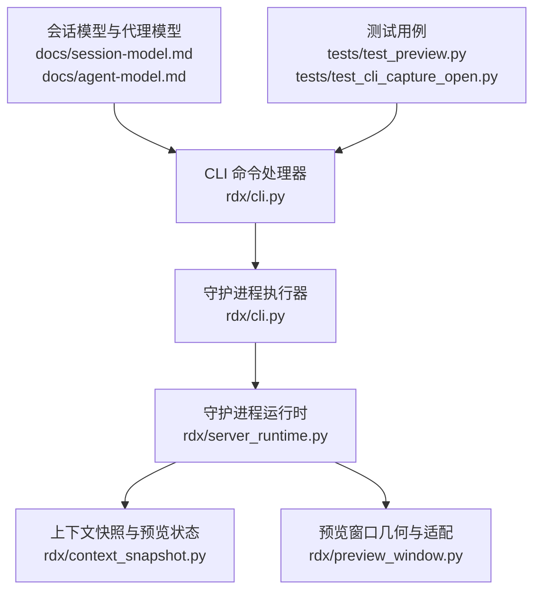
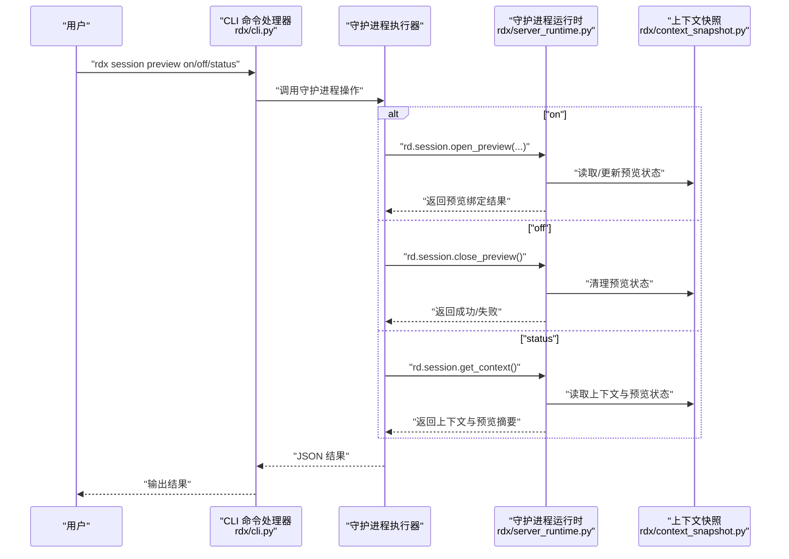
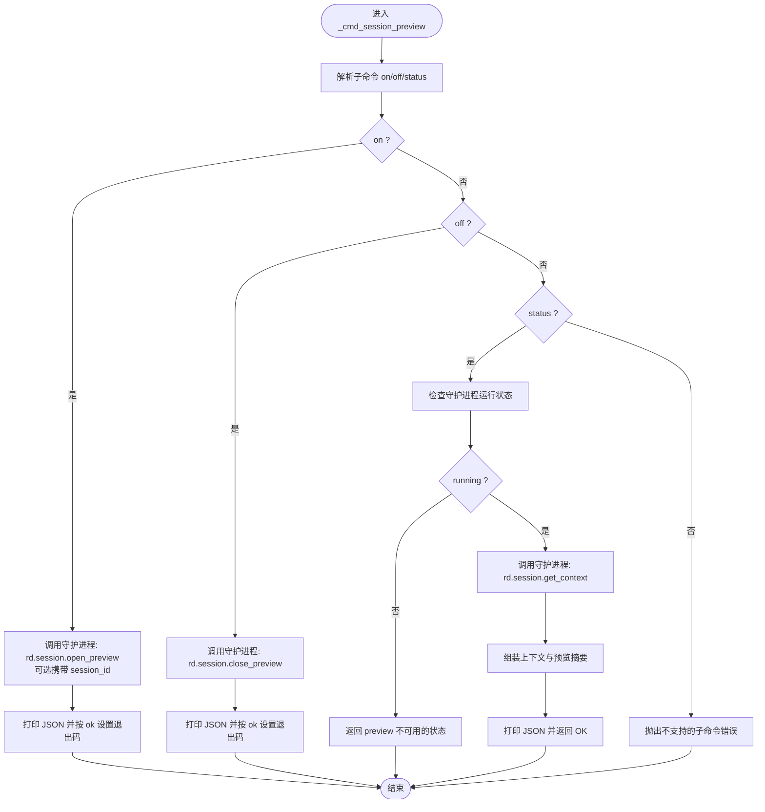
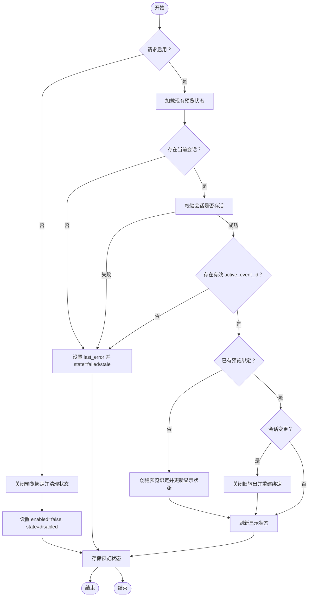
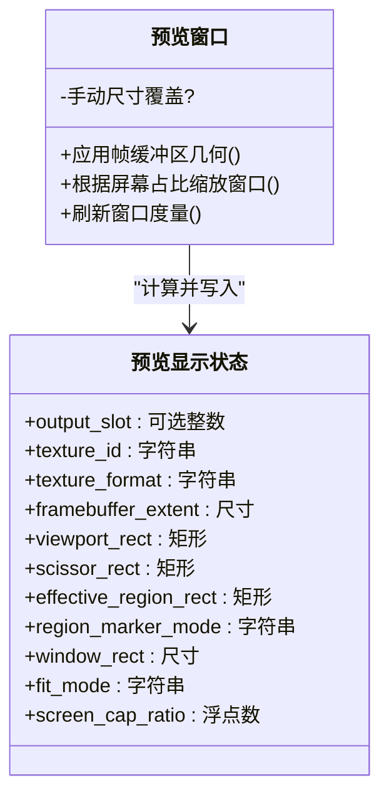
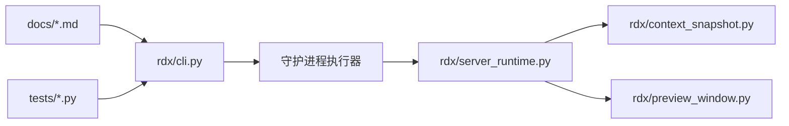

# 会话命令

<cite>
**本文引用的文件**
- [rdx/cli.py](file://rdx/cli.py)
- [rdx/server_runtime.py](file://rdx/server_runtime.py)
- [rdx/context_snapshot.py](file://rdx/context_snapshot.py)
- [docs/session-model.md](file://docs/session-model.md)
- [docs/agent-model.md](file://docs/agent-model.md)
- [tests/test_preview.py](file://tests/test_preview.py)
- [tests/test_cli_capture_open.py](file://tests/test_cli_capture_open.py)
- [rdx/preview_window.py](file://rdx/preview_window.py)
</cite>

## 目录
1. [简介](#简介)
2. [项目结构](#项目结构)
3. [核心组件](#核心组件)
4. [架构总览](#架构总览)
5. [详细组件分析](#详细组件分析)
6. [依赖关系分析](#依赖关系分析)
7. [性能考虑](#性能考虑)
8. [故障排查指南](#故障排查指南)
9. [结论](#结论)
10. [附录](#附录)

## 简介
本文件系统性地阐述“会话预览”相关命令：session preview on、session preview off、session preview status。内容覆盖会话概念、生命周期与预览功能的工作原理，解释预览窗口的启用、禁用与状态查询流程，阐明会话与上下文的关系及数据隔离机制，并给出最佳实践与性能优化建议。

## 项目结构
围绕会话预览命令的关键模块如下：
- CLI 层：解析用户输入，调用守护进程操作，输出标准化结果
- 守护进程运行时：维护上下文状态、会话状态与预览状态，执行预览绑定与显示逻辑
- 上下文快照：定义预览状态与显示状态的数据结构与归一化规则
- 文档：会话模型与代理模型对预览行为进行约束与说明
- 测试：验证预览命令在不同上下文下的行为与错误处理

图示来源
- [rdx/cli.py:992-1066](file://rdx/cli.py#L992-L1066)
- [rdx/server_runtime.py:2070-2269](file://rdx/server_runtime.py#L2070-L2269)
- [rdx/context_snapshot.py:83-171](file://rdx/context_snapshot.py#L83-L171)
- [docs/session-model.md:1-12](file://docs/session-model.md#L1-L12)
- [docs/agent-model.md:15-16](file://docs/agent-model.md#L15-L16)
- [tests/test_preview.py:95-225](file://tests/test_preview.py#L95-L225)
- [tests/test_cli_capture_open.py:377-403](file://tests/test_cli_capture_open.py#L377-L403)
- [rdx/preview_window.py:282-308](file://rdx/preview_window.py#L282-L308)

章节来源
- [rdx/cli.py:992-1066](file://rdx/cli.py#L992-L1066)
- [rdx/server_runtime.py:2070-2269](file://rdx/server_runtime.py#L2070-L2269)
- [rdx/context_snapshot.py:83-171](file://rdx/context_snapshot.py#L83-L171)
- [docs/session-model.md:1-12](file://docs/session-model.md#L1-L12)
- [docs/agent-model.md:15-16](file://docs/agent-model.md#L15-L16)
- [tests/test_preview.py:95-225](file://tests/test_preview.py#L95-L225)
- [tests/test_cli_capture_open.py:377-403](file://tests/test_cli_capture_open.py#L377-L403)
- [rdx/preview_window.py:282-308](file://rdx/preview_window.py#L282-L308)

## 核心组件
- CLI 会话预览命令分发器：根据子命令 on/off/status 分派至相应处理逻辑，调用守护进程执行器并打印 JSON 结果
- 守护进程运行时：负责预览状态机、会话校验、事件解析、预览绑定创建与显示更新
- 上下文快照与预览状态：定义预览开关、状态、绑定信息、显示几何等字段及其归一化策略
- 预览窗口几何：根据帧缓冲区尺寸与屏幕占比计算窗口大小与布局，确保稳定显示面

章节来源
- [rdx/cli.py:992-1066](file://rdx/cli.py#L992-L1066)
- [rdx/server_runtime.py:2070-2269](file://rdx/server_runtime.py#L2070-L2269)
- [rdx/context_snapshot.py:83-171](file://rdx/context_snapshot.py#L83-L171)
- [rdx/preview_window.py:282-308](file://rdx/preview_window.py#L282-L308)

## 架构总览
会话预览命令从 CLI 进入，经由守护进程执行器调用运行时服务；运行时服务在上下文内维护预览状态，必要时创建或关闭预览绑定，并通过预览窗口模块应用几何适配。

图示来源
- [rdx/cli.py:992-1066](file://rdx/cli.py#L992-L1066)
- [rdx/server_runtime.py:2070-2269](file://rdx/server_runtime.py#L2070-L2269)
- [rdx/context_snapshot.py:83-171](file://rdx/context_snapshot.py#L83-L171)

## 详细组件分析

### CLI 会话预览命令
- on：可选传入 session_id，调用守护进程打开预览；根据返回的 ok 字段决定退出码
- off：调用守护进程关闭预览；根据返回的 ok 字段决定退出码
- status：先检查守护进程运行状态，再请求上下文与预览摘要；若守护进程未运行则返回不可用状态；若上下文请求失败则返回错误载荷

图示来源
- [rdx/cli.py:992-1066](file://rdx/cli.py#L992-L1066)

章节来源
- [rdx/cli.py:992-1066](file://rdx/cli.py#L992-L1066)

### 守护进程运行时与预览状态机
- 预览状态字段：enabled、state、view_mode、bound_session_id、bound_capture_file_id、bound_event_id、backend、recovered_from_session_id、rebind_count、last_error、display、updated_at_ms
- 状态机规则：
  - 关闭预览：清理绑定与绑定信息，重置显示状态
  - 打开预览：校验当前会话存在且事件有效；若事件无效或会话不存在，则设置失败/陈旧状态并返回
  - 绑定创建：在需要时创建预览绑定，更新显示状态（含窗口矩形、视口、裁剪区域等）
  - 几何适配：根据帧缓冲区尺寸与屏幕占比计算窗口大小，避免超出工作区

图示来源
- [rdx/server_runtime.py:2070-2269](file://rdx/server_runtime.py#L2070-L2269)
- [rdx/context_snapshot.py:83-171](file://rdx/context_snapshot.py#L83-L171)

章节来源
- [rdx/server_runtime.py:2070-2269](file://rdx/server_runtime.py#L2070-L2269)
- [rdx/context_snapshot.py:83-171](file://rdx/context_snapshot.py#L83-L171)

### 预览显示状态与窗口几何
- 显示状态字段：output_slot、texture_id、texture_format、framebuffer_extent、viewport_rect、scissor_rect、effective_region_rect、region_marker_mode、window_rect、fit_mode、screen_cap_ratio
- 归一化策略：对空值与非法值进行安全回退，确保字段类型与范围合法
- 窗口几何：根据帧缓冲区宽高与屏幕占比计算客户端尺寸，限制在工作区范围内；手动调整后进入手动尺寸模式

图示来源
- [rdx/context_snapshot.py:83-127](file://rdx/context_snapshot.py#L83-L127)
- [rdx/preview_window.py:282-308](file://rdx/preview_window.py#L282-L308)

章节来源
- [rdx/context_snapshot.py:83-127](file://rdx/context_snapshot.py#L83-L127)
- [rdx/preview_window.py:282-308](file://rdx/preview_window.py#L282-L308)

### 会话与上下文的关系及数据隔离
- 上下文隔离：每个 --daemon-context 是独立的命名空间，互不干扰
- 上下文快照：包含 preview 字段与运行时摘要（当前会话、捕获文件、活动事件等）
- 代理模型约束：当人类观察者需要预览窗口时，代理通过 CLI 调用 rd.session.open_preview；preview.display 是稳定的显示表面，描述窗口与帧缓冲区几何

章节来源
- [docs/session-model.md:1-12](file://docs/session-model.md#L1-L12)
- [docs/agent-model.md:15-16](file://docs/agent-model.md#L15-L16)
- [rdx/context_snapshot.py:242-279](file://rdx/context_snapshot.py#L242-L279)

## 依赖关系分析
- CLI 依赖守护进程执行器与结果打印工具
- 守护进程运行时依赖上下文快照与预览显示状态定义
- 预览显示状态被运行时用于构建与更新显示几何
- 文档与测试分别从行为约束与回归角度保障功能正确性

图示来源
- [rdx/cli.py:992-1066](file://rdx/cli.py#L992-L1066)
- [rdx/server_runtime.py:2070-2269](file://rdx/server_runtime.py#L2070-L2269)
- [rdx/context_snapshot.py:83-171](file://rdx/context_snapshot.py#L83-L171)
- [rdx/preview_window.py:282-308](file://rdx/preview_window.py#L282-L308)
- [docs/session-model.md:1-12](file://docs/session-model.md#L1-L12)
- [docs/agent-model.md:15-16](file://docs/agent-model.md#L15-L16)
- [tests/test_preview.py:95-225](file://tests/test_preview.py#L95-L225)
- [tests/test_cli_capture_open.py:377-403](file://tests/test_cli_capture_open.py#L377-L403)

章节来源
- [rdx/cli.py:992-1066](file://rdx/cli.py#L992-L1066)
- [rdx/server_runtime.py:2070-2269](file://rdx/server_runtime.py#L2070-L2269)
- [rdx/context_snapshot.py:83-171](file://rdx/context_snapshot.py#L83-L171)
- [rdx/preview_window.py:282-308](file://rdx/preview_window.py#L282-L308)
- [docs/session-model.md:1-12](file://docs/session-model.md#L1-L12)
- [docs/agent-model.md:15-16](file://docs/agent-model.md#L15-L16)
- [tests/test_preview.py:95-225](file://tests/test_preview.py#L95-L225)
- [tests/test_cli_capture_open.py:377-403](file://tests/test_cli_capture_open.py#L377-L403)

## 性能考虑
- 预览绑定复用：当会话未变更且已存在绑定时，避免重复创建绑定，减少资源消耗
- 几何计算缓存：仅在帧缓冲区变化或强制刷新时重新计算窗口尺寸，降低 UI 更新频率
- 事件定位：优先使用当前会话的活动事件，避免无效事件导致的失败重试
- 错误快速失败：在会话不存在或事件不可解析时尽早失败，避免无意义的绑定尝试

## 故障排查指南
- 预览状态失败
  - 现象：status 返回 preview 不可用或 state=failed/stale
  - 排查：确认守护进程运行；检查当前是否存在会话与有效事件；查看 last_error 获取具体原因
- 打开预览失败
  - 现象：on 返回失败，且预览状态被重置为 disabled
  - 排查：确认会话存活；确认事件可解析；检查预览窗口创建异常
- 会话不匹配
  - 现象：传入 session_id 与当前会话不一致导致失败
  - 排查：确保传入的 session_id 与当前会话一致，或切换到目标会话后再启用预览

章节来源
- [tests/test_preview.py:95-225](file://tests/test_preview.py#L95-L225)
- [tests/test_cli_capture_open.py:377-403](file://tests/test_cli_capture_open.py#L377-L403)
- [rdx/server_runtime.py:2070-2269](file://rdx/server_runtime.py#L2070-L2269)

## 结论
会话预览命令通过 CLI 与守护进程运行时协作，实现了对预览窗口的启停与状态查询。其核心在于上下文隔离、预览状态机与显示几何的稳定管理。遵循本文的最佳实践与排错建议，可在多上下文环境中可靠地启用与维护预览窗口。

## 附录

### 命令参考
- rdx session preview on [--session-id <id>]
  - 功能：启用预览；可选指定会话 ID
  - 成功条件：守护进程返回 ok=true
- rdx session preview off
  - 功能：禁用预览
  - 成功条件：守护进程返回 ok=true
- rdx session preview status
  - 功能：查询预览状态与上下文摘要
  - 输出字段：context_id、running、has_session、current_session_id、preview（enabled、available 等）、runtime、daemon

章节来源
- [rdx/cli.py:992-1066](file://rdx/cli.py#L992-L1066)