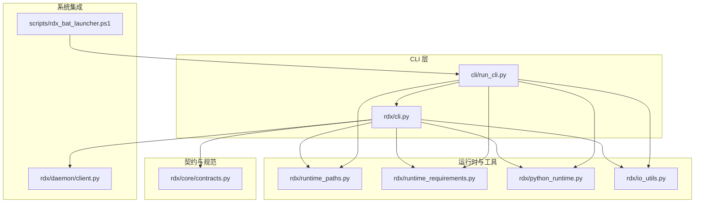
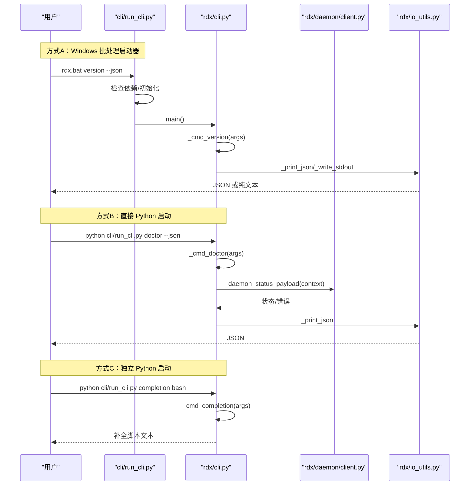
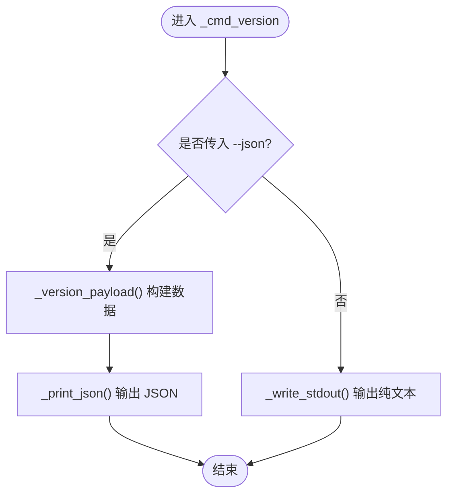
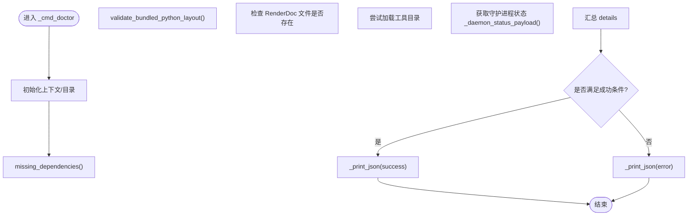
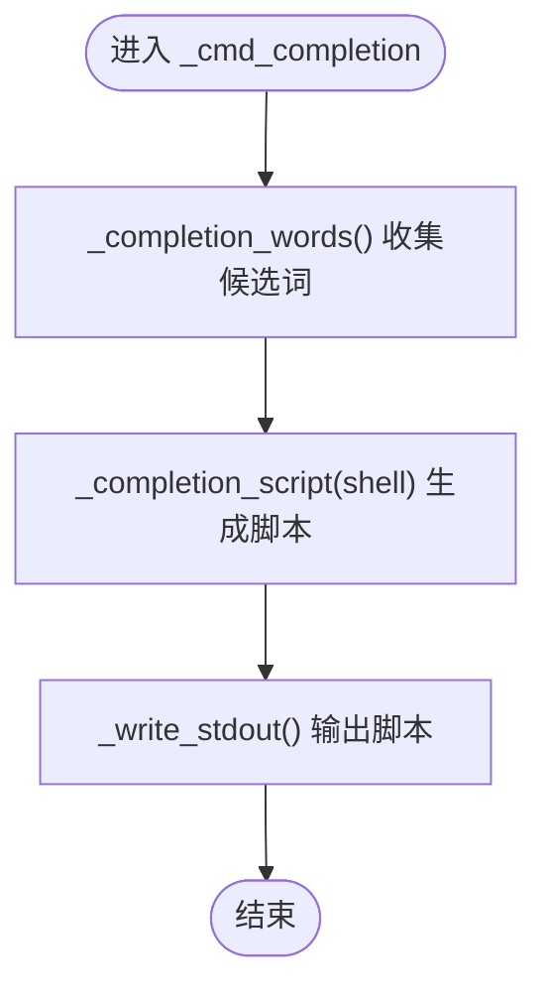
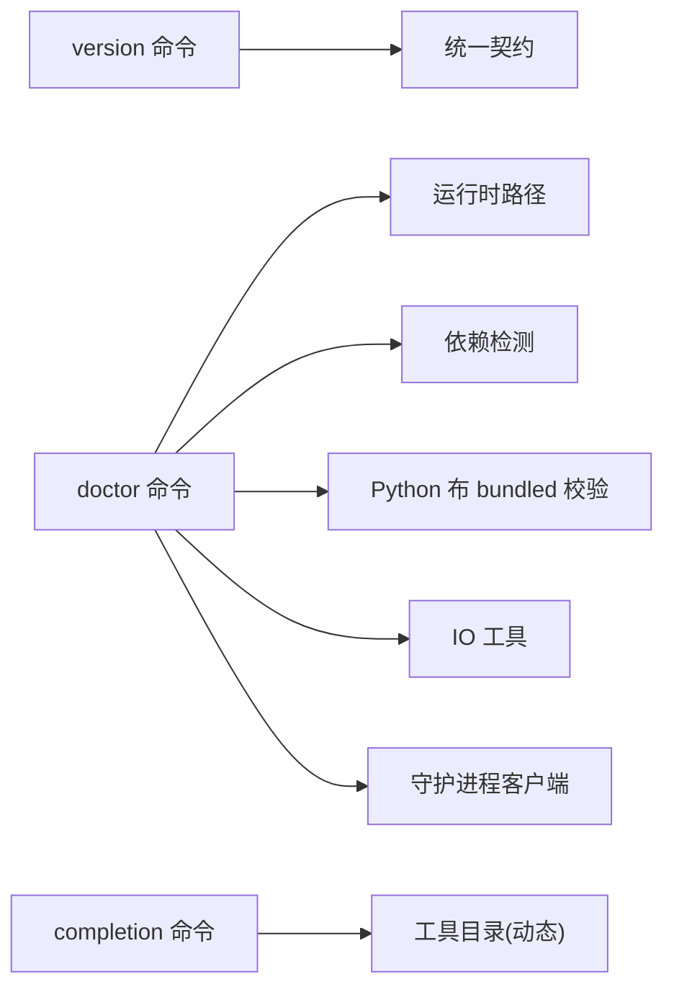

# 基础命令

<cite>
**本文引用的文件**
- [rdx/cli.py](file://rdx/cli.py)
- [cli/run_cli.py](file://cli/run_cli.py)
- [rdx/core/contracts.py](file://rdx/core/contracts.py)
- [rdx/runtime_paths.py](file://rdx/runtime_paths.py)
- [rdx/runtime_requirements.py](file://rdx/runtime_requirements.py)
- [rdx/python_runtime.py](file://rdx/python_runtime.py)
- [rdx/daemon/client.py](file://rdx/daemon/client.py)
- [rdx/io_utils.py](file://rdx/io_utils.py)
- [scripts/rdx_bat_launcher.ps1](file://scripts/rdx_bat_launcher.ps1)
</cite>

## 目录
1. [简介](#简介)
2. [项目结构](#项目结构)
3. [核心组件](#核心组件)
4. [架构总览](#架构总览)
5. [详细组件分析](#详细组件分析)
6. [依赖分析](#依赖分析)
7. [性能考虑](#性能考虑)
8. [故障排查指南](#故障排查指南)
9. [结论](#结论)

## 简介
本文件聚焦于 RDX 工具链的基础命令：version、doctor、completion。内容覆盖命令语法、参数、输出格式与错误处理，并给出 --json 标志的使用方法与 JSON 输出规范、典型使用场景与前置条件。

## 项目结构
- 命令入口与核心逻辑位于 rdx/cli.py，其中定义了 version、doctor、completion 等命令的实现与参数解析。
- 脚本启动器 cli/run_cli.py 提供独立 Python 启动路径，负责依赖检查、运行时初始化与转发到 rdx/cli.py。
- JSON 统一响应契约由 rdx/core/contracts.py 定义，确保所有命令输出遵循统一的 envelope 结构。
- 运行时目录、Python 验证、依赖检测等能力来自 rdx/runtime_paths.py、rdx/runtime_requirements.py、rdx/python_runtime.py。
- 与守护进程交互通过 rdx/daemon/client.py 实现，doctor 命令会查询守护进程状态。
- IO 工具 rdx/io_utils.py 提供安全的 JSON 文本序列化与流写入。

图表来源
- [rdx/cli.py:1-120](file://rdx/cli.py#L1-L120)
- [cli/run_cli.py:16-120](file://cli/run_cli.py#L16-L120)
- [rdx/core/contracts.py:1-60](file://rdx/core/contracts.py#L1-L60)

章节来源
- [rdx/cli.py:1-120](file://rdx/cli.py#L1-L120)
- [cli/run_cli.py:16-120](file://cli/run_cli.py#L16-L120)

## 核心组件
- 版本命令 version
  - 功能：打印工具版本或以 JSON 返回版本与平台信息。
  - 关键实现：_cmd_version、_version_payload。
  - 输出：默认为纯文本“rdx <版本号>”，或 JSON envelope。
- 自检命令 doctor
  - 功能：检查环境完整性（依赖、Python 布 bundled、RenderDoc 文件、工具目录、守护进程状态、入口脚本存在性等）。
  - 关键实现：_cmd_doctor。
  - 输出：JSON envelope；成功时 ok=true，失败时返回错误码与详情。
- 补全命令 completion
  - 功能：生成指定 Shell 的自动补全脚本（PowerShell、Bash、Zsh、Fish）。
  - 关键实现：_cmd_completion、_completion_script。
  - 输出：纯文本补全脚本。

章节来源
- [rdx/cli.py:393-547](file://rdx/cli.py#L393-L547)
- [cli/run_cli.py:160-234](file://cli/run_cli.py#L160-L234)
- [rdx/core/contracts.py:99-141](file://rdx/core/contracts.py#L99-L141)

## 架构总览
以下序列图展示 version、doctor、completion 三类命令在不同启动方式下的调用流程与输出差异。

图表来源
- [cli/run_cli.py:225-282](file://cli/run_cli.py#L225-L282)
- [rdx/cli.py:393-547](file://rdx/cli.py#L393-L547)
- [rdx/daemon/client.py:20-46](file://rdx/daemon/client.py#L20-L46)
- [rdx/io_utils.py:1-40](file://rdx/io_utils.py#L1-L40)

## 详细组件分析

### version 命令
- 语法与参数
  - rdx version [--json]
  - rdx --version
  - python cli/run_cli.py version [--json]
- 功能说明
  - 默认输出“rdx <版本号>”。
  - 使用 --json 输出统一 JSON envelope，包含工具版本、模式版本、平台、入口脚本位置与兼容性声明。
- 输出格式（--json）
  - 字段概览（部分）：schema_version、tool_version、result_kind、ok、data、meta、projections。
  - data 内容：tool_version、schema_version、platform、tools_root、entrypoints、compatibility。
- 错误处理
  - 无运行时错误分支；异常通过上层启动器捕获并输出标准化错误载荷。
- 典型示例
  - rdx version
  - rdx version --json
  - rdx --version
  - python cli/run_cli.py version --json

图表来源
- [rdx/cli.py:518-547](file://rdx/cli.py#L518-L547)
- [rdx/core/contracts.py:99-126](file://rdx/core/contracts.py#L99-L126)

章节来源
- [rdx/cli.py:518-547](file://rdx/cli.py#L518-L547)
- [cli/run_cli.py:160-196](file://cli/run_cli.py#L160-L196)
- [rdx/core/contracts.py:99-126](file://rdx/core/contracts.py#L99-L126)

### doctor 命令
- 语法与参数
  - rdx doctor [--json] [--daemon-context <id>]
  - python cli/run_cli.py doctor --json
- 功能说明
  - 检查：缺失依赖、Python 布 bundled 校验、RenderDoc 文件布局、工具目录与入口脚本存在性、守护进程状态、工具目录与日志目录等。
  - 成功条件：依赖齐全、Python 布 bundled 正常、RenderDoc 文件完整、入口脚本存在且可执行、守护进程状态可用。
- 输出格式（--json）
  - 字段概览：result_kind、ok、data、error、meta。
  - data 内容：context_id、python（当前与 bundled 详情、校验结果）、dependencies（缺失项）、renderdoc（布局与文件列表）、shader_tools（spirv-as/dis 可用性）、catalog（目录、计数、错误）、runtime_dirs、launchers、daemon。
- 错误处理
  - 成功：ok=true。
  - 失败：返回错误码“setup_incomplete”与详细 details。
  - 守护进程异常：捕获并返回错误载荷，包含状态清理提示。
- 典型示例
  - rdx doctor
  - rdx doctor --json
  - rdx doctor --daemon-context local --json
  - python cli/run_cli.py doctor --json

图表来源
- [rdx/cli.py:393-516](file://rdx/cli.py#L393-L516)
- [rdx/daemon/client.py:20-46](file://rdx/daemon/client.py#L20-L46)
- [rdx/runtime_requirements.py:1-60](file://rdx/runtime_requirements.py#L1-L60)
- [rdx/python_runtime.py:1-60](file://rdx/python_runtime.py#L1-L60)

章节来源
- [rdx/cli.py:393-516](file://rdx/cli.py#L393-L516)
- [rdx/daemon/client.py:20-46](file://rdx/daemon/client.py#L20-L46)
- [rdx/runtime_requirements.py:1-60](file://rdx/runtime_requirements.py#L1-L60)
- [rdx/python_runtime.py:1-60](file://rdx/python_runtime.py#L1-L60)

### completion 命令
- 语法与参数
  - rdx completion powershell|bash|zsh|fish
  - python cli/run_cli.py completion bash
- 功能说明
  - 生成对应 Shell 的自动补全脚本，包含静态词表与工具目录中工具名集合。
- 输出格式
  - 纯文本补全脚本。
- 错误处理
  - 不支持的 shell 将抛出异常，由上层启动器捕获并输出错误载荷。
- 典型示例
  - rdx completion powershell
  - rdx completion bash
  - rdx completion zsh
  - rdx completion fish

图表来源
- [rdx/cli.py:549-648](file://rdx/cli.py#L549-L648)

章节来源
- [rdx/cli.py:549-648](file://rdx/cli.py#L549-L648)

## 依赖分析
- 命令与模块耦合
  - version：依赖版本常量与统一契约，输出轻量。
  - doctor：依赖运行时路径、依赖检测、Python 布 bundled 校验、守护进程状态、IO 工具。
  - completion：依赖工具目录动态生成候选词，按 shell 分发脚本。
- 外部集成点
  - Windows 批处理启动器 scripts/rdx_bat_launcher.ps1 通过环境变量与参数规范化调用 Python 启动器。
- 潜在循环依赖
  - 未见循环导入；各命令通过公共函数与契约解耦。

图表来源
- [rdx/cli.py:393-547](file://rdx/cli.py#L393-L547)
- [rdx/core/contracts.py:99-141](file://rdx/core/contracts.py#L99-L141)
- [rdx/runtime_paths.py:1-60](file://rdx/runtime_paths.py#L1-L60)
- [rdx/runtime_requirements.py:1-60](file://rdx/runtime_requirements.py#L1-L60)
- [rdx/python_runtime.py:1-60](file://rdx/python_runtime.py#L1-L60)
- [rdx/daemon/client.py:20-46](file://rdx/daemon/client.py#L20-L46)
- [rdx/io_utils.py:1-40](file://rdx/io_utils.py#L1-L40)

章节来源
- [rdx/cli.py:393-547](file://rdx/cli.py#L393-L547)
- [rdx/core/contracts.py:99-141](file://rdx/core/contracts.py#L99-L141)
- [rdx/runtime_paths.py:1-60](file://rdx/runtime_paths.py#L1-L60)
- [rdx/runtime_requirements.py:1-60](file://rdx/runtime_requirements.py#L1-L60)
- [rdx/python_runtime.py:1-60](file://rdx/python_runtime.py#L1-L60)
- [rdx/daemon/client.py:20-46](file://rdx/daemon/client.py#L20-L46)
- [rdx/io_utils.py:1-40](file://rdx/io_utils.py#L1-L40)

## 性能考虑
- doctor 命令涉及文件系统扫描与守护进程状态查询，建议在 CI 或本地诊断场景按需使用。
- completion 生成脚本为纯内存操作，开销极低。
- version 命令仅输出固定字符串或轻量 JSON，性能影响可忽略。

## 故障排查指南
- doctor 返回“setup_incomplete”
  - 检查缺失依赖：使用 doctor --json 查看 details.dependencies.missing。
  - 校验 Python 布 bundled：查看 details.python.bundled_python_ok 与 bundled_python_failures。
  - RenderDoc 文件：确认 renderdoc.dll、renderdoc.json、renderdoc.pyd 是否存在。
  - 入口脚本：确认 rdx.bat、bin/rdx、cli/run_cli.py 存在。
  - 守护进程：使用 rdx daemon status 或 doctor --json 观察 daemon.running 与 details。
- version 输出非预期
  - 确认是否使用 --json；纯文本仅显示“rdx <版本号>”。
  - 若使用 --json，检查 schema_version 与 tool_version 是否匹配。
- completion 报错“不支持的 shell”
  - 当前支持 powershell、bash、zsh、fish；请核对参数大小写与拼写。
- 启动器问题（Windows）
  - rdx.bat 通过 scripts/rdx_bat_launcher.ps1 调用 Python 启动器；若调试可设置 RDX_BAT_DEBUG=1 查看参数与 Python 路径。

章节来源
- [rdx/cli.py:393-516](file://rdx/cli.py#L393-L516)
- [cli/run_cli.py:225-282](file://cli/run_cli.py#L225-L282)
- [scripts/rdx_bat_launcher.ps1:291-398](file://scripts/rdx_bat_launcher.ps1#L291-L398)

## 结论
- version、doctor、completion 三类基础命令分别承担“版本信息展示”、“环境健康自检”与“Shell 补全生成”的职责。
- 所有命令均支持 --json 输出，遵循统一 JSON envelope，便于自动化集成。
- doctor 是诊断与排障的关键入口，建议在首次安装或环境变更后优先执行。
- completion 可显著提升命令行效率，建议按开发环境选择合适的 Shell 类型进行配置。