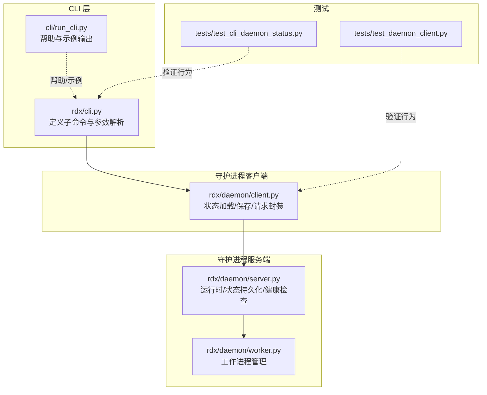
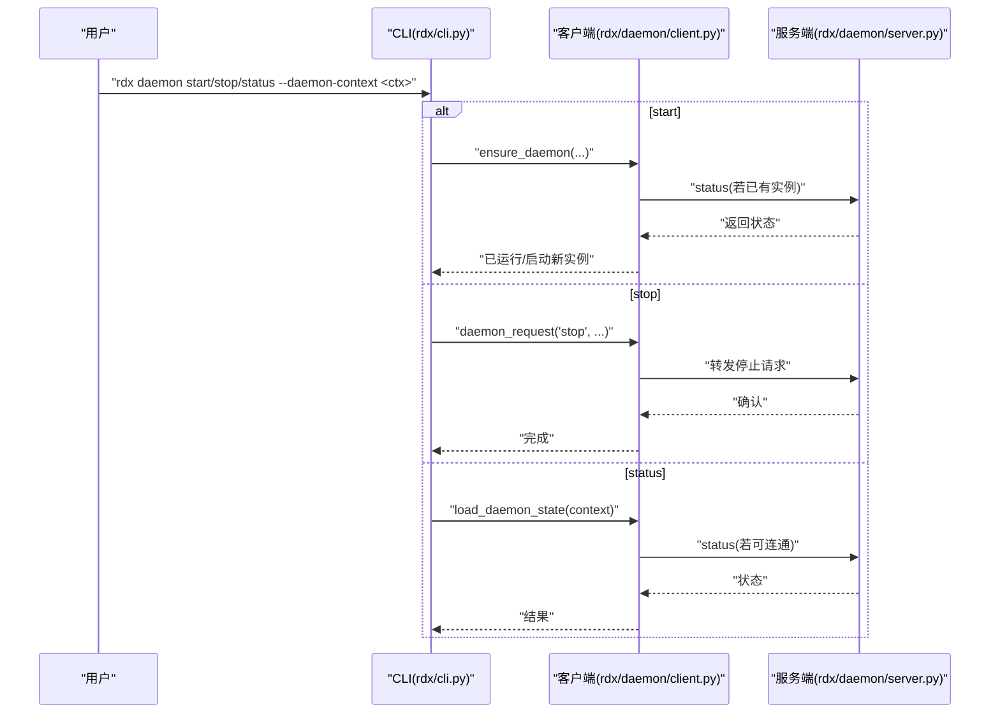
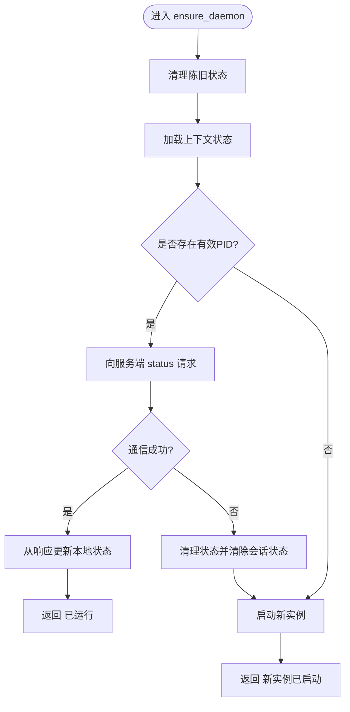
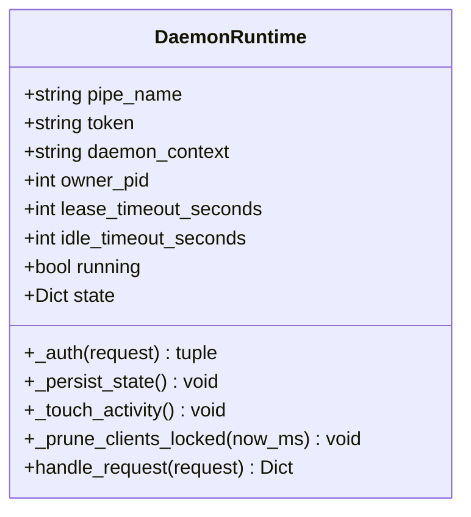
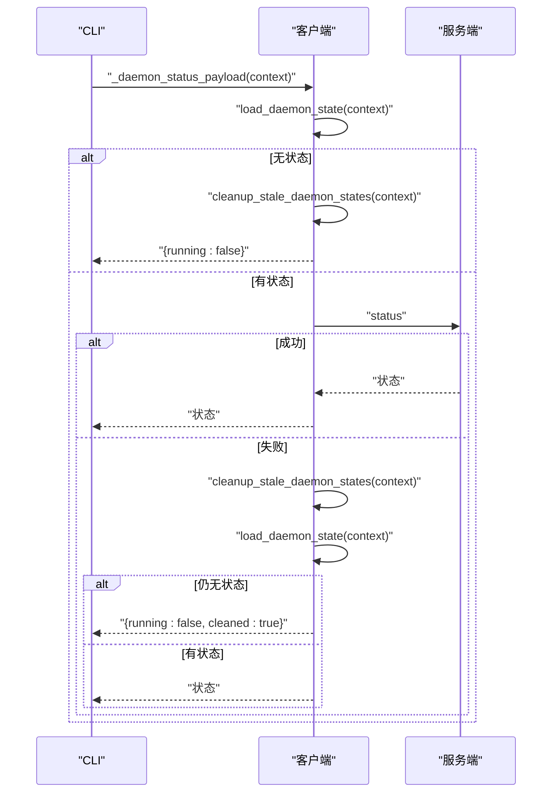
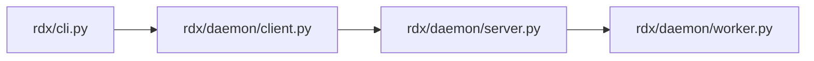

# 守护进程命令

<cite>
**本文引用的文件**
- [rdx/cli.py](file://rdx/cli.py)
- [rdx/daemon/client.py](file://rdx/daemon/client.py)
- [rdx/daemon/server.py](file://rdx/daemon/server.py)
- [rdx/daemon/worker.py](file://rdx/daemon/worker.py)
- [tests/test_cli_daemon_status.py](file://tests/test_cli_daemon_status.py)
- [tests/test_daemon_client.py](file://tests/test_daemon_client.py)
- [cli/run_cli.py](file://cli/run_cli.py)
</cite>

## 目录
1. [简介](#简介)
2. [项目结构](#项目结构)
3. [核心组件](#核心组件)
4. [架构总览](#架构总览)
5. [详细组件分析](#详细组件分析)
6. [依赖关系分析](#依赖关系分析)
7. [性能考量](#性能考量)
8. [故障排除指南](#故障排除指南)
9. [结论](#结论)
10. [附录](#附录)

## 简介
本文件系统性阐述守护进程命令，覆盖以下方面：
- 命令与用法：daemon start、daemon stop、daemon status 及其参数（如 --daemon-context）
- 启动、停止与状态查询机制
- 上下文管理与多上下文守护进程
- 生命周期管理与健康检查（租约、空闲超时、所有者进程监控）
- 故障排除与重启策略
- 多上下文守护进程的管理方法

## 项目结构
守护进程相关能力由 CLI 子命令、客户端与服务端实现协同完成，并通过“上下文”隔离不同守护进程实例。

图示来源
- [rdx/cli.py:1202-1222](file://rdx/cli.py#L1202-L1222)
- [rdx/daemon/client.py:199-604](file://rdx/daemon/client.py#L199-L604)
- [rdx/daemon/server.py:101-545](file://rdx/daemon/server.py#L101-L545)
- [rdx/daemon/worker.py](file://rdx/daemon/worker.py)
- [cli/run_cli.py:88-150](file://cli/run_cli.py#L88-L150)
- [tests/test_cli_daemon_status.py](file://tests/test_cli_daemon_status.py)
- [tests/test_daemon_client.py](file://tests/test_daemon_client.py)

章节来源
- [rdx/cli.py:1202-1222](file://rdx/cli.py#L1202-L1222)
- [cli/run_cli.py:88-150](file://cli/run_cli.py#L88-L150)

## 核心组件
- CLI 子命令与参数
  - daemon start：支持 --pipe-name、--owner-pid、--daemon-context 等
  - daemon stop：停止指定上下文的守护进程
  - daemon status：查询守护进程状态
  - --daemon-context：指定守护进程上下文标识，默认为 "default"
- 守护进程客户端
  - 负责状态载入/保存、规范化状态字段、向服务端发起请求
  - 提供 ensure_daemon：确保单上下文唯一运行、清理陈旧状态
- 守护进程服务端
  - 维护运行时状态、令牌鉴权、活动时间戳、客户端租约与空闲超时
  - 自检循环：在无附加客户端且空闲超时或租约过期时自动停止
- 测试
  - 验证 CLI 守护进程状态命令行为
  - 验证客户端状态处理与清理逻辑

章节来源
- [rdx/cli.py:1202-1222](file://rdx/cli.py#L1202-L1222)
- [rdx/daemon/client.py:199-604](file://rdx/daemon/client.py#L199-L604)
- [rdx/daemon/server.py:101-545](file://rdx/daemon/server.py#L101-L545)
- [tests/test_cli_daemon_status.py](file://tests/test_cli_daemon_status.py)
- [tests/test_daemon_client.py](file://tests/test_daemon_client.py)

## 架构总览
守护进程命令的调用链路如下：

图示来源
- [rdx/cli.py:1202-1222](file://rdx/cli.py#L1202-L1222)
- [rdx/daemon/client.py:576-604](file://rdx/daemon/client.py#L576-L604)
- [rdx/daemon/server.py:537-545](file://rdx/daemon/server.py#L537-L545)

## 详细组件分析

### CLI 子命令与参数
- 子命令定义
  - daemon start：添加管道名、所有者进程PID等参数
  - daemon stop：停止当前上下文守护进程
  - daemon status：查询状态
  - daemon attach/detach/heartbeat/cleanup：内部维护接口
- 参数
  - --daemon-context：上下文标识符，默认"default"

章节来源
- [rdx/cli.py:1202-1222](file://rdx/cli.py#L1202-L1222)
- [cli/run_cli.py:88-150](file://cli/run_cli.py#L88-L150)

### 守护进程客户端
- 状态规范化
  - 规范化上下文、时间戳、超时、附加客户端列表等字段
- 状态持久化
  - 将运行时状态写入磁盘，便于后续查询与恢复
- 请求封装
  - 通过 daemon_request 发起 RPC 请求，携带令牌与上下文
- ensure_daemon
  - 清理陈旧状态后判断是否已有运行中的守护进程
  - 若存在且可通信则返回“已运行”，否则尝试启动新实例

图示来源
- [rdx/daemon/client.py:576-604](file://rdx/daemon/client.py#L576-L604)
- [rdx/daemon/client.py:202-226](file://rdx/daemon/client.py#L202-L226)

章节来源
- [rdx/daemon/client.py:199-604](file://rdx/daemon/client.py#L199-L604)

### 守护进程服务端
- 运行时模型
  - 维护管道名、令牌、上下文、所有者进程PID、租约与空闲超时
  - 持久化状态到磁盘，记录最后活动时间、附加客户端、活跃请求数等
- 鉴权与请求处理
  - 以令牌校验请求合法性
  - 分发具体方法（status/stop/attach/detach等）
- 健康检查与自停
  - 无附加客户端且空闲超时或租约过期时触发停止
  - 所有者进程丢失且无附加客户端且无活跃请求时触发停止

图示来源
- [rdx/daemon/server.py:101-163](file://rdx/daemon/server.py#L101-L163)
- [rdx/daemon/server.py:164-168](file://rdx/daemon/server.py#L164-L168)
- [rdx/daemon/server.py:169-178](file://rdx/daemon/server.py#L169-L178)
- [rdx/daemon/server.py:179-192](file://rdx/daemon/server.py#L179-L192)
- [rdx/daemon/server.py:521-535](file://rdx/daemon/server.py#L521-L535)
- [rdx/daemon/server.py:537-545](file://rdx/daemon/server.py#L537-L545)

章节来源
- [rdx/daemon/server.py:101-545](file://rdx/daemon/server.py#L101-L545)

### CLI 状态查询流程
- 若无上下文状态或无法连接服务端，则清理陈旧状态并返回未运行
- 若可连接，返回服务端最新状态
- 异常场景会尝试清理并重试

图示来源
- [rdx/cli.py:250-272](file://rdx/cli.py#L250-L272)
- [rdx/daemon/client.py:568-573](file://rdx/daemon/client.py#L568-L573)

章节来源
- [rdx/cli.py:250-272](file://rdx/cli.py#L250-L272)

### 多上下文守护进程管理
- 上下文隔离
  - 每个 --daemon-context 对应独立的状态存储与运行实例
- 并行管理
  - 不同上下文可同时运行各自守护进程
- 切换与清理
  - 使用不同上下文ID即可切换目标守护进程
  - 陈旧状态会在启动或状态查询时被清理

章节来源
- [rdx/daemon/client.py:568-573](file://rdx/daemon/client.py#L568-L573)
- [rdx/daemon/server.py:101-124](file://rdx/daemon/server.py#L101-L124)

## 依赖关系分析
- CLI 依赖客户端进行状态与请求处理
- 客户端依赖服务端通过命名管道通信
- 服务端依赖工作进程执行任务（见 worker.py）

图示来源
- [rdx/cli.py:1202-1222](file://rdx/cli.py#L1202-L1222)
- [rdx/daemon/client.py:199-604](file://rdx/daemon/client.py#L199-L604)
- [rdx/daemon/server.py:101-545](file://rdx/daemon/server.py#L101-L545)
- [rdx/daemon/worker.py](file://rdx/daemon/worker.py)

章节来源
- [rdx/cli.py:1202-1222](file://rdx/cli.py#L1202-L1222)
- [rdx/daemon/client.py:199-604](file://rdx/daemon/client.py#L199-L604)
- [rdx/daemon/server.py:101-545](file://rdx/daemon/server.py#L101-L545)
- [rdx/daemon/worker.py](file://rdx/daemon/worker.py)

## 性能考量
- 状态持久化频率
  - 仅在状态变更时写入，避免频繁IO
- 健康检查轮询
  - 在自停逻辑中进行周期性检查，避免长阻塞
- 客户端租约与空闲超时
  - 通过合理设置租约与空闲超时平衡资源占用与可用性

## 故障排除指南
- 症状：状态查询显示未运行
  - 可能原因：无上下文状态或服务端不可达
  - 处理：执行状态查询会自动清理陈旧状态；若仍失败，尝试重新启动守护进程
- 症状：守护进程异常退出
  - 可能原因：租约过期、空闲超时、所有者进程丢失
  - 处理：检查 --owner-pid 是否正确传入；调整租约与空闲超时；确认客户端是否正常续租
- 症状：多上下文冲突
  - 可能原因：上下文ID重复或状态残留
  - 处理：使用不同 --daemon-context；必要时手动清理对应上下文状态文件

章节来源
- [rdx/cli.py:250-272](file://rdx/cli.py#L250-L272)
- [rdx/daemon/server.py:521-535](file://rdx/daemon/server.py#L521-L535)
- [tests/test_cli_daemon_status.py](file://tests/test_cli_daemon_status.py)
- [tests/test_daemon_client.py](file://tests/test_daemon_client.py)

## 结论
守护进程命令通过 CLI、客户端与服务端的协作，提供了可靠的启动、停止与状态查询能力。借助上下文隔离与健康检查机制，可在多场景下稳定运行。建议在生产环境中合理配置租约与空闲超时，并使用 --daemon-context 实现多实例隔离与管理。

## 附录
- 常用命令示例
  - 启动：rdx daemon start --daemon-context <ctx>
  - 停止：rdx daemon stop --daemon-context <ctx>
  - 查询：rdx daemon status --daemon-context <ctx>
- 关键参数
  - --daemon-context：守护进程上下文标识符，默认"default"
  - --pipe-name：命名管道名称（用于服务端监听）
  - --owner-pid：启动进程PID，用于自动停止检测

章节来源
- [cli/run_cli.py:88-150](file://cli/run_cli.py#L88-L150)
- [rdx/cli.py:1202-1222](file://rdx/cli.py#L1202-L1222)