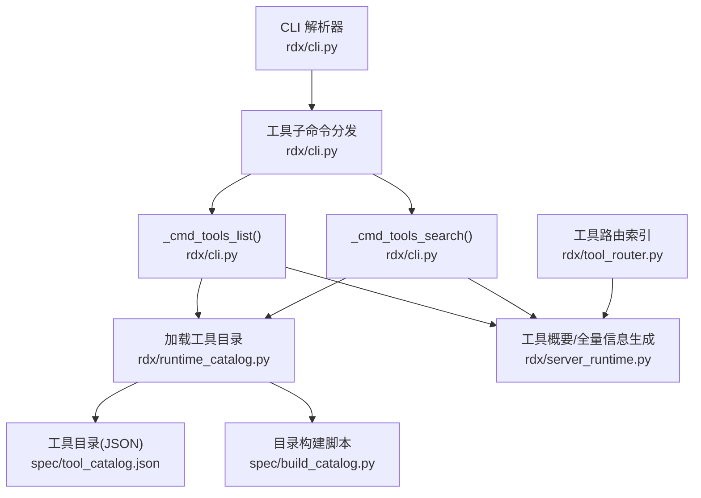
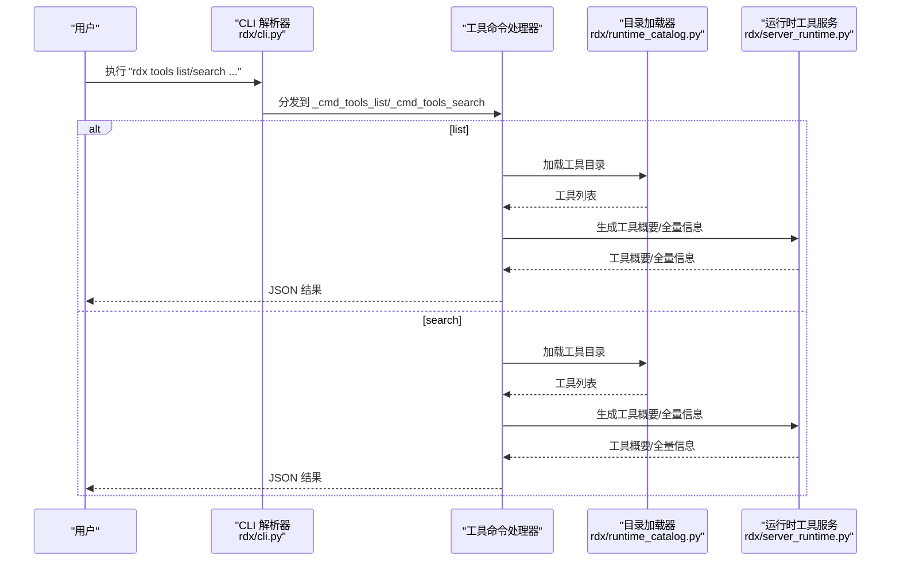
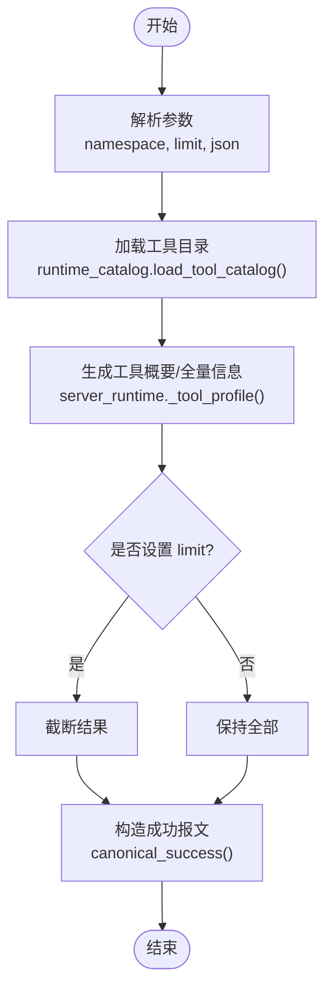
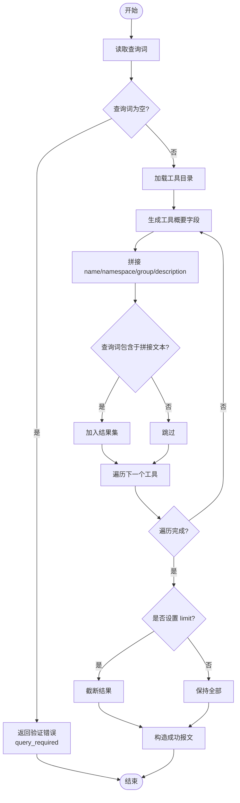
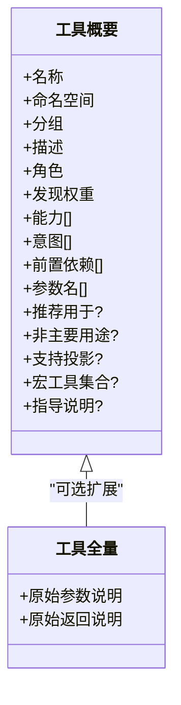
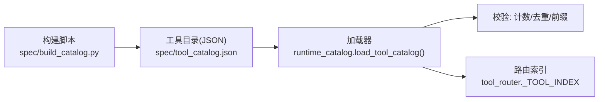
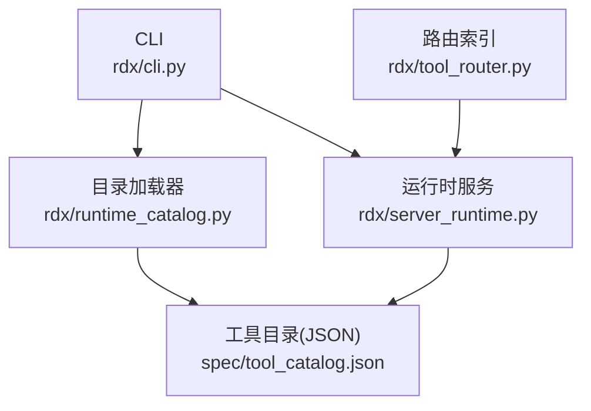

# 工具管理命令

<cite>
**本文引用的文件**
- [rdx/cli.py](file://rdx/cli.py)
- [rdx/runtime_catalog.py](file://rdx/runtime_catalog.py)
- [rdx/server_runtime.py](file://rdx/server_runtime.py)
- [rdx/tool_router.py](file://rdx/tool_router.py)
- [spec/tool_catalog.json](file://spec/tool_catalog.json)
- [spec/build_catalog.py](file://spec/build_catalog.py)
- [tests/test_cli_vfs.py](file://tests/test_cli_vfs.py)
- [rdx/core/contracts.py](file://rdx/core/contracts.py)
</cite>

## 目录
1. [简介](#简介)
2. [项目结构](#项目结构)
3. [核心组件](#核心组件)
4. [架构总览](#架构总览)
5. [详细组件分析](#详细组件分析)
6. [依赖分析](#依赖分析)
7. [性能考虑](#性能考虑)
8. [故障排查指南](#故障排查指南)
9. [结论](#结论)
10. [附录](#附录)

## 简介
本文件系统性说明工具管理命令，重点覆盖 tools list 与 tools search 两大子命令。内容包括：
- 工具列表查询、搜索过滤与结果展示
- 工具分类（命名空间、分组）、角色与意图、能力标签、前置依赖等元数据的呈现方式
- 工具目录结构与工具注册机制
- 最佳实践与过滤技巧
- 命令调用流程与错误处理

## 项目结构
围绕工具管理命令的相关模块与资源分布如下：
- CLI 层：解析参数、分发到具体命令实现
- 运行时层：工具目录加载、工具概要与全量信息生成、过滤与排序
- 规范层：工具目录清单与构建脚本
- 测试层：验证命令行为与输出格式

**图表来源**
- [rdx/cli.py:1189-1334](file://rdx/cli.py#L1189-L1334)
- [rdx/runtime_catalog.py:12-28](file://rdx/runtime_catalog.py#L12-L28)
- [spec/tool_catalog.json:3979-4036](file://spec/tool_catalog.json#L3979-L4036)
- [spec/build_catalog.py:355-493](file://spec/build_catalog.py#L355-L493)
- [rdx/server_runtime.py:5936-6438](file://rdx/server_runtime.py#L5936-L6438)
- [rdx/tool_router.py:51-76](file://rdx/tool_router.py#L51-L76)

**章节来源**
- [rdx/cli.py:1189-1334](file://rdx/cli.py#L1189-L1334)
- [rdx/runtime_catalog.py:12-28](file://rdx/runtime_catalog.py#L12-L28)
- [spec/tool_catalog.json:3979-4036](file://spec/tool_catalog.json#L3979-L4036)
- [spec/build_catalog.py:355-493](file://spec/build_catalog.py#L355-L493)
- [rdx/server_runtime.py:5936-6438](file://rdx/server_runtime.py#L5936-L6438)
- [rdx/tool_router.py:51-76](file://rdx/tool_router.py#L51-L76)

## 核心组件
- CLI 子命令定义与参数解析
  - tools list：支持按命名空间过滤、限制数量、JSON 输出
  - tools search：支持查询词、限制数量、JSON 输出
- 工具目录加载与校验
  - 从工具根目录下的规范文件加载工具清单，进行计数一致性、重复名、前缀校验
- 工具概要与全量信息生成
  - 生成工具概要字段（名称、命名空间、分组、描述、角色、发现权重、能力、意图、前置依赖、参数名等）
  - 支持“全量”详情字段（原始参数与返回说明）
- 工具路由索引
  - 构建工具名到目录条目的映射，供运行时使用

**章节来源**
- [rdx/cli.py:1189-1198](file://rdx/cli.py#L1189-L1198)
- [rdx/runtime_catalog.py:12-28](file://rdx/runtime_catalog.py#L12-L28)
- [rdx/server_runtime.py:6383-6412](file://rdx/server_runtime.py#L6383-L6412)
- [rdx/tool_router.py:51-76](file://rdx/tool_router.py#L51-L76)

## 架构总览
工具管理命令在 CLI 层完成参数解析与分发，随后通过运行时层加载工具目录并生成工具概要或全量信息，最终以标准化 JSON 报文返回。

**图表来源**
- [rdx/cli.py:1189-1334](file://rdx/cli.py#L1189-L1334)
- [rdx/runtime_catalog.py:12-28](file://rdx/runtime_catalog.py#L12-L28)
- [rdx/server_runtime.py:5936-6438](file://rdx/server_runtime.py#L5936-L6438)

## 详细组件分析

### tools list 列表查询
- 功能要点
  - 支持按命名空间过滤（如 capture、pipeline 等）
  - 支持限制返回数量（0 表示不限制）
  - 支持 JSON 输出（稳定报文结构）
- 数据来源与处理
  - 从工具目录加载工具清单
  - 生成工具概要字段（名称、命名空间、分组、描述、角色、发现权重、能力、意图、前置依赖、参数名等）
  - 可选地追加“全量”详情字段（原始参数与返回说明）
- 输出结构
  - 包含工具总数与工具数组
  - 使用标准化报文结构，包含 schema 版本、工具版本、结果类型、元数据等

**图表来源**
- [rdx/cli.py:1189-1198](file://rdx/cli.py#L1189-L1198)
- [rdx/runtime_catalog.py:12-28](file://rdx/runtime_catalog.py#L12-L28)
- [rdx/server_runtime.py:6383-6412](file://rdx/server_runtime.py#L6383-L6412)
- [rdx/core/contracts.py:99-141](file://rdx/core/contracts.py#L99-L141)

**章节来源**
- [rdx/cli.py:1189-1198](file://rdx/cli.py#L1189-L1198)
- [rdx/runtime_catalog.py:12-28](file://rdx/runtime_catalog.py#L12-L28)
- [rdx/server_runtime.py:6383-6412](file://rdx/server_runtime.py#L6383-L6412)
- [rdx/core/contracts.py:99-141](file://rdx/core/contracts.py#L99-L141)

### tools search 搜索过滤
- 功能要点
  - 必须提供查询词，否则返回验证错误
  - 在工具名称、命名空间、分组、描述等字段上执行不区分大小写的包含匹配
  - 支持限制返回数量（默认 20）
  - 支持 JSON 输出
- 过滤逻辑
  - 将工具概要字段拼接为统一文本，查询词在其中出现即命中
  - 可选地对结果进行排序（基于发现权重与查询词调整）

**图表来源**
- [rdx/cli.py:671-699](file://rdx/cli.py#L671-L699)
- [rdx/runtime_catalog.py:12-28](file://rdx/runtime_catalog.py#L12-L28)
- [rdx/server_runtime.py:6415-6438](file://rdx/server_runtime.py#L6415-L6438)
- [rdx/core/contracts.py:99-141](file://rdx/core/contracts.py#L99-L141)

**章节来源**
- [rdx/cli.py:671-699](file://rdx/cli.py#L671-L699)
- [rdx/runtime_catalog.py:12-28](file://rdx/runtime_catalog.py#L12-L28)
- [rdx/server_runtime.py:6415-6438](file://rdx/server_runtime.py#L6415-L6438)
- [rdx/core/contracts.py:99-141](file://rdx/core/contracts.py#L99-L141)

### 工具信息展示格式
- 工具概要字段（默认）
  - 名称、命名空间、分组、描述、角色、发现权重、能力、意图、前置依赖、参数名
- 工具全量字段（可选）
  - 原始参数说明、原始返回说明
- 附加信息
  - 推荐用于、非主要用途、是否支持投影、宏工具引导信息等

**图表来源**
- [rdx/server_runtime.py:6383-6412](file://rdx/server_runtime.py#L6383-L6412)

**章节来源**
- [rdx/server_runtime.py:6383-6412](file://rdx/server_runtime.py#L6383-L6412)

### 工具目录结构与工具注册机制
- 工具目录文件
  - 位于工具根目录的规范文件，包含工具数组与声明的工具总数
- 目录加载与校验
  - 读取 JSON 并校验工具总数一致性、名称唯一性、名称前缀合法性
- 目录构建脚本
  - 提供从源文件构建工具目录的能力，并输出构建统计
- 工具路由索引
  - 构建工具名到目录条目的映射，便于运行时快速定位

**图表来源**
- [spec/tool_catalog.json:3979-4036](file://spec/tool_catalog.json#L3979-L4036)
- [rdx/runtime_catalog.py:12-28](file://rdx/runtime_catalog.py#L12-L28)
- [spec/build_catalog.py:355-493](file://spec/build_catalog.py#L355-L493)
- [rdx/tool_router.py:51-76](file://rdx/tool_router.py#L51-L76)

**章节来源**
- [spec/tool_catalog.json:3979-4036](file://spec/tool_catalog.json#L3979-L4036)
- [rdx/runtime_catalog.py:12-28](file://rdx/runtime_catalog.py#L12-L28)
- [spec/build_catalog.py:355-493](file://spec/build_catalog.py#L355-L493)
- [rdx/tool_router.py:51-76](file://rdx/tool_router.py#L51-L76)

### 命令最佳实践与过滤技巧
- tools list
  - 使用命名空间过滤快速聚焦领域（如 capture、pipeline）
  - 配合 limit 控制输出规模，提升交互效率
  - 使用 --json 获取稳定机器可读输出，便于集成
- tools search
  - 查询词建议采用关键词组合（名称、描述、分组），提高召回率
  - 若结果过多，设置较小的 limit 以便浏览
  - 使用 --json 结合上游工具链进行二次处理
- 结果解读
  - 角色与意图帮助识别工具适用场景
  - 前置依赖提示执行顺序与准备事项
  - 参数名与能力标签辅助自动化组装调用

**章节来源**
- [rdx/cli.py:1189-1198](file://rdx/cli.py#L1189-L1198)
- [rdx/server_runtime.py:6383-6412](file://rdx/server_runtime.py#L6383-L6412)

## 依赖分析
- 组件耦合
  - CLI 层仅负责参数解析与分发，低耦合
  - 目录加载器与运行时服务紧密协作，共同决定工具信息的生成
  - 路由索引服务于运行时工具分发，与目录加载器存在间接依赖
- 外部依赖
  - 工具目录 JSON 文件作为权威数据源
  - 构建脚本负责维护目录完整性与一致性

**图表来源**
- [rdx/cli.py:1189-1334](file://rdx/cli.py#L1189-L1334)
- [rdx/runtime_catalog.py:12-28](file://rdx/runtime_catalog.py#L12-L28)
- [rdx/server_runtime.py:5936-6438](file://rdx/server_runtime.py#L5936-L6438)
- [rdx/tool_router.py:51-76](file://rdx/tool_router.py#L51-L76)
- [spec/tool_catalog.json:3979-4036](file://spec/tool_catalog.json#L3979-L4036)

**章节来源**
- [rdx/cli.py:1189-1334](file://rdx/cli.py#L1189-L1334)
- [rdx/runtime_catalog.py:12-28](file://rdx/runtime_catalog.py#L12-L28)
- [rdx/server_runtime.py:5936-6438](file://rdx/server_runtime.py#L5936-L6438)
- [rdx/tool_router.py:51-76](file://rdx/tool_router.py#L51-L76)
- [spec/tool_catalog.json:3979-4036](file://spec/tool_catalog.json#L3979-L4036)

## 性能考虑
- 列表查询
  - 仅加载一次目录，后续在内存中进行过滤与截断，时间复杂度近似 O(N)
  - limit 有助于控制输出规模，减少序列化与传输开销
- 搜索查询
  - 对每个工具进行字符串拼接与包含判断，整体复杂度 O(N·M)，N 为工具数，M 为平均工具描述长度
  - 建议合理设置 limit，避免大规模文本匹配带来的延迟
- 输出稳定性
  - 使用标准化报文结构，确保 JSON 输出稳定，利于缓存与二次处理

[本节为通用性能讨论，无需特定文件分析]

## 故障排查指南
- tools search 缺少查询词
  - 现象：返回验证错误，提示需要查询词
  - 处理：提供非空查询词
- 工具目录异常
  - 现象：目录计数不一致、存在重复名、工具名前缀非法
  - 处理：检查工具目录 JSON，修复计数、去重与前缀
- 命令行为验证
  - 可参考测试用例对命令参数与输出结构进行核验

**章节来源**
- [rdx/cli.py:671-699](file://rdx/cli.py#L671-L699)
- [rdx/runtime_catalog.py:12-28](file://rdx/runtime_catalog.py#L12-L28)
- [tests/test_cli_vfs.py:19-113](file://tests/test_cli_vfs.py#L19-L113)

## 结论
tools list 与 tools search 提供了面向工具发现与导航的两类能力：前者用于快速浏览与筛选，后者用于基于关键词的检索。二者均以标准化 JSON 输出，便于与自动化流程集成。工具目录与构建脚本保证了工具清单的完整性与一致性，运行时服务则提供了稳定的工具信息生成与过滤能力。

[本节为总结性内容，无需特定文件分析]

## 附录
- 命令速查
  - tools list
    - 选项：--namespace、--limit、--json
  - tools search
    - 参数：query；选项：--limit、--json
- 输出报文结构
  - 使用标准化报文结构，包含 schema 版本、工具版本、结果类型、数据体、元数据等

**章节来源**
- [rdx/cli.py:1189-1198](file://rdx/cli.py#L1189-L1198)
- [rdx/core/contracts.py:99-141](file://rdx/core/contracts.py#L99-L141)