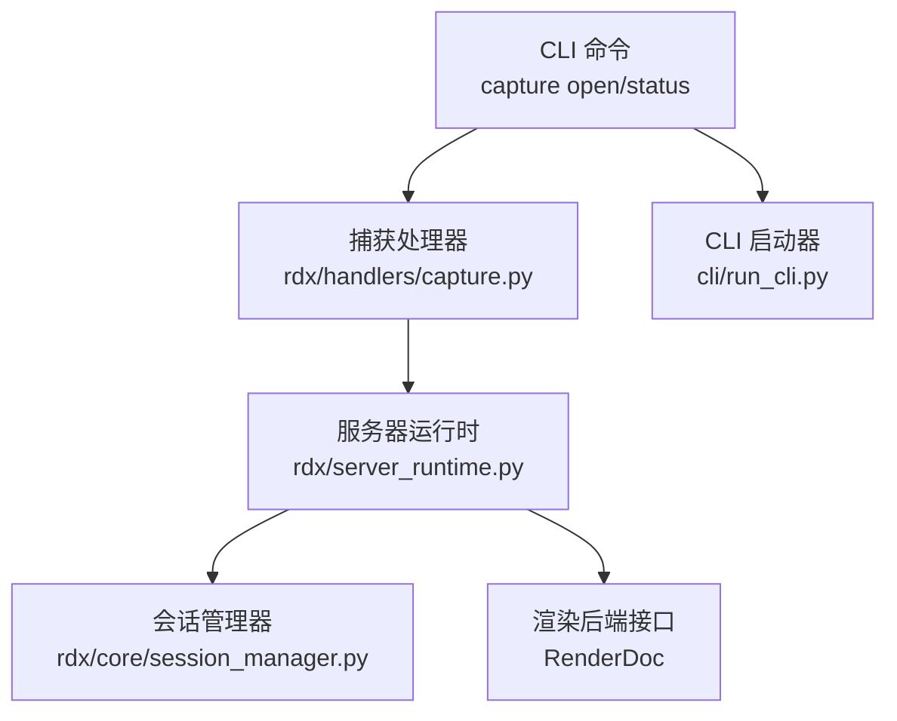
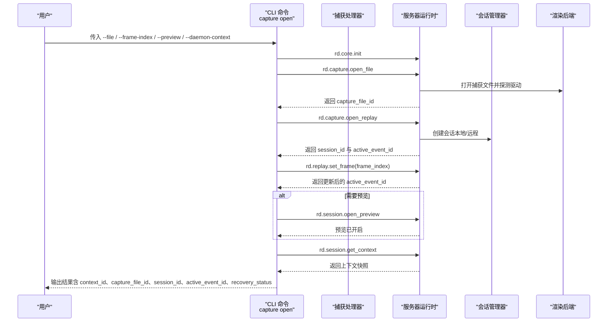
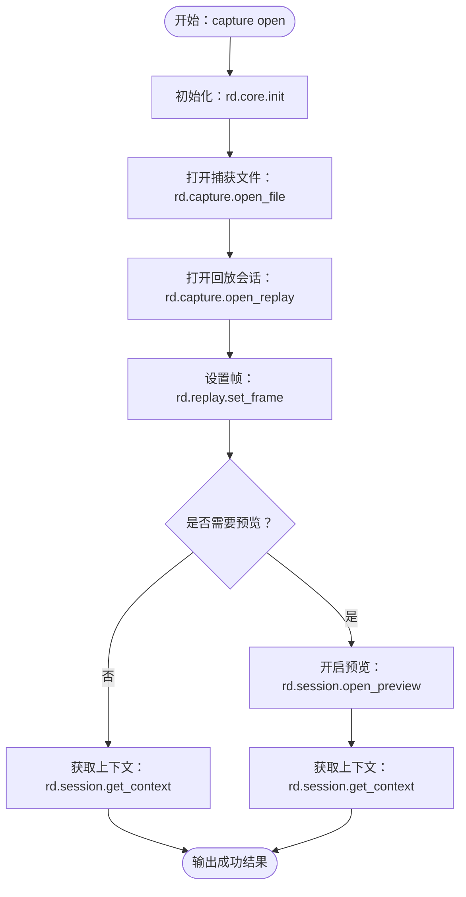
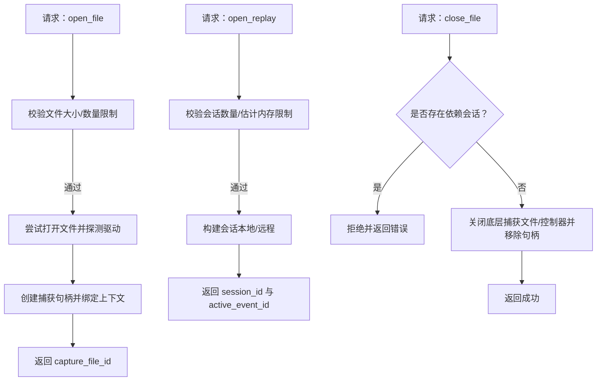
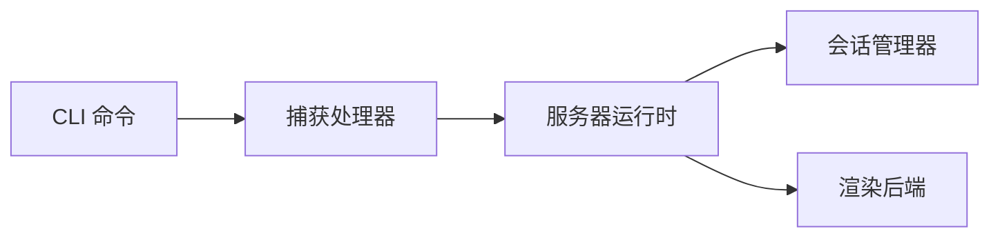

# 捕获文件命令

<cite>
**本文引用的文件**
- [cli.py](file://rdx/cli.py)
- [run_cli.py](file://cli/run_cli.py)
- [capture.py](file://rdx/handlers/capture.py)
- [server_runtime.py](file://rdx/server_runtime.py)
- [session_manager.py](file://rdx/core/session_manager.py)
- [test_capture_open_file_semantics.py](file://tests/test_capture_open_file_semantics.py)
- [test_runtime_recovery_and_discovery.py](file://tests/test_runtime_recovery_and_discovery.py)
</cite>

## 目录
1. [简介](#简介)
2. [项目结构](#项目结构)
3. [核心组件](#核心组件)
4. [架构总览](#架构总览)
5. [详细组件分析](#详细组件分析)
6. [依赖分析](#依赖分析)
7. [性能考虑](#性能考虑)
8. [故障排查指南](#故障排查指南)
9. [结论](#结论)
10. [附录](#附录)

## 简介
本文件系统化阐述“捕获文件命令”的完整能力与使用方式，覆盖以下方面：
- 命令：capture open、capture status
- 功能：打开捕获文件、查询当前上下文中的捕获状态、设置帧索引、可选开启预览
- 参数：文件路径、帧索引、是否预览、守护进程上下文标识
- 内部机制：捕获文件验证、会话打开、帧定位、预览窗口、上下文快照与恢复
- 格式与兼容性：支持的捕获文件类型、渲染导出格式映射
- 性能与内存：大小限制、会话数量限制、估计回放内存限制
- 常见问题与排错：错误载荷、重试与恢复提示

## 项目结构
围绕捕获文件命令的关键模块如下：
- CLI 层：定义命令与参数解析，组织调用序列
- 服务器运行时：执行捕获文件打开、会话打开、帧设置、状态查询等核心逻辑
- 会话管理器：负责与底层渲染后端交互，关闭捕获文件与控制器
- 测试用例：验证打开文件语义、内存限制拒绝行为

图表来源
- [cli.py:845-989](file://rdx/cli.py#L845-L989)
- [capture.py:8-11](file://rdx/handlers/capture.py#L8-L11)
- [server_runtime.py:6828-7000](file://rdx/server_runtime.py#L6828-L7000)
- [session_manager.py:501-530](file://rdx/core/session_manager.py#L501-L530)
- [run_cli.py:86-118](file://cli/run_cli.py#L86-L118)

章节来源
- [cli.py:845-989](file://rdx/cli.py#L845-L989)
- [run_cli.py:86-118](file://cli/run_cli.py#L86-L118)

## 核心组件
- CLI 命令入口
  - capture open：解析文件路径、帧索引、预览开关；按顺序调用初始化、打开捕获文件、打开回放会话、设置帧、获取上下文；可选开启预览并再次获取上下文
  - capture status：查询守护进程状态、当前上下文快照，汇总是否有会话、运行时信息与上下文详情
- 服务器运行时
  - 打开捕获文件：校验大小与数量限制，尝试通过渲染后端打开文件以探测驱动类型，创建捕获句柄并绑定到上下文
  - 打开会话：检查会话数量与估计回放内存限制，构造本地或远程后端配置，建立会话
  - 关闭捕获文件：若存在依赖会话则拒绝，否则移除句柄并清理上下文绑定
- 会话管理器
  - 负责与渲染后端交互，正确关闭捕获文件与控制器，避免资源泄漏
- 测试保障
  - 验证打开文件不误触回放打开
  - 验证超过估计回放内存时被拒绝

章节来源
- [cli.py:845-989](file://rdx/cli.py#L845-L989)
- [server_runtime.py:6828-7000](file://rdx/server_runtime.py#L6828-L7000)
- [session_manager.py:501-530](file://rdx/core/session_manager.py#L501-L530)
- [test_capture_open_file_semantics.py:31-41](file://tests/test_capture_open_file_semantics.py#L31-L41)
- [test_runtime_recovery_and_discovery.py:795-804](file://tests/test_runtime_recovery_and_discovery.py#L795-L804)

## 架构总览
下图展示 capture open 的端到端流程，包括 CLI、处理器、运行时与后端交互。

图表来源
- [cli.py:845-966](file://rdx/cli.py#L845-L966)
- [server_runtime.py:6926-7000](file://rdx/server_runtime.py#L6926-L7000)
- [session_manager.py:501-530](file://rdx/core/session_manager.py#L501-L530)

章节来源
- [cli.py:845-966](file://rdx/cli.py#L845-L966)
- [server_runtime.py:6926-7000](file://rdx/server_runtime.py#L6926-L7000)

## 详细组件分析

### 命令：capture open
- 输入参数
  - --file：捕获文件绝对路径（CLI 会解析为绝对路径）
  - --frame-index：目标帧索引（整数）
  - --preview：布尔开关，开启预览
  - --daemon-context：守护进程上下文标识
  - --artifact-dir：用于初始化的制品目录（仅在初始化阶段使用）
- 行为流程
  1) 初始化：调用 rd.core.init，传入全局环境（含制品目录），启用远程能力
  2) 打开捕获文件：调用 rd.capture.open_file，返回 capture_file_id
  3) 打开会话：调用 rd.capture.open_replay，返回 session_id 与 active_event_id
  4) 设置帧：调用 rd.replay.set_frame，根据 --frame-index 定位帧
  5) 可选预览：若 --preview 开启，则调用 rd.session.open_preview，并再次获取上下文
  6) 输出：返回包含上下文 ID、捕获文件 ID、会话 ID、活动事件 ID、恢复状态与运行时/上下文快照的结果
- 错误处理
  - 每一步失败均生成统一错误载荷，包含步骤名、源载荷或异常、上下文、文件路径、捕获文件 ID、会话 ID、活动事件 ID 等，便于诊断与恢复

图表来源
- [cli.py:845-966](file://rdx/cli.py#L845-L966)

章节来源
- [cli.py:845-966](file://rdx/cli.py#L845-L966)
- [cli.py:772-794](file://rdx/cli.py#L772-L794)

### 命令：capture status
- 行为
  - 查询守护进程状态与当前上下文快照
  - 判断是否存在有效会话（依据运行时 session_id）
  - 组装并输出包含上下文 ID、是否已有会话、守护进程状态、上下文数据的结构化结果
- 适用场景
  - 快速确认当前上下文中是否已打开捕获文件与会话
  - 作为自动化脚本的前置检查

章节来源
- [cli.py:969-989](file://rdx/cli.py#L969-L989)

### 服务器运行时：捕获文件生命周期
- 打开捕获文件
  - 校验文件大小与捕获文件数量上限
  - 通过渲染后端尝试打开文件并探测驱动名称
  - 创建捕获句柄并绑定到当前上下文
- 打开会话
  - 校验会话数量与估计回放内存上限
  - 选择本地或远程后端配置，建立会话
- 关闭捕获文件
  - 若仍有依赖会话则拒绝
  - 正确关闭底层捕获文件与控制器，释放资源

图表来源
- [server_runtime.py:6828-6883](file://rdx/server_runtime.py#L6828-L6883)
- [server_runtime.py:6926-7000](file://rdx/server_runtime.py#L6926-L7000)
- [session_manager.py:501-530](file://rdx/core/session_manager.py#L501-L530)

章节来源
- [server_runtime.py:6828-6883](file://rdx/server_runtime.py#L6828-L6883)
- [server_runtime.py:6926-7000](file://rdx/server_runtime.py#L6926-L7000)
- [session_manager.py:501-530](file://rdx/core/session_manager.py#L501-L530)

### 文件路径、帧索引与预览参数
- 文件路径
  - CLI 侧会将 --file 解析为绝对路径，确保跨平台一致性
- 帧索引
  - 通过 rd.replay.set_frame 设置目标帧索引，后续所有资源访问均以此帧为基准
- 预览参数
  - --preview 会在打开会话后调用 rd.session.open_preview，便于快速可视化当前帧
  - 预览开启后会再次获取上下文，确保状态同步

章节来源
- [cli.py:845-966](file://rdx/cli.py#L845-L966)

### 捕获文件格式与兼容性
- 支持的捕获文件
  - 由渲染后端判定，服务器运行时在打开文件时探测驱动名称，用于识别底层图形 API
- 渲染导出格式映射
  - 工具内部对纹理导出格式进行标准化映射，例如 jpeg 映射为 jpg，支持多种常见格式枚举
  - 导出前会校验格式有效性与运行时可用性

章节来源
- [server_runtime.py:6837-6852](file://rdx/server_runtime.py#L6837-L6852)
- [render_service.py:126-158](file://rdx/core/render_service.py#L126-L158)

### 常见文件格式与转换选项
- 常见格式
  - PNG、JPG、DDS、EXR、HDR、TGA、BMP、Raw 等
- 转换选项
  - 工具通过渲染后端的文件类型枚举进行转换，不支持的格式会抛出明确错误
  - 导出时会根据缓冲区大小与通道布局自动推断数据类型（如 float32 RGBA 或 uint8 RGBA）

章节来源
- [render_service.py:126-158](file://rdx/core/render_service.py#L126-L158)
- [render_service.py:716-740](file://rdx/core/render_service.py#L716-L740)

## 依赖分析
- CLI 与运行时的耦合
  - CLI 通过统一的守护进程执行器发起操作，运行时集中处理业务规则（限制、进度、错误）
- 运行时与会话管理器
  - 运行时负责资源生命周期与限制控制，会话管理器负责与后端交互与资源关闭
- 处理器适配层
  - 捕获处理器将请求转发至运行时，保持接口清晰与职责分离

图表来源
- [capture.py:8-11](file://rdx/handlers/capture.py#L8-L11)
- [server_runtime.py:6828-7000](file://rdx/server_runtime.py#L6828-L7000)
- [session_manager.py:501-530](file://rdx/core/session_manager.py#L501-L530)

章节来源
- [capture.py:8-11](file://rdx/handlers/capture.py#L8-L11)
- [server_runtime.py:6828-7000](file://rdx/server_runtime.py#L6828-L7000)
- [session_manager.py:501-530](file://rdx/core/session_manager.py#L501-L530)

## 性能考虑
- 文件大小与数量限制
  - 服务器运行时在打开文件前校验文件大小与上下文内捕获文件数量上限，超限直接拒绝并记录指标
- 会话数量限制
  - 打开会话前校验当前上下文会话数量上限，避免资源竞争
- 估计回放内存限制
  - 基于捕获文件大小估算回放内存占用，超过阈值拒绝，防止 OOM
- I/O 与线程卸载
  - 对渲染后端调用采用线程卸载策略，避免阻塞主循环
- 建议
  - 优先使用较小的捕获文件或裁剪帧范围
  - 控制同时打开的捕获文件数量与会话数量
  - 在高分辨率纹理导出时注意内存峰值，必要时分块处理或降低导出质量

章节来源
- [server_runtime.py:6800-6883](file://rdx/server_runtime.py#L6800-L6883)
- [server_runtime.py:6926-7000](file://rdx/server_runtime.py#L6926-L7000)

## 故障排查指南
- 常见错误与恢复
  - 捕获文件过大：调整文件大小或拆分捕获
  - 捕获文件数量超限：关闭不再使用的捕获文件后再试
  - 会话数量超限：关闭多余会话或切换上下文
  - 估计回放内存超限：减小捕获范围或降低纹理分辨率
- 错误载荷
  - CLI 在每步失败时生成统一错误载荷，包含步骤名、源错误详情、上下文、文件路径、捕获文件 ID、会话 ID、活动事件 ID 等，便于定位问题
- 回收与重试
  - 当捕获文件仍被会话占用时，需先关闭依赖会话再尝试关闭文件
  - 使用 capture status 快速确认当前上下文状态，决定下一步操作

章节来源
- [cli.py:772-794](file://rdx/cli.py#L772-L794)
- [server_runtime.py:6864-6883](file://rdx/server_runtime.py#L6864-L6883)
- [test_runtime_recovery_and_discovery.py:795-804](file://tests/test_runtime_recovery_and_discovery.py#L795-L804)

## 结论
- capture open 提供了从文件打开到会话建立、帧定位与可选预览的一体化工作流
- 服务器运行时严格控制资源与内存占用，保证稳定性
- CLI 与运行时的清晰分层使得扩展与维护更加容易
- 建议在自动化流水线中结合 capture status 与严格的资源管理策略，确保可重复性与可靠性

## 附录
- 命令示例（来自启动器帮助）
  - capture open：包含 --file、--frame-index、--preview、--daemon-context 等参数
  - session preview on/off/status：与预览相关的会话级命令

章节来源
- [run_cli.py:86-118](file://cli/run_cli.py#L86-L118)