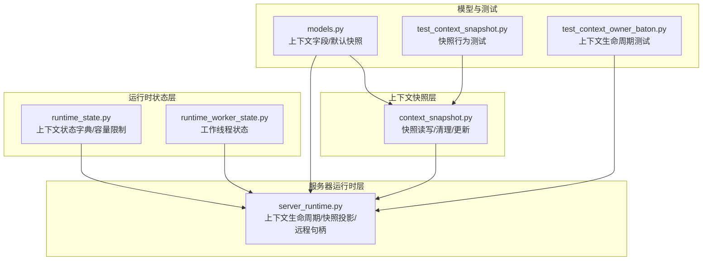
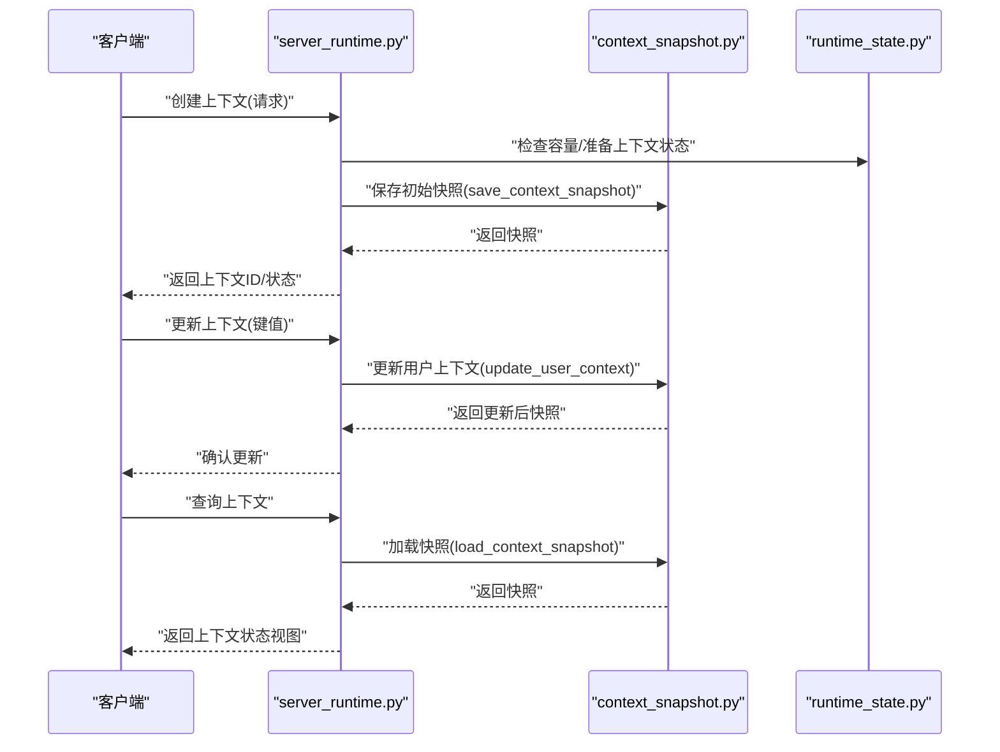
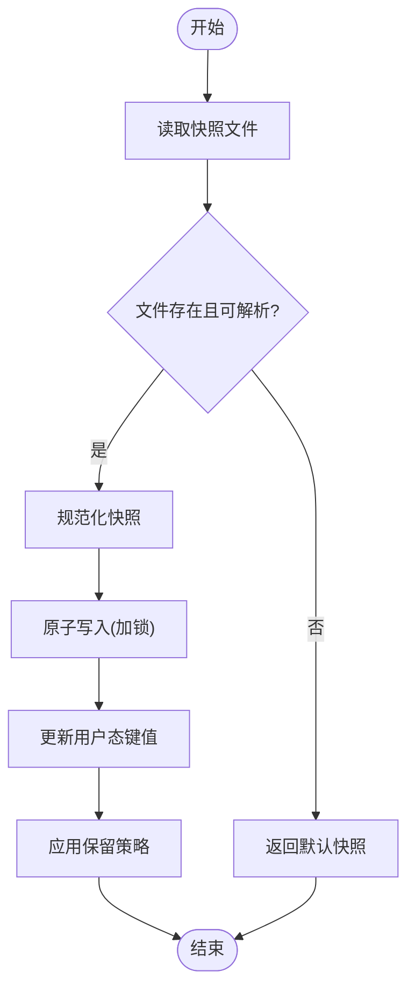
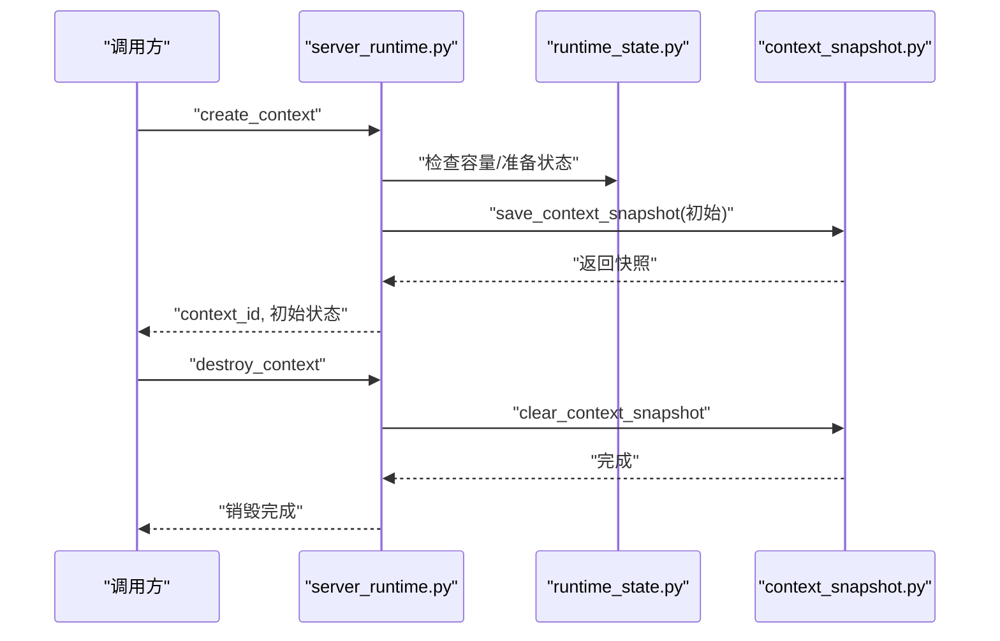
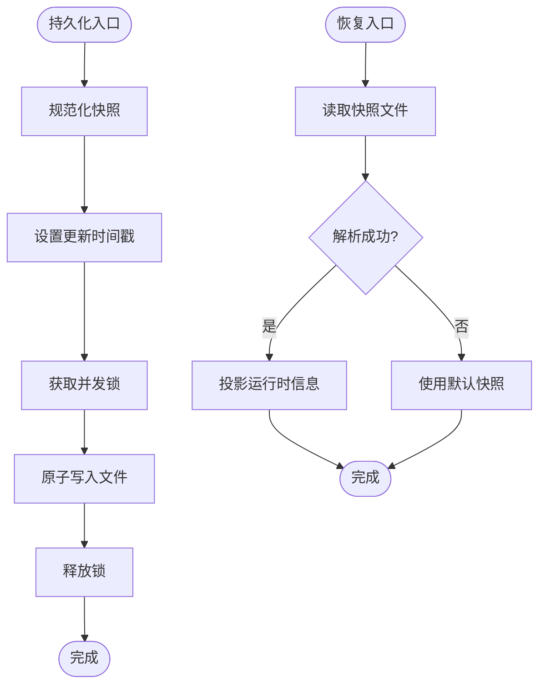
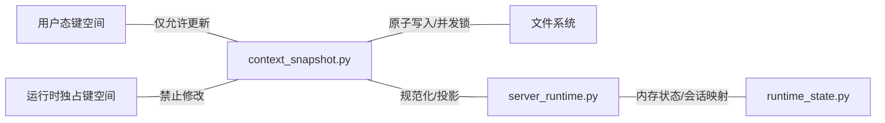
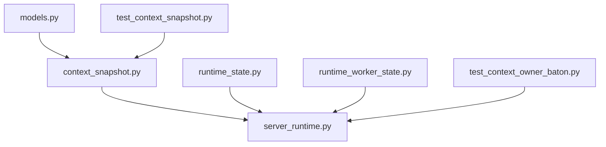

# 上下文状态管理

<cite>
**本文引用的文件**
- [context_snapshot.py](file://rdx/context_snapshot.py)
- [server_runtime.py](file://rdx/server_runtime.py)
- [runtime_state.py](file://rdx/runtime_state.py)
- [runtime_worker_state.py](file://rdx/runtime_worker_state.py)
- [models.py](file://rdx/models.py)
- [test_context_snapshot.py](file://tests/test_context_snapshot.py)
- [test_context_owner_baton.py](file://tests/test_context_owner_baton.py)
</cite>

## 目录
1. [引言](#引言)
2. [项目结构](#项目结构)
3. [核心组件](#核心组件)
4. [架构总览](#架构总览)
5. [详细组件分析](#详细组件分析)
6. [依赖关系分析](#依赖关系分析)
7. [性能考量](#性能考量)
8. [故障排查指南](#故障排查指南)
9. [结论](#结论)
10. [附录](#附录)

## 引言
本文件系统性阐述 RDC-Agent-Tools 中“上下文状态管理”的设计与实现，覆盖上下文的创建、初始化与销毁流程；状态快照机制、持久化与恢复策略；上下文隔离原理、状态同步与并发控制；上下文标识符生成、状态验证与错误处理；以及状态查询、监控与调试方法。文档以仓库中的真实源码为依据，通过图示与路径引用帮助读者快速定位实现细节。

## 项目结构
围绕上下文状态管理的关键模块包括：
- 状态快照：负责上下文状态的序列化、原子写入、清理与用户态更新
- 运行时状态：维护运行时上下文集合、会话映射、远程句柄等核心数据
- 服务器运行时：对外暴露上下文生命周期操作（创建、更新、查询、销毁）
- 模型定义：统一上下文字段、保留字段集合与默认快照结构
- 测试用例：验证上下文生命周期与快照行为

图表来源
- [context_snapshot.py:453-494](file://rdx/context_snapshot.py#L453-L494)
- [server_runtime.py:1154-1180](file://rdx/server_runtime.py#L1154-L1180)
- [runtime_state.py](file://rdx/runtime_state.py)
- [runtime_worker_state.py](file://rdx/runtime_worker_state.py)
- [models.py](file://rdx/models.py)
- [test_context_snapshot.py:92-109](file://tests/test_context_snapshot.py#L92-L109)
- [test_context_owner_baton.py:67-93](file://tests/test_context_owner_baton.py#L67-L93)

章节来源
- [context_snapshot.py:453-494](file://rdx/context_snapshot.py#L453-L494)
- [server_runtime.py:1154-1180](file://rdx/server_runtime.py#L1154-L1180)
- [runtime_state.py](file://rdx/runtime_state.py)
- [runtime_worker_state.py](file://rdx/runtime_worker_state.py)
- [models.py](file://rdx/models.py)
- [test_context_snapshot.py:92-109](file://tests/test_context_snapshot.py#L92-L109)
- [test_context_owner_baton.py:67-93](file://tests/test_context_owner_baton.py#L67-L93)

## 核心组件
- 上下文快照模块：提供快照读取、保存、清理与用户态键值更新能力，并确保并发安全与原子写入
- 运行时状态模块：维护上下文状态字典、容量限制与会话映射，支撑上下文生命周期管理
- 服务器运行时模块：封装上下文创建、更新、查询、销毁等操作，负责快照投影与远程句柄状态
- 模型与默认快照：定义上下文字段、保留字段集合与默认快照结构，保障一致性与兼容性
- 测试用例：验证上下文生命周期与快照行为，确保关键路径正确性

章节来源
- [context_snapshot.py:453-494](file://rdx/context_snapshot.py#L453-L494)
- [server_runtime.py:1154-1180](file://rdx/server_runtime.py#L1154-L1180)
- [runtime_state.py](file://rdx/runtime_state.py)
- [runtime_worker_state.py](file://rdx/runtime_worker_state.py)
- [models.py](file://rdx/models.py)
- [test_context_snapshot.py:92-109](file://tests/test_context_snapshot.py#L92-L109)
- [test_context_owner_baton.py:67-93](file://tests/test_context_owner_baton.py#L67-L93)

## 架构总览
上下文状态管理采用“快照文件 + 内存状态 + 运行时投影”的分层架构：
- 快照文件：持久化存储上下文状态，支持原子写入与并发锁
- 内存状态：在进程内维护上下文状态字典与会话映射，提供快速访问
- 运行时投影：根据当前运行时环境对快照进行投影与补充，输出对外可见的状态视图

图表来源
- [server_runtime.py:6618-6621](file://rdx/server_runtime.py#L6618-L6621)
- [context_snapshot.py:463-475](file://rdx/context_snapshot.py#L463-L475)
- [runtime_state.py](file://rdx/runtime_state.py)

## 详细组件分析

### 上下文快照机制
- 读取：从磁盘加载快照，若文件不存在或解析失败则回退到默认快照
- 保存：规范化快照后写入，设置更新时间戳，使用并发锁保证原子写入
- 清理：删除指定上下文的快照文件
- 用户态更新：仅允许用户态键更新，拒绝运行时独占键；支持保留策略

图表来源
- [context_snapshot.py:453-494](file://rdx/context_snapshot.py#L453-L494)

章节来源
- [context_snapshot.py:453-494](file://rdx/context_snapshot.py#L453-L494)

### 上下文创建、初始化与销毁
- 创建：校验目标上下文ID，确保容量可用，准备上下文状态
- 初始化：保存初始快照，返回上下文ID与状态视图
- 销毁：清理快照文件，释放相关资源（由上层调用方负责）

图表来源
- [server_runtime.py:6618-6621](file://rdx/server_runtime.py#L6618-L6621)
- [context_snapshot.py:478-483](file://rdx/context_snapshot.py#L478-L483)

章节来源
- [server_runtime.py:6618-6621](file://rdx/server_runtime.py#L6618-L6621)
- [context_snapshot.py:478-483](file://rdx/context_snapshot.py#L478-L483)

### 状态快照持久化与恢复策略
- 持久化：规范化快照后写入磁盘，设置更新时间戳，使用并发锁避免竞态
- 恢复：启动时加载快照，解析失败回退默认快照；投影运行时信息（如会话定位器、远程句柄状态等）
- 容错：异常捕获与降级，保证服务可用性

图表来源
- [context_snapshot.py:463-475](file://rdx/context_snapshot.py#L463-L475)
- [server_runtime.py:1154-1180](file://rdx/server_runtime.py#L1154-L1180)

章节来源
- [context_snapshot.py:463-475](file://rdx/context_snapshot.py#L463-L475)
- [server_runtime.py:1154-1180](file://rdx/server_runtime.py#L1154-L1180)

### 上下文隔离原理、状态同步与并发控制
- 隔离：每个上下文拥有独立的快照文件与内存状态条目，避免相互污染
- 同步：运行时投影将内存状态与快照结合，形成对外一致的状态视图
- 并发：快照写入使用并发锁，确保多实例或多线程下的原子性与一致性

图表来源
- [context_snapshot.py:486-494](file://rdx/context_snapshot.py#L486-L494)
- [server_runtime.py:1154-1180](file://rdx/server_runtime.py#L1154-L1180)
- [runtime_state.py](file://rdx/runtime_state.py)

章节来源
- [context_snapshot.py:486-494](file://rdx/context_snapshot.py#L486-L494)
- [server_runtime.py:1154-1180](file://rdx/server_runtime.py#L1154-L1180)
- [runtime_state.py](file://rdx/runtime_state.py)

### 上下文标识符生成、状态验证与错误处理
- 标识符生成：通过标准化函数规范化上下文ID，确保格式一致
- 状态验证：快照规范化过程校验字段完整性与类型一致性
- 错误处理：读取/解析失败时回退默认快照；写入异常时记录并保证幂等

章节来源
- [server_runtime.py:6618-6621](file://rdx/server_runtime.py#L6618-L6621)
- [context_snapshot.py:453-460](file://rdx/context_snapshot.py#L453-L460)

### 状态查询、监控与调试
- 查询：通过“获取上下文”接口返回当前上下文快照与运行时投影
- 监控：关注快照文件存在性、更新时间戳、用户态键变更
- 调试：利用测试用例验证生命周期与快照行为，定位异常场景

章节来源
- [server_runtime.py:6596-6616](file://rdx/server_runtime.py#L6596-L6616)
- [test_context_snapshot.py:92-109](file://tests/test_context_snapshot.py#L92-L109)
- [test_context_owner_baton.py:67-93](file://tests/test_context_owner_baton.py#L67-L93)

## 依赖关系分析
- 上下文快照模块依赖模型定义（字段与默认快照），并被服务器运行时与测试用例使用
- 服务器运行时依赖运行时状态与快照模块，负责对外接口与状态投影
- 测试用例覆盖快照行为与上下文生命周期，保障关键路径正确性

图表来源
- [models.py](file://rdx/models.py)
- [context_snapshot.py:453-494](file://rdx/context_snapshot.py#L453-L494)
- [server_runtime.py:1154-1180](file://rdx/server_runtime.py#L1154-L1180)
- [runtime_state.py](file://rdx/runtime_state.py)
- [runtime_worker_state.py](file://rdx/runtime_worker_state.py)
- [test_context_snapshot.py:92-109](file://tests/test_context_snapshot.py#L92-L109)
- [test_context_owner_baton.py:67-93](file://tests/test_context_owner_baton.py#L67-L93)

章节来源
- [models.py](file://rdx/models.py)
- [context_snapshot.py:453-494](file://rdx/context_snapshot.py#L453-L494)
- [server_runtime.py:1154-1180](file://rdx/server_runtime.py#L1154-L1180)
- [runtime_state.py](file://rdx/runtime_state.py)
- [runtime_worker_state.py](file://rdx/runtime_worker_state.py)
- [test_context_snapshot.py:92-109](file://tests/test_context_snapshot.py#L92-L109)
- [test_context_owner_baton.py:67-93](file://tests/test_context_owner_baton.py#L67-L93)

## 性能考量
- 原子写入：快照保存采用原子写入与并发锁，降低竞态开销与数据损坏风险
- 文件I/O：快照读取与写入频率应受控，建议批量更新与合并键变更
- 投影成本：运行时投影需考虑会话映射与远程句柄状态的计算成本，必要时缓存结果
- 容量限制：运行时状态维护上下文容量，避免无界增长导致内存压力

## 故障排查指南
- 快照读取失败：检查文件是否存在与权限；解析异常时回退默认快照
- 写入冲突：确认并发锁是否正确释放；避免重复写入同一上下文
- 生命周期异常：通过测试用例验证创建/更新/查询/销毁流程
- 远程句柄状态：关注远程句柄的“已消费”与“活动会话”映射，确保上下文隔离

章节来源
- [context_snapshot.py:453-460](file://rdx/context_snapshot.py#L453-L460)
- [server_runtime.py:1154-1180](file://rdx/server_runtime.py#L1154-L1180)
- [test_context_owner_baton.py:67-93](file://tests/test_context_owner_baton.py#L67-L93)

## 结论
上下文状态管理通过“快照文件 + 内存状态 + 运行时投影”的架构实现了高可靠、可恢复、可隔离的状态管理。快照模块提供原子持久化与并发控制，服务器运行时提供统一的生命周期接口与状态投影，测试用例保障关键路径正确性。遵循本文所述流程与最佳实践，可在复杂环境中稳定地管理上下文状态。

## 附录
- 实际代码示例路径（不直接展示代码）：
  - [创建上下文示例:6618-6621](file://rdx/server_runtime.py#L6618-L6621)
  - [保存快照示例:463-475](file://rdx/context_snapshot.py#L463-L475)
  - [加载快照示例:453-460](file://rdx/context_snapshot.py#L453-L460)
  - [清理快照示例:478-483](file://rdx/context_snapshot.py#L478-L483)
  - [用户态键更新示例:486-494](file://rdx/context_snapshot.py#L486-L494)
  - [上下文查询示例:6596-6616](file://rdx/server_runtime.py#L6596-L6616)
  - [生命周期测试示例:67-93](file://tests/test_context_owner_baton.py#L67-L93)
  - [快照行为测试示例:92-109](file://tests/test_context_snapshot.py#L92-L109)