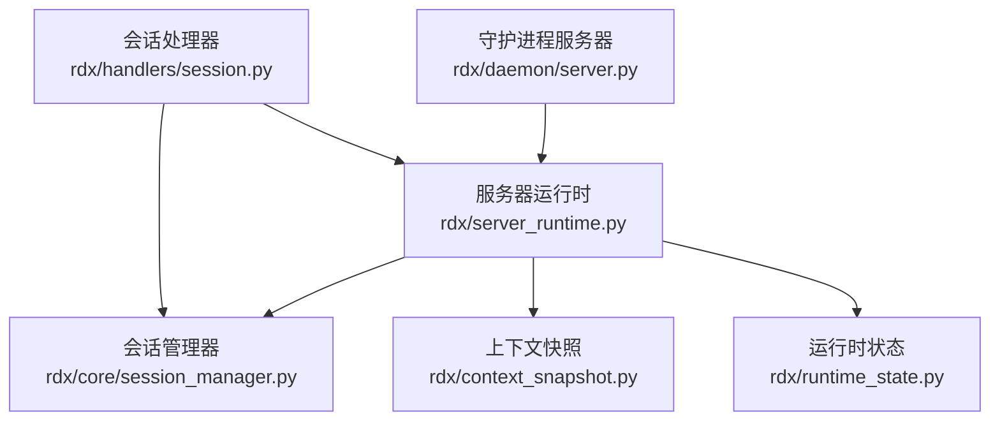
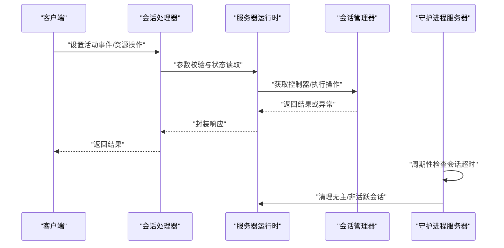
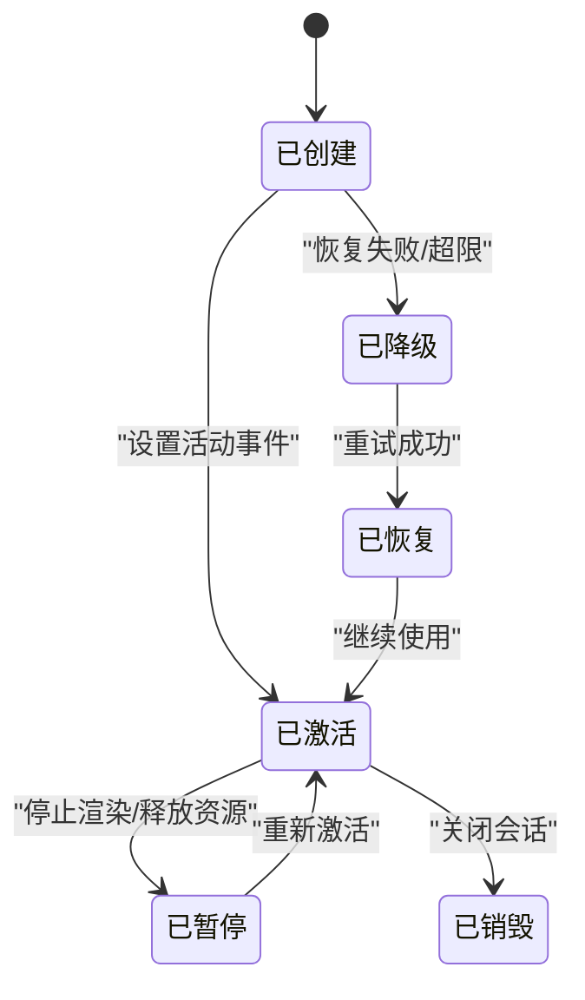
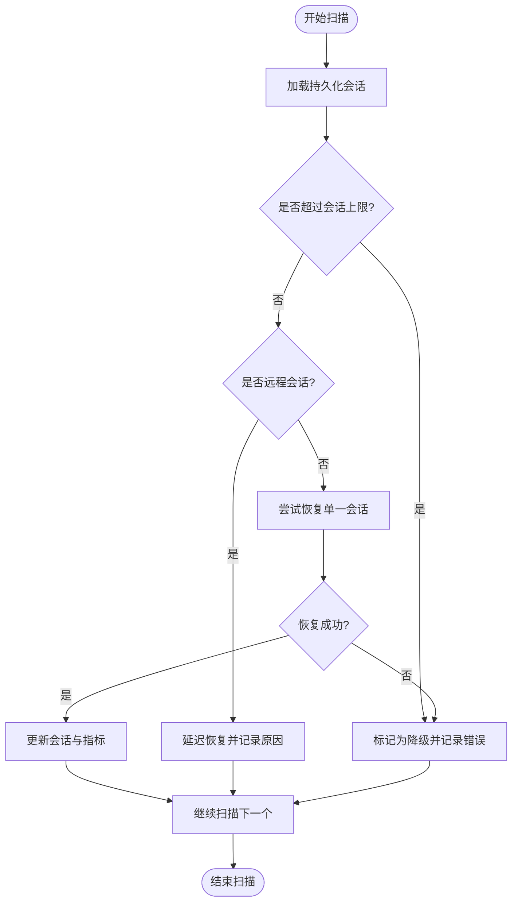
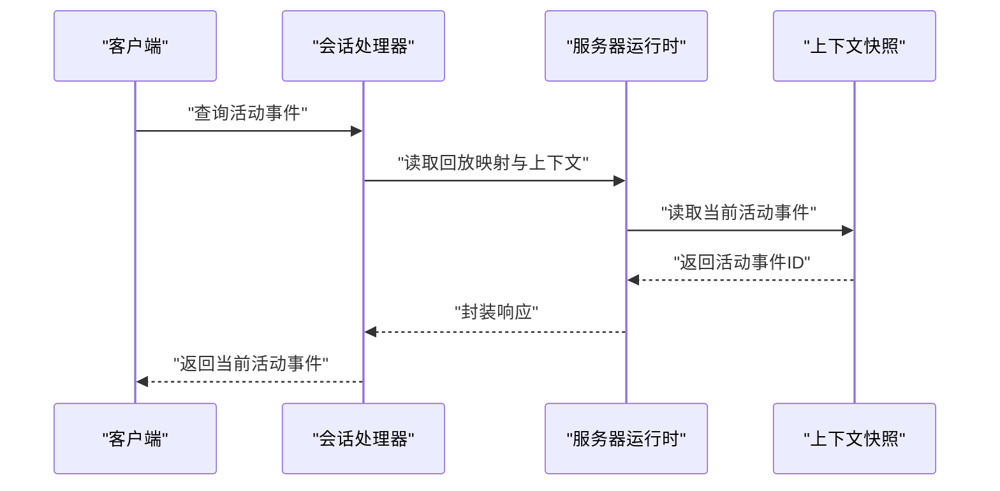
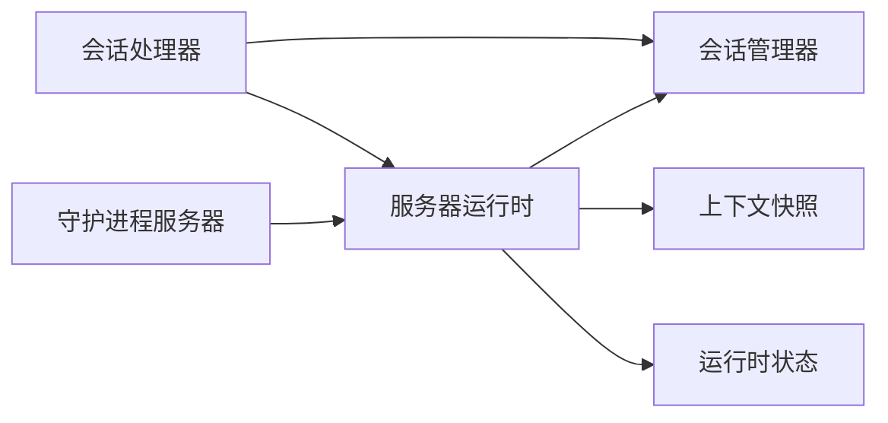

# 会话生命周期控制

<cite>
**本文引用的文件**
- [rdx/core/session_manager.py](file://rdx/core/session_manager.py)
- [rdx/handlers/session.py](file://rdx/handlers/session.py)
- [rdx/server_runtime.py](file://rdx/server_runtime.py)
- [rdx/daemon/server.py](file://rdx/daemon/server.py)
- [rdx/context_snapshot.py](file://rdx/context_snapshot.py)
- [rdx/runtime_state.py](file://rdx/runtime_state.py)
- [docs/session-model.md](file://docs/session-model.md)
- [tests/test_server_event_pipeline_resource.py](file://tests/test_server_event_pipeline_resource.py)
- [scripts/preview_geometry_smoke.py](file://scripts/preview_geometry_smoke.py)
</cite>

## 目录
1. [引言](#引言)
2. [项目结构](#项目结构)
3. [核心组件](#核心组件)
4. [架构总览](#架构总览)
5. [详细组件分析](#详细组件分析)
6. [依赖关系分析](#依赖关系分析)
7. [性能考量](#性能考量)
8. [故障排查指南](#故障排查指南)
9. [结论](#结论)
10. [附录](#附录)

## 引言
本文件系统性阐述会话生命周期控制，覆盖会话的创建、激活、暂停、恢复与销毁全流程；解释状态转换的触发条件与执行机制；说明会话超时处理、异常恢复与资源清理策略；给出会话状态查询接口与事件通知机制；并提供并发控制、锁机制与死锁预防建议及最佳实践。

## 项目结构
围绕会话生命周期的关键模块包括：
- 会话管理器：负责会话状态机与控制器交互
- 会话处理器：对外暴露会话相关操作接口
- 运行时与守护进程：承载会话运行期状态、请求计数与活动时间戳
- 上下文快照与运行时状态：持久化与恢复上下文中的会话信息
- 文档与测试：提供模型说明与行为验证

图表来源
- [rdx/core/session_manager.py](file://rdx/core/session_manager.py)
- [rdx/handlers/session.py](file://rdx/handlers/session.py)
- [rdx/server_runtime.py](file://rdx/server_runtime.py)
- [rdx/daemon/server.py](file://rdx/daemon/server.py)
- [rdx/context_snapshot.py](file://rdx/context_snapshot.py)
- [rdx/runtime_state.py](file://rdx/runtime_state.py)

章节来源
- [rdx/core/session_manager.py](file://rdx/core/session_manager.py)
- [rdx/handlers/session.py](file://rdx/handlers/session.py)
- [rdx/server_runtime.py](file://rdx/server_runtime.py)
- [rdx/daemon/server.py](file://rdx/daemon/server.py)
- [rdx/context_snapshot.py](file://rdx/context_snapshot.py)
- [rdx/runtime_state.py](file://rdx/runtime_state.py)

## 核心组件
- 会话管理器（Session Manager）
  - 负责会话状态机推进、控制器获取与操作分发
  - 提供关闭会话等关键能力
- 会话处理器（Session Handler）
  - 对外暴露会话操作接口（如设置活动事件、资源列表等）
  - 参数校验与错误返回
- 服务器运行时（Server Runtime）
  - 维护会话记录、回放映射、恢复与降级策略
  - 状态持久化与指标同步
- 守护进程服务器（Daemon Server）
  - 生命周期监控线程，负责超时检测与状态刷新
  - 请求计数与最后活跃时间维护
- 上下文快照与运行时状态
  - 将会话状态写入上下文并支持恢复
  - 规范化运行时指标与恢复元数据

章节来源
- [rdx/core/session_manager.py](file://rdx/core/session_manager.py)
- [rdx/handlers/session.py](file://rdx/handlers/session.py)
- [rdx/server_runtime.py](file://rdx/server_runtime.py)
- [rdx/daemon/server.py](file://rdx/daemon/server.py)
- [rdx/context_snapshot.py](file://rdx/context_snapshot.py)
- [rdx/runtime_state.py](file://rdx/runtime_state.py)

## 架构总览
会话生命周期由“处理器—运行时—管理器—守护进程”的链路协同完成。处理器接收外部调用，运行时负责状态持久化与恢复，管理器驱动控制器，守护进程负责超时与资源清理。

图表来源
- [rdx/handlers/session.py](file://rdx/handlers/session.py)
- [rdx/server_runtime.py](file://rdx/server_runtime.py)
- [rdx/core/session_manager.py](file://rdx/core/session_manager.py)
- [rdx/daemon/server.py](file://rdx/daemon/server.py)

## 详细组件分析

### 会话状态机与生命周期
- 创建
  - 通过会话处理器发起创建请求，运行时初始化会话记录并写入上下文
  - 记录会话类型（本地/远程）、后端、绑定捕获文件等
- 激活
  - 设置活动事件以激活特定帧/事件，更新回放映射与上下文快照
  - 验证事件存在性，不存在则返回错误而不修改状态
- 暂停
  - 可通过设置活动事件为非活动或释放会话资源实现暂停效果
- 恢复
  - 运行时扫描持久化会话，按策略尝试恢复；对远程会话可延迟恢复
  - 失败时标记为降级并记录错误，支持后续重试
- 销毁
  - 关闭会话并清理回放映射与远程租约
  - 更新会话状态为非存活，并同步上下文指标

图表来源
- [rdx/server_runtime.py](file://rdx/server_runtime.py)
- [rdx/handlers/session.py](file://rdx/handlers/session.py)

章节来源
- [rdx/server_runtime.py](file://rdx/server_runtime.py)
- [rdx/handlers/session.py](file://rdx/handlers/session.py)

### 会话超时处理与异常恢复
- 超时检测
  - 守护进程周期性检查会话最后活跃时间、拥有者进程状态与附加客户端数量
  - 当满足“拥有者进程不存在且无附加客户端且无活跃请求”时，判定可停止并清理
- 异常恢复
  - 运行时扫描持久化会话，逐个尝试恢复
  - 对远程会话可延迟恢复，避免不必要的连接开销
  - 失败场景记录降级状态与错误信息，支持后续重试

图表来源
- [rdx/server_runtime.py](file://rdx/server_runtime.py)
- [rdx/daemon/server.py](file://rdx/daemon/server.py)

章节来源
- [rdx/server_runtime.py](file://rdx/server_runtime.py)
- [rdx/daemon/server.py](file://rdx/daemon/server.py)

### 并发控制、锁机制与死锁预防
- 上下文级互斥
  - 使用线程锁保护不同上下文的状态访问，避免跨上下文竞争
- 死锁检测
  - Python标准库提供递归锁与阻塞图检测能力，用于识别潜在循环等待
- 建议
  - 在持有锁期间避免调用可能再次获取锁的外部回调
  - 采用统一入口序列化敏感路径，减少锁粒度争用

章节来源
- [rdx/context_snapshot.py](file://rdx/context_snapshot.py)

### 会话状态查询与事件通知
- 状态查询
  - 通过运行时状态与上下文快照查询当前会话状态、活动事件与绑定信息
- 事件通知
  - 会话处理器在设置活动事件前进行有效性校验，未找到事件时返回错误且不修改状态
  - 回放映射与上下文快照同步更新，确保查询一致性

图表来源
- [rdx/handlers/session.py](file://rdx/handlers/session.py)
- [rdx/server_runtime.py](file://rdx/server_runtime.py)
- [rdx/context_snapshot.py](file://rdx/context_snapshot.py)

章节来源
- [rdx/handlers/session.py](file://rdx/handlers/session.py)
- [rdx/server_runtime.py](file://rdx/server_runtime.py)
- [rdx/context_snapshot.py](file://rdx/context_snapshot.py)

### 资源清理策略
- 关闭会话
  - 清理回放映射与远程租约，标记会话为非存活
- 降级与恢复
  - 记录恢复尝试次数、最近扫描时间与错误详情，便于诊断与重试
- 指标同步
  - 同步上下文指标与快照，保证可观测性

章节来源
- [rdx/server_runtime.py](file://rdx/server_runtime.py)

## 依赖关系分析
- 会话处理器依赖会话管理器与服务器运行时
- 服务器运行时依赖会话管理器、上下文快照与运行时状态
- 守护进程服务器依赖服务器运行时以执行超时清理
- 测试与脚本验证事件设置的正确性与边界行为

图表来源
- [rdx/handlers/session.py](file://rdx/handlers/session.py)
- [rdx/core/session_manager.py](file://rdx/core/session_manager.py)
- [rdx/server_runtime.py](file://rdx/server_runtime.py)
- [rdx/context_snapshot.py](file://rdx/context_snapshot.py)
- [rdx/runtime_state.py](file://rdx/runtime_state.py)
- [rdx/daemon/server.py](file://rdx/daemon/server.py)

章节来源
- [rdx/handlers/session.py](file://rdx/handlers/session.py)
- [rdx/core/session_manager.py](file://rdx/core/session_manager.py)
- [rdx/server_runtime.py](file://rdx/server_runtime.py)
- [rdx/context_snapshot.py](file://rdx/context_snapshot.py)
- [rdx/runtime_state.py](file://rdx/runtime_state.py)
- [rdx/daemon/server.py](file://rdx/daemon/server.py)

## 性能考量
- 减少锁持有时间：仅在必要时进入临界区，尽快释放
- 批量扫描与增量更新：在恢复扫描中按需处理，避免全量重算
- 事件设置前置校验：尽早失败，避免无效操作
- 回放映射与索引缓存：降低重复查询成本

## 故障排查指南
- 事件未找到
  - 现象：设置活动事件返回“未找到”
  - 排查：确认事件ID是否存在、会话是否处于活动状态、回放映射是否正确
  - 参考测试用例验证前置校验逻辑
- 会话恢复失败
  - 现象：会话被标记为降级
  - 排查：查看恢复尝试次数、最近扫描时间与错误详情；确认是否超过会话上限或远程会话延迟恢复
- 超时清理
  - 现象：会话被自动清理
  - 排查：检查拥有者进程状态、附加客户端数量与活跃请求计数

章节来源
- [tests/test_server_event_pipeline_resource.py](file://tests/test_server_event_pipeline_resource.py)
- [rdx/server_runtime.py](file://rdx/server_runtime.py)
- [rdx/daemon/server.py](file://rdx/daemon/server.py)

## 结论
该系统通过处理器—运行时—管理器—守护进程的协作，实现了完整的会话生命周期管理。结合严格的事件校验、恢复扫描与超时清理，保障了稳定性与可观测性。建议在高并发场景下遵循锁最小化原则与统一入口序列化，持续优化事件设置与回放索引的性能。

## 附录
- 实际使用示例
  - 通过脚本批量跳转事件并记录活动事件ID，验证事件设置与查询
- 最佳实践
  - 在设置活动事件前先进行存在性校验
  - 控制会话数量，避免超出上限导致降级
  - 对远程会话采用延迟恢复策略，减少不必要的连接
  - 使用上下文快照与运行时状态进行状态查询与诊断

章节来源
- [scripts/preview_geometry_smoke.py](file://scripts/preview_geometry_smoke.py)
- [docs/session-model.md](file://docs/session-model.md)