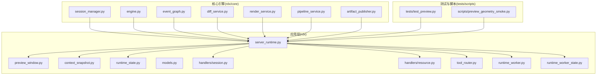
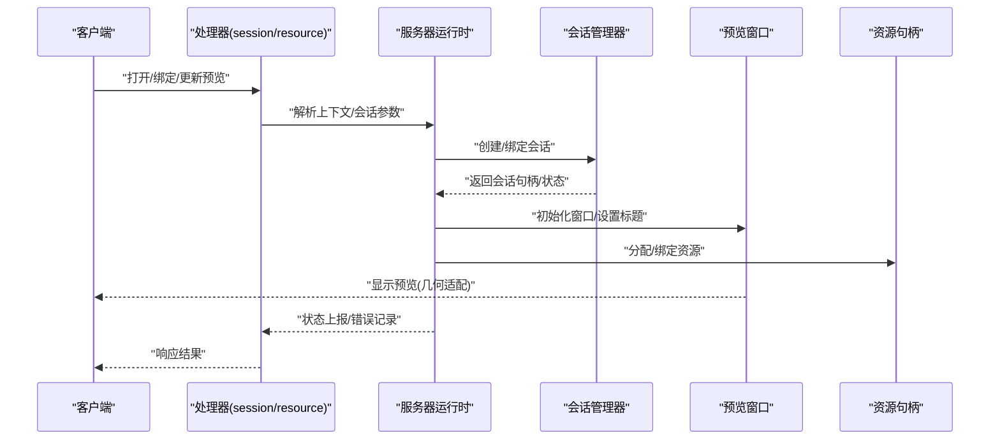
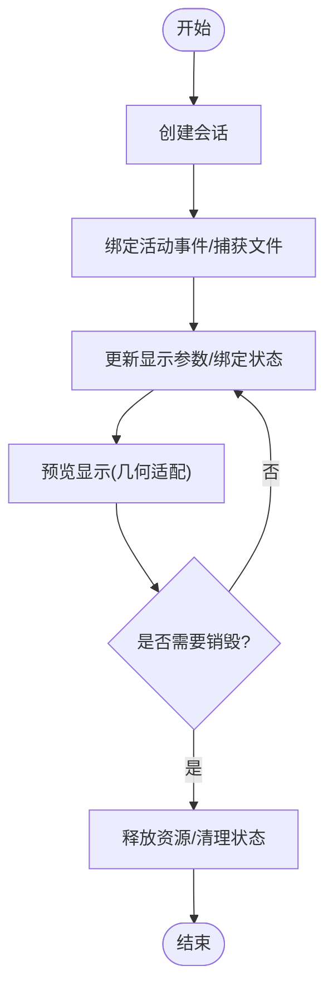
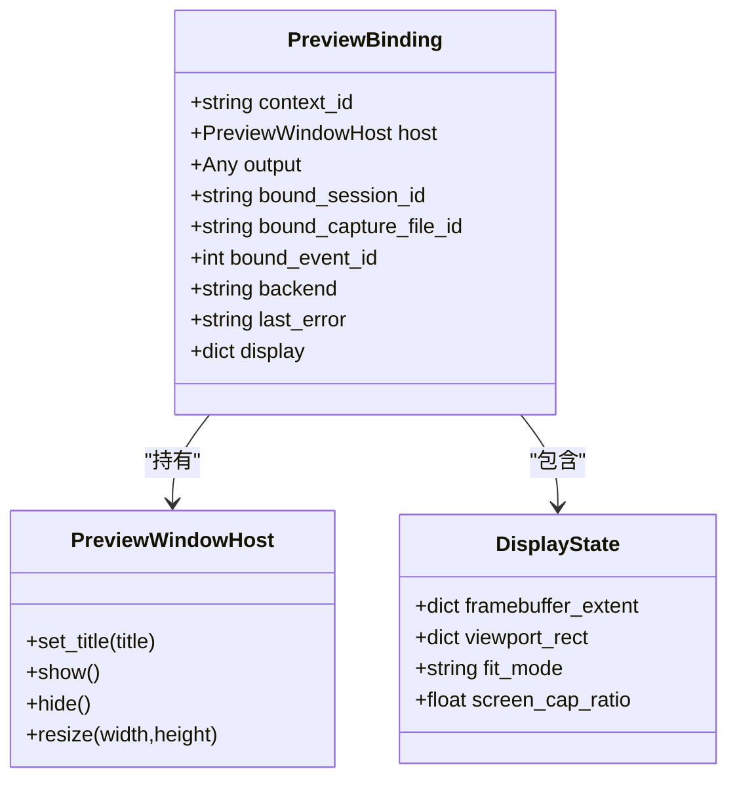
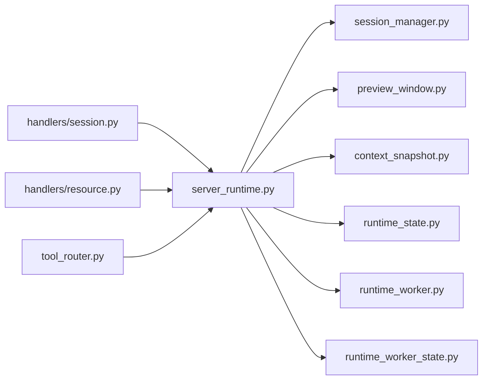

# 会话管理

<cite>
**本文引用的文件**
- [rdx/core/session_manager.py](file://rdx/core/session_manager.py)
- [rdx/preview_window.py](file://rdx/preview_window.py)
- [rdx/context_snapshot.py](file://rdx/context_snapshot.py)
- [rdx/runtime_state.py](file://rdx/runtime_state.py)
- [rdx/server_runtime.py](file://rdx/server_runtime.py)
- [rdx/models.py](file://rdx/models.py)
- [tests/test_preview.py](file://tests/test_preview.py)
- [docs/agent-model.md](file://docs/agent-model.md)
- [rdx/handlers/session.py](file://rdx/handlers/session.py)
- [rdx/handlers/resource.py](file://rdx/handlers/resource.py)
- [rdx/runtime_worker.py](file://rdx/runtime_worker.py)
- [rdx/runtime_worker_state.py](file://rdx/runtime_worker_state.py)
- [rdx/core/engine.py](file://rdx/core/engine.py)
- [rdx/core/event_graph.py](file://rdx/core/event_graph.py)
- [rdx/core/diff_service.py](file://rdx/core/diff_service.py)
- [rdx/core/render_service.py](file://rdx/core/render_service.py)
- [rdx/core/artifact_publisher.py](file://rdx/core/artifact_publisher.py)
- [rdx/core/pipeline_service.py](file://rdx/core/pipeline_service.py)
- [rdx/tool_router.py](file://rdx/tool_router.py)
- [rdx/daemon/client.py](file://rdx/daemon/client.py)
- [rdx/daemon/server.py](file://rdx/daemon/server.py)
- [rdx/daemon/worker.py](file://rdx/daemon/worker.py)
- [scripts/preview_geometry_smoke.py](file://scripts/preview_geometry_smoke.py)
- [intermediate/logs/preview_geometry_smoke_20260613_210524.json](file://intermediate/logs/preview_geometry_smoke_20260613_210524.json)
- [intermediate/logs/preview_geometry_smoke_20260613_210524.md](file://intermediate/logs/preview_geometry_smoke_20260613_210524.md)
</cite>

## 目录
1. [简介](#简介)
2. [项目结构](#项目结构)
3. [核心组件](#核心组件)
4. [架构总览](#架构总览)
5. [详细组件分析](#详细组件分析)
6. [依赖关系分析](#依赖关系分析)
7. [性能考量](#性能考量)
8. [故障排除指南](#故障排除指南)
9. [结论](#结论)
10. [附录](#附录)

## 简介
本文件面向“会话管理系统”的综合技术文档，聚焦以下目标：
- 上下文状态管理：会话级上下文快照与运行时状态的持久化与恢复。
- 会话生命周期控制：从创建、绑定、更新到销毁的全链路流程。
- 预览系统集成：预览窗口的打开、显示、几何适配与性能优化。
- 资源管理与并发控制：会话与预览绑定的资源分配、并发访问与状态同步。
- 查询、监控与调试：通过测试用例与日志工具定位问题。
- 实际使用示例与故障排除指引。

## 项目结构
该仓库围绕“会话”这一核心概念组织模块，主要目录与职责如下：
- rdx/core：核心引擎与服务（会话管理、事件图、渲染、差异等）。
- rdx：主应用层（服务器运行时、预览窗口、模型定义、处理器等）。
- tests：端到端与单元测试，覆盖预览、上下文快照与状态等。
- scripts：预览几何烟雾测试脚本与中间产物。
- docs：用户与集成文档，包含代理模型说明。
- intermediate：中间产物（日志、工件、运行时状态等）。

图表来源
- [rdx/core/session_manager.py](file://rdx/core/session_manager.py)
- [rdx/server_runtime.py](file://rdx/server_runtime.py)
- [rdx/preview_window.py](file://rdx/preview_window.py)
- [rdx/context_snapshot.py](file://rdx/context_snapshot.py)
- [rdx/runtime_state.py](file://rdx/runtime_state.py)
- [rdx/handlers/session.py](file://rdx/handlers/session.py)
- [rdx/handlers/resource.py](file://rdx/handlers/resource.py)
- [rdx/tool_router.py](file://rdx/tool_router.py)
- [rdx/runtime_worker.py](file://rdx/runtime_worker.py)
- [rdx/runtime_worker_state.py](file://rdx/runtime_worker_state.py)
- [tests/test_preview.py](file://tests/test_preview.py)
- [scripts/preview_geometry_smoke.py](file://scripts/preview_geometry_smoke.py)

章节来源
- [rdx/core/session_manager.py](file://rdx/core/session_manager.py)
- [rdx/server_runtime.py](file://rdx/server_runtime.py)
- [rdx/preview_window.py](file://rdx/preview_window.py)
- [rdx/context_snapshot.py](file://rdx/context_snapshot.py)
- [rdx/runtime_state.py](file://rdx/runtime_state.py)
- [rdx/handlers/session.py](file://rdx/handlers/session.py)
- [rdx/handlers/resource.py](file://rdx/handlers/resource.py)
- [rdx/tool_router.py](file://rdx/tool_router.py)
- [rdx/runtime_worker.py](file://rdx/runtime_worker.py)
- [rdx/runtime_worker_state.py](file://rdx/runtime_worker_state.py)
- [tests/test_preview.py](file://tests/test_preview.py)
- [scripts/preview_geometry_smoke.py](file://scripts/preview_geometry_smoke.py)

## 核心组件
- 会话管理器：负责会话的创建、绑定、状态变更与回收，协调资源句柄与后端。
- 服务器运行时：维护全局上下文快照、运行时状态、预览绑定、水合上下文集合与日志。
- 预览窗口：封装窗口宿主、显示几何参数与适配策略，支持帧缓冲区与视口矩形。
- 上下文快照与运行时状态：提供会话级快照加载/保存与默认值，支撑预览默认配置。
- 处理器与路由：会话与资源相关操作的入口，连接客户端请求与核心逻辑。
- 工作者与工作流：承载会话生命周期内的后台任务与状态同步。

章节来源
- [rdx/core/session_manager.py](file://rdx/core/session_manager.py)
- [rdx/server_runtime.py](file://rdx/server_runtime.py)
- [rdx/preview_window.py](file://rdx/preview_window.py)
- [rdx/context_snapshot.py](file://rdx/context_snapshot.py)
- [rdx/runtime_state.py](file://rdx/runtime_state.py)
- [rdx/handlers/session.py](file://rdx/handlers/session.py)
- [rdx/handlers/resource.py](file://rdx/handlers/resource.py)
- [rdx/tool_router.py](file://rdx/tool_router.py)
- [rdx/runtime_worker.py](file://rdx/runtime_worker.py)
- [rdx/runtime_worker_state.py](file://rdx/runtime_worker_state.py)

## 架构总览
会话管理贯穿“请求—处理—状态—显示—资源—回收”的闭环。客户端通过处理器发起会话操作，服务器运行时协调会话管理器与预览窗口，最终在宿主环境中呈现。

图表来源
- [rdx/handlers/session.py](file://rdx/handlers/session.py)
- [rdx/handlers/resource.py](file://rdx/handlers/resource.py)
- [rdx/server_runtime.py](file://rdx/server_runtime.py)
- [rdx/core/session_manager.py](file://rdx/core/session_manager.py)
- [rdx/preview_window.py](file://rdx/preview_window.py)

## 详细组件分析

### 会话生命周期与状态管理
- 生命周期阶段
  - 创建：由会话管理器生成会话句柄，建立与后端的连接或占位。
  - 绑定：将活动事件、捕获文件与会话关联，记录绑定信息与显示状态。
  - 更新：根据事件推进或外部指令更新绑定与显示参数。
  - 销毁：释放资源句柄、清理上下文快照与状态，并移除预览绑定。
- 状态存储
  - 上下文快照：用于持久化预览启用状态、视图模式、绑定会话/事件、显示几何等。
  - 运行时状态：用于临时存储屏幕截图比例、当前显示参数等。
- 并发与隔离
  - 每个上下文独立拥有快照与状态字典，避免跨上下文污染。
  - 预览绑定按上下文索引，确保同一时间仅存在一个活跃预览。

图表来源
- [rdx/core/session_manager.py](file://rdx/core/session_manager.py)
- [rdx/server_runtime.py](file://rdx/server_runtime.py)
- [rdx/context_snapshot.py](file://rdx/context_snapshot.py)
- [rdx/runtime_state.py](file://rdx/runtime_state.py)

章节来源
- [rdx/core/session_manager.py](file://rdx/core/session_manager.py)
- [rdx/server_runtime.py](file://rdx/server_runtime.py)
- [rdx/context_snapshot.py](file://rdx/context_snapshot.py)
- [rdx/runtime_state.py](file://rdx/runtime_state.py)

### 预览系统集成与显示机制
- 预览窗口宿主
  - 通过“预览窗口宿主”抽象与平台窗口交互，设置标题、尺寸与几何。
- 显示参数
  - 帧缓冲区尺寸、视口矩形、适配模式（如“不超过屏幕”）、屏幕截图比例等。
- 几何适配
  - 提供内容矩形适配与边界内尺寸限制的工具函数，保证预览在不同分辨率下的可读性。
- 性能优化
  - 使用“不超过屏幕”适配模式减少重绘开销；合理设置屏幕截图比例以平衡清晰度与带宽。

图表来源
- [rdx/server_runtime.py](file://rdx/server_runtime.py)
- [rdx/preview_window.py](file://rdx/preview_window.py)

章节来源
- [rdx/server_runtime.py](file://rdx/server_runtime.py)
- [rdx/preview_window.py](file://rdx/preview_window.py)
- [tests/test_preview.py](file://tests/test_preview.py)

### 会话状态查询、监控与调试
- 测试用例验证
  - 默认预览状态与显示参数断言，确保未启用时的默认行为一致。
  - 通过重置运行时状态，保证测试隔离与可重复性。
- 中间产物
  - 预览几何烟雾测试的日志与报告，便于定位显示异常。
- 文档参考
  - 代理模型文档指出预览显示为稳定的窗口与帧缓冲区几何表面，便于调试与观测。

章节来源
- [tests/test_preview.py](file://tests/test_preview.py)
- [intermediate/logs/preview_geometry_smoke_20260613_210524.json](file://intermediate/logs/preview_geometry_smoke_20260613_210524.json)
- [intermediate/logs/preview_geometry_smoke_20260613_210524.md](file://intermediate/logs/preview_geometry_smoke_20260613_210524.md)
- [docs/agent-model.md](file://docs/agent-model.md)

### 资源管理与并发控制
- 资源句柄
  - 会话管理器维护捕获文件、回放、远程连接等句柄字典，确保资源唯一性与可回收性。
- 并发与同步
  - 服务器运行时以字典与集合管理上下文状态与已水合上下文，避免竞态。
  - 预览绑定按上下文索引，防止多线程同时写入导致的状态错乱。
- 回收策略
  - 在会话销毁或预览解绑时，清理对应键值，释放底层资源。

章节来源
- [rdx/server_runtime.py](file://rdx/server_runtime.py)
- [rdx/core/session_manager.py](file://rdx/core/session_manager.py)

### 处理器与路由
- 会话处理器
  - 接收客户端请求，调用会话管理器执行具体动作，并返回结果。
- 资源处理器
  - 协调资源的分配、绑定与释放，确保与会话生命周期一致。
- 工具路由
  - 将请求分派至相应处理器或服务，统一入口与协议。

章节来源
- [rdx/handlers/session.py](file://rdx/handlers/session.py)
- [rdx/handlers/resource.py](file://rdx/handlers/resource.py)
- [rdx/tool_router.py](file://rdx/tool_router.py)

### 工作者与工作流
- 工作者
  - 承载后台任务，与服务器运行时协同进行状态同步与资源维护。
- 工作者状态
  - 记录工作者的运行状态与上下文，便于诊断与恢复。

章节来源
- [rdx/runtime_worker.py](file://rdx/runtime_worker.py)
- [rdx/runtime_worker_state.py](file://rdx/runtime_worker_state.py)

## 依赖关系分析
- 低耦合高内聚
  - 会话管理器专注于会话生命周期，服务器运行时集中管理状态与绑定，预览窗口专注显示。
- 关键依赖链
  - 处理器 → 服务器运行时 → 会话管理器/预览窗口 → 资源句柄。
- 循环依赖规避
  - 通过数据类与纯函数（如显示适配）降低循环依赖风险。

图表来源
- [rdx/handlers/session.py](file://rdx/handlers/session.py)
- [rdx/handlers/resource.py](file://rdx/handlers/resource.py)
- [rdx/server_runtime.py](file://rdx/server_runtime.py)
- [rdx/core/session_manager.py](file://rdx/core/session_manager.py)
- [rdx/preview_window.py](file://rdx/preview_window.py)
- [rdx/context_snapshot.py](file://rdx/context_snapshot.py)
- [rdx/runtime_state.py](file://rdx/runtime_state.py)
- [rdx/runtime_worker.py](file://rdx/runtime_worker.py)
- [rdx/runtime_worker_state.py](file://rdx/runtime_worker_state.py)
- [rdx/tool_router.py](file://rdx/tool_router.py)

章节来源
- [rdx/handlers/session.py](file://rdx/handlers/session.py)
- [rdx/handlers/resource.py](file://rdx/handlers/resource.py)
- [rdx/server_runtime.py](file://rdx/server_runtime.py)
- [rdx/core/session_manager.py](file://rdx/core/session_manager.py)
- [rdx/preview_window.py](file://rdx/preview_window.py)
- [rdx/context_snapshot.py](file://rdx/context_snapshot.py)
- [rdx/runtime_state.py](file://rdx/runtime_state.py)
- [rdx/runtime_worker.py](file://rdx/runtime_worker.py)
- [rdx/runtime_worker_state.py](file://rdx/runtime_worker_state.py)
- [rdx/tool_router.py](file://rdx/tool_router.py)

## 性能考量
- 显示适配
  - 使用“不超过屏幕”适配模式，避免超大尺寸带来的重绘与内存压力。
- 屏幕截图比例
  - 合理设置截图比例，在清晰度与网络/磁盘占用之间取得平衡。
- 资源复用
  - 预览绑定的重建计数用于识别会话切换或恢复场景，避免不必要的重建。
- 日志与中间产物
  - 利用烟雾测试日志快速定位性能退化点。

章节来源
- [rdx/server_runtime.py](file://rdx/server_runtime.py)
- [scripts/preview_geometry_smoke.py](file://scripts/preview_geometry_smoke.py)
- [intermediate/logs/preview_geometry_smoke_20260613_210524.json](file://intermediate/logs/preview_geometry_smoke_20260613_210524.json)
- [intermediate/logs/preview_geometry_smoke_20260613_210524.md](file://intermediate/logs/preview_geometry_smoke_20260613_210524.md)

## 故障排除指南
- 预览未显示或尺寸异常
  - 检查上下文快照与运行时状态中的显示参数，默认值与期望不符时需手动修正。
  - 使用烟雾测试日志比对几何参数变化，确认适配模式是否正确。
- 绑定状态不一致
  - 确认预览绑定的会话/事件ID与当前活动事件一致，必要时触发重新绑定并增加重建计数。
- 并发冲突
  - 避免多线程同时修改同一上下文的状态；利用测试用例的自动重置确保隔离。
- 资源泄漏
  - 在会话销毁或预览关闭后检查资源句柄是否被清理，确保键值从字典中移除。

章节来源
- [tests/test_preview.py](file://tests/test_preview.py)
- [rdx/server_runtime.py](file://rdx/server_runtime.py)
- [intermediate/logs/preview_geometry_smoke_20260613_210524.json](file://intermediate/logs/preview_geometry_smoke_20260613_210524.json)
- [intermediate/logs/preview_geometry_smoke_20260613_210524.md](file://intermediate/logs/preview_geometry_smoke_20260613_210524.md)

## 结论
本会话管理系统以“上下文—会话—预览—资源”为主线，实现了从创建到销毁的全生命周期管理，并通过上下文快照与运行时状态保障一致性与可观测性。预览系统采用稳定的显示表面与几何适配策略，结合测试与日志工具，能够高效定位与修复问题。建议在生产环境遵循资源回收与状态隔离的最佳实践，持续优化显示适配与性能参数。

## 附录
- 实际使用示例
  - 通过处理器打开预览并绑定当前会话与活动事件，随后观察显示参数与重建计数的变化。
- 参考文档
  - 代理模型文档强调预览显示为稳定的窗口与帧缓冲区几何表面，便于调试与观测。

章节来源
- [docs/agent-model.md](file://docs/agent-model.md)
- [tests/test_preview.py](file://tests/test_preview.py)