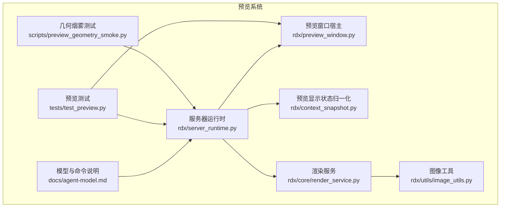
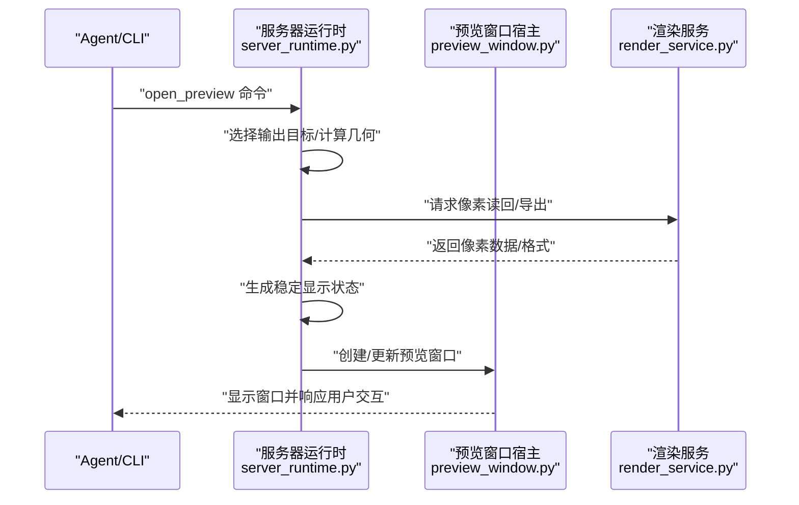
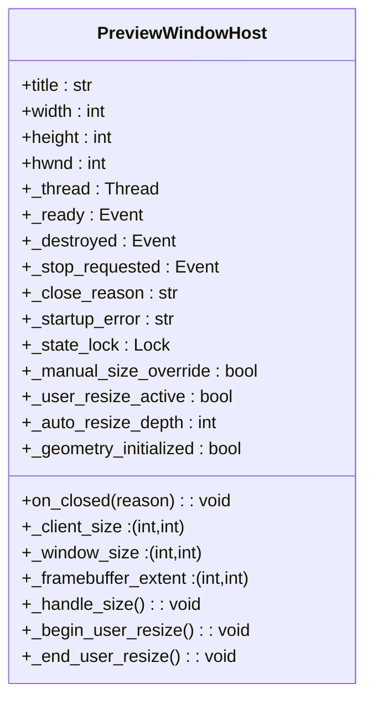
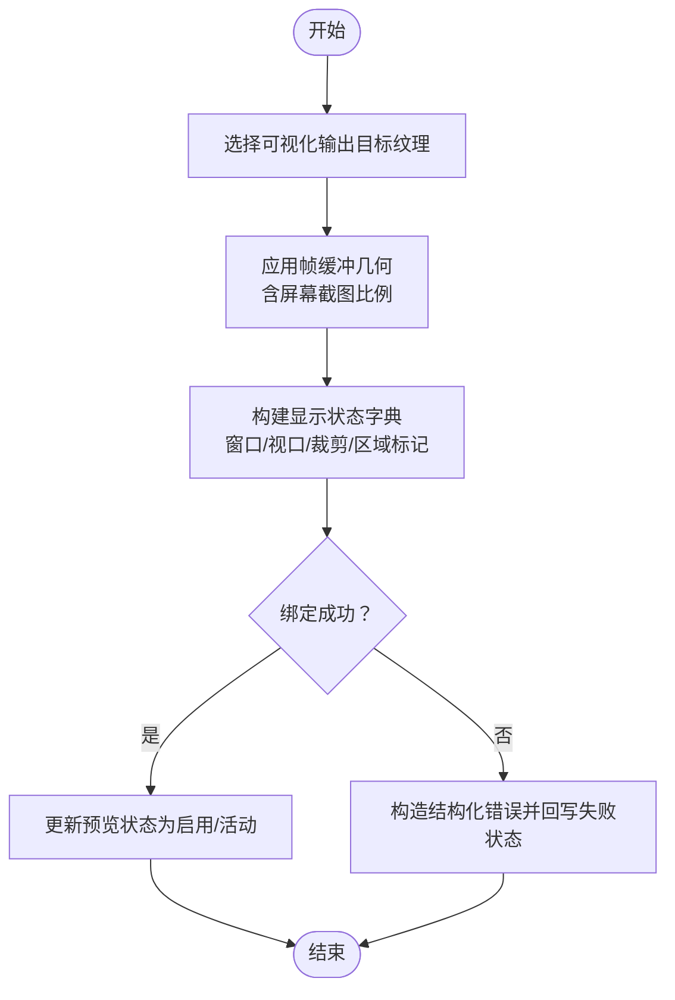
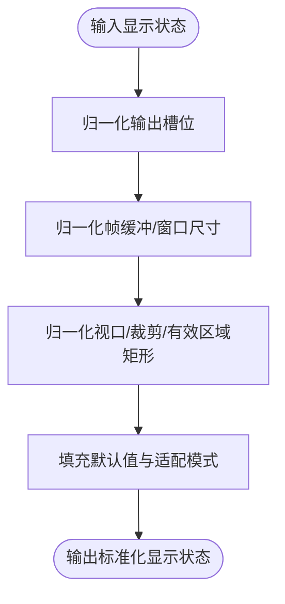
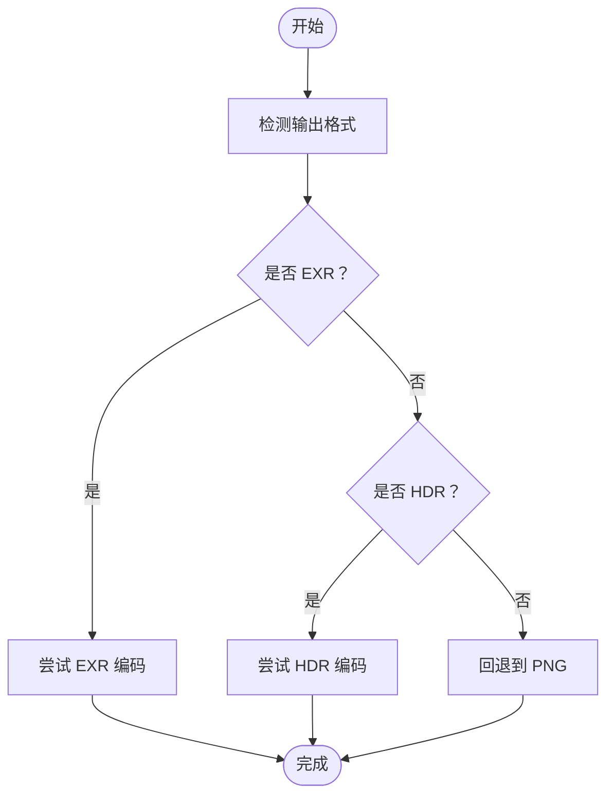
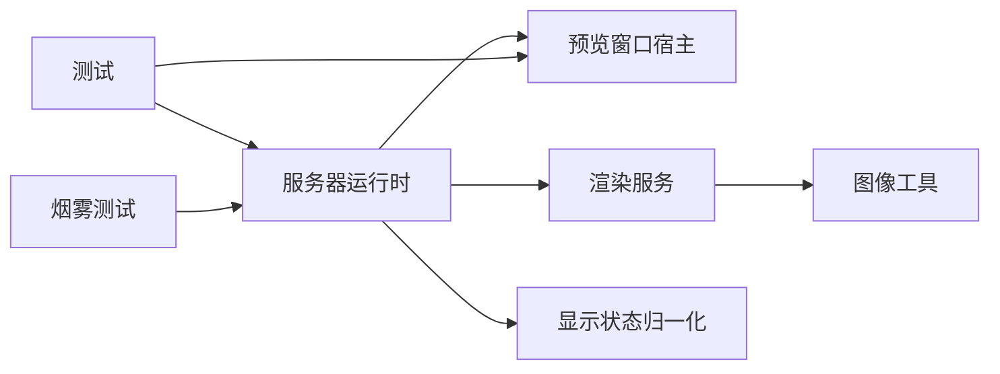

# 预览系统集成

<cite>
**本文引用的文件**
- [rdx/preview_window.py](file://rdx/preview_window.py)
- [rdx/server_runtime.py](file://rdx/server_runtime.py)
- [rdx/context_snapshot.py](file://rdx/context_snapshot.py)
- [rdx/core/render_service.py](file://rdx/core/render_service.py)
- [rdx/utils/image_utils.py](file://rdx/utils/image_utils.py)
- [tests/test_preview.py](file://tests/test_preview.py)
- [docs/agent-model.md](file://docs/agent-model.md)
- [scripts/preview_geometry_smoke.py](file://scripts/preview_geometry_smoke.py)
</cite>

## 目录
1. [简介](#简介)
2. [项目结构](#项目结构)
3. [核心组件](#核心组件)
4. [架构总览](#架构总览)
5. [详细组件分析](#详细组件分析)
6. [依赖关系分析](#依赖关系分析)
7. [性能考虑](#性能考虑)
8. [故障排除指南](#故障排除指南)
9. [结论](#结论)
10. [附录](#附录)

## 简介
本文件面向需要在 RDX 工作流中集成“预览系统”的工程师与测试人员，系统性阐述预览窗口的初始化、显示与更新机制；渲染服务与预览系统的交互协议；图像处理、格式转换与显示优化技术；以及事件处理、用户交互与响应机制。同时提供性能优化策略、缓存与内存管理建议、配置项与显示设置说明，并给出可操作的集成示例与排障指引。

## 项目结构
预览系统相关代码主要分布在以下模块：
- 预览窗口宿主与消息循环：[rdx/preview_window.py](file://rdx/preview_window.py)
- 服务器运行时与预览状态管理：[rdx/server_runtime.py](file://rdx/server_runtime.py)
- 预览显示状态归一化与默认值：[rdx/context_snapshot.py](file://rdx/context_snapshot.py)
- 渲染服务与像素导出/格式转换：[rdx/core/render_service.py](file://rdx/core/render_service.py)
- 图像工具与通用图像处理：[rdx/utils/image_utils.py](file://rdx/utils/image_utils.py)
- 集成测试与错误场景覆盖：[tests/test_preview.py](file://tests/test_preview.py)
- 模型与命令语义说明（CLI 打开预览）：[docs/agent-model.md](file://docs/agent-model.md)
- 几何烟雾测试脚本（几何一致性验证）：[scripts/preview_geometry_smoke.py](file://scripts/preview_geometry_smoke.py)

图表来源
- [rdx/preview_window.py](file://rdx/preview_window.py)
- [rdx/server_runtime.py](file://rdx/server_runtime.py)
- [rdx/context_snapshot.py](file://rdx/context_snapshot.py)
- [rdx/core/render_service.py](file://rdx/core/render_service.py)
- [rdx/utils/image_utils.py](file://rdx/utils/image_utils.py)
- [tests/test_preview.py](file://tests/test_preview.py)
- [docs/agent-model.md](file://docs/agent-model.md)
- [scripts/preview_geometry_smoke.py](file://scripts/preview_geometry_smoke.py)

章节来源
- [rdx/preview_window.py](file://rdx/preview_window.py)
- [rdx/server_runtime.py](file://rdx/server_runtime.py)
- [rdx/context_snapshot.py](file://rdx/context_snapshot.py)
- [rdx/core/render_service.py](file://rdx/core/render_service.py)
- [rdx/utils/image_utils.py](file://rdx/utils/image_utils.py)
- [tests/test_preview.py](file://tests/test_preview.py)
- [docs/agent-model.md](file://docs/agent-model.md)
- [scripts/preview_geometry_smoke.py](file://scripts/preview_geometry_smoke.py)

## 核心组件
- 预览窗口宿主（Windows 消息循环与尺寸变更处理）
  - 负责创建窗口、线程化消息泵、处理 WM_SIZE/WM_ENTERSIZEMOVE/WM_EXITSIZEMOVE 等消息，维护窗口与客户区尺寸、自动/手动尺寸切换、几何初始化标记等。
  - 关键接口与字段参见：[类定义与消息处理:192-219](file://rdx/preview_window.py#L192-L219)、[消息回调:180-189](file://rdx/preview_window.py#L180-L189)。

- 服务器运行时（预览绑定、显示状态生成、错误传播）
  - 负责选择输出目标纹理、计算帧缓冲几何、生成稳定显示状态（包含窗口矩形、视口、裁剪、有效区域、区域标记模式等），并在失败时返回结构化错误。
  - 关键流程参见：[_display_preview_binding:1992-2005](file://rdx/server_runtime.py#L1992-L2005)、[几何应用与显示状态封装:1972-1989](file://rdx/server_runtime.py#L1972-L1989)、[错误构造:1293-1313](file://rdx/server_runtime.py#L1293-L1313)。

- 预览显示状态归一化（标准化输入、默认值填充、类型校验）
  - 将来自不同来源的预览显示状态进行规范化，确保字段存在且类型正确，提供默认值以保证 UI 侧稳定呈现。
  - 参见：[状态归一化函数:99-123](file://rdx/context_snapshot.py#L99-L123)。

- 渲染服务（像素读回、格式转换、编码回退）
  - 提供头文件渲染、像素读回与检查、多格式导出能力（如 EXR/HDR/PNG 等），在不支持的格式或库缺失时进行安全回退。
  - 参见：[格式分支与回退逻辑:311-337](file://rdx/core/render_service.py#L311-L337)。

- 图像工具（通用图像处理）
  - 提供图像处理与转换的通用能力，作为渲染服务的补充或独立工具使用。
  - 参见：[图像工具模块](file://rdx/utils/image_utils.py)

- 测试与烟雾测试（行为验证与错误场景）
  - 单元测试覆盖预览打开失败、状态归一化、几何一致性等场景；烟雾测试用于验证几何稳定性。
  - 参见：[预览测试用例:163-192](file://tests/test_preview.py#L163-L192)、[几何烟雾测试](file://scripts/preview_geometry_smoke.py)

章节来源
- [rdx/preview_window.py:180-219](file://rdx/preview_window.py#L180-L219)
- [rdx/server_runtime.py:1293-1313](file://rdx/server_runtime.py#L1293-L1313)
- [rdx/server_runtime.py:1972-1989](file://rdx/server_runtime.py#L1972-L1989)
- [rdx/context_snapshot.py:99-123](file://rdx/context_snapshot.py#L99-L123)
- [rdx/core/render_service.py:311-337](file://rdx/core/render_service.py#L311-L337)
- [tests/test_preview.py:163-192](file://tests/test_preview.py#L163-L192)
- [scripts/preview_geometry_smoke.py](file://scripts/preview_geometry_smoke.py)

## 架构总览
下图展示从“CLI 打开预览”到“窗口显示与状态同步”的端到端流程，包括渲染服务参与的像素导出与格式转换环节。

图表来源
- [docs/agent-model.md:15-16](file://docs/agent-model.md#L15-L16)
- [rdx/server_runtime.py:1972-1989](file://rdx/server_runtime.py#L1972-L1989)
- [rdx/core/render_service.py:311-337](file://rdx/core/render_service.py#L311-L337)
- [rdx/preview_window.py:192-219](file://rdx/preview_window.py#L192-L219)

## 详细组件分析

### 预览窗口宿主（Windows）
- 初始化与生命周期
  - 在独立线程中创建窗口，使用消息泵处理尺寸变化与用户拖拽，通过事件信号控制就绪/销毁/停止。
  - 关键点：[构造与线程/事件成员:192-219](file://rdx/preview_window.py#L192-L219)、[消息回调入口:180-189](file://rdx/preview_window.py#L180-L189)。

- 用户交互与响应
  - 处理 WM_SIZE、WM_ENTERSIZEMOVE、WM_EXITSIZEMOVE，触发内部尺寸更新与自动/手动尺寸切换逻辑。
  - 关键点：[尺寸变更处理:183-188](file://rdx/preview_window.py#L183-L188)。

- 线程与同步
  - 使用锁保护状态，避免多线程竞态；通过事件通知外部关闭原因（用户/异常）。
  - 关键点：[状态锁与事件:212-218](file://rdx/preview_window.py#L212-L218)。

图表来源
- [rdx/preview_window.py:192-219](file://rdx/preview_window.py#L192-L219)

章节来源
- [rdx/preview_window.py:180-219](file://rdx/preview_window.py#L180-L219)

### 服务器运行时（预览绑定与显示状态）
- 绑定与几何计算
  - 选择可视化输出目标纹理，应用帧缓冲几何（含屏幕截图比例），生成稳定的显示状态字典，包含窗口矩形、视口、裁剪、有效区域与区域标记模式等。
  - 关键点：[几何应用与显示状态封装:1972-1989](file://rdx/server_runtime.py#L1972-L1989)、[绑定调用:1992-2005](file://rdx/server_runtime.py#L1992-L2005)。

- 错误处理与状态回写
  - 当绑定失败时构造结构化错误，更新预览状态为失败，保留最后错误信息以便诊断。
  - 关键点：[错误构造:1293-1313](file://rdx/server_runtime.py#L1293-L1313)、[失败回写:2286-2303](file://rdx/server_runtime.py#L2286-L2303)。

- 显示标题与上下文标识
  - 生成包含上下文 ID、后端、会话 ID、事件号、输出槽位、帧缓冲与窗口信息、区域标记模式的稳定标题，便于观察者定位。
  - 关键点：[标题拼接:1287-1290](file://rdx/server_runtime.py#L1287-L1290)。

图表来源
- [rdx/server_runtime.py:1972-1989](file://rdx/server_runtime.py#L1972-L1989)
- [rdx/server_runtime.py:1293-1313](file://rdx/server_runtime.py#L1293-L1313)
- [rdx/server_runtime.py:1287-1290](file://rdx/server_runtime.py#L1287-L1290)

章节来源
- [rdx/server_runtime.py:1287-1290](file://rdx/server_runtime.py#L1287-L1290)
- [rdx/server_runtime.py:1293-1313](file://rdx/server_runtime.py#L1293-L1313)
- [rdx/server_runtime.py:1972-1989](file://rdx/server_runtime.py#L1972-L1989)
- [rdx/server_runtime.py:1992-2005](file://rdx/server_runtime.py#L1992-L2005)

### 预览显示状态归一化
- 功能概述
  - 对传入的显示状态进行类型校验与默认值填充，确保字段完整性与类型一致性，支持输出槽位、纹理 ID/格式、帧缓冲/窗口尺寸、视口/裁剪/有效区域矩形、区域标记模式、适配模式等。
  - 关键点：[状态归一化:99-123](file://rdx/context_snapshot.py#L99-L123)。

图表来源
- [rdx/context_snapshot.py:99-123](file://rdx/context_snapshot.py#L99-L123)

章节来源
- [rdx/context_snapshot.py:99-123](file://rdx/context_snapshot.py#L99-L123)

### 渲染服务与图像处理/格式转换
- 像素导出与格式分支
  - 支持多种输出格式（如 EXR、HDR、PNG），在不满足条件或库不可用时进行安全回退至 PNG，并记录警告日志。
  - 关键点：[格式分支与回退:311-337](file://rdx/core/render_service.py#L311-L337)。

- 视图配置与显示控制
  - 支持通道重映射（黑/白场、倍数、HDR 限制）、Y 方向翻转、子资源选择等，用于导出前的像素视图调整。
  - 关键点：[视图配置:7898-7918](file://rdx/server_runtime.py#L7898-L7918)。

图表来源
- [rdx/core/render_service.py:311-337](file://rdx/core/render_service.py#L311-L337)

章节来源
- [rdx/core/render_service.py:311-337](file://rdx/core/render_service.py#L311-L337)
- [rdx/server_runtime.py:7898-7918](file://rdx/server_runtime.py#L7898-L7918)

### 事件处理、用户交互与响应机制
- Windows 消息驱动
  - 通过消息回调处理尺寸变化与用户拖拽，触发内部状态更新与自动/手动尺寸切换，保证窗口几何与帧缓冲几何的一致性。
  - 关键点：[消息处理:180-189](file://rdx/preview_window.py#L180-L189)、[尺寸变更:183-188](file://rdx/preview_window.py#L183-L188)。

- 与服务器运行时的协作
  - 运行时根据几何变化重新计算显示状态并更新窗口；窗口侧负责将用户交互（如手动调整大小）反馈给运行时。
  - 关键点：[显示状态生成:1972-1989](file://rdx/server_runtime.py#L1972-L1989)。

章节来源
- [rdx/preview_window.py:180-189](file://rdx/preview_window.py#L180-L189)
- [rdx/server_runtime.py:1972-1989](file://rdx/server_runtime.py#L1972-L1989)

### 集成示例与使用指导
- 打开预览窗口（CLI）
  - Agent 通过 CLI 命令触发“打开预览”，服务器运行时选择当前活动事件的目标纹理，应用帧缓冲几何，生成稳定显示状态并创建预览窗口。
  - 参考：[命令与稳定显示表面说明:15-16](file://docs/agent-model.md#L15-L16)、[绑定与显示状态:1972-1989](file://rdx/server_runtime.py#L1972-L1989)。

- 几何一致性验证（烟雾测试）
  - 使用烟雾测试脚本对预览几何进行稳定性验证，确保窗口与帧缓冲几何在多次刷新后保持一致。
  - 参考：[几何烟雾测试](file://scripts/preview_geometry_smoke.py)

章节来源
- [docs/agent-model.md:15-16](file://docs/agent-model.md#L15-L16)
- [rdx/server_runtime.py:1972-1989](file://rdx/server_runtime.py#L1972-L1989)
- [scripts/preview_geometry_smoke.py](file://scripts/preview_geometry_smoke.py)

## 依赖关系分析
- 组件耦合与职责边界
  - 预览窗口宿主专注于窗口生命周期与消息处理；服务器运行时负责状态计算与错误传播；渲染服务负责像素导出与格式转换；图像工具提供通用图像处理能力；测试与烟雾测试保障行为与几何稳定性。
- 外部依赖与集成点
  - 渲染服务依赖第三方图像库进行 EXR/HDR 编码；预览窗口依赖 Windows 消息机制；CLI 命令驱动服务器运行时执行预览打开流程。
- 循环依赖风险
  - 当前模块间为单向依赖（运行时 → 窗口/渲染/图像工具），未发现循环依赖迹象。

图表来源
- [rdx/server_runtime.py](file://rdx/server_runtime.py)
- [rdx/preview_window.py](file://rdx/preview_window.py)
- [rdx/core/render_service.py](file://rdx/core/render_service.py)
- [rdx/utils/image_utils.py](file://rdx/utils/image_utils.py)
- [tests/test_preview.py](file://tests/test_preview.py)
- [scripts/preview_geometry_smoke.py](file://scripts/preview_geometry_smoke.py)

章节来源
- [rdx/server_runtime.py](file://rdx/server_runtime.py)
- [rdx/preview_window.py](file://rdx/preview_window.py)
- [rdx/core/render_service.py](file://rdx/core/render_service.py)
- [rdx/utils/image_utils.py](file://rdx/utils/image_utils.py)
- [tests/test_preview.py](file://tests/test_preview.py)
- [scripts/preview_geometry_smoke.py](file://scripts/preview_geometry_smoke.py)

## 性能考虑
- 几何计算与状态更新
  - 仅在几何发生显著变化或强制刷新时重新计算显示状态，减少不必要的窗口重建与重绘。
  - 参考：[强制几何参数:1997-1998](file://rdx/server_runtime.py#L1997-L1998)。

- 图像导出与格式选择
  - 在可用时优先使用高保真格式（EXR/HDR），在不可用时快速回退 PNG，避免阻塞主线程；对大尺寸图像建议分块导出或降低采样率。
  - 参考：[格式分支与回退:311-337](file://rdx/core/render_service.py#L311-L337)。

- 窗口消息处理
  - 将耗时操作移出消息回调，仅做轻量状态更新；必要时采用异步队列与批处理，避免 UI 卡顿。
  - 参考：[消息处理入口:180-189](file://rdx/preview_window.py#L180-L189)。

- 内存与缓存
  - 避免重复分配临时缓冲；对频繁使用的纹理/图像进行缓存并设置容量上限；及时释放不再使用的资源。
  - 参考：[渲染服务导出与回退:311-337](file://rdx/core/render_service.py#L311-L337)。

[本节为通用性能建议，无需特定文件引用]

## 故障排除指南
- 打开预览失败
  - 现象：预览窗口创建失败，返回结构化错误。
  - 排查：检查上下文状态、会话有效性、输出目标纹理是否存在；查看最后错误信息与后端标识。
  - 参考：[错误构造:1293-1313](file://rdx/server_runtime.py#L1293-L1313)、[失败回写:2286-2303](file://rdx/server_runtime.py#L2286-L2303)、[测试用例:163-192](file://tests/test_preview.py#L163-L192)。

- 几何不一致或闪烁
  - 现象：窗口尺寸与帧缓冲尺寸不匹配，导致内容拉伸或闪烁。
  - 排查：确认几何应用逻辑与屏幕截图比例设置；验证用户手动调整大小后的自动/手动尺寸切换是否生效。
  - 参考：[几何应用:1972-1977](file://rdx/server_runtime.py#L1972-L1977)、[消息处理:180-189](file://rdx/preview_window.py#L180-L189)、[烟雾测试](file://scripts/preview_geometry_smoke.py)。

- 导出格式异常
  - 现象：导出为 PNG 或无输出。
  - 排查：检查第三方库是否可用；确认 remap 参数（黑/白场、倍数、HDR 限制）是否合理；查看日志警告。
  - 参考：[视图配置:7898-7918](file://rdx/server_runtime.py#L7898-L7918)、[格式分支:311-337](file://rdx/core/render_service.py#L311-L337)。

章节来源
- [rdx/server_runtime.py:1293-1313](file://rdx/server_runtime.py#L1293-L1313)
- [rdx/server_runtime.py:2286-2303](file://rdx/server_runtime.py#L2286-L2303)
- [tests/test_preview.py:163-192](file://tests/test_preview.py#L163-L192)
- [rdx/server_runtime.py:1972-1977](file://rdx/server_runtime.py#L1972-L1977)
- [rdx/preview_window.py:180-189](file://rdx/preview_window.py#L180-L189)
- [scripts/preview_geometry_smoke.py](file://scripts/preview_geometry_smoke.py)
- [rdx/server_runtime.py:7898-7918](file://rdx/server_runtime.py#L7898-L7918)
- [rdx/core/render_service.py:311-337](file://rdx/core/render_service.py#L311-L337)

## 结论
预览系统通过“服务器运行时 + 预览窗口宿主 + 渲染服务 + 图像工具”的协同，实现了从像素导出到窗口显示的完整链路。其关键优势在于：
- 稳定的显示状态与标题标识，便于观察者定位；
- 完善的错误处理与回退机制，提升鲁棒性；
- 可扩展的格式导出与视图配置，满足多样化需求；
- 基于消息驱动的窗口交互，保证响应性。

建议在集成时重点关注几何一致性、格式选择与回退策略、以及用户交互对状态更新的影响。

[本节为总结性内容，无需特定文件引用]

## 附录
- 配置选项与显示设置
  - 输出槽位、纹理 ID/格式、帧缓冲/窗口尺寸、视口/裁剪/有效区域、区域标记模式、适配模式等均由显示状态统一管理与归一化。
  - 参考：[显示状态归一化:99-123](file://rdx/context_snapshot.py#L99-L123)。

- CLI 与命令语义
  - Agent 通过 CLI 触发“打开预览”，服务器运行时据此生成稳定显示状态并创建窗口。
  - 参考：[命令说明:15-16](file://docs/agent-model.md#L15-L16)。

章节来源
- [rdx/context_snapshot.py:99-123](file://rdx/context_snapshot.py#L99-L123)
- [docs/agent-model.md:15-16](file://docs/agent-model.md#L15-L16)