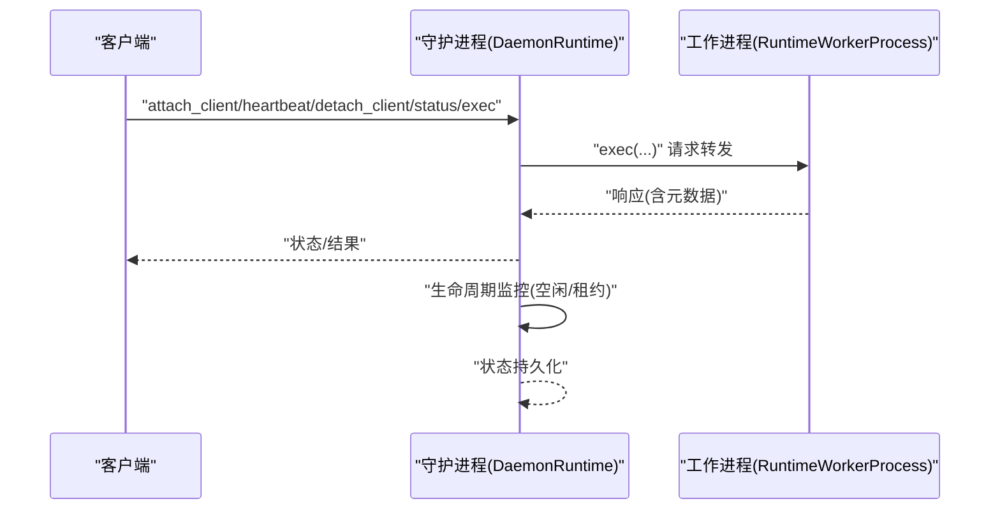
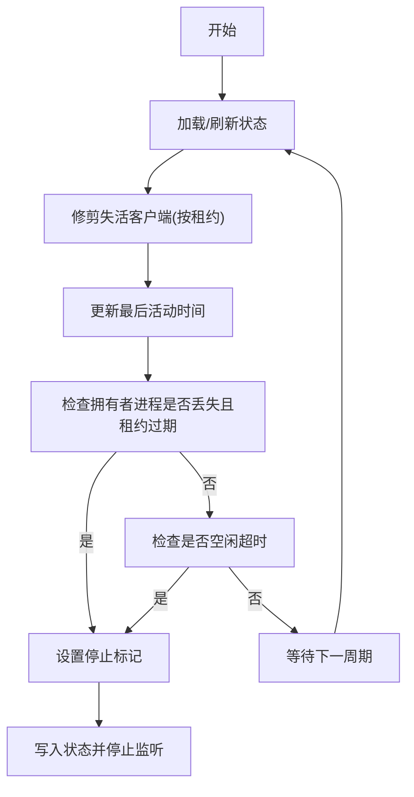
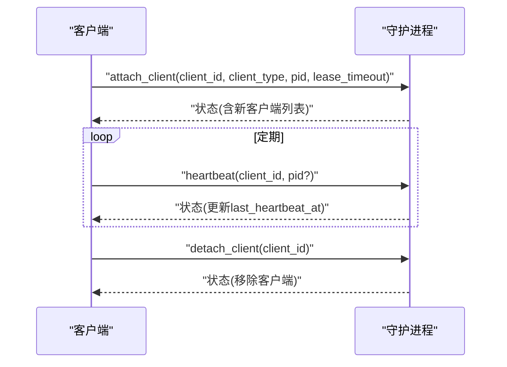
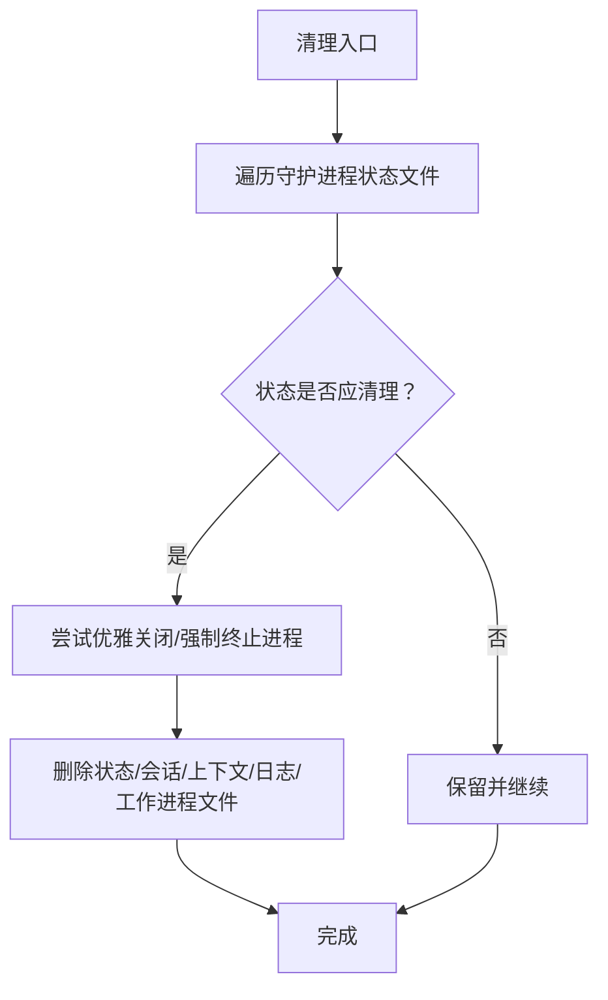
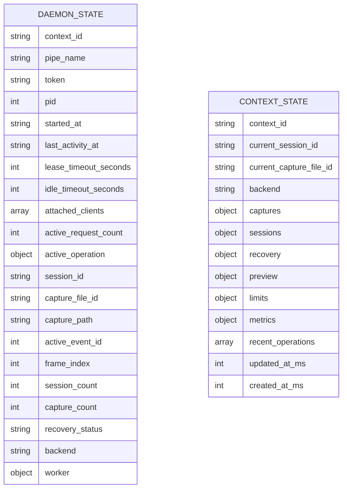
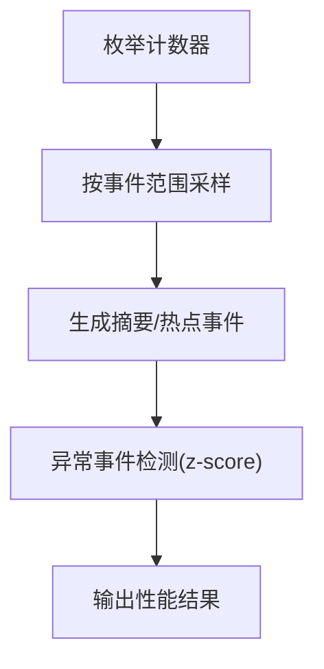
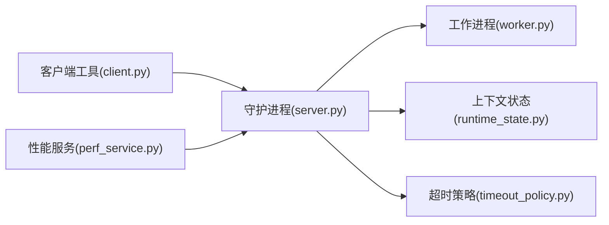

# 健康监控

<cite>
**本文引用的文件**
- [rdx/daemon/client.py](file://rdx/daemon/client.py)
- [rdx/daemon/server.py](file://rdx/daemon/server.py)
- [rdx/daemon/worker.py](file://rdx/daemon/worker.py)
- [rdx/runtime_state.py](file://rdx/runtime_state.py)
- [rdx/timeout_policy.py](file://rdx/timeout_policy.py)
- [rdx/core/perf_service.py](file://rdx/core/perf_service.py)
- [rdx/server_runtime.py](file://rdx/server_runtime.py)
- [tests/test_runtime_recovery_and_discovery.py](file://tests/test_runtime_recovery_and_discovery.py)
</cite>

## 目录
1. [引言](#引言)
2. [项目结构](#项目结构)
3. [核心组件](#核心组件)
4. [架构总览](#架构总览)
5. [详细组件分析](#详细组件分析)
6. [依赖分析](#依赖分析)
7. [性能考量](#性能考量)
8. [故障排查指南](#故障排查指南)
9. [结论](#结论)
10. [附录](#附录)

## 引言
本文件面向健康监控系统，聚焦守护进程的健康检查机制、状态报告与故障检测算法，覆盖心跳检测、超时判断与异常恢复策略；同时阐述客户端连接监控、租约管理与空闲超时处理；解释状态持久化、快照机制与恢复流程；并给出监控指标采集、告警机制与性能统计方法，以及自动化测试、监控仪表板与运维工具的实现要点。

## 项目结构
该仓库围绕“守护进程 + 工作进程 + 上下文状态”的三层结构组织健康监控相关代码：
- 守护进程通过命名管道提供服务，负责客户端接入、心跳维护、空闲/租约超时判定与生命周期关停。
- 工作进程承载具体渲染运行时任务，与守护进程通过标准输入输出进行请求/响应通信。
- 上下文状态持久化于本地 JSON 文件，记录会话、捕获、回收与指标等信息，支持快照与恢复。

```mermaid
graph TB
subgraph "客户端侧"
CLI["CLI/调用方"]
end
subgraph "守护进程"
DRT["DaemonRuntime<br/>状态/请求处理/生命周期"]
PIPE["Windows Named Pipe"]
end
subgraph "工作进程"
WRK["RuntimeWorkerProcess<br/>子进程/请求转发"]
end
subgraph "状态存储"
CS["runtime_state.json<br/>上下文状态"]
DS["daemon_state.json<br/>守护进程状态"]
end
CLI --> PIPE
PIPE --> DRT
DRT --> WRK
DRT <- --> CS
DRT <- --> DS
```

图示来源
- [rdx/daemon/server.py:101-174](file://rdx/daemon/server.py#L101-L174)
- [rdx/daemon/client.py:420-468](file://rdx/daemon/client.py#L420-L468)
- [rdx/daemon/worker.py:24-56](file://rdx/daemon/worker.py#L24-L56)
- [rdx/runtime_state.py:40-76](file://rdx/runtime_state.py#L40-L76)

章节来源
- [rdx/daemon/server.py:101-174](file://rdx/daemon/server.py#L101-L174)
- [rdx/daemon/client.py:420-468](file://rdx/daemon/client.py#L420-L468)
- [rdx/daemon/worker.py:24-56](file://rdx/daemon/worker.py#L24-L56)
- [rdx/runtime_state.py:40-76](file://rdx/runtime_state.py#L40-L76)

## 核心组件
- 客户端工具集：封装与守护进程交互的请求、心跳、附加/分离客户端、状态清理与过期清理等能力。
- 守护进程运行时：维护状态、处理请求、执行生命周期监控、与工作进程协作。
- 工作进程：启动/管理渲染运行时子进程，转发请求并返回结果。
- 上下文状态：持久化会话/捕获/回收/指标等数据，支持并发锁与原子写入。

章节来源
- [rdx/daemon/client.py:576-772](file://rdx/daemon/client.py#L576-L772)
- [rdx/daemon/server.py:101-174](file://rdx/daemon/server.py#L101-L174)
- [rdx/daemon/worker.py:24-56](file://rdx/daemon/worker.py#L24-L56)
- [rdx/runtime_state.py:388-417](file://rdx/runtime_state.py#L388-L417)

## 架构总览
健康监控的关键路径包括：
- 心跳与租约：客户端定期向守护进程发送心跳，守护进程根据租约超时剔除失活客户端。
- 空闲超时：若无活动且超过空闲阈值，守护进程自动关停。
- 生命周期关停：当所有客户端断开且无活跃请求，或拥有者进程丢失且租约过期，守护进程关停。
- 状态持久化：守护进程状态与上下文状态分别落盘，支持快照与恢复。
- 性能与异常检测：通过计数器采样与异常事件检测，辅助健康评估与告警。



图示来源
- [rdx/daemon/server.py:537-606](file://rdx/daemon/server.py#L537-L606)
- [rdx/daemon/worker.py:143-169](file://rdx/daemon/worker.py#L143-L169)
- [rdx/daemon/client.py:696-772](file://rdx/daemon/client.py#L696-L772)

## 详细组件分析

### 守护进程健康检查与生命周期
- 租约超时：每个附加客户端维护独立租约，若最后一次心跳时间距当前超过租约阈值，则视为失活并被剔除。
- 空闲超时：若无附加客户端且无活跃请求，且自上次活动以来超过空闲阈值，则关停。
- 拥有者进程失效：若拥有者进程不存在且租约已过期，同样关停。
- 状态持久化：每次状态变更均写回守护进程状态文件，确保重启后可恢复。



图示来源
- [rdx/daemon/server.py:179-210](file://rdx/daemon/server.py#L179-L210)
- [rdx/daemon/server.py:507-535](file://rdx/daemon/server.py#L507-L535)

章节来源
- [rdx/daemon/server.py:179-210](file://rdx/daemon/server.py#L179-L210)
- [rdx/daemon/server.py:507-535](file://rdx/daemon/server.py#L507-L535)

### 客户端连接监控与租约管理
- 附加客户端：守护进程接收附加请求，记录客户端标识、类型、进程号、附加时间与心跳时间，并应用租约超时。
- 心跳更新：守护进程收到心跳请求后，更新对应客户端的最后心跳时间并持久化。
- 分离客户端：移除指定客户端，更新最后活动时间。
- 失活判定：客户端进程不存在或心跳超租约即视为失活，生命周期监控阶段会将其剔除。



图示来源
- [rdx/daemon/server.py:365-425](file://rdx/daemon/server.py#L365-L425)
- [rdx/daemon/server.py:390-414](file://rdx/daemon/server.py#L390-L414)
- [rdx/daemon/server.py:416-425](file://rdx/daemon/server.py#L416-L425)

章节来源
- [rdx/daemon/server.py:365-425](file://rdx/daemon/server.py#L365-L425)
- [rdx/daemon/server.py:390-414](file://rdx/daemon/server.py#L390-L414)
- [rdx/daemon/server.py:416-425](file://rdx/daemon/server.py#L416-L425)

### 空闲超时与异常恢复策略
- 空闲关停：在无客户端且无活跃请求的情况下，依据空闲阈值关停守护进程，避免资源浪费。
- 异常恢复：当守护进程状态文件或工作进程状态异常时，客户端工具提供清理与重启能力，确保系统回到一致态。
- 过期清理：扫描并清理陈旧守护进程状态、会话状态与孤儿上下文文件，必要时强制终止相关进程。



图示来源
- [rdx/daemon/client.py:507-559](file://rdx/daemon/client.py#L507-L559)

章节来源
- [rdx/daemon/client.py:507-559](file://rdx/daemon/client.py#L507-L559)

### 状态持久化、快照与恢复
- 守护进程状态：包含上下文、管道名、令牌、进程ID、最后活动时间、租约/空闲超时、附加客户端列表、活跃请求数、活动操作、会话/捕获信息、回收状态与后端类型等。
- 上下文状态：包含会话/捕获记录、回收元数据、预览状态、限制、最近操作与指标等；支持并发锁与原子写入。
- 快照与恢复：守护进程在状态快照中同步上下文状态，恢复流程中对会话/捕获进行一致性校验与状态修复。



图示来源
- [rdx/daemon/server.py:127-157](file://rdx/daemon/server.py#L127-L157)
- [rdx/runtime_state.py:104-149](file://rdx/runtime_state.py#L104-L149)

章节来源
- [rdx/daemon/server.py:127-157](file://rdx/daemon/server.py#L127-L157)
- [rdx/runtime_state.py:104-149](file://rdx/runtime_state.py#L104-L149)
- [rdx/server_runtime.py:1154-1180](file://rdx/server_runtime.py#L1154-L1180)
- [rdx/server_runtime.py:5588-5667](file://rdx/server_runtime.py#L5588-L5667)

### 监控指标采集、告警与性能统计
- 计数器枚举与采样：通过性能服务枚举可用计数器并按事件范围采样，计算摘要与热点事件。
- 异常检测：基于 z-score 统计识别异常事件，辅助定位性能异常。
- 指标聚合：对操作耗时进行统计汇总，用于趋势分析与告警阈值设定。



图示来源
- [rdx/core/perf_service.py:236-264](file://rdx/core/perf_service.py#L236-L264)
- [rdx/core/perf_service.py:270-445](file://rdx/core/perf_service.py#L270-L445)

章节来源
- [rdx/core/perf_service.py:236-264](file://rdx/core/perf_service.py#L236-L264)
- [rdx/core/perf_service.py:270-445](file://rdx/core/perf_service.py#L270-L445)
- [rdx/runtime_state.py:475-500](file://rdx/runtime_state.py#L475-L500)

### 自动化测试与运维工具
- 自动化测试：覆盖运行时恢复与发现流程，验证会话/捕获状态恢复、降级与延迟恢复逻辑。
- 运维工具：提供守护进程启动/停止、客户端附加/心跳/分离、上下文清理与过期状态清理等命令式接口。

章节来源
- [tests/test_runtime_recovery_and_discovery.py:1-36](file://tests/test_runtime_recovery_and_discovery.py#L1-L36)
- [rdx/daemon/client.py:576-772](file://rdx/daemon/client.py#L576-L772)

## 依赖分析
- 客户端工具依赖守护进程状态文件与命名管道地址，通过认证令牌进行请求。
- 守护进程依赖上下文状态文件与工作进程，负责请求分发与生命周期管理。
- 工作进程依赖运行时二进制与模块目录，通过标准输入输出与守护进程通信。
- 超时策略为不同操作提供统一的超时计算规则，保障请求/响应与工作进程执行的稳定性。



图示来源
- [rdx/daemon/client.py:420-468](file://rdx/daemon/client.py#L420-L468)
- [rdx/daemon/server.py:101-174](file://rdx/daemon/server.py#L101-L174)
- [rdx/daemon/worker.py:24-56](file://rdx/daemon/worker.py#L24-L56)
- [rdx/runtime_state.py:40-76](file://rdx/runtime_state.py#L40-L76)
- [rdx/timeout_policy.py:56-103](file://rdx/timeout_policy.py#L56-L103)
- [rdx/core/perf_service.py:236-264](file://rdx/core/perf_service.py#L236-L264)

章节来源
- [rdx/daemon/client.py:420-468](file://rdx/daemon/client.py#L420-L468)
- [rdx/daemon/server.py:101-174](file://rdx/daemon/server.py#L101-L174)
- [rdx/daemon/worker.py:24-56](file://rdx/daemon/worker.py#L24-L56)
- [rdx/runtime_state.py:40-76](file://rdx/runtime_state.py#L40-L76)
- [rdx/timeout_policy.py:56-103](file://rdx/timeout_policy.py#L56-L103)
- [rdx/core/perf_service.py:236-264](file://rdx/core/perf_service.py#L236-L264)

## 性能考量
- 心跳频率与租约超时需平衡实时性与系统负载；建议根据业务场景调整默认租约与空闲阈值。
- 生命周期监控线程周期性检查，避免频繁 IO；可通过合理的时间步长降低 CPU 占用。
- 工作进程请求超时与重试策略需结合操作复杂度与网络状况，防止阻塞影响整体吞吐。
- 指标采样与异常检测应限定事件范围与计数器集合，减少计算开销。

## 故障排查指南
- 守护进程无响应：检查命名管道地址与令牌是否正确，确认守护进程状态文件是否存在且可读。
- 客户端无法心跳：确认客户端进程存在且心跳参数正确；查看租约超时是否过短导致误判。
- 空闲关停频繁：检查是否有活跃请求或客户端未正确分离；适当提高空闲阈值以避免误关停。
- 过期状态清理：使用清理工具扫描并删除陈旧状态文件与孤儿上下文，必要时强制终止相关进程。
- 性能异常：启用计数器采样与异常事件检测，结合最近操作与指标进行根因分析。

章节来源
- [rdx/daemon/client.py:420-468](file://rdx/daemon/client.py#L420-L468)
- [rdx/daemon/server.py:507-535](file://rdx/daemon/server.py#L507-L535)
- [rdx/core/perf_service.py:414-432](file://rdx/core/perf_service.py#L414-L432)

## 结论
该健康监控体系通过“心跳+租约+空闲超时”的组合策略，配合状态持久化与生命周期管理，实现了对守护进程与工作进程的稳健控制。结合性能指标采集与异常检测，能够有效支撑自动化测试与运维工具，提升系统的可观测性与可恢复性。

## 附录
- 配置项与默认值：租约超时、空闲超时、请求超时等参数可在客户端与守护进程初始化时配置。
- 监控仪表板：可基于上下文状态中的指标与最近操作，构建可视化面板展示会话/捕获状态与回收进度。
- 告警机制：基于租约/空闲超时、异常事件检测与指标阈值，建立分级告警策略。