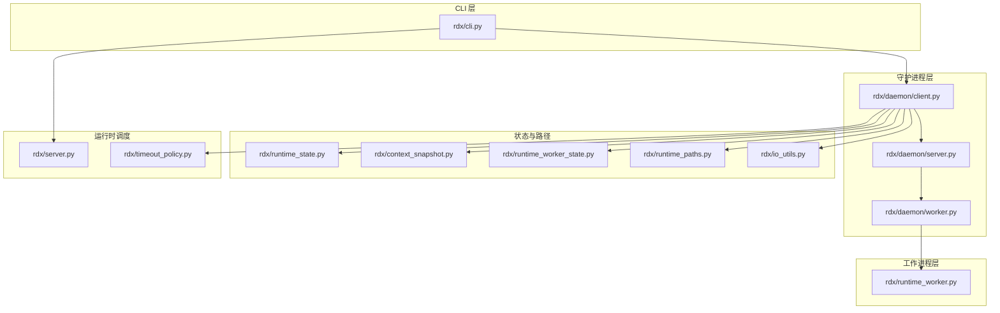
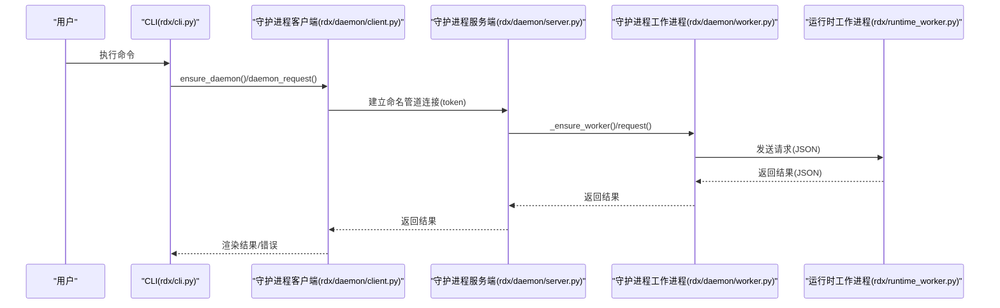
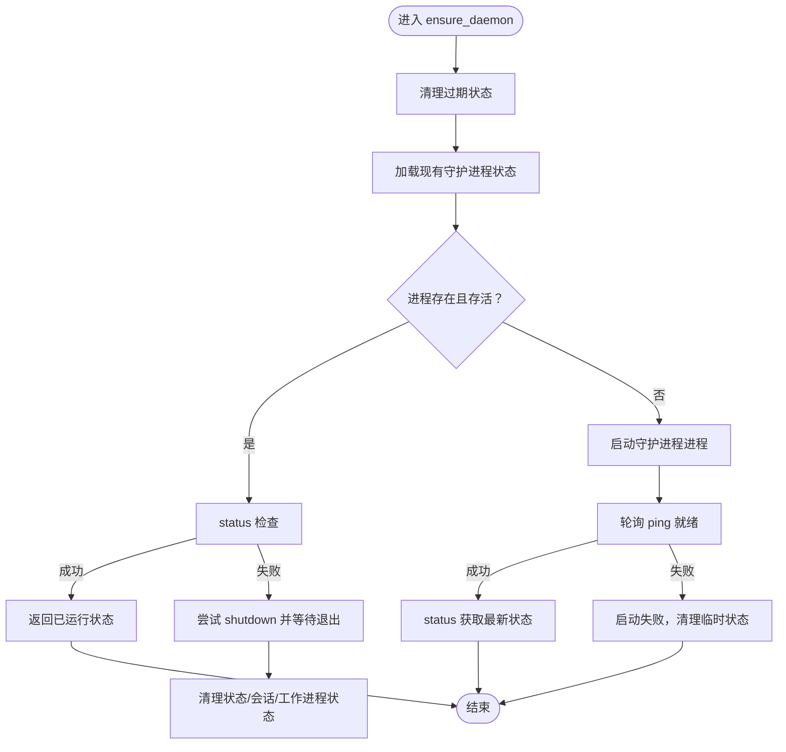
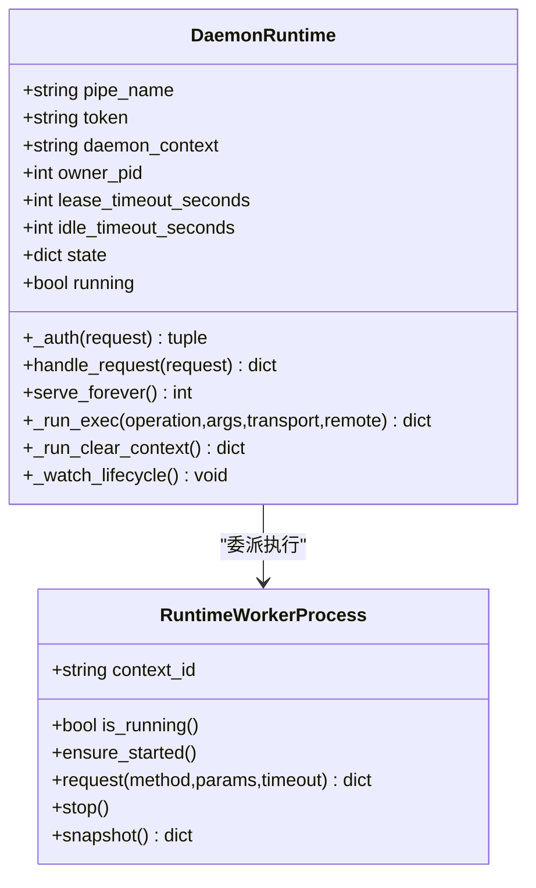
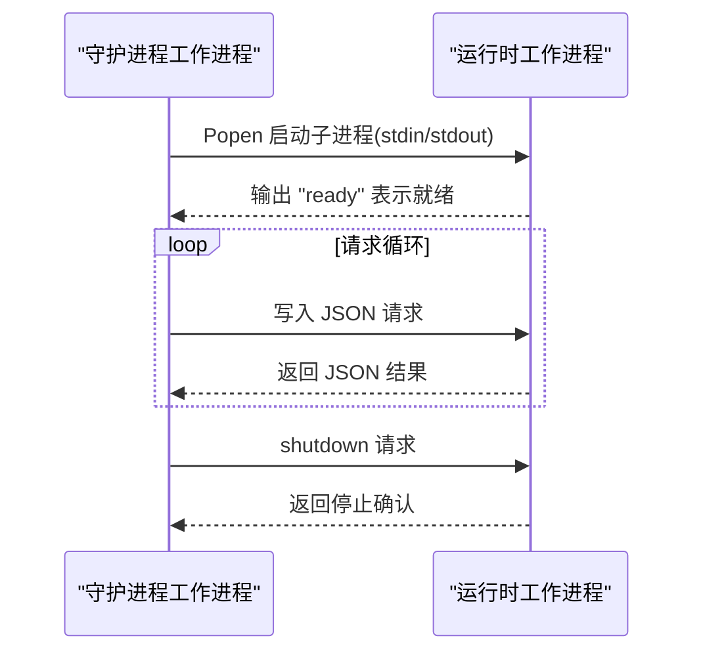
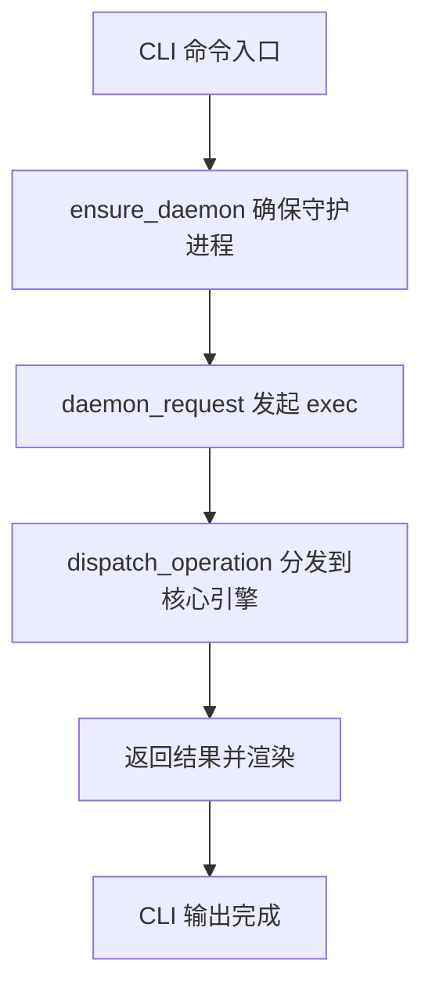
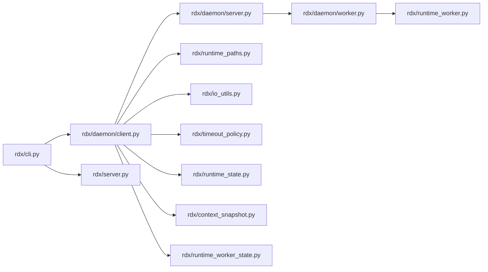

# 守护进程架构

<cite>
**本文档引用的文件**
- [rdx/daemon/client.py](file://rdx/daemon/client.py)
- [rdx/daemon/server.py](file://rdx/daemon/server.py)
- [rdx/daemon/worker.py](file://rdx/daemon/worker.py)
- [rdx/runtime_worker.py](file://rdx/runtime_worker.py)
- [rdx/cli.py](file://rdx/cli.py)
- [rdx/runtime_state.py](file://rdx/runtime_state.py)
- [rdx/context_snapshot.py](file://rdx/context_snapshot.py)
- [rdx/runtime_worker_state.py](file://rdx/runtime_worker_state.py)
- [rdx/timeout_policy.py](file://rdx/timeout_policy.py)
- [rdx/runtime_paths.py](file://rdx/runtime_paths.py)
- [rdx/io_utils.py](file://rdx/io_utils.py)
- [rdx/server.py](file://rdx/server.py)
- [tests/test_daemon_client.py](file://tests/test_daemon_client.py)
- [tests/test_runtime_worker.py](file://tests/test_runtime_worker.py)
</cite>

## 目录
1. [引言](#引言)
2. [项目结构](#项目结构)
3. [核心组件](#核心组件)
4. [架构总览](#架构总览)
5. [详细组件分析](#详细组件分析)
6. [依赖关系分析](#依赖关系分析)
7. [性能考量](#性能考量)
8. [故障排除指南](#故障排除指南)
9. [结论](#结论)
10. [附录](#附录)

## 引言
本技术文档系统化阐述守护进程架构的设计与实现，覆盖进程管理、通信机制、故障恢复、自动启动与重启策略、资源管理、监控与调试方法，以及高可用性与性能优化要点。该架构以 Windows 命名管道为 IPC 通道，结合守护进程（Daemon）与专用工作进程（Worker），在 CLI 调用时通过守护进程统一调度与状态持久化，确保跨会话、跨工具调用的一致性与可靠性。

## 项目结构
该项目采用“分层+功能模块”组织方式：
- 守护进程层：负责生命周期管理、客户端连接、状态持久化、超时与租约控制
- 工作进程层：承载实际运行时操作，通过标准输入输出进行请求/响应交互
- CLI 层：面向用户的命令入口，封装守护进程调用与结果渲染
- 状态与路径：提供上下文状态、快照、日志与工作目录的统一管理
- 工具与策略：超时策略、原子写入、路径解析等基础设施

图表来源
- [rdx/cli.py:1-800](file://rdx/cli.py#L1-L800)
- [rdx/daemon/client.py:1-833](file://rdx/daemon/client.py#L1-L833)
- [rdx/daemon/server.py:1-690](file://rdx/daemon/server.py#L1-L690)
- [rdx/daemon/worker.py:1-202](file://rdx/daemon/worker.py#L1-L202)
- [rdx/runtime_worker.py:1-119](file://rdx/runtime_worker.py#L1-L119)
- [rdx/runtime_state.py:1-500](file://rdx/runtime_state.py#L1-L500)
- [rdx/context_snapshot.py:1-541](file://rdx/context_snapshot.py#L1-L541)
- [rdx/runtime_worker_state.py:1-56](file://rdx/runtime_worker_state.py#L1-L56)
- [rdx/runtime_paths.py:1-122](file://rdx/runtime_paths.py#L1-L122)
- [rdx/io_utils.py:1-161](file://rdx/io_utils.py#L1-L161)
- [rdx/server.py:1-148](file://rdx/server.py#L1-L148)
- [rdx/timeout_policy.py:1-104](file://rdx/timeout_policy.py#L1-L104)

章节来源
- [rdx/daemon/client.py:1-833](file://rdx/daemon/client.py#L1-L833)
- [rdx/daemon/server.py:1-690](file://rdx/daemon/server.py#L1-L690)
- [rdx/daemon/worker.py:1-202](file://rdx/daemon/worker.py#L1-L202)
- [rdx/runtime_worker.py:1-119](file://rdx/runtime_worker.py#L1-L119)
- [rdx/cli.py:1-800](file://rdx/cli.py#L1-L800)
- [rdx/runtime_state.py:1-500](file://rdx/runtime_state.py#L1-L500)
- [rdx/context_snapshot.py:1-541](file://rdx/context_snapshot.py#L1-L541)
- [rdx/runtime_worker_state.py:1-56](file://rdx/runtime_worker_state.py#L1-L56)
- [rdx/runtime_paths.py:1-122](file://rdx/runtime_paths.py#L1-L122)
- [rdx/io_utils.py:1-161](file://rdx/io_utils.py#L1-L161)
- [rdx/server.py:1-148](file://rdx/server.py#L1-L148)
- [rdx/timeout_policy.py:1-104](file://rdx/timeout_policy.py#L1-L104)

## 核心组件
- 守护进程客户端（Daemon Client）
  - 提供守护进程启动、状态查询、请求转发、客户端注册/心跳/离线清理、过期状态清理等能力
  - 使用命名管道地址与令牌进行认证与通信
- 守护进程服务端（Daemon Server）
  - 基于命名管道监听连接，维护守护进程状态、客户端租约、空闲/租约超时自停
  - 将业务请求委派给工作进程，并将结果回传
- 工作进程（Runtime Worker）
  - 专用子进程，通过标准输入输出与守护进程交互，执行具体运行时操作
  - 启动后发送“就绪”信号，支持请求排队与超时处理
- CLI 接口（CLI）
  - 面向用户命令入口，封装守护进程调用、参数解析、结果渲染与错误处理
- 状态与路径（State & Paths）
  - 上下文状态、快照、日志、工作进程状态的持久化与并发安全
  - 统一运行时目录结构与环境变量注入
- 运行时调度（Server）
  - 核心引擎与操作分发，记录进度、上下文同步与预处理/后处理

章节来源
- [rdx/daemon/client.py:1-833](file://rdx/daemon/client.py#L1-L833)
- [rdx/daemon/server.py:1-690](file://rdx/daemon/server.py#L1-L690)
- [rdx/daemon/worker.py:1-202](file://rdx/daemon/worker.py#L1-L202)
- [rdx/runtime_worker.py:1-119](file://rdx/runtime_worker.py#L1-L119)
- [rdx/cli.py:1-800](file://rdx/cli.py#L1-L800)
- [rdx/runtime_state.py:1-500](file://rdx/runtime_state.py#L1-L500)
- [rdx/context_snapshot.py:1-541](file://rdx/context_snapshot.py#L1-L541)
- [rdx/runtime_worker_state.py:1-56](file://rdx/runtime_worker_state.py#L1-L56)
- [rdx/runtime_paths.py:1-122](file://rdx/runtime_paths.py#L1-L122)
- [rdx/server.py:1-148](file://rdx/server.py#L1-L148)

## 架构总览
守护进程采用“主从式”双进程模型：
- 守护进程（Daemon）：常驻、监听命名管道、维护全局状态、调度与回收
- 工作进程（Worker）：按需启动、执行具体操作、通过标准输入输出与守护进程通信
- CLI：通过守护进程客户端发起请求，守护进程再委派给工作进程，最终返回结果

图表来源
- [rdx/cli.py:217-248](file://rdx/cli.py#L217-L248)
- [rdx/daemon/client.py:576-675](file://rdx/daemon/client.py#L576-L675)
- [rdx/daemon/server.py:537-606](file://rdx/daemon/server.py#L537-L606)
- [rdx/daemon/worker.py:143-169](file://rdx/daemon/worker.py#L143-L169)
- [rdx/runtime_worker.py:54-114](file://rdx/runtime_worker.py#L54-L114)

## 详细组件分析

### 守护进程客户端（Daemon Client）
职责与特性
- 自动启动与就绪检测：生成管道名与令牌，启动守护进程，轮询 ping 判断就绪
- 请求转发：对指定方法进行认证与超时控制，支持 ping/status/shutdown/exec 等
- 客户端生命周期管理：attach_client/heartbeat/detach_client，基于租约与心跳判定存活
- 过期状态清理：扫描并清理僵尸进程、孤儿上下文产物，支持强制终止
- 状态持久化：守护进程状态、会话状态、工作进程状态的读写与原子替换

图表来源
- [rdx/daemon/client.py:576-675](file://rdx/daemon/client.py#L576-L675)
- [rdx/daemon/client.py:471-479](file://rdx/daemon/client.py#L471-L479)
- [rdx/daemon/client.py:507-559](file://rdx/daemon/client.py#L507-L559)

章节来源
- [rdx/daemon/client.py:1-833](file://rdx/daemon/client.py#L1-L833)

### 守护进程服务端（Daemon Server）
职责与特性
- 命名管道监听与连接处理：接收请求、鉴权、路由到对应处理器
- 状态管理：维护上下文 ID、进程 PID、最后活跃时间、附加客户端列表、活动请求数、当前活动操作
- 生命周期监控：基于租约与空闲超时的自停逻辑；owner_pid 丢失时的回收策略
- 工作进程委派：通过 RuntimeWorkerProcess 执行操作，支持重试与超时
- 进度上报：实现 ProgressSink，将运行时进度写入状态

图表来源
- [rdx/daemon/server.py:101-652](file://rdx/daemon/server.py#L101-L652)
- [rdx/daemon/worker.py:24-202](file://rdx/daemon/worker.py#L24-L202)

章节来源
- [rdx/daemon/server.py:1-690](file://rdx/daemon/server.py#L1-L690)

### 工作进程（Runtime Worker）
职责与特性
- 子进程生命周期：spawn/ensure_started/request/stop，支持 ready 状态检测与超时
- 与守护进程通信：通过标准输入输出发送/接收 JSON 请求/响应
- 环境注入：注入运行时目录、模块目录与清单路径，支持外部工具根路径叠加 PYTHONPATH
- 状态持久化：保存/清理工作进程状态，便于守护进程恢复

图表来源
- [rdx/daemon/worker.py:69-169](file://rdx/daemon/worker.py#L69-L169)
- [rdx/runtime_worker.py:54-114](file://rdx/runtime_worker.py#L54-L114)

章节来源
- [rdx/daemon/worker.py:1-202](file://rdx/daemon/worker.py#L1-L202)
- [rdx/runtime_worker.py:1-119](file://rdx/runtime_worker.py#L1-L119)

### CLI 与运行时调度
职责与特性
- CLI 命令适配：封装守护进程调用、参数解析、格式化输出与错误映射
- 运行时调度：构建核心引擎与工具注册表，执行操作并记录进度与元数据
- 超时策略：根据操作类型选择不同超时阈值，保障长耗时任务的稳定性

图表来源
- [rdx/cli.py:226-248](file://rdx/cli.py#L226-L248)
- [rdx/server.py:60-144](file://rdx/server.py#L60-L144)
- [rdx/timeout_policy.py:56-103](file://rdx/timeout_policy.py#L56-L103)

章节来源
- [rdx/cli.py:1-800](file://rdx/cli.py#L1-L800)
- [rdx/server.py:1-148](file://rdx/server.py#L1-L148)
- [rdx/timeout_policy.py:1-104](file://rdx/timeout_policy.py#L1-L104)

### 状态与路径管理
职责与特性
- 上下文状态：包含会话、捕获、预览、指标、最近操作等，支持并发锁与原子写入
- 快照：上下文快照用于持久化用户关注点（像素、资源、注释等）
- 工作进程状态：持久化工作进程 PID、运行时目录与清单信息
- 路径与环境：统一运行时目录、二进制与模块目录、日志与工件目录，确保可发现性

章节来源
- [rdx/runtime_state.py:1-500](file://rdx/runtime_state.py#L1-L500)
- [rdx/context_snapshot.py:1-541](file://rdx/context_snapshot.py#L1-L541)
- [rdx/runtime_worker_state.py:1-56](file://rdx/runtime_worker_state.py#L1-L56)
- [rdx/runtime_paths.py:1-122](file://rdx/runtime_paths.py#L1-L122)
- [rdx/io_utils.py:138-161](file://rdx/io_utils.py#L138-L161)

## 依赖关系分析
- 守护进程客户端依赖守护进程服务端提供的命名管道接口与状态持久化
- 守护进程服务端依赖工作进程进行实际操作执行，并依赖运行时状态与路径模块
- 工作进程依赖运行时工作进程脚本与运行时目录布局
- CLI 依赖守护进程客户端与运行时调度模块
- 超时策略为所有调用提供统一的超时决策依据

图表来源
- [rdx/cli.py:1-800](file://rdx/cli.py#L1-L800)
- [rdx/daemon/client.py:1-833](file://rdx/daemon/client.py#L1-L833)
- [rdx/daemon/server.py:1-690](file://rdx/daemon/server.py#L1-L690)
- [rdx/daemon/worker.py:1-202](file://rdx/daemon/worker.py#L1-L202)
- [rdx/runtime_worker.py:1-119](file://rdx/runtime_worker.py#L1-L119)
- [rdx/runtime_paths.py:1-122](file://rdx/runtime_paths.py#L1-L122)
- [rdx/io_utils.py:1-161](file://rdx/io_utils.py#L1-L161)
- [rdx/timeout_policy.py:1-104](file://rdx/timeout_policy.py#L1-L104)
- [rdx/runtime_state.py:1-500](file://rdx/runtime_state.py#L1-L500)
- [rdx/context_snapshot.py:1-541](file://rdx/context_snapshot.py#L1-L541)
- [rdx/runtime_worker_state.py:1-56](file://rdx/runtime_worker_state.py#L1-L56)
- [rdx/server.py:1-148](file://rdx/server.py#L1-L148)

章节来源
- [rdx/daemon/client.py:1-833](file://rdx/daemon/client.py#L1-L833)
- [rdx/daemon/server.py:1-690](file://rdx/daemon/server.py#L1-L690)
- [rdx/daemon/worker.py:1-202](file://rdx/daemon/worker.py#L1-L202)
- [rdx/runtime_worker.py:1-119](file://rdx/runtime_worker.py#L1-L119)
- [rdx/cli.py:1-800](file://rdx/cli.py#L1-L800)
- [rdx/runtime_state.py:1-500](file://rdx/runtime_state.py#L1-L500)
- [rdx/context_snapshot.py:1-541](file://rdx/context_snapshot.py#L1-L541)
- [rdx/runtime_worker_state.py:1-56](file://rdx/runtime_worker_state.py#L1-L56)
- [rdx/runtime_paths.py:1-122](file://rdx/runtime_paths.py#L1-L122)
- [rdx/io_utils.py:1-161](file://rdx/io_utils.py#L1-L161)
- [rdx/server.py:1-148](file://rdx/server.py#L1-L148)
- [rdx/timeout_policy.py:1-104](file://rdx/timeout_policy.py#L1-L104)

## 性能考量
- 命名管道与标准流：避免网络开销，降低延迟；注意 Windows 下命名管道的权限与路径格式
- 并发与锁：状态文件使用互斥锁与原子写入，减少竞争条件与损坏风险
- 超时策略：针对不同操作前缀设置差异化超时，平衡吞吐与稳定性
- 进程复用：工作进程就绪后复用，减少频繁启动成本
- 日志与工件：采用 JSONL 追加写入，避免大文件频繁重写

章节来源
- [rdx/daemon/server.py:101-652](file://rdx/daemon/server.py#L101-L652)
- [rdx/daemon/worker.py:69-169](file://rdx/daemon/worker.py#L69-L169)
- [rdx/runtime_state.py:448-473](file://rdx/runtime_state.py#L448-L473)
- [rdx/io_utils.py:138-161](file://rdx/io_utils.py#L138-L161)
- [rdx/timeout_policy.py:56-103](file://rdx/timeout_policy.py#L56-L103)

## 故障排除指南
常见问题与定位方法
- 守护进程未就绪或启动失败
  - 检查命名管道是否可达、令牌是否匹配
  - 观察启动后 ping 轮询是否成功，必要时查看守护进程日志
- 客户端心跳异常导致被移除
  - 确认客户端定期 heartbeat，检查租约与空闲超时配置
- 过期状态清理误删
  - 使用清理函数前先确认进程状态，避免误杀
- 工作进程崩溃或卡死
  - 通过 request 超时与重试策略触发重建，必要时强制 kill
- CLI 超时
  - 根据操作类型调整超时策略，或拆分子任务

章节来源
- [tests/test_daemon_client.py:177-241](file://tests/test_daemon_client.py#L177-L241)
- [tests/test_runtime_worker.py:48-89](file://tests/test_runtime_worker.py#L48-L89)
- [rdx/daemon/client.py:471-479](file://rdx/daemon/client.py#L471-L479)
- [rdx/daemon/worker.py:171-202](file://rdx/daemon/worker.py#L171-L202)
- [rdx/daemon/server.py:507-536](file://rdx/daemon/server.py#L507-L536)

## 结论
该守护进程架构通过“守护进程 + 工作进程”的双进程模型，结合命名管道与标准流通信、状态持久化与原子写入、租约与空闲超时策略，实现了稳定可靠的运行时调度与跨工具一致性。配合完善的超时策略、监控与故障恢复机制，能够在复杂场景中保持高可用与高性能。

## 附录
- 启动流程（CLI → 守护进程 → 工作进程）
  - CLI 调用 ensure_daemon，若不存在则启动守护进程并等待就绪
  - 守护进程启动工作进程，等待 ready
  - CLI 发起 exec，守护进程委派工作进程执行，返回结果
- 停止与健康检查
  - shutdown 方法触发守护进程自停，同时清理状态文件
  - ping/status 用于健康检查，attach_client/heartbeat/detach_client 管理客户端生命周期
- 数据同步策略
  - 守护进程状态与上下文状态、快照、日志通过原子写入与锁保护，保证一致性
  - 工作进程状态与运行时目录信息在启动后持久化，便于恢复

章节来源
- [rdx/cli.py:226-248](file://rdx/cli.py#L226-L248)
- [rdx/daemon/client.py:576-675](file://rdx/daemon/client.py#L576-L675)
- [rdx/daemon/server.py:557-560](file://rdx/daemon/server.py#L557-L560)
- [rdx/runtime_state.py:388-425](file://rdx/runtime_state.py#L388-L425)
- [rdx/context_snapshot.py:447-484](file://rdx/context_snapshot.py#L447-L484)
- [rdx/runtime_worker_state.py:35-56](file://rdx/runtime_worker_state.py#L35-L56)