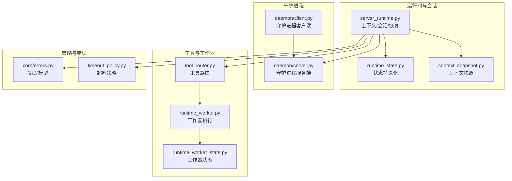
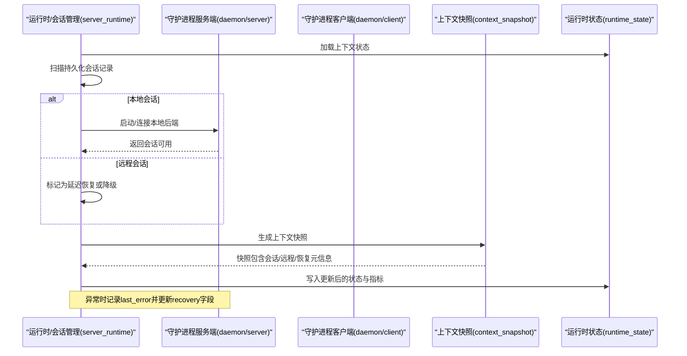
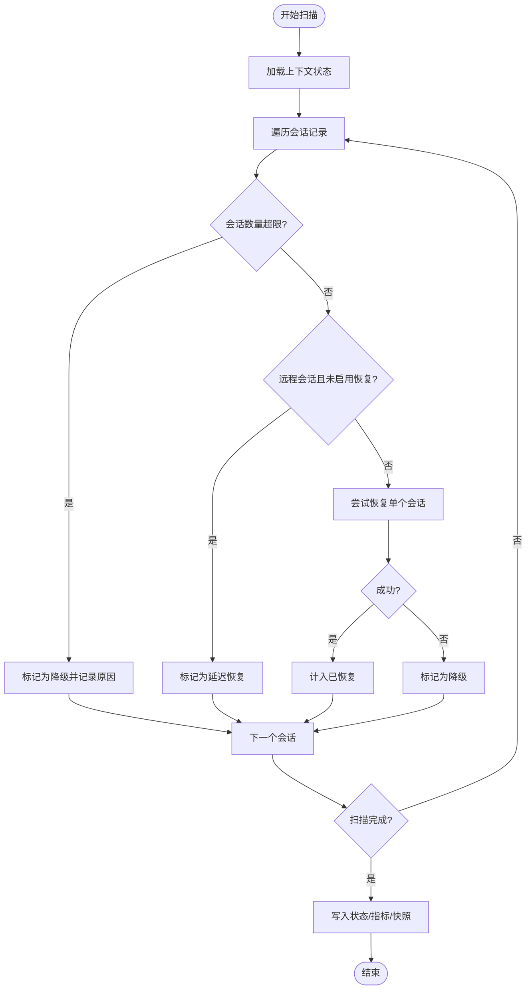
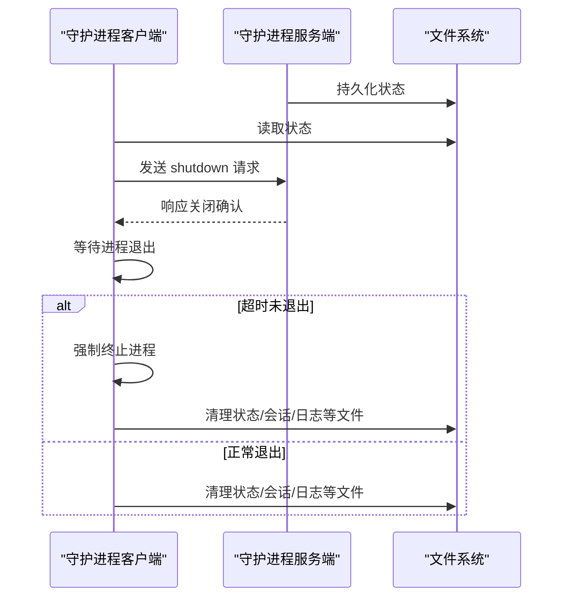
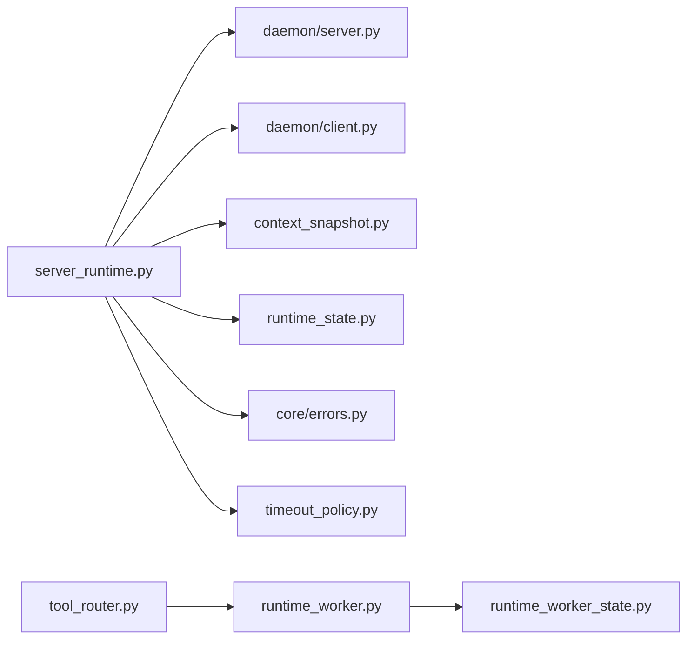

# 故障恢复

<cite>
**本文引用的文件**
- [rdx/server_runtime.py](file://rdx/server_runtime.py)
- [rdx/daemon/client.py](file://rdx/daemon/client.py)
- [rdx/daemon/server.py](file://rdx/daemon/server.py)
- [tests/test_runtime_recovery_and_discovery.py](file://tests/test_runtime_recovery_and_discovery.py)
- [tests/test_context_owner_baton.py](file://tests/test_context_owner_baton.py)
- [rdx/context_snapshot.py](file://rdx/context_snapshot.py)
- [rdx/runtime_state.py](file://rdx/runtime_state.py)
- [rdx/core/errors.py](file://rdx/core/errors.py)
- [rdx/runtime_worker.py](file://rdx/runtime_worker.py)
- [rdx/runtime_worker_state.py](file://rdx/runtime_worker_state.py)
- [rdx/timeout_policy.py](file://rdx/timeout_policy.py)
- [rdx/tool_router.py](file://rdx/tool_router.py)
- [rdx/session_manager.py](file://rdx/session_manager.py)
- [rdx/daemon/server.py](file://rdx/daemon/server.py)
- [rdx/daemon/client.py](file://rdx/daemon/client.py)
</cite>

## 目录
1. [简介](#简介)
2. [项目结构](#项目结构)
3. [核心组件](#核心组件)
4. [架构总览](#架构总览)
5. [详细组件分析](#详细组件分析)
6. [依赖关系分析](#依赖关系分析)
7. [性能考量](#性能考量)
8. [故障排查指南](#故障排查指南)
9. [结论](#结论)
10. [附录](#附录)

## 简介
本技术文档聚焦于 RDC-Agent-Tools 的故障恢复体系，系统性阐述自动故障检测、恢复策略与容错机制；覆盖死锁检测、资源泄漏防护与异常状态处理；明确优雅关闭、强制终止与资源清理流程；解释上下文状态恢复、会话重建与数据一致性保障；并提供故障预防、预警与应急响应方法，以及恢复测试、演练与灾难恢复的技术细节。

## 项目结构
围绕故障恢复的关键模块包括：
- 运行时与会话管理：负责上下文状态持久化、会话生命周期与恢复扫描
- 守护进程客户端/服务端：负责守护进程状态持久化、活动追踪、执行锁与回收
- 上下文快照与运行时状态：负责上下文快照生成、清理与一致性校验
- 错误模型与超时策略：统一错误分类与超时控制，支撑恢复决策
- 工具路由与工作器：承载工具执行与资源隔离，影响恢复路径选择

图表来源
- [rdx/server_runtime.py](file://rdx/server_runtime.py)
- [rdx/runtime_state.py](file://rdx/runtime_state.py)
- [rdx/context_snapshot.py](file://rdx/context_snapshot.py)
- [rdx/daemon/client.py](file://rdx/daemon/client.py)
- [rdx/daemon/server.py](file://rdx/daemon/server.py)
- [rdx/tool_router.py](file://rdx/tool_router.py)
- [rdx/runtime_worker.py](file://rdx/runtime_worker.py)
- [rdx/runtime_worker_state.py](file://rdx/runtime_worker_state.py)
- [rdx/core/errors.py](file://rdx/core/errors.py)
- [rdx/timeout_policy.py](file://rdx/timeout_policy.py)

章节来源
- [rdx/server_runtime.py](file://rdx/server_runtime.py)
- [rdx/daemon/server.py](file://rdx/daemon/server.py)
- [rdx/daemon/client.py](file://rdx/daemon/client.py)
- [rdx/context_snapshot.py](file://rdx/context_snapshot.py)
- [rdx/runtime_state.py](file://rdx/runtime_state.py)
- [rdx/core/errors.py](file://rdx/core/errors.py)
- [rdx/timeout_policy.py](file://rdx/timeout_policy.py)

## 核心组件
- 运行时恢复与会话管理
  - 负责扫描持久化的会话记录，按状态进行恢复、降级或延迟恢复，并维护恢复指标与最近一次恢复结果
  - 提供上下文就绪保障，确保在需要时触发恢复扫描
- 守护进程状态与回收
  - 持久化守护进程状态，记录活动时间、令牌、会话计数等，支持健康检查与回收
  - 提供清理过期/异常守护进程状态的能力（优雅关闭或强制终止）
- 上下文快照与状态
  - 生成上下文快照，包含远程句柄、后端投影、会话列表与恢复元信息
  - 支持清理上下文快照与运行时状态，避免残留状态影响后续恢复
- 错误模型与超时策略
  - 统一错误分类与错误码，为恢复策略提供依据
  - 超时策略用于判定操作是否应中止或重试，避免无限等待
- 工具路由与工作器
  - 将工具请求路由到工作器执行，工作器状态变化影响恢复路径（如远程会话需显式激活）

章节来源
- [rdx/server_runtime.py](file://rdx/server_runtime.py)
- [rdx/daemon/server.py](file://rdx/daemon/server.py)
- [rdx/daemon/client.py](file://rdx/daemon/client.py)
- [rdx/context_snapshot.py](file://rdx/context_snapshot.py)
- [rdx/runtime_state.py](file://rdx/runtime_state.py)
- [rdx/core/errors.py](file://rdx/core/errors.py)
- [rdx/timeout_policy.py](file://rdx/timeout_policy.py)
- [rdx/tool_router.py](file://rdx/tool_router.py)
- [rdx/runtime_worker.py](file://rdx/runtime_worker.py)
- [rdx/runtime_worker_state.py](file://rdx/runtime_worker_state.py)

## 架构总览
下图展示故障恢复相关组件之间的交互：运行时扫描持久化会话，根据类型与状态决定恢复动作；守护进程服务端持久化状态并提供活动追踪；上下文快照与状态用于一致性保障；错误模型与超时策略贯穿恢复决策。

图表来源
- [rdx/server_runtime.py](file://rdx/server_runtime.py)
- [rdx/daemon/server.py](file://rdx/daemon/server.py)
- [rdx/daemon/client.py](file://rdx/daemon/client.py)
- [rdx/context_snapshot.py](file://rdx/context_snapshot.py)
- [rdx/runtime_state.py](file://rdx/runtime_state.py)

## 详细组件分析

### 运行时恢复与会话管理
- 自动故障检测
  - 在会话异常时，记录 last_error 并更新 recovery 字段（状态、尝试次数、最后尝试时间）
  - 对于远程会话，若未显式要求恢复，则标记为延迟恢复，避免无谓的失败尝试
- 恢复策略
  - 已达上限或不可用：标记为降级并记录原因
  - 已有回放：跳过恢复，直接计入已恢复
  - 远程且未启用：延迟恢复，等待显式远程操作
  - 其他：调用单会话恢复函数，成功则计入已恢复，失败则计入降级
- 容错与一致性
  - 恢复完成后同步上下文指标与快照，确保对外可见状态一致
  - 记录最近一次恢复结果与耗时，便于监控与告警
- 优雅关闭与强制终止
  - 通过守护进程客户端向守护进程发送 shutdown 请求；若超时未退出，执行强制终止并记录被杀死的 PID 列表

图表来源
- [rdx/server_runtime.py](file://rdx/server_runtime.py)

章节来源
- [rdx/server_runtime.py](file://rdx/server_runtime.py)
- [rdx/daemon/client.py](file://rdx/daemon/client.py)

### 守护进程状态与回收
- 状态持久化
  - 服务端在关键节点更新状态（活动时间、令牌、会话计数、活跃请求数、活动操作等），并持久化到磁盘
  - 客户端定期读取状态以判断守护进程健康状况
- 回收与清理
  - 清理过期/无效状态文件，对仍在运行的守护进程先尝试优雅关闭，若超时则强制终止
  - 记录被清理的文件与被杀死的 PID，便于审计与排障

图表来源
- [rdx/daemon/server.py](file://rdx/daemon/server.py)
- [rdx/daemon/client.py](file://rdx/daemon/client.py)

章节来源
- [rdx/daemon/server.py](file://rdx/daemon/server.py)
- [rdx/daemon/client.py](file://rdx/daemon/client.py)

### 上下文快照与状态一致性
- 上下文快照
  - 包含会话列表、远程句柄、后端投影、恢复元信息、最近操作等
  - 用于对外暴露当前上下文的完整视图，便于诊断与恢复
- 状态清理
  - 支持清理上下文快照与运行时状态，避免残留状态干扰新上下文的恢复
- 会话重建
  - 通过快照中的会话与远程信息，重建会话与远程连接，尽可能恢复用户工作流

章节来源
- [rdx/context_snapshot.py](file://rdx/context_snapshot.py)
- [rdx/runtime_state.py](file://rdx/runtime_state.py)
- [rdx/server_runtime.py](file://rdx/server_runtime.py)

### 错误模型与超时策略
- 错误模型
  - 统一的错误分类与错误码，为恢复策略提供依据（例如“会话未找到”、“会话限制超出”等）
- 超时策略
  - 针对不同操作设定超时阈值，防止长时间阻塞；超时后可触发降级或重试

章节来源
- [rdx/core/errors.py](file://rdx/core/errors.py)
- [rdx/timeout_policy.py](file://rdx/timeout_policy.py)

### 工具路由与工作器
- 工具路由
  - 将工具请求路由到对应工作器执行，工作器状态变化影响恢复路径（如远程会话需显式激活）
- 工作器状态
  - 记录工作器运行状态、PID、二进制目录等，为恢复与清理提供依据

章节来源
- [rdx/tool_router.py](file://rdx/tool_router.py)
- [rdx/runtime_worker.py](file://rdx/runtime_worker.py)
- [rdx/runtime_worker_state.py](file://rdx/runtime_worker_state.py)

## 依赖关系分析
- 组件耦合
  - 运行时恢复依赖守护进程状态与会话管理；上下文快照与状态为恢复提供输入；错误模型与超时策略贯穿恢复决策
- 外部依赖
  - 文件系统用于状态持久化与清理；进程间通信用于守护进程与客户端交互
- 循环依赖
  - 当前设计采用单向依赖（运行时 → 守护进程/上下文/状态），未见循环依赖迹象

图表来源
- [rdx/server_runtime.py](file://rdx/server_runtime.py)
- [rdx/daemon/server.py](file://rdx/daemon/server.py)
- [rdx/daemon/client.py](file://rdx/daemon/client.py)
- [rdx/context_snapshot.py](file://rdx/context_snapshot.py)
- [rdx/runtime_state.py](file://rdx/runtime_state.py)
- [rdx/core/errors.py](file://rdx/core/errors.py)
- [rdx/timeout_policy.py](file://rdx/timeout_policy.py)
- [rdx/tool_router.py](file://rdx/tool_router.py)
- [rdx/runtime_worker.py](file://rdx/runtime_worker.py)
- [rdx/runtime_worker_state.py](file://rdx/runtime_worker_state.py)

章节来源
- [rdx/server_runtime.py](file://rdx/server_runtime.py)
- [rdx/daemon/server.py](file://rdx/daemon/server.py)
- [rdx/daemon/client.py](file://rdx/daemon/client.py)
- [rdx/context_snapshot.py](file://rdx/context_snapshot.py)
- [rdx/runtime_state.py](file://rdx/runtime_state.py)
- [rdx/core/errors.py](file://rdx/core/errors.py)
- [rdx/timeout_policy.py](file://rdx/timeout_policy.py)
- [rdx/tool_router.py](file://rdx/tool_router.py)
- [rdx/runtime_worker.py](file://rdx/runtime_worker.py)
- [rdx/runtime_worker_state.py](file://rdx/runtime_worker_state.py)

## 性能考量
- 恢复扫描的复杂度
  - 与会话数量线性相关，建议在后台异步执行，并限制并发以避免对正常操作造成抖动
- 状态持久化频率
  - 高频写入会影响 I/O，建议批量写入并在关键节点合并更新
- 远程会话延迟恢复
  - 仅在显式远程操作时才尝试恢复，减少不必要的网络与资源消耗
- 超时与重试
  - 合理设置超时阈值与退避策略，避免雪崩效应

## 故障排查指南
- 常见问题定位
  - 查看 recovery 字段中的状态、last_error、attempt_count 与 last_attempt_ms，判断是降级还是延迟恢复
  - 检查最近一次恢复耗时与最近一次成功恢复时间，评估恢复成功率
  - 若存在远程会话，确认是否已发起显式远程操作导致延迟恢复
- 资源清理
  - 使用清理函数清除上下文快照与运行时状态，避免残留状态影响后续恢复
  - 对于异常守护进程，使用清理函数进行优雅关闭或强制终止，并记录被杀死的 PID
- 会话重建验证
  - 通过上下文快照核对会话与远程句柄状态，确认重建是否成功

章节来源
- [rdx/server_runtime.py](file://rdx/server_runtime.py)
- [rdx/daemon/client.py](file://rdx/daemon/client.py)
- [rdx/context_snapshot.py](file://rdx/context_snapshot.py)
- [rdx/runtime_state.py](file://rdx/runtime_state.py)

## 结论
该故障恢复体系通过“扫描-决策-恢复-同步”的闭环流程，结合守护进程状态持久化、上下文快照与统一错误模型，实现了对本地与远程会话的差异化恢复策略。配合延迟恢复、指标统计与清理能力，系统在保证数据一致性的同时，提升了鲁棒性与可观测性。建议在生产环境中结合监控与告警，持续优化超时与重试策略，完善恢复测试与演练。

## 附录

### 死锁检测与资源泄漏防护
- 死锁检测
  - 通过超时策略与活动时间戳识别长时间无进展的操作，必要时触发降级或中断
- 资源泄漏防护
  - 明确会话与远程句柄的生命周期，在恢复失败时及时释放资源
  - 使用清理函数清理上下文快照与运行时状态，避免残留状态占用资源

章节来源
- [rdx/timeout_policy.py](file://rdx/timeout_policy.py)
- [rdx/context_snapshot.py](file://rdx/context_snapshot.py)
- [rdx/runtime_state.py](file://rdx/runtime_state.py)

### 异常状态处理
- 统一错误分类与错误码，便于区分可恢复与不可恢复异常
- 在异常发生时记录 last_error 并更新 recovery 字段，确保外部可观测

章节来源
- [rdx/core/errors.py](file://rdx/core/errors.py)
- [rdx/server_runtime.py](file://rdx/server_runtime.py)

### 优雅关闭与强制终止
- 优先通过守护进程客户端发送 shutdown 请求，等待进程退出
- 超时未退出则强制终止，并清理相关文件与记录

章节来源
- [rdx/daemon/client.py](file://rdx/daemon/client.py)

### 上下文状态恢复、会话重建与数据一致性
- 通过上下文快照与会话记录重建会话与远程连接
- 恢复完成后同步指标与快照，确保对外一致

章节来源
- [rdx/context_snapshot.py](file://rdx/context_snapshot.py)
- [rdx/server_runtime.py](file://rdx/server_runtime.py)

### 故障预防、预警与应急响应
- 预防
  - 合理设置超时与重试策略，避免长时间阻塞
  - 控制会话数量，避免超过上限导致降级
- 预警
  - 监控 recovery 字段与最近一次恢复耗时，异常时触发告警
- 应急响应
  - 出现大规模降级时，优先清理异常守护进程与上下文状态，再进行二次恢复

章节来源
- [rdx/server_runtime.py](file://rdx/server_runtime.py)
- [rdx/daemon/client.py](file://rdx/daemon/client.py)

### 恢复测试、演练与灾难恢复
- 恢复测试
  - 使用测试用例模拟会话异常与远程延迟恢复，验证恢复流程与指标更新
- 演练
  - 通过清理函数模拟异常守护进程场景，验证清理与恢复流程
- 灾难恢复
  - 在极端情况下，清空上下文快照与运行时状态，重新引导恢复

章节来源
- [tests/test_runtime_recovery_and_discovery.py](file://tests/test_runtime_recovery_and_discovery.py)
- [tests/test_context_owner_baton.py](file://tests/test_context_owner_baton.py)
- [rdx/context_snapshot.py](file://rdx/context_snapshot.py)
- [rdx/runtime_state.py](file://rdx/runtime_state.py)