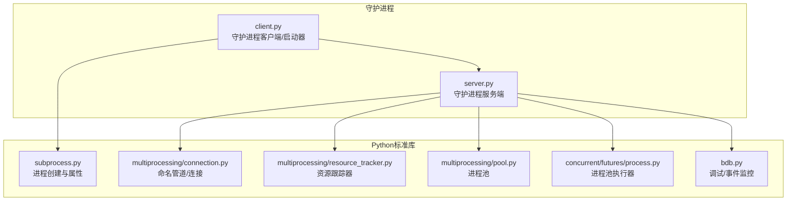
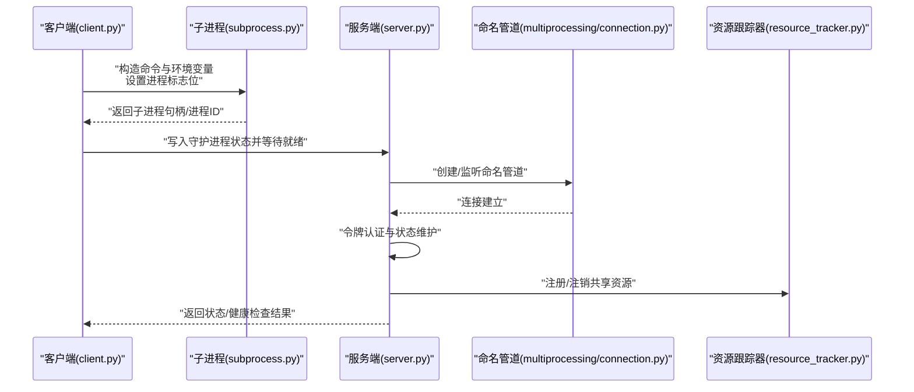
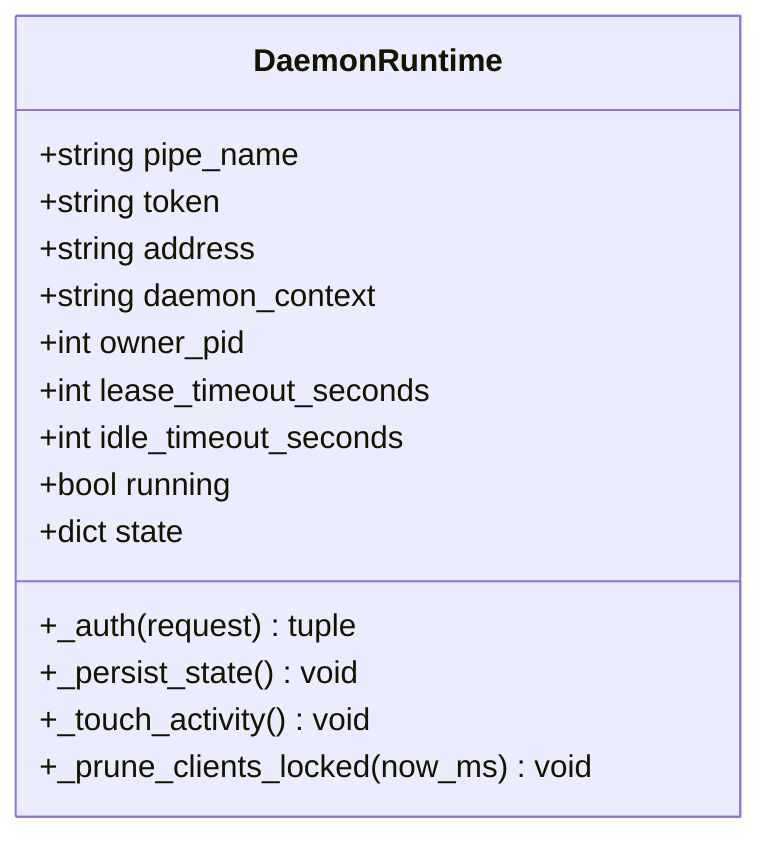
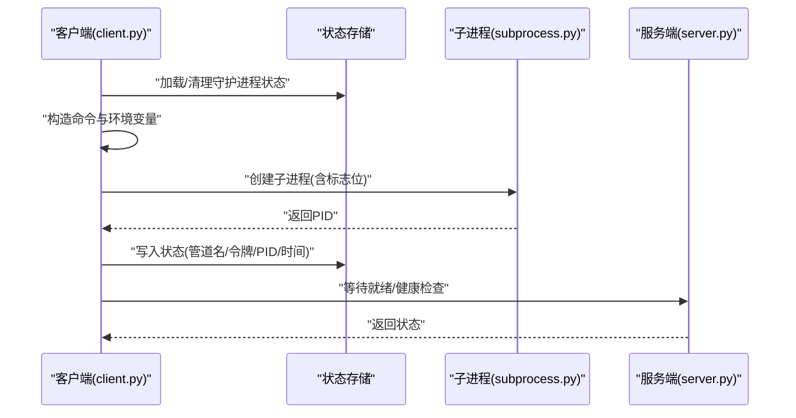
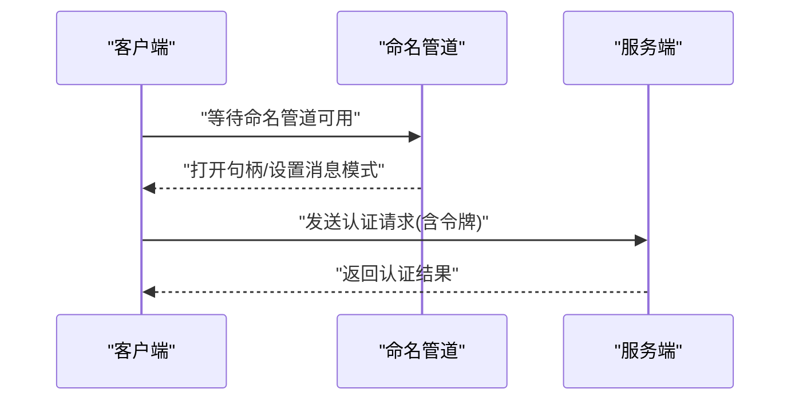
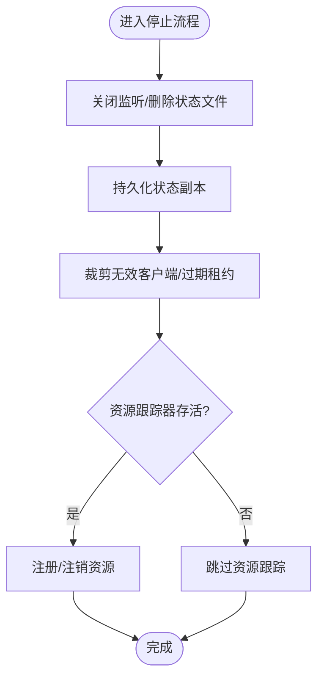
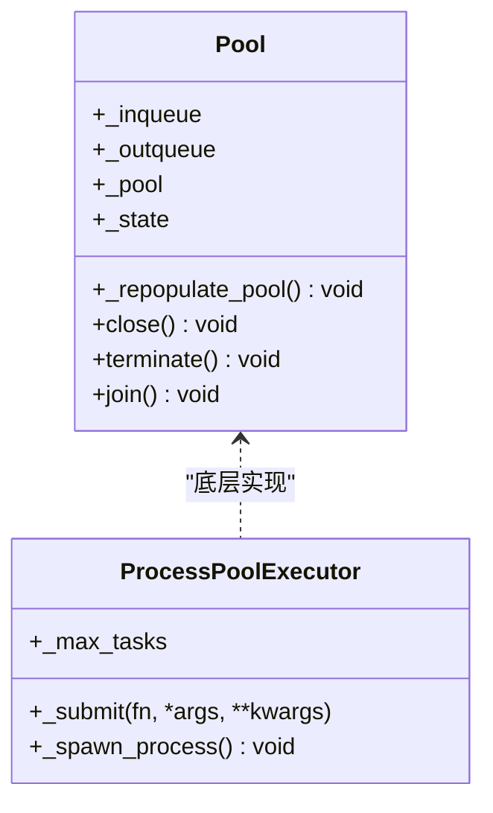
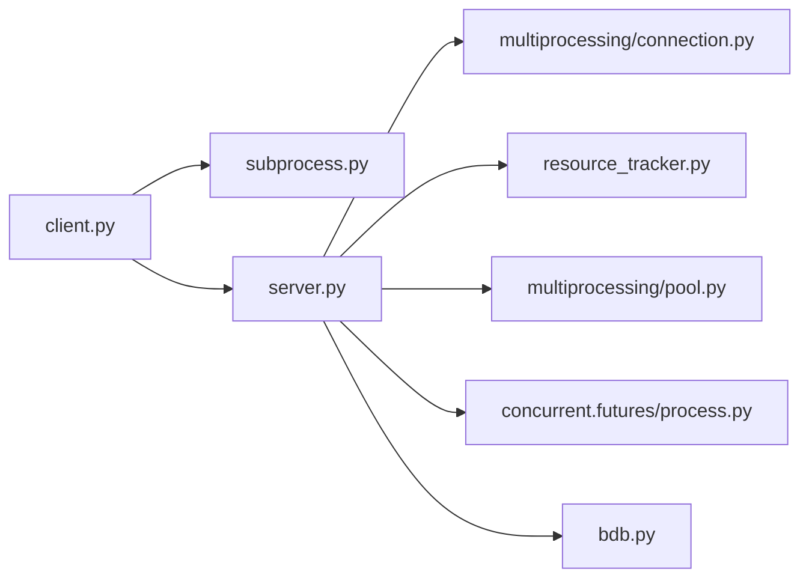

# 进程管理

<cite>
**本文引用的文件**
- [rdx/daemon/server.py](file://rdx/daemon/server.py)
- [rdx/daemon/client.py](file://rdx/daemon/client.py)
- [binaries/windows/x64/python/Lib/subprocess.py](file://binaries/windows/x64/python/Lib/subprocess.py)
- [binaries/windows/x64/python/Lib/multiprocessing/connection.py](file://binaries/windows/x64/python/Lib/multiprocessing/connection.py)
- [binaries/windows/x64/python/Lib/multiprocessing/resource_tracker.py](file://binaries/windows/x64/python/Lib/multiprocessing/resource_tracker.py)
- [binaries/windows/x64/python/Lib/multiprocessing/pool.py](file://binaries/windows/x64/python/Lib/multiprocessing/pool.py)
- [binaries/windows/x64/python/Lib/concurrent/futures/process.py](file://binaries/windows/x64/python/Lib/concurrent/futures/process.py)
- [binaries/windows/x64/python/Lib/bdb.py](file://binaries/windows/x64/python/Lib/bdb.py)
</cite>

## 目录
1. [引言](#引言)
2. [项目结构](#项目结构)
3. [核心组件](#核心组件)
4. [架构总览](#架构总览)
5. [详细组件分析](#详细组件分析)
6. [依赖关系分析](#依赖关系分析)
7. [性能考虑](#性能考虑)
8. [故障排除指南](#故障排除指南)
9. [结论](#结论)
10. [附录](#附录)

## 引言
本文件系统性阐述 RDC-Agent-Tools 中的进程管理机制，重点覆盖以下方面：
- 守护进程的启动、停止与生命周期管理
- 进程创建参数、环境变量设置与进程标志位的作用
- 进程间通信（IPC）初始化、命名管道与令牌认证
- 进程退出处理、清理策略与资源回收
- 进程监控、调试与故障排除方法
- 进程池管理、并发控制与性能优化

该文档面向具备基础编程知识的读者，同时为高级用户提供深入的实现细节与可操作建议。

## 项目结构
围绕进程管理的相关模块主要分布在如下位置：
- 守护进程服务端与客户端：rdx/daemon/server.py、rdx/daemon/client.py
- Python 标准库子进程与多进程支持：binaries/windows/x64/python/Lib/subprocess.py、multiprocessing/*.py
- 资源跟踪器与连接工具：multiprocessing/resource_tracker.py、multiprocessing/connection.py
- 并发执行框架：concurrent/futures/process.py
- 调试与事件监控：bdb.py

图表来源
- [rdx/daemon/server.py](file://rdx/daemon/server.py)
- [rdx/daemon/client.py](file://rdx/daemon/client.py)
- [binaries/windows/x64/python/Lib/subprocess.py](file://binaries/windows/x64/python/Lib/subprocess.py)
- [binaries/windows/x64/python/Lib/multiprocessing/connection.py](file://binaries/windows/x64/python/Lib/multiprocessing/connection.py)
- [binaries/windows/x64/python/Lib/multiprocessing/resource_tracker.py](file://binaries/windows/x64/python/Lib/multiprocessing/resource_tracker.py)
- [binaries/windows/x64/python/Lib/multiprocessing/pool.py](file://binaries/windows/x64/python/Lib/multiprocessing/pool.py)
- [binaries/windows/x64/python/Lib/concurrent/futures/process.py](file://binaries/windows/x64/python/Lib/concurrent/futures/process.py)
- [binaries/windows/x64/python/Lib/bdb.py](file://binaries/windows/x64/python/Lib/bdb.py)

章节来源
- [rdx/daemon/server.py](file://rdx/daemon/server.py)
- [rdx/daemon/client.py](file://rdx/daemon/client.py)
- [binaries/windows/x64/python/Lib/subprocess.py](file://binaries/windows/x64/python/Lib/subprocess.py)

## 核心组件
- 守护进程运行时（DaemonRuntime）
  - 维护管道名、令牌、上下文、所有者 PID、租约与空闲超时等状态
  - 提供认证（基于令牌）、状态持久化、活动时间戳维护、客户端裁剪与清理
- 守护进程服务端（server.py）
  - 命名管道监听、连接线程化处理、请求路由、状态查询与心跳
- 守护进程客户端（client.py）
  - 确保守护进程存在（检测、拉起、等待就绪、状态同步）
  - 设置环境变量、进程标志位、创建新进程并记录状态
- 子进程与进程属性（subprocess.py）
  - 进程创建参数、环境变量注入、Windows 启动信息与创建标志
- 命名管道与连接（multiprocessing/connection.py）
  - Windows 命名管道客户端连接、句柄状态设置、消息模式
- 资源跟踪器（multiprocessing/resource_tracker.py）
  - 注册/注销共享资源、探测存活、异常终止后的资源清理
- 进程池（multiprocessing/pool.py、concurrent/futures/process.py）
  - 工作进程生命周期管理、任务分发、结果回传、终止与回收
- 调试与事件监控（bdb.py）
  - 使用 sys.monitoring 工具进行事件级调试与回调注册

章节来源
- [rdx/daemon/server.py](file://rdx/daemon/server.py)
- [rdx/daemon/client.py](file://rdx/daemon/client.py)
- [binaries/windows/x64/python/Lib/subprocess.py](file://binaries/windows/x64/python/Lib/subprocess.py)
- [binaries/windows/x64/python/Lib/multiprocessing/connection.py](file://binaries/windows/x64/python/Lib/multiprocessing/connection.py)
- [binaries/windows/x64/python/Lib/multiprocessing/resource_tracker.py](file://binaries/windows/x64/python/Lib/multiprocessing/resource_tracker.py)
- [binaries/windows/x64/python/Lib/multiprocessing/pool.py](file://binaries/windows/x64/python/Lib/multiprocessing/pool.py)
- [binaries/windows/x64/python/Lib/concurrent/futures/process.py](file://binaries/windows/x64/python/Lib/concurrent/futures/process.py)
- [binaries/windows/x64/python/Lib/bdb.py](file://binaries/windows/x64/python/Lib/bdb.py)

## 架构总览
下图展示从客户端到服务端、再到资源与连接层的整体交互路径。

图表来源
- [rdx/daemon/client.py](file://rdx/daemon/client.py)
- [binaries/windows/x64/python/Lib/subprocess.py](file://binaries/windows/x64/python/Lib/subprocess.py)
- [rdx/daemon/server.py](file://rdx/daemon/server.py)
- [binaries/windows/x64/python/Lib/multiprocessing/connection.py](file://binaries/windows/x64/python/Lib/multiprocessing/connection.py)
- [binaries/windows/x64/python/Lib/multiprocessing/resource_tracker.py](file://binaries/windows/x64/python/Lib/multiprocessing/resource_tracker.py)

## 详细组件分析

### 守护进程运行时与生命周期
- 关键职责
  - 认证：基于令牌校验请求合法性
  - 状态持久化：保存上下文、管道名、租约、空闲超时、附加客户端列表等
  - 活动维护：更新最后活动时间，用于空闲超时判定
  - 客户端裁剪：移除已退出客户端或过期租约
  - 运行控制：线程安全的状态锁、工作进程持有与执行锁
- 生命周期要点
  - 启动：由客户端创建子进程并传递管道名与令牌
  - 运行：监听命名管道，按连接派生工作线程处理请求
  - 停止：关闭监听、删除状态文件、释放句柄；资源跟踪器在异常退出时回收资源

图表来源
- [rdx/daemon/server.py](file://rdx/daemon/server.py)

章节来源
- [rdx/daemon/server.py](file://rdx/daemon/server.py)

### 守护进程启动流程（客户端）
- 主要步骤
  - 规范化上下文、清理陈旧状态
  - 加载现有状态并判断是否仍在运行
  - 若未运行则构造命令行与环境变量，设置进程标志位
  - 创建子进程并记录状态（管道名、令牌、PID、时间戳等）
  - 等待守护进程“就绪”，否则终止并清理
  - 发送状态查询请求以确认健康
- 进程标志位与环境变量
  - Windows：使用创建标志组合，隐藏控制台窗口并创建新进程组
  - 环境变量：注入根路径与 Python 路径，确保运行时一致性

图表来源
- [rdx/daemon/client.py](file://rdx/daemon/client.py)
- [binaries/windows/x64/python/Lib/subprocess.py](file://binaries/windows/x64/python/Lib/subprocess.py)
- [rdx/daemon/server.py](file://rdx/daemon/server.py)

章节来源
- [rdx/daemon/client.py](file://rdx/daemon/client.py)
- [binaries/windows/x64/python/Lib/subprocess.py](file://binaries/windows/x64/python/Lib/subprocess.py)

### 命名管道与令牌认证
- 命名管道
  - 地址格式为 \\.\pipe\<pipe_name>，Windows 下通过等待命名管道、打开句柄、设置读取模式完成连接
- 令牌认证
  - 服务端对每个请求携带的令牌进行比对，不匹配则拒绝并返回未授权错误
- 初始化流程
  - 客户端在启动后等待服务端就绪，随后进行一次状态查询以验证连接与认证

图表来源
- [rdx/daemon/server.py](file://rdx/daemon/server.py)
- [binaries/windows/x64/python/Lib/multiprocessing/connection.py](file://binaries/windows/x64/python/Lib/multiprocessing/connection.py)

章节来源
- [rdx/daemon/server.py](file://rdx/daemon/server.py)
- [binaries/windows/x64/python/Lib/multiprocessing/connection.py](file://binaries/windows/x64/python/Lib/multiprocessing/connection.py)

### 进程退出处理、清理策略与资源回收
- 退出处理
  - 服务端在停止时关闭监听、删除状态文件、释放句柄
  - 资源跟踪器在进程异常退出时探测并清理未释放的共享资源
- 清理策略
  - 状态持久化前复制客户端列表，避免并发修改
  - 客户端裁剪时过滤无效 PID 或过期租约
- 资源回收
  - 注册/注销共享内存、信号量等资源
  - 通过简单格式或 JSON 格式的消息保持原子性（小于 PIPE_BUF）

图表来源
- [rdx/daemon/server.py](file://rdx/daemon/server.py)
- [binaries/windows/x64/python/Lib/multiprocessing/resource_tracker.py](file://binaries/windows/x64/python/Lib/multiprocessing/resource_tracker.py)

章节来源
- [rdx/daemon/server.py](file://rdx/daemon/server.py)
- [binaries/windows/x64/python/Lib/multiprocessing/resource_tracker.py](file://binaries/windows/x64/python/Lib/multiprocessing/resource_tracker.py)

### 进程池管理、并发控制与性能优化
- 工作进程生命周期
  - 进程池在任务完成后清理退出的工作进程，按需再填充
  - 支持最大任务数限制，达到阈值后优雅退出
- 并发控制
  - 任务队列、输入输出队列与处理器线程协同
  - 结果处理器线程负责回传结果，异常包装与编码错误处理
- 性能优化
  - 避免不必要的文件描述符继承与阻塞
  - 使用原子消息长度与短消息格式减少写放大
  - 在 POSIX 可用时优先使用 posix_spawn 提升性能

图表来源
- [binaries/windows/x64/python/Lib/multiprocessing/pool.py](file://binaries/windows/x64/python/Lib/multiprocessing/pool.py)
- [binaries/windows/x64/python/Lib/concurrent/futures/process.py](file://binaries/windows/x64/python/Lib/concurrent/futures/process.py)

章节来源
- [binaries/windows/x64/python/Lib/multiprocessing/pool.py](file://binaries/windows/x64/python/Lib/multiprocessing/pool.py)
- [binaries/windows/x64/python/Lib/concurrent/futures/process.py](file://binaries/windows/x64/python/Lib/concurrent/futures/process.py)

### 调试与事件监控
- 调试工具集成
  - 使用 bdb 的 sys.monitoring 工具注册事件回调，启用/禁用事件追踪
  - 通过回调映射注册不同事件类型，避免指令级事件干扰
- 应用场景
  - 在守护进程或工作进程中启用细粒度事件监控，辅助定位性能瓶颈与异常路径

章节来源
- [binaries/windows/x64/python/Lib/bdb.py](file://binaries/windows/x64/python/Lib/bdb.py)

## 依赖关系分析
- 组件耦合
  - 客户端依赖子进程模块创建守护进程，并依赖状态存储与服务端通信
  - 服务端依赖命名管道连接、资源跟踪器与进程池/执行器
- 外部依赖
  - Windows 命名管道 API、信号与进程管理接口
  - Python 标准库的 subprocess、multiprocessing、concurrent.futures

图表来源
- [rdx/daemon/client.py](file://rdx/daemon/client.py)
- [rdx/daemon/server.py](file://rdx/daemon/server.py)
- [binaries/windows/x64/python/Lib/subprocess.py](file://binaries/windows/x64/python/Lib/subprocess.py)
- [binaries/windows/x64/python/Lib/multiprocessing/connection.py](file://binaries/windows/x64/python/Lib/multiprocessing/connection.py)
- [binaries/windows/x64/python/Lib/multiprocessing/resource_tracker.py](file://binaries/windows/x64/python/Lib/multiprocessing/resource_tracker.py)
- [binaries/windows/x64/python/Lib/multiprocessing/pool.py](file://binaries/windows/x64/python/Lib/multiprocessing/pool.py)
- [binaries/windows/x64/python/Lib/concurrent/futures/process.py](file://binaries/windows/x64/python/Lib/concurrent/futures/process.py)
- [binaries/windows/x64/python/Lib/bdb.py](file://binaries/windows/x64/python/Lib/bdb.py)

## 性能考虑
- 进程创建
  - 使用最小必要环境变量，避免污染 PATH 与 PYTHONPATH
  - Windows 上通过创建标志隐藏控制台窗口，减少前台干扰
- IPC 与序列化
  - 命名管道采用消息模式，降低粘包风险
  - 资源跟踪器消息长度受控，保证原子写入
- 并发与调度
  - 进程池按需补充工作进程，避免过度并发导致资源争用
  - 任务结果回传时尽早释放中间对象，降低内存占用

## 故障排除指南
- 守护进程无法启动
  - 检查命令行与环境变量是否正确注入
  - 确认管道名唯一且服务端监听成功
- 认证失败
  - 对比请求中的令牌与守护进程配置的令牌
- 连接超时
  - 排查命名管道句柄状态与读取模式设置
- 资源泄漏
  - 观察资源跟踪器日志，确认注册/注销配对
  - 检查进程池任务是否正常结束，避免僵尸进程
- 调试困难
  - 启用事件监控工具，观察事件回调触发情况
  - 使用状态查询接口定期检查守护进程健康

章节来源
- [rdx/daemon/server.py](file://rdx/daemon/server.py)
- [rdx/daemon/client.py](file://rdx/daemon/client.py)
- [binaries/windows/x64/python/Lib/multiprocessing/connection.py](file://binaries/windows/x64/python/Lib/multiprocessing/connection.py)
- [binaries/windows/x64/python/Lib/multiprocessing/resource_tracker.py](file://binaries/windows/x64/python/Lib/multiprocessing/resource_tracker.py)
- [binaries/windows/x64/python/Lib/bdb.py](file://binaries/windows/x64/python/Lib/bdb.py)

## 结论
本文件从架构、组件、数据流与算法层面梳理了 RDC-Agent-Tools 的进程管理体系，覆盖守护进程的启动/停止/生命周期、IPC 初始化与令牌认证、退出清理与资源回收、以及进程池并发与性能优化。结合故障排除与调试建议，可帮助用户在实际部署中稳定运行并高效扩展。

## 附录
- 关键参数与含义
  - 管道名：用于命名管道地址构造，决定服务端监听与客户端连接
  - 令牌：用于请求认证，防止未授权访问
  - 上下文：守护进程上下文标识，便于多实例隔离
  - 所有者 PID：用于父进程生命周期关联
  - 租约/空闲超时：用于客户端租约与服务端空闲清理
- 建议实践
  - 为不同上下文分配独立管道名，避免冲突
  - 定期轮换令牌，配合短租约提升安全性
  - 在生产环境启用资源跟踪器并关注异常退出告警
  - 使用事件监控工具进行性能剖析与问题定位