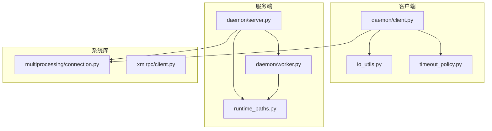
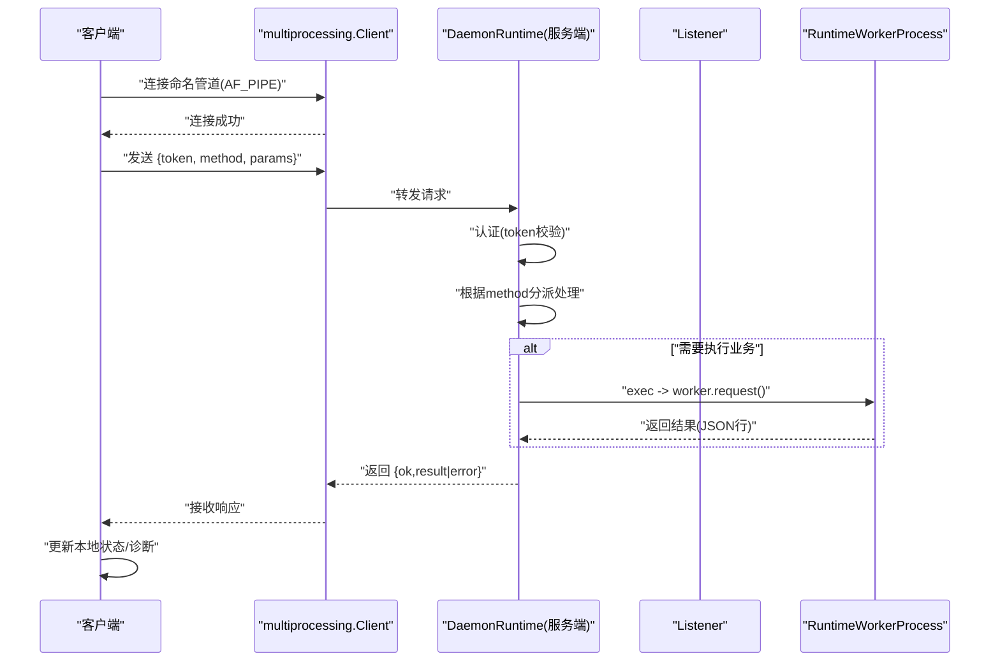
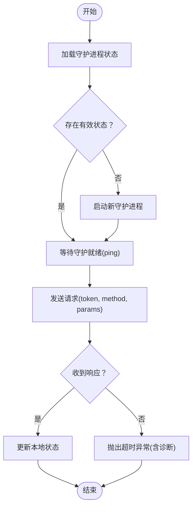
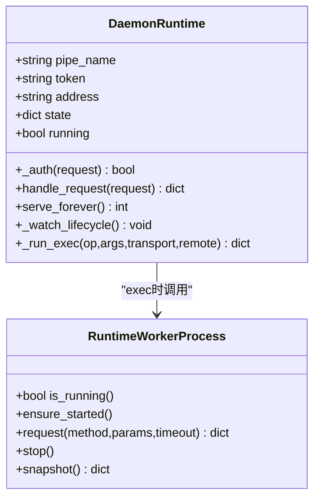
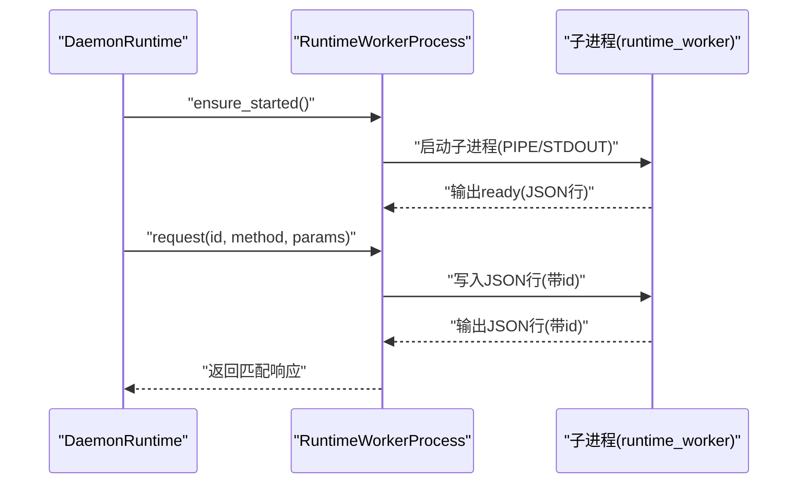
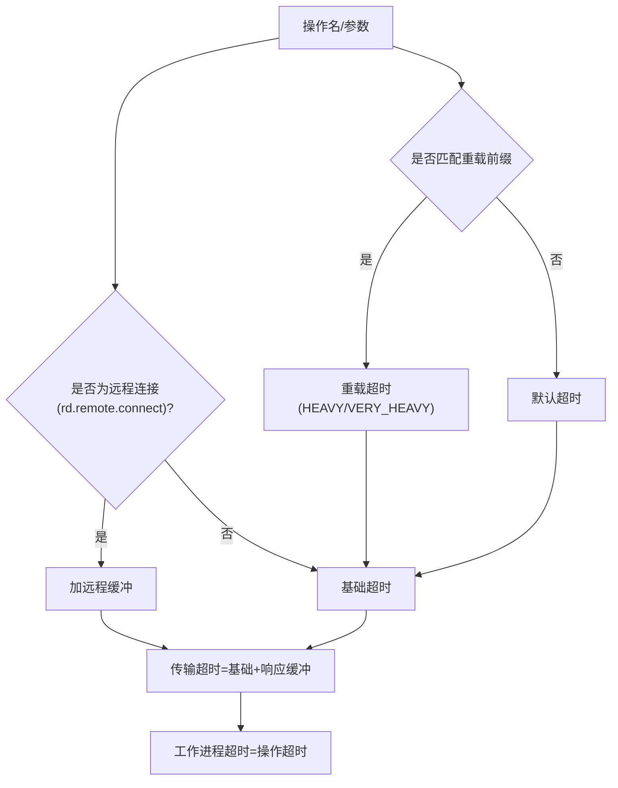
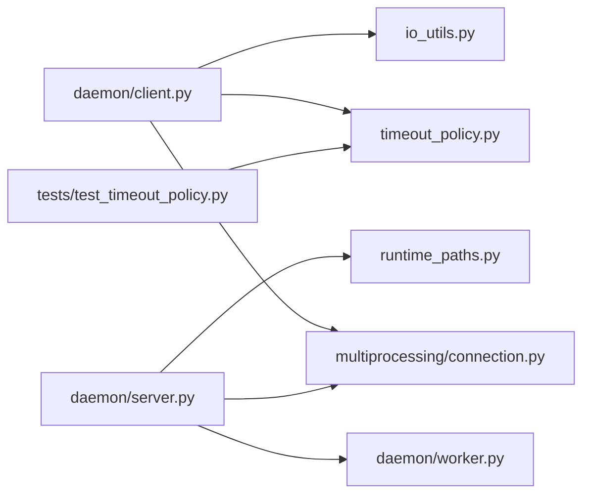
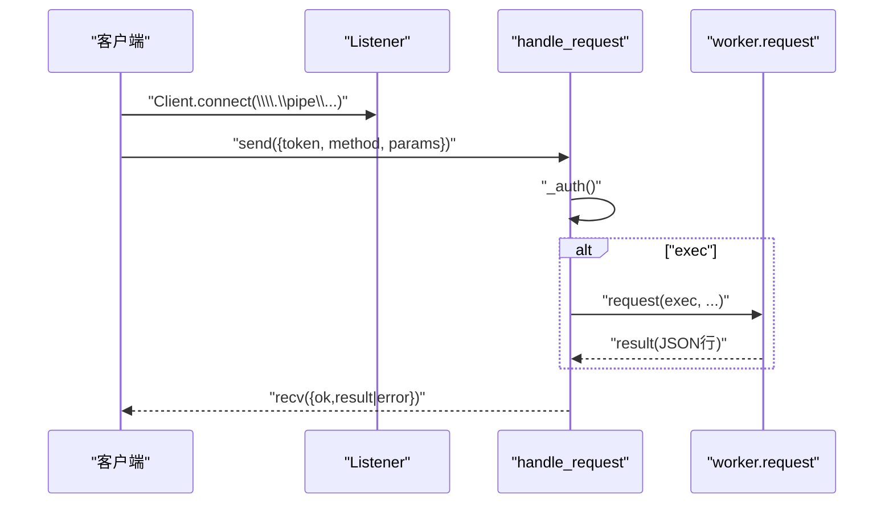

# 进程间通信

<cite>
**本文引用的文件**
- [rdx/daemon/client.py](file://rdx/daemon/client.py)
- [rdx/daemon/server.py](file://rdx/daemon/server.py)
- [rdx/daemon/worker.py](file://rdx/daemon/worker.py)
- [rdx/timeout_policy.py](file://rdx/timeout_policy.py)
- [rdx/io_utils.py](file://rdx/io_utils.py)
- [rdx/runtime_paths.py](file://rdx/runtime_paths.py)
- [binaries/windows/x64/python/Lib/multiprocessing/connection.py](file://binaries/windows/x64/python/Lib/multiprocessing/connection.py)
- [binaries/windows/x64/python/Lib/xmlrpc/client.py](file://binaries/windows/x64/python/Lib/xmlrpc/client.py)
- [tests/test_timeout_policy.py](file://tests/test_timeout_policy.py)
</cite>

## 目录
1. [引言](#引言)
2. [项目结构](#项目结构)
3. [核心组件](#核心组件)
4. [架构总览](#架构总览)
5. [详细组件分析](#详细组件分析)
6. [依赖分析](#依赖分析)
7. [性能考量](#性能考量)
8. [故障排查指南](#故障排查指南)
9. [结论](#结论)
10. [附录](#附录)

## 引言
本文件系统性阐述基于 Windows 命名管道的进程间通信（IPC）方案，覆盖客户端连接建立、消息序列化与反序列化、请求-响应模式、超时与重试策略、心跳与保活、连接状态管理、安全性与数据完整性、性能优化与监控调试等主题。目标是帮助开发者在不深入底层实现的前提下，正确使用与扩展该 IPC 协议。

## 项目结构
围绕命名管道 IPC 的关键模块如下：
- 客户端侧：负责启动/发现守护进程、建立命名管道连接、发送请求、接收响应、心跳与上下文清理。
- 服务端侧：监听命名管道、认证令牌、路由方法、执行业务逻辑、维护状态与生命周期。
- 工作进程：承载具体渲染/捕获任务，通过子进程与守护进程交互。
- 超时策略：统一计算各类操作的超时阈值，确保网络与本地执行的平衡。
- 序列化工具：安全 JSON 文本生成与原子写入，保障跨进程消息一致性。
- 路径与运行时：确定运行时目录、工作进程二进制位置等。

图表来源
- [rdx/daemon/client.py](file://rdx/daemon/client.py)
- [rdx/daemon/server.py](file://rdx/daemon/server.py)
- [rdx/daemon/worker.py](file://rdx/daemon/worker.py)
- [rdx/timeout_policy.py](file://rdx/timeout_policy.py)
- [rdx/io_utils.py](file://rdx/io_utils.py)
- [rdx/runtime_paths.py](file://rdx/runtime_paths.py)
- [binaries/windows/x64/python/Lib/multiprocessing/connection.py](file://binaries/windows/x64/python/Lib/multiprocessing/connection.py)
- [binaries/windows/x64/python/Lib/xmlrpc/client.py](file://binaries/windows/x64/python/Lib/xmlrpc/client.py)

章节来源
- [rdx/daemon/client.py](file://rdx/daemon/client.py)
- [rdx/daemon/server.py](file://rdx/daemon/server.py)
- [rdx/daemon/worker.py](file://rdx/daemon/worker.py)
- [rdx/timeout_policy.py](file://rdx/timeout_policy.py)
- [rdx/io_utils.py](file://rdx/io_utils.py)
- [rdx/runtime_paths.py](file://rdx/runtime_paths.py)
- [binaries/windows/x64/python/Lib/multiprocessing/connection.py](file://binaries/windows/x64/python/Lib/multiprocessing/connection.py)
- [binaries/windows/x64/python/Lib/xmlrpc/client.py](file://binaries/windows/x64/python/Lib/xmlrpc/client.py)

## 核心组件
- 客户端连接与请求
  - 使用 multiprocessing.connection.Client 通过 AF_PIPE 连接命名管道地址。
  - 请求体包含 token、method、params；响应为字典结构。
  - 支持超时等待与诊断信息收集。
- 服务端监听与处理
  - 使用 multiprocessing.connection.Listener 接受连接。
  - 基于 token 的简单认证；按 method 分派到处理函数。
  - 维护守护进程状态、附加客户端列表、活动计数与最后活跃时间。
- 工作进程
  - 子进程承载具体执行，通过标准输入输出与守护进程交互。
  - 使用队列异步读取 JSON 行，匹配请求 id 返回结果。
- 超时策略
  - 针对不同操作前缀设置默认超时，并叠加传输缓冲与远程连接缓冲。
- 序列化与原子写入
  - 安全 JSON 文本生成，避免编码问题。
  - 原子写入 JSON 文件，保证状态持久化一致性。

章节来源
- [rdx/daemon/client.py](file://rdx/daemon/client.py)
- [rdx/daemon/server.py](file://rdx/daemon/server.py)
- [rdx/daemon/worker.py](file://rdx/daemon/worker.py)
- [rdx/timeout_policy.py](file://rdx/timeout_policy.py)
- [rdx/io_utils.py](file://rdx/io_utils.py)

## 架构总览
下图展示从客户端发起请求到服务端处理并返回响应的完整流程，包括工作进程参与的场景。

图表来源
- [rdx/daemon/client.py](file://rdx/daemon/client.py)
- [rdx/daemon/server.py](file://rdx/daemon/server.py)
- [rdx/daemon/worker.py](file://rdx/daemon/worker.py)
- [binaries/windows/x64/python/Lib/multiprocessing/connection.py](file://binaries/windows/x64/python/Lib/multiprocessing/connection.py)

## 详细组件分析

### 客户端：连接、请求与状态管理
- 连接建立
  - 将 pipe_name 格式化为 Windows 命名管道地址，使用 Client(family="AF_PIPE") 建立连接。
- 请求-响应
  - 发送 payload 后轮询 conn.poll() 等待响应，超时则抛出带诊断信息的异常。
  - 响应必须为字典，否则视为无效。
- 心跳与保活
  - 提供 attach_client、heartbeat、detach_client 接口，维护客户端列表与租期。
  - 服务端根据 owner pid、最后活跃时间与空闲超时进行生命周期判定。
- 上下文清理
  - 提供 clear_context 清理会话与上下文状态；清理过期守护进程状态文件。

图表来源
- [rdx/daemon/client.py](file://rdx/daemon/client.py)

章节来源
- [rdx/daemon/client.py](file://rdx/daemon/client.py)

### 服务端：监听、认证与路由
- 监听与接受
  - 使用 Listener(family="AF_PIPE") 在命名管道地址上接受连接。
- 认证与路由
  - _auth 校验 token；根据 method 分派至对应处理函数。
- 方法处理
  - ping/status/shutdown/attach_client/heartbeat/detach_client/set_state/get_state/clear_context/exec 等。
- 生命周期与保活
  - _watch_lifecycle 周期检查 owner pid、租期与空闲超时，满足条件自动停止。
- 执行流程
  - exec 先增加 active_request_count，再调用 worker.request，完成后回退计数并清理 active_operation。

图表来源
- [rdx/daemon/server.py](file://rdx/daemon/server.py)
- [rdx/daemon/worker.py](file://rdx/daemon/worker.py)

章节来源
- [rdx/daemon/server.py](file://rdx/daemon/server.py)
- [rdx/daemon/worker.py](file://rdx/daemon/worker.py)

### 工作进程：子进程执行与消息循环
- 进程生命周期
  - 通过子进程运行 runtime_worker 模块，标准输入输出与守护进程交互。
- 消息循环
  - 读取 stdout 的 JSON 行，解析后放入队列；请求时按 id 匹配响应。
- 超时与退出
  - 请求超时抛出异常；worker 退出或 EOF 视为异常情况。

图表来源
- [rdx/daemon/worker.py](file://rdx/daemon/worker.py)

章节来源
- [rdx/daemon/worker.py](file://rdx/daemon/worker.py)

### 超时策略与重试
- 超时策略
  - 不同操作前缀采用不同默认超时；远程连接额外叠加缓冲；响应阶段追加固定缓冲。
- 测试验证
  - 测试覆盖了远程连接超时、CLI 传参透传、默认超时选择等场景。

图表来源
- [rdx/timeout_policy.py](file://rdx/timeout_policy.py)
- [tests/test_timeout_policy.py](file://tests/test_timeout_policy.py)

章节来源
- [rdx/timeout_policy.py](file://rdx/timeout_policy.py)
- [tests/test_timeout_policy.py](file://tests/test_timeout_policy.py)

### 序列化与数据完整性
- JSON 序列化
  - safe_json_text 对嵌套结构进行安全转义，避免编码错误。
- 原子写入
  - atomic_write_json 使用临时文件+原子替换，确保状态文件一致性。
- 命名管道消息
  - multiprocessing.connection 在 Windows 上以原子方式写入小于 PIPE_BUF 的消息，降低截断风险。

章节来源
- [rdx/io_utils.py](file://rdx/io_utils.py)
- [binaries/windows/x64/python/Lib/multiprocessing/connection.py](file://binaries/windows/x64/python/Lib/multiprocessing/connection.py)

### 安全性与鉴权
- 令牌鉴权
  - 服务端仅允许 token 匹配的请求通过；客户端需持有有效 token。
- 进程可见性
  - 客户端可检测 owner pid 与附加客户端进程存活，结合租期防止僵尸连接。
- 传输层
  - 基于本地命名管道，无需网络加密；若需跨主机，建议在更高层引入 TLS 或安全通道。

章节来源
- [rdx/daemon/server.py](file://rdx/daemon/server.py)
- [rdx/daemon/client.py](file://rdx/daemon/client.py)

## 依赖分析
- 客户端依赖
  - multiprocessing.connection.Client：Windows 命名管道连接。
  - 自定义超时策略：timeout_policy。
  - 安全 JSON 与原子写入：io_utils。
- 服务端依赖
  - multiprocessing.connection.Listener：监听命名管道。
  - 工作进程：daemon/worker。
  - 路径与运行时：runtime_paths。
- 测试依赖
  - timeout_policy 的行为被测试用例验证。

图表来源
- [rdx/daemon/client.py](file://rdx/daemon/client.py)
- [rdx/daemon/server.py](file://rdx/daemon/server.py)
- [rdx/daemon/worker.py](file://rdx/daemon/worker.py)
- [rdx/timeout_policy.py](file://rdx/timeout_policy.py)
- [rdx/io_utils.py](file://rdx/io_utils.py)
- [rdx/runtime_paths.py](file://rdx/runtime_paths.py)
- [binaries/windows/x64/python/Lib/multiprocessing/connection.py](file://binaries/windows/x64/python/Lib/multiprocessing/connection.py)
- [tests/test_timeout_policy.py](file://tests/test_timeout_policy.py)

章节来源
- [rdx/daemon/client.py](file://rdx/daemon/client.py)
- [rdx/daemon/server.py](file://rdx/daemon/server.py)
- [rdx/daemon/worker.py](file://rdx/daemon/worker.py)
- [rdx/timeout_policy.py](file://rdx/timeout_policy.py)
- [rdx/io_utils.py](file://rdx/io_utils.py)
- [rdx/runtime_paths.py](file://rdx/runtime_paths.py)
- [binaries/windows/x64/python/Lib/multiprocessing/connection.py](file://binaries/windows/x64/python/Lib/multiprocessing/connection.py)
- [tests/test_timeout_policy.py](file://tests/test_timeout_policy.py)

## 性能考量
- 连接复用
  - 客户端在单次请求中打开/关闭连接；如频繁调用，可考虑复用连接并配合心跳维持。
- 超时设计
  - 使用 timeout_policy 动态选择超时，避免全局硬编码导致的资源占用。
- I/O 优化
  - 使用 safe_json_text 与原子写入减少磁盘争用与损坏风险。
- 并发模型
  - 服务端每连接独立线程处理；注意高并发下的线程数量与锁竞争。

[本节为通用指导，无需列出章节来源]

## 故障排查指南
- 常见错误类型
  - 超时：DaemonRequestTimeout，携带 active_request_count、active_operation、daemon_state_excerpt 等诊断字段。
  - 未授权：服务端拒绝 token 不匹配的请求。
  - 未知方法：服务端返回 unknown_method。
  - 工作进程异常：worker 退出或返回错误，触发重启与重试。
- 诊断步骤
  - 查看客户端异常 details 中的 recovery_hint，按提示执行上下文清理或守护进程关闭。
  - 检查守护进程状态文件与会话状态文件，确认上下文 ID、最后活跃时间、租期与空闲超时。
  - 使用 clear_context 清理上下文后重试。
- 日志与监控
  - 服务端记录请求日志与执行完成信息，便于定位耗时与失败原因。
  - 客户端在超时路径中聚合当前状态摘要，辅助快速判断阻塞点。

章节来源
- [rdx/daemon/client.py](file://rdx/daemon/client.py)
- [rdx/daemon/server.py](file://rdx/daemon/server.py)

## 结论
该 IPC 方案以 Windows 命名管道为基础，结合轻量令牌认证、统一超时策略与工作进程解耦，实现了稳定可靠的请求-响应通信。通过心跳与保活机制、状态持久化与原子写入，提升了鲁棒性。建议在生产环境中配合完善的监控与告警，持续优化超时阈值与连接池策略，以获得更佳的吞吐与稳定性。

[本节为总结性内容，无需列出章节来源]

## 附录

### 请求-响应时序（代码级）

图表来源
- [rdx/daemon/client.py](file://rdx/daemon/client.py)
- [rdx/daemon/server.py](file://rdx/daemon/server.py)
- [rdx/daemon/worker.py](file://rdx/daemon/worker.py)
- [binaries/windows/x64/python/Lib/multiprocessing/connection.py](file://binaries/windows/x64/python/Lib/multiprocessing/connection.py)