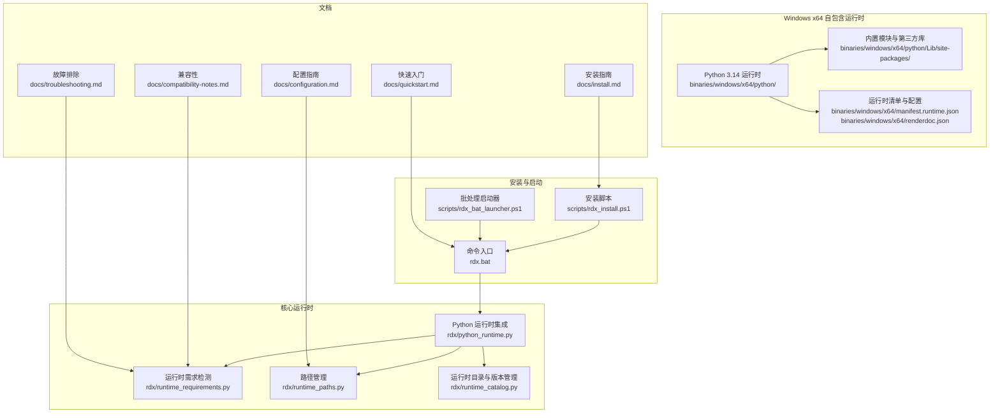
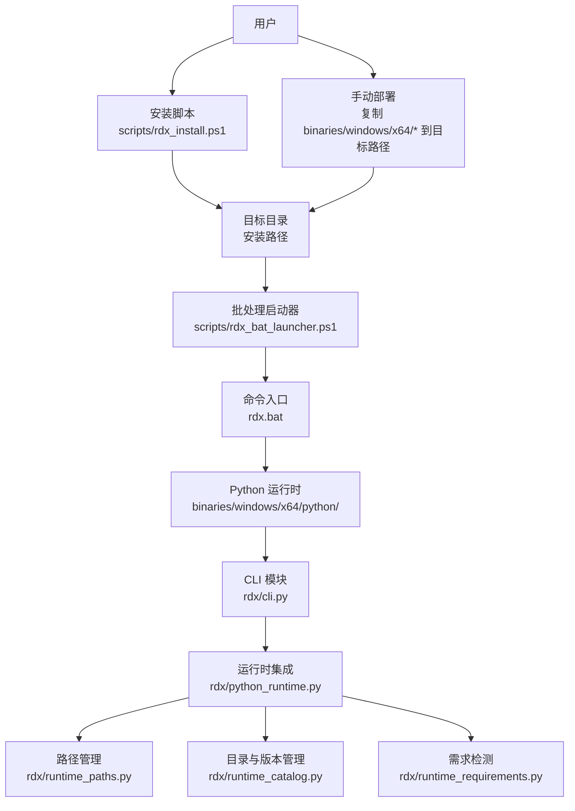
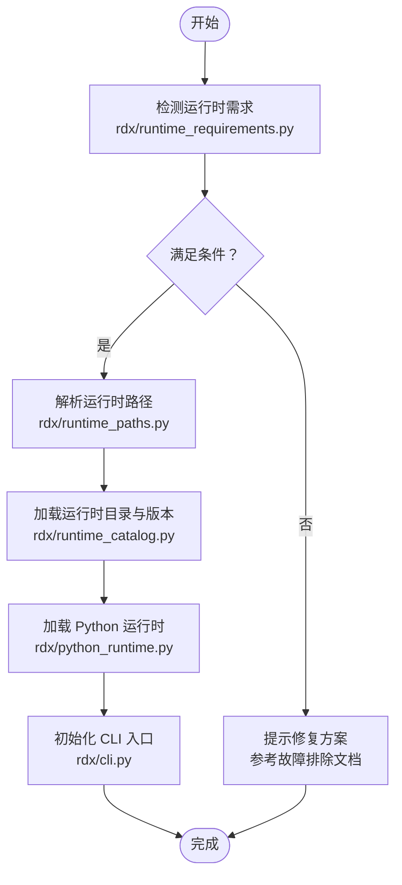
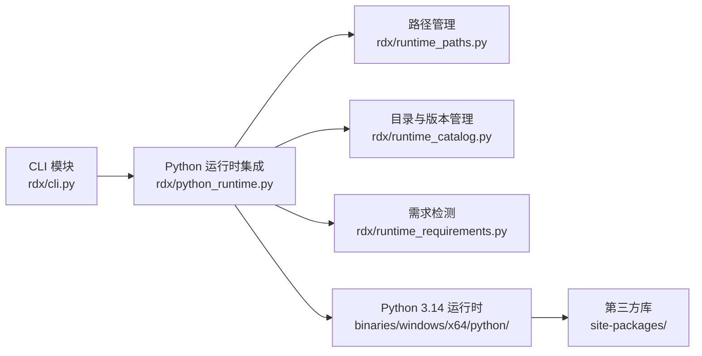

# 安装与配置

<cite>
**本文引用的文件**
- [install.md](file://docs/install.md)
- [configuration.md](file://docs/configuration.md)
- [quickstart.md](file://docs/quickstart.md)
- [compatibility-notes.md](file://docs/compatibility-notes.md)
- [troubleshooting.md](file://docs/troubleshooting.md)
- [rdx_install.ps1](file://scripts/rdx_install.ps1)
- [rdx_bat_launcher.ps1](file://scripts/rdx_bat_launcher.ps1)
- [rdx.bat](file://rdx.bat)
- [python314._pth](file://binaries/windows/x64/python/python314._pth)
- [manifest.runtime.json](file://binaries/windows/x64/manifest.runtime.json)
- [renderdoc.json](file://binaries/windows/x64/renderdoc.json)
- [runtime_requirements.py](file://rdx/runtime_requirements.py)
- [runtime_paths.py](file://rdx/runtime_paths.py)
- [runtime_catalog.py](file://rdx/runtime_catalog.py)
- [python_runtime.py](file://rdx/python_runtime.py)
- [config.py](file://rdx/config.py)
- [cli.py](file://rdx/cli.py)
- [package_runtime.py](file://scripts/package_runtime.py)
- [verify_release_package.py](file://scripts/verify_release_package.py)
</cite>

## 目录
1. [简介](#简介)
2. [项目结构](#项目结构)
3. [核心组件](#核心组件)
4. [架构总览](#架构总览)
5. [详细组件分析](#详细组件分析)
6. [依赖关系分析](#依赖关系分析)
7. [性能考虑](#性能考虑)
8. [故障排除指南](#故障排除指南)
9. [结论](#结论)
10. [附录](#附录)

## 简介
本文件提供 RDC Agent Tools 在 Windows x64 平台上的完整安装与配置指南，覆盖系统要求、依赖项、兼容性、多种安装方式（自包含发布包、脚本安装、手动部署）及其优缺点与适用场景。同时包含配置选项、环境变量、路径配置、配置验证步骤、常见问题解决方案以及高级定制化设置指导。

## 项目结构
该仓库采用模块化组织：核心运行时与工具位于 rdx 包中，Windows x64 自包含运行时位于 binaries/windows/x64，安装脚本位于 scripts 目录，用户文档位于 docs 目录。关键文件包括：
- Windows x64 自包含运行时：包含 Python 3.14 运行时、第三方库、渲染文档支持等
- 安装脚本：PowerShell 安装器与批处理启动器
- 文档：安装、配置、快速入门、兼容性与故障排除指南
- 核心运行时：运行时需求检测、路径管理、运行时目录与版本管理

图表来源
- [rdx_install.ps1](file://scripts/rdx_install.ps1)
- [rdx_bat_launcher.ps1](file://scripts/rdx_bat_launcher.ps1)
- [rdx.bat](file://rdx.bat)
- [python314._pth](file://binaries/windows/x64/python/python314._pth)
- [manifest.runtime.json](file://binaries/windows/x64/manifest.runtime.json)
- [renderdoc.json](file://binaries/windows/x64/renderdoc.json)
- [runtime_requirements.py](file://rdx/runtime_requirements.py)
- [runtime_paths.py](file://rdx/runtime_paths.py)
- [runtime_catalog.py](file://rdx/runtime_catalog.py)
- [python_runtime.py](file://rdx/python_runtime.py)
- [install.md](file://docs/install.md)
- [configuration.md](file://docs/configuration.md)
- [quickstart.md](file://docs/quickstart.md)
- [compatibility-notes.md](file://docs/compatibility-notes.md)
- [troubleshooting.md](file://docs/troubleshooting.md)

章节来源
- [install.md](file://docs/install.md)
- [configuration.md](file://docs/configuration.md)
- [quickstart.md](file://docs/quickstart.md)
- [compatibility-notes.md](file://docs/compatibility-notes.md)
- [troubleshooting.md](file://docs/troubleshooting.md)
- [rdx_install.ps1](file://scripts/rdx_install.ps1)
- [rdx_bat_launcher.ps1](file://scripts/rdx_bat_launcher.ps1)
- [rdx.bat](file://rdx.bat)
- [python314._pth](file://binaries/windows/x64/python/python314._pth)
- [manifest.runtime.json](file://binaries/windows/x64/manifest.runtime.json)
- [renderdoc.json](file://binaries/windows/x64/renderdoc.json)
- [runtime_requirements.py](file://rdx/runtime_requirements.py)
- [runtime_paths.py](file://rdx/runtime_paths.py)
- [runtime_catalog.py](file://rdx/runtime_catalog.py)
- [python_runtime.py](file://rdx/python_runtime.py)

## 核心组件
- Windows x64 自包含运行时：包含 Python 3.14、标准库、第三方库与渲染文档支持，便于离线部署与最小化依赖。
- 安装脚本：提供自动化安装流程，支持静默安装与路径配置。
- 配置系统：集中于运行时路径与版本管理，支持多运行时共存与切换。
- 启动器：通过批处理与 PowerShell 脚本统一入口，加载运行时并执行 CLI。

章节来源
- [python314._pth](file://binaries/windows/x64/python/python314._pth)
- [manifest.runtime.json](file://binaries/windows/x64/manifest.runtime.json)
- [renderdoc.json](file://binaries/windows/x64/renderdoc.json)
- [runtime_paths.py](file://rdx/runtime_paths.py)
- [runtime_catalog.py](file://rdx/runtime_catalog.py)
- [python_runtime.py](file://rdx/python_runtime.py)
- [rdx_install.ps1](file://scripts/rdx_install.ps1)
- [rdx_bat_launcher.ps1](file://scripts/rdx_bat_launcher.ps1)
- [rdx.bat](file://rdx.bat)

## 架构总览
下图展示 Windows x64 平台安装与运行的整体架构：用户通过安装脚本或手动部署获得自包含运行时；通过批处理启动器加载 Python 运行时与第三方库；CLI 模块负责命令解析与执行；运行时需求检测与路径管理保障兼容性与可维护性。

图表来源
- [rdx_install.ps1](file://scripts/rdx_install.ps1)
- [rdx_bat_launcher.ps1](file://scripts/rdx_bat_launcher.ps1)
- [rdx.bat](file://rdx.bat)
- [python_runtime.py](file://rdx/python_runtime.py)
- [runtime_paths.py](file://rdx/runtime_paths.py)
- [runtime_catalog.py](file://rdx/runtime_catalog.py)
- [runtime_requirements.py](file://rdx/runtime_requirements.py)
- [cli.py](file://rdx/cli.py)

## 详细组件分析

### Windows x64 自包含运行时
- Python 3.14 运行时：包含标准库、site-packages 第三方库与扩展模块，适合离线部署。
- 渲染文档支持：包含 RenderDoc 集成配置，便于图形调试与捕获。
- 运行时清单：包含运行时元数据与依赖声明，用于验证与分发。

章节来源
- [python314._pth](file://binaries/windows/x64/python/python314._pth)
- [manifest.runtime.json](file://binaries/windows/x64/manifest.runtime.json)
- [renderdoc.json](file://binaries/windows/x64/renderdoc.json)

### 安装脚本（PowerShell）
- 功能：自动下载/解压、路径检测、环境变量配置、静默安装。
- 优点：自动化程度高、可重复、适合批量部署。
- 缺点：对网络与权限有要求，复杂环境可能需要手动调整。
- 适用场景：服务器、CI/CD、批量工作站部署。

章节来源
- [rdx_install.ps1](file://scripts/rdx_install.ps1)

### 批处理启动器与命令入口
- 批处理启动器：统一入口，设置工作目录、加载运行时、传递参数。
- 命令入口：简化用户调用，隐藏底层细节。
- 优点：易用性强、跨版本兼容。
- 缺点：对路径与环境变量敏感。
- 适用场景：日常开发与测试、自动化脚本集成。

章节来源
- [rdx_bat_launcher.ps1](file://scripts/rdx_bat_launcher.ps1)
- [rdx.bat](file://rdx.bat)

### 运行时需求检测与路径管理
- 需求检测：检查 Python 版本、第三方库完整性、系统兼容性。
- 路径管理：集中管理运行时路径、缓存目录、日志目录。
- 目录与版本管理：支持多版本共存与切换，便于灰度与回滚。

图表来源
- [runtime_requirements.py](file://rdx/runtime_requirements.py)
- [runtime_paths.py](file://rdx/runtime_paths.py)
- [runtime_catalog.py](file://rdx/runtime_catalog.py)
- [python_runtime.py](file://rdx/python_runtime.py)
- [cli.py](file://rdx/cli.py)

章节来源
- [runtime_requirements.py](file://rdx/runtime_requirements.py)
- [runtime_paths.py](file://rdx/runtime_paths.py)
- [runtime_catalog.py](file://rdx/runtime_catalog.py)
- [python_runtime.py](file://rdx/python_runtime.py)
- [cli.py](file://rdx/cli.py)

### 配置系统与高级定制
- 配置选项：运行时路径、日志级别、缓存策略、超时策略等。
- 环境变量：可通过环境变量覆盖默认路径与行为。
- 路径配置：支持相对路径、绝对路径与环境变量组合。
- 高级定制：运行时目录结构、版本选择、第三方库替换与扩展。

章节来源
- [configuration.md](file://docs/configuration.md)
- [runtime_paths.py](file://rdx/runtime_paths.py)
- [runtime_catalog.py](file://rdx/runtime_catalog.py)
- [config.py](file://rdx/config.py)

## 依赖关系分析
- 内部依赖：CLI 依赖运行时集成，运行时集成依赖路径与目录管理，目录管理依赖需求检测。
- 外部依赖：Python 3.14、第三方库（如 numpy、httpx 等）、操作系统兼容性。
- 分发依赖：自包含运行时减少外部依赖，提升可移植性。

图表来源
- [cli.py](file://rdx/cli.py)
- [python_runtime.py](file://rdx/python_runtime.py)
- [runtime_paths.py](file://rdx/runtime_paths.py)
- [runtime_catalog.py](file://rdx/runtime_catalog.py)
- [runtime_requirements.py](file://rdx/runtime_requirements.py)
- [python314._pth](file://binaries/windows/x64/python/python314._pth)

章节来源
- [cli.py](file://rdx/cli.py)
- [python_runtime.py](file://rdx/python_runtime.py)
- [runtime_paths.py](file://rdx/runtime_paths.py)
- [runtime_catalog.py](file://rdx/runtime_catalog.py)
- [runtime_requirements.py](file://rdx/runtime_requirements.py)
- [python314._pth](file://binaries/windows/x64/python/python314._pth)

## 性能考虑
- 自包含运行时避免动态加载第三方库带来的延迟，启动更快。
- 合理的日志级别与缓存策略可降低磁盘 IO 与内存占用。
- 多版本共存建议仅保留必要版本，减少路径扫描与冲突。

## 故障排除指南
- 安装失败：检查网络、权限与磁盘空间；参考安装脚本输出与日志。
- 启动异常：确认批处理启动器与命令入口路径正确；检查环境变量。
- 运行时不兼容：根据需求检测结果更新运行时或调整配置。
- 常见问题与解决方案：参见故障排除文档中的具体条目与操作步骤。

章节来源
- [troubleshooting.md](file://docs/troubleshooting.md)
- [rdx_install.ps1](file://scripts/rdx_install.ps1)
- [rdx_bat_launcher.ps1](file://scripts/rdx_bat_launcher.ps1)
- [rdx.bat](file://rdx.bat)
- [runtime_requirements.py](file://rdx/runtime_requirements.py)

## 结论
通过自包含运行时与自动化安装脚本，RDC Agent Tools 在 Windows x64 平台上实现了低门槛、高可靠性的部署体验。结合灵活的配置系统与完善的故障排除机制，既能满足日常开发需求，也能支撑大规模生产环境。

## 附录

### 系统要求与兼容性
- 操作系统：Windows x64（具体版本请参考兼容性文档）。
- 运行时：Python 3.14（已内置于自包含包）。
- 硬件：根据工具链负载评估 CPU、内存与存储需求。
- 兼容性：第三方库与系统组件的兼容性以运行时清单为准。

章节来源
- [compatibility-notes.md](file://docs/compatibility-notes.md)
- [manifest.runtime.json](file://binaries/windows/x64/manifest.runtime.json)

### 安装方式对比与适用场景
- 自包含发布包：最简部署，适合离线环境与最小化依赖。
- 安装脚本：自动化与可重复，适合批量与 CI/CD。
- 手动部署：灵活性最高，适合深度定制与特殊环境。

章节来源
- [install.md](file://docs/install.md)
- [rdx_install.ps1](file://scripts/rdx_install.ps1)

### 配置验证步骤
- 启动验证：通过命令入口执行基础命令，观察输出与返回码。
- 路径验证：确认运行时路径、日志路径与缓存路径存在且可写。
- 依赖验证：检查第三方库是否完整加载。
- 性能验证：在典型工作负载下测量启动时间与资源占用。

章节来源
- [quickstart.md](file://docs/quickstart.md)
- [runtime_paths.py](file://rdx/runtime_paths.py)
- [python_runtime.py](file://rdx/python_runtime.py)

### 高级配置与定制化
- 运行时版本管理：通过目录与版本管理模块选择特定版本。
- 环境变量覆盖：通过环境变量调整默认路径与行为。
- 自定义启动参数：在批处理启动器中添加或修改启动参数。
- 发布与打包：使用打包脚本生成自包含发布包并进行校验。

章节来源
- [runtime_catalog.py](file://rdx/runtime_catalog.py)
- [runtime_paths.py](file://rdx/runtime_paths.py)
- [rdx_bat_launcher.ps1](file://scripts/rdx_bat_launcher.ps1)
- [package_runtime.py](file://scripts/package_runtime.py)
- [verify_release_package.py](file://scripts/verify_release_package.py)