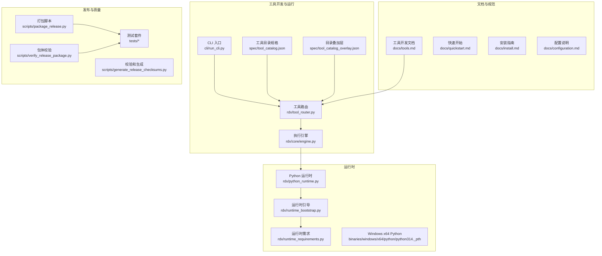
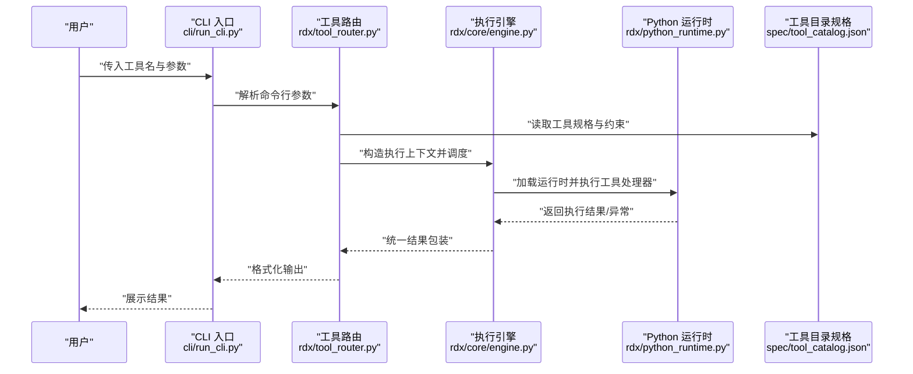
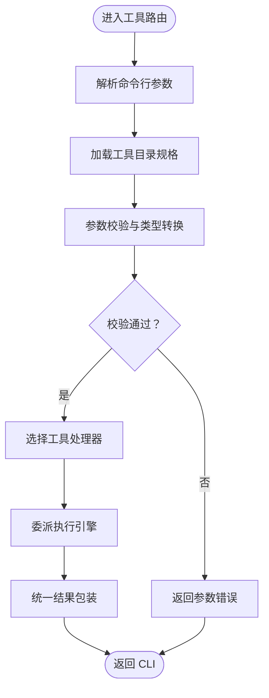
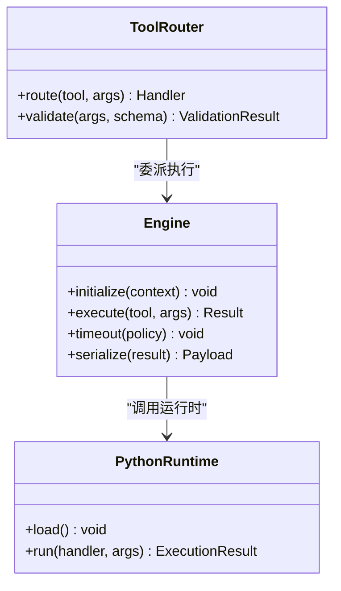
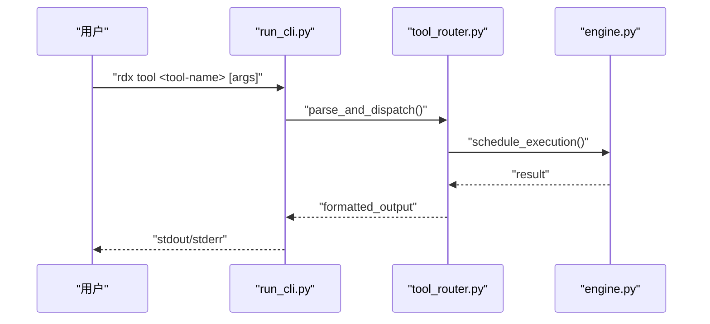
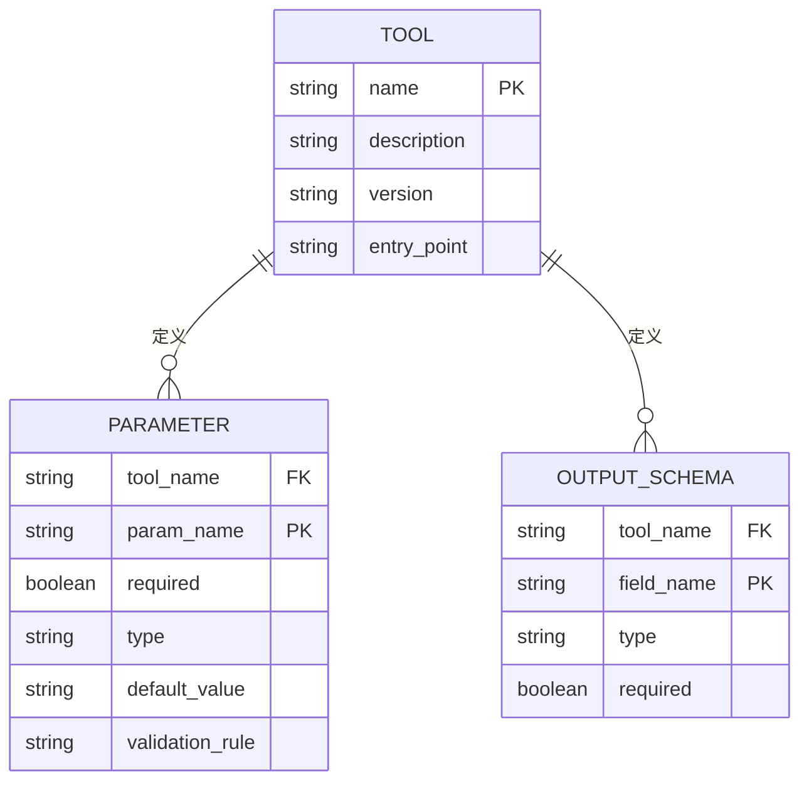
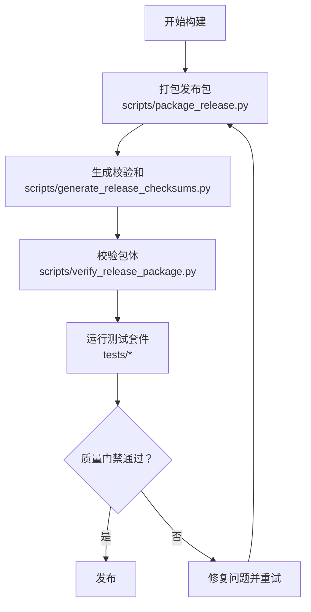
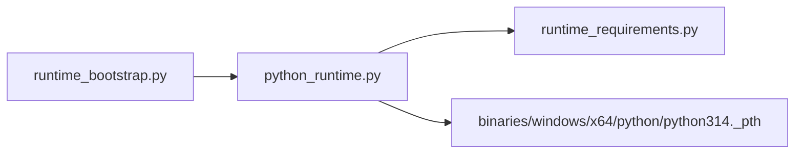
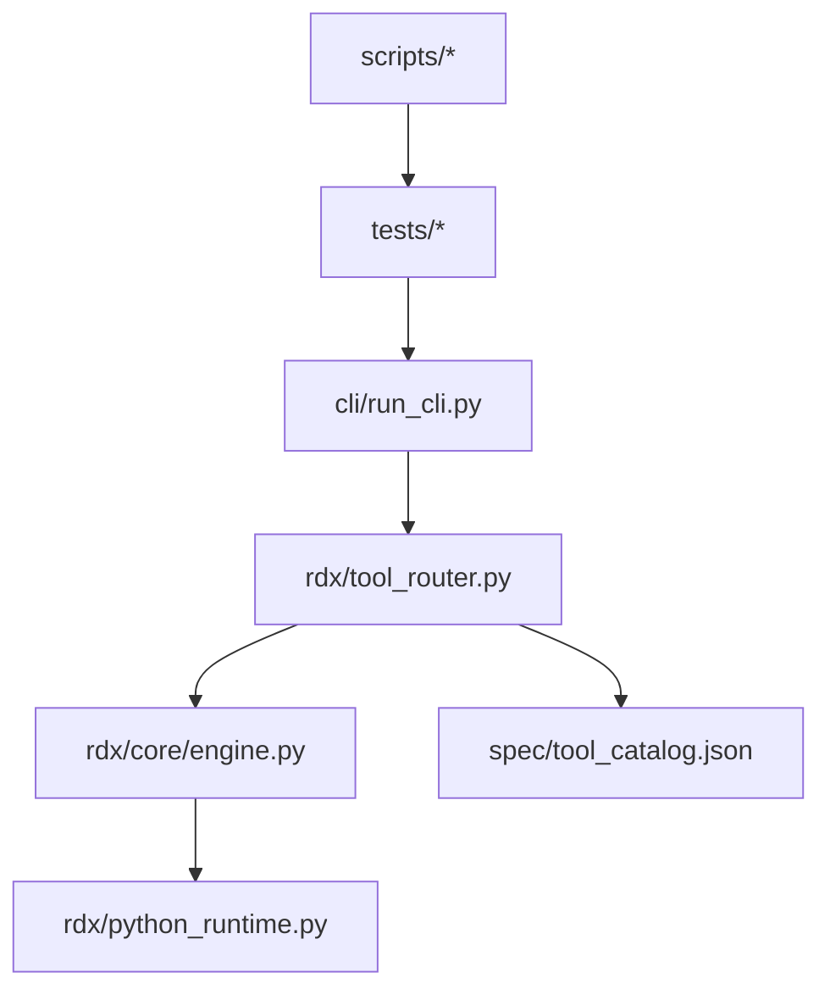

# 工具开发指南

<cite>
**本文档引用的文件**
- [README.md](file://README.md)
- [docs/tools.md](file://docs/tools.md)
- [docs/quickstart.md](file://docs/quickstart.md)
- [docs/install.md](file://docs/install.md)
- [docs/configuration.md](file://docs/configuration.md)
- [docs/troubleshooting.md](file://docs/troubleshooting.md)
- [rdx/tool_router.py](file://rdx/tool_router.py)
- [rdx/core/engine.py](file://rdx/core/engine.py)
- [cli/run_cli.py](file://cli/run_cli.py)
- [spec/tool_catalog.json](file://spec/tool_catalog.json)
- [spec/tool_catalog_overlay.json](file://spec/tool_catalog_overlay.json)
- [scripts/package_release.py](file://scripts/package_release.py)
- [scripts/generate_release_checksums.py](file://scripts/generate_release_checksums.py)
- [scripts/verify_release_package.py](file://scripts/verify_release_package.py)
- [tests/test_release_package.py](file://tests/test_release_package.py)
- [tests/test_package_runtime.py](file://tests/test_package_runtime.py)
- [rdx/python_runtime.py](file://rdx/python_runtime.py)
- [rdx/runtime_bootstrap.py](file://rdx/runtime_bootstrap.py)
- [rdx/runtime_requirements.py](file://rdx/runtime_requirements.py)
- [binaries/windows/x64/python/python314._pth](file://binaries/windows/x64/python/python314._pth)
</cite>

## 目录
1. [简介](#简介)
2. [项目结构](#项目结构)
3. [核心组件](#核心组件)
4. [架构总览](#架构总览)
5. [详细组件分析](#详细组件分析)
6. [依赖关系分析](#依赖关系分析)
7. [性能考虑](#性能考虑)
8. [故障排除指南](#故障排除指南)
9. [结论](#结论)
10. [附录](#附录)

## 简介
本指南面向希望为 RDX Agent Tools 平台开发自定义工具的工程师与测试人员。内容覆盖从工具开发流程、接口规范、实现模式到测试策略、调试技巧、性能优化、发布流程与版本管理等全生命周期实践。文档同时提供工具开发模板、代码示例路径与常见问题解决方案，并给出面向初学者的循序渐进学习路径。

## 项目结构
该仓库采用模块化组织方式，核心围绕“工具路由”“执行引擎”“CLI 运行时”“规格目录”“脚本打包与校验”“测试套件”展开。关键目录与职责如下：
- rdx：平台核心逻辑（工具路由、执行引擎、运行时、模型等）
- cli：命令行入口与运行 CLI 的封装
- docs：官方文档（工具开发、快速开始、安装、配置、故障排除等）
- spec：工具目录规格与叠加层（用于声明工具能力、参数、输出格式等）
- scripts：发布与质量门禁脚本（打包、校验、生成校验和）
- tests：端到端与单元测试，保障发布质量
- binaries：预编译运行时二进制与 Python 运行时资源（Windows x64）

**图表来源**
- [rdx/tool_router.py](file://rdx/tool_router.py)
- [rdx/core/engine.py](file://rdx/core/engine.py)
- [cli/run_cli.py](file://cli/run_cli.py)
- [spec/tool_catalog.json](file://spec/tool_catalog.json)
- [spec/tool_catalog_overlay.json](file://spec/tool_catalog_overlay.json)
- [scripts/package_release.py](file://scripts/package_release.py)
- [scripts/generate_release_checksums.py](file://scripts/generate_release_checksums.py)
- [scripts/verify_release_package.py](file://scripts/verify_release_package.py)
- [tests/test_release_package.py](file://tests/test_release_package.py)
- [rdx/python_runtime.py](file://rdx/python_runtime.py)
- [rdx/runtime_bootstrap.py](file://rdx/runtime_bootstrap.py)
- [rdx/runtime_requirements.py](file://rdx/runtime_requirements.py)
- [binaries/windows/x64/python/python314._pth](file://binaries/windows/x64/python/python314._pth)

**章节来源**
- [README.md](file://README.md)
- [docs/tools.md](file://docs/tools.md)
- [docs/quickstart.md](file://docs/quickstart.md)
- [docs/install.md](file://docs/install.md)
- [docs/configuration.md](file://docs/configuration.md)

## 核心组件
- 工具路由（Tool Router）：负责根据工具名称与参数选择具体工具处理器，协调参数解析与结果返回。
- 执行引擎（Engine）：封装工具执行上下文、超时控制、错误处理与结果序列化。
- CLI 入口（run_cli.py）：提供命令行调用入口，解析用户输入并委派给工具路由。
- 工具目录规格（tool_catalog.json / overlay）：声明工具清单、参数约束、输出格式与兼容性要求。
- 发布脚本（package_release.py、generate_release_checksums.py、verify_release_package.py）：自动化打包、生成校验和与验证发布包完整性。
- 测试套件（tests/*）：覆盖发布包、运行时打包、工具集成等场景。
- Python 运行时与引导（python_runtime.py、runtime_bootstrap.py、runtime_requirements.py）：提供可移植的 Python 运行环境与引导逻辑，支持 Windows x64 预编译二进制。

**章节来源**
- [rdx/tool_router.py](file://rdx/tool_router.py)
- [rdx/core/engine.py](file://rdx/core/engine.py)
- [cli/run_cli.py](file://cli/run_cli.py)
- [spec/tool_catalog.json](file://spec/tool_catalog.json)
- [spec/tool_catalog_overlay.json](file://spec/tool_catalog_overlay.json)
- [scripts/package_release.py](file://scripts/package_release.py)
- [scripts/generate_release_checksums.py](file://scripts/generate_release_checksums.py)
- [scripts/verify_release_package.py](file://scripts/verify_release_package.py)
- [tests/test_release_package.py](file://tests/test_release_package.py)
- [rdx/python_runtime.py](file://rdx/python_runtime.py)
- [rdx/runtime_bootstrap.py](file://rdx/runtime_bootstrap.py)
- [rdx/runtime_requirements.py](file://rdx/runtime_requirements.py)

## 架构总览
下图展示了从 CLI 到工具路由、执行引擎与运行时的整体调用链路，以及规格目录对工具行为的约束作用。

**图表来源**
- [cli/run_cli.py](file://cli/run_cli.py)
- [rdx/tool_router.py](file://rdx/tool_router.py)
- [rdx/core/engine.py](file://rdx/core/engine.py)
- [rdx/python_runtime.py](file://rdx/python_runtime.py)
- [spec/tool_catalog.json](file://spec/tool_catalog.json)

## 详细组件分析

### 工具路由（Tool Router）
- 职责：根据工具标识与参数映射到具体处理器；进行参数校验与类型转换；统一结果格式化与错误传播。
- 关键点：
  - 工具注册与发现：通过工具目录规格动态加载可用工具清单。
  - 参数接收：支持位置参数、命名参数与标志位；参数类型与必填性由规格约束。
  - 返回值格式：统一为结构化结果对象，包含状态码、数据载荷与错误信息。
  - 安全与隔离：限制工具访问范围，避免越权操作。

**图表来源**
- [rdx/tool_router.py](file://rdx/tool_router.py)
- [spec/tool_catalog.json](file://spec/tool_catalog.json)

**章节来源**
- [rdx/tool_router.py](file://rdx/tool_router.py)
- [spec/tool_catalog.json](file://spec/tool_catalog.json)

### 执行引擎（Engine）
- 职责：管理工具执行生命周期，包括上下文初始化、超时控制、异常捕获与结果序列化。
- 关键点：
  - 上下文隔离：为每个工具创建独立执行上下文，避免全局污染。
  - 超时策略：基于工具规格或默认策略设置超时时间，防止长时间阻塞。
  - 错误处理：捕获工具内部异常，转换为标准错误响应，保留堆栈信息以便调试。
  - 结果序列化：确保返回值符合预期格式，便于上层消费。

**图表来源**
- [rdx/core/engine.py](file://rdx/core/engine.py)
- [rdx/tool_router.py](file://rdx/tool_router.py)
- [rdx/python_runtime.py](file://rdx/python_runtime.py)

**章节来源**
- [rdx/core/engine.py](file://rdx/core/engine.py)
- [rdx/python_runtime.py](file://rdx/python_runtime.py)

### CLI 入口（run_cli.py）
- 职责：作为用户交互入口，解析命令行参数，调用工具路由并输出结果。
- 关键点：
  - 参数解析：支持子命令、选项与参数分组。
  - 输出控制：根据日志级别与格式化选项调整输出样式。
  - 异常透传：将底层异常转换为用户友好的提示信息。

**图表来源**
- [cli/run_cli.py](file://cli/run_cli.py)
- [rdx/tool_router.py](file://rdx/tool_router.py)
- [rdx/core/engine.py](file://rdx/core/engine.py)

**章节来源**
- [cli/run_cli.py](file://cli/run_cli.py)

### 工具目录规格（tool_catalog.json / overlay）
- 职责：以 JSON 规格声明工具清单、参数约束、输出格式与兼容性要求。
- 关键点：
  - 工具元数据：名称、描述、版本、入口点、依赖项。
  - 参数模式：必填、类型、默认值、取值范围与校验规则。
  - 输出模式：字段定义、数据类型与示例。
  - 叠加层：允许在不同环境或版本中覆盖默认规格，保证兼容性。

**图表来源**
- [spec/tool_catalog.json](file://spec/tool_catalog.json)
- [spec/tool_catalog_overlay.json](file://spec/tool_catalog_overlay.json)

**章节来源**
- [spec/tool_catalog.json](file://spec/tool_catalog.json)
- [spec/tool_catalog_overlay.json](file://spec/tool_catalog_overlay.json)

### 发布与质量门禁（scripts/*）
- 职责：自动化打包、生成校验和与验证发布包完整性，确保跨平台一致性。
- 关键点：
  - 包装流程：收集运行时、工具与文档，按平台归档。
  - 校验和：对发布包生成哈希，便于下载后验证。
  - 校验脚本：检查包内文件完整性、签名与版本信息。
  - 测试联动：与测试套件配合，确保发布包满足质量门槛。

**图表来源**
- [scripts/package_release.py](file://scripts/package_release.py)
- [scripts/generate_release_checksums.py](file://scripts/generate_release_checksums.py)
- [scripts/verify_release_package.py](file://scripts/verify_release_package.py)
- [tests/test_release_package.py](file://tests/test_release_package.py)

**章节来源**
- [scripts/package_release.py](file://scripts/package_release.py)
- [scripts/generate_release_checksums.py](file://scripts/generate_release_checksums.py)
- [scripts/verify_release_package.py](file://scripts/verify_release_package.py)
- [tests/test_release_package.py](file://tests/test_release_package.py)

### Python 运行时与引导（python_runtime.py / runtime_bootstrap.py / runtime_requirements.py）
- 职责：提供可移植的 Python 运行环境与引导逻辑，支持 Windows x64 预编译二进制。
- 关键点：
  - 运行时加载：根据平台选择合适的 Python 解释器与库。
  - 引导程序：初始化运行时环境变量与模块路径。
  - 依赖管理：声明运行时所需模块与版本，确保工具可复现执行。

**图表来源**
- [rdx/runtime_bootstrap.py](file://rdx/runtime_bootstrap.py)
- [rdx/python_runtime.py](file://rdx/python_runtime.py)
- [rdx/runtime_requirements.py](file://rdx/runtime_requirements.py)
- [binaries/windows/x64/python/python314._pth](file://binaries/windows/x64/python/python314._pth)

**章节来源**
- [rdx/runtime_bootstrap.py](file://rdx/runtime_bootstrap.py)
- [rdx/python_runtime.py](file://rdx/python_runtime.py)
- [rdx/runtime_requirements.py](file://rdx/runtime_requirements.py)
- [binaries/windows/x64/python/python314._pth](file://binaries/windows/x64/python/python314._pth)

## 依赖关系分析
- 组件耦合：
  - CLI 仅依赖工具路由；工具路由依赖执行引擎与规格目录；执行引擎依赖运行时。
  - 发布脚本与测试套件独立于核心运行时，但与发布产物强关联。
- 外部依赖：
  - Windows x64 平台使用预编译 Python 运行时，减少环境差异。
  - 规格目录作为契约，约束工具实现与消费者行为。

**图表来源**
- [cli/run_cli.py](file://cli/run_cli.py)
- [rdx/tool_router.py](file://rdx/tool_router.py)
- [rdx/core/engine.py](file://rdx/core/engine.py)
- [rdx/python_runtime.py](file://rdx/python_runtime.py)
- [spec/tool_catalog.json](file://spec/tool_catalog.json)
- [scripts/package_release.py](file://scripts/package_release.py)
- [tests/test_release_package.py](file://tests/test_release_package.py)

**章节来源**
- [cli/run_cli.py](file://cli/run_cli.py)
- [rdx/tool_router.py](file://rdx/tool_router.py)
- [rdx/core/engine.py](file://rdx/core/engine.py)
- [rdx/python_runtime.py](file://rdx/python_runtime.py)
- [spec/tool_catalog.json](file://spec/tool_catalog.json)
- [scripts/package_release.py](file://scripts/package_release.py)
- [tests/test_release_package.py](file://tests/test_release_package.py)

## 性能考虑
- 工具执行超时：通过执行引擎的超时策略限制单次工具运行时间，避免阻塞。
- 运行时复用：在多工具并发场景下，尽量复用已初始化的运行时实例，降低启动开销。
- 结果缓存：对重复且稳定的工具输出进行缓存，减少重复计算。
- I/O 优化：合理使用流式处理与批量操作，避免大对象频繁拷贝。
- 平台适配：针对 Windows x64 使用预编译运行时，减少环境准备时间。

## 故障排除指南
- 常见问题与定位：
  - 参数错误：检查工具目录规格中的参数定义与必填项，确认 CLI 输入是否匹配。
  - 工具未找到：核对工具名称与规格清单，确认工具入口点正确。
  - 运行时加载失败：检查运行时引导与依赖声明，确保模块路径与版本一致。
  - 发布包校验失败：使用校验脚本逐项比对，确认文件完整性与签名。
- 调试技巧：
  - 启用详细日志：通过 CLI 的日志级别选项输出更详细的执行轨迹。
  - 单步验证：使用最小化参数集与简单工具先行验证流程。
  - 回归测试：结合测试套件运行关键场景，确保修复不引入新问题。

**章节来源**
- [docs/troubleshooting.md](file://docs/troubleshooting.md)
- [cli/run_cli.py](file://cli/run_cli.py)
- [rdx/tool_router.py](file://rdx/tool_router.py)
- [rdx/core/engine.py](file://rdx/core/engine.py)
- [scripts/verify_release_package.py](file://scripts/verify_release_package.py)
- [tests/test_release_package.py](file://tests/test_release_package.py)

## 结论
本指南系统阐述了 RDX Agent Tools 平台的工具开发方法论与工程实践。通过规范化的工具目录规格、清晰的路由与执行引擎设计、完善的发布与测试体系，开发者可以高效地实现、验证与交付高质量工具。建议在实践中遵循“先规格、后实现、再测试”的流程，并持续关注性能与兼容性。

## 附录

### 工具开发模板（步骤指引）
- 步骤 1：在工具目录规格中新增工具条目，定义名称、版本、入口点与参数模式。
- 步骤 2：实现工具处理器函数，遵循参数接收与返回值格式约定。
- 步骤 3：编写单元测试与集成测试，覆盖正常路径与边界条件。
- 步骤 4：本地运行 CLI 验证参数解析与输出格式。
- 步骤 5：更新发布脚本与校验规则，确保打包流程自动化。
- 步骤 6：运行质量门禁测试，通过后发布新版本。

**章节来源**
- [spec/tool_catalog.json](file://spec/tool_catalog.json)
- [docs/tools.md](file://docs/tools.md)
- [tests/test_release_package.py](file://tests/test_release_package.py)

### 接口规范与实现模式
- 参数接收：
  - 必填参数必须在规格中标注；可选参数提供默认值。
  - 支持布尔、字符串、数值与数组等常见类型。
- 返回值格式：
  - 统一包含状态码、消息与数据载荷；错误时包含堆栈信息。
- 实现模式：
  - 处理器应幂等、无副作用优先；对有副作用的操作需明确前置条件与回滚策略。

**章节来源**
- [spec/tool_catalog.json](file://spec/tool_catalog.json)
- [rdx/tool_router.py](file://rdx/tool_router.py)
- [rdx/core/engine.py](file://rdx/core/engine.py)

### 测试策略与调试技巧
- 测试策略：
  - 单元测试：覆盖处理器核心逻辑与边界条件。
  - 集成测试：验证 CLI → 路由 → 引擎 → 运行时的完整链路。
  - 发布测试：使用发布脚本与校验脚本验证包体完整性。
- 调试技巧：
  - 使用最小化输入复现问题。
  - 分阶段断点：在 CLI、路由、引擎与运行时分别设置断点。
  - 日志分级：区分 INFO/WARN/ERROR，便于快速定位。

**章节来源**
- [tests/test_release_package.py](file://tests/test_release_package.py)
- [tests/test_package_runtime.py](file://tests/test_package_runtime.py)
- [cli/run_cli.py](file://cli/run_cli.py)
- [rdx/tool_router.py](file://rdx/tool_router.py)
- [rdx/core/engine.py](file://rdx/core/engine.py)

### 版本管理与兼容性
- 版本管理：
  - 工具版本与平台版本解耦，通过规格中的版本号与兼容性声明控制升级策略。
- 兼容性：
  - 使用叠加层覆盖特定环境的规格差异，保证多平台一致性。
  - 对破坏性变更提供迁移指南与过渡期策略。

**章节来源**
- [spec/tool_catalog.json](file://spec/tool_catalog.json)
- [spec/tool_catalog_overlay.json](file://spec/tool_catalog_overlay.json)
- [docs/compatibility-notes.md](file://docs/compatibility-notes.md)

### 学习路径（面向初学者）
- 第 1 天：阅读快速开始与安装指南，搭建本地开发环境。
- 第 2 天：阅读工具开发文档，理解规格与路由机制。
- 第 3 天：实现第一个简单工具，编写最小测试用例。
- 第 4 天：接入 CLI 并运行本地验证，修复常见问题。
- 第 5 天：完善规格、补充测试与发布脚本，完成一次小版本发布。

**章节来源**
- [docs/quickstart.md](file://docs/quickstart.md)
- [docs/install.md](file://docs/install.md)
- [docs/tools.md](file://docs/tools.md)