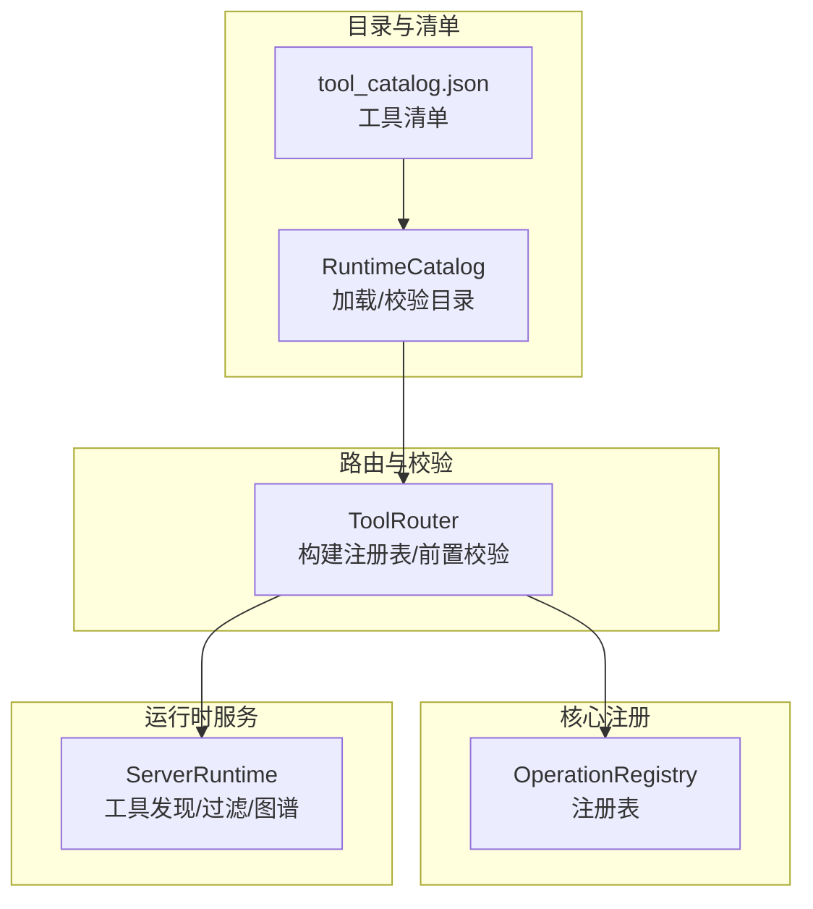
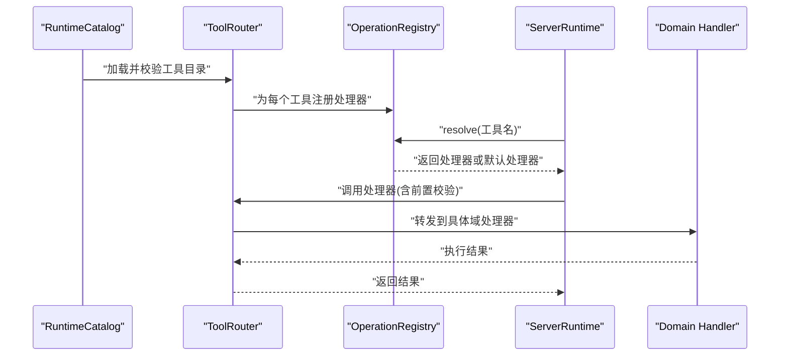
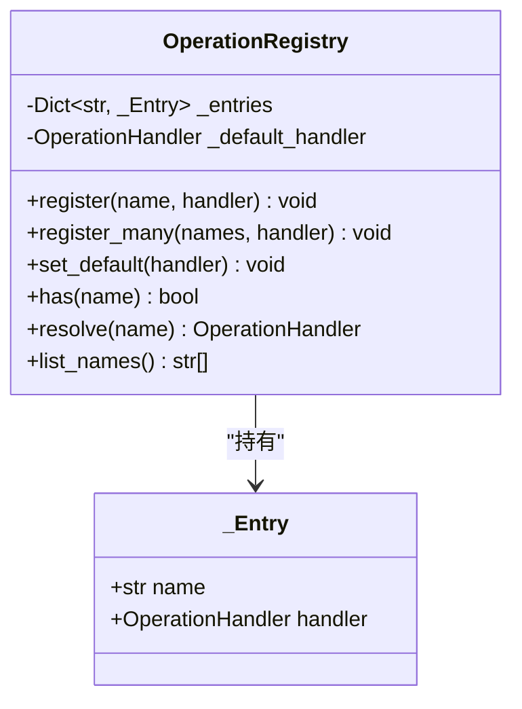
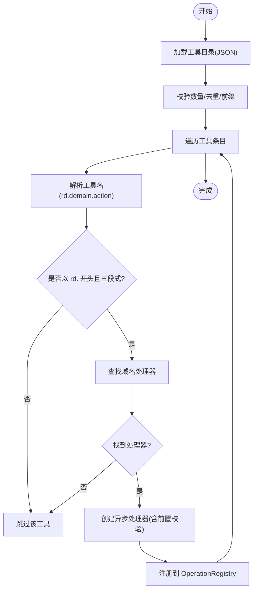
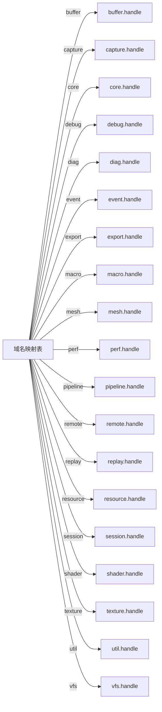
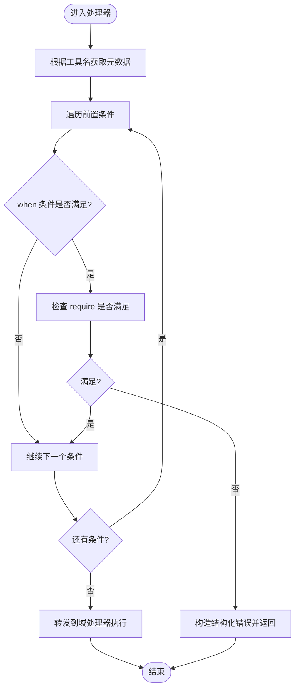
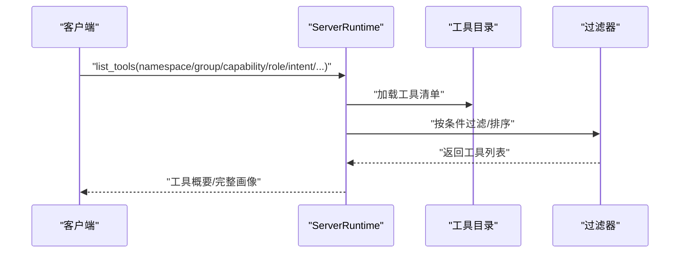
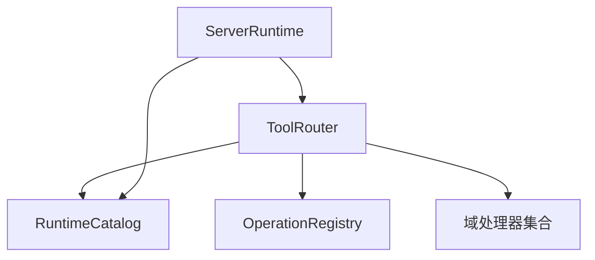

# 工具注册机制

<cite>
**本文引用的文件**
- [operation_registry.py](file://rdx/core/operation_registry.py)
- [tool_router.py](file://rdx/tool_router.py)
- [server_runtime.py](file://rdx/server_runtime.py)
- [runtime_catalog.py](file://rdx/runtime_catalog.py)
- [tool_catalog.json](file://spec/tool_catalog.json)
</cite>

## 目录
1. [简介](#简介)
2. [项目结构](#项目结构)
3. [核心组件](#核心组件)
4. [架构总览](#架构总览)
5. [详细组件分析](#详细组件分析)
6. [依赖分析](#依赖分析)
7. [性能考虑](#性能考虑)
8. [故障排查指南](#故障排查指南)
9. [结论](#结论)
10. [附录](#附录)

## 简介
本文件系统性阐述工具注册机制的技术细节，重点围绕 OperationRegistry 类的工作原理展开，覆盖以下主题：
- 工具注册流程与生命周期管理
- 命名空间管理与工具名称规范（rd.x.y 格式）
- 域名映射与处理器绑定过程
- 服务发现与路由机制
- 错误处理与冲突解决策略
- 最佳实践与常见陷阱
- 注册示例与调试技巧

该机制以“工具目录”为数据源，通过构建操作注册表实现对统一命名空间工具的动态发现与路由，确保运行时按需加载与安全前置条件检查。

## 项目结构
与工具注册机制直接相关的模块与文件如下：
- rdx/core/operation_registry.py：定义统一的操作注册表与处理器类型
- rdx/tool_router.py：基于工具目录构建注册表、执行前置条件校验、进行域名到处理器的映射
- rdx/server_runtime.py：提供工具发现、过滤与图谱生成等能力
- rdx/runtime_catalog.py：加载与校验工具目录（JSON）文件
- spec/tool_catalog.json：工具目录清单（JSON）

图表来源
- [operation_registry.py:18-44](file://rdx/core/operation_registry.py#L18-L44)
- [tool_router.py:130-150](file://rdx/tool_router.py#L130-L150)
- [server_runtime.py:5929-5956](file://rdx/server_runtime.py#L5929-L5956)
- [runtime_catalog.py:16-28](file://rdx/runtime_catalog.py#L16-L28)
- [tool_catalog.json](file://spec/tool_catalog.json)

章节来源
- [operation_registry.py:1-45](file://rdx/core/operation_registry.py#L1-L45)
- [tool_router.py:1-151](file://rdx/tool_router.py#L1-L151)
- [server_runtime.py:5929-5956](file://rdx/server_runtime.py#L5929-L5956)
- [runtime_catalog.py:1-28](file://rdx/runtime_catalog.py#L1-L28)
- [tool_catalog.json](file://spec/tool_catalog.json)

## 核心组件
- OperationRegistry：统一的操作注册表，提供注册、默认处理器设置、存在性判断、解析与列举功能。
- ToolRouter：从工具目录构建注册表，执行前置条件校验，并将工具名称映射到对应域处理器。
- ServerRuntime：提供工具列表、搜索、图谱等查询能力，支持命名空间与属性过滤。
- RuntimeCatalog：负责加载与校验工具目录，确保唯一性、前缀合法性与数量一致性。
- tool_catalog.json：工具目录清单，包含工具元数据（名称、前置条件、能力等）。

章节来源
- [operation_registry.py:18-44](file://rdx/core/operation_registry.py#L18-L44)
- [tool_router.py:130-150](file://rdx/tool_router.py#L130-L150)
- [server_runtime.py:5929-5956](file://rdx/server_runtime.py#L5929-L5956)
- [runtime_catalog.py:16-28](file://rdx/runtime_catalog.py#L16-L28)
- [tool_catalog.json](file://spec/tool_catalog.json)

## 架构总览
工具注册机制采用“目录驱动 + 动态构建 + 路由转发”的架构模式：
- 目录加载：RuntimeCatalog 从 JSON 加载工具清单并进行基础校验
- 注册构建：ToolRouter 遍历工具条目，按 rd.<domain>.<action> 规范筛选并绑定处理器
- 运行时发现：ServerRuntime 提供 list/search/get 等接口，支持命名空间与属性过滤
- 执行路径：OperationRegistry 存储已注册工具与其处理器，ToolRouter 在调用前执行前置条件校验

图表来源
- [runtime_catalog.py:16-28](file://rdx/runtime_catalog.py#L16-L28)
- [tool_router.py:130-150](file://rdx/tool_router.py#L130-L150)
- [operation_registry.py:36-43](file://rdx/core/operation_registry.py#L36-L43)
- [server_runtime.py:5929-5956](file://rdx/server_runtime.py#L5929-L5956)

## 详细组件分析

### OperationRegistry 组件分析
- 设计要点
  - 使用字典存储工具名到处理器的映射，支持 O(1) 查找
  - 支持设置默认处理器，当工具未命中时回退
  - 提供批量注册、存在性判断与名称枚举
- 关键方法
  - register(name, handler)：注册单个工具
  - register_many(names, handler)：批量注册
  - set_default(handler)：设置默认处理器
  - has(name)：判断是否存在或有默认处理器
  - resolve(name)：解析处理器，优先精确匹配，否则回退默认处理器
  - list_names()：返回排序后的工具名列表
- 复杂度
  - 注册与解析均为哈希表操作，时间复杂度 O(1)，空间复杂度 O(N)

图表来源
- [operation_registry.py:12-44](file://rdx/core/operation_registry.py#L12-L44)

章节来源
- [operation_registry.py:18-44](file://rdx/core/operation_registry.py#L18-L44)

### 工具目录与构建流程
- 工具目录加载与校验
  - RuntimeCatalog 从 spec/tool_catalog.json 读取工具清单
  - 校验工具数量声明与实际数量一致
  - 检查工具名去重
  - 检查工具名必须以 “rd.” 开头
- 注册表构建
  - ToolRouter 遍历工具条目，按 “rd.<domain>.<action>” 解析
  - 若域名在内置映射中存在，则为该工具创建异步处理器
  - 处理器在执行前先进行前置条件校验，再转发给对应域处理器
- 命名空间与工具名规范
  - 工具名必须满足三段式且以 “rd.” 开头
  - 第二段为域名（domain），第三段为动作（action）
  - 仅当域名存在于映射表中时才注册

图表来源
- [runtime_catalog.py:16-28](file://rdx/runtime_catalog.py#L16-L28)
- [tool_router.py:130-150](file://rdx/tool_router.py#L130-L150)

章节来源
- [runtime_catalog.py:16-28](file://rdx/runtime_catalog.py#L16-L28)
- [tool_router.py:130-150](file://rdx/tool_router.py#L130-L150)

### 域名映射与处理器绑定
- 内置域名映射表包含多个域处理器（如 buffer/capture/core/debug/diag/event/export/macro/mesh/perf/pipeline/remote/replay/resource/session/shader/texture/util/vfs）
- 对于每个工具，若其域名存在于映射表中，则为其绑定对应的域处理器
- 绑定的处理器会先执行前置条件校验，再调用域处理器执行具体动作

图表来源
- [tool_router.py:33-53](file://rdx/tool_router.py#L33-L53)

章节来源
- [tool_router.py:33-53](file://rdx/tool_router.py#L33-L53)

### 前置条件校验与错误处理
- 前置条件来源：工具元数据中的 prerequisites 列表
- 校验逻辑
  - 解析每一条前置要求，结合 when 条件决定是否应用
  - 依据 require 的值检查上下文状态（如 capture_file_id、session_id、remote_id、active_event_id、capability.remote 等）
  - 若不满足，构造结构化错误响应（包含错误码、类别、详情等）
- 默认处理器回退
  - 若工具未命中，但设置了默认处理器，可作为兜底策略

图表来源
- [tool_router.py:111-127](file://rdx/tool_router.py#L111-L127)

章节来源
- [tool_router.py:63-127](file://rdx/tool_router.py#L63-L127)

### 服务发现与过滤
- 工具发现
  - list_tools：按命名空间、组、能力、角色、意图、是否变更状态等维度过滤
  - search_tools：支持关键词检索与排序
  - get_tool_graph：生成工具图谱（基于前置关系）
- 元数据字段
  - 工具目录中包含 name、prerequisites、capabilities、role、intents、mutates_state 等关键字段
  - 运行时服务据此生成概要或完整工具画像

图表来源
- [server_runtime.py:5929-5956](file://rdx/server_runtime.py#L5929-L5956)
- [server_runtime.py:6415-6451](file://rdx/server_runtime.py#L6415-L6451)

章节来源
- [server_runtime.py:5929-5956](file://rdx/server_runtime.py#L5929-L5956)
- [server_runtime.py:6415-6451](file://rdx/server_runtime.py#L6415-L6451)

## 依赖分析
- 模块耦合
  - ToolRouter 依赖 RuntimeCatalog（目录加载）、OperationRegistry（注册表）、各域处理器（转发）
  - ServerRuntime 依赖工具目录与过滤器，提供查询接口
  - OperationRegistry 为纯内存数据结构，低耦合
- 外部依赖
  - JSON 工具目录文件（spec/tool_catalog.json）
  - Python 异步运行时（用于处理器调用）

图表来源
- [tool_router.py:7-29](file://rdx/tool_router.py#L7-L29)
- [server_runtime.py:5929-5956](file://rdx/server_runtime.py#L5929-L5956)
- [runtime_catalog.py:16-28](file://rdx/runtime_catalog.py#L16-L28)

章节来源
- [tool_router.py:7-29](file://rdx/tool_router.py#L7-L29)
- [server_runtime.py:5929-5956](file://rdx/server_runtime.py#L5929-L5956)
- [runtime_catalog.py:16-28](file://rdx/runtime_catalog.py#L16-L28)

## 性能考虑
- 注册阶段
  - 目录加载与校验为一次性开销；注册表构建为线性扫描，时间复杂度 O(T)，T 为工具数
- 运行时
  - 解析处理器为哈希查找，O(1)
  - 前置条件检查为常量级上下文读取
- 内存占用
  - 注册表按工具名索引，内存占用与工具数线性相关
- 可扩展性
  - 新增域处理器只需扩展映射表
  - 新增工具只需在目录中添加条目并遵循命名规范

## 故障排查指南
- 工具未被注册
  - 检查工具名是否符合 rd.<domain>.<action> 且 domain 在映射表中
  - 确认工具目录加载成功且未触发校验异常
- 前置条件失败
  - 查看返回的结构化错误，确认缺失的前置项与原因
  - 检查上下文快照中相关状态是否满足要求
- 目录校验失败
  - 工具数量声明与实际数量不符
  - 存在重复工具名
  - 工具名前缀不符合 “rd.” 规范
- 调试技巧
  - 使用 list_tools 与 search_tools 获取当前可用工具集
  - 使用 get_tool_graph 查看工具间依赖关系
  - 在 ToolRouter 中临时打印工具名与域名映射，定位注册问题

章节来源
- [runtime_catalog.py:22-28](file://rdx/runtime_catalog.py#L22-L28)
- [tool_router.py:111-127](file://rdx/tool_router.py#L111-L127)
- [server_runtime.py:5929-5956](file://rdx/server_runtime.py#L5929-L5956)

## 结论
工具注册机制通过“目录驱动 + 动态构建 + 路由转发”的方式，实现了对统一命名空间工具的高效管理与安全执行。OperationRegistry 提供简洁稳定的注册与解析能力，ToolRouter 将工具目录与域处理器解耦，ServerRuntime 提供完善的发现与过滤能力。配合严格的目录校验与前置条件检查，整体机制具备良好的可维护性与可扩展性。

## 附录

### 工具名称规范与命名空间
- 规范格式：rd.<domain>.<action>
- 域名（domain）：必须在内置映射表中存在
- 动作（action）：具体操作语义
- 命名空间：rd.<domain> 即为工具的命名空间

章节来源
- [tool_router.py:134-136](file://rdx/tool_router.py#L134-L136)
- [runtime_catalog.py:26-27](file://rdx/runtime_catalog.py#L26-L27)

### 注册生命周期与最佳实践
- 生命周期
  - 初始化：加载工具目录并校验
  - 构建：遍历工具，按规范注册处理器
  - 运行：解析工具名，执行前置校验，转发到域处理器
- 最佳实践
  - 工具名严格遵循 rd.<domain>.<action>，避免拼写错误
  - 域名必须在映射表中，新增域需同步扩展映射
  - 前置条件应尽量轻量，避免阻塞注册流程
  - 使用 get_tool_graph 与 list_tools 定期验证注册状态
- 常见陷阱
  - 忘记在映射表中注册新域处理器
  - 工具名前缀或格式不正确导致被忽略
  - 目录中存在重复工具名或数量声明不一致
  - 前置条件过于严格导致工具无法执行

章节来源
- [tool_router.py:130-150](file://rdx/tool_router.py#L130-L150)
- [runtime_catalog.py:22-28](file://rdx/runtime_catalog.py#L22-L28)
- [server_runtime.py:5929-5956](file://rdx/server_runtime.py#L5929-L5956)