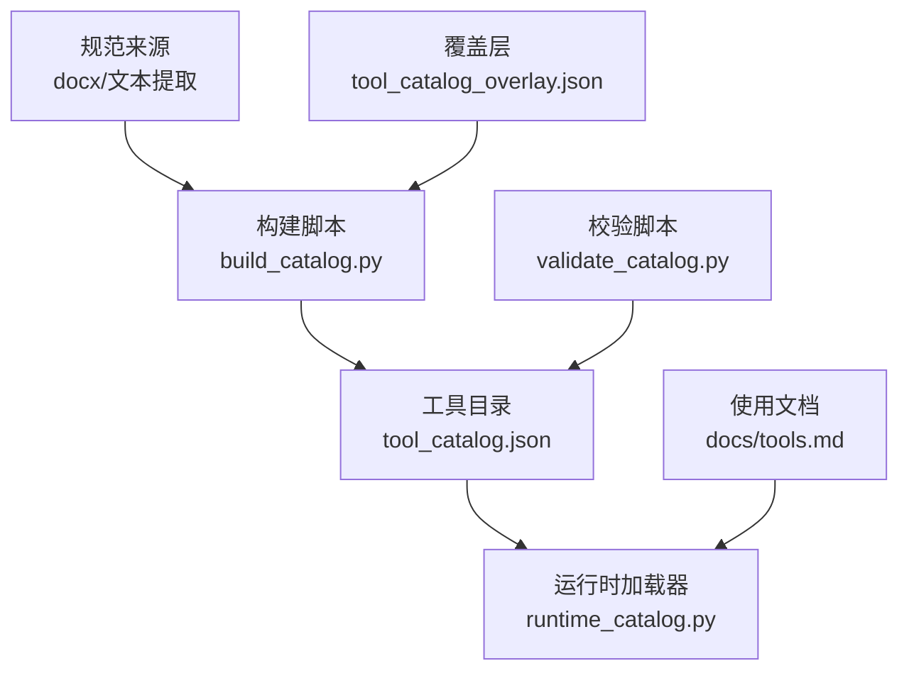
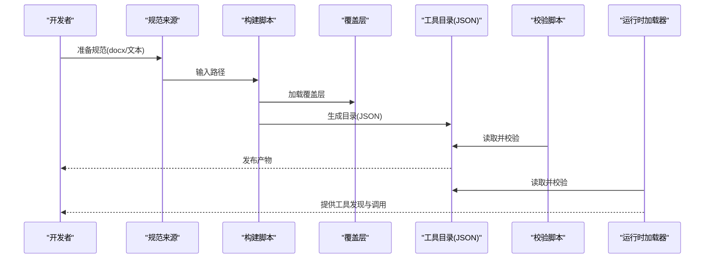
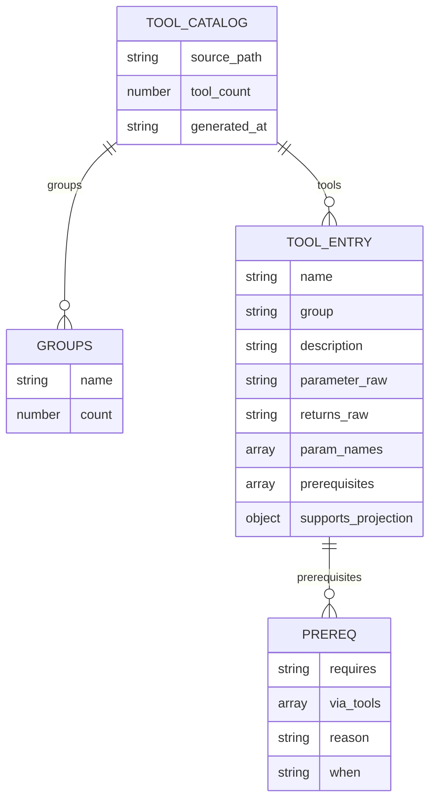
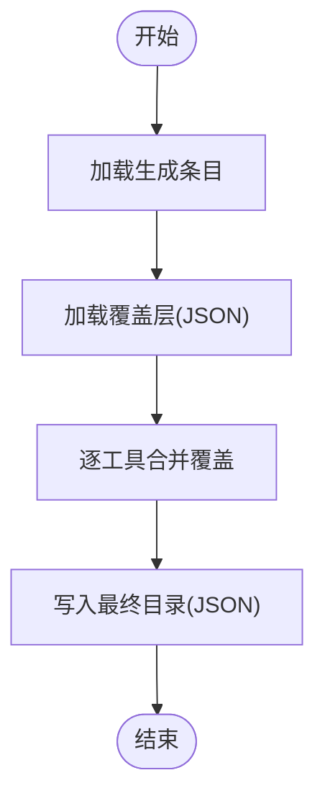
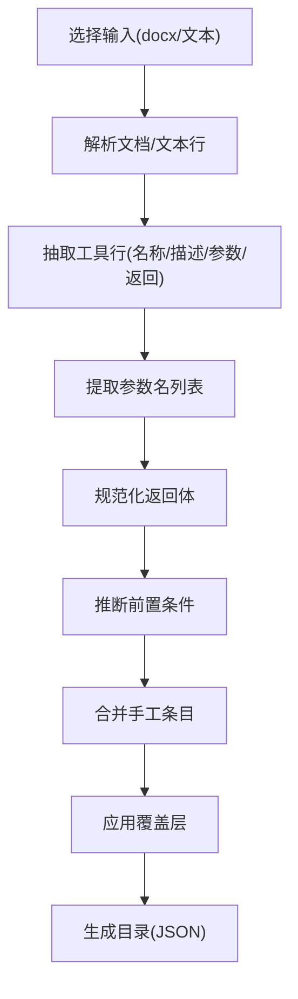
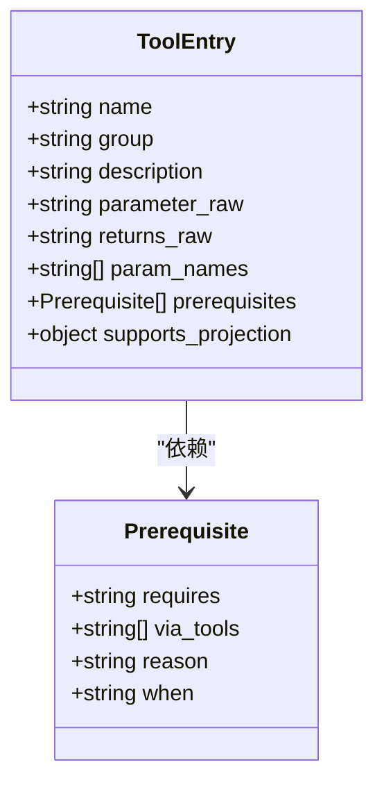
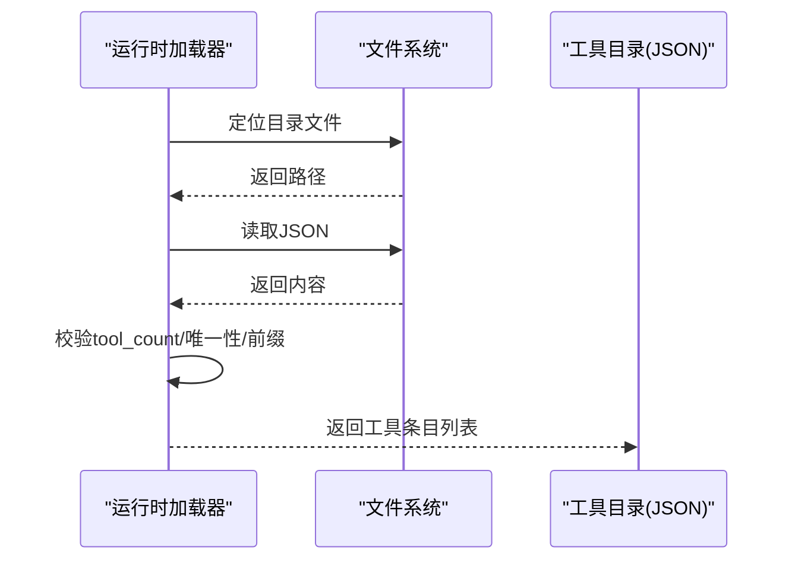
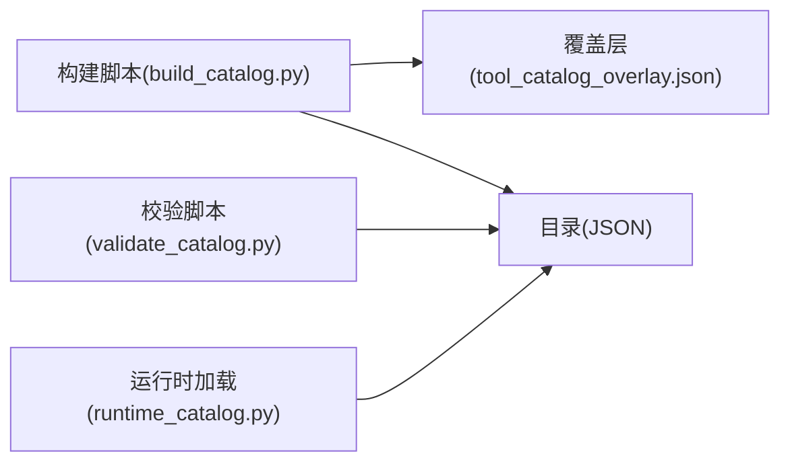

# 工具目录管理

<cite>
**本文引用的文件**
- [tool_catalog.json](file://spec/tool_catalog.json)
- [tool_catalog_overlay.json](file://spec/tool_catalog_overlay.json)
- [build_catalog.py](file://spec/build_catalog.py)
- [validate_catalog.py](file://spec/validate_catalog.py)
- [runtime_catalog.py](file://rdx/runtime_catalog.py)
- [tools.md](file://docs/tools.md)
- [README.md](file://README.md)
- [scripts/README.md](file://scripts/README.md)
</cite>

## 目录
1. [简介](#简介)
2. [项目结构](#项目结构)
3. [核心组件](#核心组件)
4. [架构总览](#架构总览)
5. [详细组件分析](#详细组件分析)
6. [依赖分析](#依赖分析)
7. [性能考虑](#性能考虑)
8. [故障排查指南](#故障排查指南)
9. [结论](#结论)
10. [附录](#附录)

## 简介
本文件系统化阐述工具目录管理的设计与实现，覆盖工具目录结构、元数据定义、目录构建流程、描述格式与参数规范、输出定义标准、覆盖机制、版本管理与增量更新策略、维护指南、验证规则与最佳实践，并提供目录编辑示例与自动化构建脚本使用方法。工具目录以 JSON 文件形式发布，面向 CLI 与上层代理（Agent）使用，确保工具发现、调用与验证的一致性。

## 项目结构
工具目录相关的核心位置与职责如下：
- 规范与生成
  - 规范来源：docx/文本提取的工具条目
  - 构建脚本：将规范转换为标准化的工具目录 JSON
  - 覆盖层：对生成结果进行局部修正与增强
  - 校验脚本：对最终目录进行可读性与模式校验
- 运行时消费
  - 运行时工具目录加载器：在运行时读取并校验目录完整性
- 文档与使用
  - 工具使用文档：说明目录用途、CLI 调用方式与投影输出约定

图表来源
- [build_catalog.py:411-465](file://spec/build_catalog.py#L411-L465)
- [validate_catalog.py:111-149](file://spec/validate_catalog.py#L111-L149)
- [runtime_catalog.py:16-28](file://rdx/runtime_catalog.py#L16-L28)
- [tools.md:1-27](file://docs/tools.md#L1-L27)

章节来源
- [build_catalog.py:1-494](file://spec/build_catalog.py#L1-L494)
- [validate_catalog.py:1-154](file://spec/validate_catalog.py#L1-L154)
- [runtime_catalog.py:1-29](file://rdx/runtime_catalog.py#L1-L29)
- [tools.md:1-27](file://docs/tools.md#L1-L27)

## 核心组件
- 工具目录 JSON 结构
  - 字段：source_path、tool_count、generated_at、groups、tools
  - groups：按组名计数，用于分类与浏览
  - tools：每项包含 name、group、description、parameter_raw、returns_raw、param_names、prerequisites、supports_projection（可选）
- 覆盖层 JSON
  - 通过 tools 映射对生成条目进行字段级覆盖，补充描述、参数与返回说明，以及前置条件
- 构建脚本
  - 支持 docx 与文本两种输入格式解析
  - 提取参数名、规范化返回体、推断前置条件、合并覆盖层、生成最终目录
- 校验脚本
  - 校验 source_path、groups、工具条目可读性
  - 校验 prerequisites 模式、去重与唯一性、工具名前缀与投影约束
- 运行时加载器
  - 从工具根目录定位目录文件，读取并做基础一致性检查（数量、重复、前缀）

章节来源
- [tool_catalog.json:1-800](file://spec/tool_catalog.json#L1-L800)
- [tool_catalog_overlay.json:1-177](file://spec/tool_catalog_overlay.json#L1-L177)
- [build_catalog.py:411-465](file://spec/build_catalog.py#L411-L465)
- [validate_catalog.py:63-108](file://spec/validate_catalog.py#L63-L108)
- [runtime_catalog.py:16-28](file://rdx/runtime_catalog.py#L16-L28)

## 架构总览
工具目录的生命周期由“构建—覆盖—校验—发布—运行时消费”构成，形成闭环的质量保障。

图表来源
- [build_catalog.py:411-465](file://spec/build_catalog.py#L411-L465)
- [validate_catalog.py:111-149](file://spec/validate_catalog.py#L111-L149)
- [runtime_catalog.py:16-28](file://rdx/runtime_catalog.py#L16-L28)

## 详细组件分析

### 工具目录 JSON 数据模型
- 全局字段
  - source_path：仓库相对路径，标识原始规范来源
  - tool_count：工具总数，用于一致性校验
  - generated_at：生成时间（UTC ISO 8601）
  - groups：分组计数字典
  - tools：工具条目数组
- 工具条目字段
  - name：工具唯一标识，前缀为 rd.
  - group：所属分组
  - description：工具功能简述
  - parameter_raw：参数说明（HTML 风格换行分隔）
  - returns_raw：返回体说明（HTML 风格换行分隔）
  - param_names：从 parameter_raw 抽取的参数名列表
  - prerequisites：前置条件数组
  - supports_projection：投影能力声明（如 tabular）
- 分组与命名规范
  - 分组键为中文标题+编号，如“3.x，模块名”
  - 工具名统一以 rd. 开头，避免歧义

图表来源
- [tool_catalog.json:1-800](file://spec/tool_catalog.json#L1-L800)
- [tool_catalog_overlay.json:1-177](file://spec/tool_catalog_overlay.json#L1-L177)

章节来源
- [tool_catalog.json:1-800](file://spec/tool_catalog.json#L1-L800)

### 覆盖层机制与增量更新
- 覆盖层作用
  - 对生成条目的字段进行局部覆盖，如 description、parameter_raw、returns_raw、prerequisites、supports_projection
  - 适用于无法直接从规范中提取或需要人工修正的条目
- 增量更新策略
  - 仅在必要时新增/修改覆盖项，避免全量重写
  - 通过工具名映射精准定位覆盖目标
- 构建流程中的应用
  - 构建脚本在生成初始条目后，加载覆盖层并逐条合并
  - 合并后保留原始条目其余字段，仅覆盖显式提供的键

图表来源
- [build_catalog.py:393-409](file://spec/build_catalog.py#L393-L409)
- [tool_catalog_overlay.json:1-177](file://spec/tool_catalog_overlay.json#L1-L177)

章节来源
- [build_catalog.py:355-409](file://spec/build_catalog.py#L355-L409)
- [tool_catalog_overlay.json:1-177](file://spec/tool_catalog_overlay.json#L1-L177)

### 目录构建流程
- 输入解析
  - docx：解析 word/document.xml，按段落与表格抽取工具行
  - 文本：按行号与正则匹配抽取工具行
- 元数据处理
  - 提取参数名列表（param_names）
  - 规范化返回体（returns_raw），保证 data、error、meta 等字段齐备
  - 推断前置条件（prerequisites），依据参数名与工具命名规则
- 手工条目
  - 在构建脚本中维护一组手工条目，用于补充缺失或特殊工具
- 输出与归档
  - 写入工具目录 JSON，记录 source_path、tool_count、generated_at、groups

图表来源
- [build_catalog.py:247-345](file://spec/build_catalog.py#L247-L345)
- [build_catalog.py:411-465](file://spec/build_catalog.py#L411-L465)

章节来源
- [build_catalog.py:197-345](file://spec/build_catalog.py#L197-L345)
- [build_catalog.py:411-465](file://spec/build_catalog.py#L411-L465)

### 工具描述格式、参数规范与输出定义
- 描述格式
  - 使用自然语言描述工具职责与边界
  - 覆盖层可对生成描述进行优化与补充
- 参数规范
  - parameter_raw 采用 HTML 风格换行分隔，每行形如“参数名(类型, 可选/必填, 默认值?): 说明”
  - 构建脚本从 parameter_raw 中抽取出 param_names，用于前置条件推断与投影校验
- 返回定义
  - returns_raw 统一包含 ok、data、artifacts、error、meta、projections（可选）
  - 构建脚本会规范化返回体，确保字段齐备
- 投影能力
  - supports_projection 用于声明工具支持的投影类型（如 tabular）
  - 校验脚本要求投影工具在 param_names 中包含对应参数名

章节来源
- [tool_catalog.json:24-360](file://spec/tool_catalog.json#L24-L360)
- [tool_catalog_overlay.json:3-177](file://spec/tool_catalog_overlay.json#L3-L177)
- [build_catalog.py:197-240](file://spec/build_catalog.py#L197-L240)
- [validate_catalog.py:100-108](file://spec/validate_catalog.py#L100-L108)

### 前置条件与依赖关系
- 前置条件模型
  - requires：依赖的状态令牌（如 capture_file_id、session_id、remote_id、capability.remote）
  - via_tools：触发该前置所需的工具集合
  - when：条件表达式（如 options.remote_id_present）
  - reason：原因说明
- 推断规则
  - 基于参数名与工具命名推断常见前置
  - 远程工具额外推断 capability.remote 前置
- 校验规则
  - prerequisites 必须为非空对象数组
  - requires 与 when 必须在允许集合内
  - via_tools 必须非空且引用的工具名存在于目录中
  - 不允许自引用与重复声明

图表来源
- [build_catalog.py:178-194](file://spec/build_catalog.py#L178-L194)
- [validate_catalog.py:71-108](file://spec/validate_catalog.py#L71-L108)

章节来源
- [build_catalog.py:367-391](file://spec/build_catalog.py#L367-L391)
- [validate_catalog.py:71-108](file://spec/validate_catalog.py#L71-L108)

### 运行时消费与一致性校验
- 运行时加载
  - 通过工具根目录定位目录文件，读取 JSON
  - 校验 tool_count 与条目数量一致
  - 校验工具名唯一性与前缀合法性
- 与构建/校验流程的关系
  - 构建阶段生成目录并写入 source_path、generated_at、groups
  - 校验阶段确保 schema 正确与可读性良好
  - 运行时加载器承担最终一致性把关

图表来源
- [runtime_catalog.py:16-28](file://rdx/runtime_catalog.py#L16-L28)

章节来源
- [runtime_catalog.py:16-28](file://rdx/runtime_catalog.py#L16-L28)

### 维护指南与最佳实践
- 维护流程
  - 更新规范来源（docx/文本）后，运行构建脚本生成目录
  - 如需局部修正，仅在覆盖层添加/修改对应工具项
  - 运行校验脚本确保目录通过可读性与模式校验
  - 将最终目录纳入版本控制并发布
- 最佳实践
  - parameter_raw 与 returns_raw 保持一致的结构化风格
  - prerequisites 清晰、可执行、避免循环依赖
  - supports_projection 仅在工具确实支持时声明
  - 手工条目尽量精简，优先通过规范与覆盖层解决

章节来源
- [build_catalog.py:411-465](file://spec/build_catalog.py#L411-L465)
- [validate_catalog.py:111-149](file://spec/validate_catalog.py#L111-L149)
- [tools.md:1-27](file://docs/tools.md#L1-L27)

### 目录编辑示例
- 示例：为某工具补充描述与返回说明
  - 在覆盖层的 tools 映射中添加该工具名
  - 仅提供需要覆盖的字段（如 description、returns_raw）
  - 保存后重新构建并校验
- 示例：为某工具增加前置条件
  - 在覆盖层中追加 prerequisites 条目
  - 确保 via_tools 引用的工具名存在于目录中
- 示例：声明投影能力
  - 在覆盖层中为工具添加 supports_projection
  - 确保 param_names 包含投影参数名

章节来源
- [tool_catalog_overlay.json:1-177](file://spec/tool_catalog_overlay.json#L1-L177)
- [build_catalog.py:393-409](file://spec/build_catalog.py#L393-L409)

### 自动化构建脚本使用
- 构建脚本
  - 功能：将规范转换为工具目录 JSON
  - 用法：指定 source 与 out 参数，默认读取仓库内的提取文本
  - 行为：解析 docx/文本 → 抽取条目 → 规范化 → 合并覆盖层 → 写入输出
- 校验脚本
  - 功能：对目录进行可读性与模式校验
  - 用法：直接运行，读取 spec/tool_catalog.json
  - 行为：检查 source_path、groups、工具条目可读性；校验 prerequisites、投影约束；统计工具数量与唯一性
- 使用建议
  - 在 CI 中集成校验步骤，确保目录质量
  - 本地开发时先构建再校验，避免反复迭代

章节来源
- [build_catalog.py:468-494](file://spec/build_catalog.py#L468-L494)
- [validate_catalog.py:111-154](file://spec/validate_catalog.py#L111-L154)
- [scripts/README.md:1-25](file://scripts/README.md#L1-L25)

## 依赖分析
- 组件耦合
  - 构建脚本依赖覆盖层与规范来源，输出目录 JSON
  - 校验脚本依赖目录 JSON，负责模式与可读性校验
  - 运行时加载器依赖目录 JSON，负责一致性校验
- 外部依赖
  - docx 解析依赖 Python zipfile 与 ElementTree
  - JSON 读写依赖内置 json 模块
- 循环依赖
  - 三者之间无循环依赖，职责清晰分离

图表来源
- [build_catalog.py:1-494](file://spec/build_catalog.py#L1-L494)
- [validate_catalog.py:1-154](file://spec/validate_catalog.py#L1-L154)
- [runtime_catalog.py:1-29](file://rdx/runtime_catalog.py#L1-L29)

章节来源
- [build_catalog.py:1-494](file://spec/build_catalog.py#L1-L494)
- [validate_catalog.py:1-154](file://spec/validate_catalog.py#L1-L154)
- [runtime_catalog.py:1-29](file://rdx/runtime_catalog.py#L1-L29)

## 性能考虑
- 构建阶段
  - docx 解析涉及 ZIP 解包与 XML 解析，建议在 CI 中缓存中间产物
  - 文本解析线性扫描，复杂度与行数线性相关
- 校验阶段
  - JSON 读取与遍历，复杂度与工具数量线性相关
  - 建议在本地开发时仅对变更部分运行校验
- 运行时加载
  - 目录文件体积较小，读取与解析开销可忽略
  - 建议在运行时缓存已加载的目录，避免重复 IO

## 故障排查指南
- 常见问题与定位
  - source_path 非仓库相对路径：校验脚本报错，修正为相对路径
  - groups 为空或不可读：检查中文编码与占位符，修复标签
  - prerequisites 非对象或 via_tools 为空：修正为合法对象并补全引用工具
  - supports_projection 未声明投影参数：在 param_names 中添加对应参数
  - 工具名重复或前缀非法：去重并确保以 rd. 开头
- 处理步骤
  - 优先运行校验脚本，按提示逐项修复
  - 重新运行构建脚本生成新目录
  - 再次运行校验脚本确认通过
  - 提交修复并更新发布

章节来源
- [validate_catalog.py:34-108](file://spec/validate_catalog.py#L34-L108)

## 结论
工具目录管理通过“构建—覆盖—校验—发布—运行时消费”的闭环流程，确保了工具元数据的准确性、一致性与可维护性。借助覆盖层与校验脚本，团队可以在不破坏整体结构的前提下进行局部修正与增量更新。配合运行时加载器的一致性校验，工具目录成为 CLI 与代理稳定调用的基础。

## 附录
- 使用参考
  - 工具目录用途与 CLI 调用方式参见使用文档
  - 文档中提供了工具发现、上下文操作与 VFS 导航的示例命令
- 版本与发布
  - 目录包含 generated_at 与 source_path，便于追踪版本与来源
  - 建议在每次重大变更后更新生成时间并提交变更

章节来源
- [tools.md:1-27](file://docs/tools.md#L1-L27)
- [README.md:1-200](file://README.md#L1-L200)