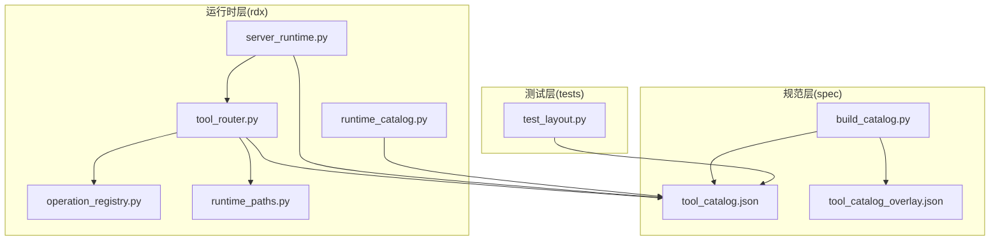
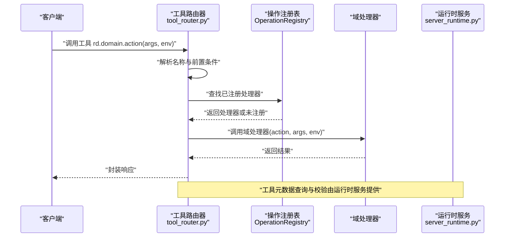
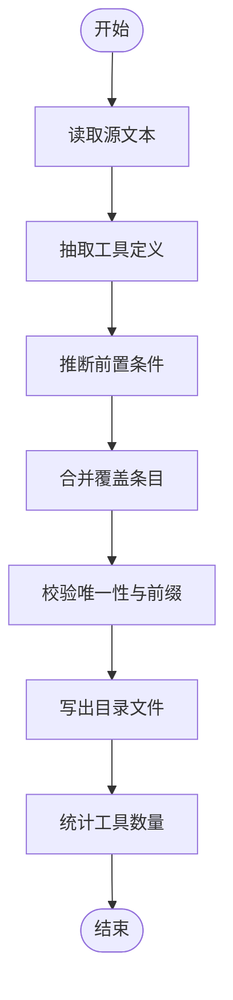
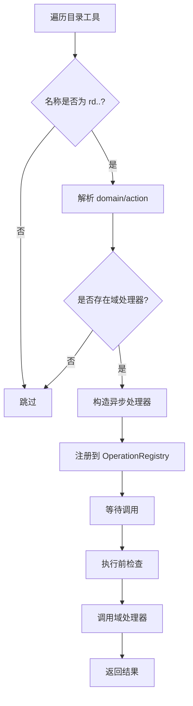
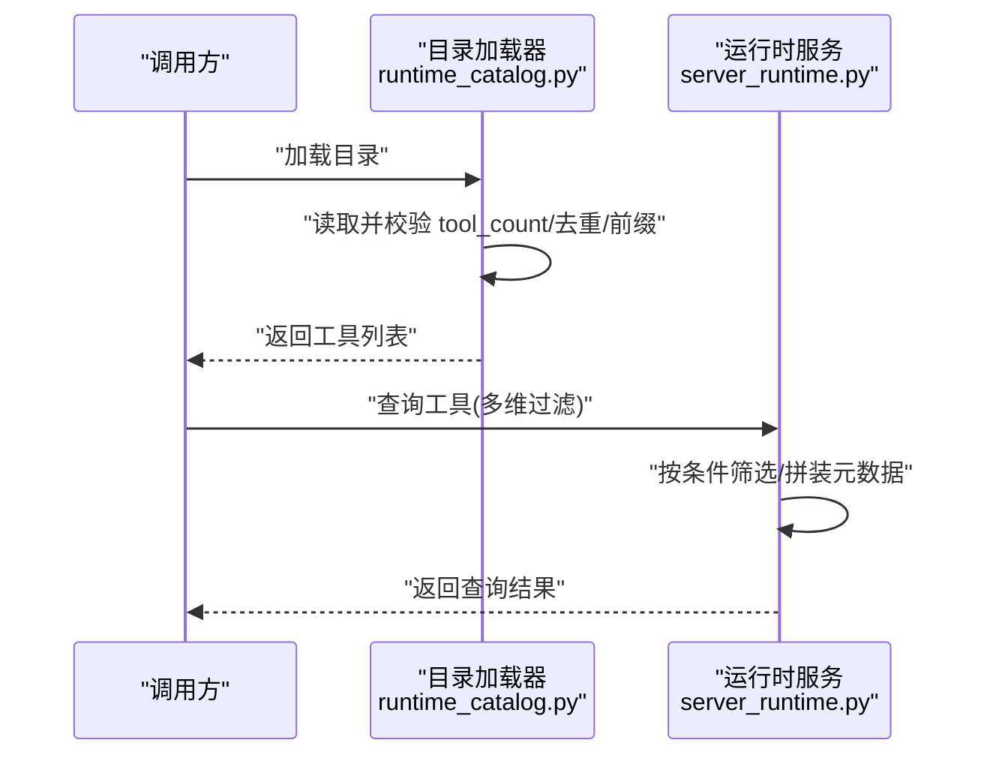
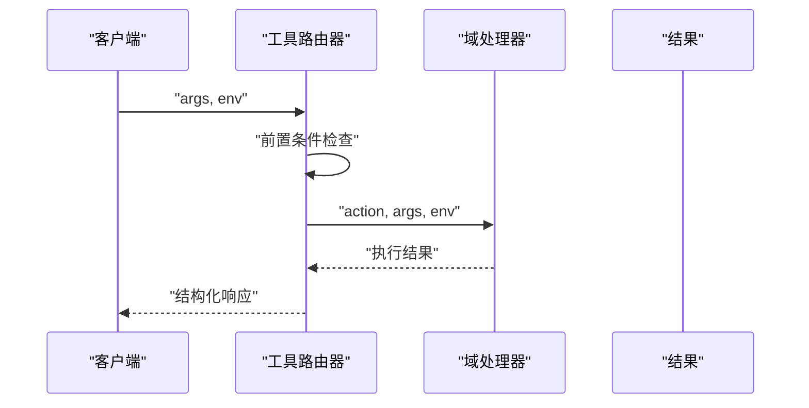
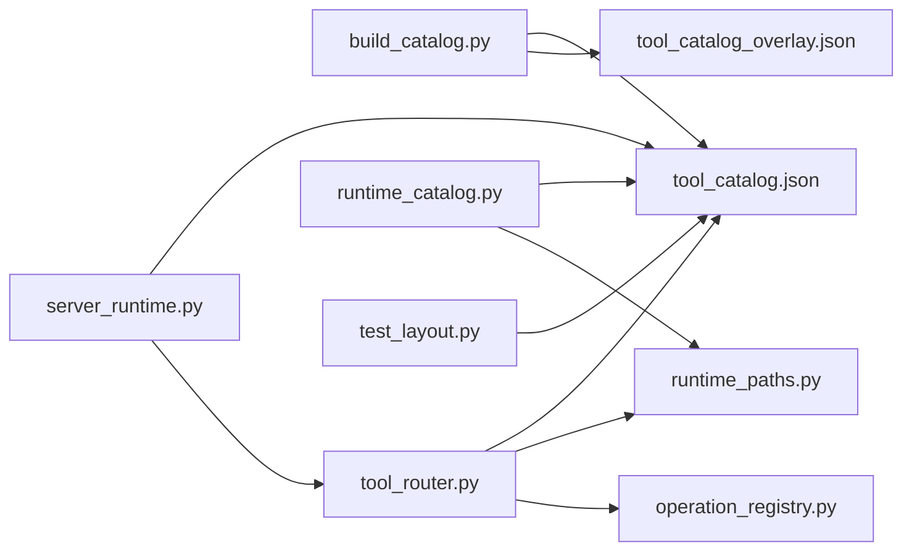

# 工具系统详解

<cite>
**本文引用的文件**
- [rdx/tool_router.py](file://rdx/tool_router.py)
- [rdx/server_runtime.py](file://rdx/server_runtime.py)
- [rdx/runtime_catalog.py](file://rdx/runtime_catalog.py)
- [spec/build_catalog.py](file://spec/build_catalog.py)
- [spec/tool_catalog.json](file://spec/tool_catalog.json)
- [spec/tool_catalog_overlay.json](file://spec/tool_catalog_overlay.json)
- [tests/test_layout.py](file://tests/test_layout.py)
- [rdx/core/operation_registry.py](file://rdx/core/operation_registry.py)
- [rdx/runtime_paths.py](file://rdx/runtime_paths.py)
</cite>

## 目录
1. [引言](#引言)
2. [项目结构](#项目结构)
3. [核心组件](#核心组件)
4. [架构总览](#架构总览)
5. [详细组件分析](#详细组件分析)
6. [依赖关系分析](#依赖关系分析)
7. [性能考量](#性能考量)
8. [故障排查指南](#故障排查指南)
9. [结论](#结论)
10. [附录：工具开发指南与最佳实践](#附录工具开发指南与最佳实践)

## 引言
本文件系统性阐述工具系统的注册机制、工具路由原理与动态工具发现体系，覆盖工具目录结构、工具定义格式与元数据管理，以及工具执行流程、参数传递与输出格式化规则。同时提供工具开发指南、扩展点与插件化架构设计思路，并给出可操作的最佳实践。

## 项目结构
工具系统围绕“规范目录 + 运行时解析 + 路由分发”的三层结构组织：
- 规范层（spec）：工具目录清单与构建脚本，负责声明工具、推断前置条件、合并覆盖配置。
- 运行时层（rdx）：加载目录、构建索引、注册路由、执行前检查与调用域处理器。
- 测试与校验（tests）：对目录完整性、唯一性、命名规范进行断言。

图表来源
- [spec/tool_catalog.json](file://spec/tool_catalog.json)
- [spec/tool_catalog_overlay.json](file://spec/tool_catalog_overlay.json)
- [spec/build_catalog.py](file://spec/build_catalog.py)
- [rdx/tool_router.py](file://rdx/tool_router.py)
- [rdx/server_runtime.py](file://rdx/server_runtime.py)
- [rdx/core/operation_registry.py](file://rdx/core/operation_registry.py)
- [rdx/runtime_catalog.py](file://rdx/runtime_catalog.py)
- [rdx/runtime_paths.py](file://rdx/runtime_paths.py)
- [tests/test_layout.py](file://tests/test_layout.py)

章节来源
- [spec/tool_catalog.json](file://spec/tool_catalog.json)
- [spec/tool_catalog_overlay.json](file://spec/tool_catalog_overlay.json)
- [spec/build_catalog.py](file://spec/build_catalog.py)
- [rdx/tool_router.py](file://rdx/tool_router.py)
- [rdx/server_runtime.py](file://rdx/server_runtime.py)
- [rdx/runtime_catalog.py](file://rdx/runtime_catalog.py)
- [tests/test_layout.py](file://tests/test_layout.py)

## 核心组件
- 工具目录与清单
  - 工具目录位于 spec/tool_catalog.json，包含 tools 列表与 tool_count 声明；groups 提供分组信息；overlay 可叠加覆盖条目。
  - 构建脚本 spec/build_catalog.py 负责从源文本提取工具描述、推断前置条件、生成最终目录并写入目录文件。
- 动态工具发现与注册
  - 运行时通过 rdx/tool_router.py 加载目录，按约定命名空间 rd.<domain>.<action> 解析域与动作，绑定到对应域处理器，注册到 OperationRegistry。
- 执行前检查与参数传递
  - 在路由层对工具的前置条件进行强制校验，满足后将参数与环境上下文传入域处理器异步执行。
- 元数据与查询
  - rdx/server_runtime.py 提供工具元数据查询接口，支持按命名空间、分组、能力、角色、意图等过滤，支持摘要与完整详情两种粒度。

章节来源
- [spec/tool_catalog.json](file://spec/tool_catalog.json)
- [spec/tool_catalog_overlay.json](file://spec/tool_catalog_overlay.json)
- [spec/build_catalog.py](file://spec/build_catalog.py)
- [rdx/tool_router.py](file://rdx/tool_router.py)
- [rdx/server_runtime.py](file://rdx/server_runtime.py)
- [rdx/core/operation_registry.py](file://rdx/core/operation_registry.py)

## 架构总览
工具系统采用“目录驱动 + 域处理器 + 注册表”的插件化架构：
- 目录驱动：以 JSON 清单为唯一事实来源，确保工具定义与元数据集中管理。
- 域处理器：按领域划分（如 core、remote 等），每个域维护自身动作集合与处理逻辑。
- 注册表：统一注册 rd.<domain>.<action> 名称到异步处理器的映射，支持动态发现与调用。

图表来源
- [rdx/tool_router.py](file://rdx/tool_router.py)
- [rdx/server_runtime.py](file://rdx/server_runtime.py)
- [rdx/core/operation_registry.py](file://rdx/core/operation_registry.py)

## 详细组件分析

### 组件A：工具目录与构建（spec）
- 目录结构
  - tool_catalog.json：包含 tools 数组、tool_count、groups、元数据字段（如 parameter_raw、returns_raw、supports_projection 等）。
  - tool_catalog_overlay.json：用于在构建阶段对目录进行增量覆盖。
- 构建流程
  - 读取源文本，抽取工具定义，填充基础元数据。
  - 推断前置条件：根据参数名匹配状态前提，自动附加远程能力要求等。
  - 合并覆盖：应用 overlay 中的工具条目覆盖。
  - 写出最终目录并统计工具数量。
- 校验与约束
  - tests/test_layout.py 断言目录中工具名唯一且均以 rd. 开头，确保命名一致性与无重复。

图表来源
- [spec/build_catalog.py](file://spec/build_catalog.py)
- [spec/tool_catalog.json](file://spec/tool_catalog.json)
- [spec/tool_catalog_overlay.json](file://spec/tool_catalog_overlay.json)
- [tests/test_layout.py](file://tests/test_layout.py)

章节来源
- [spec/tool_catalog.json](file://spec/tool_catalog.json)
- [spec/tool_catalog_overlay.json](file://spec/tool_catalog_overlay.json)
- [spec/build_catalog.py](file://spec/build_catalog.py)
- [tests/test_layout.py](file://tests/test_layout.py)

### 组件B：工具注册与路由（rdx/tool_router.py）
- 命名规范与解析
  - 工具名称必须为 rd.<domain>.<action> 的三段式，否则忽略。
  - 从目录项提取 name，拆分为 domain 与 action。
- 域处理器绑定
  - 从 _DOMAIN_HANDLERS 获取对应域处理器；若不存在则跳过。
- 注册过程
  - 将 rd.<domain>.<action> 注册到 OperationRegistry，处理器内部先执行前置条件检查，再调用域处理器。
- 前置条件强制
  - _enforce_prerequisites 按需评估 when 条件，调用 _has_prerequisite 检查 capability 或运行时状态，不满足时返回结构化错误。

图表来源
- [rdx/tool_router.py](file://rdx/tool_router.py)
- [rdx/core/operation_registry.py](file://rdx/core/operation_registry.py)

章节来源
- [rdx/tool_router.py](file://rdx/tool_router.py)
- [rdx/core/operation_registry.py](file://rdx/core/operation_registry.py)

### 组件C：运行时目录加载与工具查询（rdx/server_runtime.py 与 rdx/runtime_catalog.py）
- 目录加载
  - 通过 rdx/runtime_paths 定位 tools_root/spec/tool_catalog.json 并读取。
  - 校验 tool_count 与工具数量一致，避免遗漏或重复。
- 工具查询
  - 支持按 namespace/group/capability/role/intent 等多维过滤。
  - 支持摘要与完整详情两种粒度，完整模式包含原始参数与返回说明、投影支持等。
- 元数据增强
  - 对宏工具（macro）注入 canonical_tools 与 guidance 字段，便于上层决策。

图表来源
- [rdx/runtime_catalog.py](file://rdx/runtime_catalog.py)
- [rdx/server_runtime.py](file://rdx/server_runtime.py)

章节来源
- [rdx/runtime_catalog.py](file://rdx/runtime_catalog.py)
- [rdx/server_runtime.py](file://rdx/server_runtime.py)

### 组件D：执行流程与参数传递
- 参数传递
  - 工具调用时将 args 与 env 上下文一并传入域处理器。
- 输出格式化
  - 路由层统一包装返回值；运行时查询接口按 detail_level 返回摘要或完整元数据。
- 错误处理
  - 前置条件不满足时返回结构化错误；缺失必要参数时抛出明确异常。

图表来源
- [rdx/tool_router.py](file://rdx/tool_router.py)
- [rdx/server_runtime.py](file://rdx/server_runtime.py)

章节来源
- [rdx/tool_router.py](file://rdx/tool_router.py)
- [rdx/server_runtime.py](file://rdx/server_runtime.py)

## 依赖关系分析
- 目录依赖
  - rdx/tool_router.py 依赖 spec/tool_catalog.json 与 rdx/runtime_paths.py。
  - rdx/server_runtime.py 与 rdx/runtime_catalog.py 均依赖 rdx/runtime_paths.py 与目录文件。
- 构建依赖
  - spec/build_catalog.py 产出 tool_catalog.json 与 tool_catalog_overlay.json，作为运行时输入。
- 注册依赖
  - rdx/tool_router.py 依赖 rdx/core/operation_registry.py 完成注册与查找。

图表来源
- [spec/build_catalog.py](file://spec/build_catalog.py)
- [spec/tool_catalog.json](file://spec/tool_catalog.json)
- [spec/tool_catalog_overlay.json](file://spec/tool_catalog_overlay.json)
- [rdx/tool_router.py](file://rdx/tool_router.py)
- [rdx/server_runtime.py](file://rdx/server_runtime.py)
- [rdx/core/operation_registry.py](file://rdx/core/operation_registry.py)
- [rdx/runtime_catalog.py](file://rdx/runtime_catalog.py)
- [rdx/runtime_paths.py](file://rdx/runtime_paths.py)
- [tests/test_layout.py](file://tests/test_layout.py)

章节来源
- [spec/build_catalog.py](file://spec/build_catalog.py)
- [spec/tool_catalog.json](file://spec/tool_catalog.json)
- [spec/tool_catalog_overlay.json](file://spec/tool_catalog_overlay.json)
- [rdx/tool_router.py](file://rdx/tool_router.py)
- [rdx/server_runtime.py](file://rdx/server_runtime.py)
- [rdx/core/operation_registry.py](file://rdx/core/operation_registry.py)
- [rdx/runtime_catalog.py](file://rdx/runtime_catalog.py)
- [rdx/runtime_paths.py](file://rdx/runtime_paths.py)
- [tests/test_layout.py](file://tests/test_layout.py)

## 性能考量
- 目录加载与校验
  - 目录一次性加载并在内存缓存，查询时按需过滤，避免重复 IO。
- 注册表查找
  - 使用键值映射快速定位处理器，注册与查找均为常数级时间复杂度。
- 前置条件检查
  - 前置条件评估仅在路由层执行一次，避免重复计算。
- 建议
  - 控制工具数量与层级，保持目录简洁；对高频工具尽量减少跨域依赖与复杂前置条件。

## 故障排查指南
- 目录计数不一致
  - 现象：tool_count 与工具条目数量不符。
  - 处理：检查构建流程是否正确写入；确认目录未被手动篡改。
- 工具名重复或前缀不合法
  - 现象：测试断言失败。
  - 处理：确保所有工具名以 rd. 开头且唯一。
- 域处理器缺失
  - 现象：工具未注册或调用时报未找到处理器。
  - 处理：确认 _DOMAIN_HANDLERS 中存在对应域处理器；检查工具命名是否符合 rd.<domain>.<action>。
- 前置条件不满足
  - 现象：调用返回结构化错误。
  - 处理：根据错误提示补齐 via_tools 或启用相应 capability/状态。

章节来源
- [tests/test_layout.py](file://tests/test_layout.py)
- [rdx/tool_router.py](file://rdx/tool_router.py)
- [rdx/server_runtime.py](file://rdx/server_runtime.py)

## 结论
该工具系统以“目录驱动 + 域处理器 + 注册表”为核心，实现了高内聚、低耦合的插件化架构。通过严格的目录规范、自动化的构建与覆盖机制、完善的前置条件检查与查询接口，既保证了工具的可发现性与可维护性，也为扩展新工具提供了清晰路径。

## 附录：工具开发指南与最佳实践

### 工具目录结构与定义格式
- 目录位置
  - 工具目录位于 spec/tool_catalog.json；覆盖配置位于 spec/tool_catalog_overlay.json。
- 基本字段
  - name：严格为 rd.<domain>.<action>。
  - parameter_raw/returns_raw：用于生成完整元数据详情。
  - supports_projection：声明投影支持情况。
  - groups：分组标识，便于查询与展示。
  - 其他元数据：如 canonical_tools/guidance（宏工具）、capability/role/intent 等。
- 构建与校验
  - 使用 spec/build_catalog.py 生成目录；运行 tests/test_layout.py 校验唯一性与前缀。

章节来源
- [spec/tool_catalog.json](file://spec/tool_catalog.json)
- [spec/tool_catalog_overlay.json](file://spec/tool_catalog_overlay.json)
- [spec/build_catalog.py](file://spec/build_catalog.py)
- [tests/test_layout.py](file://tests/test_layout.py)

### 创建新工具步骤
- 步骤1：在源文本中新增工具定义，填写名称、参数、返回与元数据。
- 步骤2：运行构建脚本生成目录文件。
- 步骤3：在 rdx/tool_router.py 的 _DOMAIN_HANDLERS 中添加对应域处理器。
- 步骤4：在 spec/tool_catalog_overlay.json 中按需添加覆盖条目（如需）。
- 步骤5：运行测试验证目录唯一性与前缀合法性。

章节来源
- [spec/build_catalog.py](file://spec/build_catalog.py)
- [rdx/tool_router.py](file://rdx/tool_router.py)
- [tests/test_layout.py](file://tests/test_layout.py)

### 注册工具与实现工具接口
- 注册方式
  - 工具名称自动注册到 OperationRegistry；无需手工维护映射。
- 接口约定
  - 域处理器签名：接收 action、args、env，返回可序列化结果。
  - 参数传递：args 为字典，env 为环境上下文；两者均由路由层透传。
- 前置条件
  - 在工具元数据中声明 prerequisites；路由层在调用前强制检查。

章节来源
- [rdx/tool_router.py](file://rdx/tool_router.py)
- [rdx/core/operation_registry.py](file://rdx/core/operation_registry.py)

### 工具执行流程与输出格式化
- 执行流程
  - 客户端调用 rd.<domain>.<action>(args, env)。
  - 路由层解析名称、执行前置条件检查、调用域处理器。
  - 结果统一包装返回。
- 输出格式
  - 查询接口支持摘要与完整详情两种粒度；完整详情包含原始参数与返回说明、投影支持等。

章节来源
- [rdx/tool_router.py](file://rdx/tool_router.py)
- [rdx/server_runtime.py](file://rdx/server_runtime.py)

### 工具扩展点与插件化设计理念
- 扩展点
  - 新增域：在 _DOMAIN_HANDLERS 中添加新域处理器。
  - 新增动作：在工具目录中新增 rd.<domain>.<action> 条目。
  - 覆盖与定制：通过 overlay 对现有工具进行覆盖。
- 设计理念
  - 单一事实源：目录文件为唯一权威。
  - 明确契约：严格的命名规范与前置条件模型。
  - 可观测性：查询接口支持多维过滤与完整元数据。

章节来源
- [rdx/tool_router.py](file://rdx/tool_router.py)
- [spec/tool_catalog.json](file://spec/tool_catalog.json)
- [spec/tool_catalog_overlay.json](file://spec/tool_catalog_overlay.json)