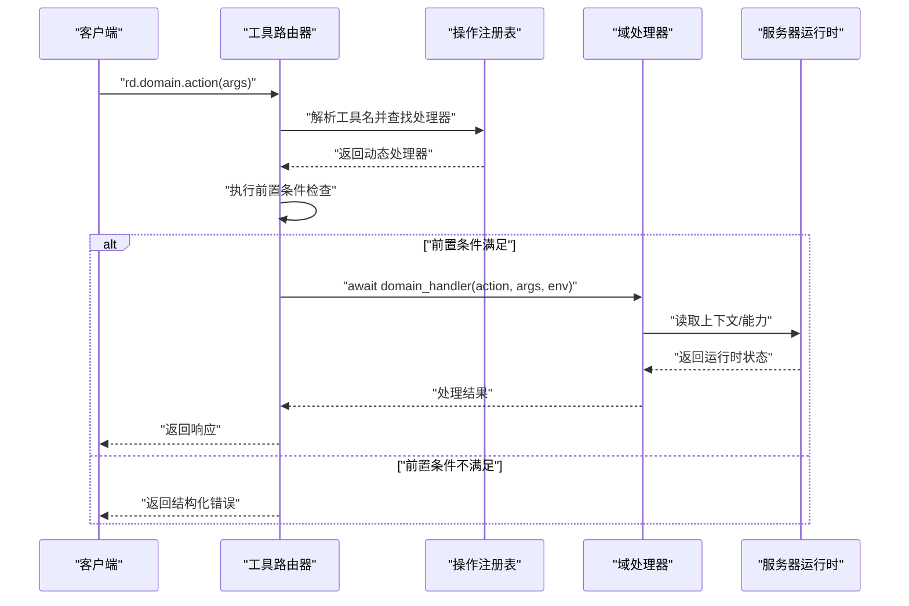
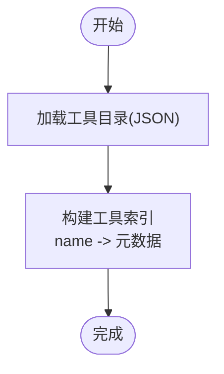
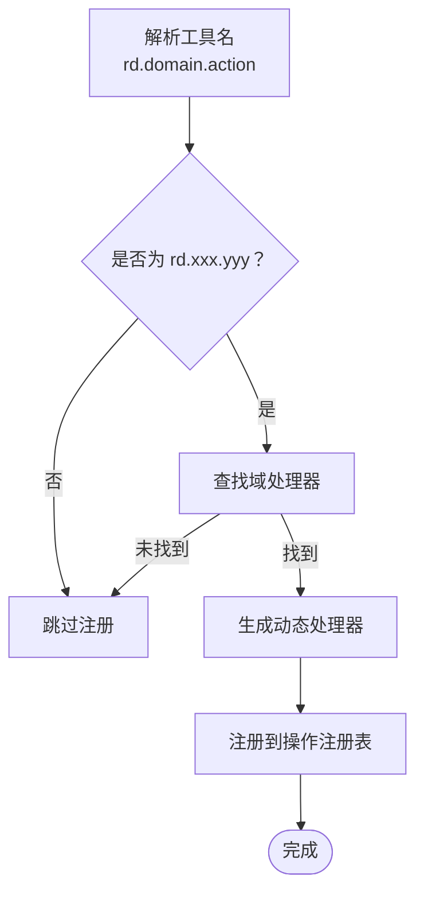
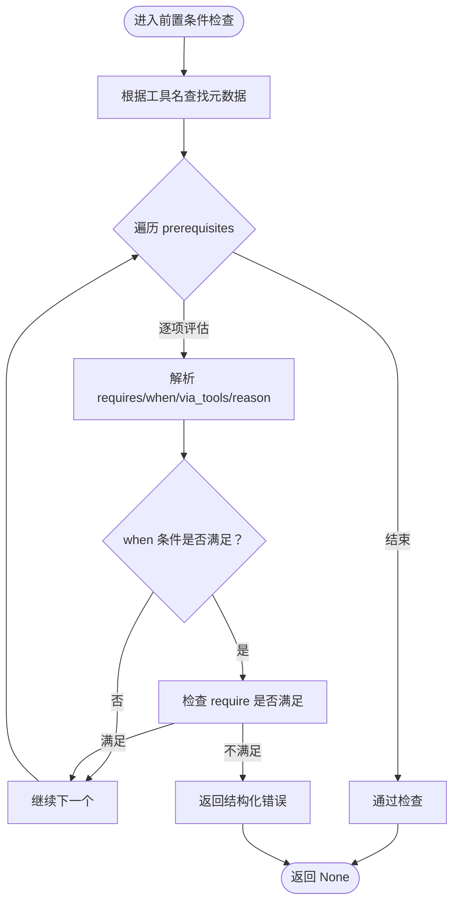
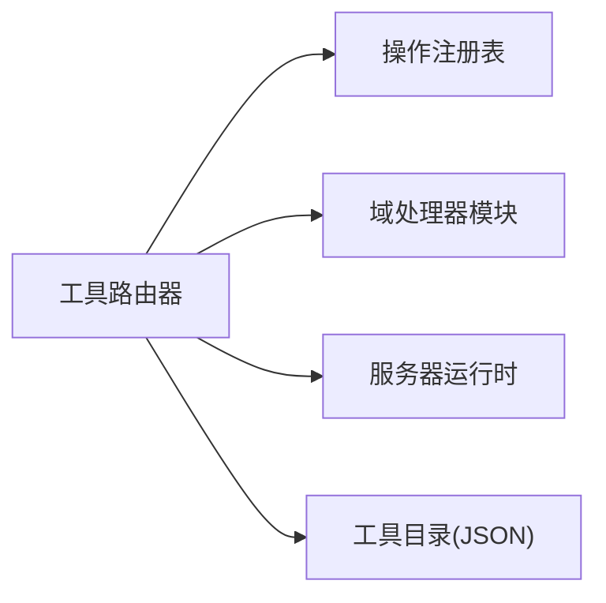

# 工具路由系统

<cite>
**本文引用的文件**
- [tool_router.py](file://rdx/tool_router.py)
- [operation_registry.py](file://rdx/core/operation_registry.py)
- [server_runtime.py](file://rdx/server_runtime.py)
- [tool_catalog.json](file://spec/tool_catalog.json)
- [tool_catalog_overlay.json](file://spec/tool_catalog_overlay.json)
- [perf.py](file://rdx/handlers/perf.py)
</cite>

## 目录
1. [简介](#简介)
2. [项目结构](#项目结构)
3. [核心组件](#核心组件)
4. [架构总览](#架构总览)
5. [详细组件分析](#详细组件分析)
6. [依赖分析](#依赖分析)
7. [性能考虑](#性能考虑)
8. [故障排除指南](#故障排除指南)
9. [结论](#结论)
10. [附录](#附录)

## 简介
本文件面向工具路由系统，系统通过“工具目录”驱动的动态路由机制，将统一命名空间的工具标识（rd.domain.action）解析为具体域处理器，完成前置条件检查与执行分发。本文档覆盖以下主题：
- 工具目录加载与索引构建
- 动态路由决策与域处理器映射
- 工具前缀解析（rd.domain.action）
- 前置条件与可用性检查
- 执行前检查流程
- 性能优化策略与故障排除
- 路由配置示例与调试工具使用指南

## 项目结构
工具路由系统位于 rdx/tool_router.py，配合核心注册表与服务器运行时共同工作：
- 工具目录来源：spec/tool_catalog.json 与 spec/tool_catalog_overlay.json
- 注册表：rdx/core/operation_registry.py
- 域处理器：rdx/handlers/*（如 perf.py）
- 运行时上下文与前置条件：rdx/server_runtime.py

图表来源
- [tool_router.py:1-151](file://rdx/tool_router.py#L1-L151)
- [operation_registry.py:1-45](file://rdx/core/operation_registry.py#L1-L45)
- [tool_catalog.json:1-800](file://spec/tool_catalog.json#L1-L800)
- [tool_catalog_overlay.json:1-177](file://spec/tool_catalog_overlay.json#L1-L177)

章节来源
- [tool_router.py:1-151](file://rdx/tool_router.py#L1-L151)
- [operation_registry.py:1-45](file://rdx/core/operation_registry.py#L1-L45)
- [tool_catalog.json:1-800](file://spec/tool_catalog.json#L1-L800)
- [tool_catalog_overlay.json:1-177](file://spec/tool_catalog_overlay.json#L1-L177)

## 核心组件
- 工具目录加载与索引
  - 从服务器运行时加载工具目录，构建工具名到工具元数据的字典索引，供路由与前置条件检查使用。
- 域处理器映射
  - 将“domain”映射到对应处理器模块的 handle 函数，形成静态映射表。
- 动态路由注册
  - 遍历工具目录，解析 rd.domain.action，注册到统一的操作注册表。
- 前置条件检查
  - 在执行前对工具的 prerequisites 进行评估，必要时返回结构化错误。

章节来源
- [tool_router.py:55-57](file://rdx/tool_router.py#L55-L57)
- [tool_router.py:33-53](file://rdx/tool_router.py#L33-L53)
- [tool_router.py:130-150](file://rdx/tool_router.py#L130-L150)
- [tool_router.py:111-127](file://rdx/tool_router.py#L111-L127)

## 架构总览
工具路由系统采用“目录驱动 + 注册表 + 域处理器”的分层设计：
- 目录层：工具目录定义工具名、参数、返回值与前置条件
- 路由层：解析工具名，构建动态处理器，执行前置条件检查
- 分发层：将动作与参数转发给对应域处理器
- 运行时层：提供上下文快照与能力矩阵，支撑前置条件判断

图表来源
- [tool_router.py:130-150](file://rdx/tool_router.py#L130-L150)
- [operation_registry.py:36-41](file://rdx/core/operation_registry.py#L36-L41)
- [perf.py:8-10](file://rdx/handlers/perf.py#L8-L10)
- [server_runtime.py:1082-10933](file://rdx/server_runtime.py#L1082-L10933)

## 详细组件分析

### 工具目录加载与索引构建
- 加载工具目录
  - 通过服务器运行时接口加载工具目录，生成工具条目列表
- 构建工具索引
  - 以工具名为键，构建字典索引，便于快速查找工具元数据
- 工具目录来源
  - 主目录：spec/tool_catalog.json
  - 覆盖目录：spec/tool_catalog_overlay.json（用于补充描述、参数、返回值与前置条件）

图表来源
- [tool_router.py:55-57](file://rdx/tool_router.py#L55-L57)
- [tool_catalog.json:1-800](file://spec/tool_catalog.json#L1-L800)
- [tool_catalog_overlay.json:1-177](file://spec/tool_catalog_overlay.json#L1-L177)

章节来源
- [tool_router.py:55-57](file://rdx/tool_router.py#L55-L57)
- [tool_catalog.json:1-800](file://spec/tool_catalog.json#L1-L800)
- [tool_catalog_overlay.json:1-177](file://spec/tool_catalog_overlay.json#L1-L177)

### 动态路由决策与域处理器映射
- 工具前缀解析
  - 工具名需满足“rd.domain.action”格式，其中 domain 与 action 由“.”分割
- 域处理器映射
  - 通过静态映射表将 domain 映射到对应处理器模块的 handle 函数
- 注册动态处理器
  - 为每个工具生成闭包处理器，封装前置条件检查与域处理器调用
- 注册到操作注册表
  - 使用统一的注册表接口注册工具名与处理器

图表来源
- [tool_router.py:130-150](file://rdx/tool_router.py#L130-L150)
- [tool_router.py:33-53](file://rdx/tool_router.py#L33-L53)

章节来源
- [tool_router.py:130-150](file://rdx/tool_router.py#L130-L150)
- [tool_router.py:33-53](file://rdx/tool_router.py#L33-L53)

### 前置条件检查与执行前检查
- 前置条件类型
  - capture_file_id：需要已打开的捕获文件句柄
  - session_id：需要有效的回放会话
  - remote_id：需要有效的远程句柄，可通过 options.remote_id 或运行时上下文提供
  - active_event_id：需要当前激活的事件
  - capability.remote：需要运行时启用远程能力
- 条件触发器 when
  - options.remote_id_present：当 options.remote_id 存在时才应用
- 结构化错误
  - 当前置条件不满足时，返回包含错误码、类别与详细信息的结构化响应

图表来源
- [tool_router.py:111-127](file://rdx/tool_router.py#L111-L127)
- [tool_router.py:79-86](file://rdx/tool_router.py#L79-L86)
- [tool_router.py:88-108](file://rdx/tool_router.py#L88-L108)

章节来源
- [tool_router.py:111-127](file://rdx/tool_router.py#L111-L127)
- [tool_router.py:79-86](file://rdx/tool_router.py#L79-L86)
- [tool_router.py:88-108](file://rdx/tool_router.py#L88-L108)

### 工具可用性检查与上下文快照
- 上下文快照
  - 通过服务器运行时接口获取当前上下文快照，包含 runtime 与 remote 状态
- 可用性判断
  - 依据上下文快照与参数中的显式输入，判断各类前置条件是否满足
- 远程能力
  - 通过运行时能力字段判断是否启用远程能力

章节来源
- [tool_router.py:89-108](file://rdx/tool_router.py#L89-L108)
- [server_runtime.py:1082-10933](file://rdx/server_runtime.py#L1082-L10933)

### 域处理器与动作分发
- 域处理器
  - 每个域（如 perf）对应一个处理器模块，提供 handle(action, args, env) 接口
- 动作分发
  - 路由器将 action 与 args 转发给对应域处理器，由处理器调用服务器运行时的具体实现

章节来源
- [perf.py:8-10](file://rdx/handlers/perf.py#L8-L10)

## 依赖分析
- 工具路由器依赖
  - 操作注册表：用于注册动态处理器
  - 域处理器模块：提供各域的动作处理能力
  - 服务器运行时：提供上下文快照与能力信息
  - 工具目录：提供工具元数据与前置条件
- 耦合与内聚
  - 路由器与处理器之间通过统一接口耦合，内聚于工具名解析与前置条件检查
  - 工具目录与路由器之间通过索引建立松耦合关系

图表来源
- [tool_router.py:1-151](file://rdx/tool_router.py#L1-L151)
- [operation_registry.py:1-45](file://rdx/core/operation_registry.py#L1-L45)
- [server_runtime.py:1082-10933](file://rdx/server_runtime.py#L1082-L10933)
- [tool_catalog.json:1-800](file://spec/tool_catalog.json#L1-L800)

章节来源
- [tool_router.py:1-151](file://rdx/tool_router.py#L1-L151)
- [operation_registry.py:1-45](file://rdx/core/operation_registry.py#L1-L45)
- [server_runtime.py:1082-10933](file://rdx/server_runtime.py#L1082-L10933)
- [tool_catalog.json:1-800](file://spec/tool_catalog.json#L1-L800)

## 性能考虑
- 工具目录加载
  - 工具目录在模块初始化时一次性加载并构建索引，避免重复 IO 与解析开销
- 注册表查找
  - 操作注册表使用字典存储，查找复杂度为 O(1)，注册与解析高效
- 前置条件检查
  - 前置条件检查逻辑简单，主要依赖上下文快照与参数读取，开销极低
- 异步处理
  - 路由器与处理器均采用异步模式，提升并发吞吐

## 故障排除指南
- 工具名格式错误
  - 现象：工具未注册或无法解析
  - 排查：确认工具名为“rd.domain.action”，domain 与 action 均存在
- 域处理器缺失
  - 现象：路由到空处理器
  - 排查：确认 domain 是否在域处理器映射表中
- 前置条件不满足
  - 现象：返回结构化错误，包含错误码、类别与详细信息
  - 排查：根据错误详情检查 capture_file_id、session_id、remote_id、active_event_id 或 capability.remote
- 远程能力未启用
  - 现象：涉及远程能力的工具失败
  - 排查：确认运行时启用了远程能力
- 调试工具
  - 使用服务器运行时提供的上下文快照与能力矩阵接口，核对当前状态与期望状态

章节来源
- [tool_router.py:130-150](file://rdx/tool_router.py#L130-L150)
- [tool_router.py:111-127](file://rdx/tool_router.py#L111-L127)
- [server_runtime.py:1082-10933](file://rdx/server_runtime.py#L1082-L10933)

## 结论
工具路由系统通过“目录驱动 + 注册表 + 域处理器”的架构，实现了灵活、可扩展且易于维护的工具路由机制。其关键优势在于：
- 工具目录集中管理，便于统一治理与覆盖
- 动态路由与前置条件检查解耦，提升可测试性与可观测性
- 异步与高性能设计，适配高并发场景

## 附录

### 路由配置示例
- 工具目录示例
  - 工具名：rd.core.init
  - 描述：初始化运行时
  - 参数：global_env（可选）、enable_remote（可选）
  - 返回：ok、data、artifacts、error、meta、projections（可选）
  - 前置条件：无
- 覆盖目录示例
  - 覆盖工具：rd.capture.open_replay
  - 补充描述、参数、返回值与前置条件（含 when 条件）

章节来源
- [tool_catalog.json:25-96](file://spec/tool_catalog.json#L25-L96)
- [tool_catalog_overlay.json:25-45](file://spec/tool_catalog_overlay.json#L25-L45)

### 调试工具使用指南
- 获取上下文快照
  - 通过服务器运行时接口读取当前上下文快照，核对 runtime 与 remote 状态
- 校验能力矩阵
  - 检查当前环境能力，特别是 remote 能力
- 日志与健康检查
  - 使用运行时日志与健康检查工具定位问题

章节来源
- [server_runtime.py:1082-10933](file://rdx/server_runtime.py#L1082-L10933)