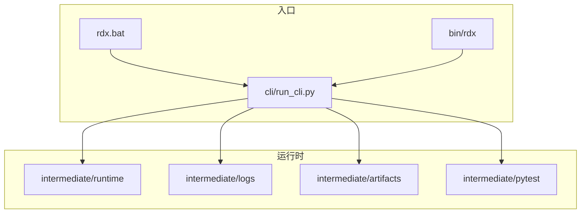
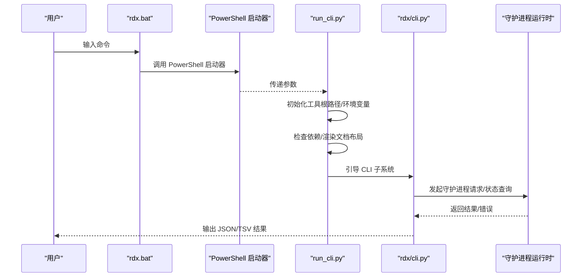
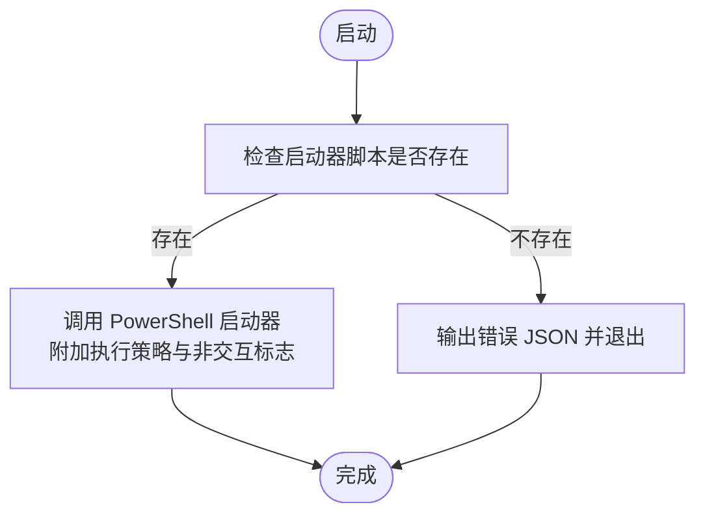
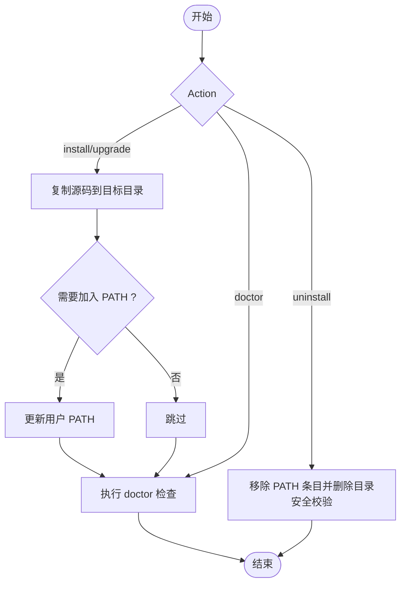
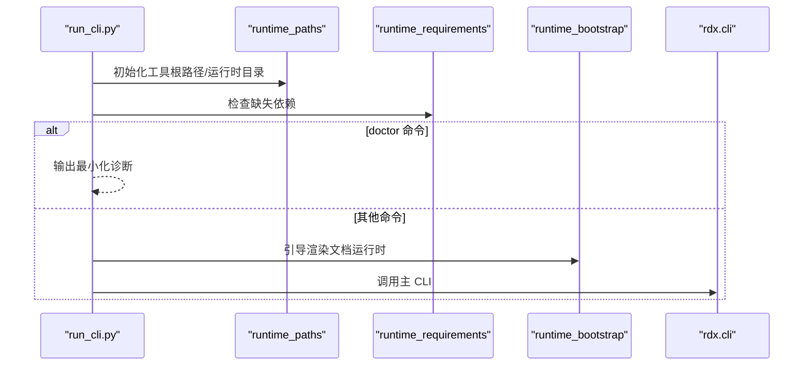
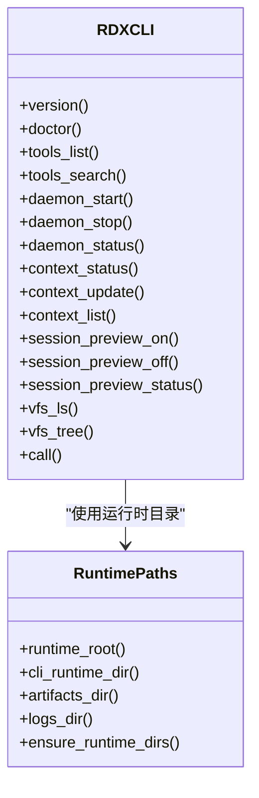
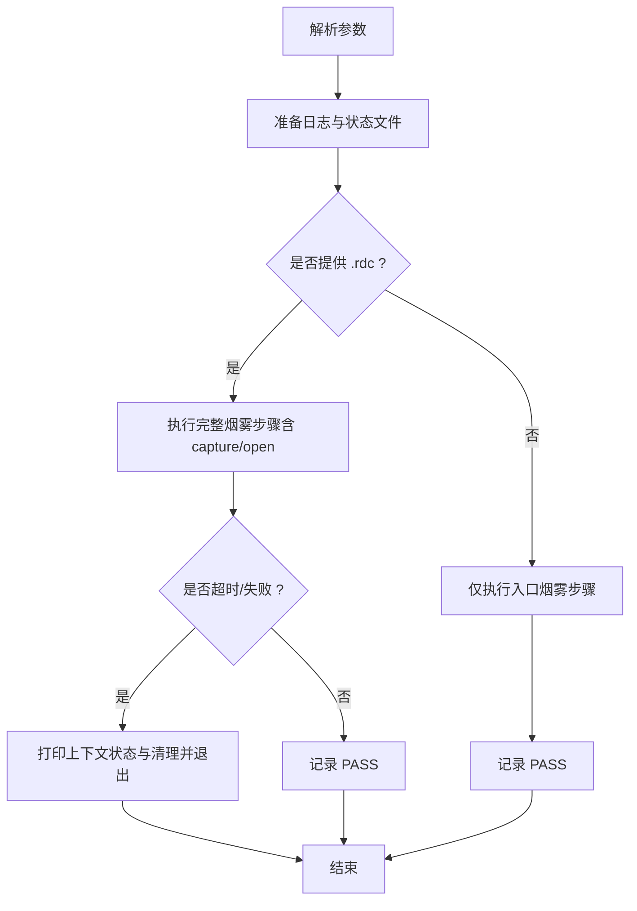
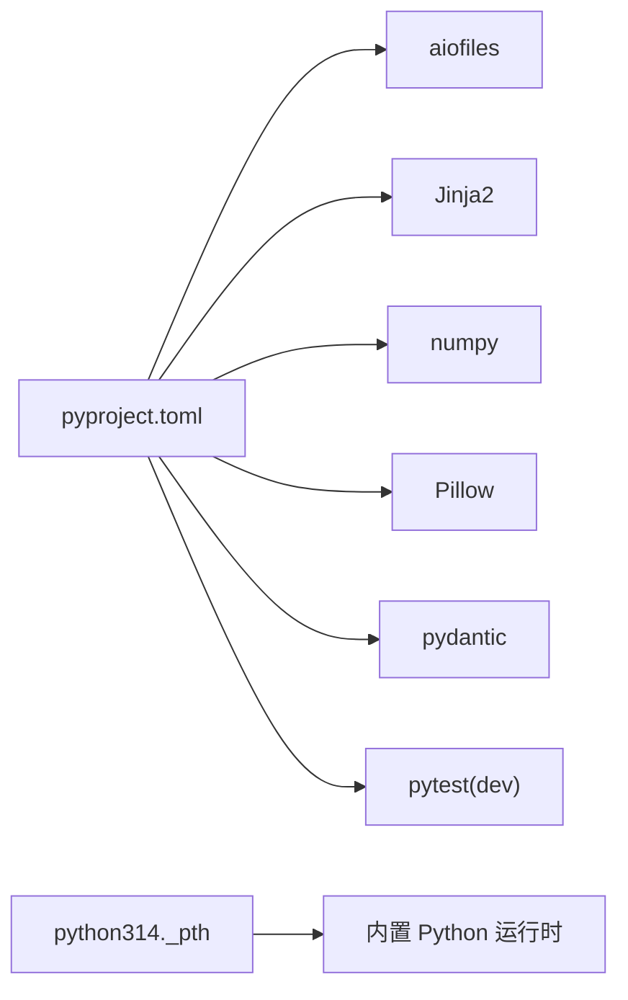

# 开发环境

<cite>
**本文引用的文件**
- [README.md](file://README.md)
- [docs/install.md](file://docs/install.md)
- [docs/quickstart.md](file://docs/quickstart.md)
- [docs/configuration.md](file://docs/configuration.md)
- [pyproject.toml](file://pyproject.toml)
- [rdx.bat](file://rdx.bat)
- [scripts/rdx_install.ps1](file://scripts/rdx_install.ps1)
- [scripts/smoke_cli.sh](file://scripts/smoke_cli.sh)
- [cli/run_cli.py](file://cli/run_cli.py)
- [rdx/cli.py](file://rdx/cli.py)
- [rdx/runtime_paths.py](file://rdx/runtime_paths.py)
- [binaries/windows/x64/python/python314._pth](file://binaries/windows/x64/python/python314._pth)
</cite>

## 目录
1. [简介](#简介)
2. [项目结构](#项目结构)
3. [核心组件](#核心组件)
4. [架构总览](#架构总览)
5. [详细组件分析](#详细组件分析)
6. [依赖分析](#依赖分析)
7. [性能考虑](#性能考虑)
8. [故障排查指南](#故障排查指南)
9. [结论](#结论)
10. [附录](#附录)

## 简介
本指南面向开发者，帮助在本地快速搭建 RDX Tools 的开发与调试环境。内容覆盖系统要求、前置条件、依赖安装、环境变量、IDE 配置、开发工具链（调试器、代码格式化、静态分析）、本地工作流（修改、测试、调试）、常见问题与性能优化，以及可选的 Docker 容器化开发方案。

## 项目结构
该仓库为仅 CLI 的 RenderDoc .rdc 运行时包，提供统一入口以调用 196 个 rdx 工具。主要入口包括：
- Windows 批处理入口：rdx.bat
- POSIX Shell 入口：bin/rdx
- Python CLI 启动器：cli/run_cli.py

开发与运行时相关的关键目录：
- 运行时根目录：intermediate/runtime
- 日志目录：intermediate/logs
- 构建产物目录：intermediate/artifacts
- 测试输出目录：intermediate/pytest

图表来源
- [rdx.bat](file://rdx.bat)
- [cli/run_cli.py](file://cli/run_cli.py)
- [rdx/runtime_paths.py](file://rdx/runtime_paths.py)

章节来源
- [README.md](file://README.md)
- [docs/quickstart.md](file://docs/quickstart.md)
- [rdx/runtime_paths.py](file://rdx/runtime_paths.py)

## 核心组件
- 入口层
  - rdx.bat：Windows 批处理入口，委派给 PowerShell 启动器。
  - bin/rdx：POSIX Shell 入口（由安装脚本生成）。
  - cli/run_cli.py：独立 Python CLI 启动器，负责初始化工具根路径、检查依赖、引导运行时。
- 运行时与路径
  - rdx/cli.py：CLI 命令适配器，对接守护进程运行时，执行工具命令、上下文管理、会话预览等。
  - rdx/runtime_paths.py：定义运行时目录、日志、工件、pytest 输出等路径。
- 安装与诊断
  - scripts/rdx_install.ps1：安装/升级/卸载/诊断脚本，支持将安装目录加入用户 PATH。
  - scripts/smoke_cli.sh：Bash 烟雾测试脚本，驱动 CLI 端到端验证。
- Python 运行时
  - binaries/windows/x64/python/python314._pth：内置 Python 解释器的模块搜索路径配置。

章节来源
- [rdx.bat](file://rdx.bat)
- [cli/run_cli.py](file://cli/run_cli.py)
- [rdx/cli.py](file://rdx/cli.py)
- [rdx/runtime_paths.py](file://rdx/runtime_paths.py)
- [scripts/rdx_install.ps1](file://scripts/rdx_install.ps1)
- [scripts/smoke_cli.sh](file://scripts/smoke_cli.sh)
- [binaries/windows/x64/python/python314._pth](file://binaries/windows/x64/python/python314._pth)

## 架构总览
下图展示从用户命令到守护进程运行时的整体调用链路，以及关键环境变量与路径的作用。

图表来源
- [rdx.bat](file://rdx.bat)
- [cli/run_cli.py](file://cli/run_cli.py)
- [rdx/cli.py](file://rdx/cli.py)

## 详细组件分析

### 组件 A：Windows 批处理入口与 PowerShell 启动器
- 功能要点
  - rdx.bat 通过 PowerShell 启动器加载并执行，支持 --non-interactive 模式。
  - 若缺少启动器脚本，直接输出错误 JSON 并退出。
- 环境变量
  - RDX_CALLER_CWD：记录调用者当前目录。
- 依赖
  - 需要可用的 PowerShell 可执行文件与启动器脚本。

图表来源
- [rdx.bat](file://rdx.bat)

章节来源
- [rdx.bat](file://rdx.bat)

### 组件 B：安装与诊断脚本（Windows）
- 功能要点
  - 支持 install、upgrade、uninstall、doctor 四种动作。
  - 可将安装目录加入用户 PATH；卸载前校验是否为 rdx-tools 目录。
  - doctor 动作调用 rdx.bat --json doctor 进行健康检查。
- 关键行为
  - 复制源码树至目标目录（排除中间产物与版本控制目录）。
  - DryRun 模式用于预演操作。

图表来源
- [scripts/rdx_install.ps1](file://scripts/rdx_install.ps1)

章节来源
- [scripts/rdx_install.ps1](file://scripts/rdx_install.ps1)
- [docs/install.md](file://docs/install.md)

### 组件 C：独立 Python CLI 启动器
- 功能要点
  - 自动推断工具根路径（优先使用 RDX_TOOLS_ROOT），注入 sys.path 并设置环境变量。
  - 检查缺失依赖并在 doctor 命令时输出最小化诊断信息。
  - 引导运行时并转发到 rdx.cli 主程序。
- 关键参数
  - --daemon-context/--context-id：选择守护进程上下文。
  - --json：输出标准化 JSON 包裹结果。

图表来源
- [cli/run_cli.py](file://cli/run_cli.py)

章节来源
- [cli/run_cli.py](file://cli/run_cli.py)

### 组件 D：CLI 命令适配器与守护进程交互
- 功能要点
  - 提供 version、doctor、tools、daemon、context、session preview、vfs、call 等命令。
  - 通过守护进程执行具体操作，支持远程模式与超时策略。
  - 支持 TSV 投影渲染（当工具返回投影时）。
- 关键路径
  - 运行时目录、日志目录、工件目录、pytest 目录均由 runtime_paths.py 统一管理。

图表来源
- [rdx/cli.py](file://rdx/cli.py)
- [rdx/runtime_paths.py](file://rdx/runtime_paths.py)

章节来源
- [rdx/cli.py](file://rdx/cli.py)
- [rdx/runtime_paths.py](file://rdx/runtime_paths.py)

### 组件 E：烟雾测试脚本（Bash）
- 功能要点
  - 支持指定工具根目录、.rdc 文件、守护进程上下文 ID、默认与打开超时。
  - 将每一步命令与输出镜像写入 intermediate/logs/smoke_cli.log。
  - 在超时或失败时打印上下文状态与清理结果。
- 关键行为
  - 使用 timeout 命令进行超时控制（若可用）。
  - 支持只跑“入口烟雾”或带守护进程后链路的完整烟雾。

图表来源
- [scripts/smoke_cli.sh](file://scripts/smoke_cli.sh)

章节来源
- [scripts/smoke_cli.sh](file://scripts/smoke_cli.sh)
- [docs/quickstart.md](file://docs/quickstart.md)

## 依赖分析
- Python 版本要求
  - requires-python = ">=3.11"
- 运行时依赖
  - aiofiles、Jinja2、numpy、Pillow、pydantic
- 开发依赖
  - pytest（可选 dev 分组）
- 内置 Python
  - binaries/windows/x64/python/python314._pth：内置解释器模块搜索路径，配合 binaries/windows/x64/pymodules 使用。

图表来源
- [pyproject.toml](file://pyproject.toml)
- [binaries/windows/x64/python/python314._pth](file://binaries/windows/x64/python/python314._pth)

章节来源
- [pyproject.toml](file://pyproject.toml)
- [binaries/windows/x64/python/python314._pth](file://binaries/windows/x64/python/python314._pth)

## 性能考虑
- 使用内置 Python 运行时避免额外依赖开销，提升启动一致性。
- 通过守护进程复用上下文与资源，减少重复初始化成本。
- 合理设置超时参数（如 RDX_SMOKE_TIMEOUT、RDX_SMOKE_OPEN_TIMEOUT），平衡稳定性与效率。
- 在 CI 或自动化环境中，优先使用 Bash 烟雾脚本以获得更一致的终端输出与超时控制。

## 故障排查指南
- doctor 命令
  - 通过 rdx.bat --json doctor 或 scripts/rdx_install.ps1 -Action doctor 检查工具根路径、依赖、渲染文档布局、守护进程状态、入口脚本存在性等。
- 缺少依赖
  - run_cli.py 在检测到缺失依赖且 doctor 命令时会输出最小化诊断；其他命令则直接提示缺失并返回错误码。
- 路径与环境变量
  - RDX_TOOLS_ROOT：当从非入口位置调用 bin/rdx 时，显式设置工具根路径。
  - RDX_CONTEXT_ID：默认上下文为 default，可通过 --daemon-context 或 --context-id 覆盖。
- 日志与工件
  - 中间产物位于 intermediate/runtime、logs、artifacts、pytest；便于定位问题与复现。
- 超时与清理
  - 烟雾脚本在超时或失败时会打印上下文状态与清理结果，便于快速恢复环境。

章节来源
- [cli/run_cli.py](file://cli/run_cli.py)
- [rdx/cli.py](file://rdx/cli.py)
- [scripts/rdx_install.ps1](file://scripts/rdx_install.ps1)
- [scripts/smoke_cli.sh](file://scripts/smoke_cli.sh)
- [docs/configuration.md](file://docs/configuration.md)

## 结论
本指南提供了从系统要求、安装配置、环境变量、IDE 设置到开发工具链与工作流的完整指引。结合内置 Python 运行时与守护进程架构，开发者可在 Windows 上快速建立稳定一致的本地开发与调试环境，并通过烟雾脚本与 doctor 命令保障运行时健康度。

## 附录

### 系统要求与前置条件
- Python 版本
  - 运行时要求：Python >= 3.11
  - 内置 Python：binaries/windows/x64/python/python314._pth
- 操作系统支持
  - Windows x64：提供自包含发布包与批处理入口
  - POSIX Shell：bin/rdx（由安装脚本生成）
- 硬件要求
  - 无特殊硬件要求；推荐具备 GPU 与 RenderDoc 环境以便进行捕获与回放测试

章节来源
- [pyproject.toml](file://pyproject.toml)
- [binaries/windows/x64/python/python314._pth](file://binaries/windows/x64/python/python314._pth)
- [docs/install.md](file://docs/install.md)

### 依赖安装与环境配置
- 用户安装（Windows）
  - 解压发布包后，使用 scripts/rdx_install.ps1 完成安装/升级/卸载/诊断
  - 可选将安装目录加入 PATH
- 开发者安装（维护者）
  - 可通过 RDX_PYTHON 覆盖 Python 选择（非 GA 发布包必需）
  - 运行时工件位于 intermediate/runtime、logs、artifacts、pytest

章节来源
- [docs/install.md](file://docs/install.md)
- [scripts/rdx_install.ps1](file://scripts/rdx_install.ps1)
- [docs/configuration.md](file://docs/configuration.md)

### IDE 配置建议
- Python 解释器
  - 使用内置 Python（binaries/windows/x64/python/python.exe）以确保与运行时一致
- 环境变量
  - RDX_TOOLS_ROOT：当从非入口位置调用 bin/rdx 时设置
  - RDX_CONTEXT_ID：按需设置守护进程上下文
- 调试器
  - 使用 Python 调试器附加到 run_cli.py 或 rdx/cli.py
  - 在 VS Code 中可配置 launch.json，指向 python cli/run_cli.py 并传入所需参数

章节来源
- [docs/configuration.md](file://docs/configuration.md)
- [cli/run_cli.py](file://cli/run_cli.py)
- [rdx/cli.py](file://rdx/cli.py)

### 开发工具链
- 调试器
  - Python 调试器：附加到 run_cli.py 或 rdx/cli.py
- 代码格式化
  - 推荐使用 black 或 autopep8（根据团队约定）
- 静态分析
  - 推荐使用 flake8、pylint 或 ruff（根据团队约定）

章节来源
- [pyproject.toml](file://pyproject.toml)

### 本地开发工作流
- 修改与测试
  - 使用 Bash 烟雾脚本 scripts/smoke_cli.sh 驱动端到端验证
  - 通过 rdx --json doctor 检查运行时健康度
- 调试技巧
  - 在 run_cli.py 中设置断点，观察工具根路径与依赖检查逻辑
  - 利用中间目录 logs、artifacts、runtime、pytest 定位问题
- 清理
  - 失败或超时后，脚本会打印上下文状态并尝试清理；必要时手动执行 context clear 与 daemon stop

章节来源
- [scripts/smoke_cli.sh](file://scripts/smoke_cli.sh)
- [rdx/cli.py](file://rdx/cli.py)
- [rdx/runtime_paths.py](file://rdx/runtime_paths.py)

### 常见问题与解决方案
- 缺少启动器脚本（rdx.bat）
  - 现象：输出错误 JSON 并退出
  - 解决：确认 rdx.bat 与启动器脚本存在
- doctor 命令显示依赖缺失
  - 现象：doctor 输出最小化诊断
  - 解决：安装缺失依赖或使用内置 Python 运行时
- PATH 未包含安装目录
  - 现象：无法直接调用 rdx
  - 解决：使用安装脚本添加 PATH 或手动添加

章节来源
- [rdx.bat](file://rdx.bat)
- [cli/run_cli.py](file://cli/run_cli.py)
- [scripts/rdx_install.ps1](file://scripts/rdx_install.ps1)

### Docker 容器化开发环境（可选）
- 方案概述
  - 使用 Windows 容器镜像承载内置 Python 与工具集，挂载源码与中间目录
  - 在容器内运行 rdx.bat 或 PowerShell 启动器，通过卷映射共享 logs、artifacts、runtime
- 注意事项
  - Windows 容器需启用相应功能；注意 PATH 与权限
  - 如需 GPU/RenderDoc，请在宿主机侧准备对应环境并映射到容器

章节来源
- [docs/install.md](file://docs/install.md)
- [binaries/windows/x64/python/python314._pth](file://binaries/windows/x64/python/python314._pth)