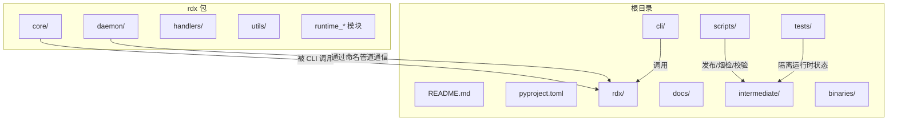
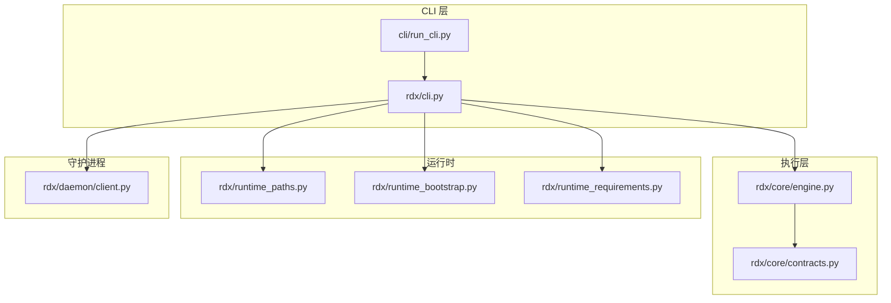
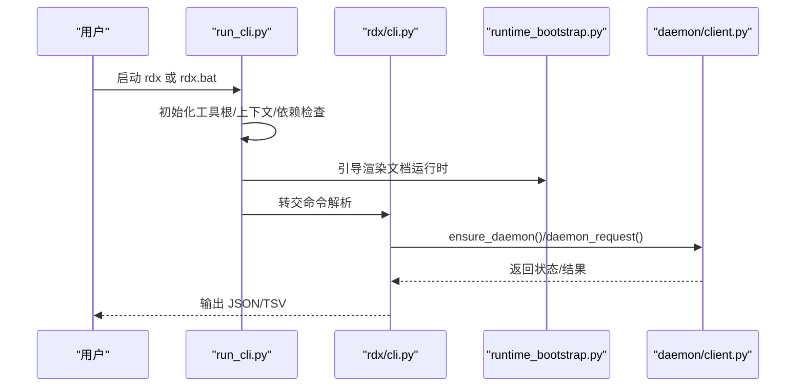
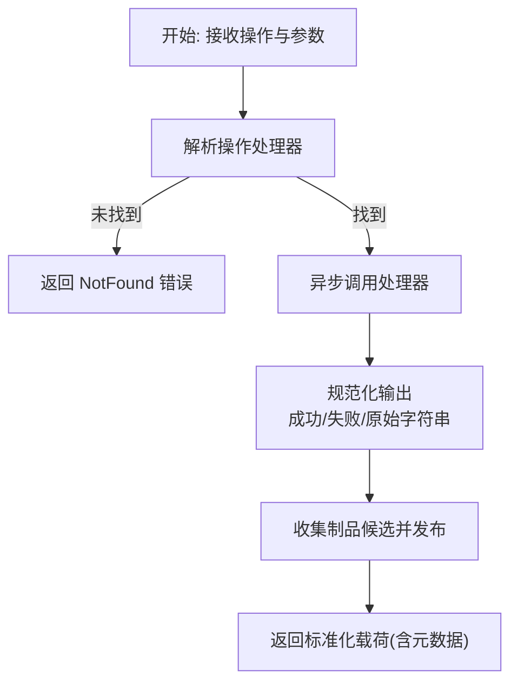
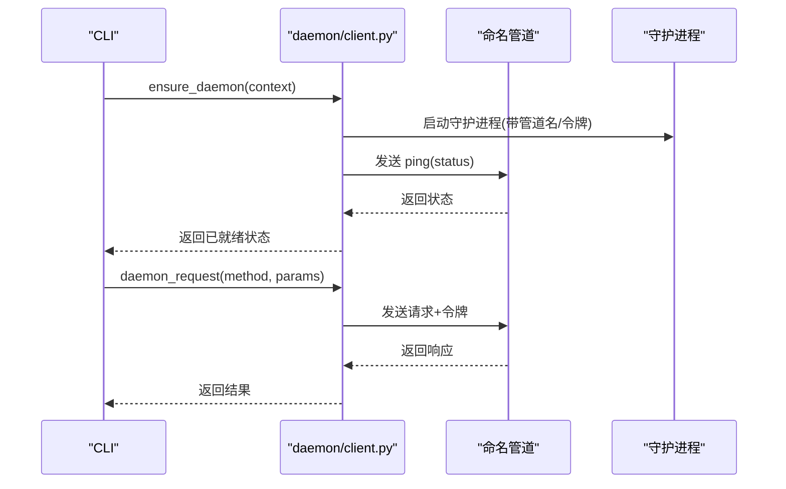
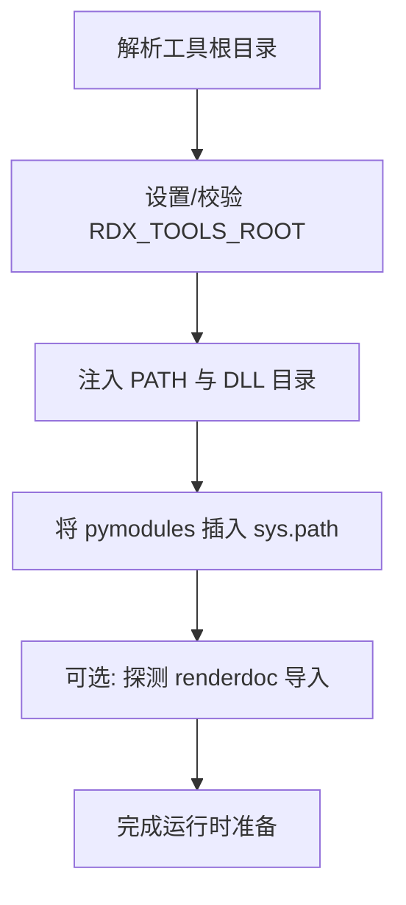
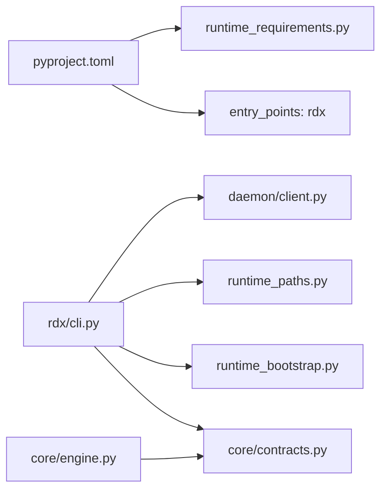

# 开发者指南

<cite>
**本文引用的文件**
- [README.md](file://README.md)
- [pyproject.toml](file://pyproject.toml)
- [rdx/__init__.py](file://rdx/__init__.py)
- [cli/run_cli.py](file://cli/run_cli.py)
- [rdx/cli.py](file://rdx/cli.py)
- [rdx/core/engine.py](file://rdx/core/engine.py)
- [rdx/daemon/client.py](file://rdx/daemon/client.py)
- [rdx/runtime_bootstrap.py](file://rdx/runtime_bootstrap.py)
- [rdx/runtime_paths.py](file://rdx/runtime_paths.py)
- [rdx/core/contracts.py](file://rdx/core/contracts.py)
- [rdx/runtime_requirements.py](file://rdx/runtime_requirements.py)
- [scripts/README.md](file://scripts/README.md)
- [tests/conftest.py](file://tests/conftest.py)
- [docs/doc-governance.md](file://docs/doc-governance.md)
- [docs/install.md](file://docs/install.md)
</cite>

## 目录
1. [简介](#简介)
2. [项目结构](#项目结构)
3. [核心组件](#核心组件)
4. [架构总览](#架构总览)
5. [详细组件分析](#详细组件分析)
6. [依赖关系分析](#依赖关系分析)
7. [性能考虑](#性能考虑)
8. [故障排查指南](#故障排查指南)
9. [结论](#结论)
10. [附录](#附录)

## 简介
本指南面向开发者，系统性介绍 rdx-tools 的架构、代码组织、运行时与守护进程交互、CLI 命令体系、测试策略、发布流程与文档治理。目标是帮助新贡献者快速上手，同时为有经验的开发者提供深入的技术细节与最佳实践。

## 项目结构
仓库采用“包内含运行时与CLI”的单体布局：核心逻辑位于 rdx 包，入口脚本在 cli/run_cli.py，Windows 批处理与 POSIX 可执行文件由打包阶段生成；测试与中间产物位于 tests 与 intermediate；文档位于 docs；脚本位于 scripts。

图示来源
- [README.md:1-58](file://README.md#L1-L58)
- [pyproject.toml:1-45](file://pyproject.toml#L1-L45)
- [cli/run_cli.py:1-290](file://cli/run_cli.py#L1-L290)
- [rdx/cli.py:1-800](file://rdx/cli.py#L1-L800)

章节来源
- [README.md:1-58](file://README.md#L1-L58)
- [pyproject.toml:1-45](file://pyproject.toml#L1-L45)

## 核心组件
- 运行时路径与环境
  - rdx/runtime_paths.py 提供工具根目录、二进制与Python运行时目录、中间产物目录等解析与创建。
  - rdx/runtime_bootstrap.py 负责渲染文档运行时的动态库路径注入、模块导入探测与环境准备。
- CLI 启动与适配
  - cli/run_cli.py 作为独立可执行入口，负责初始化工具根、检查依赖、引导运行时并转交到 rdx.cli。
  - rdx/cli.py 是主要 CLI 解析器与命令分发器，封装与守护进程的交互、结果标准化输出、格式化与错误处理。
- 守护进程客户端
  - rdx/daemon/client.py 封装 Windows 命名管道通信、守护进程生命周期管理、上下文状态持久化与清理。
- 执行引擎与契约
  - rdx/core/engine.py 统一执行引擎，负责操作解析、异步执行、结果归一化、追踪与制品发布。
  - rdx/core/contracts.py 定义统一的成功/失败响应结构、制品收集与 TSV 投影规范。
- 依赖与运行要求
  - rdx/runtime_requirements.py 列举必需第三方库与打包时排除项，保障自包含发行版的纯净性。
- 测试与脚本
  - tests/conftest.py 在测试前/后隔离运行时状态，确保幂等性。
  - scripts/README.md 提供烟检、发布门禁与安装脚本使用说明。

章节来源
- [rdx/runtime_paths.py:1-122](file://rdx/runtime_paths.py#L1-L122)
- [rdx/runtime_bootstrap.py:1-131](file://rdx/runtime_bootstrap.py#L1-L131)
- [cli/run_cli.py:1-290](file://cli/run_cli.py#L1-L290)
- [rdx/cli.py:1-800](file://rdx/cli.py#L1-L800)
- [rdx/daemon/client.py:1-833](file://rdx/daemon/client.py#L1-L833)
- [rdx/core/engine.py:1-204](file://rdx/core/engine.py#L1-L204)
- [rdx/core/contracts.py:1-248](file://rdx/core/contracts.py#L1-L248)
- [rdx/runtime_requirements.py:1-73](file://rdx/runtime_requirements.py#L1-L73)
- [tests/conftest.py:1-44](file://tests/conftest.py#L1-L44)
- [scripts/README.md:1-25](file://scripts/README.md#L1-L25)

## 架构总览
rdx-tools 采用“CLI 适配层 + 统一执行引擎 + 守护进程后端”的分层架构。CLI 层负责参数解析、上下文选择与结果输出；执行引擎负责操作路由、异常映射与结果标准化；守护进程通过命名管道承载会话、捕获与预览等后端能力。

图示来源
- [cli/run_cli.py:1-290](file://cli/run_cli.py#L1-L290)
- [rdx/cli.py:1-800](file://rdx/cli.py#L1-L800)
- [rdx/core/engine.py:1-204](file://rdx/core/engine.py#L1-L204)
- [rdx/core/contracts.py:1-248](file://rdx/core/contracts.py#L1-L248)
- [rdx/runtime_paths.py:1-122](file://rdx/runtime_paths.py#L1-L122)
- [rdx/runtime_bootstrap.py:1-131](file://rdx/runtime_bootstrap.py#L1-L131)
- [rdx/runtime_requirements.py:1-73](file://rdx/runtime_requirements.py#L1-L73)
- [rdx/daemon/client.py:1-833](file://rdx/daemon/client.py#L1-L833)

## 详细组件分析

### CLI 启动与命令适配
- 入口职责
  - 初始化工具根目录与运行时目录，设置上下文 ID，检查缺失依赖，必要时输出最小 doctor 结果。
  - 引导渲染文档运行时，加载 rdx.cli 并执行主循环。
- 命令解析与执行
  - 支持 version、doctor、tools list/search、daemon start/stop/status、context 操作、session 预览、completion、call、capture、vfs、diff/assert 等。
  - 对 TSV 输出进行投影渲染，对异常进行标准化错误载荷。
- 上下文与守护进程
  - 通过 ensure_daemon 与 daemon_request 与守护进程交互，支持超时、清理过期状态、心跳与客户端附着。

图示来源
- [cli/run_cli.py:225-290](file://cli/run_cli.py#L225-L290)
- [rdx/cli.py:393-516](file://rdx/cli.py#L393-L516)
- [rdx/daemon/client.py:576-675](file://rdx/daemon/client.py#L576-L675)

章节来源
- [cli/run_cli.py:160-290](file://cli/run_cli.py#L160-L290)
- [rdx/cli.py:393-706](file://rdx/cli.py#L393-L706)
- [rdx/daemon/client.py:420-469](file://rdx/daemon/client.py#L420-L469)

### 执行引擎与契约
- 统一执行
  - CoreEngine.execute 解析操作、异步调用处理器、规范化输出，自动收集制品并附加元数据（trace_id、transport、耗时）。
- 响应契约
  - canonical_success/canonical_error 规范化成功/失败载荷，支持 artifacts、projections、meta 字段。
  - collect_artifact_candidates 自动从历史字段中提取制品候选，支持路径与 URL。
- 错误映射
  - map_exception 将底层异常映射为统一错误码与类别，便于 CLI 一致呈现。

图示来源
- [rdx/core/engine.py:40-204](file://rdx/core/engine.py#L40-L204)
- [rdx/core/contracts.py:98-165](file://rdx/core/contracts.py#L98-L165)

章节来源
- [rdx/core/engine.py:1-204](file://rdx/core/engine.py#L1-L204)
- [rdx/core/contracts.py:1-248](file://rdx/core/contracts.py#L1-L248)

### 守护进程客户端与状态管理
- 状态文件与上下文
  - 以 JSON 文件形式保存守护进程与会话状态，支持多上下文隔离与清理。
- 生命周期管理
  - ensure_daemon 自动启动或复用守护进程，等待就绪，更新本地状态。
  - cleanup_stale_daemon_states 清理僵尸进程与过期状态，释放资源。
- 通信协议
  - 通过 Windows 命名管道发送请求，支持 ping、status、attach_client、heartbeat、clear_context 等方法。
  - 超时抛出 DaemonRequestTimeout，并携带诊断信息。

图示来源
- [rdx/daemon/client.py:576-675](file://rdx/daemon/client.py#L576-L675)
- [rdx/daemon/client.py:420-469](file://rdx/daemon/client.py#L420-L469)

章节来源
- [rdx/daemon/client.py:1-833](file://rdx/daemon/client.py#L1-L833)

### 运行时路径与环境准备
- 路径解析
  - RDX_TOOLS_ROOT 优先于脚本根目录，若不一致仅警告一次；提供 binaries_root、pymodules_dir、logs_dir、artifacts_dir 等。
- 环境准备
  - 注入 PATH 与 DLL 目录，将 pymodules 插入 sys.path，探测 renderdoc.pyd 导入可用性。
- 依赖约束
  - 必需依赖与打包排除清单，确保发行版自包含且不含开发/测试辅助包。

图示来源
- [rdx/runtime_paths.py:14-122](file://rdx/runtime_paths.py#L14-L122)
- [rdx/runtime_bootstrap.py:105-131](file://rdx/runtime_bootstrap.py#L105-L131)
- [rdx/runtime_requirements.py:52-73](file://rdx/runtime_requirements.py#L52-L73)

章节来源
- [rdx/runtime_paths.py:1-122](file://rdx/runtime_paths.py#L1-L122)
- [rdx/runtime_bootstrap.py:1-131](file://rdx/runtime_bootstrap.py#L1-L131)
- [rdx/runtime_requirements.py:1-73](file://rdx/runtime_requirements.py#L1-L73)

### 文档治理与安装
- 文档治理
  - CLI 优先；用户文档避免暴露 Python 内部实现细节；维护者文档可涉及工具目录与目录输入。
- 安装与升级
  - 自包含 Windows x64 包；通过安装脚本写入 PATH；doctor 检查完整性。

章节来源
- [docs/doc-governance.md:1-12](file://docs/doc-governance.md#L1-L12)
- [docs/install.md:1-31](file://docs/install.md#L1-L31)

## 依赖关系分析
- 构建与运行
  - 构建系统基于 setuptools；项目脚本注册 rdx 命令；运行时依赖 numpy、Pillow、jinja2、pydantic、aiofiles。
- 依赖发现
  - 通过 importlib.spec 检测缺失依赖；打包时排除测试与开发相关包前缀。
- CLI 与核心模块耦合
  - CLI 依赖 daemon/client、runtime_paths、runtime_bootstrap、core/contracts 等模块；执行引擎与契约解耦，便于扩展。

图示来源
- [pyproject.toml:1-45](file://pyproject.toml#L1-L45)
- [rdx/cli.py:17-46](file://rdx/cli.py#L17-L46)
- [rdx/daemon/client.py:1-29](file://rdx/daemon/client.py#L1-L29)
- [rdx/runtime_paths.py:1-122](file://rdx/runtime_paths.py#L1-L122)
- [rdx/runtime_bootstrap.py:1-131](file://rdx/runtime_bootstrap.py#L1-L131)
- [rdx/core/contracts.py:1-248](file://rdx/core/contracts.py#L1-L248)
- [rdx/core/engine.py:1-204](file://rdx/core/engine.py#L1-L204)

章节来源
- [pyproject.toml:1-45](file://pyproject.toml#L1-L45)
- [rdx/runtime_requirements.py:1-73](file://rdx/runtime_requirements.py#L1-L73)

## 性能考虑
- I/O 与序列化
  - 使用安全流写入与 JSON 序列化，避免阻塞；TSV 投影按需生成，减少冗余文本。
- 异步执行
  - 执行引擎异步化处理器调用，降低长尾延迟；超时策略在守护进程请求中明确给出。
- 进程与管道
  - 守护进程通过命名管道通信，避免跨进程共享状态带来的锁竞争；超时与重试策略降低抖动。
- 资源回收
  - 清理过期状态与僵尸进程，防止资源泄漏；上下文隔离避免并发干扰。

## 故障排查指南
- doctor 检查
  - CLI doctor 汇总 Python 运行时、渲染文档布局、依赖缺失、工具目录、守护进程状态与着色器工具可用性。
- 依赖缺失
  - 若缺失依赖，CLI 会直接提示并返回标准化错误载荷；建议使用安装脚本或发行包。
- 守护进程问题
  - 使用 cleanup_stale_daemon_states 清理过期状态；必要时 context clear 或显式 shutdown。
- 日志与状态
  - 中间产物 logs 与 artifacts 目录用于定位问题；运行时状态文件可用于诊断。

章节来源
- [rdx/cli.py:393-516](file://rdx/cli.py#L393-L516)
- [rdx/daemon/client.py:507-559](file://rdx/daemon/client.py#L507-L559)
- [scripts/README.md:1-25](file://scripts/README.md#L1-L25)

## 结论
rdx-tools 通过清晰的分层架构与标准化契约，实现了 CLI 与守护进程的稳定协作。其自包含发行与严格的文档治理降低了使用者门槛，同时为贡献者提供了可扩展的执行引擎与完善的测试与发布流程支撑。

## 附录

### 开发环境搭建
- 系统要求
  - Python 版本满足 pyproject.toml 中的要求；Windows x64 二进制与 Python 运行时随发行包提供。
- 安装与升级
  - 使用安装脚本进行安装/升级；doctor 检查完整性。
- 依赖
  - 运行时依赖通过发行包自带；开发依赖可通过可选 dev 分组安装。

章节来源
- [docs/install.md:1-31](file://docs/install.md#L1-L31)
- [pyproject.toml:10-27](file://pyproject.toml#L10-L27)

### 调试技巧
- CLI 输出
  - 使用 --json 获取标准化载荷；TSV 输出通过投影渲染。
- 诊断
  - doctor 输出包含工具根、依赖、渲染文档布局、守护进程状态等。
- 运行时隔离
  - 测试通过 conftest 隔离运行时状态，避免交叉污染。

章节来源
- [rdx/cli.py:393-516](file://rdx/cli.py#L393-L516)
- [tests/conftest.py:27-44](file://tests/conftest.py#L27-L44)

### 性能分析方法
- Trace 与元数据
  - 统一载荷包含 trace_id、transport、duration_ms，便于端到端追踪。
- I/O 与序列化
  - 使用安全流写入与 JSON 序列化，避免阻塞；TSV 投影按需生成。
- 超时策略
  - 守护进程请求超时与重试策略，结合诊断状态文件定位瓶颈。

章节来源
- [rdx/core/engine.py:40-76](file://rdx/core/engine.py#L40-L76)
- [rdx/daemon/client.py:420-469](file://rdx/daemon/client.py#L420-L469)

### 测试策略
- 标记与分类
  - unit、contract、fixture_integration、gpu_live 等标记区分测试类型。
- 隔离与清理
  - 测试前后自动清理运行时状态文件，确保幂等性。
- 烟检脚本
  - 通过 bash 执行 smoke_cli.sh，覆盖 doctor、工具发现与捕获链路。

章节来源
- [pyproject.toml:36-44](file://pyproject.toml#L36-L44)
- [tests/conftest.py:1-44](file://tests/conftest.py#L1-L44)
- [scripts/README.md:13-25](file://scripts/README.md#L13-L25)

### 发布流程
- 校验与打包
  - 使用 release_gate、package_release、verify_release_package 等脚本进行门禁与校验。
- 文档与一致性
  - 维护文档治理，保持 CLI 行为与用户文档一致；预览几何变更需同步 smoke 与文档。

章节来源
- [scripts/README.md:7-25](file://scripts/README.md#L7-L25)
- [docs/doc-governance.md:1-12](file://docs/doc-governance.md#L1-L12)

### 贡献指南与编码标准
- 贡献流程
  - 通过脚本与门禁确保质量；遵循文档治理与安装说明。
- 编码标准
  - 统一响应契约与错误映射；保持 CLI 优先与用户文档简洁。
- 审查流程
  - 门禁脚本与 smoke 测试作为强制检查项；预览相关变更需同步 smoke 与文档。

章节来源
- [docs/doc-governance.md:1-12](file://docs/doc-governance.md#L1-L12)
- [scripts/README.md:7-25](file://scripts/README.md#L7-L25)