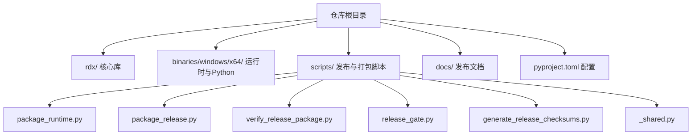
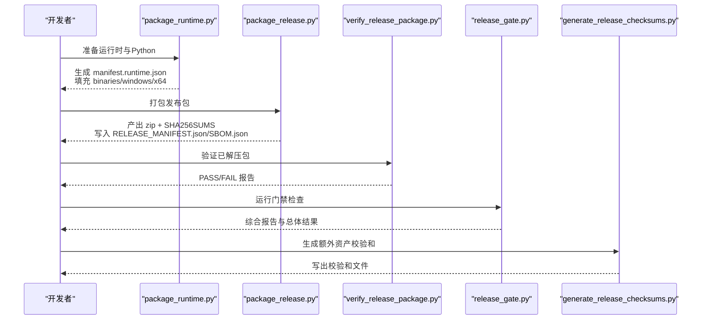
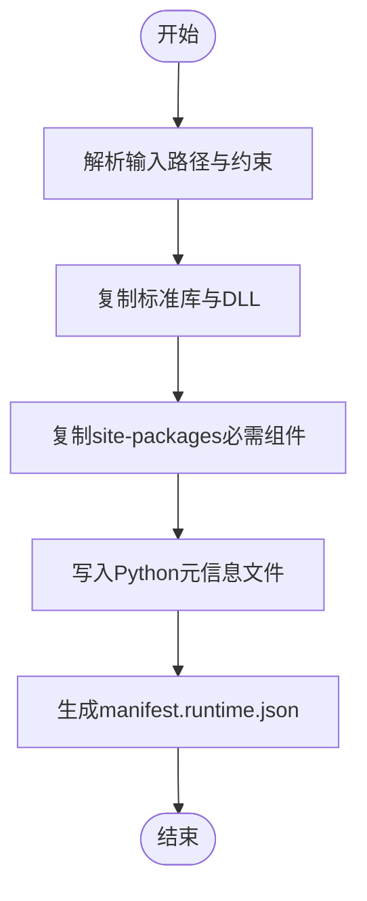
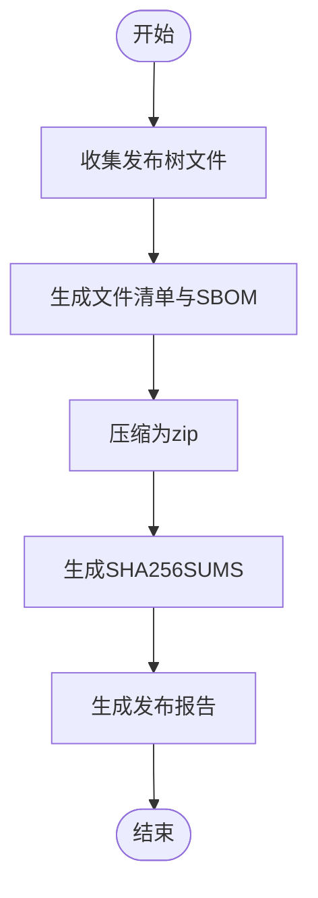
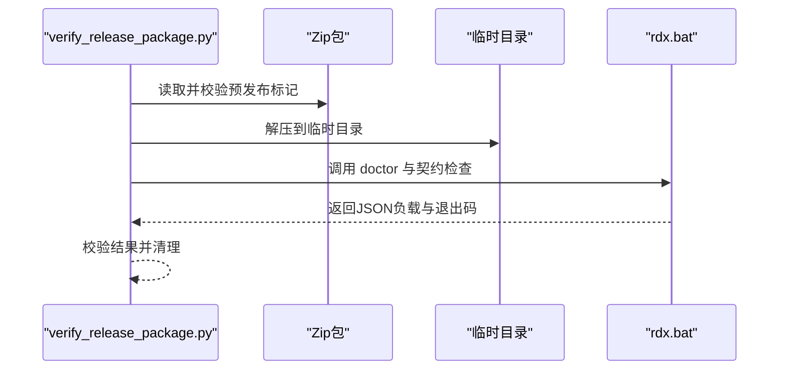
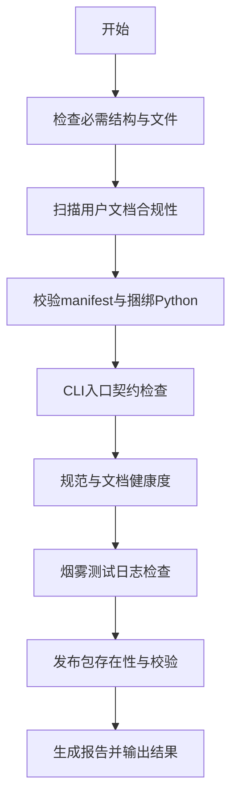
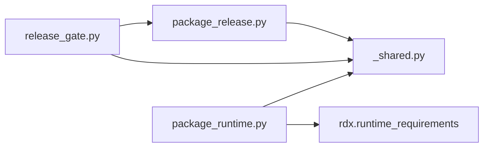

# 构建与发布

<cite>
**本文引用的文件**
- [pyproject.toml](file://pyproject.toml)
- [rdx/__init__.py](file://rdx/__init__.py)
- [scripts/_shared.py](file://scripts/_shared.py)
- [scripts/package_runtime.py](file://scripts/package_runtime.py)
- [scripts/package_release.py](file://scripts/package_release.py)
- [scripts/generate_release_checksums.py](file://scripts/generate_release_checksums.py)
- [scripts/verify_release_package.py](file://scripts/verify_release_package.py)
- [scripts/release_gate.py](file://scripts/release_gate.py)
- [scripts/cleanup_workspace.py](file://scripts/cleanup_workspace.py)
- [README.md](file://README.md)
- [docs/release-baseline.md](file://docs/release-baseline.md)
- [docs/release-notes.md](file://docs/release-notes.md)
- [binaries/windows/x64/manifest.runtime.json](file://binaries/windows/x64/manifest.runtime.json)
- [binaries/windows/x64/python/python314._pth](file://binaries/windows/x64/python/python314._pth)
</cite>

## 目录
1. [简介](#简介)
2. [项目结构](#项目结构)
3. [核心组件](#核心组件)
4. [架构总览](#架构总览)
5. [详细组件分析](#详细组件分析)
6. [依赖分析](#依赖分析)
7. [性能考虑](#性能考虑)
8. [故障排查指南](#故障排查指南)
9. [结论](#结论)
10. [附录](#附录)

## 简介
本文件面向发布工程师与开发者，系统化阐述 RDX 工具链的构建与发布流程，覆盖以下主题：
- 构建系统配置与打包流程：Python 包元数据、Windows 自包含运行时打包、完整性校验
- 发布流程：版本管理、变更日志生成、发布标签创建
- 发布包验证：校验和生成、包体完整性检查、签名验证
- 多平台发布策略：当前以 Windows x64 为主，Android 平台的特殊处理说明
- 发布前检查清单与回滚策略
- 自动化发布脚本的使用与定制方法

## 项目结构
仓库采用“功能模块 + 脚本驱动”的组织方式：
- 核心库位于 rdx/，通过入口脚本暴露命令行工具
- 运行时二进制与 Python 运行时打包在 binaries/windows/x64 下
- 打包与发布相关脚本集中在 scripts/，涵盖运行时打包、发布包打包、校验与门禁检查
- 文档位于 docs/，包含发布基线与发布说明

图表来源
- [scripts/package_runtime.py:1-355](file://scripts/package_runtime.py#L1-L355)
- [scripts/package_release.py:1-212](file://scripts/package_release.py#L1-L212)
- [scripts/verify_release_package.py:1-176](file://scripts/verify_release_package.py#L1-L176)
- [scripts/release_gate.py:1-532](file://scripts/release_gate.py#L1-L532)
- [scripts/generate_release_checksums.py:1-49](file://scripts/generate_release_checksums.py#L1-L49)
- [scripts/_shared.py:1-92](file://scripts/_shared.py#L1-L92)

章节来源
- [README.md:1-58](file://README.md#L1-L58)
- [docs/release-baseline.md:1-21](file://docs/release-baseline.md#L1-L21)

## 核心组件
- 版本与元数据
  - Python 包版本由 rdx/__init__.py 提供，pyproject.toml 中的 version 字段用于打包与发布报告
- 运行时打包
  - package_runtime.py 将 CPython 运行时与必要 DLL/库复制到 binaries/windows/x64，并生成 manifest.runtime.json
- 发布包打包
  - package_release.py 生成 Windows x64 自包含 zip，内含 RELEASE_MANIFEST.json、SBOM.json、LICENSE_INVENTORY.json 以及 SHA256SUMS
- 包验证
  - verify_release_package.py 对已解压包执行契约检查与诊断
  - release_gate.py 综合门禁检查，包括清单完整性、捆绑 Python 合法性、CLI 入口契约、用户文档合规等
- 校验与清理
  - generate_release_checksums.py 为资产批量生成 SHA256SUMS
  - cleanup_workspace.py 安全清理临时文件

章节来源
- [pyproject.toml:1-45](file://pyproject.toml#L1-L45)
- [rdx/__init__.py:1-4](file://rdx/__init__.py#L1-L4)
- [scripts/package_runtime.py:1-355](file://scripts/package_runtime.py#L1-L355)
- [scripts/package_release.py:1-212](file://scripts/package_release.py#L1-L212)
- [scripts/verify_release_package.py:1-176](file://scripts/verify_release_package.py#L1-L176)
- [scripts/release_gate.py:1-532](file://scripts/release_gate.py#L1-L532)
- [scripts/generate_release_checksums.py:1-49](file://scripts/generate_release_checksums.py#L1-L49)
- [scripts/cleanup_workspace.py:1-116](file://scripts/cleanup_workspace.py#L1-L116)

## 架构总览
下图展示从源码到发布包的端到端流程，以及门禁与验证环节。

图表来源
- [scripts/package_runtime.py:288-351](file://scripts/package_runtime.py#L288-L351)
- [scripts/package_release.py:165-207](file://scripts/package_release.py#L165-L207)
- [scripts/verify_release_package.py:146-171](file://scripts/verify_release_package.py#L146-L171)
- [scripts/release_gate.py:397-527](file://scripts/release_gate.py#L397-L527)
- [scripts/generate_release_checksums.py:22-44](file://scripts/generate_release_checksums.py#L22-L44)

## 详细组件分析

### Python 包构建与版本管理
- 版本来源
  - rdx/__init__.py 提供 __version__
  - pyproject.toml 的 project.version 作为打包与报告依据
- 依赖与入口
  - 项目脚本入口 rdx 指向 rdx.cli:main
  - 测试与开发依赖在 pyproject.toml 中定义
- 版本一致性
  - 发布脚本会比对请求版本与实际版本，避免错配

章节来源
- [rdx/__init__.py:1-4](file://rdx/__init__.py#L1-L4)
- [pyproject.toml:5-27](file://pyproject.toml#L5-L27)

### Windows x64 运行时打包（binaries/windows/x64）
- 目标
  - 将 CPython 运行时与标准库、扩展 DLL、site-packages 必需组件打包至 binaries/windows/x64
- 关键步骤
  - 解析输入路径与约束（不允许指向输出树内部）
  - 过滤禁止后缀（.pdb/.lib/.exp/.ilk/.h），保留 .dll/.json 等
  - 复制标准库并跳过测试/文档等顶层目录
  - 生成 manifest.runtime.json，记录每个文件的大小与 SHA256
  - 写入 Python 运行时元信息（版本、入口、路径等）

图表来源
- [scripts/package_runtime.py:135-215](file://scripts/package_runtime.py#L135-L215)
- [scripts/package_runtime.py:246-268](file://scripts/package_runtime.py#L246-L268)
- [scripts/package_runtime.py:335-349](file://scripts/package_runtime.py#L335-L349)

章节来源
- [scripts/package_runtime.py:1-355](file://scripts/package_runtime.py#L1-L355)
- [binaries/windows/x64/manifest.runtime.json](file://binaries/windows/x64/manifest.runtime.json)
- [binaries/windows/x64/python/python314._pth](file://binaries/windows/x64/python/python314._pth)

### 发布包打包与完整性校验
- 目标
  - 生成 Windows x64 自包含 zip，包含根级 RELEASE_MANIFEST.json、SBOM.json、LICENSE_INVENTORY.json
- 关键步骤
  - 收集受控根文件与目录集合，排除缓存与测试
  - 计算每个文件 SHA256，生成清单
  - 压缩为 zip，命名规则包含版本与平台
  - 生成 SHA256SUMS 文件，记录包名与哈希
  - 输出发布报告

图表来源
- [scripts/package_release.py:84-103](file://scripts/package_release.py#L84-L103)
- [scripts/package_release.py:134-153](file://scripts/package_release.py#L134-L153)
- [scripts/package_release.py:156-163](file://scripts/package_release.py#L156-L163)
- [scripts/package_release.py:191-204](file://scripts/package_release.py#L191-L204)

章节来源
- [scripts/package_release.py:1-212](file://scripts/package_release.py#L1-L212)

### 发布包验证流程
- 验证内容
  - 未包含预发布遗留路径或文本标记
  - 正确解包后，通过 rdx.bat doctor 与 CLI 契约检查
- 关键步骤
  - 解压 zip 至临时目录，定位包根
  - 使用 cmd.exe 调用 rdx.bat 执行诊断与契约检查
  - 若失败，返回错误并清理临时目录

图表来源
- [scripts/verify_release_package.py:146-171](file://scripts/verify_release_package.py#L146-L171)
- [scripts/verify_release_package.py:83-93](file://scripts/verify_release_package.py#L83-L93)
- [scripts/verify_release_package.py:95-125](file://scripts/verify_release_package.py#L95-L125)

章节来源
- [scripts/verify_release_package.py:1-176](file://scripts/verify_release_package.py#L1-L176)

### 发布门禁（Release Gate）
- 检查范围
  - 结构完整性（必需目录/文件存在）
  - 用户文档不包含 Python 引导相关内容
  - manifest.runtime.json 完整性与文件校验
  - 捆绑 Python 合法性
  - CLI 入口契约（doctor/version/context/vfs 等）
  - 规范校验与 Markdown 健康度
  - 可选/必选的 Bash CLI 烟雾测试日志
  - 发布包存在性与校验和匹配、包体验证
- 报告输出
  - 生成中间报告文件，汇总所有检查项与总体结果

图表来源
- [scripts/release_gate.py:417-527](file://scripts/release_gate.py#L417-L527)
- [scripts/release_gate.py:228-257](file://scripts/release_gate.py#L228-L257)
- [scripts/release_gate.py:434-435](file://scripts/release_gate.py#L434-L435)
- [scripts/release_gate.py:437-440](file://scripts/release_gate.py#L437-L440)
- [scripts/release_gate.py:494-499](file://scripts/release_gate.py#L494-L499)
- [scripts/release_gate.py:504-511](file://scripts/release_gate.py#L504-L511)

章节来源
- [scripts/release_gate.py:1-532](file://scripts/release_gate.py#L1-L532)

### 多平台发布策略
- 当前主平台
  - Windows x64：自包含 zip，内置 Python 运行时与二进制
- Android 平台
  - 仓库包含 android/arm32 与 android/arm64 子目录，但发布流程主要针对 Windows x64；Android 平台的打包与分发策略不在现有脚本中体现，建议在 CI 中按平台分别构建并生成对应清单与校验和

章节来源
- [README.md:36-38](file://README.md#L36-L38)

### 自动化发布脚本使用与定制
- 基线流程
  - 规范校验 → 测试 → Markdown 健康度 → 运行时打包 → 发布包打包 → 门禁检查（可选要求烟雾测试与发布包）
- 常用脚本
  - package_runtime.py：准备运行时与 Python
  - package_release.py：生成发布包与校验和
  - verify_release_package.py：验证已解压包
  - release_gate.py：综合门禁检查
  - generate_release_checksums.py：为资产生成 SHA256SUMS
  - cleanup_workspace.py：安全清理临时文件
- 定制建议
  - 在 CI 中增加 Android 平台构建步骤，生成对应清单与校验和
  - 将门禁检查作为 PR/Tag 前置条件，确保发布包质量
  - 将“烟雾测试”纳入门禁（可选/必选），保证 CLI 行为稳定

章节来源
- [docs/release-baseline.md:1-21](file://docs/release-baseline.md#L1-L21)
- [scripts/package_runtime.py:279-286](file://scripts/package_runtime.py#L279-L286)
- [scripts/package_release.py:165-169](file://scripts/package_release.py#L165-L169)
- [scripts/verify_release_package.py:146-149](file://scripts/verify_release_package.py#L146-L149)
- [scripts/release_gate.py:397-415](file://scripts/release_gate.py#L397-L415)
- [scripts/generate_release_checksums.py:22-26](file://scripts/generate_release_checksums.py#L22-L26)
- [scripts/cleanup_workspace.py:75-80](file://scripts/cleanup_workspace.py#L75-L80)

## 依赖分析
- 组件耦合
  - package_release.py 依赖 _shared 提供工具根路径与通用 I/O
  - release_gate.py 依赖 package_release 的常量与 _shared 的工具函数
  - package_runtime.py 依赖 rdx.runtime_requirements 判定是否打包第三方站点包
- 外部依赖
  - Python 运行时与 CPython 标准库
  - 可选工具 ripgrep（rg）用于高效文本扫描，若不可用则回退纯 Python 实现

图表来源
- [scripts/package_release.py:15-20](file://scripts/package_release.py#L15-L20)
- [scripts/release_gate.py:17-23](file://scripts/release_gate.py#L17-L23)
- [scripts/package_runtime.py:19-20](file://scripts/package_runtime.py#L19-L20)

章节来源
- [scripts/package_release.py:1-212](file://scripts/package_release.py#L1-L212)
- [scripts/release_gate.py:1-532](file://scripts/release_gate.py#L1-L532)
- [scripts/package_runtime.py:1-355](file://scripts/package_runtime.py#L1-L355)
- [scripts/_shared.py:1-92](file://scripts/_shared.py#L1-L92)

## 性能考虑
- 打包阶段
  - 大文件分块读取计算 SHA256，降低内存峰值
  - 压缩级别设置为最高，平衡体积与时间
- 验证阶段
  - 仅对必要文件进行校验，避免重复扫描
  - 门禁检查优先失败项，尽早返回

## 故障排查指南
- 常见问题与定位
  - 运行时清单缺失或校验失败：检查 binaries/windows/x64/manifest.runtime.json 是否存在且字段完整
  - 发布包校验和不匹配：确认 SHA256SUMS 是否与包名一致
  - 门禁 FAIL：查看 intermediate/logs/release_gate_report.md 获取具体失败项
  - 预发布残留：verify_release_package.py 会检测路径与文本标记，修正后重试
- 清理与重试
  - 使用 cleanup_workspace.py 安全清理临时文件与缓存
  - 重新运行 package_runtime.py 与 package_release.py 重建包

章节来源
- [scripts/release_gate.py:228-257](file://scripts/release_gate.py#L228-L257)
- [scripts/release_gate.py:311-337](file://scripts/release_gate.py#L311-L337)
- [scripts/verify_release_package.py:127-144](file://scripts/verify_release_package.py#L127-L144)
- [scripts/cleanup_workspace.py:75-111](file://scripts/cleanup_workspace.py#L75-L111)

## 结论
本流程以脚本化与门禁为核心，确保发布包的完整性、一致性与可验证性。当前以 Windows x64 为主要目标，建议在 CI 中扩展 Android 平台并配套生成清单与校验和。通过规范化的基线流程与自动化门禁，可显著提升发布质量与可追溯性。

## 附录

### 发布前检查清单
- [ ] 规范校验通过（spec/validate_catalog.py）
- [ ] 单元测试通过（pytest）
- [ ] 文档健康度检查通过（scripts/check_markdown_health.py）
- [ ] 运行时打包完成（binaries/windows/x64/manifest.runtime.json）
- [ ] 发布包生成（dist/*.zip 与 SHA256SUMS）
- [ ] 包验证通过（scripts/verify_release_package.py）
- [ ] 门禁检查通过（scripts/release_gate.py）
- [ ] 可选：烟雾测试日志存在并通过（intermediate/logs/smoke_cli.log）

章节来源
- [docs/release-baseline.md:3-11](file://docs/release-baseline.md#L3-L11)

### 回滚策略
- 若门禁或验证失败，保留当前 dist 与 intermediate/logs，修复后重新运行门禁
- 回滚发布包时，删除最新 dist/zip 并移除对应校验和条目，恢复上一版本包与校验和
- 如涉及用户侧安装脚本（scripts/rdx_install.ps1），同步回滚至稳定版本

章节来源
- [scripts/release_gate.py:513-527](file://scripts/release_gate.py#L513-L527)
- [docs/release-notes.md:1-16](file://docs/release-notes.md#L1-L16)