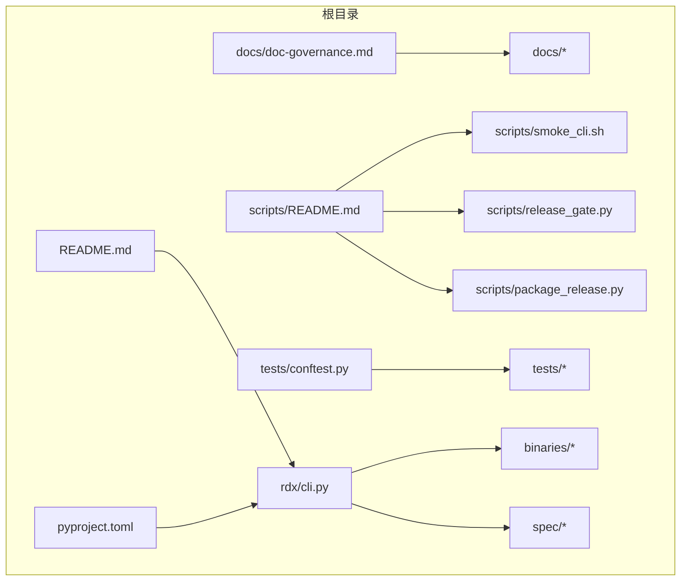
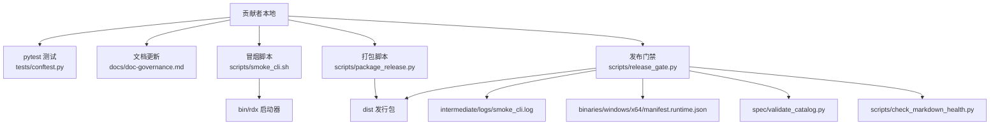
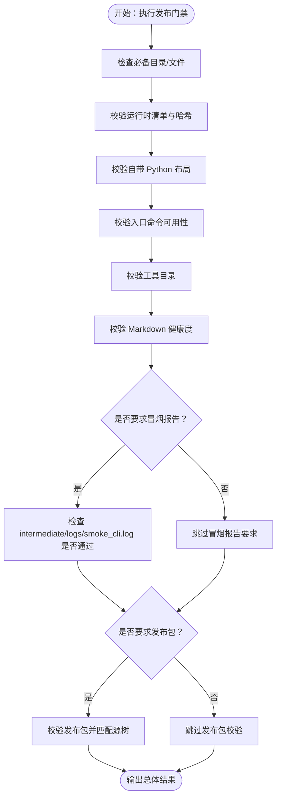
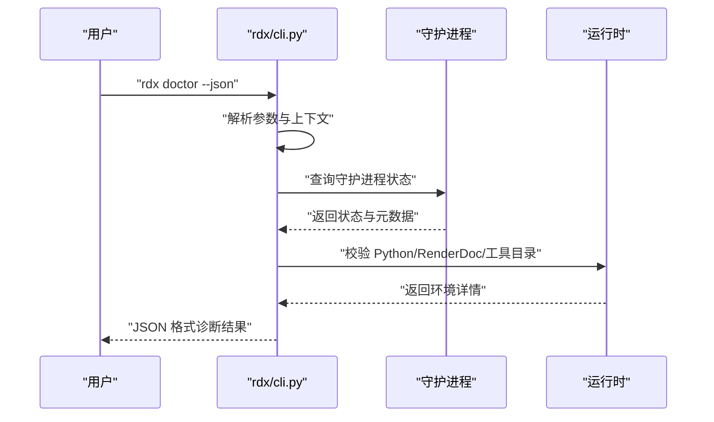
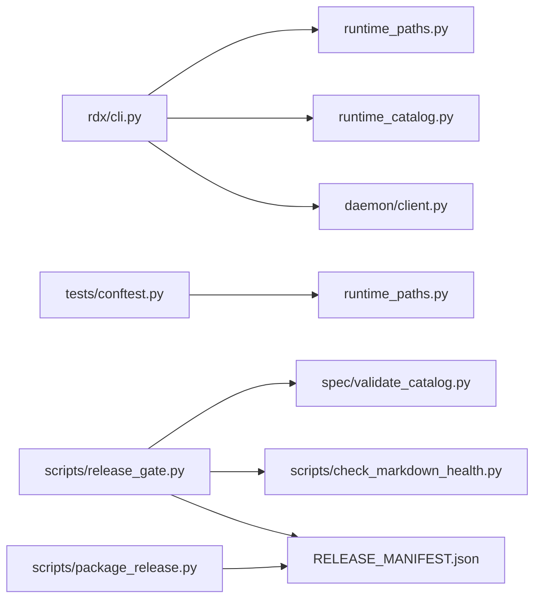

# 贡献流程

<cite>
**本文引用的文件**
- [README.md](file://README.md)
- [docs/doc-governance.md](file://docs/doc-governance.md)
- [pyproject.toml](file://pyproject.toml)
- [scripts/README.md](file://scripts/README.md)
- [scripts/smoke_cli.sh](file://scripts/smoke_cli.sh)
- [scripts/release_gate.py](file://scripts/release_gate.py)
- [scripts/package_release.py](file://scripts/package_release.py)
- [tests/conftest.py](file://tests/conftest.py)
- [rdx/cli.py](file://rdx/cli.py)
</cite>

## 目录
1. [简介](#简介)
2. [项目结构](#项目结构)
3. [核心组件](#核心组件)
4. [架构总览](#架构总览)
5. [详细组件分析](#详细组件分析)
6. [依赖关系分析](#依赖关系分析)
7. [性能考虑](#性能考虑)
8. [故障排查指南](#故障排查指南)
9. [结论](#结论)
10. [附录](#附录)

## 简介
本指南面向希望参与 RDX Agent Tools 工具集开发的贡献者，覆盖从开发环境准备、代码提交与分支管理、合并请求流程到文档治理、版本控制与代码审查的最佳实践。同时提供脚本化测试与发布门禁检查的工作流说明，帮助确保变更质量与一致性。

## 项目结构
该仓库采用“CLI 优先”的包形态，核心入口为 Windows 批处理启动器与跨平台二进制启动器，配合自包含的 Python 运行时与工具目录，形成可独立部署的发行包。关键目录与文件职责概览：
- docs：用户与内部文档，遵循“CLI 命令优先”与“不暴露 Python 内部实现细节”的原则
- scripts：可复用的冒烟与发布门禁检查脚本
- tests：基于 pytest 的测试框架，含自动清理运行时状态的夹具
- rdx：Python 包，提供 CLI 适配层与运行时交互
- binaries：自包含运行时与模块
- spec：工具目录与校验脚本
- 其他：pyproject.toml、README.md 等

图表来源
- [README.md](file://README.md)
- [pyproject.toml](file://pyproject.toml)
- [docs/doc-governance.md](file://docs/doc-governance.md)
- [scripts/README.md](file://scripts/README.md)
- [scripts/smoke_cli.sh](file://scripts/smoke_cli.sh)
- [scripts/release_gate.py](file://scripts/release_gate.py)
- [scripts/package_release.py](file://scripts/package_release.py)
- [tests/conftest.py](file://tests/conftest.py)
- [rdx/cli.py](file://rdx/cli.py)

章节来源
- [README.md](file://README.md)
- [pyproject.toml](file://pyproject.toml)
- [docs/doc-governance.md](file://docs/doc-governance.md)
- [scripts/README.md](file://scripts/README.md)

## 核心组件
- CLI 启动与命令分发：通过 rdx/cli.py 提供统一入口，支持 doctor、tools、daemon、context、session preview、call、capture、vfs、diff、assert、completion 等命令族
- 发布门禁检查：scripts/release_gate.py 对结构完整性、清单一致性、用户文档合规性、入口可用性、工具目录校验、Markdown 健康度、冒烟日志与发布包进行综合检查
- 冒烟脚本：scripts/smoke_cli.sh 以 Bash 直接调用 bin/rdx 执行基础与可选捕获链路，输出中间日志
- 发布打包：scripts/package_release.py 构建自包含 Windows x64 Zip 包，生成清单与校验信息
- 测试夹具：tests/conftest.py 在每次测试前/后隔离并清理运行时状态，保证测试稳定性
- 文档治理：docs/doc-governance.md 明确用户文档与内部文档边界、导航链接维护与预览几何一致性要求

章节来源
- [rdx/cli.py](file://rdx/cli.py)
- [scripts/release_gate.py](file://scripts/release_gate.py)
- [scripts/smoke_cli.sh](file://scripts/smoke_cli.sh)
- [scripts/package_release.py](file://scripts/package_release.py)
- [tests/conftest.py](file://tests/conftest.py)
- [docs/doc-governance.md](file://docs/doc-governance.md)

## 架构总览
下图展示从贡献者本地到发布门禁的整体流程，以及关键组件之间的交互。

图表来源
- [scripts/smoke_cli.sh](file://scripts/smoke_cli.sh)
- [scripts/package_release.py](file://scripts/package_release.py)
- [scripts/release_gate.py](file://scripts/release_gate.py)
- [tests/conftest.py](file://tests/conftest.py)
- [docs/doc-governance.md](file://docs/doc-governance.md)

## 详细组件分析

### 贡献流程与分支策略
- 分支命名建议
  - 功能开发：feature/功能点简述
  - 修复：fix/问题描述
  - 文档：docs/更新范围
  - 重构：refactor/影响范围
- 提交信息规范
  - 类型: 摘要
  - 类型取值：feat、fix、docs、style、refactor、perf、test、build、ci、chore
  - 摘要简洁明确，必要时在正文补充动机与影响
- 合并请求（MR）
  - 必须包含冒烟日志与测试结果摘要
  - 需通过发布门禁检查
  - 至少一名维护者审查并批准
  - 合并前确保工具目录与用户文档同步更新

章节来源
- [scripts/release_gate.py](file://scripts/release_gate.py)
- [docs/doc-governance.md](file://docs/doc-governance.md)

### 文档治理规则
- 用户文档优先：仅描述 Shell 入口与标准 JSON 行为，避免暴露 Python 内部实现
- 导航链接维护：保持与 AGENTS.md 一致；用户文档不得引导用户执行虚拟环境或包管理器安装
- 版本与依赖来源：GA 产物自包含，依赖来源通过 pyproject.toml、运行时清单、许可证清单与 SBOM 追踪
- 工具目录同步：对涉及预览几何的行为变更，需同步更新 preview_geometry_smoke.py 与用户文档

章节来源
- [docs/doc-governance.md](file://docs/doc-governance.md)

### 版本控制与代码审查
- 版本号来源：pyproject.toml 中的 project.version
- 变更记录：CHANGELOG.md 由维护者更新
- 审查要点
  - CLI 命令行为与 JSON 输出一致性
  - 工具目录变更与 catalog 校验
  - 用户文档与内部文档边界清晰
  - 发布门禁检查项全部通过

章节来源
- [pyproject.toml](file://pyproject.toml)
- [scripts/release_gate.py](file://scripts/release_gate.py)

### 开发环境搭建
- 基础依赖
  - Python：>=3.11（推荐使用系统自带或已配置的解释器）
  - 依赖声明：见 pyproject.toml 的 dependencies 与 optional-dependencies.dev
- 安装与运行
  - 使用 pip 安装开发依赖：pytest
  - 运行测试：pytest（默认 testpaths 指向 tests，且忽略 intermediate、binaries 等目录）
  - 运行冒烟：bash scripts/smoke_cli.sh（在 Bash 终端中可见每一步 CLI 调用）
- CLI 入口
  - rdx 命令由 pyproject.toml 的 project.scripts.rdx 指定
  - 支持 completion 生成不同 Shell 的补全脚本

章节来源
- [pyproject.toml](file://pyproject.toml)
- [tests/conftest.py](file://tests/conftest.py)
- [scripts/README.md](file://scripts/README.md)
- [scripts/smoke_cli.sh](file://scripts/smoke_cli.sh)
- [rdx/cli.py](file://rdx/cli.py)

### 测试运行与冒烟检查
- 测试运行
  - pytest 自动加载 tests 目录，使用 conftest.py 隔离运行时状态
  - 支持标记：unit、contract、fixture_integration、gpu_live
- 冒烟检查
  - 通过 Bash 直接调用 bin/rdx，覆盖 doctor、tools 列表/搜索、上下文与 VFS 基础能力
  - 可选传入外部 .rdc 文件以执行带守护进程的捕获链路
  - 日志输出至 intermediate/logs/smoke_cli.log

章节来源
- [tests/conftest.py](file://tests/conftest.py)
- [scripts/README.md](file://scripts/README.md)
- [scripts/smoke_cli.sh](file://scripts/smoke_cli.sh)

### 发布门禁检查（Release Gate）
- 结构与清单
  - 必备目录与文件存在性检查
  - Windows x64 运行时清单完整性与哈希校验
  - 自带 Python 运行时布局验证
- 入口可用性
  - rdx.bat 与 rdx 启动器的 doctor、version、completion、context、vfs、call 等命令可用
- 工具目录与健康度
  - 工具目录校验通过
  - Markdown 健康度检查通过
- 报告与证据
  - 可选要求冒烟日志中包含“PASS”
  - 可选要求发布包存在并校验匹配源树

图表来源
- [scripts/release_gate.py](file://scripts/release_gate.py)

章节来源
- [scripts/release_gate.py](file://scripts/release_gate.py)

### 发布打包与校验
- 打包流程
  - 选择受控的根文件与目录集合复制到暂存区
  - 生成 RELEASE_MANIFEST.json、LICENSE_INVENTORY.json、SBOM.json
  - 打包为 Windows x64 Zip 并生成 SHA256SUMS
- 校验流程
  - scripts/release_gate.py 调用 verify_release_package.py 校验包内清单与源树一致性

章节来源
- [scripts/package_release.py](file://scripts/package_release.py)
- [scripts/release_gate.py](file://scripts/release_gate.py)

### CLI 命令与参数解析（代码级概览）
- 命令分发：rdx/cli.py 将命令映射到具体处理器，如 doctor、tools list/search、daemon、context、session preview、call、capture、vfs、diff、assert、completion
- 参数解析：支持 --json、--daemon-context、--args-json/--args-file、--format 等通用选项
- 错误处理：统一返回标准化错误载荷，便于下游消费

图表来源
- [rdx/cli.py](file://rdx/cli.py)

章节来源
- [rdx/cli.py](file://rdx/cli.py)

## 依赖关系分析
- CLI 与运行时
  - rdx/cli.py 依赖运行时路径、工具目录与守护进程客户端
- 测试与运行时隔离
  - tests/conftest.py 在每次测试前后清理运行时状态，避免跨用例污染
- 发布门禁与工具目录
  - scripts/release_gate.py 依赖 spec/validate_catalog.py 与 scripts/check_markdown_health.py
- 构建与清单
  - scripts/package_release.py 生成 RELEASE_MANIFEST.json 与校验文件，供 scripts/release_gate.py 校验

图表来源
- [rdx/cli.py](file://rdx/cli.py)
- [tests/conftest.py](file://tests/conftest.py)
- [scripts/release_gate.py](file://scripts/release_gate.py)
- [scripts/package_release.py](file://scripts/package_release.py)

章节来源
- [rdx/cli.py](file://rdx/cli.py)
- [tests/conftest.py](file://tests/conftest.py)
- [scripts/release_gate.py](file://scripts/release_gate.py)
- [scripts/package_release.py](file://scripts/package_release.py)

## 性能考虑
- 冒烟脚本使用 Bash 直接调用 bin/rdx，减少额外 Python 调度开销，便于在 CI 终端中观察每一步 CLI 调用
- 发布门禁检查优先使用系统工具（如 rg）进行文本扫描，若不可用则回退到纯 Python 实现，确保在不同环境中稳定运行
- 测试夹具自动清理运行时状态，避免重复初始化带来的额外时间消耗

## 故障排查指南
- 冒烟失败
  - 检查 intermediate/logs/smoke_cli.log 中的错误行与上下文状态
  - 若超时，确认 STEP_TIMEOUT 与 OPEN_TIMEOUT 设置是否合理
- 发布门禁失败
  - 清单不一致：核对 binaries/windows/x64/manifest.runtime.json 与源树差异
  - 用户文档包含包管理器指令：根据 docs/doc-governance.md 规范修改
  - 缺失必备目录/文件：对照 scripts/release_gate.py 中的 REQUIRED_DIRS/REQUIRED_FILES
- 测试异常
  - 查看 tests/conftest.py 的隔离逻辑是否生效，确认中间态文件被正确清理
- CLI 诊断
  - 使用 rdx --json doctor 获取环境与工具目录状态，定位缺失项

章节来源
- [scripts/smoke_cli.sh](file://scripts/smoke_cli.sh)
- [scripts/release_gate.py](file://scripts/release_gate.py)
- [tests/conftest.py](file://tests/conftest.py)
- [docs/doc-governance.md](file://docs/doc-governance.md)
- [rdx/cli.py](file://rdx/cli.py)

## 结论
通过 CLI 优先的设计、严格的发布门禁与脚本化冒烟检查，本项目在保证用户使用体验的同时，确保了内部实现的一致性与可维护性。贡献者应严格遵循文档治理与版本控制规范，确保每次变更都经过充分验证与审查。

## 附录
- 常用命令速查
  - 运行冒烟：bash scripts/smoke_cli.sh
  - 运行发布门禁：python scripts/release_gate.py
  - 构建发布包：python scripts/package_release.py
  - 运行测试：pytest
- 贡献示例
  - 新增工具：更新工具目录与 catalog 校验脚本，同步更新用户文档与预览几何相关说明
  - 修复 CLI 行为：补充测试用例，确保 JSON 输出契约不变，更新冒烟脚本中的相关步骤