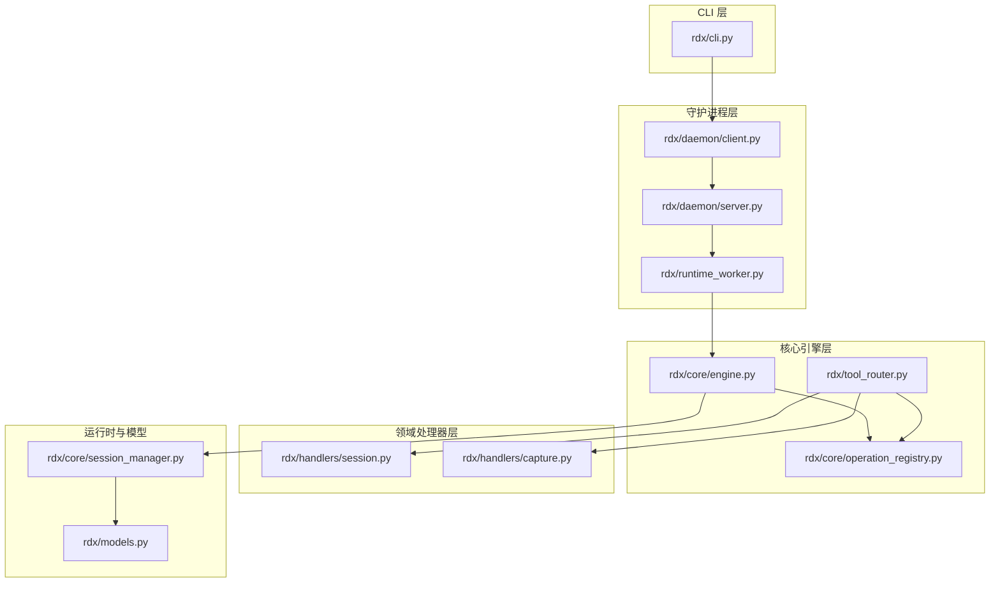
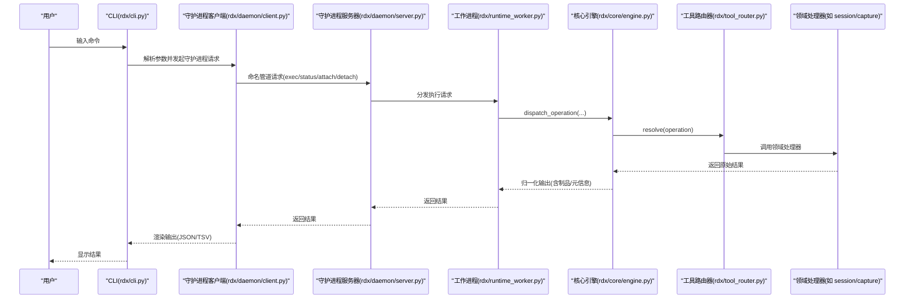
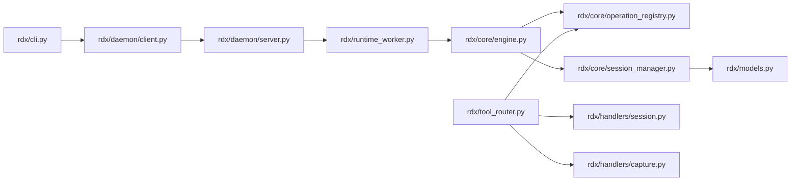

# 项目架构

<cite>
**本文引用的文件列表**
- [README.md](file://README.md)
- [pyproject.toml](file://pyproject.toml)
- [rdx/__init__.py](file://rdx/__init__.py)
- [rdx/cli.py](file://rdx/cli.py)
- [rdx/tool_router.py](file://rdx/tool_router.py)
- [rdx/core/engine.py](file://rdx/core/engine.py)
- [rdx/core/operation_registry.py](file://rdx/core/operation_registry.py)
- [rdx/core/session_manager.py](file://rdx/core/session_manager.py)
- [rdx/daemon/client.py](file://rdx/daemon/client.py)
- [rdx/daemon/server.py](file://rdx/daemon/server.py)
- [rdx/runtime_worker.py](file://rdx/runtime_worker.py)
- [rdx/handlers/session.py](file://rdx/handlers/session.py)
- [rdx/handlers/capture.py](file://rdx/handlers/capture.py)
- [rdx/models.py](file://rdx/models.py)
</cite>

## 目录
1. [引言](#引言)
2. [项目结构](#项目结构)
3. [核心组件](#核心组件)
4. [架构总览](#架构总览)
5. [详细组件分析](#详细组件分析)
6. [依赖关系分析](#依赖关系分析)
7. [性能考量](#性能考量)
8. [故障排查指南](#故障排查指南)
9. [结论](#结论)
10. [附录](#附录)

## 引言
本文件系统性阐述 RDC-Agent-Tools 的整体架构与组件关系，重点覆盖分层架构模式（CLI 接口层、守护进程层、核心引擎层、领域处理器层）、模块化与插件化设计、以及关键组件（工具路由器、操作注册表、会话管理器）的职责与交互。文档同时给出数据流图与架构图，帮助读者从命令输入到结果输出的完整链路进行理解，并解释设计决策与技术选型。

## 项目结构
项目采用“包内分层 + 领域处理器”的组织方式：
- CLI 层：通过命令行入口对接用户，负责参数解析、错误包装与输出渲染。
- 守护进程层：基于命名管道提供长驻服务，承载上下文状态、客户端生命周期与工作进程编排。
- 核心引擎层：统一执行引擎，负责操作解析、执行、归一化输出与错误映射。
- 领域处理器层：按领域划分（会话、捕获、资源、管线等），通过路由与前置条件校验将操作分发至具体处理逻辑。

**图表来源**
- [rdx/cli.py:1-1447](file://rdx/cli.py#L1-L1447)
- [rdx/daemon/client.py:1-833](file://rdx/daemon/client.py#L1-L833)
- [rdx/daemon/server.py:1-690](file://rdx/daemon/server.py#L1-L690)
- [rdx/runtime_worker.py:1-119](file://rdx/runtime_worker.py#L1-L119)
- [rdx/core/engine.py:1-204](file://rdx/core/engine.py#L1-L204)
- [rdx/core/operation_registry.py:1-45](file://rdx/core/operation_registry.py#L1-L45)
- [rdx/tool_router.py:1-151](file://rdx/tool_router.py#L1-L151)
- [rdx/handlers/session.py:1-11](file://rdx/handlers/session.py#L1-L11)
- [rdx/handlers/capture.py:1-11](file://rdx/handlers/capture.py#L1-L11)
- [rdx/core/session_manager.py:1-547](file://rdx/core/session_manager.py#L1-L547)
- [rdx/models.py:1-558](file://rdx/models.py#L1-L558)

**章节来源**
- [README.md:1-58](file://README.md#L1-L58)
- [pyproject.toml:1-45](file://pyproject.toml#L1-L45)

## 核心组件
- 工具路由器（Tool Router）
  - 基于工具目录加载工具清单，建立“工具名”到“领域处理器”的映射；在执行前进行前置条件校验，确保运行环境满足要求。
- 操作注册表（Operation Registry）
  - 统一注册与解析操作名称到处理器函数，支持默认处理器与多注册能力。
- 执行引擎（Core Engine）
  - 解析操作、调用处理器、归一化输出格式、收集制品、记录元信息与追踪 ID，并将异常映射为标准错误载荷。
- 会话管理器（Session Manager）
  - 管理本地/远程回放会话、捕获打开、控制器与输出对象生命周期，提供状态查询与清理。
- 守护进程（Daemon）
  - 提供命名管道服务，维护上下文状态、客户端心跳、工作进程编排与生命周期监控。
- CLI
  - 参数解析、命令分派、守护进程状态检查、结果渲染与错误包装。

**章节来源**
- [rdx/tool_router.py:1-151](file://rdx/tool_router.py#L1-L151)
- [rdx/core/operation_registry.py:1-45](file://rdx/core/operation_registry.py#L1-L45)
- [rdx/core/engine.py:1-204](file://rdx/core/engine.py#L1-L204)
- [rdx/core/session_manager.py:1-547](file://rdx/core/session_manager.py#L1-L547)
- [rdx/daemon/server.py:1-690](file://rdx/daemon/server.py#L1-L690)
- [rdx/cli.py:1-1447](file://rdx/cli.py#L1-L1447)

## 架构总览
RDC-Agent-Tools 采用“CLI → 守护进程 → 工作进程 → 核心引擎 → 领域处理器”的分层架构。CLI 将用户命令转换为操作请求，守护进程通过命名管道与工作进程通信，工作进程调用核心引擎执行具体操作，引擎通过注册表与路由器将操作分发到对应领域处理器，最终返回标准化结果。

**图表来源**
- [rdx/cli.py:1-1447](file://rdx/cli.py#L1-L1447)
- [rdx/daemon/client.py:1-833](file://rdx/daemon/client.py#L1-L833)
- [rdx/daemon/server.py:1-690](file://rdx/daemon/server.py#L1-L690)
- [rdx/runtime_worker.py:1-119](file://rdx/runtime_worker.py#L1-L119)
- [rdx/core/engine.py:1-204](file://rdx/core/engine.py#L1-L204)
- [rdx/tool_router.py:1-151](file://rdx/tool_router.py#L1-L151)
- [rdx/handlers/session.py:1-11](file://rdx/handlers/session.py#L1-L11)
- [rdx/handlers/capture.py:1-11](file://rdx/handlers/capture.py#L1-L11)

## 详细组件分析

### CLI 接口层
- 职责
  - 命令解析与子命令分派（doctor、version、tools、daemon、context、session、capture、vfs、diff/assert、completion 等）。
  - 与守护进程交互：启动/停止/状态查询、上下文管理、会话预览控制。
  - 结果渲染：支持 JSON 与 TSV 输出；TSV 投影缺失时返回结构化错误载荷。
- 关键流程
  - 启动守护进程：若不存在则启动，等待就绪后更新本地状态文件。
  - 执行工具：构造操作与参数，调用守护进程请求，解析并渲染结果。
  - 上下文与会话：读取/更新上下文快照，推断会话 ID，必要时报错提示先打开捕获。
- 设计要点
  - 使用统一的错误包装函数，保证 CLI 层输出一致的“结果载荷”结构。
  - 对 Windows 命令行参数中的 JSON 片段进行恢复与解析，提升易用性。

**章节来源**
- [rdx/cli.py:1-1447](file://rdx/cli.py#L1-L1447)

### 守护进程层
- 守护进程服务器
  - 命名管道监听，鉴权令牌校验，状态持久化（上下文、会话、客户端心跳、活动计数）。
  - 生命周期监控：根据所有者 PID、租期与空闲超时自动停止。
  - 客户端管理：附加/心跳/分离，清理过期客户端。
  - 工作进程编排：启动/重启/重试，转发执行请求与上下文清理。
- 守护进程客户端
  - 状态文件管理（守护进程状态、会话状态、工作进程状态）。
  - 请求封装与超时处理，失败时清理陈旧状态并尝试恢复。
  - 进程存活检测与强制终止，确保资源回收。
- 设计要点
  - 以“上下文”为隔离边界，支持多上下文并存。
  - 通过状态文件与命名管道实现跨进程通信与可观测性。

**章节来源**
- [rdx/daemon/server.py:1-690](file://rdx/daemon/server.py#L1-L690)
- [rdx/daemon/client.py:1-833](file://rdx/daemon/client.py#L1-L833)

### 核心引擎层
- 统一执行引擎
  - 解析操作名，调用处理器，归一化输出为标准“结果载荷”，自动发布制品与投影。
  - 记录 trace_id、transport、耗时等元信息，异常映射为标准错误。
- 操作注册表
  - 注册/解析操作处理器，支持默认处理器与批量注册。
- 设计要点
  - 输出归一化减少上层适配成本，增强 CLI 与守护进程的一致性。
  - 支持远程执行标记，便于制品与上下文传播。

**章节来源**
- [rdx/core/engine.py:1-204](file://rdx/core/engine.py#L1-L204)
- [rdx/core/operation_registry.py:1-45](file://rdx/core/operation_registry.py#L1-L45)

### 领域处理器层
- 工具路由器
  - 加载工具目录，建立“领域 → 处理器模块”的映射，构建操作注册表。
  - 在执行前进行前置条件校验（捕获文件、会话、远程连接、事件 ID、能力开关等）。
- 领域处理器
  - 会话处理器：转发到会话运行时。
  - 捕获处理器：转发到捕获运行时。
- 设计要点
  - 插件化：新增领域只需在路由器中注册映射与处理器。
  - 前置条件集中管理，避免各处理器重复校验。

**章节来源**
- [rdx/tool_router.py:1-151](file://rdx/tool_router.py#L1-L151)
- [rdx/handlers/session.py:1-11](file://rdx/handlers/session.py#L1-L11)
- [rdx/handlers/capture.py:1-11](file://rdx/handlers/capture.py#L1-L11)

### 会话管理器
- 职责
  - 创建/打开/关闭会话，初始化本地或远程回放环境。
  - 管理控制器、输出对象、捕获文件与能力集（图形 API、着色器调试、补丁支持、计数器支持）。
  - 清理资源，关闭本地回放子系统。
- 设计要点
  - 单例锁保护并发访问，异步执行阻塞操作。
  - 通过 RenderDoc API 获取能力与根动作，统计事件总数。

**章节来源**
- [rdx/core/session_manager.py:1-547](file://rdx/core/session_manager.py#L1-L547)
- [rdx/models.py:1-558](file://rdx/models.py#L1-L558)

### 数据模型与契约
- 模型
  - 包含枚举（后端类型、图形 API、阶段、异常类型、验证器类型、补丁类型、实验状态、判定结果、二分策略）与数据类（会话/捕获/事件树/异常/假设/管线/着色器/补丁/实验/二分/性能计数器/报告/知识指纹/任务等）。
- 设计要点
  - 使用 Pydantic 模型保证结构化与序列化一致性。
  - 为每个领域提供清晰的数据契约，便于跨层传递与校验。

**章节来源**
- [rdx/models.py:1-558](file://rdx/models.py#L1-L558)

## 依赖关系分析
- 包与入口
  - 包名为 rdx-tools，版本 1.0.0，Python ≥ 3.11，提供脚本入口 rdx → rdx.cli:main。
- 内部依赖
  - CLI 依赖守护进程客户端与运行时路径、工具目录、超时策略等。
  - 守护进程依赖工作进程、上下文状态、进度上报与超时策略。
  - 核心引擎依赖注册表、制品发布器与错误映射。
  - 工具路由器依赖领域处理器模块与运行时上下文快照。
  - 会话管理器依赖 RenderDoc 状态与模型定义。
- 外部依赖
  - aiofiles、Jinja2、NumPy、Pillow、Pydantic 等。

**图表来源**
- [rdx/cli.py:1-1447](file://rdx/cli.py#L1-L1447)
- [rdx/daemon/client.py:1-833](file://rdx/daemon/client.py#L1-L833)
- [rdx/daemon/server.py:1-690](file://rdx/daemon/server.py#L1-L690)
- [rdx/runtime_worker.py:1-119](file://rdx/runtime_worker.py#L1-L119)
- [rdx/core/engine.py:1-204](file://rdx/core/engine.py#L1-L204)
- [rdx/core/operation_registry.py:1-45](file://rdx/core/operation_registry.py#L1-L45)
- [rdx/tool_router.py:1-151](file://rdx/tool_router.py#L1-L151)
- [rdx/handlers/session.py:1-11](file://rdx/handlers/session.py#L1-L11)
- [rdx/handlers/capture.py:1-11](file://rdx/handlers/capture.py#L1-L11)
- [rdx/core/session_manager.py:1-547](file://rdx/core/session_manager.py#L1-L547)
- [rdx/models.py:1-558](file://rdx/models.py#L1-L558)

**章节来源**
- [pyproject.toml:1-45](file://pyproject.toml#L1-L45)

## 性能考量
- 异步与并发
  - 守护进程使用线程池与锁保护共享状态，避免竞态；会话管理器将阻塞操作离线执行，降低主线程阻塞。
- I/O 与序列化
  - 使用安全 JSON 写入与原子写入状态文件，减少损坏风险。
- 资源管理
  - 会话关闭时统一清理输出、控制器、捕获文件与远程连接，避免资源泄漏。
- 可观测性
  - 元信息（trace_id、transport、耗时）贯穿执行链路，便于问题定位与性能分析。

[本节为通用指导，不直接分析具体文件]

## 故障排查指南
- 守护进程未就绪或超时
  - CLI 层会抛出超时错误并提供诊断信息（活动请求数、当前操作、状态摘要）；可清理陈旧状态后重试。
- 会话相关错误
  - 若缺少会话 ID 或捕获文件，CLI 会提示先打开捕获或传入会话 ID；会话管理器对 RenderDoc 状态进行严格校验并返回详细错误。
- 权限与令牌
  - 守护进程鉴权失败会返回未授权错误；确认令牌与管道名正确。
- 远程回放
  - 远程连接失败时，会话管理器提供分类与修复建议，优先检查远端可达性与回放缓冲区状态。

**章节来源**
- [rdx/cli.py:226-291](file://rdx/cli.py#L226-L291)
- [rdx/daemon/client.py:420-468](file://rdx/daemon/client.py#L420-L468)
- [rdx/core/session_manager.py:91-116](file://rdx/core/session_manager.py#L91-L116)

## 结论
RDC-Agent-Tools 通过清晰的分层架构与模块化设计，实现了从 CLI 到守护进程再到核心引擎与领域处理器的完整闭环。工具路由器与操作注册表提供了插件化扩展点，会话管理器保障了渲染回放的稳定性，守护进程与工作进程协同确保了长驻与隔离执行。该架构既满足了 CLI 交互的即时性，又兼顾了复杂图形调试场景下的可靠性与可观测性。

[本节为总结性内容，不直接分析具体文件]

## 附录
- 入口与版本
  - 包版本与入口由 pyproject.toml 定义；包版本号在 rdx/__init__.py 中声明。
- 文档与示例
  - README 提供入口示例与上下文说明；docs 目录包含安装、会话模型、代理集成等文档。

**章节来源**
- [pyproject.toml:1-45](file://pyproject.toml#L1-L45)
- [rdx/__init__.py:1-4](file://rdx/__init__.py#L1-L4)
- [README.md:1-58](file://README.md#L1-L58)