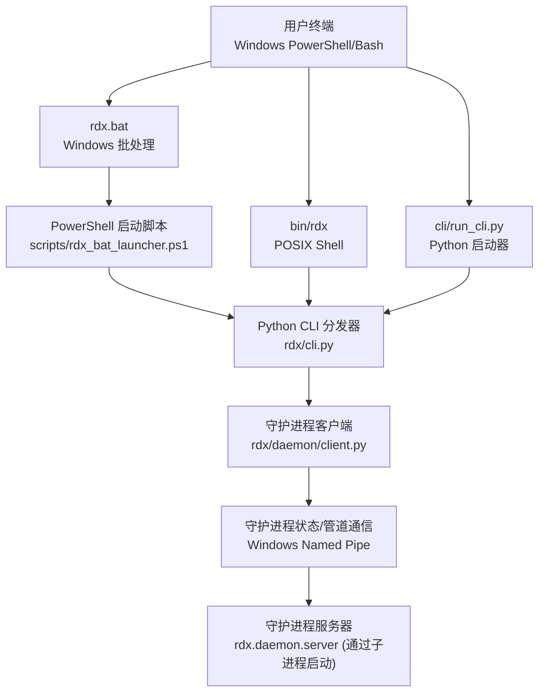
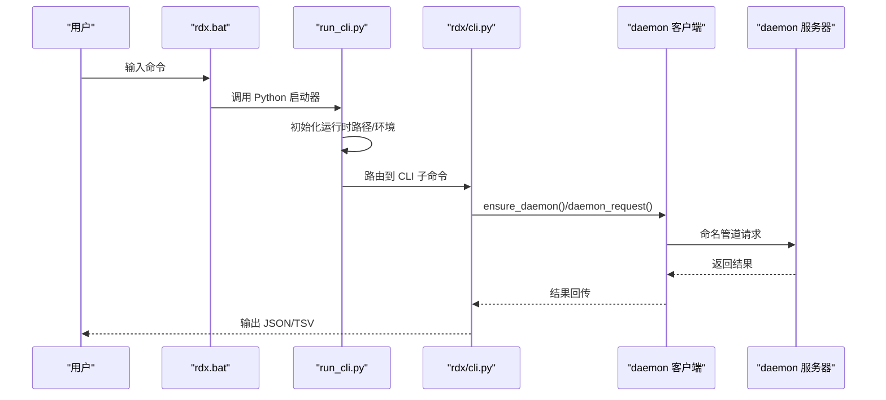
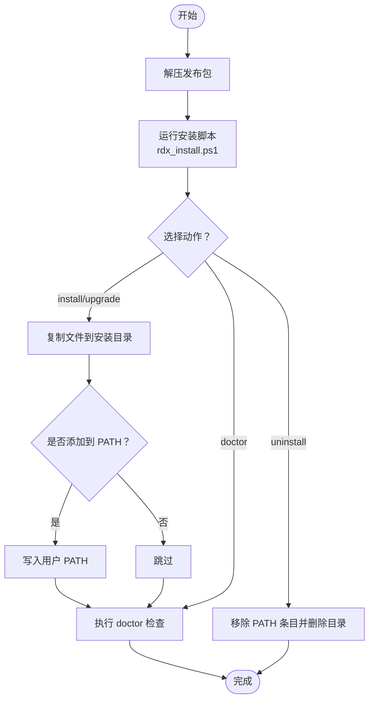
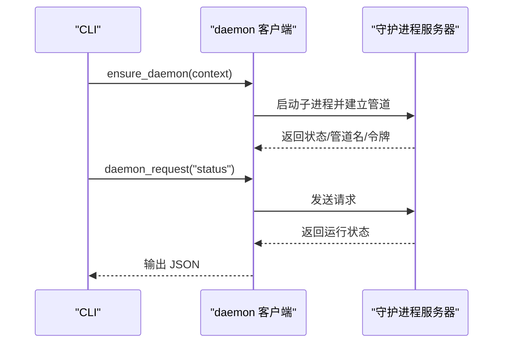
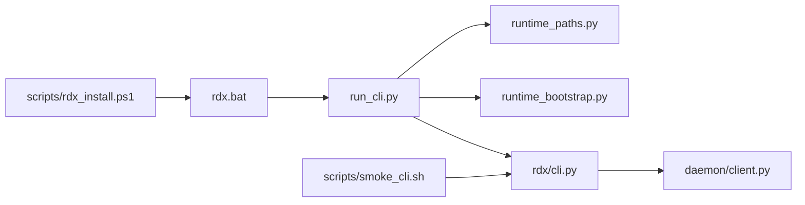

# 快速入门

<cite>
**本文引用的文件**
- [README.md](file://README.md)
- [quickstart.md](file://docs/quickstart.md)
- [install.md](file://docs/install.md)
- [run_cli.py](file://cli/run_cli.py)
- [cli.py](file://rdx/cli.py)
- [runtime_paths.py](file://rdx/runtime_paths.py)
- [runtime_bootstrap.py](file://rdx/runtime_bootstrap.py)
- [client.py](file://rdx/daemon/client.py)
- [smoke_cli.sh](file://scripts/smoke_cli.sh)
- [rdx.bat](file://rdx.bat)
- [rdx_install.ps1](file://scripts/rdx_install.ps1)
- [session-model.md](file://docs/session-model.md)
- [troubleshooting.md](file://docs/troubleshooting.md)
- [models.py](file://rdx/models.py)
</cite>

## 目录
1. [简介](#简介)
2. [项目结构](#项目结构)
3. [核心组件](#核心组件)
4. [架构总览](#架构总览)
5. [详细组件分析](#详细组件分析)
6. [依赖关系分析](#依赖关系分析)
7. [性能考虑](#性能考虑)
8. [故障排除指南](#故障排除指南)
9. [结论](#结论)
10. [附录](#附录)

## 简介
本快速入门面向首次使用 RDX-Agent-Tools 的用户，目标是帮助你在最短时间内完成环境准备、安装配置与基础命令操作，并建立对“上下文管理”“会话模型”“守护进程”的基本理解。你将学会：
- 在 Windows 和 Bash 环境下安装与运行工具
- 使用第一个 CLI 命令完成诊断与工具列表查看
- 理解上下文与会话在命令执行中的作用
- 掌握常见工作流与故障排除要点

## 项目结构
RDX-Agent-Tools 是一个仅提供 CLI 的 RenderDoc .rdc 运行时包，提供约 196 个以 rd.* 命名空间导出的工具。其核心入口包括：
- Windows 批处理启动器：rdx.bat
- POSIX Shell 启动器：bin/rdx
- Python 启动器：cli/run_cli.py

图表来源
- [rdx.bat:1-18](file://rdx.bat#L1-L18)
- [cli.py:1-120](file://rdx/cli.py#L1-L120)
- [client.py:420-468](file://rdx/daemon/client.py#L420-L468)

章节来源
- [README.md: 1-58:1-58](file://README.md#L1-L58)
- [quickstart.md: 1-41:1-41](file://docs/quickstart.md#L1-L41)

## 核心组件
- CLI 启动与路由
  - run_cli.py：负责解析参数、初始化运行时路径、校验依赖、引导 Python 运行时并调用 rdx/cli.py
  - rdx/cli.py：定义命令集（version、doctor、tools、daemon、context、session、capture、vfs、diff/assert 等），并将请求转发给守护进程
- 守护进程
  - rdx/daemon/client.py：通过 Windows Named Pipe 与守护进程交互，支持启动、状态查询、心跳、清理等
- 运行时路径与引导
  - rdx/runtime_paths.py：统一管理工具根目录、中间产物目录、二进制与 Python 运行时目录
  - rdx/runtime_bootstrap.py：设置环境变量、注册 DLL 目录、将渲染相关模块加入 sys.path
- 安装与诊断
  - rdx.bat：Windows 入口，调用 PowerShell 启动脚本
  - scripts/rdx_install.ps1：安装/升级/卸载/诊断脚本
  - scripts/smoke_cli.sh：跨平台冒烟测试脚本，覆盖 doctor、tools、vfs、capture 等链路

章节来源
- [run_cli.py: 1-290:1-290](file://cli/run_cli.py#L1-L290)
- [cli.py: 1-800:1-800](file://rdx/cli.py#L1-L800)
- [runtime_paths.py: 1-122:1-122](file://rdx/runtime_paths.py#L1-L122)
- [runtime_bootstrap.py: 1-131:1-131](file://rdx/runtime_bootstrap.py#L1-L131)
- [client.py: 1-800:1-800](file://rdx/daemon/client.py#L1-L800)
- [rdx.bat: 1-18:1-18](file://rdx.bat#L1-L18)
- [rdx_install.ps1: 1-167:1-167](file://scripts/rdx_install.ps1#L1-L167)
- [smoke_cli.sh: 1-196:1-196](file://scripts/smoke_cli.sh#L1-L196)

## 架构总览
RDX-Agent-Tools 的 CLI 采用“轻量启动器 + 守护进程”的设计：
- 启动器负责环境准备与参数解析
- 守护进程承载 RenderDoc 运行时与会话状态，CLI 通过命名管道与其通信
- 上下文（daemon context）隔离多实例运行，避免状态互相干扰

图表来源
- [rdx.bat: 1-18:1-18](file://rdx.bat#L1-L18)
- [run_cli.py: 225-290:225-290](file://cli/run_cli.py#L225-L290)
- [cli.py: 226-248:226-248](file://rdx/cli.py#L226-L248)
- [client.py: 420-468:420-468](file://rdx/daemon/client.py#L420-L468)

## 详细组件分析

### 环境要求与安装（Windows）
- 自身包含自足的 Windows x64 包，无需系统级 Python 或虚拟环境
- 推荐使用安装脚本进行安装/升级/卸载，并可选将安装目录加入 PATH
- 安装后建议先运行 doctor 检查环境

图表来源
- [install.md: 1-31:1-31](file://docs/install.md#L1-L31)
- [rdx_install.ps1: 137-167:137-167](file://scripts/rdx_install.ps1#L137-L167)

章节来源
- [install.md: 1-31:1-31](file://docs/install.md#L1-L31)
- [rdx_install.ps1: 1-167:1-167](file://scripts/rdx_install.ps1#L1-L167)

### 环境要求与安装（Bash/POSIX）
- 使用 POSIX Shell 启动器 bin/rdx 或 Python 启动器 cli/run_cli.py
- 通过 scripts/smoke_cli.sh 可直接运行冒烟测试，覆盖 doctor、tools、vfs、capture 等链路
- 若需要远程/守护进程能力，请确保已正确安装并运行守护进程

章节来源
- [quickstart.md: 1-41:1-41](file://docs/quickstart.md#L1-L41)
- [smoke_cli.sh: 1-196:1-196](file://scripts/smoke_cli.sh#L1-L196)

### 第一个命令：运行 doctor
- Windows：rdx.bat --json doctor
- POSIX：bin/rdx --json doctor
- Python：python cli/run_cli.py --json doctor

该命令用于诊断工具根目录、Python 运行时、RenderDoc 组件、工具目录、守护进程状态等。

章节来源
- [README.md: 5-17:5-17](file://README.md#L5-L17)
- [quickstart.md: 3-17:3-17](file://docs/quickstart.md#L3-L17)

### 基本 CLI 操作流程（示例：列出工具）
- Windows：rdx.bat tools list --json
- POSIX：bin/rdx tools list --json
- Python：python cli/run_cli.py tools list --json

输出为 JSON，包含工具数量与工具摘要列表。

章节来源
- [README.md: 5-17:5-17](file://README.md#L5-L17)
- [quickstart.md: 3-17:3-17](file://docs/quickstart.md#L3-L17)

### 上下文管理（Context）
- 使用 --daemon-context <id> 选择守护进程上下文；默认为 default
- 多个上下文相互隔离，适合并行或多项目场景
- 常用命令：
  - rdx context status --json
  - rdx context update --key notes --value "<值>" --json
  - rdx context list
  - rdx context clear

章节来源
- [README.md: 40-46:40-46](file://README.md#L40-L46)
- [session-model.md: 1-12:1-12](file://docs/session-model.md#L1-L12)
- [cli.py: 735-754:735-754](file://rdx/cli.py#L735-L754)

### 会话模型（Session）
- 会话与捕获文件绑定，包含 session_id、capture_file_id、frame/event 等信息
- 预览状态（preview）用于显示完整 framebuffer，需区分预览窗口几何与视口/裁剪
- 常见命令：
  - rdx capture open --file "<路径>" --frame-index 0
  - rdx session preview on/status/off
  - rdx context status --json 查看 preview.display

章节来源
- [README.md: 40-46:40-46](file://README.md#L40-L46)
- [session-model.md: 1-12:1-12](file://docs/session-model.md#L1-L12)
- [cli.py: 717-724:717-724](file://rdx/cli.py#L717-L724)

### 守护进程（Daemon）
- 启动/停止/状态查询通过 rdx daemon start/stop/status
- 客户端通过 Windows Named Pipe 与守护进程通信
- 支持心跳、附加客户端、清理过期状态等

图表来源
- [client.py: 576-674:576-674](file://rdx/daemon/client.py#L576-L674)
- [client.py: 420-468:420-468](file://rdx/daemon/client.py#L420-L468)

章节来源
- [client.py: 1-800:1-800](file://rdx/daemon/client.py#L1-L800)

### 数据模型概览（面向理解）
- 工具返回采用统一响应封装（ToolResponse），包含 ok、错误码、追踪 ID、制品引用等
- 会话、捕获、事件树、管线快照、着色器信息、补丁规范等模型用于描述图形调试任务

章节来源
- [models.py: 103-123:103-123](file://rdx/models.py#L103-L123)
- [models.py: 128-141:128-141](file://rdx/models.py#L128-L141)
- [models.py: 147-157:147-157](file://rdx/models.py#L147-L157)
- [models.py: 173-181:173-181](file://rdx/models.py#L173-L181)
- [models.py: 266-279:266-279](file://rdx/models.py#L266-L279)
- [models.py: 281-289:281-289](file://rdx/models.py#L281-L289)

## 依赖关系分析
- 启动器依赖运行时路径与引导模块，确保渲染相关模块可被导入
- CLI 依赖守护进程客户端，通过命名管道与守护进程交互
- 安装脚本负责复制文件、维护 PATH、执行 doctor

图表来源
- [run_cli.py: 42-63:42-63](file://cli/run_cli.py#L42-L63)
- [runtime_paths.py: 14-58:14-58](file://rdx/runtime_paths.py#L14-L58)
- [runtime_bootstrap.py: 105-131:105-131](file://rdx/runtime_bootstrap.py#L105-L131)
- [cli.py: 17-46:17-46](file://rdx/cli.py#L17-L46)
- [client.py: 19-21:19-21](file://rdx/daemon/client.py#L19-L21)
- [rdx.bat: 6](file://rdx.bat#L6)
- [rdx_install.ps1: 131-167:131-167](file://scripts/rdx_install.ps1#L131-L167)
- [smoke_cli.sh: 67](file://scripts/smoke_cli.sh#L67)

章节来源
- [runtime_paths.py: 1-122:1-122](file://rdx/runtime_paths.py#L1-L122)
- [runtime_bootstrap.py: 1-131:1-131](file://rdx/runtime_bootstrap.py#L1-L131)
- [cli.py: 1-800:1-800](file://rdx/cli.py#L1-L800)
- [client.py: 1-800:1-800](file://rdx/daemon/client.py#L1-L800)
- [rdx.bat: 1-18:1-18](file://rdx.bat#L1-L18)
- [rdx_install.ps1: 1-167:1-167](file://scripts/rdx_install.ps1#L1-L167)
- [smoke_cli.sh: 1-196:1-196](file://scripts/smoke_cli.sh#L1-L196)

## 性能考虑
- 守护进程超时策略按操作类型动态调整，避免长时间阻塞
- TSV 投影仅用于列表/导航类输出，复杂嵌套状态仍以 JSON 表达
- 建议在 Bash 环境中运行冒烟脚本，便于观察实时输出与超时处理

章节来源
- [cli.py: 313-378:313-378](file://rdx/cli.py#L313-L378)
- [smoke_cli.sh: 86-98:86-98](file://scripts/smoke_cli.sh#L86-L98)

## 故障排除指南
- 运行 doctor 检查工具根目录、Python 运行时、RenderDoc 组件、工具目录、守护进程状态
- 若出现“缺少会话”，请先打开捕获文件或指定 --session-id
- 若预览无法显示或显示不完整，检查 session preview 状态与 preview.display 中的 framebuffer 几何
- 若远程句柄已被消费，需重新连接或恢复远程流程

章节来源
- [troubleshooting.md: 1-30:1-30](file://docs/troubleshooting.md#L1-L30)
- [cli.py: 757-770:757-770](file://rdx/cli.py#L757-L770)

## 结论
通过本快速入门，你已经完成了环境准备、安装与第一次 CLI 诊断，理解了上下文与会话在工具链中的作用，并掌握了守护进程的基本工作机制。建议在实际工作中结合冒烟脚本与 doctor 命令，持续验证环境健康度，并逐步探索工具目录与 VFS、管线与图像差异等高级能力。

## 附录

### 常见工作流示例
- 入门诊断：rdx.bat --json doctor 或 bin/rdx --json doctor
- 列出工具：rdx tools list --json
- 打开捕获并查看上下文：rdx capture open --file "<路径>" --frame-index 0；rdx context status --json
- 更新上下文元数据：rdx context update --key notes --value "triaged" --json
- VFS 导航：rdx vfs ls --path / --format tsv；rdx vfs tree --path / --depth 2 --format json
- 预览控制：rdx session preview on/status/off

章节来源
- [README.md: 5-17:5-17](file://README.md#L5-L17)
- [quickstart.md: 1-41:1-41](file://docs/quickstart.md#L1-L41)