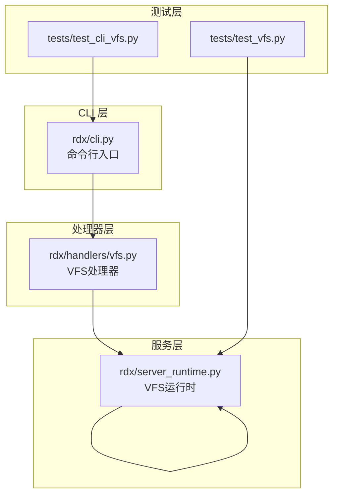
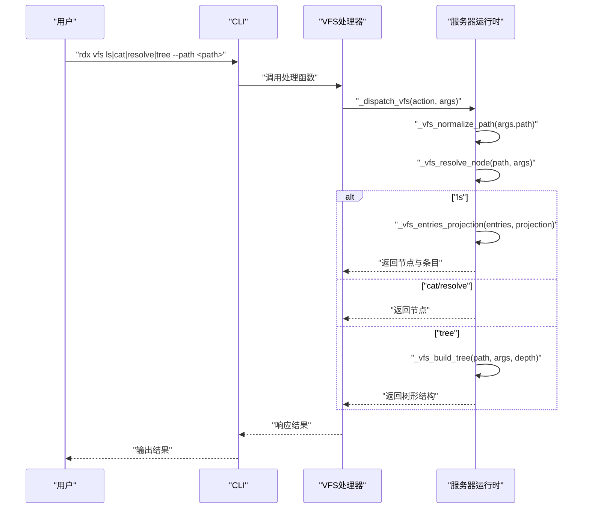
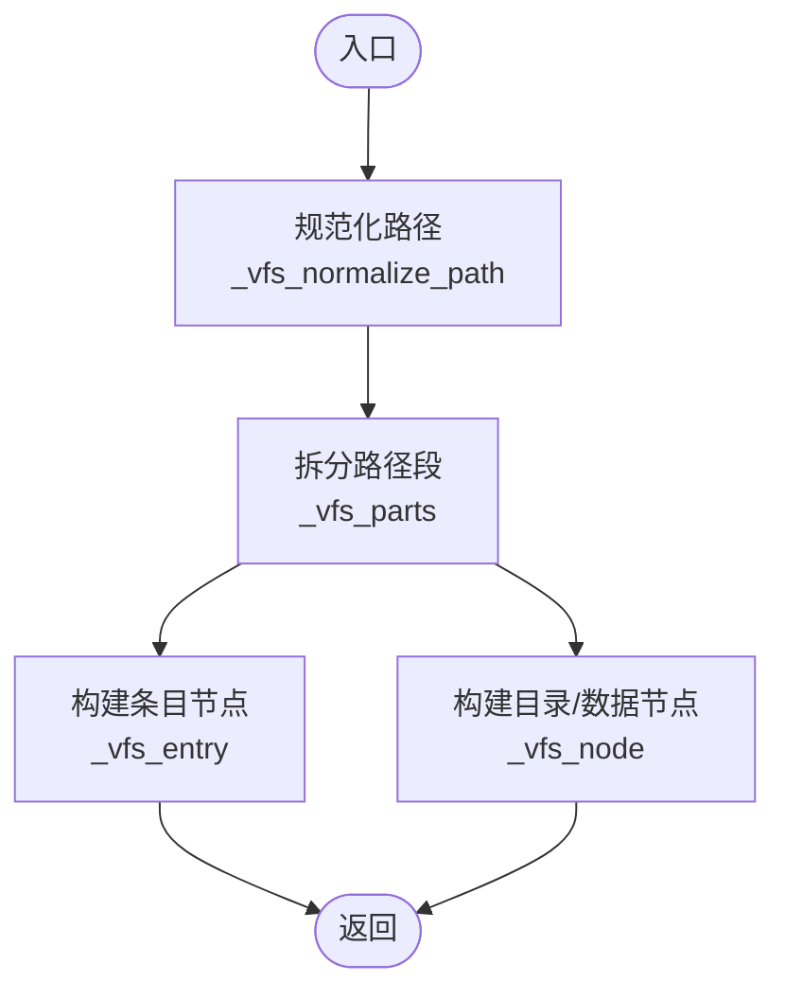
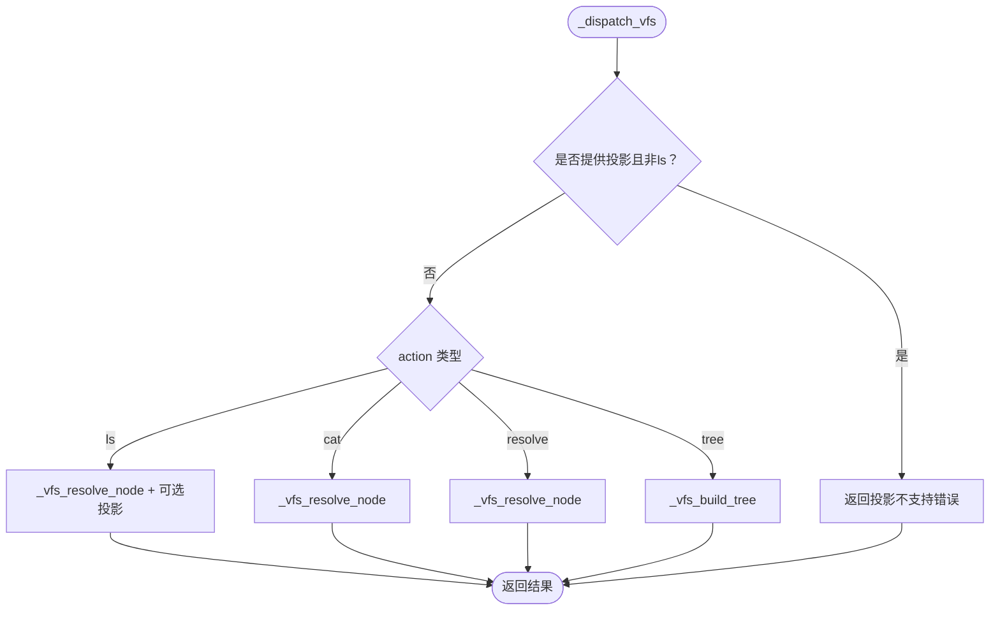
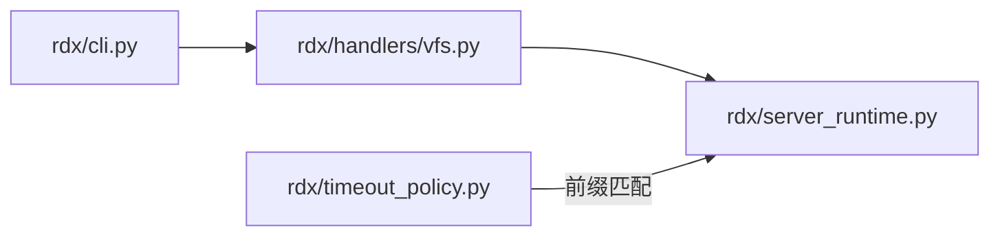

# VFS虚拟文件系统

<cite>
**本文档引用的文件**
- [server_runtime.py](file://rdx/server_runtime.py)
- [vfs.py](file://rdx/handlers/vfs.py)
- [cli.py](file://rdx/cli.py)
- [test_vfs.py](file://tests/test_vfs.py)
- [test_cli_vfs.py](file://tests/test_cli_vfs.py)
- [timeout_policy.py](file://rdx/timeout_policy.py)
</cite>

## 目录
1. [简介](#简介)
2. [项目结构](#项目结构)
3. [核心组件](#核心组件)
4. [架构总览](#架构总览)
5. [详细组件分析](#详细组件分析)
6. [依赖分析](#依赖分析)
7. [性能考虑](#性能考虑)
8. [故障排除指南](#故障排除指南)
9. [结论](#结论)
10. [附录](#附录)

## 简介
本文件系统（VFS）是 RDX Agent Tools 中用于统一抽象资源访问的只读虚拟文件系统。它通过“节点”模型对资源进行建模，支持路径解析、目录遍历、树形展示以及投影查询。VFS 将多种后端资源（如渲染管线、着色器、调试信息、上下文快照、工件等）映射为统一的树状结构，使上层工具与脚本能够以一致的方式导航与读取。

VFS 的关键特性包括：
- 统一的只读访问：所有操作均为只读，避免副作用
- 路径规范化与解析：支持层级路径、索引参数与会话绑定
- 树形构建：可按深度递归展开子节点
- 投影查询：对列表结果进行结构化投影
- 权限与会话控制：部分节点需要有效会话 ID 才能访问

## 项目结构
VFS 的实现主要分布在以下模块中：
- 服务器运行时：负责路径解析、节点构造、动作分发与树形构建
- 处理器：将外部调用转发到服务器运行时
- CLI：提供命令行入口，支持 ls、cat、resolve、tree 等子命令
- 测试：验证 VFS 行为与 CLI 集成

图表来源
- [cli.py:1260-1267](file://rdx/cli.py#L1260-L1267)
- [vfs.py:1-10](file://rdx/handlers/vfs.py#L1-L10)
- [server_runtime.py:12302-12336](file://rdx/server_runtime.py#L12302-L12336)

章节来源
- [cli.py:1260-1267](file://rdx/cli.py#L1260-L1267)
- [vfs.py:1-10](file://rdx/handlers/vfs.py#L1-L10)
- [server_runtime.py:11804-11823](file://rdx/server_runtime.py#L11804-L11823)

## 核心组件
- 节点构造器：用于生成标准节点结构，包含路径、名称、类型、标题、摘要、是否存在、是否需要会话、规范工具等字段
- 路径工具：规范化路径、拆分路径段、标准化索引参数
- 动作分发器：根据动作（ls/cat/resolve/tree）执行相应逻辑，并返回统一响应格式
- 树形构建器：递归展开节点的子项，支持深度限制
- 会话与权限：要求某些节点在存在有效会话 ID 的前提下才能访问

章节来源
- [server_runtime.py:11804-11823](file://rdx/server_runtime.py#L11804-L11823)
- [server_runtime.py:11826-11852](file://rdx/server_runtime.py#L11826-L11852)
- [server_runtime.py:11783-11799](file://rdx/server_runtime.py#L11783-L11799)
- [server_runtime.py:12302-12336](file://rdx/server_runtime.py#L12302-L12336)
- [server_runtime.py:12284-12299](file://rdx/server_runtime.py#L12284-L12299)

## 架构总览
VFS 的工作流从 CLI 子命令开始，经由处理器转发到服务器运行时，再由运行时解析路径、构造节点并返回结果。树形展示通过递归构建子节点实现；投影查询仅对 ls 动作生效。

图表来源
- [cli.py:833-834](file://rdx/cli.py#L833-L834)
- [vfs.py:8-9](file://rdx/handlers/vfs.py#L8-L9)
- [server_runtime.py:12302-12336](file://rdx/server_runtime.py#L12302-L12336)

## 详细组件分析

### 节点与路径工具
- 节点构造器：生成包含路径、名称、类型、标题、摘要、是否存在、是否需要会话、规范工具等字段的标准节点
- 路径规范化：去除多余斜杠、处理相对路径、标准化根路径
- 路径拆分：将路径按“/”分割为段列表，便于分支判断
- 索引解析：支持以“[index]”形式指定索引参数，用于定位特定元素

图表来源
- [server_runtime.py:11783-11799](file://rdx/server_runtime.py#L11783-L11799)
- [server_runtime.py:11793-11799](file://rdx/server_runtime.py#L11793-L11799)
- [server_runtime.py:11804-11823](file://rdx/server_runtime.py#L11804-L11823)
- [server_runtime.py:11826-11852](file://rdx/server_runtime.py#L11826-L11852)

章节来源
- [server_runtime.py:11783-11799](file://rdx/server_runtime.py#L11783-L11799)
- [server_runtime.py:11804-11823](file://rdx/server_runtime.py#L11804-L11823)
- [server_runtime.py:11826-11852](file://rdx/server_runtime.py#L11826-L11852)

### 动作分发与树形构建
- 动作分发器：根据 action 分派到不同处理逻辑，校验投影支持范围（仅 ls 支持投影）
- 树形构建器：递归展开节点子项，支持深度限制，避免无限展开
- 错误处理：对不支持的动作或路径抛出明确错误

图表来源
- [server_runtime.py:12302-12336](file://rdx/server_runtime.py#L12302-L12336)
- [server_runtime.py:12284-12299](file://rdx/server_runtime.py#L12284-L12299)

章节来源
- [server_runtime.py:12302-12336](file://rdx/server_runtime.py#L12302-L12336)
- [server_runtime.py:12284-12299](file://rdx/server_runtime.py#L12284-L12299)

### 资源抽象与会话控制
- 资源抽象：将不同类型的资源（如管线、着色器、调试信息、上下文、工件等）映射为节点，统一对外暴露
- 会话控制：部分节点需要有效的会话 ID 才能访问，未提供或无效时会触发错误
- 权限控制：节点结构包含“是否需要会话”的标记，驱动上层权限检查

章节来源
- [server_runtime.py:11874-11894](file://rdx/server_runtime.py#L11874-L11894)
- [server_runtime.py:11895-11899](file://rdx/server_runtime.py#L11895-L11899)
- [server_runtime.py:11901-11921](file://rdx/server_runtime.py#L11901-L11921)

### API 使用示例与集成指南
- 命令行使用
  - 列出目录：rdx vfs ls --path /pipeline/shaders
  - 查看文件：rdx vfs cat --path /pipeline/shaders/vertex.glsl
  - 解析路径：rdx vfs resolve --path /context/snapshots/latest
  - 树形展示：rdx vfs tree --path /artifacts --depth 2
- 处理器集成
  - 通过 rdx/handlers/vfs.py 的 handle 函数将外部调用转发至服务器运行时
- 投影查询
  - 仅 ls 支持投影，可通过参数启用 TSV 文本包含

章节来源
- [cli.py:833-834](file://rdx/cli.py#L833-L834)
- [vfs.py:8-9](file://rdx/handlers/vfs.py#L8-L9)
- [server_runtime.py:12304-12324](file://rdx/server_runtime.py#L12304-L12324)

## 依赖分析
- CLI 依赖处理器：命令行入口调用处理器
- 处理器依赖服务器运行时：处理器将动作与参数转发给运行时
- 服务器运行时内部自依赖：路径工具、节点构造器、动作分发器与树形构建器相互协作
- 超时策略：VFS 前缀工具名被纳入超时策略配置

图表来源
- [cli.py:1260-1267](file://rdx/cli.py#L1260-L1267)
- [vfs.py:1-10](file://rdx/handlers/vfs.py#L1-L10)
- [server_runtime.py:12302-12336](file://rdx/server_runtime.py#L12302-L12336)
- [timeout_policy.py:33-38](file://rdx/timeout_policy.py#L33-L38)

章节来源
- [timeout_policy.py:33-38](file://rdx/timeout_policy.py#L33-L38)

## 性能考虑
- 深度限制：tree 操作默认限制深度，避免深层递归导致的高开销
- 投影优化：ls 的投影仅在需要时启用，减少不必要的文本处理
- 节点缓存：当前实现未见显式缓存逻辑，建议在高频访问场景中引入轻量缓存以降低重复解析成本
- 并发控制：建议在服务器运行时层面增加并发限制，防止大量请求同时触发深层树形构建

## 故障排除指南
- 不支持的动作：当传入的动作不在支持列表时，返回明确的错误信息
- 不支持的投影：除 ls 外的动作若携带投影参数，将返回“投影不支持”的错误
- 路径不支持：当路径无法解析或不在支持的命名空间内，抛出“不支持的 VFS 路径”错误
- 会话缺失：访问需要会话的节点但未提供有效会话 ID，将触发会话相关错误

章节来源
- [server_runtime.py:12304-12310](file://rdx/server_runtime.py#L12304-L12310)
- [server_runtime.py:12206-12281](file://rdx/server_runtime.py#L12206-L12281)

## 结论
VFS 通过统一的节点模型与路径解析机制，将多种资源抽象为一致的只读文件系统视图。其只读设计、投影查询与树形展示能力，使其适用于调试、审计与自动化脚本场景。未来可在缓存与并发控制方面进一步优化，以提升大规模资源浏览的性能与稳定性。

## 附录
- 测试参考
  - 单元测试：tests/test_vfs.py
  - CLI 集成测试：tests/test_cli_vfs.py

章节来源
- [test_vfs.py](file://tests/test_vfs.py)
- [test_cli_vfs.py](file://tests/test_cli_vfs.py)