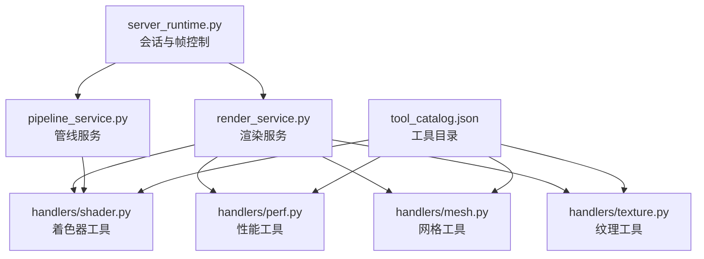
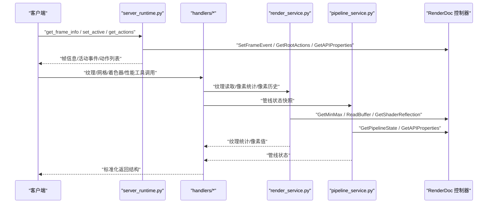
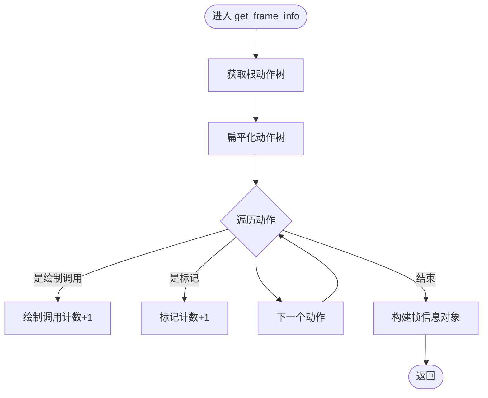
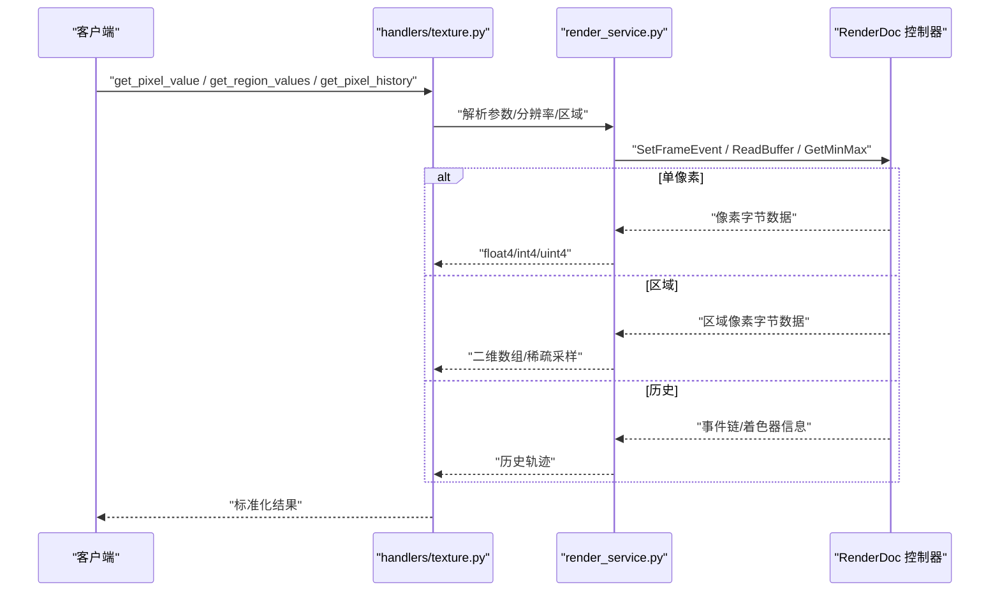
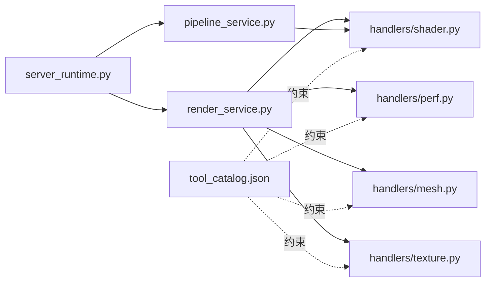

# 内容分析工具

<cite>
**本文引用的文件**
- [rdx\server_runtime.py](file://rdx/server_runtime.py)
- [rdx\core\render_service.py](file://rdx/core/render_service.py)
- [rdx\core\pipeline_service.py](file://rdx/core/pipeline_service.py)
- [rdx\handlers\texture.py](file://rdx/handlers/texture.py)
- [rdx\handlers\mesh.py](file://rdx/handlers/mesh.py)
- [rdx\handlers\shader.py](file://rdx/handlers/shader.py)
- [rdx\handlers\perf.py](file://rdx/handlers/perf.py)
- [spec\tool_catalog.json](file://spec/tool_catalog.json)
- [tests\test_shader_replace_contracts.py](file://tests/test_shader_replace_contracts.py)
</cite>

## 目录
1. [简介](#简介)
2. [项目结构](#项目结构)
3. [核心组件](#核心组件)
4. [架构总览](#架构总览)
5. [详细组件分析](#详细组件分析)
6. [依赖关系分析](#依赖关系分析)
7. [性能考量](#性能考量)
8. [故障排查指南](#故障排查指南)
9. [结论](#结论)
10. [附录](#附录)

## 简介
本文件系统性介绍内容分析工具的功能与实现，覆盖以下方面：
- 帧数据提取：从回放会话中获取帧索引、事件范围、绘制调用与标记数量等信息。
- 渲染状态分析：通过管线快照获取图元拓扑、视口/裁剪框、混合/深度模板状态、输出目标等。
- 性能指标计算：利用 RenderDoc 的 GPU 加速接口进行纹理最小/最大值统计，避免全量 CPU 回读。
- 纹理分析：像素值读取、区域值读取、像素历史追踪、通道级 min/max 统计。
- 几何数据提取：顶点缓冲区与索引缓冲区信息读取。
- 着色器信息查询：着色器反射、编译标志、入口点等。
- 结果格式化与可视化：统一返回结构、元数据与投影字段，支持后续报告生成与预览。
- 最佳实践：性能优化、内存使用统计、渲染管线优化建议。

## 项目结构
该工具围绕“会话-控制器-服务-处理器”的分层设计组织：
- 服务器运行时负责会话管理、事件导航、帧信息聚合与管线状态快照。
- 核心渲染服务提供纹理读取、像素值解析、通道统计等能力。
- 核心管线服务负责从 RenderDoc 获取管线状态并进行 API 适配。
- 处理器模块封装具体工具的参数校验、调用链路与结果组装。
- 工具目录定义了所有可用工具的签名、前置条件与返回结构。

图表来源
- [rdx\server_runtime.py](file://rdx/server_runtime.py)
- [rdx\core\render_service.py](file://rdx/core/render_service.py)
- [rdx\core\pipeline_service.py](file://rdx/core/pipeline_service.py)
- [rdx\handlers\texture.py](file://rdx/handlers/texture.py)
- [rdx\handlers\mesh.py](file://rdx/handlers/mesh.py)
- [rdx\handlers\shader.py](file://rdx/handlers/shader.py)
- [rdx\handlers\perf.py](file://rdx/handlers/perf.py)
- [spec\tool_catalog.json](file://spec/tool_catalog.json)

章节来源
- [rdx\server_runtime.py](file://rdx/server_runtime.py)
- [rdx\core\render_service.py](file://rdx/core/render_service.py)
- [rdx\core\pipeline_service.py](file://rdx/core/pipeline_service.py)
- [spec\tool_catalog.json](file://spec/tool_catalog.json)

## 核心组件
- 服务器运行时（server_runtime）
  - 提供帧信息聚合（帧索引、事件范围、绘制调用与标记计数）、活动事件设置与获取、动作树遍历与事件链构建、管线状态摘要汇总等。
- 渲染服务（render_service）
  - 负责纹理读取、像素值解析（float/int/uint）、区域统计、通道级 min/max 统计、像素历史追踪等。
- 管线服务（pipeline_service）
  - 以异步线程方式获取管线状态、API 属性，并对不同图形 API 的状态进行归一化处理。
- 处理器模块（handlers）
  - 将底层服务封装为工具接口，统一参数校验、错误处理与返回结构；包括纹理、网格、着色器、性能等工具。
- 工具目录（tool_catalog.json）
  - 定义每个工具的名称、分组、描述、参数、前置条件与返回结构，确保调用一致性与可发现性。

章节来源
- [rdx\server_runtime.py](file://rdx/server_runtime.py)
- [rdx\core\render_service.py](file://rdx/core/render_service.py)
- [rdx\core\pipeline_service.py](file://rdx/core/pipeline_service.py)
- [rdx\handlers\texture.py](file://rdx/handlers/texture.py)
- [rdx\handlers\mesh.py](file://rdx/handlers/mesh.py)
- [rdx\handlers\shader.py](file://rdx/handlers/shader.py)
- [rdx\handlers\perf.py](file://rdx/handlers/perf.py)
- [spec\tool_catalog.json](file://spec/tool_catalog.json)

## 架构总览
下图展示了从客户端到渲染服务与管线服务的整体调用路径，以及工具目录对参数与返回的约束。

图表来源
- [rdx\server_runtime.py](file://rdx/server_runtime.py)
- [rdx\core\render_service.py](file://rdx/core/render_service.py)
- [rdx\core\pipeline_service.py](file://rdx/core/pipeline_service.py)
- [rdx\handlers\texture.py](file://rdx/handlers/texture.py)
- [rdx\handlers\mesh.py](file://rdx/handlers/mesh.py)
- [rdx\handlers\shader.py](file://rdx/handlers/shader.py)
- [rdx\handlers\perf.py](file://rdx/handlers/perf.py)

## 详细组件分析

### 帧数据提取与渲染状态分析
- 帧信息聚合
  - 通过动作树扁平化，统计绘制调用与标记数量，返回帧索引、事件范围与计数。
- 活动事件管理
  - 设置/获取当前活动事件，驱动后续纹理与管线分析的上下文。
- 管线状态快照
  - 获取图元拓扑、视口/裁剪框、混合/深度模板状态、输出目标等，统一返回结构便于上层消费。

图表来源
- [rdx\server_runtime.py](file://rdx/server_runtime.py)

章节来源
- [rdx\server_runtime.py](file://rdx/server_runtime.py)

### 纹理分析与像素值读取
- 单像素值读取
  - 支持 float/uint/int 三种返回类型，自动根据纹理格式解码为 float4 或 int4。
- 区域值读取
  - 读取矩形区域内像素值，支持步长采样以降低开销，适合局部统计与异常值检测。
- 像素历史追踪
  - 返回影响某像素的绘制/调度事件链，结合活动事件定位问题来源。
- 通道级统计
  - 使用 RenderDoc 的 GPU 加速 GetMinMax 计算每通道 min/max，同时标注 NaN/Inf 情况。

图表来源
- [rdx\handlers\texture.py](file://rdx/handlers/texture.py)
- [rdx\core\render_service.py](file://rdx/core/render_service.py)
- [spec\tool_catalog.json](file://spec/tool_catalog.json)

章节来源
- [rdx\handlers\texture.py](file://rdx/handlers/texture.py)
- [rdx\core\render_service.py](file://rdx/core/render_service.py)
- [spec\tool_catalog.json](file://spec/tool_catalog.json)

### 几何数据提取（顶点与索引缓冲区）
- 顶点缓冲区信息
  - 返回资源 ID、偏移与步长等关键字段，便于进一步读取顶点数据。
- 索引缓冲区信息
  - 返回资源 ID、偏移与格式等，支持后续索引数据读取与拓扑重建。

章节来源
- [rdx\server_runtime.py](file://rdx/server_runtime.py)

### 着色器信息查询
- 着色器反射
  - 获取入口点、调试信息与编译标志，支持跨 API 的着色器分析。
- 编译标志与目标
  - 识别优化级别、目标语言（如 SPIR-V）等，辅助诊断着色器问题。

章节来源
- [rdx\core\pipeline_service.py](file://rdx/core/pipeline_service.py)
- [tests\test_shader_replace_contracts.py](file://tests/test_shader_replace_contracts.py)

### 性能指标计算与可视化
- 纹理通道统计
  - 通过 GPU 加速的最小/最大值计算，避免全量 CPU 回读，显著降低延迟与内存占用。
- 结果格式化
  - 统一返回结构包含成功标志、数据体、制品列表、错误对象、元数据与可选投影，便于报告生成与可视化。

章节来源
- [rdx\core\render_service.py](file://rdx/core/render_service.py)
- [rdx\handlers\perf.py](file://rdx/handlers/perf.py)

## 依赖关系分析
- 组件耦合
  - 服务器运行时与渲染/管线服务通过会话控制器交互，保持较低耦合度。
  - 处理器模块作为门面，屏蔽底层细节，增强可测试性与扩展性。
- 外部依赖
  - RenderDoc 控制器提供帧事件设置、管线状态获取、缓冲区读取与最小/最大值计算等能力。
- 接口契约
  - 工具目录定义了严格的参数与返回结构，确保调用一致性与向后兼容。

图表来源
- [rdx\server_runtime.py](file://rdx/server_runtime.py)
- [rdx\core\render_service.py](file://rdx/core/render_service.py)
- [rdx\core\pipeline_service.py](file://rdx/core/pipeline_service.py)
- [rdx\handlers\texture.py](file://rdx/handlers/texture.py)
- [rdx\handlers\mesh.py](file://rdx/handlers/mesh.py)
- [rdx\handlers\shader.py](file://rdx/handlers/shader.py)
- [rdx\handlers\perf.py](file://rdx/handlers/perf.py)
- [spec\tool_catalog.json](file://spec/tool_catalog.json)

## 性能考量
- 避免全量回读
  - 优先使用 GPU 加速的最小/最大值计算与像素读取，减少 CPU 带宽与内存压力。
- 区域采样与步长
  - 在区域值读取中采用步长采样，平衡精度与性能。
- 异步执行
  - 通过线程池异步调用 RenderDoc 接口，避免阻塞主线程。
- 状态快照
  - 仅在需要时获取管线状态，避免频繁调用带来的额外开销。

## 故障排查指南
- 参数校验失败
  - 检查工具目录中的参数要求与类型约束，确保必填项与默认值正确。
- 活动事件未设置
  - 在进行纹理或像素历史分析前，先调用设置活动事件的工具，确保上下文正确。
- 返回结构异常
  - 关注返回对象中的错误字段与元数据，定位具体失败原因。
- 着色器反射不完整
  - 确认着色器编译标志与目标语言，必要时调整编译配置以获得更丰富的反射信息。

章节来源
- [spec\tool_catalog.json](file://spec/tool_catalog.json)
- [rdx\server_runtime.py](file://rdx/server_runtime.py)
- [rdx\core\render_service.py](file://rdx/core/render_service.py)

## 结论
本工具通过清晰的分层架构与严格的接口契约，提供了从帧数据提取、渲染状态分析到纹理与着色器深度分析的完整能力。借助 GPU 加速与异步执行策略，能够在保证精度的同时显著提升性能。配合标准化的结果格式与工具目录约束，便于集成到自动化流程与可视化平台中。

## 附录
- 常用分析场景示例（步骤概述）
  - 帧性能概览：获取帧信息与动作列表，统计绘制调用与标记数量。
  - 纹理异常定位：使用区域值读取与像素历史追踪，快速定位异常像素来源。
  - 管线状态诊断：获取视口/裁剪框、混合/深度模板状态与输出目标，核对渲染配置。
  - 着色器问题排查：读取着色器反射与编译标志，确认优化级别与目标语言。
- 最佳实践
  - 先设置活动事件再进行纹理与像素分析。
  - 使用步长采样进行大区域统计，逐步缩小范围定位问题。
  - 利用 GPU 加速统计替代全量回读，提高响应速度。
  - 将结果写入报告并附加元数据与投影，便于复现与追溯。