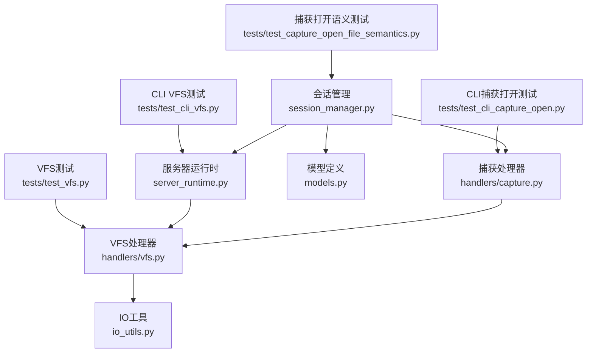
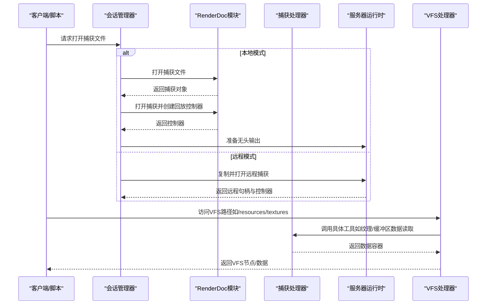
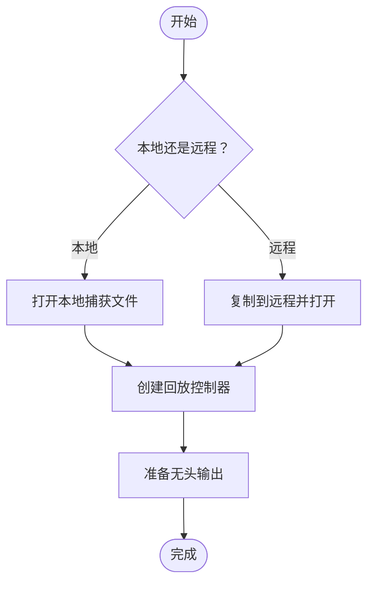
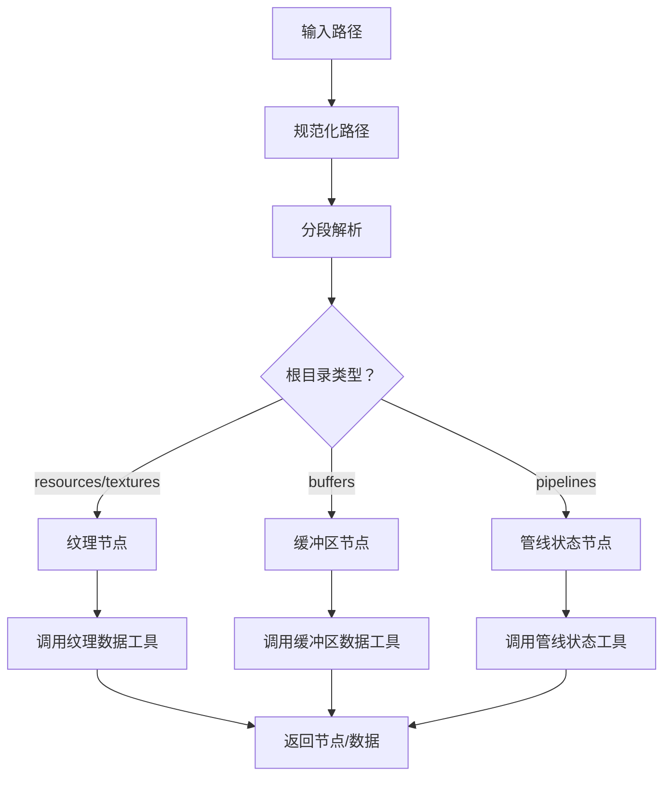
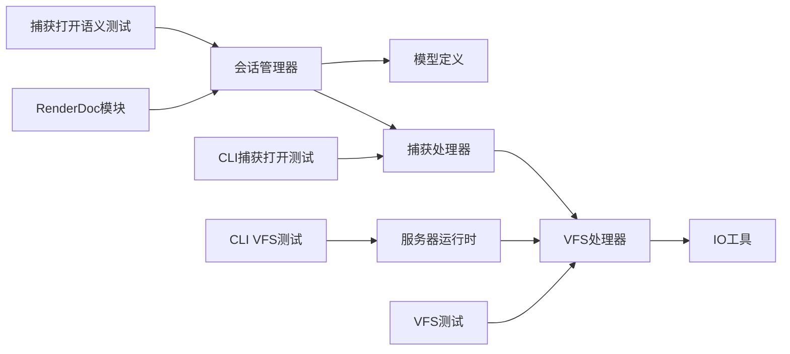

# 捕获文件处理

<cite>
**本文引用的文件**
- [session_manager.py](file://rdx/core/session_manager.py)
- [capture.py](file://rdx/handlers/capture.py)
- [vfs.py](file://rdx/handlers/vfs.py)
- [server_runtime.py](file://rdx/server_runtime.py)
- [io_utils.py](file://rdx/io_utils.py)
- [models.py](file://rdx/models.py)
- [test_capture_open_file_semantics.py](file://tests/test_capture_open_file_semantics.py)
- [test_cli_capture_open.py](file://tests/test_cli_capture_open.py)
- [test_vfs.py](file://tests/test_vfs.py)
- [test_cli_vfs.py](file://tests/test_cli_vfs.py)
</cite>

## 目录
1. [引言](#引言)
2. [项目结构](#项目结构)
3. [核心组件](#核心组件)
4. [架构总览](#架构总览)
5. [详细组件分析](#详细组件分析)
6. [依赖关系分析](#依赖关系分析)
7. [性能考虑](#性能考虑)
8. [故障排查指南](#故障排查指南)
9. [结论](#结论)
10. [附录](#附录)

## 引言
本文件面向需要在RDX Agent Tools中处理RenderDoc捕获文件（.rdc）的工程师与测试人员，系统性阐述捕获文件的打开、读取、解析与导出流程；解释VFS虚拟文件系统的工作原理与文件访问接口；给出最佳实践与性能优化建议，并提供可复用的处理示例与常见问题的解决方案。

## 项目结构
围绕捕获文件处理的关键模块包括：
- 会话管理：负责本地或远程RenderDoc会话的建立、捕获文件打开与回放控制器初始化
- 处理器层：提供捕获文件操作、资源访问、纹理/缓冲区数据读取等能力
- VFS层：以树形虚拟文件系统形式暴露捕获内容，支持路径解析、节点构建与工具调用
- 工具与实用函数：IO工具、模型定义、测试用例

图表来源
- [session_manager.py:1-373](file://rdx/core/session_manager.py#L1-L373)
- [capture.py](file://rdx/handlers/capture.py)
- [vfs.py](file://rdx/handlers/vfs.py)
- [server_runtime.py:11783-12298](file://rdx/server_runtime.py#L11783-L12298)
- [io_utils.py](file://rdx/io_utils.py)
- [models.py](file://rdx/models.py)
- [test_capture_open_file_semantics.py](file://tests/test_capture_open_file_semantics.py)
- [test_cli_capture_open.py](file://tests/test_cli_capture_open.py)
- [test_vfs.py](file://tests/test_vfs.py)
- [test_cli_vfs.py](file://tests/test_cli_vfs.py)

章节来源
- [session_manager.py:1-373](file://rdx/core/session_manager.py#L1-L373)
- [capture.py](file://rdx/handlers/capture.py)
- [vfs.py](file://rdx/handlers/vfs.py)
- [server_runtime.py:11783-12298](file://rdx/server_runtime.py#L11783-L12298)
- [io_utils.py](file://rdx/io_utils.py)
- [models.py](file://rdx/models.py)
- [test_capture_open_file_semantics.py](file://tests/test_capture_open_file_semantics.py)
- [test_cli_capture_open.py](file://tests/test_cli_capture_open.py)
- [test_vfs.py](file://tests/test_vfs.py)
- [test_cli_vfs.py](file://tests/test_cli_vfs.py)

## 核心组件
- 会话管理器：封装RenderDoc本地/远程连接、捕获文件打开、回放控制器创建与无头输出准备
- 捕获处理器：提供捕获文件操作、事件遍历、资源枚举与导出能力
- VFS处理器：将捕获内容映射为虚拟文件树，支持按路径解析、节点生成与工具调用
- IO工具：提供通用IO辅助能力，支撑数据读写与序列化
- 测试用例：覆盖捕获打开语义、CLI行为、VFS路径解析与工具调用

章节来源
- [session_manager.py:346-371](file://rdx/core/session_manager.py#L346-L371)
- [capture.py](file://rdx/handlers/capture.py)
- [vfs.py](file://rdx/handlers/vfs.py)
- [server_runtime.py:11783-12298](file://rdx/server_runtime.py#L11783-L12298)
- [io_utils.py](file://rdx/io_utils.py)

## 架构总览
下图展示从会话建立到VFS访问的端到端流程，包括本地与远程两种模式：

图表来源
- [session_manager.py:346-371](file://rdx/core/session_manager.py#L346-L371)
- [server_runtime.py:11783-12298](file://rdx/server_runtime.py#L11783-L12298)
- [vfs.py](file://rdx/handlers/vfs.py)

## 详细组件分析

### 会话管理与捕获打开
- 本地打开：通过RenderDoc模块打开指定.rdc文件，随后打开捕获并创建回放控制器，最后准备无头输出
- 远程打开：在远程设备上复制捕获文件后打开，返回远程句柄与控制器
- 错误检查：对每个关键步骤进行状态校验，提供分类与修复提示

图表来源
- [session_manager.py:346-371](file://rdx/core/session_manager.py#L346-L371)

章节来源
- [session_manager.py:346-371](file://rdx/core/session_manager.py#L346-L371)

### VFS虚拟文件系统工作原理
- 路径规范化与分段：对输入路径进行标准化、分段与索引解析
- 节点构建：根据根目录与资源类型（如资源、纹理、缓冲区、管线状态）生成节点
- 工具调用：针对不同节点调用对应工具（如纹理数据读取、缓冲区数据读取、管线状态查询）
- 会话绑定：大部分VFS节点要求有效会话ID，确保后续工具调用可用

图表来源
- [server_runtime.py:11783-12298](file://rdx/server_runtime.py#L11783-L12298)

章节来源
- [server_runtime.py:11783-12298](file://rdx/server_runtime.py#L11783-L12298)

### 捕获处理器与内容分析
- 捕获文件操作：提供打开、关闭、事件遍历、资源枚举等基础能力
- 内容分析工具：基于会话上下文，查询事件、着色器、管线状态、资源等信息
- 导出流程：将分析结果或原始数据导出为可消费格式（由上层工具链组合）

章节来源
- [capture.py](file://rdx/handlers/capture.py)

### 文件访问接口与工具调用
- VFS入口：通过服务器运行时的VFS解析函数，将路径映射到具体节点
- 工具注册：VFS内部维护工具名称与参数映射，统一调度到捕获处理器
- 数据容器：部分节点返回“读回容器”，便于后续导出或可视化

章节来源
- [vfs.py](file://rdx/handlers/vfs.py)
- [server_runtime.py:12153-12158](file://rdx/server_runtime.py#L12153-L12158)

## 依赖关系分析
- 会话管理器依赖RenderDoc模块与模型定义，负责生命周期管理与错误分类
- VFS层依赖服务器运行时的路径解析与工具调度，同时依赖捕获处理器提供的具体能力
- 测试用例覆盖打开语义、CLI行为与VFS路径解析，保障关键路径正确性

图表来源
- [session_manager.py:1-373](file://rdx/core/session_manager.py#L1-L373)
- [capture.py](file://rdx/handlers/capture.py)
- [vfs.py](file://rdx/handlers/vfs.py)
- [server_runtime.py:11783-12298](file://rdx/server_runtime.py#L11783-L12298)
- [io_utils.py](file://rdx/io_utils.py)
- [models.py](file://rdx/models.py)
- [test_capture_open_file_semantics.py](file://tests/test_capture_open_file_semantics.py)
- [test_cli_capture_open.py](file://tests/test_cli_capture_open.py)
- [test_vfs.py](file://tests/test_vfs.py)
- [test_cli_vfs.py](file://tests/test_cli_vfs.py)

章节来源
- [session_manager.py:1-373](file://rdx/core/session_manager.py#L1-L373)
- [server_runtime.py:11783-12298](file://rdx/server_runtime.py#L11783-L12298)
- [vfs.py](file://rdx/handlers/vfs.py)
- [capture.py](file://rdx/handlers/capture.py)
- [io_utils.py](file://rdx/io_utils.py)
- [models.py](file://rdx/models.py)
- [test_capture_open_file_semantics.py](file://tests/test_capture_open_file_semantics.py)
- [test_cli_capture_open.py](file://tests/test_cli_capture_open.py)
- [test_vfs.py](file://tests/test_vfs.py)
- [test_cli_vfs.py](file://tests/test_cli_vfs.py)

## 性能考虑
- 本地优先：尽量在本地执行捕获打开与回放，减少网络往返与远程复制开销
- 无头输出：启用无头渲染以避免图形窗口带来的额外成本
- 分批访问：VFS访问应按需分批读取数据，避免一次性拉取大量纹理/缓冲区数据
- 缓存策略：对重复访问的节点或工具结果进行缓存，降低重复计算与I/O
- 并发控制：在多会话或多线程场景下，合理限制并发打开的捕获数量，避免资源争用

## 故障排查指南
- 打开失败
  - 现象：打开捕获文件时报错或状态异常
  - 排查：确认.rdc文件完整且受当前RenderDoc版本支持；检查会话状态与错误分类提示
  - 参考
    - [session_manager.py:346-371](file://rdx/core/session_manager.py#L346-L371)
    - [test_capture_open_file_semantics.py](file://tests/test_capture_open_file_semantics.py)
- VFS路径无效
  - 现象：访问VFS路径报“不支持的VFS路径”
  - 排查：确认路径规范化与分段是否正确；核对根目录类型与节点生成逻辑
  - 参考
    - [server_runtime.py:11783-12298](file://rdx/server_runtime.py#L11783-L12298)
    - [test_vfs.py](file://tests/test_vfs.py)
- 工具调用失败
  - 现象：VFS节点调用工具返回空或异常
  - 排查：确认会话ID有效；检查工具参数映射与数据容器构造
  - 参考
    - [vfs.py](file://rdx/handlers/vfs.py)
    - [server_runtime.py:12153-12158](file://rdx/server_runtime.py#L12153-L12158)
- CLI行为异常
  - 现象：命令行打开捕获或VFS操作不符合预期
  - 排查：比对CLI参数与测试用例期望；验证工具链集成与环境配置
  - 参考
    - [test_cli_capture_open.py](file://tests/test_cli_capture_open.py)
    - [test_cli_vfs.py](file://tests/test_cli_vfs.py)

章节来源
- [session_manager.py:346-371](file://rdx/core/session_manager.py#L346-L371)
- [server_runtime.py:11783-12298](file://rdx/server_runtime.py#L11783-L12298)
- [vfs.py](file://rdx/handlers/vfs.py)
- [test_capture_open_file_semantics.py](file://tests/test_capture_open_file_semantics.py)
- [test_vfs.py](file://tests/test_vfs.py)
- [test_cli_capture_open.py](file://tests/test_cli_capture_open.py)
- [test_cli_vfs.py](file://tests/test_cli_vfs.py)

## 结论
本系统通过会话管理器与VFS层实现了对RenderDoc捕获文件的全链路处理：从打开、解析到内容访问与导出。借助规范化的路径解析与工具调度，用户可通过统一接口高效探索捕获内容。建议在生产环境中结合本地优先、无头输出与缓存策略，以获得更优性能与稳定性。

## 附录
- 实际处理示例（步骤级）
  - 在本地打开.rdc文件并创建回放控制器
    - 参考：[session_manager.py:346-371](file://rdx/core/session_manager.py#L346-L371)
  - 通过VFS访问纹理数据
    - 步骤：规范化路径 → 解析根目录 → 生成纹理节点 → 调用纹理数据工具 → 返回数据容器
    - 参考：
      - [server_runtime.py:11783-12298](file://rdx/server_runtime.py#L11783-L12298)
      - [server_runtime.py:12153-12158](file://rdx/server_runtime.py#L12153-L12158)
  - 通过VFS访问缓冲区数据
    - 步骤：规范化路径 → 解析根目录 → 生成缓冲区节点 → 调用缓冲区数据工具 → 返回数据容器
    - 参考：
      - [server_runtime.py:11783-12298](file://rdx/server_runtime.py#L11783-L12298)
      - [server_runtime.py:12153-12158](file://rdx/server_runtime.py#L12153-L12158)
- 最佳实践
  - 优先本地处理，必要时再走远程复制与打开
  - 使用无头输出，避免图形窗口干扰
  - 对重复访问的数据进行缓存
  - 在多会话场景下限制并发打开数量
- 常见问题
  - 打开失败：检查.rdc完整性与RenderDoc兼容性
  - VFS路径无效：确认路径规范化与节点生成逻辑
  - 工具调用失败：确认会话ID有效与工具参数正确