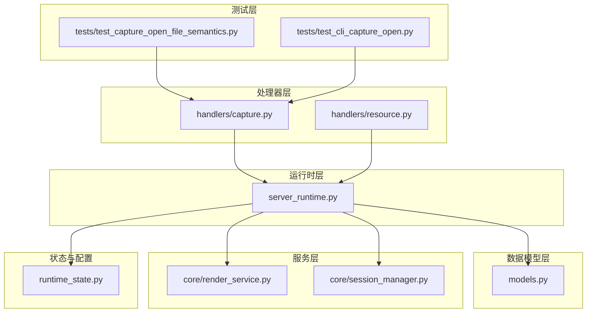
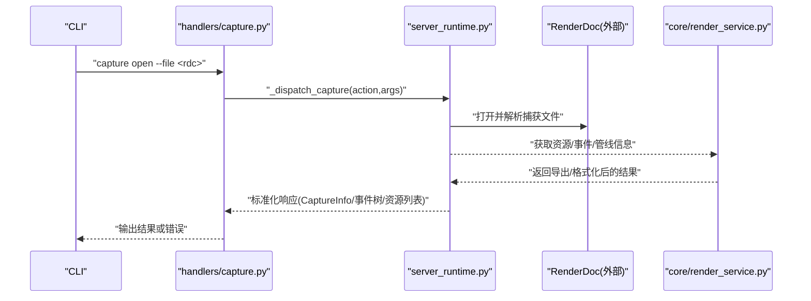
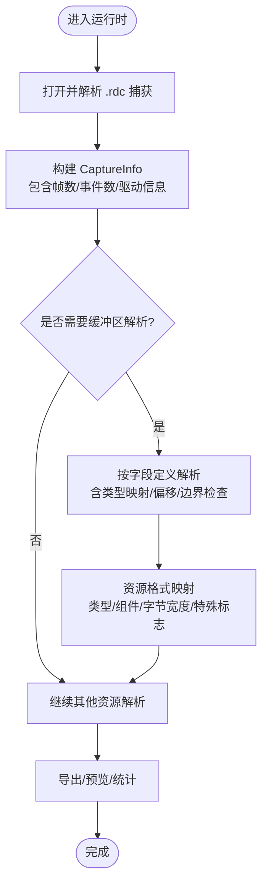
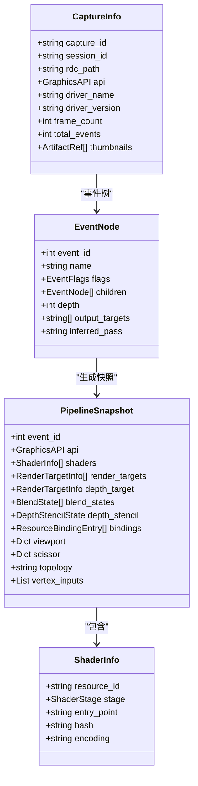
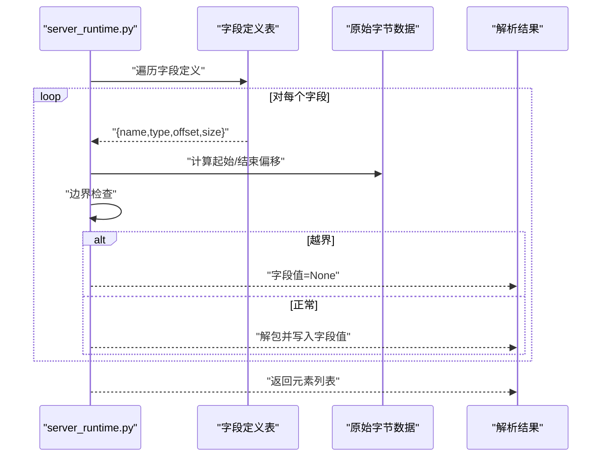
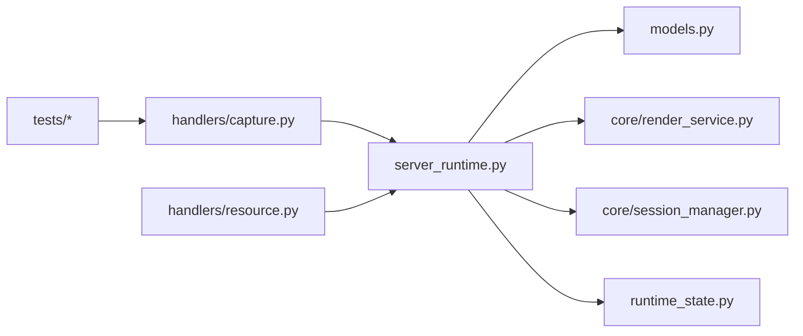

# 捕获文件格式与解析

<cite>
**本文引用的文件**
- [rdx/handlers/capture.py](file://rdx/handlers/capture.py)
- [rdx/handlers/resource.py](file://rdx/handlers/resource.py)
- [rdx/server_runtime.py](file://rdx/server_runtime.py)
- [rdx/models.py](file://rdx/models.py)
- [rdx/core/session_manager.py](file://rdx/core/session_manager.py)
- [rdx/core/render_service.py](file://rdx/core/render_service.py)
- [rdx/runtime_state.py](file://rdx/runtime_state.py)
- [tests/test_capture_open_file_semantics.py](file://tests/test_capture_open_file_semantics.py)
- [tests/test_cli_capture_open.py](file://tests/test_cli_capture_open.py)
</cite>

## 目录
1. [引言](#引言)
2. [项目结构](#项目结构)
3. [核心组件](#核心组件)
4. [架构总览](#架构总览)
5. [详细组件分析](#详细组件分析)
6. [依赖关系分析](#依赖关系分析)
7. [性能考量](#性能考量)
8. [故障排查指南](#故障排查指南)
9. [结论](#结论)
10. [附录](#附录)

## 引言
本文件系统性阐述 RDX 工具链中对 RenderDoc 捕获文件（.rdc）的格式与解析机制，覆盖以下方面：
- 文件头与内容布局的抽象建模
- 版本兼容性与解析算法
- 不同资源类型（帧缓冲区、纹理、着色器等）的解析与导出流程
- 完整性校验、错误处理与异常策略
- 技术规范与解析示例代码路径指引

为便于非专业读者理解，文档采用“渐进复杂度”组织：先给出高层架构与数据模型，再逐步深入到具体实现与解析流程。

## 项目结构
围绕捕获文件处理的关键模块如下：
- 处理器层：负责将外部调用路由到运行时执行（如捕获打开、资源访问）
- 运行时层：承载实际的捕获解析、资源枚举与导出逻辑
- 数据模型层：定义捕获、事件树、管线快照、着色器与资源绑定等结构
- 服务层：封装与 RenderDoc 交互的导出与格式转换能力
- 测试层：验证捕获打开语义与 CLI 行为

图表来源
- [rdx/handlers/capture.py:1-11](file://rdx/handlers/capture.py#L1-L11)
- [rdx/handlers/resource.py:1-11](file://rdx/handlers/resource.py#L1-L11)
- [rdx/server_runtime.py:8204-8241](file://rdx/server_runtime.py#L8204-L8241)
- [rdx/models.py:147-157](file://rdx/models.py#L147-L157)
- [rdx/core/render_service.py:126-172](file://rdx/core/render_service.py#L126-L172)
- [rdx/core/session_manager.py:1-55](file://rdx/core/session_manager.py#L1-L55)
- [rdx/runtime_state.py:152-174](file://rdx/runtime_state.py#L152-L174)
- [tests/test_capture_open_file_semantics.py](file://tests/test_capture_open_file_semantics.py)
- [tests/test_cli_capture_open.py](file://tests/test_cli_capture_open.py)

章节来源
- [rdx/handlers/capture.py:1-11](file://rdx/handlers/capture.py#L1-L11)
- [rdx/handlers/resource.py:1-11](file://rdx/handlers/resource.py#L1-L11)
- [rdx/server_runtime.py:8204-8241](file://rdx/server_runtime.py#L8204-L8241)
- [rdx/models.py:147-157](file://rdx/models.py#L147-L157)
- [rdx/core/render_service.py:126-172](file://rdx/core/render_service.py#L126-L172)
- [rdx/core/session_manager.py:1-55](file://rdx/core/session_manager.py#L1-L55)
- [rdx/runtime_state.py:152-174](file://rdx/runtime_state.py#L152-L174)
- [tests/test_capture_open_file_semantics.py](file://tests/test_capture_open_file_semantics.py)
- [tests/test_cli_capture_open.py](file://tests/test_cli_capture_open.py)

## 核心组件
- 捕获处理器：将外部请求转发至运行时，统一入口为捕获动作处理
- 资源处理器：将资源类操作（纹理、缓冲区等）转发至运行时
- 运行时：实现捕获打开、资源枚举、缓冲区解析、资源格式映射等
- 数据模型：定义 CaptureInfo、EventNode、PipelineSnapshot、ShaderInfo 等结构，支撑解析结果的标准化表达
- 渲染服务：封装 RenderDoc 导出能力与文件类型解析
- 会话管理：将底层 RenderDoc 属性映射为统一的 GraphicsAPI 枚举
- 运行时状态：规范化捕获记录字段，包含文件路径、大小、时间戳、指纹与恢复状态等

章节来源
- [rdx/handlers/capture.py:8-9](file://rdx/handlers/capture.py#L8-L9)
- [rdx/handlers/resource.py:8-9](file://rdx/handlers/resource.py#L8-L9)
- [rdx/server_runtime.py:8204-8241](file://rdx/server_runtime.py#L8204-L8241)
- [rdx/models.py:147-157](file://rdx/models.py#L147-L157)
- [rdx/core/render_service.py:126-172](file://rdx/core/render_service.py#L126-L172)
- [rdx/core/session_manager.py:33-55](file://rdx/core/session_manager.py#L33-L55)
- [rdx/runtime_state.py:152-174](file://rdx/runtime_state.py#L152-L174)

## 架构总览
下图展示从 CLI 到渲染服务的端到端调用链，以及关键数据模型在其中的角色。

图表来源
- [rdx/handlers/capture.py:8-9](file://rdx/handlers/capture.py#L8-L9)
- [rdx/server_runtime.py:8204-8241](file://rdx/server_runtime.py#L8204-L8241)
- [rdx/core/render_service.py:126-172](file://rdx/core/render_service.py#L126-L172)

## 详细组件分析

### 捕获处理器与路由
- 捕获处理器将请求转发给运行时的捕获分发函数，统一处理打开、帧索引、预览等动作
- 资源处理器类似地将纹理、缓冲区等资源操作路由到运行时

章节来源
- [rdx/handlers/capture.py:8-9](file://rdx/handlers/capture.py#L8-L9)
- [rdx/handlers/resource.py:8-9](file://rdx/handlers/resource.py#L8-L9)

### 运行时：捕获打开与缓冲区解析
- 捕获打开：运行时通过 RenderDoc 打开 .rdc 文件，解析帧数、事件总数、驱动信息等，并生成标准化的 CaptureInfo
- 缓冲区解析：支持按字段定义进行结构化解析，包含类型映射、字节偏移与边界检查，避免越界读取
- 资源格式映射：将底层资源格式对象转换为可序列化的负载，包含类型、组件数量、字节宽度、特殊标记、BGRA 顺序与 sRGB 校正等

图表来源
- [rdx/server_runtime.py:8204-8241](file://rdx/server_runtime.py#L8204-L8241)

章节来源
- [rdx/server_runtime.py:8204-8241](file://rdx/server_runtime.py#L8204-L8241)

### 数据模型：捕获与资源结构
- CaptureInfo：描述捕获文件的基本元数据，包括 API 类型、驱动名称/版本、帧数、事件总数与缩略图引用
- EventNode/PipelineSnapshot：事件树节点与管线快照，用于定位绘制/计算事件、着色器、渲染目标、混合与深度模板状态、资源绑定与视口裁剪等
- ShaderInfo/ShaderExportBundle：着色器资源标识、阶段、编码格式与导出产物（反射、反汇编、IR、源码等）

图表来源
- [rdx/models.py:147-157](file://rdx/models.py#L147-L157)
- [rdx/models.py:173-181](file://rdx/models.py#L173-L181)
- [rdx/models.py:266-279](file://rdx/models.py#L266-L279)
- [rdx/models.py:224-230](file://rdx/models.py#L224-L230)

章节来源
- [rdx/models.py:147-157](file://rdx/models.py#L147-L157)
- [rdx/models.py:173-181](file://rdx/models.py#L173-L181)
- [rdx/models.py:266-279](file://rdx/models.py#L266-L279)
- [rdx/models.py:224-230](file://rdx/models.py#L224-L230)

### 渲染服务：文件类型与导出
- 文件类型解析：将用户输入的导出格式标准化为 RenderDoc 支持的 FileType 枚举，若不支持则抛出明确错误
- 导出结果处理：根据返回值类型（布尔或带状态的对象）提取状态文本与原始结果码，便于上层统一呈现

章节来源
- [rdx/core/render_service.py:126-172](file://rdx/core/render_service.py#L126-L172)

### 会话管理：图形 API 映射
- 将底层 RenderDoc 的管线类型属性映射为统一的 GraphicsAPI 枚举，确保跨后端一致性

章节来源
- [rdx/core/session_manager.py:33-55](file://rdx/core/session_manager.py#L33-L55)

### 运行时状态：捕获记录规范化
- 规范化字段包括捕获文件 ID、文件路径、只读标志、驱动、文件大小/修改时间、指纹、恢复状态、最后错误、更新时间等，保证跨模块一致的捕获元数据视图

章节来源
- [rdx/runtime_state.py:152-174](file://rdx/runtime_state.py#L152-L174)

### 解析算法与数据提取流程
- 结构化缓冲区解析：基于字段定义表，按类型映射与字节偏移读取数据；若越界则置空并继续解析其他字段，避免整体失败
- 资源格式映射：遍历格式对象属性，将布尔与整型安全转换为字典值，并保留字符串表示与可读描述
- 事件树与管线快照：从捕获中抽取事件节点及其标志位，结合管线状态与资源绑定，形成可查询的快照

图表来源
- [rdx/server_runtime.py:8204-8241](file://rdx/server_runtime.py#L8204-L8241)

章节来源
- [rdx/server_runtime.py:8204-8241](file://rdx/server_runtime.py#L8204-L8241)

### 不同资源类型的解析方法
- 帧缓冲区与纹理：通过渲染服务选择合适的 FileType 并导出；导出前需进行格式校验与错误处理
- 着色器：以 ShaderInfo 为载体，结合 PipelineSnapshot 中的绑定与状态，定位并导出对应阶段的着色器产物
- 缓冲区：使用结构化解析算法，依据字段定义表逐项提取

章节来源
- [rdx/core/render_service.py:126-172](file://rdx/core/render_service.py#L126-L172)
- [rdx/models.py:224-230](file://rdx/models.py#L224-L230)
- [rdx/models.py:266-279](file://rdx/models.py#L266-L279)
- [rdx/server_runtime.py:8204-8241](file://rdx/server_runtime.py#L8204-L8241)

### 版本兼容性与文件完整性验证
- 兼容性：通过 GraphicsAPI 映射与 FileType 解析，屏蔽底层 RenderDoc 版本差异带来的接口变化
- 完整性：运行时状态规范化包含文件指纹与恢复状态字段，便于检测与修复异常；缓冲区解析的边界检查避免越界读取
- 错误处理：导出与解析过程中出现不支持格式或不可用枚举时，抛出明确错误；布尔/对象结果统一提取状态文本与原始码

章节来源
- [rdx/core/session_manager.py:33-55](file://rdx/core/session_manager.py#L33-L55)
- [rdx/core/render_service.py:126-172](file://rdx/core/render_service.py#L126-L172)
- [rdx/runtime_state.py:152-174](file://rdx/runtime_state.py#L152-L174)
- [rdx/server_runtime.py:8204-8241](file://rdx/server_runtime.py#L8204-L8241)

### 异常情况处理策略
- 越界读取：结构化解析在越界时跳过该字段，继续解析后续字段，降低整体失败概率
- 不支持格式：导出前进行格式校验，若不支持则抛出包含支持列表的错误
- 可用性检查：当 RenderDoc 的 FileType 枚举不可用时，明确提示当前运行时不可用

章节来源
- [rdx/server_runtime.py:8204-8241](file://rdx/server_runtime.py#L8204-L8241)
- [rdx/core/render_service.py:143-158](file://rdx/core/render_service.py#L143-L158)

### 技术规范与解析示例代码路径
- 捕获打开与解析：参考捕获处理器与运行时分发函数
  - [rdx/handlers/capture.py:8-9](file://rdx/handlers/capture.py#L8-L9)
  - [rdx/server_runtime.py:8204-8241](file://rdx/server_runtime.py#L8204-L8241)
- 结构化缓冲区解析：字段定义表、类型映射、偏移与边界检查
  - [rdx/server_runtime.py:8204-8241](file://rdx/server_runtime.py#L8204-L8241)
- 资源格式映射：格式对象属性到负载的转换
  - [rdx/server_runtime.py:8224-8241](file://rdx/server_runtime.py#L8224-L8241)
- 文件类型解析与导出：格式标准化与错误处理
  - [rdx/core/render_service.py:126-172](file://rdx/core/render_service.py#L126-L172)
- 数据模型：捕获、事件树、管线快照与着色器信息
  - [rdx/models.py:147-157](file://rdx/models.py#L147-L157)
  - [rdx/models.py:173-181](file://rdx/models.py#L173-L181)
  - [rdx/models.py:266-279](file://rdx/models.py#L266-L279)
  - [rdx/models.py:224-230](file://rdx/models.py#L224-L230)
- 会话管理与图形 API 映射
  - [rdx/core/session_manager.py:33-55](file://rdx/core/session_manager.py#L33-L55)
- 运行时状态规范化
  - [rdx/runtime_state.py:152-174](file://rdx/runtime_state.py#L152-L174)
- 测试用例（行为验证）
  - [tests/test_capture_open_file_semantics.py](file://tests/test_capture_open_file_semantics.py)
  - [tests/test_cli_capture_open.py](file://tests/test_cli_capture_open.py)

## 依赖关系分析
- 捕获处理器依赖运行时分发函数
- 运行时依赖数据模型、渲染服务与会话管理
- 渲染服务依赖 RenderDoc 的 FileType 枚举
- 运行时状态为上层提供一致的捕获元数据视图
- 测试用例覆盖捕获打开语义与 CLI 行为

图表来源
- [rdx/handlers/capture.py:1-11](file://rdx/handlers/capture.py#L1-L11)
- [rdx/handlers/resource.py:1-11](file://rdx/handlers/resource.py#L1-L11)
- [rdx/server_runtime.py:8204-8241](file://rdx/server_runtime.py#L8204-L8241)
- [rdx/models.py:147-157](file://rdx/models.py#L147-L157)
- [rdx/core/render_service.py:126-172](file://rdx/core/render_service.py#L126-L172)
- [rdx/core/session_manager.py:1-55](file://rdx/core/session_manager.py#L1-L55)
- [rdx/runtime_state.py:152-174](file://rdx/runtime_state.py#L152-L174)
- [tests/test_capture_open_file_semantics.py](file://tests/test_capture_open_file_semantics.py)
- [tests/test_cli_capture_open.py](file://tests/test_cli_capture_open.py)

章节来源
- [rdx/handlers/capture.py:1-11](file://rdx/handlers/capture.py#L1-L11)
- [rdx/handlers/resource.py:1-11](file://rdx/handlers/resource.py#L1-L11)
- [rdx/server_runtime.py:8204-8241](file://rdx/server_runtime.py#L8204-L8241)
- [rdx/models.py:147-157](file://rdx/models.py#L147-L157)
- [rdx/core/render_service.py:126-172](file://rdx/core/render_service.py#L126-L172)
- [rdx/core/session_manager.py:1-55](file://rdx/core/session_manager.py#L1-L55)
- [rdx/runtime_state.py:152-174](file://rdx/runtime_state.py#L152-L174)
- [tests/test_capture_open_file_semantics.py](file://tests/test_capture_open_file_semantics.py)
- [tests/test_cli_capture_open.py](file://tests/test_cli_capture_open.py)

## 性能考量
- 结构化解析采用按字段顺序读取，避免一次性加载整个缓冲区，降低内存峰值
- 边界检查在越界时短路，减少无效解包与异常开销
- 导出前进行格式校验，避免无效导出导致的额外 IO 与 CPU 开销
- 使用统一的数据模型与枚举，减少跨模块转换成本

## 故障排查指南
- 打开捕获失败：检查文件路径与只读标志；查看运行时状态中的 last_error 字段与 updated_at_ms 更新时间
  - [rdx/runtime_state.py:152-174](file://rdx/runtime_state.py#L152-L174)
- 导出格式不支持：确认输入格式是否在支持列表中；查看渲染服务的错误消息
  - [rdx/core/render_service.py:143-158](file://rdx/core/render_service.py#L143-L158)
- 资源导出无结果：确认资源 ID 与阶段匹配；检查 PipelineSnapshot 中的绑定与状态
  - [rdx/models.py:266-279](file://rdx/models.py#L266-L279)
- 事件树为空：确认捕获帧索引与事件范围；核对 CaptureInfo 中的 frame_count 与 total_events
  - [rdx/models.py:147-157](file://rdx/models.py#L147-L157)

章节来源
- [rdx/runtime_state.py:152-174](file://rdx/runtime_state.py#L152-L174)
- [rdx/core/render_service.py:143-158](file://rdx/core/render_service.py#L143-L158)
- [rdx/models.py:147-157](file://rdx/models.py#L147-L157)
- [rdx/models.py:266-279](file://rdx/models.py#L266-L279)

## 结论
本文件梳理了 RDX 在 RenderDoc 捕获文件上的格式与解析机制：通过处理器路由、运行时解析、数据模型标准化与渲染服务导出，实现了对 .rdc 文件的稳定解析与多类型资源导出。结构化缓冲区解析与格式映射提供了良好的扩展性与健壮性；统一的错误处理与状态规范化提升了可观测性与可维护性。建议在实际集成中优先使用统一的数据模型与枚举，配合严格的边界检查与格式校验，确保跨版本与跨平台的稳定性。

## 附录
- 示例代码路径（不含具体代码内容）：
  - 捕获打开与解析：[rdx/handlers/capture.py:8-9](file://rdx/handlers/capture.py#L8-L9)，[rdx/server_runtime.py:8204-8241](file://rdx/server_runtime.py#L8204-L8241)
  - 结构化缓冲区解析：[rdx/server_runtime.py:8204-8241](file://rdx/server_runtime.py#L8204-L8241)
  - 资源格式映射：[rdx/server_runtime.py:8224-8241](file://rdx/server_runtime.py#L8224-L8241)
  - 文件类型解析与导出：[rdx/core/render_service.py:126-172](file://rdx/core/render_service.py#L126-L172)
  - 数据模型：[rdx/models.py:147-157](file://rdx/models.py#L147-L157)，[rdx/models.py:173-181](file://rdx/models.py#L173-L181)，[rdx/models.py:266-279](file://rdx/models.py#L266-L279)，[rdx/models.py:224-230](file://rdx/models.py#L224-L230)
  - 会话管理与图形 API 映射：[rdx/core/session_manager.py:33-55](file://rdx/core/session_manager.py#L33-L55)
  - 运行时状态规范化：[rdx/runtime_state.py:152-174](file://rdx/runtime_state.py#L152-L174)
  - 测试用例：[tests/test_capture_open_file_semantics.py](file://tests/test_capture_open_file_semantics.py)，[tests/test_cli_capture_open.py](file://tests/test_cli_capture_open.py)