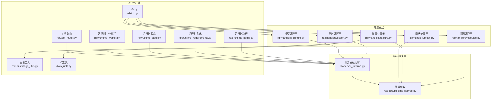
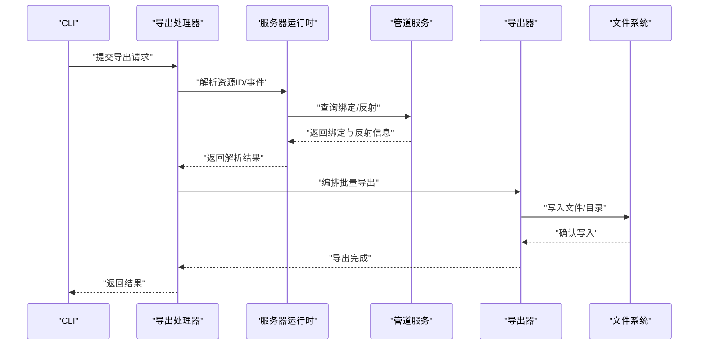
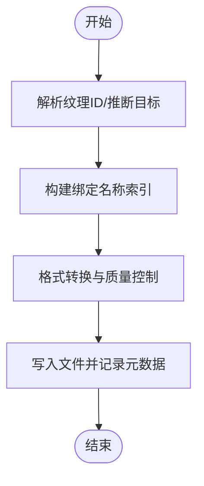
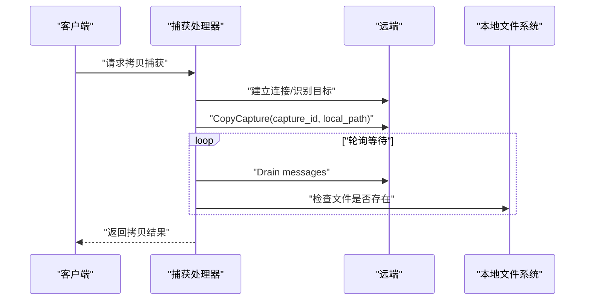
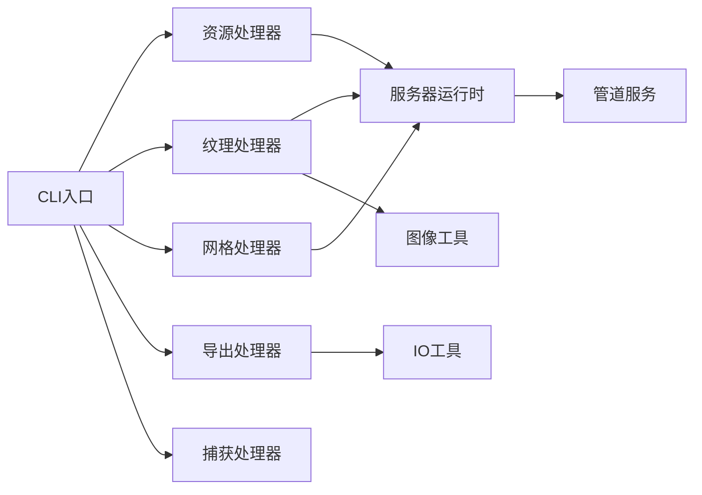

# 资源提取与导出

<cite>
**本文引用的文件**   
- [rdx/handlers/resource.py](file://rdx/handlers/resource.py)
- [rdx/handlers/export.py](file://rdx/handlers/export.py)
- [rdx/handlers/texture.py](file://rdx/handlers/texture.py)
- [rdx/handlers/mesh.py](file://rdx/handlers/mesh.py)
- [rdx/handlers/capture.py](file://rdx/handlers/capture.py)
- [rdx/core/pipeline_service.py](file://rdx/core/pipeline_service.py)
- [rdx/server_runtime.py](file://rdx/server_runtime.py)
- [rdx/utils/image_utils.py](file://rdx/utils/image_utils.py)
- [rdx/io_utils.py](file://rdx/io_utils.py)
- [rdx/models.py](file://rdx/models.py)
- [rdx/runtime_paths.py](file://rdx/runtime_paths.py)
- [rdx/runtime_requirements.py](file://rdx/runtime_requirements.py)
- [rdx/runtime_state.py](file://rdx/runtime_state.py)
- [rdx/runtime_worker.py](file://rdx/runtime_worker.py)
- [rdx/runtime_worker_state.py](file://rdx/runtime_worker_state.py)
- [rdx/tool_router.py](file://rdx/tool_router.py)
- [rdx/cli.py](file://rdx/cli.py)
- [cli/run_cli.py](file://cli/run_cli.py)
- [scripts/package_runtime.py](file://scripts/package_runtime.py)
- [scripts/release_gate.py](file://scripts/release_gate.py)
- [scripts/smoke_cli.sh](file://scripts/smoke_cli.sh)
- [scripts/rdx_bat_launcher.ps1](file://scripts/rdx_bat_launcher.ps1)
- [binaries/windows/x64/renderdoc.json](file://binaries/windows/x64/renderdoc.json)
- [binaries/windows/x64/manifest.runtime.json](file://binaries/windows/x64/manifest.runtime.json)
</cite>

## 目录
1. 引言
2. 项目结构
3. 核心组件
4. 架构总览
5. 详细组件分析
6. 依赖关系分析
7. 性能考量
8. 故障排查指南
9. 结论
10. 附录

## 引言
本文件面向“资源提取与导出”能力，系统化阐述如何从捕获文件中提取纹理、几何数据、着色器程序等资源，并支持批量导出、格式转换与质量控制。文档覆盖导出命名规则、目录结构、元数据保留策略；给出性能优化与大文件处理建议；并提供导出格式选择、压缩选项与兼容性参考。

## 项目结构
围绕资源提取与导出的关键模块分布如下：
- 处理器层：负责对外接口、参数解析、调用具体导出逻辑（如资源、纹理、网格、导出、捕获）。
- 核心服务层：封装渲染管线状态、资源绑定信息、反射与反汇编等能力。
- 工具与运行时：提供图像工具、IO工具、路径与打包脚本、CLI入口等支撑。
- 运行时与守护：管理会话、事件、资源解析、远程拷贝与限制校验。

图表来源
- [rdx/handlers/resource.py](file://rdx/handlers/resource.py)
- [rdx/handlers/texture.py](file://rdx/handlers/texture.py)
- [rdx/handlers/mesh.py](file://rdx/handlers/mesh.py)
- [rdx/handlers/export.py](file://rdx/handlers/export.py)
- [rdx/handlers/capture.py](file://rdx/handlers/capture.py)
- [rdx/core/pipeline_service.py](file://rdx/core/pipeline_service.py)
- [rdx/server_runtime.py](file://rdx/server_runtime.py)
- [rdx/utils/image_utils.py](file://rdx/utils/image_utils.py)
- [rdx/io_utils.py](file://rdx/io_utils.py)
- [rdx/cli.py](file://rdx/cli.py)
- [rdx/runtime_paths.py](file://rdx/runtime_paths.py)
- [rdx/runtime_requirements.py](file://rdx/runtime_requirements.py)
- [rdx/runtime_state.py](file://rdx/runtime_state.py)
- [rdx/runtime_worker.py](file://rdx/runtime_worker.py)
- [rdx/tool_router.py](file://rdx/tool_router.py)

章节来源
- [rdx/handlers/resource.py](file://rdx/handlers/resource.py)
- [rdx/handlers/export.py](file://rdx/handlers/export.py)
- [rdx/handlers/texture.py](file://rdx/handlers/texture.py)
- [rdx/handlers/mesh.py](file://rdx/handlers/mesh.py)
- [rdx/handlers/capture.py](file://rdx/handlers/capture.py)
- [rdx/core/pipeline_service.py](file://rdx/core/pipeline_service.py)
- [rdx/server_runtime.py](file://rdx/server_runtime.py)
- [rdx/utils/image_utils.py](file://rdx/utils/image_utils.py)
- [rdx/io_utils.py](file://rdx/io_utils.py)
- [rdx/cli.py](file://rdx/cli.py)
- [rdx/runtime_paths.py](file://rdx/runtime_paths.py)
- [rdx/runtime_requirements.py](file://rdx/runtime_requirements.py)
- [rdx/runtime_state.py](file://rdx/runtime_state.py)
- [rdx/runtime_worker.py](file://rdx/runtime_worker.py)
- [rdx/tool_router.py](file://rdx/tool_router.py)

## 核心组件
- 资源处理器：统一解析资源类型与标识，协调纹理/网格/着色器等子处理器完成导出。
- 纹理处理器：基于管线状态与绑定索引，定位目标纹理，执行格式转换与质量控制。
- 网格处理器：解析顶点/索引缓冲区，生成几何输出。
- 导出处理器：编排批量导出流程，组织命名、目录与元数据。
- 捕获处理器：管理捕获文件生命周期、远程拷贝与大小/数量限制。
- 管道服务：提供资源绑定、只读/读写资源映射、着色器反射与反汇编。
- 服务器运行时：资源ID解析、纹理候选推断、绑定名称索引、事件驱动的导出上下文。
- 图像工具：提供图像格式转换、质量参数与像素格式处理。
- IO工具：文件系统操作、路径规范化、批量写入与压缩。
- CLI与脚本：命令行入口、打包与发布门禁、启动器脚本。

章节来源
- [rdx/handlers/resource.py](file://rdx/handlers/resource.py)
- [rdx/handlers/texture.py](file://rdx/handlers/texture.py)
- [rdx/handlers/mesh.py](file://rdx/handlers/mesh.py)
- [rdx/handlers/export.py](file://rdx/handlers/export.py)
- [rdx/handlers/capture.py](file://rdx/handlers/capture.py)
- [rdx/core/pipeline_service.py](file://rdx/core/pipeline_service.py)
- [rdx/server_runtime.py](file://rdx/server_runtime.py)
- [rdx/utils/image_utils.py](file://rdx/utils/image_utils.py)
- [rdx/io_utils.py](file://rdx/io_utils.py)
- [rdx/cli.py](file://rdx/cli.py)

## 架构总览
下图展示从捕获到导出的核心交互：客户端通过CLI触发导出；处理器解析参数并调用运行时与服务层；运行时解析资源ID、推断纹理目标；服务层提供绑定与反射信息；最终由导出器组织输出并写入文件系统。

图表来源
- [rdx/handlers/export.py](file://rdx/handlers/export.py)
- [rdx/server_runtime.py](file://rdx/server_runtime.py)
- [rdx/core/pipeline_service.py](file://rdx/core/pipeline_service.py)
- [rdx/io_utils.py](file://rdx/io_utils.py)

## 详细组件分析

### 资源处理器（统一入口）
职责
- 解析资源类型（纹理/网格/着色器等）与标识。
- 协调各子处理器执行导出。
- 组织输出目录与元数据。

关键流程
- 参数校验与类型分发。
- 调用对应处理器（纹理/网格/着色器）。
- 批量导出编排与错误聚合。

章节来源
- [rdx/handlers/resource.py](file://rdx/handlers/resource.py)

### 纹理处理器（纹理提取与导出）
职责
- 基于事件与管线状态确定纹理目标。
- 应用格式转换与质量控制。
- 输出至指定目录并保留元数据。

关键流程
- 解析纹理ID或从输出目标推断。
- 查询绑定名称索引以生成显示名。
- 使用图像工具进行格式转换与质量控制。
- 写入文件并记录元数据。

图表来源
- [rdx/handlers/texture.py](file://rdx/handlers/texture.py)
- [rdx/server_runtime.py](file://rdx/server_runtime.py)
- [rdx/utils/image_utils.py](file://rdx/utils/image_utils.py)
- [rdx/io_utils.py](file://rdx/io_utils.py)

章节来源
- [rdx/handlers/texture.py](file://rdx/handlers/texture.py)
- [rdx/server_runtime.py](file://rdx/server_runtime.py)
- [rdx/utils/image_utils.py](file://rdx/utils/image_utils.py)
- [rdx/io_utils.py](file://rdx/io_utils.py)

### 网格处理器（几何数据导出）
职责
- 解析顶点/索引缓冲区。
- 提取几何属性（位置、法线、UV等）。
- 生成网格输出文件。

关键流程
- 读取缓冲区描述与数据。
- 解析属性布局与步长。
- 导出为常用网格格式（如OBJ/PLY等）。

章节来源
- [rdx/handlers/mesh.py](file://rdx/handlers/mesh.py)

### 导出处理器（批量导出编排）
职责
- 接收导出配置（格式、质量、压缩、目录等）。
- 遍历资源集合，调用子处理器。
- 组织输出目录结构与命名规则。
- 记录元数据与导出统计。

关键流程
- 解析导出参数与约束。
- 批量遍历资源并调用对应处理器。
- 写入文件并生成清单/元数据。

章节来源
- [rdx/handlers/export.py](file://rdx/handlers/export.py)

### 捕获处理器（捕获文件管理）
职责
- 管理捕获文件生命周期。
- 远程拷贝与本地落盘。
- 校验大小与数量限制。

关键流程
- 校验捕获文件大小与数量上限。
- 触发远程拷贝至本地路径。
- 循环等待与进度上报。

图表来源
- [rdx/handlers/capture.py](file://rdx/handlers/capture.py)
- [rdx/server_runtime.py](file://rdx/server_runtime.py)

章节来源
- [rdx/handlers/capture.py](file://rdx/handlers/capture.py)
- [rdx/server_runtime.py](file://rdx/server_runtime.py)

### 管道服务（资源绑定与反射）
职责
- 提供资源绑定信息（只读/读写资源）。
- 支持着色器反射与反汇编。
- 计算内容哈希用于去重与追踪。

关键流程
- 读取只读/读写资源列表。
- 生成绑定条目与资源映射。
- 反汇编着色器并计算哈希。

章节来源
- [rdx/core/pipeline_service.py](file://rdx/core/pipeline_service.py)

### 服务器运行时（资源解析与事件驱动）
职责
- 解析资源ID与纹理ID。
- 推断当前事件下的纹理输出目标。
- 构建绑定名称索引以辅助命名。

关键流程
- 解析资源ID（支持字符串/整数/别名）。
- 从输出目标或纹理列表中推断默认纹理。
- 为资源ID构建标签桶以生成显示名。

章节来源
- [rdx/server_runtime.py](file://rdx/server_runtime.py)

### 图像工具（格式转换与质量控制）
职责
- 提供图像格式转换、质量参数设置。
- 处理像素格式与通道对齐。

章节来源
- [rdx/utils/image_utils.py](file://rdx/utils/image_utils.py)

### IO工具（文件系统与压缩）
职责
- 文件写入、目录创建、路径规范化。
- 批量导出中的压缩与归档。

章节来源
- [rdx/io_utils.py](file://rdx/io_utils.py)

## 依赖关系分析
- 处理器层依赖运行时与服务层提供的资源解析与绑定信息。
- 导出器依赖IO工具进行文件写入与目录组织。
- CLI作为统一入口，路由到各处理器。
- 运行时与守护组件提供资源解析、事件驱动与远程拷贝能力。

图表来源
- [rdx/cli.py](file://rdx/cli.py)
- [rdx/handlers/resource.py](file://rdx/handlers/resource.py)
- [rdx/handlers/texture.py](file://rdx/handlers/texture.py)
- [rdx/handlers/mesh.py](file://rdx/handlers/mesh.py)
- [rdx/handlers/export.py](file://rdx/handlers/export.py)
- [rdx/handlers/capture.py](file://rdx/handlers/capture.py)
- [rdx/server_runtime.py](file://rdx/server_runtime.py)
- [rdx/core/pipeline_service.py](file://rdx/core/pipeline_service.py)
- [rdx/utils/image_utils.py](file://rdx/utils/image_utils.py)
- [rdx/io_utils.py](file://rdx/io_utils.py)

章节来源
- [rdx/cli.py](file://rdx/cli.py)
- [rdx/handlers/resource.py](file://rdx/handlers/resource.py)
- [rdx/handlers/texture.py](file://rdx/handlers/texture.py)
- [rdx/handlers/mesh.py](file://rdx/handlers/mesh.py)
- [rdx/handlers/export.py](file://rdx/handlers/export.py)
- [rdx/handlers/capture.py](file://rdx/handlers/capture.py)
- [rdx/server_runtime.py](file://rdx/server_runtime.py)
- [rdx/core/pipeline_service.py](file://rdx/core/pipeline_service.py)
- [rdx/utils/image_utils.py](file://rdx/utils/image_utils.py)
- [rdx/io_utils.py](file://rdx/io_utils.py)

## 性能考量
- 异步与离线：大量I/O与CPU密集型任务通过异步与线程池离线执行，避免阻塞主线程。
- 批量导出：合并写入与压缩，减少磁盘往返；按资源分组导出，降低重复解析成本。
- 缓存与索引：利用绑定名称索引与资源ID令牌桶，加速命名与匹配。
- 大文件处理：捕获文件拷贝采用轮询等待与消息驱动，结合超时与重试策略；导出阶段启用流式写入与分块压缩。
- 质量控制：在图像工具中设置合理的质量阈值与像素格式，避免过度转换导致的性能损耗。
- 事件驱动：仅在必要事件上解析管线状态，减少无谓开销。

## 故障排查指南
常见问题与定位
- 资源未找到：检查资源ID解析逻辑与别名映射；确认事件是否有效。
- 纹理目标为空：确认输出目标链路与纹理列表；必要时回退到默认纹理。
- 导出失败：检查导出目录权限与磁盘空间；查看压缩与格式转换日志。
- 远程拷贝异常：检查远端可达性与目标识别；关注消息轮询与超时设置。
- 大文件拒绝：核对捕获文件大小与数量限制；评估分片导出策略。

章节来源
- [rdx/server_runtime.py](file://rdx/server_runtime.py)
- [rdx/handlers/capture.py](file://rdx/handlers/capture.py)
- [rdx/io_utils.py](file://rdx/io_utils.py)

## 结论
该体系通过“处理器层+服务层+运行时”的分层设计，实现了从捕获到导出的完整闭环。资源解析、绑定索引与事件驱动确保了高精度的目标定位；图像与IO工具提供了灵活的格式转换与写入能力；CLI与脚本保障了可操作性与自动化。配合性能优化与故障排查策略，可在大规模场景下稳定高效地完成资源提取与导出。

## 附录

### 导出命名规则与目录结构
- 命名规则
  - 纹理：优先使用绑定名称与资源别名组合生成显示名；若不可得，回退到资源ID与绑定点拼接。
  - 网格：使用事件ID与资源ID组合命名，避免冲突。
  - 着色器：包含阶段、入口点与短哈希，便于快速识别与去重。
- 目录结构
  - 顶层按资源类型分目录（纹理/网格/着色器）。
  - 子目录按捕获会话或事件分层，便于检索与归档。
  - 元数据文件与清单文件与输出同级存放，便于审计与二次处理。

章节来源
- [rdx/server_runtime.py](file://rdx/server_runtime.py)
- [rdx/handlers/texture.py](file://rdx/handlers/texture.py)
- [rdx/core/pipeline_service.py](file://rdx/core/pipeline_service.py)
- [rdx/io_utils.py](file://rdx/io_utils.py)

### 导出格式选择、压缩选项与兼容性
- 图像格式：PNG/JPEG/DDS/TGA等，依据用途选择有损/无损与压缩级别。
- 网格格式：OBJ/PLY/STL等，兼顾通用性与体积。
- 着色器：GLSL/HLSL/SPIR-V反汇本，便于跨平台分析。
- 压缩：针对大文件采用ZIP/GZIP/ZSTD等，平衡压缩比与解压速度。
- 兼容性：优先选择广泛支持的格式；对专有格式提供转换通道与元数据标注。

章节来源
- [rdx/utils/image_utils.py](file://rdx/utils/image_utils.py)
- [rdx/io_utils.py](file://rdx/io_utils.py)
- [rdx/core/pipeline_service.py](file://rdx/core/pipeline_service.py)

### 运行时与守护组件
- 运行时路径与需求：定义运行时组件的发现与加载策略。
- 运行时状态：维护上下文状态与度量指标，支持可观测性。
- 运行时工作线程：隔离耗时任务，提升稳定性。
- 工具路由：统一路由工具调用，屏蔽底层差异。

章节来源
- [rdx/runtime_paths.py](file://rdx/runtime_paths.py)
- [rdx/runtime_requirements.py](file://rdx/runtime_requirements.py)
- [rdx/runtime_state.py](file://rdx/runtime_state.py)
- [rdx/runtime_worker.py](file://rdx/runtime_worker.py)
- [rdx/tool_router.py](file://rdx/tool_router.py)

### CLI与脚本
- CLI入口：统一命令行入口，支持多子命令与参数组合。
- 发布门禁：自动化检查与报告生成，保障交付质量。
- 包装与启动：打包运行时组件，提供Windows启动器脚本。

章节来源
- [rdx/cli.py](file://rdx/cli.py)
- [scripts/release_gate.py](file://scripts/release_gate.py)
- [scripts/package_runtime.py](file://scripts/package_runtime.py)
- [scripts/rdx_bat_launcher.ps1](file://scripts/rdx_bat_launcher.ps1)

### 平台与配置
- Windows运行时配置：包含渲染文档集成配置与运行时清单。
- 渲染文档集成：与RenderDoc集成以支持捕获与调试。

章节来源
- [binaries/windows/x64/manifest.runtime.json](file://binaries/windows/x64/manifest.runtime.json)
- [binaries/windows/x64/renderdoc.json](file://binaries/windows/x64/renderdoc.json)