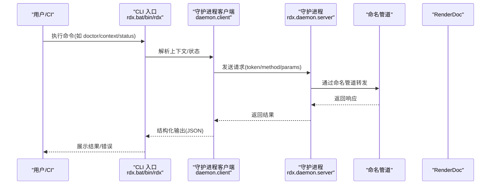
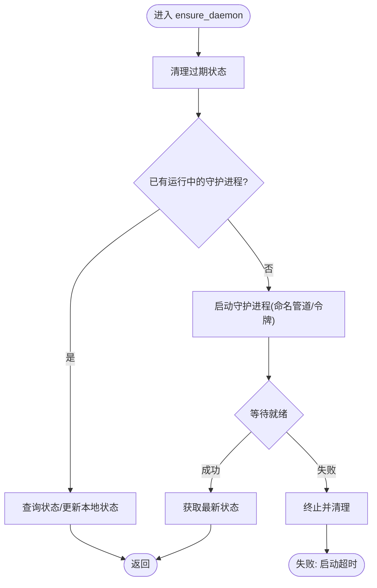
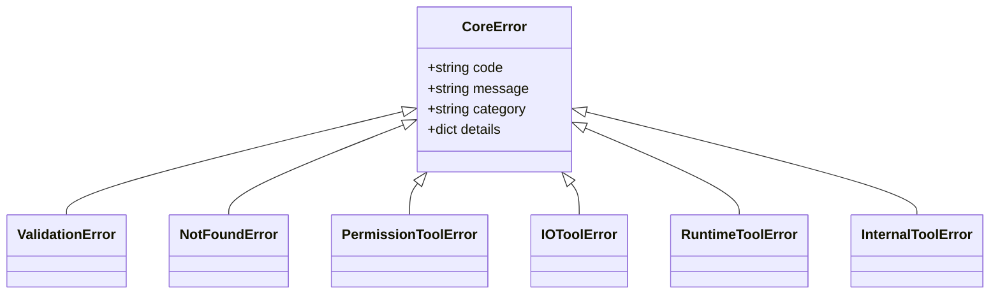
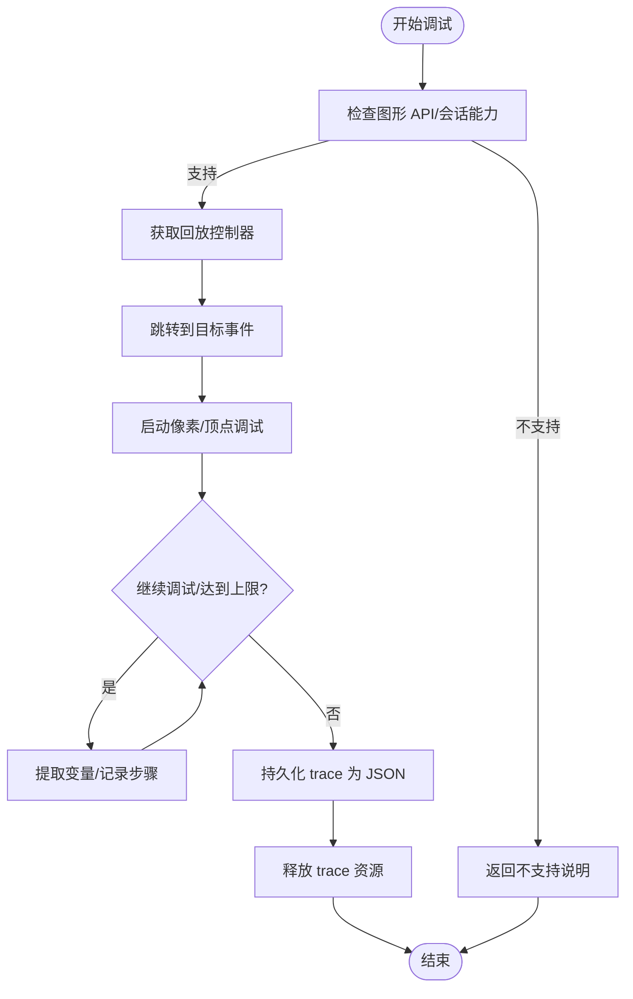
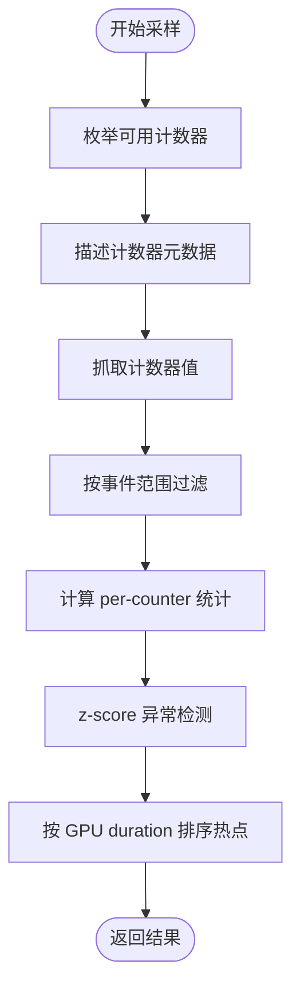
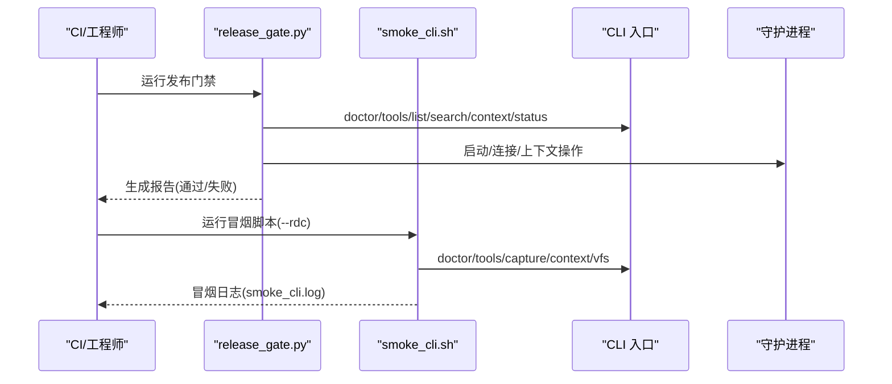
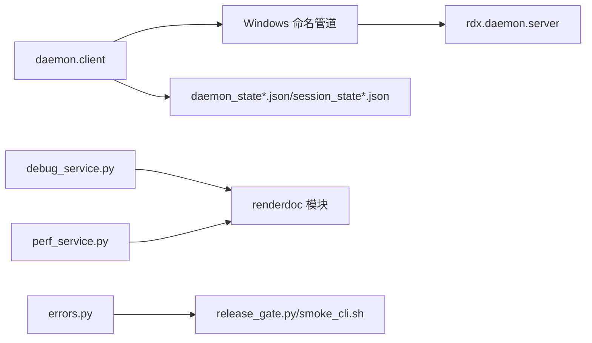

# 故障排除

<cite>
**本文引用的文件**
- [docs/troubleshooting.md](file://docs/troubleshooting.md)
- [README.md](file://README.md)
- [rdx/core/errors.py](file://rdx/core/errors.py)
- [rdx/daemon/client.py](file://rdx/daemon/client.py)
- [rdx/core/debug_service.py](file://rdx/core/debug_service.py)
- [rdx/core/perf_service.py](file://rdx/core/perf_service.py)
- [scripts/release_gate.py](file://scripts/release_gate.py)
- [scripts/smoke_cli.sh](file://scripts/smoke_cli.sh)
- [intermediate/logs/tool_smoke_findings.md](file://intermediate/logs/tool_smoke_findings.md)
</cite>

## 目录
1. [简介](#简介)
2. [项目结构](#项目结构)
3. [核心组件](#核心组件)
4. [架构总览](#架构总览)
5. [详细组件分析](#详细组件分析)
6. [依赖分析](#依赖分析)
7. [性能考虑](#性能考虑)
8. [故障排除指南](#故障排除指南)
9. [结论](#结论)
10. [附录](#附录)

## 简介
本指南面向使用 rdx-tools 的工程师与自动化平台，聚焦安装、配置、运行时异常与性能问题的系统化诊断与修复路径。内容覆盖：
- 快速自检命令与上下文状态核验
- 常见错误分类与根因定位
- 日志与状态文件分析要点
- 性能热点与调试工具使用建议
- 自动化测试、质量门禁与发布验证流程
- 稳定性与资源管理最佳实践

## 项目结构
rdx-tools 是一个仅 CLI 的 RenderDoc .rdc 运行时打包工具，通过 rdx.bat、bin/rdx 或 python cli/run_cli.py 暴露统一入口。核心运行时依赖 Windows 命名管道与守护进程协作，上下文隔离通过 --daemon-context 控制。

```mermaid
graph TB
subgraph "CLI 入口"
BAT["rdx.bat"]
BIN["bin/rdx"]
PYCLI["python cli/run_cli.py"]
end
subgraph "守护进程与状态"
DAEMON["rdx.daemon.server"]
PIPE["Windows 命名管道"]
STATE["daemon_state*.json<br/>session_state*.json"]
end
subgraph "核心服务"
DEBUG["debug_service.py<br/>像素/顶点调试"]
PERF["perf_service.py<br/>性能计数器采样"]
ERR["errors.py<br/>错误分类与映射"]
end
BAT --> DAEMON
BIN --> DAEMON
PYCLI --> DAEMON
DAEMON <- --> PIPE
DAEMON --> STATE
DAEMON --> DEBUG
DAEMON --> PERF
DAEMON --> ERR
```

图表来源
- [rdx/daemon/client.py:420-469](file://rdx/daemon/client.py#L420-L469)
- [rdx/core/debug_service.py:43-268](file://rdx/core/debug_service.py#L43-L268)
- [rdx/core/perf_service.py:168-446](file://rdx/core/perf_service.py#L168-L446)
- [rdx/core/errors.py](file://rdx/core/errors.py#L9-T121)

章节来源
- [README.md: 1-58:1-58](file://README.md#L1-L58)
- [docs/troubleshooting.md: 1-30:1-30](file://docs/troubleshooting.md#L1-L30)

## 核心组件
- 守护进程客户端：负责启动/连接守护进程、发送请求、处理超时与清理过期状态。
- 错误体系：统一 CoreError 分类，映射异常至稳定错误码与类别，便于脚本与自动化判定。
- 调试服务：封装 RenderDoc 像素/顶点调试 API，支持逐步执行与 trace 持久化。
- 性能服务：封装 GPU 性能计数器枚举、采样与异常事件检测。
- 发布门禁与冒烟脚本：提供结构完整性、清单校验、入口可用性、Smoke 场景等自动化验证。

章节来源
- [rdx/daemon/client.py: 420-800:420-800](file://rdx/daemon/client.py#L420-L800)
- [rdx/core/errors.py: 9-121:9-121](file://rdx/core/errors.py#L9-L121)
- [rdx/core/debug_service.py: 43-614:43-614](file://rdx/core/debug_service.py#L43-L614)
- [rdx/core/perf_service.py: 168-575:168-575](file://rdx/core/perf_service.py#L168-L575)
- [scripts/release_gate.py: 397-532:397-532](file://scripts/release_gate.py#L397-L532)
- [scripts/smoke_cli.sh: 108-196:108-196](file://scripts/smoke_cli.sh#L108-L196)

## 架构总览
下图展示 CLI 请求经守护进程转发到 RenderDoc 的典型调用链，以及状态文件与命名管道交互。



图表来源
- [rdx/daemon/client.py: 420-L469:420-469](file://rdx/daemon/client.py#L420-L469)
- [rdx/daemon/client.py: 576-L675:576-675](file://rdx/daemon/client.py#L576-L675)

## 详细组件分析

### 守护进程客户端与状态管理
- 超时与重试：请求等待与轮询策略，超时抛出带诊断信息的异常，包含活动请求数、当前操作摘要与恢复提示。
- 上下文隔离：支持多上下文，状态文件按上下文命名，清理过期进程与孤儿文件。
- 启停与心跳：启动守护进程、附加/心跳/分离客户端，优雅关闭与强制终止策略。



图表来源
- [rdx/daemon/client.py: 576-L675:576-675](file://rdx/daemon/client.py#L576-L675)
- [rdx/daemon/client.py: 507-L560:507-560](file://rdx/daemon/client.py#L507-L560)

章节来源
- [rdx/daemon/client.py: 420-L800:420-800](file://rdx/daemon/client.py#L420-L800)

### 错误分类与映射
- 统一异常映射：将底层异常映射为 CoreError，区分校验、未找到、权限、IO、运行时与内部错误，并保留细节字段。
- 会话错误特化：当底层抛出会话错误时，按错误码推断类别（如 not_found），并保留详情。



图表来源
- [rdx/core/errors.py: 9-L121:9-121](file://rdx/core/errors.py#L9-L121)

章节来源
- [rdx/core/errors.py: 9-L121:9-121](file://rdx/core/errors.py#L9-L121)

### 调试服务（像素/顶点）
- 能力检测：基于会话能力或图形 API 判断是否支持调试。
- 调试执行：定位事件、启动调试器、迭代状态、提取寄存器变量、检测 NaN/Inf。
- 资源回收：无论成功与否，最终释放 trace 以避免驱动资源泄漏。
- 导出：将 trace 序列化为 JSON artifact，便于离线分析。



图表来源
- [rdx/core/debug_service.py: 54-L268:54-268](file://rdx/core/debug_service.py#L54-L268)
- [rdx/core/debug_service.py: 271-L422:271-422](file://rdx/core/debug_service.py#L271-L422)

章节来源
- [rdx/core/debug_service.py: 43-L614:43-614](file://rdx/core/debug_service.py#L43-L614)

### 性能服务（GPU 性能计数器）
- 计数器枚举与描述：异步在线程池中执行，避免阻塞事件循环。
- 采样与统计：按事件范围过滤、提取数值、计算 min/max/mean/p95、识别异常事件。
- 热点检测：自动寻找 GPU duration 计数器并按耗时排序返回 top-K。



图表来源
- [rdx/core/perf_service.py: 191-L265:191-265](file://rdx/core/perf_service.py#L191-L265)
- [rdx/core/perf_service.py: 270-L446:270-446](file://rdx/core/perf_service.py#L270-L446)
- [rdx/core/perf_service.py: 451-L575:451-575](file://rdx/core/perf_service.py#L451-L575)

章节来源
- [rdx/core/perf_service.py: 168-L575:168-575](file://rdx/core/perf_service.py#L168-L575)

### 发布门禁与冒烟脚本
- 发布门禁：校验目录/文件结构、清单完整性、Python 布局、入口可用性、上下文操作、规格校验、文档健康度、Smoke 日志与发布包一致性。
- 冒烟脚本：对 doctor、tools list/search、上下文与捕获链路进行端到端验证，支持超时控制与状态快照。



图表来源
- [scripts/release_gate.py: 397-L532:397-532](file://scripts/release_gate.py#L397-L532)
- [scripts/smoke_cli.sh: 108-L196:108-196](file://scripts/smoke_cli.sh#L108-L196)

章节来源
- [scripts/release_gate.py: 1-L532:1-532](file://scripts/release_gate.py#L1-L532)
- [scripts/smoke_cli.sh: 1-L196:1-196](file://scripts/smoke_cli.sh#L1-L196)
- [intermediate/logs/tool_smoke_findings.md: 1-L23:1-23](file://intermediate/logs/tool_smoke_findings.md#L1-L23)

## 依赖分析
- 客户端与守护进程：通过 Windows 命名管道通信，状态文件用于跨进程共享上下文与会话信息。
- 渲染后端：调试与性能服务依赖 RenderDoc Python 模块，缺失时会降级并记录警告。
- 错误模型：统一映射到 CoreError，便于上层脚本与自动化进行条件分支。



图表来源
- [rdx/daemon/client.py: 118-L120:118-120](file://rdx/daemon/client.py#L118-L120)
- [rdx/core/debug_service.py: 573-L596:573-596](file://rdx/core/debug_service.py#L573-L596)
- [rdx/core/perf_service.py: 35-L58:35-58](file://rdx/core/perf_service.py#L35-L58)
- [rdx/core/errors.py: 90-L121:90-121](file://rdx/core/errors.py#L90-L121)

章节来源
- [rdx/daemon/client.py: 1-L833:1-833](file://rdx/daemon/client.py#L1-L833)
- [rdx/core/debug_service.py: 1-L614:1-614](file://rdx/core/debug_service.py#L1-L614)
- [rdx/core/perf_service.py: 1-L575:1-575](file://rdx/core/perf_service.py#L1-L575)
- [rdx/core/errors.py: 1-L121:1-121](file://rdx/core/errors.py#L1-L121)

## 性能考虑
- 调试 trace 步数上限：避免无限循环导致资源耗尽。
- 性能计数器采样：使用线程池异步执行，降低主线程阻塞风险。
- 热点检测阈值：基于 z-score 与分位数，减少误报与漏报。
- 资源回收：调试完成后释放 trace，防止驱动资源泄漏。

章节来源
- [rdx/core/debug_service.py: 64-L93:64-93](file://rdx/core/debug_service.py#L64-L93)
- [rdx/core/perf_service.py: 180-L186:180-186](file://rdx/core/perf_service.py#L180-L186)
- [rdx/core/perf_service.py: 414-L432:414-432](file://rdx/core/perf_service.py#L414-L432)

## 故障排除指南

### 一、安装与环境问题
- 症状
  - 入口命令不可用或返回非零退出码
  - Python 布局不正确或缺少必要文件
  - 用户文档包含虚拟环境/包管理器引导
- 快速自检
  - 使用 doctor 与版本命令确认入口可用性与版本信息
  - 校验清单完整性与受禁后缀
  - 检查用户文档是否包含禁止路径/命令
- 诊断步骤
  - 运行入口自检与清单校验
  - 如需发布包，校验 SHA256 并比对源树
- 参考
  - [docs/troubleshooting.md: 3-5:3-5](file://docs/troubleshooting.md#L3-L5)
  - [scripts/release_gate.py: 228-L258:228-258](file://scripts/release_gate.py#L228-L258)
  - [scripts/release_gate.py: 268-L280:268-280](file://scripts/release_gate.py#L268-L280)
  - [scripts/release_gate.py: 311-L338:311-338](file://scripts/release_gate.py#L311-L338)

章节来源
- [docs/troubleshooting.md: 1-L30:1-30](file://docs/troubleshooting.md#L1-L30)
- [scripts/release_gate.py: 228-L338:228-338](file://scripts/release_gate.py#L228-L338)

### 二、上下文与会话状态问题
- 症状
  - diff/assert 等管线报告“需要会话”
  - 预览状态异常或显示不完整
  - 远程句柄被消费后仍尝试复用
- 快速自检
  - 使用 context status 检查当前会话与预览状态
  - 使用 context clear 清理无效上下文
  - 检查远程生命周期状态 remote_handle_consumed
- 诊断步骤
  - 确认 --daemon-context 选择正确
  - 若无活动会话，打开捕获或显式传入 session-id
  - 预览显示与帧缓冲区尺寸区分 viewport/scissor
- 参考
  - [docs/troubleshooting.md: 7-29:7-29](file://docs/troubleshooting.md#L7-L29)
  - [README.md: 40-46:40-46](file://README.md#L40-L46)

章节来源
- [docs/troubleshooting.md: 7-L29:7-29](file://docs/troubleshooting.md#L7-L29)
- [README.md: 40-L46:40-46](file://README.md#L40-L46)

### 三、守护进程与命名管道问题
- 症状
  - 请求超时或无响应
  - 守护进程未就绪或僵尸状态
  - 多上下文冲突或孤儿状态文件
- 快速自检
  - 运行 doctor 与上下文状态命令
  - 检查 daemon_state*.json 与 session_state*.json
  - 使用 clear_context 清理上下文
- 诊断步骤
  - 观察超时异常中的活动请求数与当前操作摘要
  - 若守护进程不可达，尝试重启或清理过期状态
  - 检查命名管道地址与令牌有效性
- 参考
  - [rdx/daemon/client.py: 420-L469:420-469](file://rdx/daemon/client.py#L420-L469)
  - [rdx/daemon/client.py: 507-L560:507-560](file://rdx/daemon/client.py#L507-L560)
  - [rdx/daemon/client.py: 774-L800:774-800](file://rdx/daemon/client.py#L774-L800)

章节来源
- [rdx/daemon/client.py: 420-L800:420-800](file://rdx/daemon/client.py#L420-L800)

### 四、渲染后端与调试问题
- 症状
  - 调试服务不可用或返回不支持
  - trace 为空或无效
  - NaN/Inf 检测未触发
- 快速自检
  - 确认图形 API 支持调试
  - 检查 renderdoc 模块是否可用
  - 验证事件与像素/顶点坐标有效
- 诊断步骤
  - 使用能力检测逻辑确认支持情况
  - 捕获 trace 并持久化为 JSON 以便离线分析
  - 注意资源释放，避免驱动资源泄漏
- 参考
  - [rdx/core/debug_service.py: 94-L102:94-102](file://rdx/core/debug_service.py#L94-L102)
  - [rdx/core/debug_service.py: 112-L142:112-142](file://rdx/core/debug_service.py#L112-L142)
  - [rdx/core/debug_service.py: 204-L211:204-211](file://rdx/core/debug_service.py#L204-L211)

章节来源
- [rdx/core/debug_service.py: 43-L614:43-614](file://rdx/core/debug_service.py#L43-L614)

### 五、性能计数器与热点问题
- 症状
  - 计数器枚举失败或为空
  - 热点检测无结果或异常
  - 采样耗时过长
- 快速自检
  - 确认 renderdoc 可用
  - 检查事件范围与计数器 ID 有效性
- 诊断步骤
  - 使用枚举与描述接口确认可用计数器
  - 采样后按 per-counter 统计与异常阈值筛选
  - 基于 GPU duration 排序热点事件
- 参考
  - [rdx/core/perf_service.py: 225-L239:225-239](file://rdx/core/perf_service.py#L225-L239)
  - [rdx/core/perf_service.py: 354-L362:354-362](file://rdx/core/perf_service.py#L354-L362)
  - [rdx/core/perf_service.py: 509-L534:509-534](file://rdx/core/perf_service.py#L509-L534)

章节来源
- [rdx/core/perf_service.py: 168-L575:168-575](file://rdx/core/perf_service.py#L168-L575)

### 六、日志与状态文件分析
- 关键日志位置
  - 冒烟日志：intermediate/logs/smoke_cli.log
  - 发布门禁报告：中间态 Markdown 报告
  - 预览冒烟产物：JSON 与 Markdown
- 分析要点
  - 通过 context status 与状态文件摘要定位 session_id/capture_file_id 等关键字段
  - 超时场景打印上下文状态与状态文件摘要，便于快速定位
  - 发布门禁报告逐项列出通过/失败与原因
- 参考
  - [scripts/smoke_cli.sh: 120-L130:120-130](file://scripts/smoke_cli.sh#L120-L130)
  - [scripts/smoke_cli.sh: 141-L161:141-161](file://scripts/smoke_cli.sh#L141-L161)
  - [scripts/release_gate.py: 513-L527:513-527](file://scripts/release_gate.py#L513-L527)
  - [intermediate/logs/tool_smoke_findings.md: 1-L23:1-23](file://intermediate/logs/tool_smoke_findings.md#L1-L23)

章节来源
- [scripts/smoke_cli.sh: 1-L196:1-196](file://scripts/smoke_cli.sh#L1-L196)
- [scripts/release_gate.py: 513-L527:513-527](file://scripts/release_gate.py#L513-L527)
- [intermediate/logs/tool_smoke_findings.md: 1-L23:1-23](file://intermediate/logs/tool_smoke_findings.md#L1-L23)

### 七、错误代码与根因分析
- 错误分类
  - 校验/未找到/权限/IO/运行时/内部错误
  - 会话错误按错误码推断类别
- 根因分析流程
  - 优先查看错误类别与 code 字段
  - 结合 details 与诊断异常中的摘要信息
  - 若涉及守护进程，结合活动请求数与当前操作摘要
- 参考
  - [rdx/core/errors.py: 90-L121:90-121](file://rdx/core/errors.py#L90-L121)
  - [rdx/daemon/client.py: 444-L462:444-462](file://rdx/daemon/client.py#L444-L462)

章节来源
- [rdx/core/errors.py: 9-L121:9-121](file://rdx/core/errors.py#L9-L121)
- [rdx/daemon/client.py: 420-L469:420-469](file://rdx/daemon/client.py#L420-L469)

### 八、自动化测试、质量门禁与发布验证
- 冒烟测试
  - 使用 bash scripts/smoke_cli.sh 验证 doctor、tools list/search、上下文与捕获链路
  - 支持超时参数与状态快照
- 发布门禁
  - 校验目录/文件结构、清单完整性、Python 布局
  - 校验入口可用性、上下文操作、规格与文档健康度
  - 可选要求：Smoke 日志存在且标记通过、发布包存在并校验
- 参考
  - [scripts/smoke_cli.sh: 172-L196:172-196](file://scripts/smoke_cli.sh#L172-L196)
  - [scripts/release_gate.py: 417-L512:417-512](file://scripts/release_gate.py#L417-L512)

章节来源
- [scripts/smoke_cli.sh: 1-L196:1-196](file://scripts/smoke_cli.sh#L1-L196)
- [scripts/release_gate.py: 1-L532:1-532](file://scripts/release_gate.py#L1-L532)

### 九、稳定性与资源管理建议
- 调试稳定性
  - 设置合理的最大步数上限，避免长时间调试
  - 调试结束后及时释放 trace
- 性能采样稳定性
  - 使用线程池异步执行，避免阻塞
  - 合理设置事件范围，避免过大样本导致内存压力
- 资源管理
  - 定期清理过期守护进程与孤儿状态文件
  - 使用 clear_context 清理上下文，避免残留状态影响后续任务

章节来源
- [rdx/core/debug_service.py: 189-L192:189-192](file://rdx/core/debug_service.py#L189-L192)
- [rdx/core/debug_service.py: 204-L211:204-211](file://rdx/core/debug_service.py#L204-L211)
- [rdx/core/perf_service.py: 180-L186:180-186](file://rdx/core/perf_service.py#L180-L186)
- [rdx/daemon/client.py: 507-L560:507-560](file://rdx/daemon/client.py#L507-L560)

## 结论
通过统一的自检命令、清晰的错误分类与状态文件分析，结合调试与性能服务的规范使用，可以高效定位并解决安装、配置、运行时与性能问题。配合自动化冒烟与发布门禁，可显著提升交付质量与稳定性。

## 附录
- 常用命令速查
  - doctor：检查工具根目录、Python 运行时、RenderDoc 布局与守护进程状态
  - context status：查看当前上下文与会话信息
  - context clear：清理上下文，释放状态与资源
  - vfs ls/tree：浏览捕获文件系统
  - daemon tools list：查看守护进程可用工具
- 参考文件
  - [docs/troubleshooting.md](file://docs/troubleshooting.md)
  - [README.md](file://README.md)
  - [scripts/smoke_cli.sh](file://scripts/smoke_cli.sh)
  - [scripts/release_gate.py](file://scripts/release_gate.py)