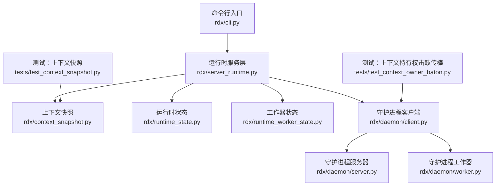
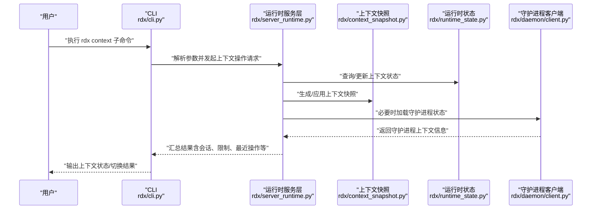
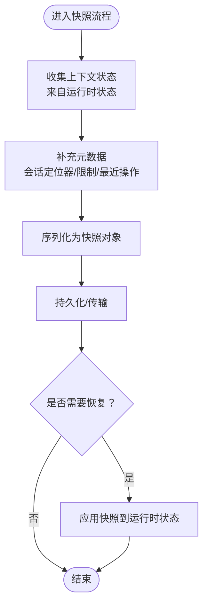
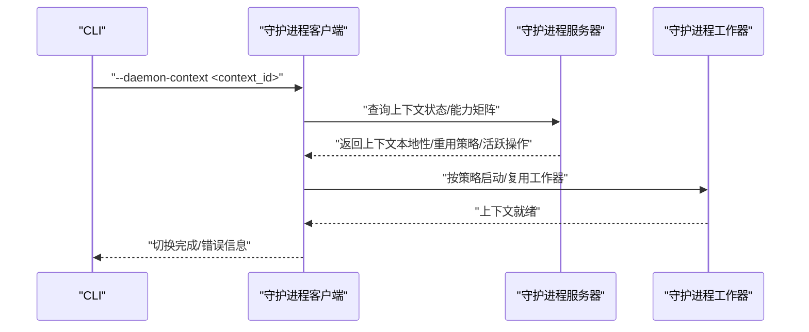
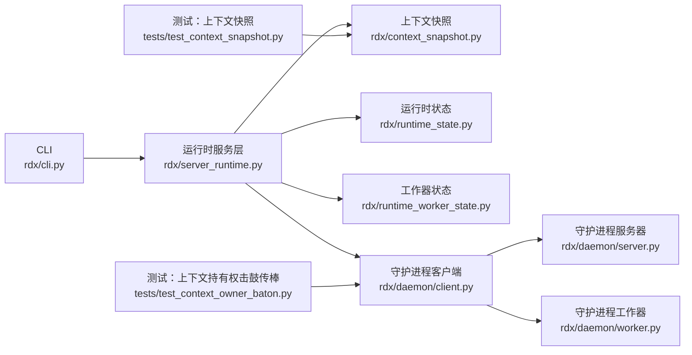

# 上下文管理

<cite>
**本文引用的文件**
- [rdx/context_snapshot.py](file://rdx/context_snapshot.py)
- [rdx/runtime_state.py](file://rdx/runtime_state.py)
- [rdx/runtime_worker_state.py](file://rdx/runtime_worker_state.py)
- [rdx/daemon/client.py](file://rdx/daemon/client.py)
- [rdx/daemon/server.py](file://rdx/daemon/server.py)
- [rdx/daemon/worker.py](file://rdx/daemon/worker.py)
- [rdx/cli.py](file://rdx/cli.py)
- [rdx/server_runtime.py](file://rdx/server_runtime.py)
- [tests/test_context_snapshot.py](file://tests/test_context_snapshot.py)
- [tests/test_context_owner_baton.py](file://tests/test_context_owner_baton.py)
- [intermediate/rx_cli/daemon_state_release-gate-context.json](file://intermediate/rdx_cli/daemon_state_release-gate-context.json)
- [intermediate/worker-state/worker_state_release-gate-context.json](file://intermediate/worker-state/worker_state_release-gate-context.json)
</cite>

## 目录
1. [引言](#引言)
2. [项目结构](#项目结构)
3. [核心组件](#核心组件)
4. [架构总览](#架构总览)
5. [详细组件分析](#详细组件分析)
6. [依赖关系分析](#依赖关系分析)
7. [性能考量](#性能考量)
8. [故障排查指南](#故障排查指南)
9. [结论](#结论)
10. [附录](#附录)

## 引言
本文件系统性阐述 RDX Agent Tools 中的“上下文管理”体系，重点覆盖以下主题：
- 上下文隔离机制与状态持久化
- 上下文快照的创建、存储与恢复
- 守护进程上下文的选择与切换（含 --daemon-context 参数）
- 上下文生命周期管理、状态变更与清理
- 远程操作中的上下文作用与生命周期保护

目标是帮助开发者与使用者在复杂运行时环境中正确选择、切换与恢复上下文，确保操作一致性与可恢复性。

## 项目结构
围绕上下文管理的关键代码分布在如下模块：
- 快照与状态：rdx/context_snapshot.py、rdx/runtime_state.py、rdx/runtime_worker_state.py
- 守护进程交互：rdx/daemon/client.py、rdx/daemon/server.py、rdx/daemon/worker.py
- 命令行入口与运行时：rdx/cli.py、rdx/server_runtime.py
- 测试与样例数据：tests/test_context_snapshot.py、tests/test_context_owner_baton.py、中间态样例 JSON 文件

图表来源
- [rdx/cli.py](file://rdx/cli.py)
- [rdx/server_runtime.py](file://rdx/server_runtime.py)
- [rdx/context_snapshot.py](file://rdx/context_snapshot.py)
- [rdx/runtime_state.py](file://rdx/runtime_state.py)
- [rdx/runtime_worker_state.py](file://rdx/runtime_worker_state.py)
- [rdx/daemon/client.py](file://rdx/daemon/client.py)
- [rdx/daemon/server.py](file://rdx/daemon/server.py)
- [rdx/daemon/worker.py](file://rdx/daemon/worker.py)
- [tests/test_context_snapshot.py](file://tests/test_context_snapshot.py)
- [tests/test_context_owner_baton.py](file://tests/test_context_owner_baton.py)

章节来源
- [rdx/context_snapshot.py](file://rdx/context_snapshot.py)
- [rdx/runtime_state.py](file://rdx/runtime_state.py)
- [rdx/runtime_worker_state.py](file://rdx/runtime_worker_state.py)
- [rdx/daemon/client.py](file://rdx/daemon/client.py)
- [rdx/daemon/server.py](file://rdx/daemon/server.py)
- [rdx/daemon/worker.py](file://rdx/daemon/worker.py)
- [rdx/cli.py](file://rdx/cli.py)
- [rdx/server_runtime.py](file://rdx/server_runtime.py)
- [tests/test_context_snapshot.py](file://tests/test_context_snapshot.py)
- [tests/test_context_owner_baton.py](file://tests/test_context_owner_baton.py)

## 核心组件
- 上下文快照引擎：负责捕获当前上下文状态、序列化与恢复，支撑跨会话/跨进程的上下文迁移与回放。
- 运行时状态管理：维护上下文维度的状态字典、会话映射、限制与最近操作等，作为快照的数据源。
- 守护进程上下文协调：通过客户端加载守护进程状态，支持上下文选择、切换与生命周期保护。
- 命令行与运行时编排：CLI 将用户意图转化为运行时请求，运行时服务层聚合状态与快照，输出统一响应。

章节来源
- [rdx/context_snapshot.py](file://rdx/context_snapshot.py)
- [rdx/runtime_state.py](file://rdx/runtime_state.py)
- [rdx/runtime_worker_state.py](file://rdx/runtime_worker_state.py)
- [rdx/daemon/client.py](file://rdx/daemon/client.py)
- [rdx/server_runtime.py](file://rdx/server_runtime.py)

## 架构总览
上下文管理贯穿 CLI -> 运行时服务层 -> 状态/快照 -> 守护进程的链路，形成“请求编排—状态采集—持久化/恢复—守护进程协同”的闭环。

图表来源
- [rdx/cli.py](file://rdx/cli.py)
- [rdx/server_runtime.py](file://rdx/server_runtime.py)
- [rdx/context_snapshot.py](file://rdx/context_snapshot.py)
- [rdx/runtime_state.py](file://rdx/runtime_state.py)
- [rdx/daemon/client.py](file://rdx/daemon/client.py)

## 详细组件分析

### 上下文快照引擎（context_snapshot）
职责
- 捕获当前上下文状态为可序列化的快照
- 支持从快照恢复上下文
- 提供与运行时状态的对接点，保证快照数据完整性

关键流程
- 创建快照：从运行时状态中抽取上下文相关字段，结合会话定位器、最近操作、限制等，生成完整快照对象
- 应用快照：将快照回灌到运行时状态，重建上下文环境
- 与守护进程协作：在需要时加载守护进程状态，以补充活跃操作等信息

图表来源
- [rdx/context_snapshot.py](file://rdx/context_snapshot.py)
- [rdx/runtime_state.py](file://rdx/runtime_state.py)

章节来源
- [rdx/context_snapshot.py](file://rdx/context_snapshot.py)
- [rdx/runtime_state.py](file://rdx/runtime_state.py)

### 运行时状态与工作器状态（runtime_state / runtime_worker_state）
职责
- 维护上下文维度的状态字典（如 sessions、recovery、limits、recent_operations）
- 记录活跃操作与最近操作历史，便于快照与恢复
- 工作器状态用于承载与上下文绑定的工作器生命周期信息

交互要点
- 运行时服务层在处理上下文操作时，优先读取/写入运行时状态
- 工作器状态与上下文绑定，确保在上下文切换时工作器资源得到正确回收或迁移

章节来源
- [rdx/runtime_state.py](file://rdx/runtime_state.py)
- [rdx/runtime_worker_state.py](file://rdx/runtime_worker_state.py)

### 守护进程上下文选择与切换（daemon client/server/worker）
职责
- 客户端：加载守护进程状态，查询活跃操作、上下文本地性与重用策略
- 服务器：维护守护进程全局上下文视图与能力矩阵
- 工作者：承载具体上下文任务，受上下文生命周期保护

上下文选择与切换机制
- 通过 --daemon-context 参数指定目标上下文 ID
- 客户端根据上下文 ID 加载守护进程状态，判断是否可复用或需新建
- 切换时评估上下文本地性与重用策略，避免跨上下文污染

图表来源
- [rdx/daemon/client.py](file://rdx/daemon/client.py)
- [rdx/daemon/server.py](file://rdx/daemon/server.py)
- [rdx/daemon/worker.py](file://rdx/daemon/worker.py)

章节来源
- [rdx/daemon/client.py](file://rdx/daemon/client.py)
- [rdx/daemon/server.py](file://rdx/daemon/server.py)
- [rdx/daemon/worker.py](file://rdx/daemon/worker.py)

### 命令行与运行时编排（cli / server_runtime）
职责
- CLI 解析用户输入，识别上下文子命令与参数（如 --daemon-context）
- 运行时服务层聚合状态与快照，输出统一响应（包含会话、限制、最近操作、远程上下文属性等）

典型场景
- 查询上下文：返回当前上下文状态与会话列表
- 创建上下文：校验容量并初始化上下文状态
- 切换上下文：加载守护进程状态，评估本地性与重用策略后执行切换

章节来源
- [rdx/cli.py](file://rdx/cli.py)
- [rdx/server_runtime.py](file://rdx/server_runtime.py)

### 上下文生命周期管理、状态变更与清理
生命周期阶段
- 初始化：创建上下文并分配容量
- 使用期：记录活跃操作与最近操作，维护会话映射
- 切换期：加载守护进程状态，评估本地性与重用策略
- 清理期：释放工作器资源，回收上下文占用的系统资源

状态变更
- 通过运行时状态维护上下文维度的关键字段
- 快照作为状态变更的原子化介质，确保变更可回滚

清理策略
- 在上下文销毁或长时间闲置后触发清理
- 清理前先应用快照，确保状态一致性

章节来源
- [rdx/server_runtime.py](file://rdx/server_runtime.py)
- [rdx/runtime_state.py](file://rdx/runtime_state.py)
- [rdx/runtime_worker_state.py](file://rdx/runtime_worker_state.py)

### 上下文快照的创建、存储与恢复
创建
- 从运行时状态抽取上下文相关字段，合并会话定位器、限制与最近操作
- 可选地合并守护进程状态（如活跃操作），形成完整快照

存储
- 支持本地持久化与跨进程传输
- 建议配合版本号与校验和，确保快照可验证

恢复
- 将快照回灌到运行时状态，重建上下文环境
- 若存在守护进程状态，优先应用以保持一致性

章节来源
- [rdx/context_snapshot.py](file://rdx/context_snapshot.py)
- [rdx/runtime_state.py](file://rdx/runtime_state.py)
- [rdx/daemon/client.py](file://rdx/daemon/client.py)

### 远程操作中的上下文作用与生命周期保护
远程上下文属性
- 远程上下文本地性：严格/宽松等策略，决定是否允许跨主机上下文共享
- 远程句柄来源上下文：标识远程上下文的来源上下文 ID
- 远程句柄复用策略：强制重连/允许复用等策略

生命周期保护
- 通过守护进程能力矩阵与活跃操作信息，防止误删或误切
- 在远程连接不稳定时，采用保守策略（如必须重连）保障一致性

章节来源
- [rdx/server_runtime.py](file://rdx/server_runtime.py)
- [rdx/daemon/client.py](file://rdx/daemon/client.py)

## 依赖关系分析
上下文管理模块之间的耦合与协作如下：

图表来源
- [rdx/cli.py](file://rdx/cli.py)
- [rdx/server_runtime.py](file://rdx/server_runtime.py)
- [rdx/context_snapshot.py](file://rdx/context_snapshot.py)
- [rdx/runtime_state.py](file://rdx/runtime_state.py)
- [rdx/runtime_worker_state.py](file://rdx/runtime_worker_state.py)
- [rdx/daemon/client.py](file://rdx/daemon/client.py)
- [rdx/daemon/server.py](file://rdx/daemon/server.py)
- [rdx/daemon/worker.py](file://rdx/daemon/worker.py)
- [tests/test_context_snapshot.py](file://tests/test_context_snapshot.py)
- [tests/test_context_owner_baton.py](file://tests/test_context_owner_baton.py)

章节来源
- [rdx/cli.py](file://rdx/cli.py)
- [rdx/server_runtime.py](file://rdx/server_runtime.py)
- [rdx/context_snapshot.py](file://rdx/context_snapshot.py)
- [rdx/runtime_state.py](file://rdx/runtime_state.py)
- [rdx/runtime_worker_state.py](file://rdx/runtime_worker_state.py)
- [rdx/daemon/client.py](file://rdx/daemon/client.py)
- [rdx/daemon/server.py](file://rdx/daemon/server.py)
- [rdx/daemon/worker.py](file://rdx/daemon/worker.py)
- [tests/test_context_snapshot.py](file://tests/test_context_snapshot.py)
- [tests/test_context_owner_baton.py](file://tests/test_context_owner_baton.py)

## 性能考量
- 快照体积控制：仅包含上下文必需字段，避免冗余数据
- 增量更新：对频繁变更的状态采用增量快照，减少全量序列化开销
- 缓存命中：在守护进程侧缓存常用上下文状态，降低重复加载成本
- 并发安全：上下文切换期间对状态访问加锁，避免竞态

## 故障排查指南
常见问题与对策
- 上下文切换失败：检查 --daemon-context 是否有效；查看守护进程状态与能力矩阵；确认远程上下文本地性与重用策略
- 快照不一致：核对快照版本与校验和；确认快照创建/应用时序；检查运行时状态是否被并发修改
- 生命周期异常：核查最近操作与活跃操作记录；确认清理流程是否被提前触发

参考测试
- 上下文快照测试：验证快照创建、序列化与恢复的正确性
- 上下文持有权击鼓传棒测试：验证上下文在多参与者间的传递与保护

章节来源
- [tests/test_context_snapshot.py](file://tests/test_context_snapshot.py)
- [tests/test_context_owner_baton.py](file://tests/test_context_owner_baton.py)

## 结论
上下文管理通过“快照—状态—守护进程”的协同，实现了跨会话、跨进程的上下文隔离与可恢复性。借助 --daemon-context 参数与守护进程能力矩阵，系统能够在远程与本地之间安全地选择与切换上下文，同时通过严格的生命周期管理与清理策略，保障资源与状态的一致性与安全性。

## 附录

### 实际命令行示例（基于现有实现与测试）
以下示例展示如何使用 rdx context 命令系列进行上下文操作。请根据实际安装路径与可用子命令替换为真实命令。

- 查询当前上下文状态
  - 示例：rdx context status
  - 说明：返回当前上下文、会话列表、限制与最近操作等信息

- 创建新上下文
  - 示例：rdx context create --context-id <new_context_id>
  - 说明：校验容量并初始化上下文状态

- 切换到指定守护进程上下文
  - 示例：rdx context switch --daemon-context <context_id>
  - 说明：加载守护进程状态，评估本地性与重用策略后执行切换

- 应用上下文快照
  - 示例：rdx context restore --snapshot-file <path_to_snapshot.json>
  - 说明：从快照文件恢复上下文状态

- 导出上下文快照
  - 示例：rdx context snapshot --export <path_to_snapshot.json>
  - 说明：导出当前上下文快照至文件

- 查看守护进程状态（辅助诊断）
  - 示例：rdx daemon status
  - 说明：查看守护进程上下文本地性、重用策略与活跃操作

章节来源
- [rdx/cli.py](file://rdx/cli.py)
- [rdx/server_runtime.py](file://rdx/server_runtime.py)
- [rdx/daemon/client.py](file://rdx/daemon/client.py)
- [tests/test_context_snapshot.py](file://tests/test_context_snapshot.py)