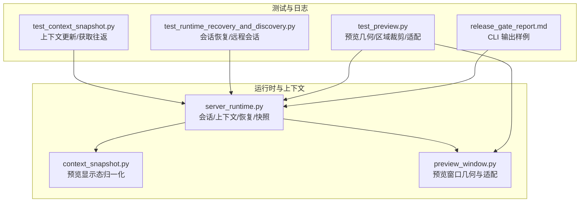
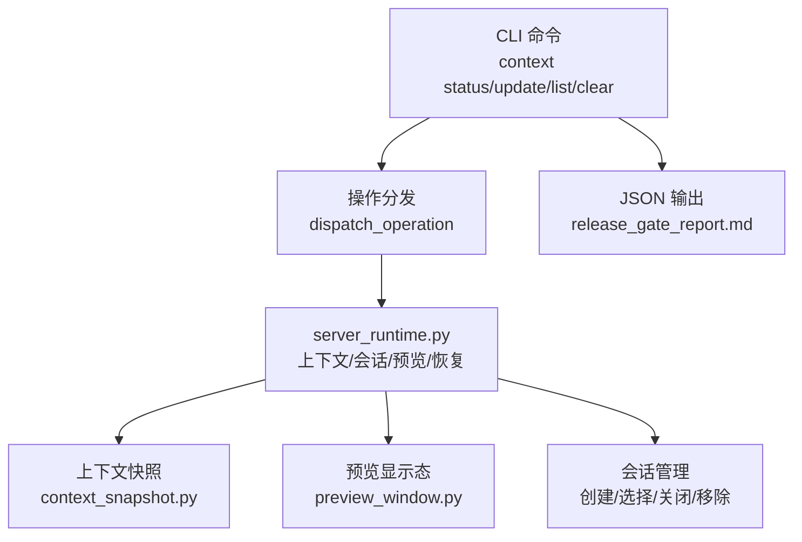
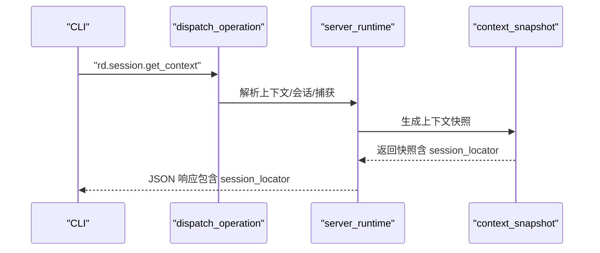
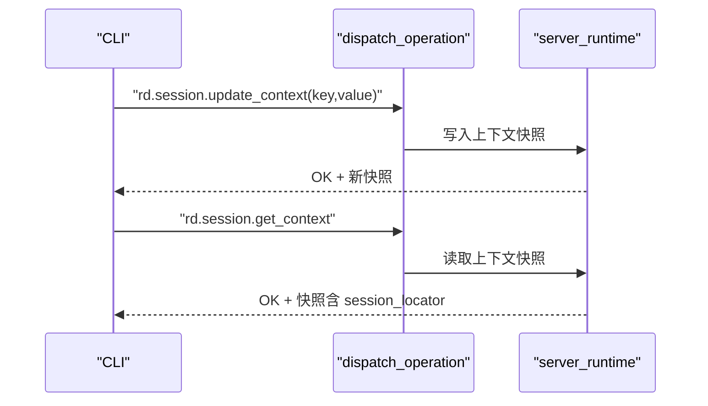
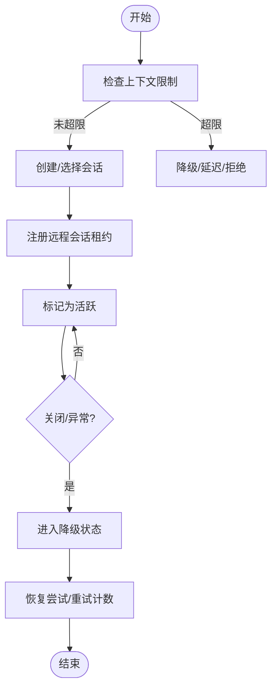
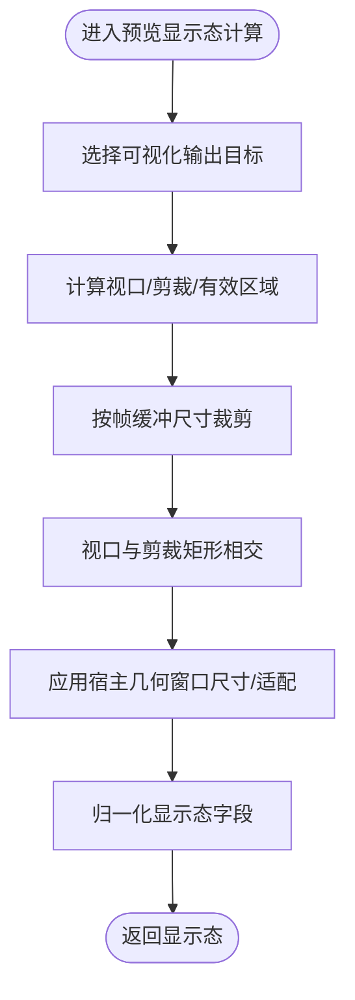
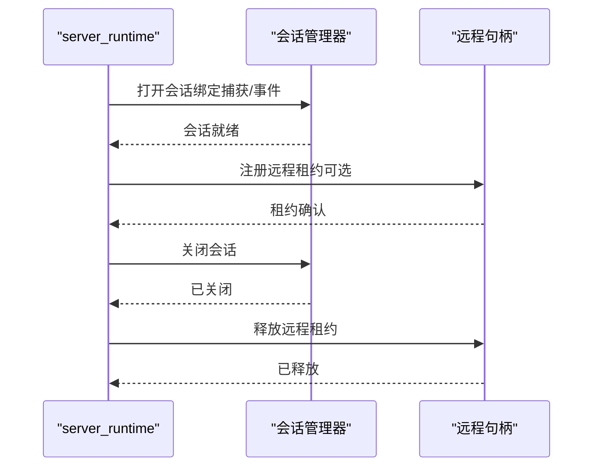
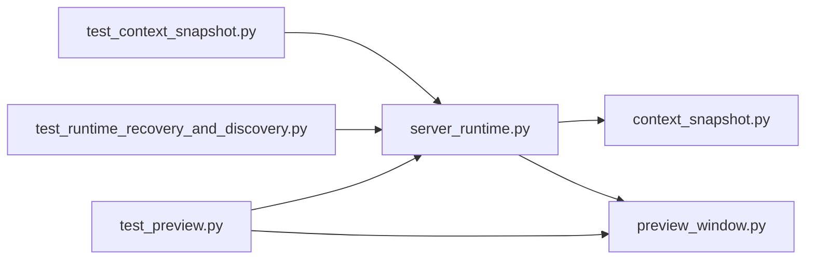

# 会话模型

<cite>
**本文引用的文件**   
- [release_gate_report.md](file://intermediate/logs/release_gate_report.md)
- [server_runtime.py](file://rdx/server_runtime.py)
- [context_snapshot.py](file://rdx/context_snapshot.py)
- [preview_window.py](file://rdx/preview_window.py)
- [test_context_snapshot.py](file://tests/test_context_snapshot.py)
- [test_runtime_recovery_and_discovery.py](file://tests/test_runtime_recovery_and_discovery.py)
- [test_preview.py](file://tests/test_preview.py)
</cite>

## 目录
1. [引言](#引言)
2. [项目结构](#项目结构)
3. [核心组件](#核心组件)
4. [架构总览](#架构总览)
5. [详细组件分析](#详细组件分析)
6. [依赖分析](#依赖分析)
7. [性能考虑](#性能考虑)
8. [故障排查指南](#故障排查指南)
9. [结论](#结论)
10. [附录](#附录)

## 引言
本文件系统化阐述 RDX 会话模型，重点围绕“会话定位器（session_locator）”的概念与组成，解释其与 .active.rdc、会话、帧和事件之间的关联；梳理会话状态查询与更新机制，覆盖 rdx context status 与 rdx context update 的使用；说明多会话并发与隔离策略；详解预览状态管理（预览几何体、视口/剪裁区域、窗口适配）；并给出会话创建、维护与销毁的完整流程。

## 项目结构
与会话模型直接相关的代码主要集中在运行时与上下文快照模块中，测试用例提供了行为验证与边界条件示例。日志报告展示了 CLI 命令与上下文快照的实际输出形态。

**图表来源**
- [server_runtime.py:549-2005](file://rdx/server_runtime.py#L549-L2005)
- [context_snapshot.py:95-123](file://rdx/context_snapshot.py#L95-L123)
- [preview_window.py:282-308](file://rdx/preview_window.py#L282-L308)
- [test_context_snapshot.py:12-32](file://tests/test_context_snapshot.py#L12-L32)
- [test_runtime_recovery_and_discovery.py:340-404](file://tests/test_runtime_recovery_and_discovery.py#L340-L404)
- [test_preview.py:549-587](file://tests/test_preview.py#L549-L587)
- [release_gate_report.md:288-450](file://intermediate/logs/release_gate_report.md#L288-L450)

**章节来源**
- [release_gate_report.md:288-450](file://intermediate/logs/release_gate_report.md#L288-L450)
- [server_runtime.py:549-2005](file://rdx/server_runtime.py#L549-L2005)

## 核心组件
- 会话定位器（session_locator）
  - 定义：用于快速定位当前上下文下“捕获文件路径 + 会话ID + 帧索引 + 活动事件ID”的投影对象。
  - 组成字段：rdc_path、session_id、frame_index、active_event_id。
  - 生成逻辑：在上下文快照构建时，基于当前会话、捕获文件与运行时信息进行投影。
- 上下文快照（Context Snapshot）
  - 包含 runtime、remote、focus、notes、preview、sessions 等字段，以及 session_locator 投影。
  - 提供上下文状态的稳定视图，支持 CLI 查询与更新。
- 预览显示态（Preview Display State）
  - 归一化处理输出槽位、纹理标识与格式、帧缓冲尺寸、视口/剪裁/有效区域矩形、窗口尺寸与适配模式等。
- 运行时会话管理
  - 负责会话生命周期（创建、选择、关闭、移除）、远程会话租约、恢复与降级策略、会话度量与指标同步。

**章节来源**
- [server_runtime.py:6534-6616](file://rdx/server_runtime.py#L6534-L6616)
- [context_snapshot.py:95-123](file://rdx/context_snapshot.py#L95-L123)
- [release_gate_report.md:288-450](file://intermediate/logs/release_gate_report.md#L288-L450)

## 架构总览
会话模型围绕“上下文”组织，每个上下文包含若干会话与捕获文件。CLI 通过操作上下文快照实现状态查询与更新；运行时负责会话生命周期与预览显示态计算。

**图表来源**
- [server_runtime.py:6596-6616](file://rdx/server_runtime.py#L6596-L6616)
- [context_snapshot.py:95-123](file://rdx/context_snapshot.py#L95-L123)
- [preview_window.py:282-308](file://rdx/preview_window.py#L282-L308)
- [release_gate_report.md:288-450](file://intermediate/logs/release_gate_report.md#L288-L450)

## 详细组件分析

### 会话定位器（session_locator）与 .active.rdc 关系
- 定位器由运行时在构建上下文快照时投影生成，包含 rdc_path、session_id、frame_index、active_event_id。
- 当存在当前会话与捕获文件时，定位器字段取自会话记录或运行时 runtime 字段。
- 在 CLI 输出中，session_locator 作为顶层投影字段出现，便于外部工具快速识别当前活动的捕获与事件。

**图表来源**
- [server_runtime.py:6596-6616](file://rdx/server_runtime.py#L6596-L6616)
- [server_runtime.py:6534-6616](file://rdx/server_runtime.py#L6534-L6616)

**章节来源**
- [server_runtime.py:6534-6616](file://rdx/server_runtime.py#L6534-L6616)
- [release_gate_report.md:288-450](file://intermediate/logs/release_gate_report.md#L288-L450)

### 会话状态查询与更新机制
- 查询：rdx context status 返回当前上下文快照，其中包含 session_locator、runtime、preview、sessions、limits、recent_operations 等。
- 更新：rdx context update 支持对上下文元数据（如 notes、focus 等）进行键值更新；测试用例验证了 focus_pixel 的更新与读取往返。
- 字段约束：某些字段（如 session_id）不允许通过上下文更新直接修改，以保证会话一致性。

**图表来源**
- [test_context_snapshot.py:12-32](file://tests/test_context_snapshot.py#L12-L32)
- [release_gate_report.md:486-567](file://intermediate/logs/release_gate_report.md#L486-L567)

**章节来源**
- [test_context_snapshot.py:12-32](file://tests/test_context_snapshot.py#L12-L32)
- [release_gate_report.md:486-567](file://intermediate/logs/release_gate_report.md#L486-L567)

### 多会话并发处理与隔离
- 会话隔离：每个会话绑定到特定捕获文件与事件，运行时维护 sessions 映射与会话度量，确保不同会话间资源不互相污染。
- 并发与租约：远程会话通过租约机制登记到上下文，记录已占用会话列表与首个租约会话；会话关闭或异常时进入降级状态并触发恢复尝试。
- 限制与容量：上下文包含最大会话数、捕获文件数等限制，超出时会话恢复可能被降级或延迟。

**图表来源**
- [server_runtime.py:2624-2643](file://rdx/server_runtime.py#L2624-L2643)
- [server_runtime.py:5570-5637](file://rdx/server_runtime.py#L5570-L5637)
- [server_runtime.py:5494-5517](file://rdx/server_runtime.py#L5494-L5517)

**章节来源**
- [server_runtime.py:2624-2643](file://rdx/server_runtime.py#L2624-L2643)
- [server_runtime.py:5570-5637](file://rdx/server_runtime.py#L5570-L5637)
- [server_runtime.py:5494-5517](file://rdx/server_runtime.py#L5494-L5517)

### 预览状态管理
- 几何体与显示态
  - 输出槽位、纹理标识与格式、帧缓冲尺寸、视口/剪裁/有效区域矩形、窗口尺寸与适配模式均在预览显示态中统一描述。
  - 显示态通过归一化函数确保字段类型与范围一致，避免后续处理出错。
- 视口/剪裁区域与窗口适配
  - 视口与剪裁矩形先按帧缓冲尺寸裁剪，再求交集得到有效区域；窗口尺寸根据屏幕占比进行适配，支持强制刷新几何。
- 测试验证
  - 测试覆盖了区域裁剪与相交、窗口适配比例与居中、默认纹理目标回退等场景。

**图表来源**
- [server_runtime.py:549-2005](file://rdx/server_runtime.py#L549-L2005)
- [context_snapshot.py:95-123](file://rdx/context_snapshot.py#L95-L123)
- [preview_window.py:282-308](file://rdx/preview_window.py#L282-L308)
- [test_preview.py:549-587](file://tests/test_preview.py#L549-L587)

**章节来源**
- [server_runtime.py:549-2005](file://rdx/server_runtime.py#L549-L2005)
- [context_snapshot.py:95-123](file://rdx/context_snapshot.py#L95-L123)
- [preview_window.py:282-308](file://rdx/preview_window.py#L282-L308)
- [test_preview.py:549-587](file://tests/test_preview.py#L549-L587)

### 会话创建、维护与销毁
- 创建与选择
  - 通过上下文状态选择当前会话；若无则可创建新会话并绑定捕获文件与事件。
- 维护
  - 运行时维护会话活跃标志、错误信息与恢复统计；定期同步上下文指标与快照。
- 销毁
  - 关闭会话时清理回放映射与远程租约；异常情况下标记为降级并记录错误，触发恢复流程。

**图表来源**
- [server_runtime.py:2624-2643](file://rdx/server_runtime.py#L2624-L2643)
- [server_runtime.py:5494-5517](file://rdx/server_runtime.py#L5494-L5517)

**章节来源**
- [server_runtime.py:2624-2643](file://rdx/server_runtime.py#L2624-L2643)
- [server_runtime.py:5494-5517](file://rdx/server_runtime.py#L5494-L5517)

## 依赖分析
- 运行时模块依赖上下文快照模块生成稳定的上下文视图；预览模块依赖运行时提供的显示态与宿主几何接口。
- 测试用例覆盖上下文更新/获取往返、远程会话恢复、预览几何计算等关键路径，确保行为正确性与边界处理。

**图表来源**
- [server_runtime.py:549-2005](file://rdx/server_runtime.py#L549-L2005)
- [context_snapshot.py:95-123](file://rdx/context_snapshot.py#L95-L123)
- [preview_window.py:282-308](file://rdx/preview_window.py#L282-L308)
- [test_context_snapshot.py:12-32](file://tests/test_context_snapshot.py#L12-L32)
- [test_runtime_recovery_and_discovery.py:340-404](file://tests/test_runtime_recovery_and_discovery.py#L340-L404)
- [test_preview.py:549-587](file://tests/test_preview.py#L549-L587)

**章节来源**
- [server_runtime.py:549-2005](file://rdx/server_runtime.py#L549-L2005)
- [context_snapshot.py:95-123](file://rdx/context_snapshot.py#L95-L123)
- [preview_window.py:282-308](file://rdx/preview_window.py#L282-L308)
- [test_context_snapshot.py:12-32](file://tests/test_context_snapshot.py#L12-L32)
- [test_runtime_recovery_and_discovery.py:340-404](file://tests/test_runtime_recovery_and_discovery.py#L340-L404)
- [test_preview.py:549-587](file://tests/test_preview.py#L549-L587)

## 性能考虑
- 预览显示态计算涉及多次矩形裁剪与相交，建议在事件变更频率较高时启用“强制几何”开关以减少重复计算。
- 远程会话租约与恢复流程可能引入额外开销，应结合上下文限制与会话数量进行容量规划。
- 上下文快照同步与指标更新为后台任务，需关注 I/O 与序列化成本。

## 故障排查指南
- 会话必需错误
  - 若调用需要会话的工具而上下文中无可用 session_id，CLI 将返回“需要会话”的错误提示，需先打开捕获或显式传入会话 ID。
- 远程会话恢复
  - 远程会话恢复可能被延迟或降级，查看 recovery 字段与最近操作列表，确认尝试次数与最后错误。
- 预览显示态异常
  - 检查视口/剪裁/有效区域是否为空或无效，确认帧缓冲尺寸与窗口适配参数；必要时强制刷新几何。

**章节来源**
- [release_gate_report.md:685-730](file://intermediate/logs/release_gate_report.md#L685-L730)
- [server_runtime.py:5570-5637](file://rdx/server_runtime.py#L5570-L5637)
- [test_preview.py:549-587](file://tests/test_preview.py#L549-L587)

## 结论
会话模型通过“上下文 + 会话 + 捕获文件 + 事件”的组合实现了清晰的状态管理与稳定的 CLI 接口。session_locator 为外部工具提供了快速定位能力；运行时负责会话生命周期、远程租约与恢复；预览显示态在几何与适配上提供了可配置的策略。配合测试用例与日志输出，整体具备良好的可维护性与可观测性。

## 附录
- 常用 CLI 命令
  - 查询上下文：rdx context status --json
  - 更新上下文：rdx context update --key <k> --value <v> --json
  - 列举上下文：rdx context list --json
  - 清理上下文：rdx context clear --json

**章节来源**
- [release_gate_report.md:288-450](file://intermediate/logs/release_gate_report.md#L288-L450)
- [release_gate_report.md:486-567](file://intermediate/logs/release_gate_report.md#L486-L567)
- [release_gate_report.md:568-622](file://intermediate/logs/release_gate_report.md#L568-L622)