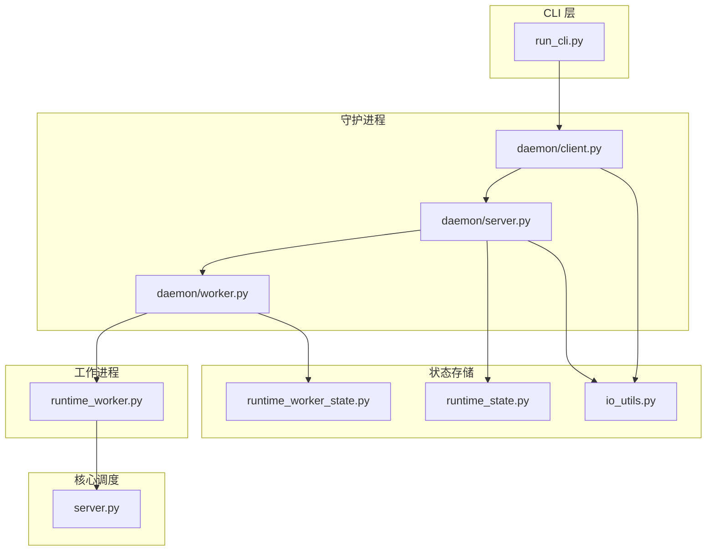
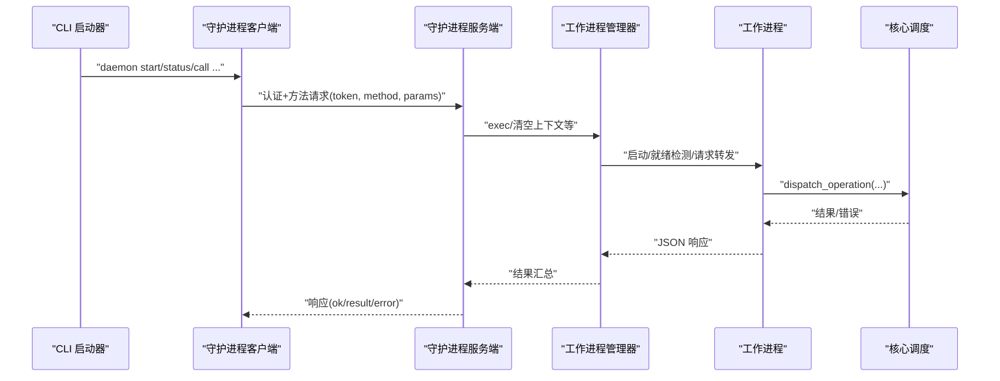
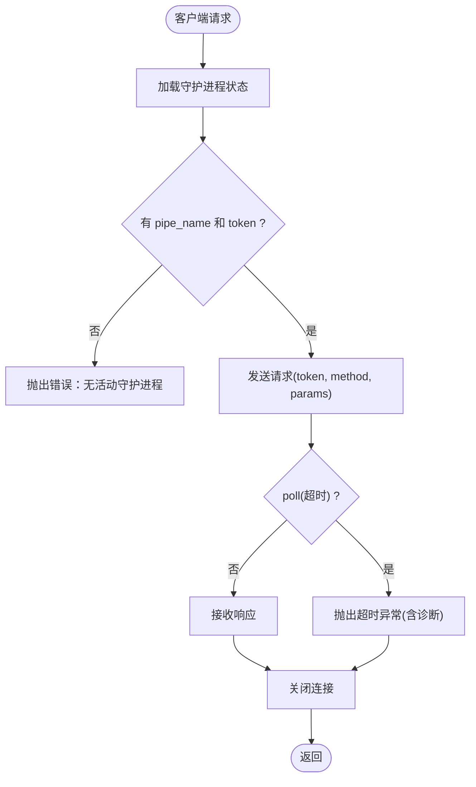
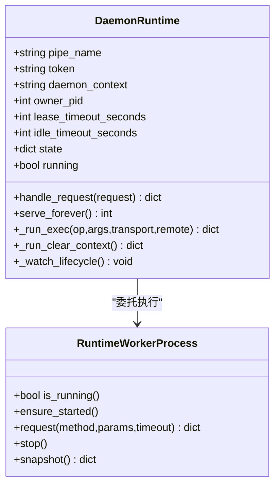
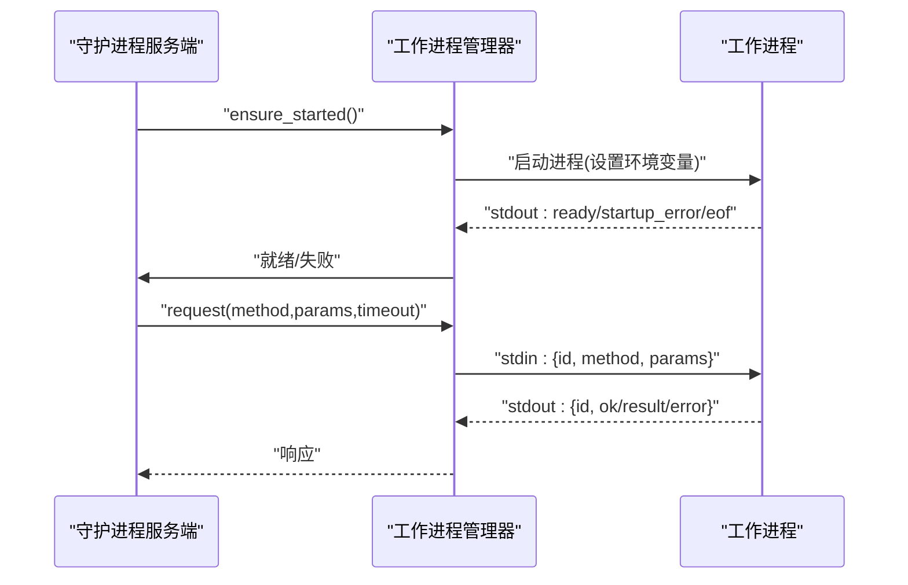
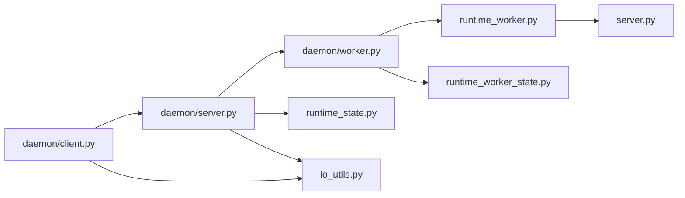

# 守护进程架构

<cite>
**本文引用的文件**
- [rdx/daemon/__init__.py](file://rdx/daemon/__init__.py)
- [rdx/daemon/client.py](file://rdx/daemon/client.py)
- [rdx/daemon/server.py](file://rdx/daemon/server.py)
- [rdx/daemon/worker.py](file://rdx/daemon/worker.py)
- [rdx/runtime_worker.py](file://rdx/runtime_worker.py)
- [rdx/runtime_worker_state.py](file://rdx/runtime_worker_state.py)
- [rdx/runtime_state.py](file://rdx/runtime_state.py)
- [rdx/io_utils.py](file://rdx/io_utils.py)
- [rdx/server.py](file://rdx/server.py)
- [cli/run_cli.py](file://cli/run_cli.py)
</cite>

## 目录
1. [引言](#引言)
2. [项目结构](#项目结构)
3. [核心组件](#核心组件)
4. [架构总览](#架构总览)
5. [详细组件分析](#详细组件分析)
6. [依赖分析](#依赖分析)
7. [性能考量](#性能考量)
8. [故障排查指南](#故障排查指南)
9. [结论](#结论)
10. [附录](#附录)

## 引言
本文件系统化阐述守护进程架构的设计与实现，覆盖启动、运行、停止机制；守护进程客户端与服务器之间的通信协议与数据交换格式；工作进程的调度与任务分配；健康检查、故障恢复与自动重启策略；命名管道通信的实现细节与性能优化；以及配置、监控与调试的实用指南。该架构以 Windows 命名管道为 IPC 通道，结合守护进程与工作进程的分层设计，实现渲染相关运行时能力的稳定交付。

## 项目结构
- 守护进程子系统位于 rdx/daemon，包含客户端工具、服务端运行时与工作进程管理器。
- 工作进程入口位于 rdx/runtime_worker，负责执行具体操作并将结果通过标准输出 JSON 行回传。
- 运行时状态持久化位于 rdx/runtime_state 与 rdx/runtime_worker_state，分别维护上下文会话状态与工作进程状态。
- IO 工具位于 rdx/io_utils，提供原子写入与安全 JSON 序列化等能力。
- CLI 启动器位于 cli/run_cli.py，负责环境初始化与命令分发。
- 核心运行时调度位于 rdx/server.py，封装操作分发与进度上报。

图表来源
- [rdx/daemon/client.py:1-833](file://rdx/daemon/client.py#L1-L833)
- [rdx/daemon/server.py:1-690](file://rdx/daemon/server.py#L1-L690)
- [rdx/daemon/worker.py:1-202](file://rdx/daemon/worker.py#L1-L202)
- [rdx/runtime_worker.py:1-119](file://rdx/runtime_worker.py#L1-L119)
- [rdx/runtime_state.py:1-500](file://rdx/runtime_state.py#L1-L500)
- [rdx/runtime_worker_state.py:1-56](file://rdx/runtime_worker_state.py#L1-L56)
- [rdx/io_utils.py:1-161](file://rdx/io_utils.py#L1-L161)
- [rdx/server.py:1-148](file://rdx/server.py#L1-L148)
- [cli/run_cli.py:1-290](file://cli/run_cli.py#L1-L290)

章节来源
- [rdx/daemon/__init__.py:1-3](file://rdx/daemon/__init__.py#L1-L3)
- [rdx/daemon/client.py:1-833](file://rdx/daemon/client.py#L1-L833)
- [rdx/daemon/server.py:1-690](file://rdx/daemon/server.py#L1-L690)
- [rdx/daemon/worker.py:1-202](file://rdx/daemon/worker.py#L1-L202)
- [rdx/runtime_worker.py:1-119](file://rdx/runtime_worker.py#L1-L119)
- [rdx/runtime_state.py:1-500](file://rdx/runtime_state.py#L1-L500)
- [rdx/runtime_worker_state.py:1-56](file://rdx/runtime_worker_state.py#L1-L56)
- [rdx/io_utils.py:1-161](file://rdx/io_utils.py#L1-L161)
- [rdx/server.py:1-148](file://rdx/server.py#L1-L148)
- [cli/run_cli.py:1-290](file://cli/run_cli.py#L1-L290)

## 核心组件
- 守护进程客户端（daemon/client.py）
  - 提供守护进程生命周期管理：启动、就绪等待、状态清理与回收。
  - 提供与守护进程交互的方法：attach_client、heartbeat、detach_client、clear_context 等。
  - 使用 Windows 命名管道进行请求/响应通信，携带认证令牌与方法参数。
- 守护进程服务端（daemon/server.py）
  - 基于命名管道监听连接，处理客户端请求并维护内部状态。
  - 维护“附加客户端”列表、活动计数、最后活跃时间、租约与空闲超时。
  - 调度到工作进程执行具体操作，并将结果返回给客户端。
- 工作进程管理器（daemon/worker.py）
  - 管理工作进程生命周期：启动、就绪检测、请求转发、超时与异常处理。
  - 通过标准输入发送 JSON 请求，从标准输出读取 JSON 响应。
- 工作进程（runtime_worker.py）
  - 接收来自守护进程的工作进程请求，调用核心调度器执行操作。
  - 发送就绪消息、状态查询与关闭指令，保证进程间协议一致性。
- 状态持久化（runtime_state.py、runtime_worker_state.py、io_utils.py）
  - 上下文状态与日志的原子写入与并发锁保护。
  - 工作进程状态的持久化与清理。
- 核心调度（server.py）
  - 将操作分发至核心引擎，记录操作开始/结束与进度事件。
- CLI 启动器（cli/run_cli.py）
  - 初始化工具根目录、运行时目录与环境变量，加载依赖并分发命令。

章节来源
- [rdx/daemon/client.py:420-833](file://rdx/daemon/client.py#L420-L833)
- [rdx/daemon/server.py:101-690](file://rdx/daemon/server.py#L101-L690)
- [rdx/daemon/worker.py:24-202](file://rdx/daemon/worker.py#L24-L202)
- [rdx/runtime_worker.py:30-119](file://rdx/runtime_worker.py#L30-L119)
- [rdx/runtime_state.py:1-500](file://rdx/runtime_state.py#L1-L500)
- [rdx/runtime_worker_state.py:1-56](file://rdx/runtime_worker_state.py#L1-L56)
- [rdx/io_utils.py:1-161](file://rdx/io_utils.py#L1-L161)
- [rdx/server.py:60-148](file://rdx/server.py#L60-L148)
- [cli/run_cli.py:225-290](file://cli/run_cli.py#L225-L290)

## 架构总览
守护进程采用“单守护多工作”的模式：CLI 通过客户端确保守护进程可用并发起请求；守护进程验证令牌后根据方法路由到相应处理逻辑；对于需要执行的操作，守护进程委托工作进程完成实际任务；工作进程通过标准输入输出与守护进程通信；所有状态通过原子写入持久化到本地文件，支持跨进程可见与恢复。

图表来源
- [rdx/daemon/client.py:420-833](file://rdx/daemon/client.py#L420-L833)
- [rdx/daemon/server.py:537-606](file://rdx/daemon/server.py#L537-L606)
- [rdx/daemon/worker.py:143-169](file://rdx/daemon/worker.py#L143-L169)
- [rdx/runtime_worker.py:68-114](file://rdx/runtime_worker.py#L68-L114)
- [rdx/server.py:60-148](file://rdx/server.py#L60-L148)

## 详细组件分析

### 守护进程客户端（daemon/client.py）
- 关键职责
  - 确保守护进程存在且可访问，必要时启动新实例。
  - 通过命名管道向守护进程发送请求，等待响应或超时。
  - 维护会话与状态文件，清理过期状态与孤儿进程。
- 通信协议要点
  - 地址格式：\\.\pipe\<pipe_name>
  - 请求格式：{"token": "...", "method": "...", "params": {...}}
  - 响应格式：{"ok": true/false, "result": {...} 或 "error": {"message": "..."}}
  - 认证：每次请求必须携带正确 token，否则返回未授权错误。
- 超时与重试
  - 请求超时抛出特定异常，包含诊断信息（如活动请求数、当前操作摘要）。
  - 启动阶段轮询 ping，指数退避延迟，最终失败则清理并终止。
- 生命周期管理
  - 清理过期守护进程状态：依据进程存活、最后活跃时间、租约与空闲超时判断。
  - 支持显式 shutdown 并等待退出，必要时强制终止。

图表来源
- [rdx/daemon/client.py:420-468](file://rdx/daemon/client.py#L420-L468)

章节来源
- [rdx/daemon/client.py:118-146](file://rdx/daemon/client.py#L118-L146)
- [rdx/daemon/client.py:420-468](file://rdx/daemon/client.py#L420-L468)
- [rdx/daemon/client.py:576-674](file://rdx/daemon/client.py#L576-L674)
- [rdx/daemon/client.py:507-559](file://rdx/daemon/client.py#L507-L559)

### 守护进程服务端（daemon/server.py）
- 关键职责
  - 监听命名管道，接受连接并处理请求。
  - 维护守护进程内部状态（上下文、会话、捕获、活动计数、租约、空闲超时）。
  - 调度到工作进程执行操作，聚合结果并返回。
- 方法路由
  - 健康检查：ping、status、shutdown
  - 客户端生命周期：attach_client、heartbeat、detach_client
  - 上下文管理：set_state、get_state、clear_context
  - 操作执行：exec（转交工作进程）
- 状态持久化与清理
  - 每次状态变更后持久化到文件，支持跨进程可见。
  - 生命周期监控线程定期检查是否应停止（租约过期或空闲超时）。
- 进度与活动追踪
  - 通过 ProgressSink 接口更新活动操作元数据（trace_id、stage、message、progress_pct）。

图表来源
- [rdx/daemon/server.py:101-690](file://rdx/daemon/server.py#L101-L690)
- [rdx/daemon/worker.py:24-202](file://rdx/daemon/worker.py#L24-L202)

章节来源
- [rdx/daemon/server.py:101-690](file://rdx/daemon/server.py#L101-L690)

### 工作进程管理器（daemon/worker.py）
- 关键职责
  - 启动工作进程，读取其标准输出的 JSON 行作为事件/响应。
  - 维护请求序列号，匹配响应与请求 ID。
  - 超时与异常处理：超时抛错、进程提前退出报错。
- 启动与就绪
  - 设置运行时环境变量（上下文 ID、二进制目录、模块目录、清单路径），创建子进程。
  - 等待工作进程发出就绪信号，否则判定启动失败。
- 请求/响应模型
  - 通过 stdin 写入 JSON 行，通过 stdout 阻塞读取 JSON 行。
  - 对每个请求生成唯一 ID，等待对应响应，忽略无关事件。

图表来源
- [rdx/daemon/worker.py:69-169](file://rdx/daemon/worker.py#L69-L169)
- [rdx/runtime_worker.py:54-114](file://rdx/runtime_worker.py#L54-L114)

章节来源
- [rdx/daemon/worker.py:24-202](file://rdx/daemon/worker.py#L24-L202)

### 工作进程（runtime_worker.py）
- 关键职责
  - 解析标准输入的 JSON 请求，识别方法与参数。
  - 调用核心调度器执行操作（exec、clear_context、status、shutdown）。
  - 将结果以 JSON 行形式回传，保持与守护进程一致的协议。
- 协议要点
  - 就绪消息：{"kind": "ready", ...}
  - 错误消息：{"kind": "startup_error", "message": "..."}
  - 响应消息：{"id": "...", "ok": true/false, "result/error": {...}}

章节来源
- [rdx/runtime_worker.py:30-119](file://rdx/runtime_worker.py#L30-L119)

### 状态持久化与 IO 工具（runtime_state.py、runtime_worker_state.py、io_utils.py）
- 原子写入与并发控制
  - 使用临时文件 + 原子替换，避免部分写入导致的数据损坏。
  - Windows 文件锁（msvcrt.locking）保障同一上下文的状态文件互斥访问。
- 上下文状态
  - 维护会话、捕获、预览、指标、最近操作等字段，支持规范化与裁剪。
- 工作进程状态
  - 记录运行状态、PID、二进制与模块目录、源清单路径等。

章节来源
- [rdx/runtime_state.py:63-76](file://rdx/runtime_state.py#L63-L76)
- [rdx/runtime_state.py:392-416](file://rdx/runtime_state.py#L392-L416)
- [rdx/runtime_worker_state.py:35-56](file://rdx/runtime_worker_state.py#L35-L56)
- [rdx/io_utils.py:67-146](file://rdx/io_utils.py#L67-L146)

### 核心调度（server.py）
- 关键职责
  - 构建核心引擎与操作注册表，执行操作并产出结果。
  - 记录操作开始/结束、进度上报与上下文快照同步。
- 与守护进程协作
  - 由守护进程/工作进程调用，执行具体业务逻辑。

章节来源
- [rdx/server.py:60-148](file://rdx/server.py#L60-L148)

### CLI 启动器（cli/run_cli.py）
- 关键职责
  - 初始化工具根目录与运行时目录，注入环境变量。
  - 校验依赖，打印版本与诊断信息，分发命令到主 CLI。
- 与守护进程交互
  - 通过守护进程客户端发起守护进程管理与操作调用。

章节来源
- [cli/run_cli.py:225-290](file://cli/run_cli.py#L225-L290)

## 依赖分析
- 组件耦合
  - 守护进程服务端依赖工作进程管理器与状态持久化模块。
  - 工作进程管理器依赖工作进程与 IO 工具。
  - 客户端依赖服务端暴露的命名管道接口与状态文件。
  - 核心调度被工作进程调用，不直接依赖守护进程。
- 外部依赖
  - multiprocessing.connection（AF_PIPE）、subprocess、ctypes（Windows 进程查询）、logging、argparse 等。

图表来源
- [rdx/daemon/client.py:1-833](file://rdx/daemon/client.py#L1-L833)
- [rdx/daemon/server.py:1-690](file://rdx/daemon/server.py#L1-L690)
- [rdx/daemon/worker.py:1-202](file://rdx/daemon/worker.py#L1-L202)
- [rdx/runtime_worker.py:1-119](file://rdx/runtime_worker.py#L1-L119)
- [rdx/runtime_state.py:1-500](file://rdx/runtime_state.py#L1-L500)
- [rdx/runtime_worker_state.py:1-56](file://rdx/runtime_worker_state.py#L1-L56)
- [rdx/io_utils.py:1-161](file://rdx/io_utils.py#L1-L161)
- [rdx/server.py:1-148](file://rdx/server.py#L1-L148)

章节来源
- [rdx/daemon/client.py:1-833](file://rdx/daemon/client.py#L1-L833)
- [rdx/daemon/server.py:1-690](file://rdx/daemon/server.py#L1-L690)
- [rdx/daemon/worker.py:1-202](file://rdx/daemon/worker.py#L1-L202)
- [rdx/runtime_worker.py:1-119](file://rdx/runtime_worker.py#L1-L119)
- [rdx/runtime_state.py:1-500](file://rdx/runtime_state.py#L1-L500)
- [rdx/runtime_worker_state.py:1-56](file://rdx/runtime_worker_state.py#L1-L56)
- [rdx/io_utils.py:1-161](file://rdx/io_utils.py#L1-L161)
- [rdx/server.py:1-148](file://rdx/server.py#L1-L148)

## 性能考量
- 命名管道与阻塞 I/O
  - 使用 AF_PIPE 的 Listener/Client 实现低开销的本地 IPC；注意在高并发场景下连接线程池与队列容量。
- 原子写入与文件锁
  - 上下文状态文件采用原子替换与文件锁，避免频繁写入造成的竞争；建议批量合并状态更新。
- 工作进程复用
  - 通过工作进程管理器复用已启动的子进程，减少启动开销；就绪检测失败时进行重启。
- 超时与背压
  - 客户端与工作进程均设置合理超时；当工作进程长时间无响应时，触发重启以恢复。
- 日志与诊断
  - 使用 JSONL 日志便于流式解析与聚合；避免在热路径中产生大量高频日志。

[本节为通用性能指导，无需列出章节来源]

## 故障排查指南
- 常见问题与定位
  - 无法连接守护进程：检查 pipe_name 与 token 是否正确；确认守护进程进程存在且未被占用。
  - 请求超时：查看诊断信息（活动请求数、当前操作摘要、最后活跃时间）；检查工作进程是否卡住。
  - 租约过期/空闲超时：确认客户端心跳是否按时发送；调整租约与空闲超时参数。
  - 启动失败：查看工作进程就绪消息；关注 startup_error；检查运行时目录与环境变量。
- 清理与恢复
  - 使用清理函数移除过期状态文件与孤儿进程；必要时强制终止 PID。
  - 清空上下文：通过 clear_context 触发工作进程内核心关闭流程。
- 调试建议
  - 提升日志级别，观察守护进程与工作进程的请求/响应日志。
  - 使用状态文件与日志文件定位问题节点（最后活跃时间、最近操作、错误信息）。

章节来源
- [rdx/daemon/client.py:420-468](file://rdx/daemon/client.py#L420-L468)
- [rdx/daemon/server.py:507-535](file://rdx/daemon/server.py#L507-L535)
- [rdx/daemon/worker.py:120-135](file://rdx/daemon/worker.py#L120-L135)
- [rdx/runtime_worker.py:43-51](file://rdx/runtime_worker.py#L43-L51)

## 结论
该守护进程架构通过清晰的职责分离与严格的 IPC 协议，实现了稳定的渲染运行时能力交付。客户端负责生命周期与请求编排，服务端负责状态管理与调度，工作进程负责具体操作执行。配合原子写入与文件锁，系统具备良好的可靠性与可观测性。通过合理的超时、租约与空闲策略，系统能够自动恢复与自愈，满足生产环境的稳定性要求。

[本节为总结性内容，无需列出章节来源]

## 附录

### 通信协议与数据交换格式
- 命名管道地址
  - 格式：\\.\pipe\<pipe_name>
- 请求格式
  - {"token": "...", "method": "...", "params": {...}}
- 响应格式
  - {"ok": true/false, "result": {...} 或 "error": {"message": "..."}}
- 工作进程就绪/错误
  - {"kind": "ready", ...} 或 {"kind": "startup_error", "message": "..."}
- 工作进程响应
  - {"id": "...", "ok": true/false, "result/error": {...}}

章节来源
- [rdx/daemon/client.py:420-468](file://rdx/daemon/client.py#L420-L468)
- [rdx/daemon/server.py:537-606](file://rdx/daemon/server.py#L537-L606)
- [rdx/runtime_worker.py:43-114](file://rdx/runtime_worker.py#L43-L114)

### 配置与运行参数
- 守护进程启动参数
  - --pipe-name：命名管道名称（不含前缀）
  - --token：认证令牌
  - --daemon-context：上下文 ID
  - --owner-pid：拥有者进程 PID（用于租约判断）
  - --lease-timeout-seconds：租约超时秒数
  - --idle-timeout-seconds：空闲超时秒数
- 工作进程启动参数
  - --context-id：上下文 ID

章节来源
- [rdx/daemon/server.py:655-685](file://rdx/daemon/server.py#L655-L685)
- [rdx/runtime_worker.py:31-33](file://rdx/runtime_worker.py#L31-L33)