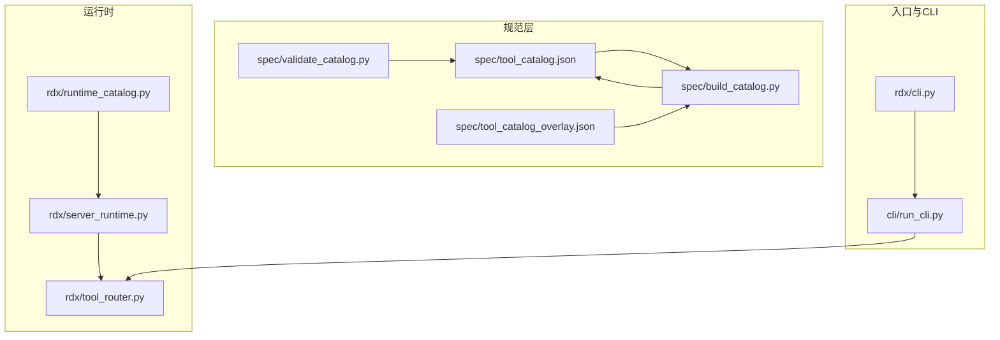
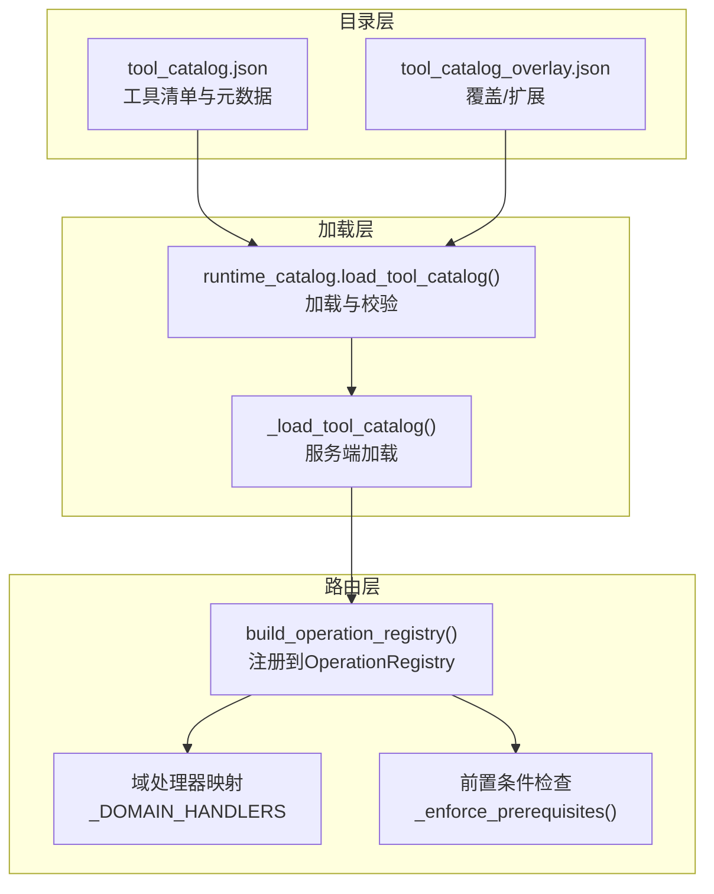
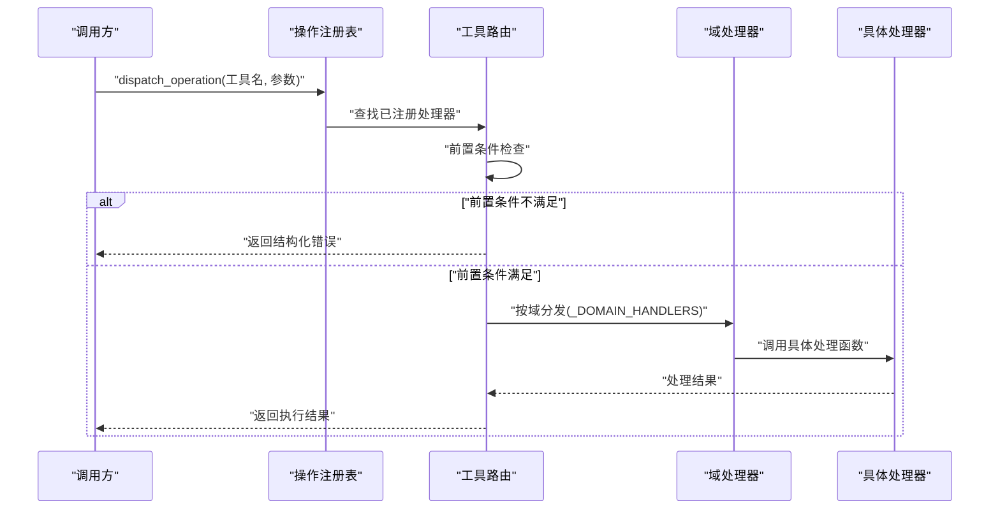
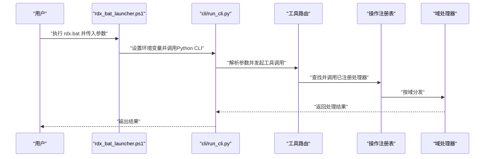
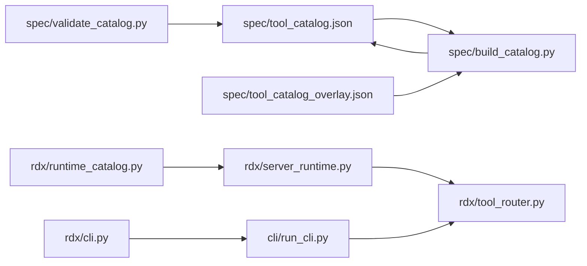

# 工具路由系统

<cite>
**本文引用的文件**
- [rdx/tool_router.py](file://rdx/tool_router.py)
- [rdx/server_runtime.py](file://rdx/server_runtime.py)
- [rdx/runtime_catalog.py](file://rdx/runtime_catalog.py)
- [spec/tool_catalog.json](file://spec/tool_catalog.json)
- [spec/tool_catalog_overlay.json](file://spec/tool_catalog_overlay.json)
- [spec/build_catalog.py](file://spec/build_catalog.py)
- [spec/validate_catalog.py](file://spec/validate_catalog.py)
- [rdx/cli.py](file://rdx/cli.py)
- [cli/run_cli.py](file://cli/run_cli.py)
- [tests/test_runtime_recovery_and_discovery.py](file://tests/test_runtime_recovery_and_discovery.py)
</cite>

## 目录
1. [简介](#简介)
2. [项目结构](#项目结构)
3. [核心组件](#核心组件)
4. [架构总览](#架构总览)
5. [详细组件分析](#详细组件分析)
6. [依赖关系分析](#依赖关系分析)
7. [性能考虑](#性能考虑)
8. [故障排查指南](#故障排查指南)
9. [结论](#结论)
10. [附录](#附录)

## 简介
本文件系统性阐述工具路由系统的设计与实现，覆盖动态工具发现、工具注册表、工具目录与配置、工具执行流程、扩展与自定义开发指南、性能优化与错误处理策略，以及与核心引擎的集成模式。目标是帮助开发者快速理解并高效扩展工具生态。

## 项目结构
工具路由系统围绕“工具目录（tool_catalog.json）+ 动态注册表（OperationRegistry）+ 域处理器（domain handlers）”三要素构建，配合运行时加载与校验脚本，形成可演进、可验证、可扩展的工具生态。

图表来源
- [spec/tool_catalog.json](file://spec/tool_catalog.json)
- [spec/tool_catalog_overlay.json](file://spec/tool_catalog_overlay.json)
- [spec/build_catalog.py](file://spec/build_catalog.py)
- [spec/validate_catalog.py](file://spec/validate_catalog.py)
- [rdx/runtime_catalog.py](file://rdx/runtime_catalog.py)
- [rdx/server_runtime.py](file://rdx/server_runtime.py)
- [rdx/tool_router.py](file://rdx/tool_router.py)
- [rdx/cli.py](file://rdx/cli.py)
- [cli/run_cli.py](file://cli/run_cli.py)

章节来源
- [spec/tool_catalog.json](file://spec/tool_catalog.json)
- [spec/tool_catalog_overlay.json](file://spec/tool_catalog_overlay.json)
- [spec/build_catalog.py](file://spec/build_catalog.py)
- [spec/validate_catalog.py](file://spec/validate_catalog.py)
- [rdx/runtime_catalog.py](file://rdx/runtime_catalog.py)
- [rdx/server_runtime.py](file://rdx/server_runtime.py)
- [rdx/tool_router.py](file://rdx/tool_router.py)
- [rdx/cli.py](file://rdx/cli.py)
- [cli/run_cli.py](file://cli/run_cli.py)

## 核心组件
- 工具目录与校验：通过 JSON 规范描述工具清单、参数、能力等元数据；构建脚本生成最终目录；校验脚本确保一致性与完整性。
- 运行时目录加载：在运行时定位工具根目录下的工具目录文件，加载并进行基础校验（数量一致性、名称唯一性、命名前缀合法性）。
- 工具注册表：将工具名映射为异步处理器，统一注册到操作注册表中，支持按域分发。
- 域处理器：根据工具所属域（如 util、vfs 等）将操作路由到对应处理模块。
- CLI 与启动：命令行解析与参数注入，驱动工具执行链路。

章节来源
- [rdx/runtime_catalog.py](file://rdx/runtime_catalog.py)
- [rdx/server_runtime.py](file://rdx/server_runtime.py)
- [rdx/tool_router.py](file://rdx/tool_router.py)
- [spec/tool_catalog.json](file://spec/tool_catalog.json)
- [spec/validate_catalog.py](file://spec/validate_catalog.py)

## 架构总览
工具路由系统采用“目录驱动 + 注册表 + 域分发”的三层架构：
- 目录层：以 JSON 描述工具元数据，包含工具名、参数、能力、前置条件、宏展开等。
- 加载层：运行时加载目录，构建索引与校验，暴露给上层查询与注册。
- 路由层：将工具名映射到异步处理器，按域分发至具体处理模块，执行前进行前置条件检查。

图表来源
- [spec/tool_catalog.json](file://spec/tool_catalog.json)
- [spec/tool_catalog_overlay.json](file://spec/tool_catalog_overlay.json)
- [rdx/runtime_catalog.py](file://rdx/runtime_catalog.py)
- [rdx/server_runtime.py](file://rdx/server_runtime.py)
- [rdx/tool_router.py](file://rdx/tool_router.py)

## 详细组件分析

### 工具目录与配置格式
- 目录文件：工具清单集中于 JSON 文件，包含工具条目数组与声明计数字段，用于一致性校验。
- 覆盖文件：允许对默认目录进行叠加或扩展，便于环境差异化定制。
- 构建脚本：负责读取源、合并覆盖、生成最终目录并输出统计信息。
- 校验脚本：对目录进行完整性与一致性检查，包括名称唯一性、计数匹配、投影参数约束等。

章节来源
- [spec/tool_catalog.json](file://spec/tool_catalog.json)
- [spec/tool_catalog_overlay.json](file://spec/tool_catalog_overlay.json)
- [spec/build_catalog.py](file://spec/build_catalog.py)
- [spec/validate_catalog.py](file://spec/validate_catalog.py)

### 运行时目录加载与校验
- 路径定位：通过运行时路径工具定位工具根目录下的目录文件。
- 加载逻辑：读取 JSON，提取工具列表与声明计数，进行数量一致性校验。
- 唯一性与前缀校验：确保工具名唯一且符合命名规范（例如 rd. 前缀）。
- 服务端加载：服务端同样提供加载函数，供内部操作使用。

章节来源
- [rdx/runtime_catalog.py](file://rdx/runtime_catalog.py)
- [rdx/server_runtime.py](file://rdx/server_runtime.py)

### 工具注册表与域处理器
- 注册表构建：遍历目录中的工具，过滤合法命名后，注册到操作注册表；每个工具生成一个异步处理器。
- 域分发：根据工具名的域部分选择对应的域处理器；若无域处理器则跳过。
- 处理器行为：在调用域处理器前执行前置条件检查，失败则返回结构化错误；成功则透传参数与环境变量。

图表来源
- [rdx/tool_router.py](file://rdx/tool_router.py)

章节来源
- [rdx/tool_router.py](file://rdx/tool_router.py)

### 工具执行流程（从命令解析到处理器调用）
- CLI 解析：从命令行中抽取 JSON 参数片段，构造标准输入/参数传递给运行时。
- 启动流程：Windows 批处理脚本设置环境变量并调用 Python CLI 入口。
- 路由触发：CLI 将请求交由工具路由系统，经注册表与域处理器完成实际调用。
- 结果回传：处理器返回结果，CLI 或服务端进行后续处理。

图表来源
- [cli/run_cli.py](file://cli/run_cli.py)
- [rdx/cli.py](file://rdx/cli.py)
- [rdx/tool_router.py](file://rdx/tool_router.py)

章节来源
- [rdx/cli.py](file://rdx/cli.py)
- [cli/run_cli.py](file://cli/run_cli.py)
- [rdx/tool_router.py](file://rdx/tool_router.py)

### 工具扩展与自定义开发指南
- 新增工具步骤
  - 在目录中新增工具条目，确保工具名符合命名规范并唯一。
  - 如需覆盖默认行为，使用覆盖文件进行扩展。
  - 使用构建脚本生成最终目录，再用校验脚本进行验证。
- 域处理器扩展
  - 在路由层维护域处理器映射，新增域时添加对应处理器。
  - 对应处理模块需提供统一的处理接口，以便被路由层调用。
- 前置条件与宏展开
  - 在目录中声明前置条件与宏展开关系，路由层会自动进行图边构建与检查。
- 测试与回归
  - 使用测试用例验证工具发现、过滤与执行流程，确保扩展不影响现有功能。

章节来源
- [spec/tool_catalog.json](file://spec/tool_catalog.json)
- [spec/tool_catalog_overlay.json](file://spec/tool_catalog_overlay.json)
- [spec/build_catalog.py](file://spec/build_catalog.py)
- [spec/validate_catalog.py](file://spec/validate_catalog.py)
- [rdx/tool_router.py](file://rdx/tool_router.py)
- [tests/test_runtime_recovery_and_discovery.py](file://tests/test_runtime_recovery_and_discovery.py)

### 工具路由的性能优化与错误处理策略
- 性能优化
  - 目录缓存：在进程内缓存已加载的目录与索引，避免重复 IO。
  - 注册表预热：在服务启动阶段完成注册，减少首次调用延迟。
  - 异步化：处理器均为异步实现，充分利用事件循环提升并发吞吐。
  - 前置条件短路：在进入域处理器前尽早失败，减少无效调用。
- 错误处理
  - 结构化错误：前置条件缺失时返回包含错误码、原因与建议的结构化对象。
  - 一致性校验：目录加载阶段即进行严格校验，提前暴露问题。
  - 可观测性：服务端提供工具列表与搜索接口，便于诊断与排障。

章节来源
- [rdx/tool_router.py](file://rdx/tool_router.py)
- [rdx/runtime_catalog.py](file://rdx/runtime_catalog.py)
- [rdx/server_runtime.py](file://rdx/server_runtime.py)

### 与核心引擎的集成模式
- 操作注册：工具路由将工具注册为核心引擎的操作，统一调度与执行。
- 查询与发现：服务端提供工具列表与搜索接口，支持按命名空间、组、能力等维度筛选。
- 宏与依赖：通过目录中的宏展开与前置条件边构建，形成工具依赖图，便于可视化与治理。

章节来源
- [rdx/server_runtime.py](file://rdx/server_runtime.py)
- [tests/test_runtime_recovery_and_discovery.py](file://tests/test_runtime_recovery_and_discovery.py)

## 依赖关系分析
工具路由系统的关键依赖关系如下：

图表来源
- [spec/tool_catalog.json](file://spec/tool_catalog.json)
- [spec/tool_catalog_overlay.json](file://spec/tool_catalog_overlay.json)
- [spec/build_catalog.py](file://spec/build_catalog.py)
- [spec/validate_catalog.py](file://spec/validate_catalog.py)
- [rdx/runtime_catalog.py](file://rdx/runtime_catalog.py)
- [rdx/server_runtime.py](file://rdx/server_runtime.py)
- [rdx/tool_router.py](file://rdx/tool_router.py)
- [rdx/cli.py](file://rdx/cli.py)
- [cli/run_cli.py](file://cli/run_cli.py)

章节来源
- [spec/tool_catalog.json](file://spec/tool_catalog.json)
- [spec/tool_catalog_overlay.json](file://spec/tool_catalog_overlay.json)
- [spec/build_catalog.py](file://spec/build_catalog.py)
- [spec/validate_catalog.py](file://spec/validate_catalog.py)
- [rdx/runtime_catalog.py](file://rdx/runtime_catalog.py)
- [rdx/server_runtime.py](file://rdx/server_runtime.py)
- [rdx/tool_router.py](file://rdx/tool_router.py)
- [rdx/cli.py](file://rdx/cli.py)
- [cli/run_cli.py](file://cli/run_cli.py)

## 性能考虑
- 目录加载与缓存：在进程生命周期内缓存目录与索引，避免重复解析与 IO。
- 注册表初始化：在服务启动阶段完成注册，降低首次调用开销。
- 异步执行：利用异步处理器提升并发能力，合理设置超时与队列长度。
- 前置条件短路：尽早失败，减少无效调用链路。
- 目录校验前置：在构建阶段完成严格校验，避免运行期异常。

## 故障排查指南
- 目录一致性问题
  - 现象：工具数量声明与实际条目不一致。
  - 排查：检查目录文件与声明计数，确认构建与校验脚本执行是否正确。
- 工具名冲突或非法
  - 现象：工具名重复或不符合命名规范。
  - 排查：使用校验脚本检查唯一性与前缀合法性。
- 前置条件缺失
  - 现象：工具执行返回缺失前置条件的结构化错误。
  - 排查：查看错误详情中的前置工具列表与原因，按顺序执行前置工具。
- 工具发现与搜索
  - 现象：无法列出或搜索到工具。
  - 排查：使用服务端提供的工具列表与搜索接口，确认命名空间、组、能力等过滤条件。

章节来源
- [rdx/tool_router.py](file://rdx/tool_router.py)
- [rdx/runtime_catalog.py](file://rdx/runtime_catalog.py)
- [rdx/server_runtime.py](file://rdx/server_runtime.py)
- [tests/test_runtime_recovery_and_discovery.py](file://tests/test_runtime_recovery_and_discovery.py)

## 结论
工具路由系统通过“目录驱动 + 注册表 + 域分发”的架构，实现了动态工具发现、统一注册与高效执行。结合严格的目录校验与前置条件控制，系统具备良好的可扩展性与可维护性。建议在生产环境中启用目录缓存、预热注册表，并在构建阶段完成全面校验，以获得最佳性能与稳定性。

## 附录
- 目录字段建议
  - 名称：唯一标识，遵循 rd.<域>.<动作> 命名。
  - 参数：描述输入参数与类型，必要时声明投影支持。
  - 能力：声明支持的能力（如投影、宏等）。
  - 前置条件：声明执行前必须满足的其他工具。
  - 宏展开：声明可由哪些工具展开而来，便于依赖图构建。
- 开发流程建议
  - 新增工具 → 更新目录/覆盖 → 构建目录 → 校验 → 部署 → 测试。