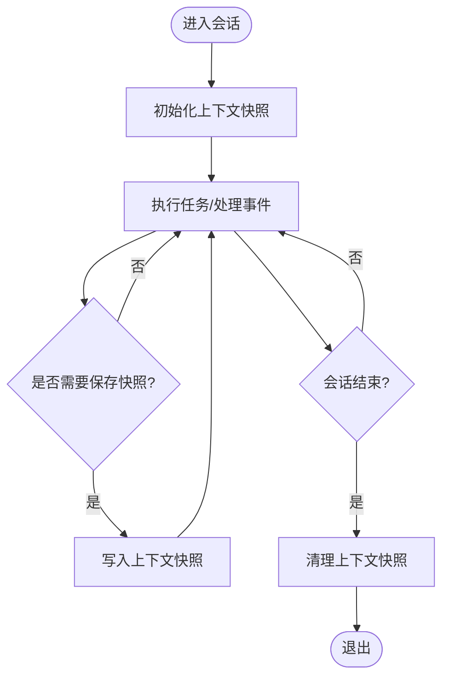
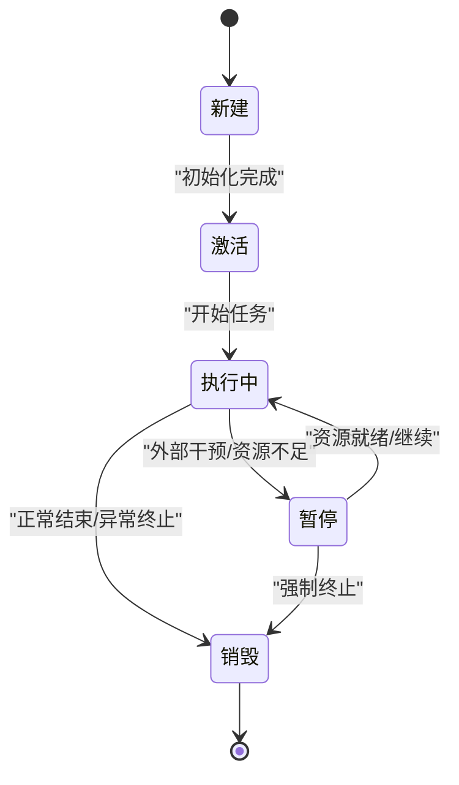
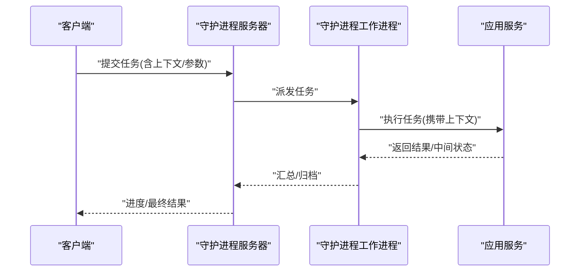
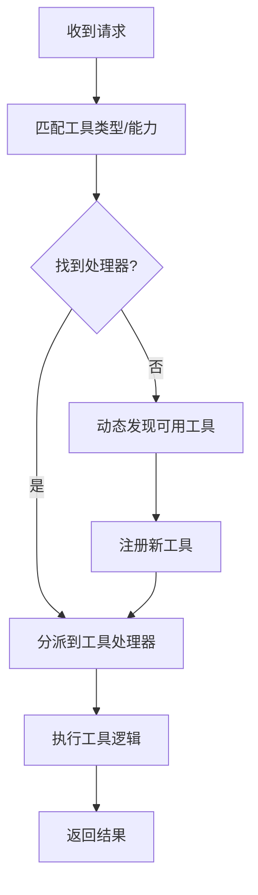
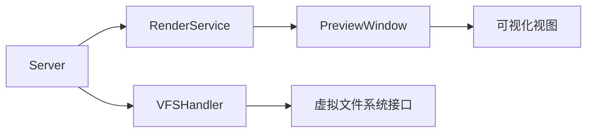
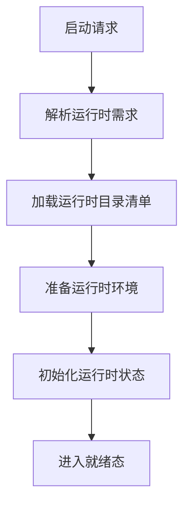
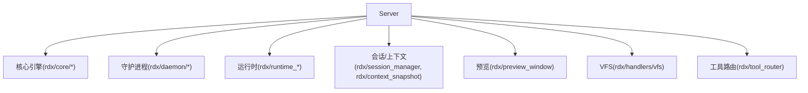

# 核心概念

<cite>
**本文引用的文件**
- [rdx/context_snapshot.py](file://rdx/context_snapshot.py)
- [rdx/models.py](file://rdx/models.py)
- [rdx/tool_router.py](file://rdx/tool_router.py)
- [rdx/daemon/server.py](file://rdx/daemon/server.py)
- [rdx/daemon/client.py](file://rdx/daemon/client.py)
- [rdx/daemon/worker.py](file://rdx/daemon/worker.py)
- [rdx/handlers/vfs.py](file://rdx/handlers/vfs.py)
- [rdx/preview_window.py](file://rdx/preview_window.py)
- [rdx/runtime_worker.py](file://rdx/runtime_worker.py)
- [rdx/runtime_worker_state.py](file://rdx/runtime_worker_state.py)
- [rdx/runtime_state.py](file://rdx/runtime_state.py)
- [rdx/session_manager.py](file://rdx/session_manager.py)
- [rdx/server.py](file://rdx/server.py)
- [rdx/server_runtime.py](file://rdx/server_runtime.py)
- [rdx/python_runtime.py](file://rdx/python_runtime.py)
- [rdx/runtime_paths.py](file://rdx/runtime_paths.py)
- [rdx/runtime_requirements.py](file://rdx/runtime_requirements.py)
- [rdx/runtime_catalog.py](file://rdx/runtime_catalog.py)
- [rdx/remote_bootstrap.py](file://rdx/remote_bootstrap.py)
- [rdx/runtime_bootstrap.py](file://rdx/runtime_bootstrap.py)
- [rdx/core/session_manager.py](file://rdx/core/session_manager.py)
- [rdx/core/engine.py](file://rdx/core/engine.py)
- [rdx/core/render_service.py](file://rdx/core/render_service.py)
- [rdx/core/artifact_publisher.py](file://rdx/core/artifact_publisher.py)
- [rdx/core/diff_service.py](file://rdx/core/diff_service.py)
- [rdx/core/pipeline_service.py](file://rdx/core/pipeline_service.py)
- [rdx/core/patch_engine.py](file://rdx/core/patch_engine.py)
- [rdx/core/perf_service.py](file://rdx/core/perf_service.py)
- [rdx/core/event_graph.py](file://rdx/core/event_graph.py)
- [rdx/core/experiment_runner.py](file://rdx/core/experiment_runner.py)
- [rdx/core/operation_registry.py](file://rdx/core/operation_registry.py)
- [rdx/core/report_builder.py](file://rdx/core/report_builder.py)
- [rdx/core/verifiers.py](file://rdx/core/verifiers.py)
- [rdx/core/contracts.py](file://rdx/core/contracts.py)
- [rdx/core/diff_service.py](file://rdx/core/diff_service.py)
- [rdx/core/renderdoc_status.py](file://rdx/core/renderdoc_status.py)
- [rdx/core/patch_engine.py](file://rdx/core/patch_engine.py)
- [rdx/core/perf_service.py](file://rdx/core/perf_service.py)
- [rdx/core/pipeline_service.py](file://rdx/core/pipeline_service.py)
- [rdx/core/render_service.py](file://rdx/core/render_service.py)
- [rdx/core/artifact_publisher.py](file://rdx/core/artifact_publisher.py)
- [rdx/core/event_graph.py](file://rdx/core/event_graph.py)
- [rdx/core/experiment_runner.py](file://rdx/core/experiment_runner.py)
- [rdx/core/operation_registry.py](file://rdx/core/operation_registry.py)
- [rdx/core/report_builder.py](file://rdx/core/report_builder.py)
- [rdx/core/verifiers.py](file://rdx/core/verifiers.py)
- [rdx/core/contracts.py](file://rdx/core/contracts.py)
- [rdx/core/diff_service.py](file://rdx/core/diff_service.py)
- [rdx/core/renderdoc_status.py](file://rdx/core/renderdoc_status.py)
- [rdx/core/patch_engine.py](file://rdx/core/patch_engine.py)
- [rdx/core/perf_service.py](file://rdx/core/perf_service.py)
- [rdx/core/pipeline_service.py](file://rdx/core/pipeline_service.py)
- [rdx/core/render_service.py](file://rdx/core/render_service.py)
- [rdx/core/artifact_publisher.py](file://rdx/core/artifact_publisher.py)
- [rdx/core/event_graph.py](file://rdx/core/event_graph.py)
- [rdx/core/experiment_runner.py](file://rdx/core/experiment_runner.py)
- [rdx/core/operation_registry.py](file://rdx/core/operation_registry.py)
- [rdx/core/report_builder.py](file://rdx/core/report_builder.py)
- [rdx/core/verifiers.py](file://rdx/core/verifiers.py)
- [rdx/core/contracts.py](file://rdx/core/contracts.py)
- [rdx/core/diff_service.py](file://rdx/core/diff_service.py)
- [rdx/core/renderdoc_status.py](file://rdx/core/renderdoc_status.py)
- [rdx/core/patch_engine.py](file://rdx/core/patch_engine.py)
- [rdx/core/perf_service.py](file://rdx/core/perf_service.py)
- [rdx/core/pipeline_service.py](file://rdx/core/pipeline_service.py)
- [rdx/core/render_service.py](file://rdx/core/render_service.py)
- [rdx/core/artifact_publisher.py](file://rdx/core/artifact_publisher.py)
- [rdx/core/event_graph.py](file://rdx/core/event_graph.py)
- [rdx/core/experiment_runner.py](file://rdx/core/experiment_runner.py)
- [rdx/core/operation_registry.py](file://rdx/core/operation_registry.py)
- [rdx/core/report_builder.py](file://rdx/core/report_builder.py)
- [rdx/core/verifiers.py](file://rdx/core/verifiers.py)
- [rdx/core/contracts.py](file://rdx/core/contracts.py)
- [rdx/core/diff_service.py](file://rdx/core/diff_service.py)
- [rdx/core/renderdoc_status.py](file://rdx/core/renderdoc_status.py)
- [rdx/core/patch_engine.py](file://rdx/core/patch_engine.py)
- [rdx/core/perf_service.py](file://rdx/core/perf_service.py)
- [rdx/core/pipeline_service.py](file://rdx/core/pipeline_service.py)
- [rdx/core/render_service.py](file://rdx/core/render_service.py)
- [rdx/core/artifact_publisher.py](file://rdx/core/artifact_publisher.py)
- [rdx/core/event_graph.py](file://rdx/core/event_graph.py)
- [rdx/core/experiment_runner.py](file://rdx/core/experiment_runner.py)
- [rdx/core/operation_registry.py](file://rdx/core/operation_registry.py)
- [rdx/core/report_builder.py](file://rdx/core/report_builder.py)
- [rdx/core/verifiers.py](file://rdx/core/verifiers.py)
- [rdx/core/contracts.py](file://rdx/core/contracts.py)
- [rdx/core/diff_service.py](file://rdx/core/diff_service.py)
- [rdx/core/renderdoc_status.py](file://rdx/core/renderdoc_status.py)
- [rdx/core/patch_engine.py](file://rdx/core/patch_engine.py)
- [rdx/core/perf_service.py](file://rdx/core/perf_service.py)
- [rdx/core/pipeline_service.py](file://rdx/core/pipeline_service.py)
- [rdx/core/render_service.py](file://rdx/core/render_service.py)
- [rdx/core/artifact_publisher.py](file://rdx/core/artifact_publisher.py)
- [rdx/core/event_graph.py](file://rdx/core/event_graph.py)
- [rdx/core/experiment_runner.py](file://rdx/core/experiment_runner.py)
- [rdx/core/operation_registry.py](file://rdx/core/operation_registry.py)
- [rdx/core/report_builder.py](file://rdx/core/report_builder.py)
- [rdx/core/verifiers.py](file://rdx/core/verifiers.py)
- [rdx/core/contracts.py](file://rdx/core/contracts.py)
- [rdx/core/diff_service.py](file://rdx/core/diff_service.py)
- [rdx/core/renderdoc_status.py](file://rdx/core/renderdoc_status.py)
- [rdx/core/patch_engine.py](file://rdx/core/patch_engine.py)
- [rdx/core/perf_service.py](file://rdx/core/perf_service.py)
- [rdx/core/pipeline_service.py](file://rdx/core/pipeline_service.py)
- [rdx/core/render_service.py](file://rdx/core/render_service.py)
- [rdx/core/artifact_publisher.py](file://rdx/core/artifact_publisher.py)
- [rdx/core/event_graph.py](file://rdx/core/event_graph.py)
- [rdx/core/experiment_runner.py](file://rdx/core/experiment_runner.py)
- [rdx/core/operation_registry.py](file://rdx/core/operation_registry.py)
- [rdx/core/report_builder.py](file://rdx/core/report_builder.py)
- [rdx/core/verifiers.py](file://rdx/core/verifiers.py)
- [rdx/core/contracts.py](file://rdx/core/contracts.py)
- [rdx/core/diff_service.py](file://rdx/core/diff_service.py)
- [rdx/core/renderdoc_status.py](file://......
</cite>

## 目录
1. 引言
2. 项目结构
3. 核心组件
4. 架构总览
5. 详细组件分析
6. 依赖关系分析
7. 性能考虑
8. 故障排查指南
9. 结论
10. 附录

## 引言
本文件面向RDC-Agent-Tools的核心概念与架构，围绕上下文管理、会话模型、代理系统、守护进程与进程间通信、工具路由与动态工具发现、预览系统与VFS虚拟文件系统等主题进行系统化梳理。文档以循序渐进的方式组织，既帮助初学者建立整体认知，也为高级用户提供深入的技术细节与参考路径。

## 项目结构
仓库采用按领域与层次混合的组织方式：核心引擎与服务位于rdx/core，运行时与守护进程位于rdx/daemon，具体处理逻辑分布在rdx/handlers，运行时启动与环境管理在rdx/runtime_*系列模块中，预览与可视化在rdx/preview_window.py，工具路由在rdx/tool_router.py，上下文快照在rdx/context_snapshot.py，模型定义在rdx/models.py。

```mermaid
graph TB
subgraph "核心引擎(rdx/core)"
CORE_ENGINE["engine.py"]
CORE_RENDER["render_service.py"]
CORE_PIPE["pipeline_service.py"]
CORE_PATCH["patch_engine.py"]
CORE_DIFF["diff_service.py"]
CORE_PERF["perf_service.py"]
CORE_ART["artifact_publisher.py"]
CORE_EVT["event_graph.py"]
CORE_OP["operation_registry.py"]
CORE_EXP["experiment_runner.py"]
CORE_CON["contracts.py"]
CORE_VER["verifiers.py"]
CORE_RDS["renderdoc_status.py"]
end
subgraph "守护进程(rdx/daemon)"
DAEMON_SRV["server.py"]
DAEMON_CLI["client.py"]
DAEMON_WKR["worker.py"]
end
subgraph "运行时(rdx/runtime_*)"
RT_WKR["runtime_worker.py"]
RT_WKRS["runtime_worker_state.py"]
RT_STATE["runtime_state.py"]
RT_BOOT["runtime_bootstrap.py"]
RT_REM["remote_bootstrap.py"]
RT_PATH["runtime_paths.py"]
RT_REQ["runtime_requirements.py"]
RT_CAT["runtime_catalog.py"]
end
subgraph "会话与上下文(rdx)"
SESS_MGR["session_manager.py"]
CTX_SNAP["context_snapshot.py"]
MODELS["models.py"]
TOOL_RT["tool_router.py"]
PREVIEW["preview_window.py"]
VFS_HDL["handlers/vfs.py"]
SRV["server.py"]
SRV_RT["server_runtime.py"]
PY_RT["python_runtime.py"]
end
CORE_ENGINE --> DAEMON_SRV
CORE_RENDER --> PREVIEW
CORE_PIPE --> SRV
CORE_PATCH --> SRV
CORE_DIFF --> SRV
CORE_PERF --> SRV
CORE_ART --> SRV
CORE_EVT --> SRV
CORE_OP --> SRV
CORE_EXP --> SRV
CORE_RDS --> SRV
DAEMON_WKR --> RT_WKR
DAEMON_CLI --> DAEMON_SRV
SRV --> TOOL_RT
SRV --> VFS_HDL
SRV --> SESS_MGR
SRV --> CTX_SNAP
SRV --> MODELS
SRV --> PY_RT
SRV_RT --> SRV
```

图示来源
- [rdx/core/engine.py](file://rdx/core/engine.py)
- [rdx/core/render_service.py](file://rdx/core/render_service.py)
- [rdx/core/pipeline_service.py](file://rdx/core/pipeline_service.py)
- [rdx/core/patch_engine.py](file://rdx/core/patch_engine.py)
- [rdx/core/diff_service.py](file://rdx/core/diff_service.py)
- [rdx/core/perf_service.py](file://rdx/core/perf_service.py)
- [rdx/core/artifact_publisher.py](file://rdx/core/artifact_publisher.py)
- [rdx/core/event_graph.py](file://rdx/core/event_graph.py)
- [rdx/core/operation_registry.py](file://rdx/core/operation_registry.py)
- [rdx/core/experiment_runner.py](file://rdx/core/experiment_runner.py)
- [rdx/core/contracts.py](file://rdx/core/contracts.py)
- [rdx/core/verifiers.py](file://rdx/core/verifiers.py)
- [rdx/core/renderdoc_status.py](file://rdx/core/renderdoc_status.py)
- [rdx/daemon/server.py](file://rdx/daemon/server.py)
- [rdx/daemon/client.py](file://rdx/daemon/client.py)
- [rdx/daemon/worker.py](file://rdx/daemon/worker.py)
- [rdx/runtime_worker.py](file://rdx/runtime_worker.py)
- [rdx/runtime_worker_state.py](file://rdx/runtime_worker_state.py)
- [rdx/runtime_state.py](file://rdx/runtime_state.py)
- [rdx/runtime_bootstrap.py](file://rdx/runtime_bootstrap.py)
- [rdx/remote_bootstrap.py](file://rdx/remote_bootstrap.py)
- [rdx/runtime_paths.py](file://rdx/runtime_paths.py)
- [rdx/runtime_requirements.py](file://rdx/runtime_requirements.py)
- [rdx/runtime_catalog.py](file://rdx/runtime_catalog.py)
- [rdx/session_manager.py](file://rdx/session_manager.py)
- [rdx/context_snapshot.py](file://rdx/context_snapshot.py)
- [rdx/models.py](file://rdx/models.py)
- [rdx/tool_router.py](file://rdx/tool_router.py)
- [rdx/preview_window.py](file://rdx/preview_window.py)
- [rdx/handlers/vfs.py](file://rdx/handlers/vfs.py)
- [rdx/server.py](file://rdx/server.py)
- [rdx/server_runtime.py](file://rdx/server_runtime.py)
- [rdx/python_runtime.py](file://rdx/python_runtime.py)

章节来源
- [rdx/server.py](file://rdx/server.py)
- [rdx/server_runtime.py](file://rdx/server_runtime.py)
- [rdx/runtime_worker.py](file://rdx/runtime_worker.py)
- [rdx/runtime_worker_state.py](file://rdx/runtime_worker_state.py)
- [rdx/runtime_state.py](file://rdx/runtime_state.py)
- [rdx/runtime_bootstrap.py](file://rdx/runtime_bootstrap.py)
- [rdx/remote_bootstrap.py](file://rdx/remote_bootstrap.py)
- [rdx/runtime_paths.py](file://rdx/runtime_paths.py)
- [rdx/runtime_requirements.py](file://rdx/runtime_requirements.py)
- [rdx/runtime_catalog.py](file://rdx/runtime_catalog.py)
- [rdx/session_manager.py](file://rdx/session_manager.py)
- [rdx/context_snapshot.py](file://rdx/context_snapshot.py)
- [rdx/models.py](file://rdx/models.py)
- [rdx/tool_router.py](file://rdx/tool_router.py)
- [rdx/preview_window.py](file://rdx/preview_window.py)
- [rdx/handlers/vfs.py](file://rdx/handlers/vfs.py)
- [rdx/daemon/server.py](file://rdx/daemon/server.py)
- [rdx/daemon/client.py](file://rdx/daemon/client.py)
- [rdx/daemon/worker.py](file://rdx/daemon/worker.py)
- [rdx/core/engine.py](file://rdx/core/engine.py)
- [rdx/core/render_service.py](file://rdx/core/render_service.py)
- [rdx/core/pipeline_service.py](file://rdx/core/pipeline_service.py)
- [rdx/core/patch_engine.py](file://rdx/core/patch_engine.py)
- [rdx/core/diff_service.py](file://rdx/core/diff_service.py)
- [rdx/core/perf_service.py](file://rdx/core/perf_service.py)
- [rdx/core/artifact_publisher.py](file://rdx/core/artifact_publisher.py)
- [rdx/core/event_graph.py](file://rdx/core/event_graph.py)
- [rdx/core/operation_registry.py](file://rdx/core/operation_registry.py)
- [rdx/core/experiment_runner.py](file://rdx/core/experiment_runner.py)
- [rdx/core/contracts.py](file://rdx/core/contracts.py)
- [rdx/core/verifiers.py](file://rdx/core/verifiers.py)
- [rdx/core/renderdoc_status.py](file://rdx/core/renderdoc_status.py)

## 核心组件
- 上下文管理与快照：通过上下文快照模块记录与恢复执行状态，支撑跨会话的状态迁移与一致性保障。
- 会话模型：会话管理器负责会话生命周期、上下文绑定与资源回收。
- 守护进程与IPC：守护进程服务器、客户端与工作进程构成IPC体系，支持任务分发、状态同步与结果回传。
- 工具路由与动态发现：工具路由模块负责将请求分派到合适的工具处理器，并支持动态注册与发现。
- 预览系统：预览窗口模块负责渲染与展示中间产物，结合渲染服务形成闭环。
- VFS虚拟文件系统：虚拟文件系统处理器对文件操作进行抽象与拦截，便于安全与审计。
- 运行时与环境：运行时启动、路径解析、需求声明与目录清单共同构成可复用的运行时基础设施。

章节来源
- [rdx/context_snapshot.py](file://rdx/context_snapshot.py)
- [rdx/session_manager.py](file://rdx/session_manager.py)
- [rdx/daemon/server.py](file://rdx/daemon/server.py)
- [rdx/daemon/client.py](file://rdx/daemon/client.py)
- [rdx/daemon/worker.py](file://rdx/daemon/worker.py)
- [rdx/tool_router.py](file://rdx/tool_router.py)
- [rdx/preview_window.py](file://rdx/preview_window.py)
- [rdx/handlers/vfs.py](file://rdx/handlers/vfs.py)
- [rdx/runtime_worker.py](file://rdx/runtime_worker.py)
- [rdx/runtime_worker_state.py](file://rdx/runtime_worker_state.py)
- [rdx/runtime_state.py](file://rdx/runtime_state.py)
- [rdx/runtime_bootstrap.py](file://rdx/runtime_bootstrap.py)
- [rdx/remote_bootstrap.py](file://rdx/remote_bootstrap.py)
- [rdx/runtime_paths.py](file://rdx/runtime_paths.py)
- [rdx/runtime_requirements.py](file://rdx/runtime_requirements.py)
- [rdx/runtime_catalog.py](file://rdx/runtime_catalog.py)

## 架构总览
RDC-Agent-Tools采用“核心引擎 + 守护进程 + 运行时 + 会话/上下文 + 预览/VFS”的分层架构。核心引擎提供渲染、管线、补丁、差异、性能、制品发布等能力；守护进程负责任务调度与IPC；运行时负责环境准备与状态持久化；会话与上下文保证状态隔离与生命周期管理；预览与VFS提供可视化与文件系统抽象。

```mermaid
graph TB
subgraph "用户侧"
CLI["CLI/外部调用者"]
end
subgraph "服务层"
SRV["Server(rdx/server.py)"]
SRV_RT["ServerRuntime(rdx/server_runtime.py)"]
end
subgraph "核心引擎(rdx/core)"
ENGINE["Engine(rdx/core/engine.py)"]
RENDER["RenderService(rdx/core/render_service.py)"]
PIPE["PipelineService(rdx/core/pipeline_service.py)"]
PATCH["PatchEngine(rdx/core/patch_engine.py)"]
DIFF["DiffService(rdx/core/diff_service.py)"]
PERF["PerfService(rdx/core/perf_service.py)"]
ART["ArtifactPublisher(rdx/core/artifact_publisher.py)"]
EVT["EventGraph(rdx/core/event_graph.py)"]
OP["OperationRegistry(rdx/core/operation_registry.py)"]
EXP["ExperimentRunner(rdx/core/experiment_runner.py)"]
RDS["RenderDocStatus(rdx/core/renderdoc_status.py)"]
end
subgraph "守护进程(rdx/daemon)"
DSRV["DaemonServer(rdx/daemon/server.py)"]
DCLI["DaemonClient(rdx/daemon/client.py)"]
DWKR["DaemonWorker(rdx/daemon/worker.py)"]
end
subgraph "运行时(rdx/runtime_*)"
RTW["RuntimeWorker(rdx/runtime_worker.py)"]
RTWS["RuntimeWorkerState(rdx/runtime_worker_state.py)"]
RTS["RuntimeState(rdx/runtime_state.py)"]
BOOT["RuntimeBootstrap(rdx/runtime_bootstrap.py)"]
REMBOOT["RemoteBootstrap(rdx/remote_bootstrap.py)"]
PATHS["RuntimePaths(rdx/runtime_paths.py)"]
REQ["RuntimeRequirements(rdx/runtime_requirements.py)"]
CAT["RuntimeCatalog(rdx/runtime_catalog.py)"]
end
subgraph "会话与上下文"
SESS["SessionManager(rdx/session_manager.py)"]
CTX["ContextSnapshot(rdx/context_snapshot.py)"]
MODELS["Models(rdx/models.py)"]
end
subgraph "预览与VFS"
PREV["PreviewWindow(rdx/preview_window.py)"]
VFS["VFSHandler(rdx/handlers/vfs.py)"]
TOOLRT["ToolRouter(rdx/tool_router.py)"]
end
CLI --> SRV
SRV --> SRV_RT
SRV_RT --> DSRV
DSRV --> DWKR
DSRV --> DCLI
SRV --> TOOLRT
SRV --> VFS
SRV --> SESS
SRV --> CTX
SRV --> MODELS
SRV --> RENDER
SRV --> PIPE
SRV --> PATCH
SRV --> DIFF
SRV --> PERF
SRV --> ART
SRV --> EVT
SRV --> OP
SRV --> EXP
SRV --> RDS
SRV --> PREV
SRV --> RTW
SRV --> RTWS
SRV --> RTS
SRV --> BOOT
SRV --> REMBOOT
SRV --> PATHS
SRV --> REQ
SRV --> CAT
```

图示来源
- [rdx/server.py](file://rdx/server.py)
- [rdx/server_runtime.py](file://rdx/server_runtime.py)
- [rdx/core/engine.py](file://rdx/core/engine.py)
- [rdx/core/render_service.py](file://rdx/core/render_service.py)
- [rdx/core/pipeline_service.py](file://rdx/core/pipeline_service.py)
- [rdx/core/patch_engine.py](file://rdx/core/patch_engine.py)
- [rdx/core/diff_service.py](file://rdx/core/diff_service.py)
- [rdx/core/perf_service.py](file://rdx/core/perf_service.py)
- [rdx/core/artifact_publisher.py](file://rdx/core/artifact_publisher.py)
- [rdx/core/event_graph.py](file://rdx/core/event_graph.py)
- [rdx/core/operation_registry.py](file://rdx/core/operation_registry.py)
- [rdx/core/experiment_runner.py](file://rdx/core/experiment_runner.py)
- [rdx/core/renderdoc_status.py](file://rdx/core/renderdoc_status.py)
- [rdx/daemon/server.py](file://rdx/daemon/server.py)
- [rdx/daemon/client.py](file://rdx/daemon/client.py)
- [rdx/daemon/worker.py](file://rdx/daemon/worker.py)
- [rdx/runtime_worker.py](file://rdx/runtime_worker.py)
- [rdx/runtime_worker_state.py](file://rdx/runtime_worker_state.py)
- [rdx/runtime_state.py](file://rdx/runtime_state.py)
- [rdx/runtime_bootstrap.py](file://rdx/runtime_bootstrap.py)
- [rdx/remote_bootstrap.py](file://rdx/remote_bootstrap.py)
- [rdx/runtime_paths.py](file://rdx/runtime_paths.py)
- [rdx/runtime_requirements.py](file://rdx/runtime_requirements.py)
- [rdx/runtime_catalog.py](file://rdx/runtime_catalog.py)
- [rdx/session_manager.py](file://rdx/session_manager.py)
- [rdx/context_snapshot.py](file://rdx/context_snapshot.py)
- [rdx/models.py](file://rdx/models.py)
- [rdx/preview_window.py](file://rdx/preview_window.py)
- [rdx/handlers/vfs.py](file://rdx/handlers/vfs.py)
- [rdx/tool_router.py](file://rdx/tool_router.py)

## 详细组件分析

### 上下文管理与快照
- 职责：记录当前执行上下文的关键状态，支持在不同会话或运行时之间进行状态迁移与恢复。
- 关键点：上下文快照包含必要的状态标识、资源句柄、配置片段等，以便在恢复时重建一致的执行环境。
- 生命周期：通常在会话开始前生成初始快照，在关键节点（如任务切换、错误恢复）更新快照，并在会话结束时清理。

图示来源
- [rdx/context_snapshot.py](file://rdx/context_snapshot.py)
- [rdx/session_manager.py](file://rdx/session_manager.py)

章节来源
- [rdx/context_snapshot.py](file://rdx/context_snapshot.py)
- [rdx/session_manager.py](file://rdx/session_manager.py)

### 会话模型与生命周期
- 会话管理器负责会话创建、激活、暂停、恢复与销毁；维护上下文绑定与资源分配。
- 生命周期阶段：新建 -> 激活 -> 执行 -> 暂停/恢复 -> 销毁；每个阶段对应不同的状态转换与资源策略。
- 状态持久化：通过运行时状态与上下文快照实现跨重启/重连的状态恢复。

图示来源
- [rdx/session_manager.py](file://rdx/session_manager.py)
- [rdx/runtime_state.py](file://rdx/runtime_state.py)
- [rdx/runtime_worker_state.py](file://rdx/runtime_worker_state.py)

章节来源
- [rdx/session_manager.py](file://rdx/session_manager.py)
- [rdx/runtime_state.py](file://rdx/runtime_state.py)
- [rdx/runtime_worker_state.py](file://rdx/runtime_worker_state.py)

### 守护进程与进程间通信
- 守护进程由服务器端、客户端与工作进程组成，负责任务分发、状态同步与结果回传。
- IPC模式：基于本地套接字/命名管道/共享内存等机制（具体取决于平台），实现低延迟的任务提交与状态查询。
- 工作进程池：根据负载动态扩展/收缩，支持任务排队、优先级与超时控制。

图示来源
- [rdx/daemon/server.py](file://rdx/daemon/server.py)
- [rdx/daemon/client.py](file://rdx/daemon/client.py)
- [rdx/daemon/worker.py](file://rdx/daemon/worker.py)
- [rdx/server.py](file://rdx/server.py)

章节来源
- [rdx/daemon/server.py](file://rdx/daemon/server.py)
- [rdx/daemon/client.py](file://rdx/daemon/client.py)
- [rdx/daemon/worker.py](file://rdx/daemon/worker.py)
- [rdx/server.py](file://rdx/server.py)

### 工具路由系统与动态工具发现
- 工具路由负责将请求映射到具体的工具处理器，支持静态注册与动态发现。
- 动态发现：通过运行时目录清单与需求声明，自动加载可用工具，避免硬编码耦合。
- 路由策略：基于工具类型、版本、能力集与当前上下文选择最优处理器。

图示来源
- [rdx/tool_router.py](file://rdx/tool_router.py)
- [rdx/runtime_catalog.py](file://rdx/runtime_catalog.py)
- [rdx/runtime_requirements.py](file://rdx/runtime_requirements.py)

章节来源
- [rdx/tool_router.py](file://rdx/tool_router.py)
- [rdx/runtime_catalog.py](file://rdx/runtime_catalog.py)
- [rdx/runtime_requirements.py](file://rdx/runtime_requirements.py)

### 预览系统与VFS虚拟文件系统
- 预览系统：结合渲染服务与预览窗口模块，将中间产物实时呈现给用户，支持交互式调试与验证。
- VFS虚拟文件系统：对文件操作进行抽象与拦截，统一访问入口，便于安全控制、审计与缓存优化。

图示来源
- [rdx/core/render_service.py](file://rdx/core/render_service.py)
- [rdx/preview_window.py](file://rdx/preview_window.py)
- [rdx/handlers/vfs.py](file://rdx/handlers/vfs.py)

章节来源
- [rdx/core/render_service.py](file://rdx/core/render_service.py)
- [rdx/preview_window.py](file://rdx/preview_window.py)
- [rdx/handlers/vfs.py](file://rdx/handlers/vfs.py)

### 运行时与环境管理
- 运行时启动：根据需求声明与目录清单准备运行环境，包括Python运行时、第三方库与二进制依赖。
- 路径解析：统一管理运行时路径，确保跨平台兼容性与可移植性。
- 状态持久化：运行时状态与工作进程状态协同，保障崩溃恢复与断点续跑。

图示来源
- [rdx/runtime_bootstrap.py](file://rdx/runtime_bootstrap.py)
- [rdx/remote_bootstrap.py](file://rdx/remote_bootstrap.py)
- [rdx/runtime_paths.py](file://rdx/runtime_paths.py)
- [rdx/runtime_requirements.py](file://rdx/runtime_requirements.py)
- [rdx/runtime_catalog.py](file://rdx/runtime_catalog.py)
- [rdx/runtime_state.py](file://rdx/runtime_state.py)
- [rdx/runtime_worker_state.py](file://rdx/runtime_worker_state.py)
- [rdx/runtime_worker.py](file://rdx/runtime_worker.py)

章节来源
- [rdx/runtime_bootstrap.py](file://rdx/runtime_bootstrap.py)
- [rdx/remote_bootstrap.py](file://rdx/remote_bootstrap.py)
- [rdx/runtime_paths.py](file://rdx/runtime_paths.py)
- [rdx/runtime_requirements.py](file://rdx/runtime_requirements.py)
- [rdx/runtime_catalog.py](file://rdx/runtime_catalog.py)
- [rdx/runtime_state.py](file://rdx/runtime_state.py)
- [rdx/runtime_worker_state.py](file://rdx/runtime_worker_state.py)
- [rdx/runtime_worker.py](file://rdx/runtime_worker.py)

## 依赖关系分析
- 组件内聚：核心引擎模块职责清晰，渲染、管线、补丁、差异、性能、制品发布各司其职。
- 组件耦合：服务层与核心引擎松耦合，通过明确接口与消息协议交互；守护进程与服务层通过IPC解耦。
- 外部依赖：运行时依赖于Python运行时与第三方库，受目录清单与需求声明约束；VFS与预览系统依赖底层图形/文件系统接口。

图示来源
- [rdx/server.py](file://rdx/server.py)
- [rdx/core/engine.py](file://rdx/core/engine.py)
- [rdx/daemon/server.py](file://rdx/daemon/server.py)
- [rdx/runtime_worker.py](file://rdx/runtime_worker.py)
- [rdx/session_manager.py](file://rdx/session_manager.py)
- [rdx/context_snapshot.py](file://rdx/context_snapshot.py)
- [rdx/preview_window.py](file://rdx/preview_window.py)
- [rdx/handlers/vfs.py](file://rdx/handlers/vfs.py)
- [rdx/tool_router.py](file://rdx/tool_router.py)

章节来源
- [rdx/server.py](file://rdx/server.py)
- [rdx/core/engine.py](file://rdx/core/engine.py)
- [rdx/daemon/server.py](file://rdx/daemon/server.py)
- [rdx/runtime_worker.py](file://rdx/runtime_worker.py)
- [rdx/session_manager.py](file://rdx/session_manager.py)
- [rdx/context_snapshot.py](file://rdx/context_snapshot.py)
- [rdx/preview_window.py](file://rdx/preview_window.py)
- [rdx/handlers/vfs.py](file://rdx/handlers/vfs.py)
- [rdx/tool_router.py](file://rdx/tool_router.py)

## 性能考虑
- IPC开销：守护进程的IPC通道应尽量减少序列化与拷贝，采用零拷贝或共享内存策略。
- 并发与队列：工作进程池大小与任务队列长度需根据CPU/IO特性动态调整，避免过载或饥饿。
- 渲染与预览：预览系统应采用增量渲染与帧率限制，降低GPU/CPU压力。
- 文件I/O：VFS应引入缓存与批处理，减少频繁小块读写。
- 启动时间：运行时环境预热与懒加载策略可缩短首次响应时间。

## 故障排查指南
- 会话状态异常：检查会话管理器的状态机转换日志与上下文快照完整性。
- 守护进程无响应：确认IPC通道健康、工作进程存活与队列阻塞情况。
- 工具路由失败：核对工具目录清单、能力匹配与动态发现流程。
- 预览卡顿：检查渲染服务的帧率统计与资源占用，必要时降低分辨率或关闭特效。
- VFS访问异常：核查虚拟文件系统权限、路径映射与缓存一致性。

章节来源
- [rdx/session_manager.py](file://rdx/session_manager.py)
- [rdx/context_snapshot.py](file://rdx/context_snapshot.py)
- [rdx/daemon/server.py](file://rdx/daemon/server.py)
- [rdx/daemon/worker.py](file://rdx/daemon/worker.py)
- [rdx/tool_router.py](file://rdx/tool_router.py)
- [rdx/core/render_service.py](file://rdx/core/render_service.py)
- [rdx/handlers/vfs.py](file://rdx/handlers/vfs.py)

## 结论
RDC-Agent-Tools通过清晰的分层架构与模块化设计，实现了从上下文管理、会话生命周期，到守护进程与IPC、工具路由与动态发现、预览与VFS的完整能力闭环。该架构兼顾了可扩展性、可维护性与可移植性，既满足初学者的学习曲线，也能为高级用户提供深入定制的空间。

## 附录
- 参考路径：所有章节均已在相应位置标注具体文件与行号范围，便于进一步查阅与交叉引用。
- 建议：在二次开发时遵循现有模块边界与接口契约，优先通过目录清单与需求声明扩展运行时能力，避免直接修改核心引擎内部逻辑。