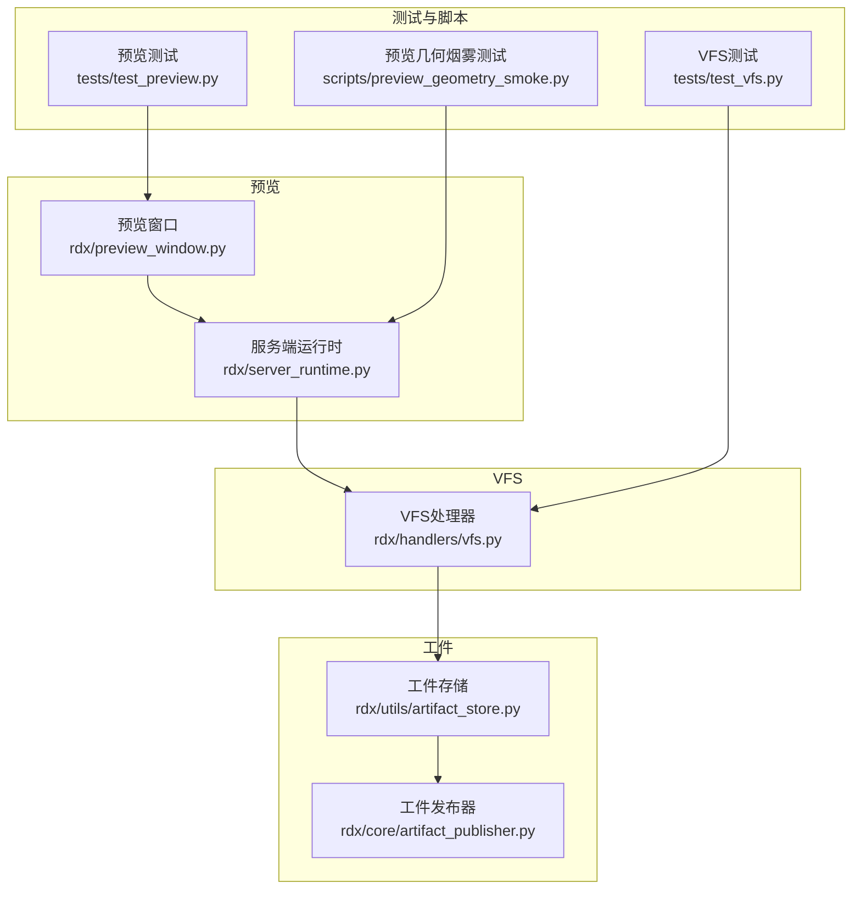
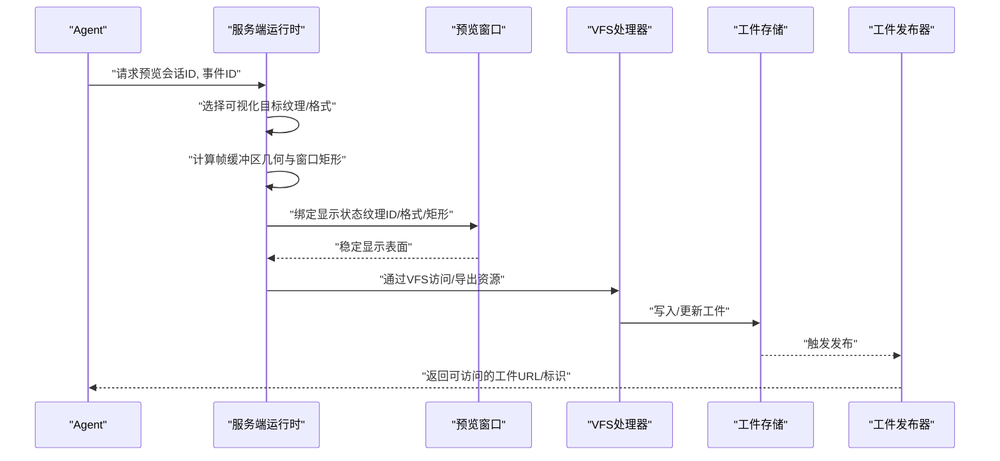
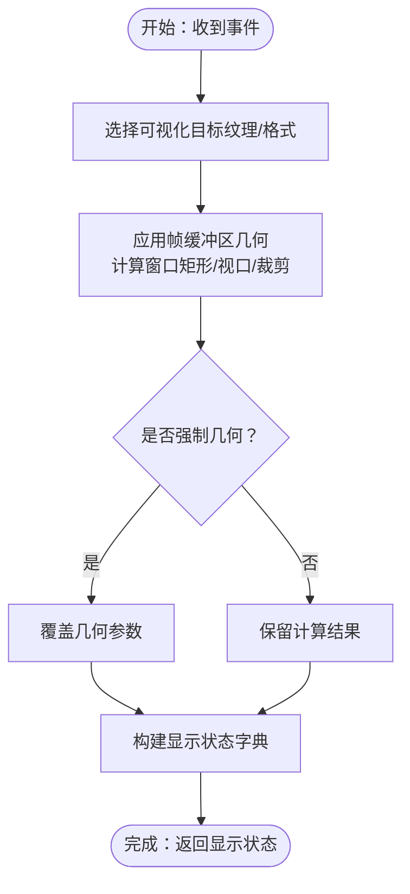
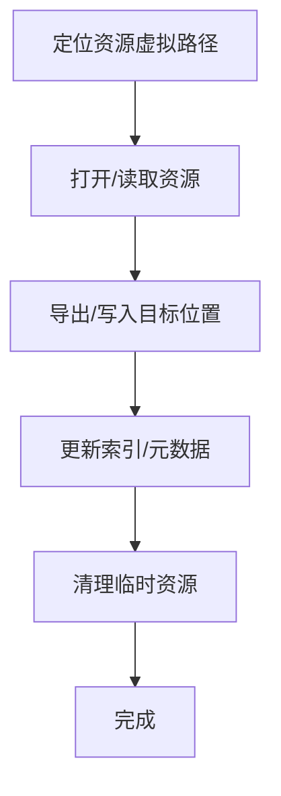
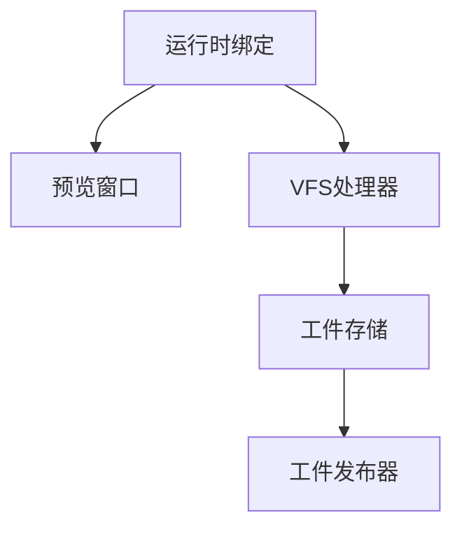

# 预览与VFS系统

<cite>
**本文引用的文件**
- [rdx/preview_window.py](file://rdx/preview_window.py)
- [rdx/server_runtime.py](file://rdx/server_runtime.py)
- [rdx/handlers/vfs.py](file://rdx/handlers/vfs.py)
- [rdx/utils/artifact_store.py](file://rdx/utils/artifact_store.py)
- [rdx/core/artifact_publisher.py](file://rdx/core/artifact_publisher.py)
- [tests/test_preview.py](file://tests/test_preview.py)
- [tests/test_vfs.py](file://tests/test_vfs.py)
- [scripts/preview_geometry_smoke.py](file://scripts/preview_geometry_smoke.py)
- [docs/agent-model.md](file://docs/agent-model.md)
</cite>

## 目录
1. [简介](#简介)
2. [项目结构](#项目结构)
3. [核心组件](#核心组件)
4. [架构总览](#架构总览)
5. [详细组件分析](#详细组件分析)
6. [依赖关系分析](#依赖关系分析)
7. [性能考量](#性能考量)
8. [故障排查指南](#故障排查指南)
9. [结论](#结论)
10. [附录](#附录)

## 简介
本文件面向GPU调试与可视化工作流，系统性阐述预览系统与虚拟文件系统（VFS）的设计与实现。预览系统负责将渲染结果以稳定的“显示表面”形式呈现，并通过窗口几何与屏幕适配策略确保跨平台一致性；VFS则提供统一的资源访问抽象与生命周期管理，支撑工件（Artifacts）的生成、存储与发布。两者协同工作，为调试流程提供一致、可复现且可共享的可视化输出。

## 项目结构
围绕预览与VFS的关键模块分布如下：
- 预览：预览窗口定义与运行时绑定逻辑
- VFS：虚拟文件系统处理与资源访问
- 工件存储：本地/远程存储与发布
- 测试与脚本：验证预览几何与VFS行为

图表来源
- [rdx/preview_window.py](file://rdx/preview_window.py)
- [rdx/server_runtime.py](file://rdx/server_runtime.py)
- [rdx/handlers/vfs.py](file://rdx/handlers/vfs.py)
- [rdx/utils/artifact_store.py](file://rdx/utils/artifact_store.py)
- [rdx/core/artifact_publisher.py](file://rdx/core/artifact_publisher.py)
- [tests/test_preview.py](file://tests/test_preview.py)
- [tests/test_vfs.py](file://tests/test_vfs.py)
- [scripts/preview_geometry_smoke.py](file://scripts/preview_geometry_smoke.py)

章节来源
- [rdx/preview_window.py](file://rdx/preview_window.py)
- [rdx/server_runtime.py](file://rdx/server_runtime.py)
- [rdx/handlers/vfs.py](file://rdx/handlers/vfs.py)
- [rdx/utils/artifact_store.py](file://rdx/utils/artifact_store.py)
- [rdx/core/artifact_publisher.py](file://rdx/core/artifact_publisher.py)
- [tests/test_preview.py](file://tests/test_preview.py)
- [tests/test_vfs.py](file://tests/test_vfs.py)
- [scripts/preview_geometry_smoke.py](file://scripts/preview_geometry_smoke.py)

## 核心组件
- 预览窗口与显示表面
  - 预览窗口负责承载最终帧缓冲区内容，并提供稳定的“显示表面”，用于窗口与帧缓冲区几何的统一呈现。
  - 运行时绑定负责根据事件选择目标纹理、计算视口与裁剪区域，并应用屏幕适配比例，确保在不同分辨率与缩放下的一致显示。
- 虚拟文件系统（VFS）
  - VFS作为资源访问抽象层，屏蔽底层存储差异，提供统一的资源定位、读写与生命周期管理。
  - 结合工件存储与发布器，实现从采集到发布的完整链路。
- 工件存储与发布
  - 存储层负责本地/远程持久化；发布器负责将工件暴露给外部消费方（如报告、CI、调试工具）。

章节来源
- [docs/agent-model.md](file://docs/agent-model.md)
- [rdx/server_runtime.py](file://rdx/server_runtime.py)
- [rdx/preview_window.py](file://rdx/preview_window.py)
- [rdx/handlers/vfs.py](file://rdx/handlers/vfs.py)
- [rdx/utils/artifact_store.py](file://rdx/utils/artifact_store.py)
- [rdx/core/artifact_publisher.py](file://rdx/core/artifact_publisher.py)

## 架构总览
预览与VFS在GPU调试工作流中的交互路径如下：
- 事件驱动：服务端运行时根据会话与事件选择可视化目标。
- 几何计算：应用帧缓冲区几何，计算窗口矩形、视口与裁剪区域。
- 显示绑定：将纹理与格式绑定至预览显示状态，形成稳定的“显示表面”。
- VFS集成：通过VFS处理器对资源进行访问与管理，支持导出与持久化。
- 工件发布：将预览结果与相关资源发布到工件存储，供后续分析与共享。

图表来源
- [rdx/server_runtime.py](file://rdx/server_runtime.py)
- [rdx/preview_window.py](file://rdx/preview_window.py)
- [rdx/handlers/vfs.py](file://rdx/handlers/vfs.py)
- [rdx/utils/artifact_store.py](file://rdx/utils/artifact_store.py)
- [rdx/core/artifact_publisher.py](file://rdx/core/artifact_publisher.py)

## 详细组件分析

### 预览系统
- 预览几何体与显示表面
  - 帧缓冲区几何由运行时绑定应用，结合屏幕截取比例与强制几何参数，计算窗口矩形与有效区域。
  - 视口与裁剪区域用于精确控制渲染输出的可见范围，避免多余像素与失真。
- 窗口适配机制
  - 通过“屏幕截取比例”与“强制几何”参数，确保在高DPI或多显示器环境下的一致性。
  - 当几何不可用时，系统回退为空值，保证流程健壮性。
- 状态与绑定
  - 绑定函数负责事件校验、目标纹理选择与输出槽位确定，最终生成稳定的显示状态字典，包含纹理ID、格式、尺寸与区域信息。

图表来源
- [rdx/server_runtime.py](file://rdx/server_runtime.py)

章节来源
- [rdx/server_runtime.py](file://rdx/server_runtime.py)
- [tests/test_preview.py](file://tests/test_preview.py)
- [scripts/preview_geometry_smoke.py](file://scripts/preview_geometry_smoke.py)

### VFS虚拟文件系统
- 设计目标
  - 提供统一的资源访问接口，屏蔽底层存储差异（本地/远程），支持资源定位、读写与生命周期管理。
- 关键职责
  - 资源访问抽象：将物理路径映射到统一的虚拟路径，便于跨环境迁移。
  - 资源管理：跟踪资源元数据、版本与依赖，支持增量更新与清理。
  - 与工件系统协作：为工件存储提供标准化的输入输出接口。
- 典型流程
  - 定位资源 → 打开/读取 → 写入/导出 → 更新索引 → 清理临时资源

图表来源
- [rdx/handlers/vfs.py](file://rdx/handlers/vfs.py)
- [rdx/utils/artifact_store.py](file://rdx/utils/artifact_store.py)

章节来源
- [rdx/handlers/vfs.py](file://rdx/handlers/vfs.py)
- [tests/test_vfs.py](file://tests/test_vfs.py)

### 工件存储与发布
- 存储策略
  - 支持本地与远程存储，采用分层目录结构与唯一标识符，确保可检索与去重。
  - 对大文件采用分块/压缩策略，降低存储与传输成本。
- 发布机制
  - 将工件发布到统一入口，生成可访问链接或标识，便于在报告与CI中引用。
- 协同预览与VFS
  - 预览结果与相关资源通过VFS进入存储，再由发布器对外暴露，形成闭环。

图表来源
- [rdx/utils/artifact_store.py](file://rdx/utils/artifact_store.py)
- [rdx/core/artifact_publisher.py](file://rdx/core/artifact_publisher.py)

章节来源
- [rdx/utils/artifact_store.py](file://rdx/utils/artifact_store.py)
- [rdx/core/artifact_publisher.py](file://rdx/core/artifact_publisher.py)

### 预览状态与VFS操作的协调机制
- 状态生成
  - 运行时绑定生成包含纹理ID、格式、尺寸与区域的显示状态，作为VFS操作的输入依据。
- 资源导出
  - VFS根据显示状态中的纹理与格式信息，执行导出与持久化，确保预览一致性。
- 错误处理
  - 当几何不可用或目标纹理缺失时，系统回退为空状态，避免阻塞流程。

章节来源
- [rdx/server_runtime.py](file://rdx/server_runtime.py)
- [rdx/handlers/vfs.py](file://rdx/handlers/vfs.py)

### 预览窗口配置选项与显示设置
- 关键参数
  - 屏幕截取比例：控制预览窗口与帧缓冲区的相对大小。
  - 强制几何：在特定场景下强制使用指定几何，确保一致性。
  - 输出槽位：选择目标输出设备或渲染槽位。
- 最佳实践
  - 在高DPI环境中启用屏幕截取比例，避免模糊。
  - 使用强制几何在自动化测试中保持稳定输出。
  - 合理设置视口与裁剪区域，减少无效像素。

章节来源
- [rdx/server_runtime.py](file://rdx/server_runtime.py)
- [tests/test_preview.py](file://tests/test_preview.py)

### VFS操作的实际使用示例与最佳实践
- 示例场景
  - 将预览纹理导出为图像文件，写入VFS路径并生成索引。
  - 读取VFS中的资源元数据，进行版本比对与增量更新。
- 最佳实践
  - 使用虚拟路径替代硬编码物理路径，提升可移植性。
  - 对大文件采用分块写入与并发处理，提高吞吐量。
  - 定期清理过期资源，维持存储健康。

章节来源
- [rdx/handlers/vfs.py](file://rdx/handlers/vfs.py)
- [tests/test_vfs.py](file://tests/test_vfs.py)

## 依赖关系分析
- 模块耦合
  - 预览窗口依赖运行时绑定提供的显示状态；运行时绑定依赖VFS进行资源访问；VFS与工件存储/发布器共同构成数据通路。
- 外部依赖
  - 图像/纹理处理库、文件系统访问接口、网络存储协议等。
- 循环依赖
  - 当前设计避免循环依赖，各模块职责清晰。

图表来源
- [rdx/server_runtime.py](file://rdx/server_runtime.py)
- [rdx/preview_window.py](file://rdx/preview_window.py)
- [rdx/handlers/vfs.py](file://rdx/handlers/vfs.py)
- [rdx/utils/artifact_store.py](file://rdx/utils/artifact_store.py)
- [rdx/core/artifact_publisher.py](file://rdx/core/artifact_publisher.py)

章节来源
- [rdx/server_runtime.py](file://rdx/server_runtime.py)
- [rdx/preview_window.py](file://rdx/preview_window.py)
- [rdx/handlers/vfs.py](file://rdx/handlers/vfs.py)
- [rdx/utils/artifact_store.py](file://rdx/utils/artifact_store.py)
- [rdx/core/artifact_publisher.py](file://rdx/core/artifact_publisher.py)

## 性能考量
- 预览性能
  - 合理设置屏幕截取比例与强制几何，减少不必要的重绘与拷贝。
  - 在高分辨率场景下优先使用硬件加速的纹理拷贝与缩放。
- VFS性能
  - 对大文件采用异步I/O与分块处理，避免阻塞主线程。
  - 利用缓存与索引加速资源定位与元数据查询。
- 工件存储
  - 采用压缩与去重策略降低存储空间；对频繁访问的资源建立热点缓存。

## 故障排查指南
- 预览无输出或黑屏
  - 检查事件ID与会话ID是否正确；确认目标纹理是否存在；验证视口与裁剪区域是否合理。
- 几何异常或窗口尺寸不正确
  - 检查屏幕截取比例与强制几何参数；在多显示器环境下确认输出槽位选择。
- VFS访问失败
  - 校验虚拟路径映射；检查权限与网络连通性；查看资源元数据是否损坏。
- 工件未发布
  - 确认存储写入成功；检查发布器配置；验证外部消费者访问权限。

章节来源
- [tests/test_preview.py](file://tests/test_preview.py)
- [tests/test_vfs.py](file://tests/test_vfs.py)
- [rdx/server_runtime.py](file://rdx/server_runtime.py)
- [rdx/handlers/vfs.py](file://rdx/handlers/vfs.py)

## 结论
预览系统通过稳定的显示表面与窗口适配机制，确保在不同平台与分辨率下的可视化一致性；VFS以统一的资源访问抽象与生命周期管理，支撑工件的高效生成与发布。二者协同，为GPU调试工作流提供了可靠、可扩展且可共享的可视化基础设施。

## 附录
- 参考文档
  - Agent模型中关于预览窗口与显示表面的描述，明确了预览在人类观察与自动化流程中的作用。

章节来源
- [docs/agent-model.md](file://docs/agent-model.md)