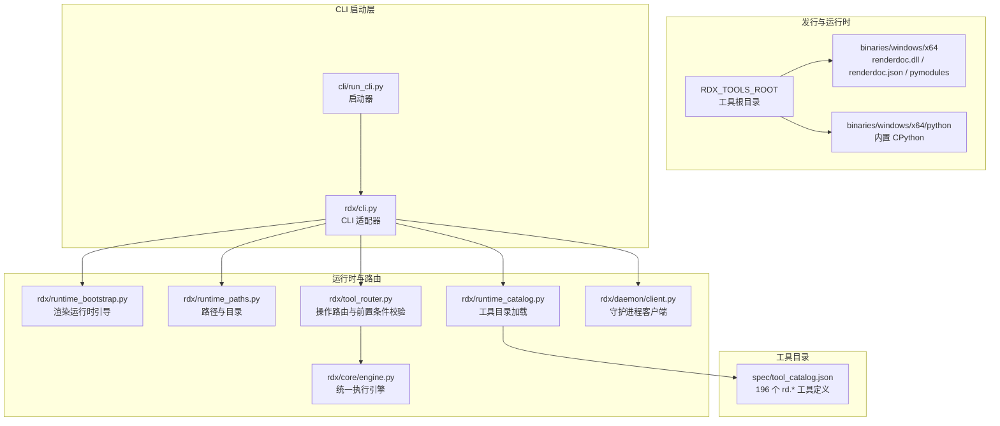
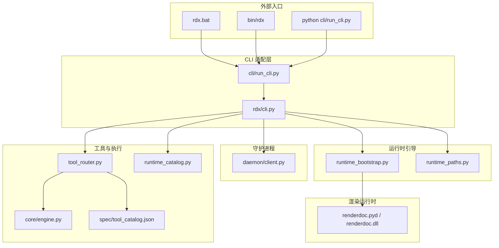
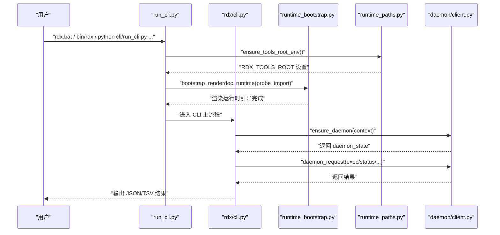
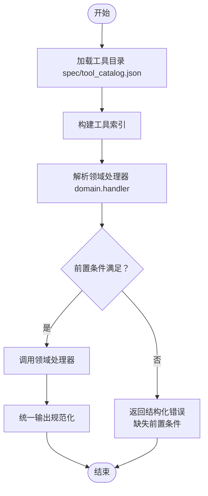
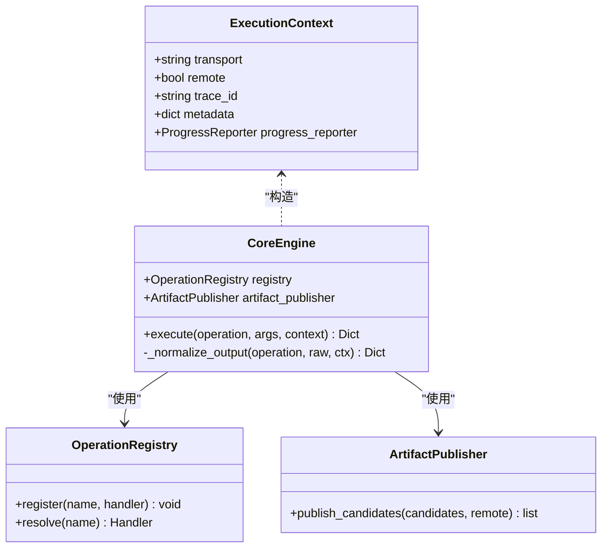
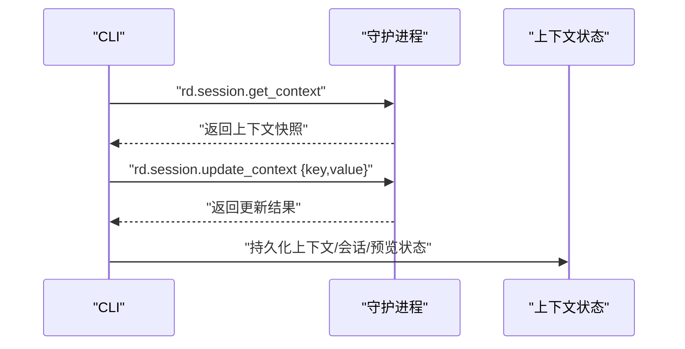
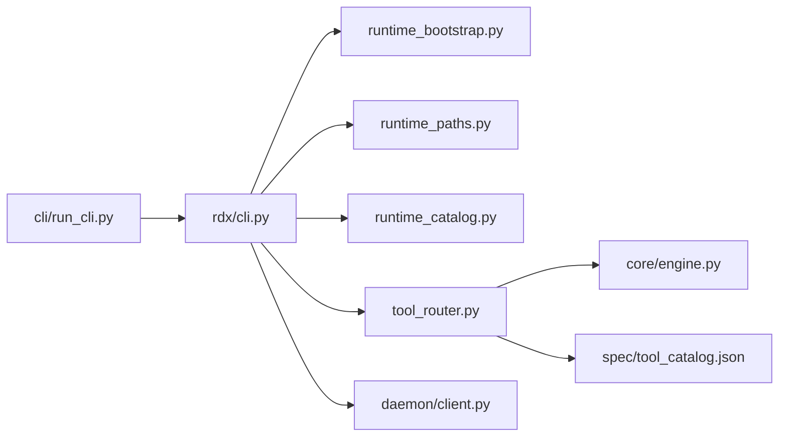

# 项目概述

<cite>
**本文引用的文件**
- [README.md](file://README.md)
- [docs/README.md](file://docs/README.md)
- [docs/tools.md](file://docs/tools.md)
- [docs/session-model.md](file://docs/session-model.md)
- [docs/agent-model.md](file://docs/agent-model.md)
- [rdx/__init__.py](file://rdx/__init__.py)
- [cli/run_cli.py](file://cli/run_cli.py)
- [rdx/cli.py](file://rdx/cli.py)
- [spec/tool_catalog.json](file://spec/tool_catalog.json)
- [rdx/runtime_catalog.py](file://rdx/runtime_catalog.py)
- [rdx/daemon/client.py](file://rdx/daemon/client.py)
- [rdx/core/engine.py](file://rdx/core/engine.py)
- [rdx/tool_router.py](file://rdx/tool_router.py)
- [rdx/runtime_paths.py](file://rdx/runtime_paths.py)
- [rdx/runtime_bootstrap.py](file://rdx/runtime_bootstrap.py)
</cite>

## 目录
1. [简介](#简介)
2. [项目结构](#项目结构)
3. [核心组件](#核心组件)
4. [架构总览](#架构总览)
5. [详细组件分析](#详细组件分析)
6. [依赖关系分析](#依赖关系分析)
7. [性能考量](#性能考量)
8. [故障排查指南](#故障排查指南)
9. [结论](#结论)
10. [附录](#附录)

## 简介
RDX-Tools 是一个仅面向命令行（CLI-only）的 RenderDoc 运行时包，提供 196 个以 “rd.*” 命名的工具，通过统一的 CLI 入口对外提供稳定协议与一致的 JSON 结果封装。项目定位为 GPU 调试生态中的“本地优先”运行时与工具集，强调：
- 本地优先：通过内置的 RenderDoc 运行时与守护进程协作，确保在无图形桌面环境下也能稳定运行。
- CLI 优先：所有公共接口均通过 CLI 暴露，支持 Windows 批处理脚本、POSIX Shell 与 Python 启动器三种入口。
- 可组合的工具集：围绕会话（session）、捕获（capture）、事件（event）、管线（pipeline）、资源（resource）、着色器（shader）、纹理（texture）、缓冲（buffer）、VFS 探索等维度，形成覆盖调试全流程的工具矩阵。

项目目标用户：
- CLI 用户与自动化流水线：通过 rdx.bat、bin/rdx 或 python cli/run_cli.py 直接调用。
- GPU 调试主机与 CI 环境：在无 GUI 的服务器或容器中稳定运行，结合守护进程实现持续上下文与会话生命周期管理。

## 项目结构
仓库采用“模块化+功能域”组织方式，核心目录与职责概览如下：
- bin/ 与 binaries/：Windows x64 自包含发行包，包含 renderdoc.dll、renderdoc.json 与 Python 运行时。
- cli/：独立 Python 启动器，负责环境初始化、依赖检查、守护进程引导与 CLI 路由。
- docs/：官方文档集合，涵盖安装、会话模型、代理模型、稳定性、工具说明等。
- intermediate/：中间产物与运行时状态目录（日志、工件、运行时状态等）。
- rdx/：核心运行时与工具路由层，包含 CLI 适配器、守护进程客户端、引擎、工具目录、路径与引导逻辑。
- scripts/：发布、校验、烟雾测试与打包脚本。
- spec/：工具目录规范与校验工具。

**图表来源**
- [cli/run_cli.py:1-290](file://cli/run_cli.py#L1-L290)
- [rdx/cli.py:1-800](file://rdx/cli.py#L1-L800)
- [rdx/runtime_bootstrap.py:1-131](file://rdx/runtime_bootstrap.py#L1-L131)
- [rdx/runtime_paths.py:1-122](file://rdx/runtime_paths.py#L1-L122)
- [rdx/runtime_catalog.py:1-29](file://rdx/runtime_catalog.py#L1-L29)
- [rdx/tool_router.py:1-151](file://rdx/tool_router.py#L1-L151)
- [rdx/core/engine.py:1-204](file://rdx/core/engine.py#L1-L204)
- [rdx/daemon/client.py:1-833](file://rdx/daemon/client.py#L1-L833)
- [spec/tool_catalog.json:1-800](file://spec/tool_catalog.json#L1-L800)

**章节来源**
- [README.md:1-58](file://README.md#L1-L58)
- [docs/README.md:1-19](file://docs/README.md#L1-L19)

## 核心组件
- CLI 启动器与适配器
  - 独立 Python 启动器负责环境初始化、依赖检查、守护进程引导与 CLI 命令解析。
  - CLI 适配器负责将命令映射到守护进程请求、工具目录查询、上下文与会话状态管理、以及结果格式化输出（JSON/TSV）。
- 渲染运行时引导
  - 在 Windows 平台通过注册 DLL 目录、注入 PATH 与 sys.path，确保 renderdoc.pyd 可被导入。
- 工具目录与路由
  - 工具目录来自 spec/tool_catalog.json，包含 196 个 rd.* 工具的分组、描述、参数与前置条件。
  - 工具路由根据命名空间（domain.action）将操作分派给对应处理器，并在执行前强制前置条件。
- 统一执行引擎
  - 将不同来源的工具输出规范化为统一的 JSON 包裹结构，包含 result_kind、ok、data、artifacts、error、meta、projections 等字段。
- 守护进程客户端
  - 通过 Windows 命名管道与守护进程通信，支持启动、状态查询、心跳、客户端附着/分离、清理过期状态等。

**章节来源**
- [cli/run_cli.py:1-290](file://cli/run_cli.py#L1-L290)
- [rdx/cli.py:1-800](file://rdx/cli.py#L1-L800)
- [rdx/runtime_bootstrap.py:1-131](file://rdx/runtime_bootstrap.py#L1-L131)
- [rdx/runtime_catalog.py:1-29](file://rdx/runtime_catalog.py#L1-L29)
- [rdx/tool_router.py:1-151](file://rdx/tool_router.py#L1-L151)
- [rdx/core/engine.py:1-204](file://rdx/core/engine.py#L1-L204)
- [rdx/daemon/client.py:1-833](file://rdx/daemon/client.py#L1-L833)

## 架构总览
RDX-Tools 的整体架构遵循“CLI 适配器 + 守护进程 + 统一引擎 + 工具路由 + 渲染运行时引导”的分层设计，强调本地优先与可组合工具集：

**图表来源**
- [cli/run_cli.py:1-290](file://cli/run_cli.py#L1-L290)
- [rdx/cli.py:1-800](file://rdx/cli.py#L1-L800)
- [rdx/runtime_bootstrap.py:1-131](file://rdx/runtime_bootstrap.py#L1-L131)
- [rdx/runtime_paths.py:1-122](file://rdx/runtime_paths.py#L1-L122)
- [rdx/runtime_catalog.py:1-29](file://rdx/runtime_catalog.py#L1-L29)
- [rdx/tool_router.py:1-151](file://rdx/tool_router.py#L1-L151)
- [rdx/core/engine.py:1-204](file://rdx/core/engine.py#L1-L204)
- [rdx/daemon/client.py:1-833](file://rdx/daemon/client.py#L1-L833)
- [spec/tool_catalog.json:1-800](file://spec/tool_catalog.json#L1-L800)

## 详细组件分析

### CLI 启动器与守护进程交互流程
该序列图展示 CLI 启动器如何在执行任何工具前完成环境初始化、守护进程准备与状态检查，并最终将请求转发至守护进程。

**图表来源**
- [cli/run_cli.py:225-290](file://cli/run_cli.py#L225-L290)
- [rdx/cli.py:226-292](file://rdx/cli.py#L226-L292)
- [rdx/runtime_bootstrap.py:105-131](file://rdx/runtime_bootstrap.py#L105-L131)
- [rdx/runtime_paths.py:52-58](file://rdx/runtime_paths.py#L52-L58)
- [rdx/daemon/client.py:576-674](file://rdx/daemon/client.py#L576-L674)

**章节来源**
- [cli/run_cli.py:225-290](file://cli/run_cli.py#L225-L290)
- [rdx/cli.py:226-292](file://rdx/cli.py#L226-L292)
- [rdx/daemon/client.py:576-674](file://rdx/daemon/client.py#L576-L674)

### 工具路由与前置条件强制
工具路由根据工具目录中的元数据，将 rd.* 命名的工具映射到对应的领域处理器，并在执行前强制前置条件（如 capture_file_id、session_id、active_event_id、remote_id、capability.remote 等），避免无效调用导致的运行时错误。

**图表来源**
- [rdx/tool_router.py:59-151](file://rdx/tool_router.py#L59-L151)
- [spec/tool_catalog.json:1-800](file://spec/tool_catalog.json#L1-L800)

**章节来源**
- [rdx/tool_router.py:59-151](file://rdx/tool_router.py#L59-L151)
- [rdx/runtime_catalog.py:16-29](file://rdx/runtime_catalog.py#L16-L29)

### 统一执行引擎与结果封装
统一执行引擎负责：
- 解析操作与参数，调用对应处理器；
- 将原始输出标准化为统一的 JSON 包裹结构；
- 记录 trace_id、transport、duration_ms 等元信息；
- 发布工件（artifacts）与投影（projections）。

**图表来源**
- [rdx/core/engine.py:21-204](file://rdx/core/engine.py#L21-L204)

**章节来源**
- [rdx/core/engine.py:21-204](file://rdx/core/engine.py#L21-L204)

### 会话模型与上下文状态
- CLI 运行时按守护进程上下文（daemon context）存储上下文状态。通过 rdx context status 获取当前状态，通过 rdx context update 更新 notes、focus 等代理可见元数据。
- session_locator 汇总当前活跃的 .rdc、会话、帧与事件；preview.display 提供稳定的帧缓冲表面与窗口几何信息。

**图表来源**
- [docs/session-model.md:1-12](file://docs/session-model.md#L1-L12)
- [rdx/cli.py:735-747](file://rdx/cli.py#L735-L747)

**章节来源**
- [docs/session-model.md:1-12](file://docs/session-model.md#L1-L12)
- [rdx/cli.py:735-747](file://rdx/cli.py#L735-L747)

### 代理模型与工具使用建议
- 代理应将 rdx-tools 视为仅 CLI 的工具集，优先使用 rdx.bat、bin/rdx 或 python cli/run_cli.py。
- 使用 VFS 作为运行时探索层：先 rdx vfs ls /，再用 tree/cat 定位具体上下文与资源，最后选择精确的 rd.* 工具。
- 当远程状态显示 remote_handle_consumed 时，不要复用该远程句柄，需通过远程生命周期工具重新连接或重建。

**章节来源**
- [docs/agent-model.md:1-16](file://docs/agent-model.md#L1-L16)

## 依赖关系分析
- CLI 启动器依赖运行时路径与引导模块，确保渲染运行时可用。
- CLI 适配器依赖工具目录与路由模块，将命令映射到具体操作。
- 工具路由依赖工具目录与领域处理器，执行前强制前置条件。
- 统一执行引擎依赖操作注册表与工件发布器，负责输出标准化。
- 守护进程客户端依赖 Windows 命名管道与状态文件，负责与守护进程通信与状态维护。

**图表来源**
- [cli/run_cli.py:1-290](file://cli/run_cli.py#L1-L290)
- [rdx/cli.py:1-800](file://rdx/cli.py#L1-L800)
- [rdx/runtime_bootstrap.py:1-131](file://rdx/runtime_bootstrap.py#L1-L131)
- [rdx/runtime_paths.py:1-122](file://rdx/runtime_paths.py#L1-L122)
- [rdx/runtime_catalog.py:1-29](file://rdx/runtime_catalog.py#L1-L29)
- [rdx/tool_router.py:1-151](file://rdx/tool_router.py#L1-L151)
- [rdx/core/engine.py:1-204](file://rdx/core/engine.py#L1-L204)
- [rdx/daemon/client.py:1-833](file://rdx/daemon/client.py#L1-L833)
- [spec/tool_catalog.json:1-800](file://spec/tool_catalog.json#L1-L800)

**章节来源**
- [cli/run_cli.py:1-290](file://cli/run_cli.py#L1-L290)
- [rdx/cli.py:1-800](file://rdx/cli.py#L1-L800)
- [rdx/tool_router.py:1-151](file://rdx/tool_router.py#L1-L151)

## 性能考量
- 守护进程超时策略：CLI 适配器根据操作类型动态计算超时，避免长时间阻塞；当等待响应超时时，提供包含活动请求数、当前操作与守护进程状态的诊断信息，便于快速定位瓶颈。
- 输出格式优化：TSV 投影仅用于列表/导航输出，复杂上下文、管线、着色器与预览数据仍以 JSON 返回，减少不必要的文本转换开销。
- 工件发布：统一的工件发布器在成功与失败路径上均进行候选收集与发布，避免重复 IO 与冗余拷贝。

[本节为通用指导，无需特定文件引用]

## 故障排查指南
- 环境与依赖检查
  - 使用 rdx doctor 输出完整诊断信息，包括 Python 运行时、渲染运行时布局、工具目录、守护进程状态与入口脚本存在性等。
  - 若缺失依赖，CLI 启动器会直接输出错误并返回非零退出码，便于在自动化脚本中识别。
- 守护进程状态
  - 通过 rdx daemon status 获取守护进程运行状态与当前状态快照；若异常，CLI 适配器会尝试清理过期状态并提示恢复建议。
- 超时与恢复
  - 当守护进程请求超时，CLI 适配器会返回包含操作名、上下文 ID、超时秒数、活动请求数与当前状态摘录的错误载荷，并给出恢复提示（如清理上下文或运行关闭）。
- 上下文隔离
  - 多个守护进程上下文相互隔离，若出现状态不一致，可通过 rdx context list 查看已知命名空间，使用 rdx context clear 清理选定上下文后再重试。

**章节来源**
- [rdx/cli.py:393-515](file://rdx/cli.py#L393-L515)
- [rdx/cli.py:250-292](file://rdx/cli.py#L250-L292)
- [rdx/daemon/client.py:420-468](file://rdx/daemon/client.py#L420-L468)
- [docs/session-model.md:1-12](file://docs/session-model.md#L1-L12)

## 结论
RDX-Tools 以“本地优先、CLI 优先”的理念，为 GPU 调试生态提供了稳定、可组合且可自动化集成的 RenderDoc 运行时与工具集。通过 196 个 “rd.*” 工具与统一的 CLI 接口，项目能够覆盖从捕获、回放到事件导航、管线状态检查、资源与着色器分析的全链路调试需求。配合守护进程与上下文状态管理，RDX-Tools 在无 GUI 的环境中同样具备强大的调试与自动化能力。

[本节为总结性内容，无需特定文件引用]

## 附录

### 196 个 rd.* 工具概览与分类
工具目录定义了 196 个 rd.* 工具，覆盖以下主要分组：
- 核心与环境管理（Core & Environment）
- 捕获文件与 Replay Session（Capture & Replay）
- 事件导航与 API 检查（Event Navigation & API Inspection）
- 管线状态查询（Pipeline State Inspection）
- 资源探查（Resource Inspection & History）
- 纹理数据访问与分析（Texture Data Access & Analysis）
- 缓冲区与网格数据访问（Buffer & Mesh Data Access）
- Shader 探查、反射与替换（Shader Inspection & Replacement）
- Shader Debugger 与像素/顶点级调试（Shader Debugging）
- 性能与高级分析（Performance & Advanced Analysis）
- 导出、报告与可复现打包（Export & Reporting）
- 远程连接与自动化抓帧（Remote Capture & Target Control）
- 诊断工具（Diagnostics, Heuristic Checks）
- 专家级宏工作流（Expert Macro Workflows）
- 通用辅助工具（Utilities, Optional）
- 上下文快照工具（Context Snapshot Tools）
- VFS 导航工具（VFS Navigation Tools）

**章节来源**
- [docs/tools.md:1-27](file://docs/tools.md#L1-L27)
- [spec/tool_catalog.json:1-800](file://spec/tool_catalog.json#L1-L800)