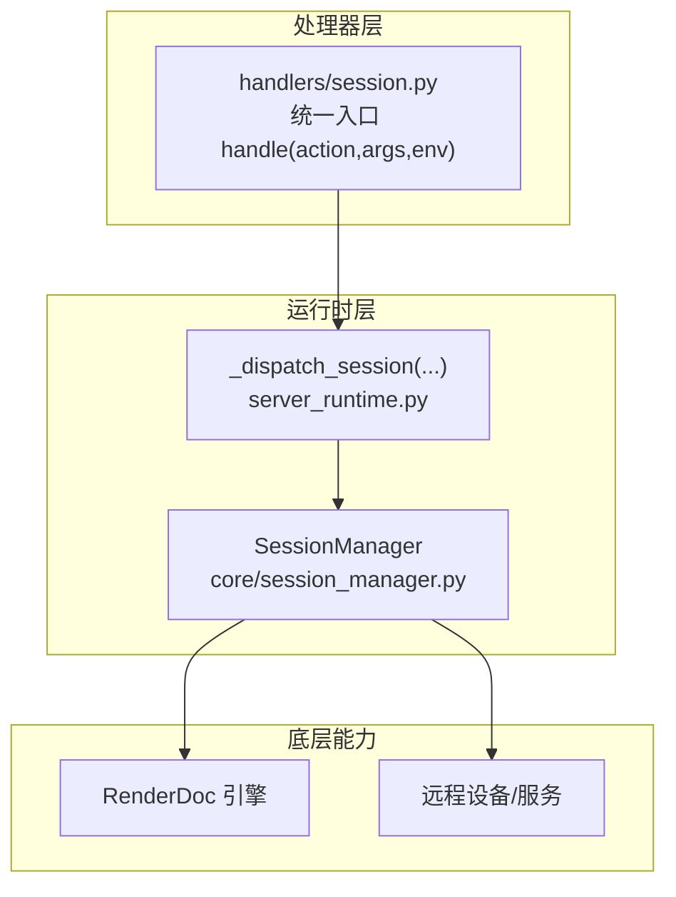
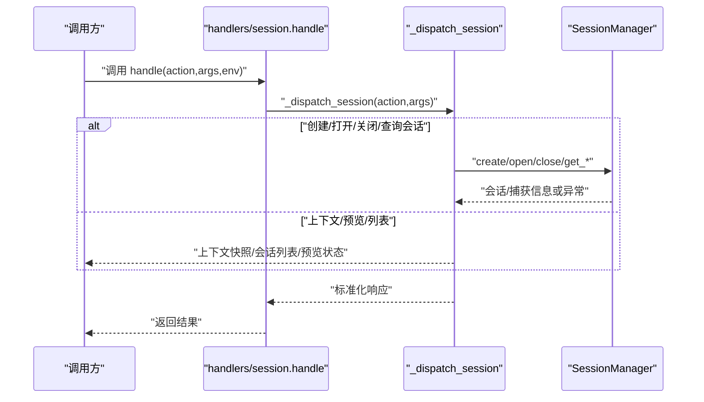
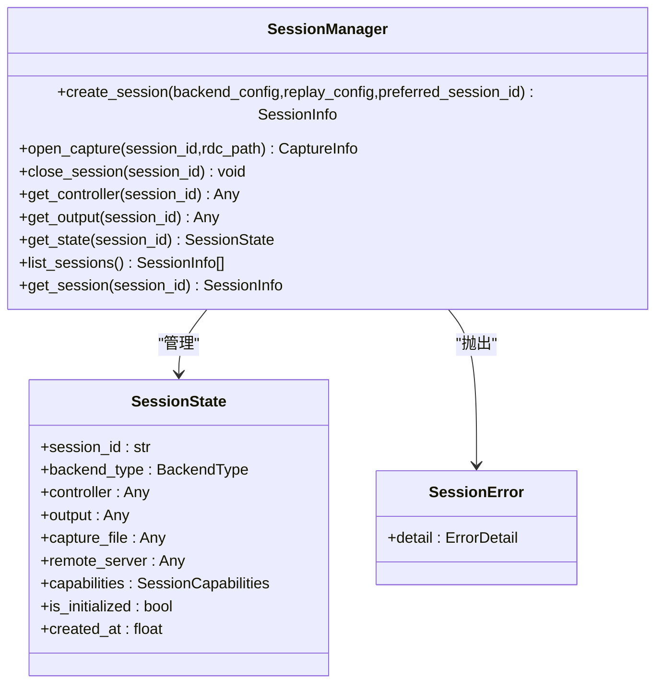
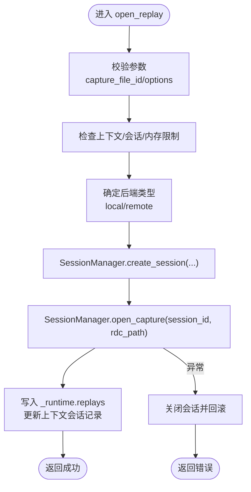
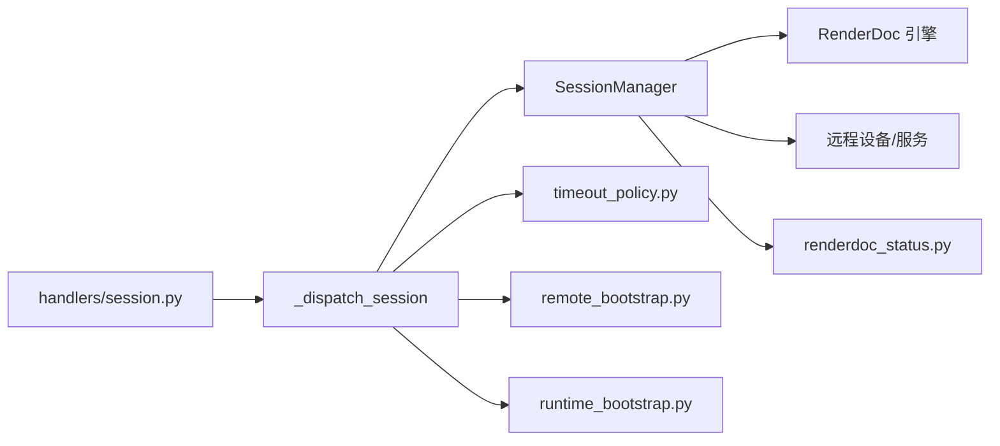

# 会话处理器

<cite>
**本文引用的文件**
- [rdx/handlers/session.py](file://rdx/handlers/session.py)
- [rdx/server_runtime.py](file://rdx/server_runtime.py)
- [rdx/core/session_manager.py](file://rdx/core/session_manager.py)
- [rdx/models.py](file://rdx/models.py)
- [rdx/timeout_policy.py](file://rdx/timeout_policy.py)
- [rdx/remote_bootstrap.py](file://rdx/remote_bootstrap.py)
- [rdx/runtime_bootstrap.py](file://rdx/runtime_bootstrap.py)
- [rdx/core/renderdoc_status.py](file://rdx/core/renderdoc_status.py)
- [rdx/cli.py](file://rdx/cli.py)
- [tests/test_server_event_pipeline_resource.py](file://tests/test_server_event_pipeline_resource.py)
</cite>

## 目录
1. [简介](#简介)
2. [项目结构](#项目结构)
3. [核心组件](#核心组件)
4. [架构总览](#架构总览)
5. [详细组件分析](#详细组件分析)
6. [依赖分析](#依赖分析)
7. [性能考虑](#性能考虑)
8. [故障排查指南](#故障排查指南)
9. [结论](#结论)
10. [附录：使用示例与最佳实践](#附录使用示例与最佳实践)

## 简介
本文件系统化阐述“会话处理器”的设计与实现，覆盖会话生命周期管理、上下文状态处理、会话状态转换逻辑，以及与 server_runtime 的交互方式与数据流转。文档同时给出 handle 函数的参数结构、返回值格式、错误处理机制，并提供会话创建、更新、销毁等操作的使用示例与最佳实践（并发控制、性能优化、状态验证）。

## 项目结构
会话处理涉及三层协作：
- 处理器层：对外暴露统一入口，将请求转发给运行时调度器
- 运行时层：集中编排上下文、会话、捕获文件、远程设备等资源
- 会话管理层：封装底层渲染回放能力（本地/远程），负责会话的创建、打开捕获、关闭与清理

图示来源
- [rdx/handlers/session.py:8-9](file://rdx/handlers/session.py#L8-L9)
- [rdx/server_runtime.py:6571](file://rdx/server_runtime.py#L6571)
- [rdx/core/session_manager.py:147](file://rdx/core/session_manager.py#L147)

章节来源
- [rdx/handlers/session.py:1-11](file://rdx/handlers/session.py#L1-L11)
- [rdx/server_runtime.py:6570-7200](file://rdx/server_runtime.py#L6570-L7200)
- [rdx/core/session_manager.py:147-547](file://rdx/core/session_manager.py#L147-L547)

## 核心组件
- 会话处理器（handlers/session.py）
  - 暴露异步 handle(action, args, env)，仅做参数透传与分发
- 会话调度器（server_runtime.py::_dispatch_session）
  - 负责上下文选择、会话列表、选中会话、恢复会话、预览开关等
  - 与会话管理器协同完成会话创建、打开捕获、关闭等
- 会话管理器（core/session_manager.py::SessionManager）
  - 单例模式，线程安全（锁保护）
  - 封装本地/远程回放初始化、捕获打开、输出创建、清理回收
- 数据模型（models.py）
  - 定义 SessionInfo/CaptureInfo 等关键类型，用于跨层传递

章节来源
- [rdx/handlers/session.py:8-9](file://rdx/handlers/session.py#L8-L9)
- [rdx/server_runtime.py:6570-7200](file://rdx/server_runtime.py#L6570-L7200)
- [rdx/core/session_manager.py:147-547](file://rdx/core/session_manager.py#L147-L547)
- [rdx/models.py](file://rdx/models.py)

## 架构总览
会话处理的关键流程如下：

图示来源
- [rdx/handlers/session.py:8-9](file://rdx/handlers/session.py#L8-L9)
- [rdx/server_runtime.py:6571](file://rdx/server_runtime.py#L6571)
- [rdx/core/session_manager.py:147](file://rdx/core/session_manager.py#L147)

## 详细组件分析

### 组件A：会话处理器（handlers/session.py）
- 角色定位
  - 作为统一入口，屏蔽上层对具体运行时实现的依赖
- 关键点
  - 参数：action（字符串）、args（字典）、env（环境字典）
  - 返回：await server_runtime._dispatch_session(...) 的结果
  - 错误：不在此层抛出业务异常，交由运行时统一包装为标准响应

章节来源
- [rdx/handlers/session.py:8-9](file://rdx/handlers/session.py#L8-L9)

### 组件B：会话调度器（server_runtime.py::_dispatch_session）
- 功能范围
  - 上下文管理：获取/创建/列出/切换/清空上下文
  - 会话管理：列出、选择、恢复、打开预览/关闭预览
  - 会话动作：create_context、list_contexts、select_context、clear_context、update_context
  - 预览动作：open_preview、close_preview
- 关键行为
  - 自动同步预览状态（在需要时）
  - 从上下文状态中投影当前会话、会话列表、限制与指标
  - 对于远程后端，构建远程能力矩阵以指导工具可用性

章节来源
- [rdx/server_runtime.py:6570-6785](file://rdx/server_runtime.py#L6570-L6785)

### 组件C：会话管理器（core/session_manager.py::SessionManager）
- 设计要点
  - 单例：确保全局唯一实例，避免重复初始化
  - 并发：使用 asyncio.Lock 串行化关键路径，保证会话表一致性
  - 生命周期
    - 创建：分配 session_id，设置后端类型（本地/远程），初始化回放子系统
    - 打开捕获：本地通过 RenderDoc 打开文件并建立控制器；远程通过远程服务器复制/打开捕获
    - 关闭：释放输出、控制器、捕获文件、远程连接等资源
- 关键方法
  - create_session：创建会话并返回 SessionInfo
  - open_capture：打开指定 .rdc 捕获，返回 CaptureInfo
  - close_session：移除会话并清理资源
  - get_controller/get_output/get_state/list_sessions/get_session

图示来源
- [rdx/core/session_manager.py:147-547](file://rdx/core/session_manager.py#L147-L547)

章节来源
- [rdx/core/session_manager.py:147-547](file://rdx/core/session_manager.py#L147-L547)

### 组件D：与 server_runtime 的交互与数据流
- 会话创建与打开捕获
  - server_runtime 在 open_replay 中根据 capture_file_id 获取句柄，决定后端类型（本地/远程），随后委托 SessionManager 完成创建与打开
  - 成功后写入运行时状态（_runtime.replays、上下文会话记录），并持久化进度
- 会话关闭
  - close_replay 先释放补丁引擎、清理会话级资源，再调用 SessionManager.close_session
- 会话恢复
  - resume 会尝试恢复上下文内所有会话，若失败则返回错误详情

图示来源
- [rdx/server_runtime.py:6926-7108](file://rdx/server_runtime.py#L6926-L7108)
- [rdx/core/session_manager.py:174-257](file://rdx/core/session_manager.py#L174-L257)

章节来源
- [rdx/server_runtime.py:6926-7108](file://rdx/server_runtime.py#L6926-L7108)
- [rdx/core/session_manager.py:174-257](file://rdx/core/session_manager.py#L174-L257)

## 依赖分析
- 处理器到运行时
  - handlers/session.py 仅依赖 server_runtime._dispatch_session
- 运行时到会话管理器
  - server_runtime 在多处直接调用 SessionManager（创建、打开、关闭）
- 会话管理器到底层
  - 本地：通过 RenderDoc 初始化回放、打开捕获、创建无头输出
  - 远程：通过远程服务器连接、复制/打开捕获、创建输出
- 会话管理器到工具链
  - 渲染状态检查、远程引导、运行时引导、超时策略等

图示来源
- [rdx/handlers/session.py:5](file://rdx/handlers/session.py#L5)
- [rdx/server_runtime.py:6571](file://rdx/server_runtime.py#L6571)
- [rdx/core/session_manager.py:147](file://rdx/core/session_manager.py#L147)
- [rdx/timeout_policy.py](file://rdx/timeout_policy.py)
- [rdx/remote_bootstrap.py](file://rdx/remote_bootstrap.py)
- [rdx/runtime_bootstrap.py](file://rdx/runtime_bootstrap.py)
- [rdx/core/renderdoc_status.py](file://rdx/core/renderdoc_status.py)

章节来源
- [rdx/handlers/session.py:5](file://rdx/handlers/session.py#L5)
- [rdx/server_runtime.py:6571](file://rdx/server_runtime.py#L6571)
- [rdx/core/session_manager.py:147](file://rdx/core/session_manager.py#L147)

## 性能考虑
- 并发与锁
  - SessionManager 使用 asyncio.Lock 串行化会话表变更，避免竞态；建议外部调用尽量批量/合并请求
- I/O 与阻塞
  - 通过 _offload 将阻塞式 RenderDoc 调用移至线程池，避免阻塞事件循环
- 内存与配额
  - 运行时对上下文会话数、捕获文件数、捕获大小、估计回放内存进行限制，防止资源耗尽
- 远程传输
  - 远程回放需考虑网络延迟与带宽，合理设置超时与重试策略

章节来源
- [rdx/core/session_manager.py:169-172](file://rdx/core/session_manager.py#L169-L172)
- [rdx/server_runtime.py:392-405](file://rdx/server_runtime.py#L392-L405)
- [rdx/timeout_policy.py](file://rdx/timeout_policy.py)

## 故障排查指南
- 常见错误与定位
  - 会话不存在/冲突：SessionError(code="session_not_found"/"session_conflict")
  - 捕获已打开：SessionError(code="capture_already_open")
  - 控制器缺失：SessionError(code="controller_missing")
  - 远程连接失败：参考远程引导与连接流程的错误码
- 日志与诊断
  - 运行时在清理阶段会记录错误汇总，便于定位资源释放问题
  - 渲染状态检查函数可生成详细的 RenderDoc 状态文本与分类
- 测试与回归
  - 存在针对捕获关闭依赖关系的测试用例，可参考其断言与场景

章节来源
- [rdx/core/session_manager.py:141-145](file://rdx/core/session_manager.py#L141-L145)
- [rdx/server_runtime.py:495-546](file://rdx/server_runtime.py#L495-L546)
- [rdx/core/renderdoc_status.py](file://rdx/core/renderdoc_status.py)
- [tests/test_server_event_pipeline_resource.py:605-637](file://tests/test_server_event_pipeline_resource.py#L605-L637)

## 结论
会话处理器通过“处理器层—运行时层—会话管理层”的清晰分层，实现了会话生命周期的完整编排与可靠的状态管理。借助统一的调度接口与严格的并发控制、资源限制与错误处理机制，系统在本地与远程回放场景下均具备良好的稳定性与可维护性。

## 附录：使用示例与最佳实践

### handle 函数参数与返回
- 参数
  - action: 字符串，指示要执行的操作（如 "get_context"、"list_sessions"、"select_session"、"resume"、"open_preview"、"close_preview" 等）
  - args: 字典，承载操作所需的键值对（如 session_id、context_id、target_context_id 等）
  - env: 字典，承载环境变量或上下文信息
- 返回
  - 异步返回：由 _dispatch_session 统一包装的标准响应（成功/错误、数据、元信息）

章节来源
- [rdx/handlers/session.py:8-9](file://rdx/handlers/session.py#L8-L9)
- [rdx/server_runtime.py:6571](file://rdx/server_runtime.py#L6571)

### 会话操作示例（基于运行时接口）
- 创建上下文
  - 调用：rd.session.create_context
  - 输入：new_context_id/target_context_id/context_id
  - 输出：上下文快照、当前会话、会话列表、限制与恢复信息
- 列出/选择上下文
  - 调用：rd.session.list_contexts / rd.session.select_context
  - 输入：target_context_id
  - 输出：上下文摘要/选定上下文详情
- 清空上下文
  - 调用：rd.session.clear_context
  - 输入：target_context_id/context_id
  - 输出：清空后的上下文快照
- 更新上下文用户字段
  - 调用：rd.session.update_context
  - 输入：key、value
  - 输出：更新后的上下文快照
- 打开/关闭预览
  - 调用：rd.session.open_preview / rd.session.close_preview
  - 输入：session_id（可选）
  - 输出：预览绑定状态
- 列出/选择/恢复会话
  - 调用：rd.session.list_sessions / rd.session.select_session / rd.session.resume
  - 输入：session_id（可选）
  - 输出：当前会话、会话列表、最近操作、恢复状态

章节来源
- [rdx/server_runtime.py:6574-6785](file://rdx/server_runtime.py#L6574-L6785)

### 与 CLI 的集成示例
- CLI 在打开捕获后，会依次调用：
  - rd.session.get_context
  - 可选：rd.session.open_preview
  - 再次 rd.session.get_context
- 若任一步骤失败，CLI 将打印对应错误并终止

章节来源
- [rdx/cli.py:915-937](file://rdx/cli.py#L915-L937)

### 最佳实践
- 并发控制
  - 使用 asyncio.Lock 串行化会话表变更；避免在同一时间对同一会话进行多次并发操作
- 状态验证
  - 在执行会话操作前，先通过 rd.session.get_context 获取当前上下文与会话状态，确保 session_id 有效且 is_live
- 错误处理
  - 对于远程后端，优先检查远程句柄是否连接、是否被占用；对于本地后端，检查 RenderDoc 状态与捕获文件有效性
- 性能优化
  - 合理设置回放分辨率（replay_config.width/height），避免过大导致内存压力
  - 控制上下文会话数量与捕获文件数量，遵循运行时限制
  - 远程回放时，适当增加超时并启用重试策略

章节来源
- [rdx/core/session_manager.py:169-172](file://rdx/core/session_manager.py#L169-L172)
- [rdx/server_runtime.py:392-405](file://rdx/server_runtime.py#L392-L405)
- [rdx/timeout_policy.py](file://rdx/timeout_policy.py)