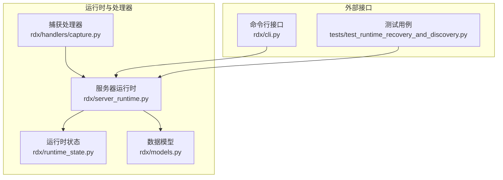
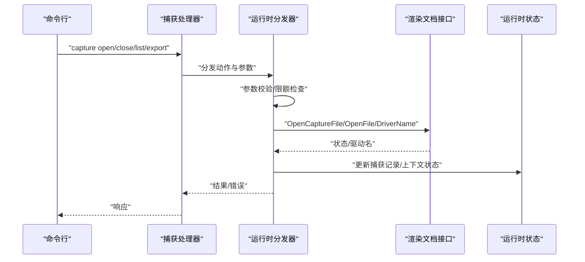
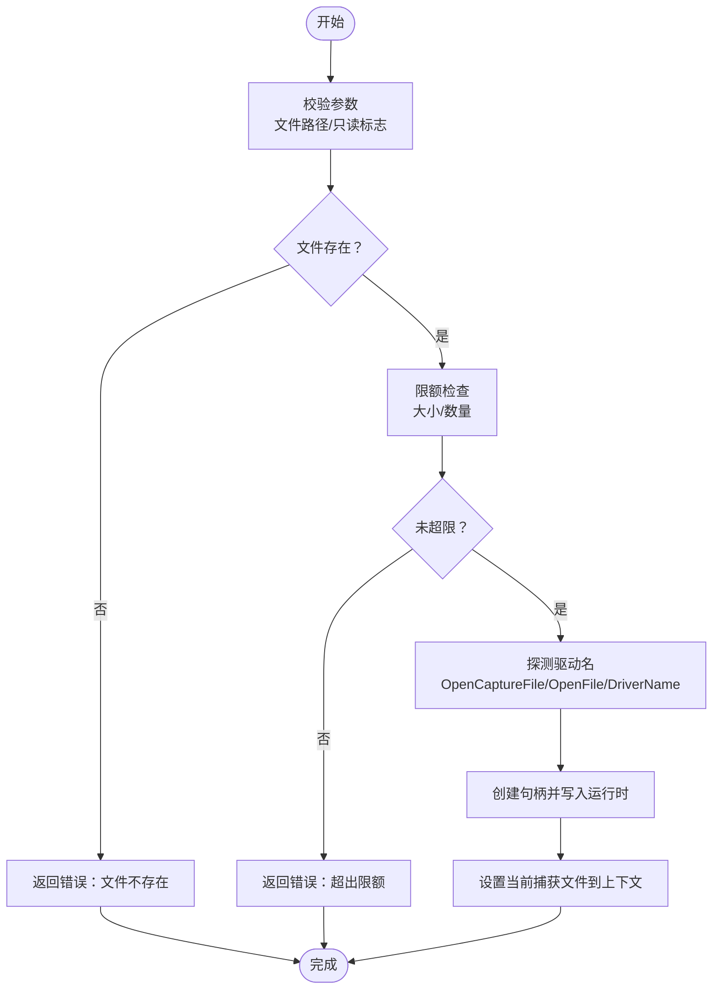
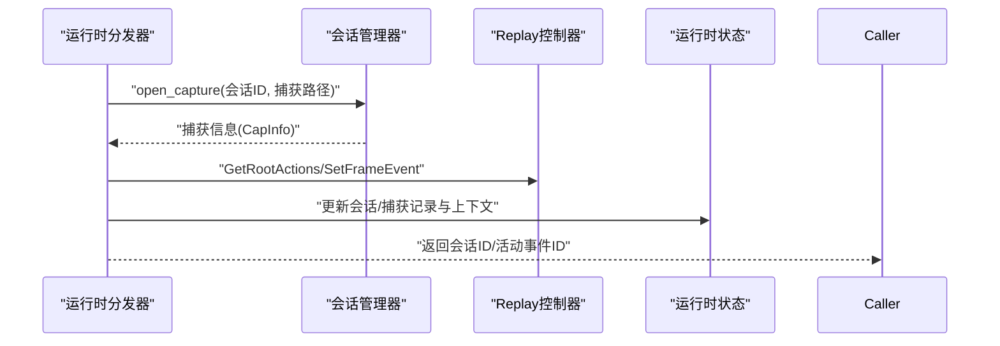
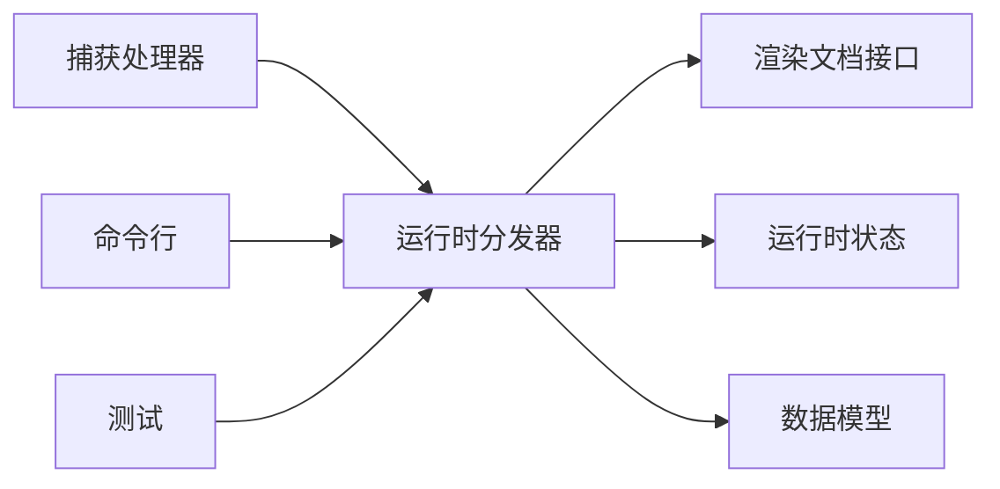

# 捕获处理器

<cite>
**本文引用的文件**
- [rdx/handlers/capture.py](file://rdx/handlers/capture.py)
- [rdx/server_runtime.py](file://rdx/server_runtime.py)
- [rdx/models.py](file://rdx/models.py)
- [rdx/cli.py](file://rdx/cli.py)
- [rdx/runtime_state.py](file://rdx/runtime_state.py)
- [tests/test_runtime_recovery_and_discovery.py](file://tests/test_runtime_recovery_and_discovery.py)
</cite>

## 目录
1. [简介](#简介)
2. [项目结构](#项目结构)
3. [核心组件](#核心组件)
4. [架构总览](#架构总览)
5. [组件详解](#组件详解)
6. [依赖关系分析](#依赖关系分析)
7. [性能考量](#性能考量)
8. [故障排查指南](#故障排查指南)
9. [结论](#结论)
10. [附录](#附录)

## 简介
本文件系统性阐述捕获处理器的设计与实现，覆盖捕获文件的读取、解析与处理流程；捕获数据的结构、格式与访问方式；捕获文件的打开、关闭、查询与导出能力；以及与Replay处理器的协作与数据共享机制。同时给出格式兼容性、错误处理与性能优化策略，帮助开发者在不同场景下正确使用与扩展该能力。

## 项目结构
捕获处理器位于运行时服务层，通过统一的分发器对外暴露操作接口，并与CLI、状态管理、Replay会话管理等模块协同工作。

图示来源
- [rdx/handlers/capture.py:1-11](file://rdx/handlers/capture.py#L1-L11)
- [rdx/server_runtime.py:6788-6865](file://rdx/server_runtime.py#L6788-L6865)
- [rdx/runtime_state.py:293-373](file://rdx/runtime_state.py#L293-L373)
- [rdx/models.py:147-157](file://rdx/models.py#L147-L157)
- [rdx/cli.py:299-329](file://rdx/cli.py#L299-L329)
- [tests/test_runtime_recovery_and_discovery.py:836-857](file://tests/test_runtime_recovery_and_discovery.py#L836-L857)

章节来源
- [rdx/handlers/capture.py:1-11](file://rdx/handlers/capture.py#L1-L11)
- [rdx/server_runtime.py:6788-6865](file://rdx/server_runtime.py#L6788-L6865)
- [rdx/runtime_state.py:293-373](file://rdx/runtime_state.py#L293-L373)
- [rdx/models.py:147-157](file://rdx/models.py#L147-L157)
- [rdx/cli.py:299-329](file://rdx/cli.py#L299-L329)
- [tests/test_runtime_recovery_and_discovery.py:836-857](file://tests/test_runtime_recovery_and_discovery.py#L836-L857)

## 核心组件
- 捕获处理器入口：将捕获动作委派给运行时分发器，负责参数校验与返回结果封装。
- 运行时分发器：实现捕获文件的打开、关闭、远程复制与删除等操作，维护上下文状态与会话映射。
- 数据模型：定义捕获信息、事件树节点、资源描述等结构化类型，支撑上层工具与服务。
- CLI集成：为命令行提供捕获打开、会话恢复、错误提示等能力。
- 运行时状态：规范化与持久化上下文状态，包括捕获文件记录、会话记录、指标与最近操作等。

章节来源
- [rdx/handlers/capture.py:8-10](file://rdx/handlers/capture.py#L8-L10)
- [rdx/server_runtime.py:6788-6865](file://rdx/server_runtime.py#L6788-L6865)
- [rdx/models.py:147-157](file://rdx/models.py#L147-L157)
- [rdx/cli.py:299-329](file://rdx/cli.py#L299-L329)
- [rdx/runtime_state.py:293-373](file://rdx/runtime_state.py#L293-L373)

## 架构总览
捕获处理器围绕“文件生命周期”与“会话生命周期”两条主线展开：前者关注捕获文件的打开、验证、元数据采集与关闭；后者关注捕获文件与Replay会话的绑定、活动事件选择与状态同步。

图示来源
- [rdx/handlers/capture.py:8-10](file://rdx/handlers/capture.py#L8-L10)
- [rdx/server_runtime.py:6788-6865](file://rdx/server_runtime.py#L6788-L6865)
- [rdx/server_runtime.py:604-626](file://rdx/server_runtime.py#L604-L626)
- [rdx/runtime_state.py:293-373](file://rdx/runtime_state.py#L293-L373)

## 组件详解

### 捕获文件打开流程
- 参数与前置检查：校验文件存在性、大小与数量限制；记录进度与指标。
- 驱动探测：通过渲染文档接口尝试打开捕获文件并读取驱动名，随后立即关闭或释放以避免资源泄漏。
- 句柄与上下文：生成捕获文件句柄并写入运行时映射，设置当前捕获文件到上下文状态。
- 返回值：包含捕获文件ID与驱动信息，供后续操作使用。

图示来源
- [rdx/server_runtime.py:6788-6865](file://rdx/server_runtime.py#L6788-L6865)
- [rdx/server_runtime.py:604-626](file://rdx/server_runtime.py#L604-L626)

章节来源
- [rdx/server_runtime.py:6788-6865](file://rdx/server_runtime.py#L6788-L6865)
- [rdx/server_runtime.py:604-626](file://rdx/server_runtime.py#L604-L626)

### 捕获文件关闭与清理
- 关闭语义：根据动作参数查找对应捕获文件ID，执行关闭逻辑并从运行时映射中移除。
- 上下文同步：更新当前捕获文件与会话快照，确保状态一致性。

章节来源
- [rdx/server_runtime.py:6864-6865](file://rdx/server_runtime.py#L6864-L6865)
- [rdx/server_runtime.py:788-795](file://rdx/server_runtime.py#L788-L795)

### 捕获文件元数据与格式
- 元数据采集：文件大小、修改时间、指纹（大小+时间戳），用于缓存与变更检测。
- 结构化模型：捕获信息包含API类型、驱动名称/版本、帧数、事件总数、缩略图等字段，便于上层工具展示与分析。

章节来源
- [rdx/server_runtime.py:604-626](file://rdx/server_runtime.py#L604-L626)
- [rdx/models.py:147-157](file://rdx/models.py#L147-L157)

### 与Replay处理器的协作与数据共享
- 会话绑定：捕获文件与Replay会话通过运行时映射关联，保存会话的帧索引、活动事件ID、后端类型等。
- 恢复与默认事件：在恢复或打开Replay时，根据根动作选择预览可用的默认事件，并设置为活动事件。
- 状态同步：运行时状态负责规范化与持久化上下文，包括捕获记录、会话记录、指标与最近操作。

图示来源
- [rdx/server_runtime.py:4682-4717](file://rdx/server_runtime.py#L4682-L4717)
- [rdx/server_runtime.py:5420-5443](file://rdx/server_runtime.py#L5420-L5443)
- [rdx/server_runtime.py:7015-7080](file://rdx/server_runtime.py#L7015-L7080)
- [rdx/runtime_state.py:293-373](file://rdx/runtime_state.py#L293-L373)

章节来源
- [rdx/server_runtime.py:4682-4717](file://rdx/server_runtime.py#L4682-L4717)
- [rdx/server_runtime.py:5420-5443](file://rdx/server_runtime.py#L5420-L5443)
- [rdx/server_runtime.py:7015-7080](file://rdx/server_runtime.py#L7015-L7080)
- [tests/test_runtime_recovery_and_discovery.py:836-857](file://tests/test_runtime_recovery_and_discovery.py#L836-L857)

### 命令行与交互
- 会话ID解析：优先从守护进程状态获取，其次从上下文快照中提取，若均不可得则提示用户先打开捕获文件。
- 输出格式：支持表格投影与TSV文本输出，便于自动化与日志分析。

章节来源
- [rdx/cli.py:299-329](file://rdx/cli.py#L299-L329)
- [rdx/cli.py:937-959](file://rdx/cli.py#L937-L959)

### 远程捕获文件操作
- 列表：枚举远程目标上的捕获文件，支持轮询与消息驱动刷新。
- 复制：将远程捕获复制到本地路径，等待文件落盘并返回保存路径与捕获记录。
- 删除：删除远程捕获文件并清理本地记录。

章节来源
- [rdx/server_runtime.py:12700-12794](file://rdx/server_runtime.py#L12700-L12794)

## 依赖关系分析
- 捕获处理器依赖运行时分发器进行实际操作。
- 运行时分发器依赖渲染文档接口进行文件打开与驱动探测。
- 运行时状态负责规范化与持久化上下文，确保跨进程/重启后的状态一致。
- 数据模型为捕获信息、事件树等提供强类型定义，提升工具链互操作性。

图示来源
- [rdx/handlers/capture.py:8-10](file://rdx/handlers/capture.py#L8-L10)
- [rdx/server_runtime.py:6788-6865](file://rdx/server_runtime.py#L6788-L6865)
- [rdx/models.py:147-157](file://rdx/models.py#L147-L157)
- [rdx/runtime_state.py:293-373](file://rdx/runtime_state.py#L293-L373)

章节来源
- [rdx/handlers/capture.py:8-10](file://rdx/handlers/capture.py#L8-L10)
- [rdx/server_runtime.py:6788-6865](file://rdx/server_runtime.py#L6788-L6865)
- [rdx/models.py:147-157](file://rdx/models.py#L147-L157)
- [rdx/runtime_state.py:293-373](file://rdx/runtime_state.py#L293-L373)

## 性能考量
- 异步与离线：大量IO与渲染文档调用通过异步离线执行，降低阻塞风险。
- 内存估算：基于捕获文件大小与配置倍数估算回放内存占用，指导资源分配。
- 限额控制：对捕获文件大小与数量进行硬性限制，防止资源耗尽。
- 状态同步：定期同步上下文指标，维持可观测性与健康度评估。

章节来源
- [rdx/server_runtime.py:623-626](file://rdx/server_runtime.py#L623-L626)
- [rdx/server_runtime.py:6798-6827](file://rdx/server_runtime.py#L6798-L6827)
- [rdx/runtime_state.py:351-373](file://rdx/runtime_state.py#L351-L373)

## 故障排查指南
- 文件不存在：检查文件路径是否正确，确认文件权限与可访问性。
- 超出限额：调整最大捕获大小或数量限制，或清理历史捕获。
- 驱动探测失败：忽略驱动名读取，不影响基本打开与回放；如需定位问题，可在调试日志中查看状态码。
- 远程操作失败：核对远程目标可达性、凭据与网络状况；重试或切换目标。
- 会话恢复异常：确认当前会话ID与捕获文件匹配，必要时重新打开捕获并选择默认事件。

章节来源
- [rdx/server_runtime.py:6794-6827](file://rdx/server_runtime.py#L6794-L6827)
- [rdx/server_runtime.py:6840-6852](file://rdx/server_runtime.py#L6840-L6852)
- [rdx/server_runtime.py:12710-12717](file://rdx/server_runtime.py#L12710-L12717)
- [tests/test_runtime_recovery_and_discovery.py:836-857](file://tests/test_runtime_recovery_and_discovery.py#L836-L857)

## 结论
捕获处理器以运行时为核心，围绕“文件生命周期”与“会话生命周期”构建了完整的捕获文件管理能力，并与Replay处理器紧密协作，形成从打开、解析到回放的闭环。通过严格的限额控制、异步离线执行与状态规范化，系统在保证稳定性的同时提供了良好的可扩展性与可观测性。

## 附录
- 捕获文件结构与字段参考：参见数据模型中的捕获信息定义。
- 常用操作路径参考：
  - 打开捕获文件：[rdx/server_runtime.py:6788-6865](file://rdx/server_runtime.py#L6788-L6865)
  - 关闭捕获文件：[rdx/server_runtime.py:6864-6865](file://rdx/server_runtime.py#L6864-L6865)
  - 远程复制捕获：[rdx/server_runtime.py:12718-12760](file://rdx/server_runtime.py#L12718-L12760)
  - 远程删除捕获：[rdx/server_runtime.py:12761-12789](file://rdx/server_runtime.py#L12761-L12789)
  - 会话恢复与默认事件选择：[rdx/server_runtime.py:7015-7080](file://rdx/server_runtime.py#L7015-L7080)
  - CLI会话ID解析：[rdx/cli.py:299-329](file://rdx/cli.py#L299-L329)